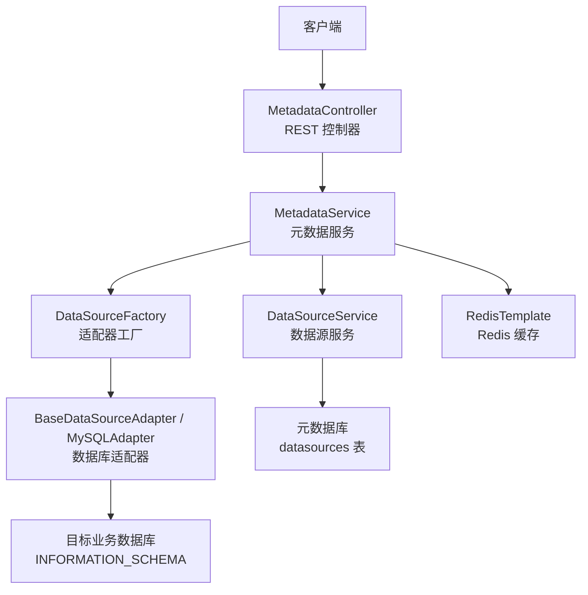
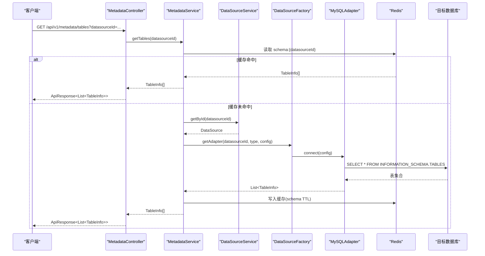
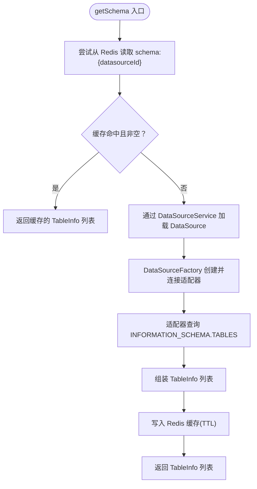
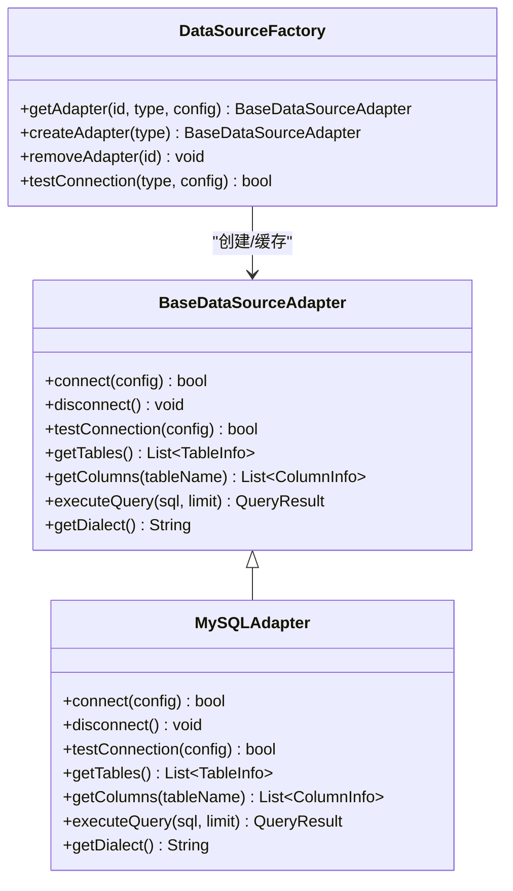
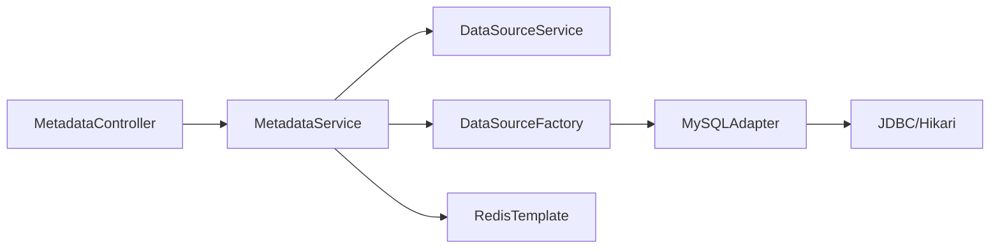

# 元数据接口

<cite>
**本文引用的文件**   
- [MetadataController.java](file://backend/src/main/java/com/nlp2sql/controller/MetadataController.java)
- [MetadataService.java](file://backend/src/main/java/com/nlp2sql/service/MetadataService.java)
- [TableInfo.java](file://backend/src/main/java/com/nlp2sql/model/TableInfo.java)
- [ColumnInfo.java](file://backend/src/main/java/com/nlp2sql/model/ColumnInfo.java)
- [DataSource.java](file://backend/src/main/java/com/nlp2sql/model/DataSource.java)
- [BaseDataSourceAdapter.java](file://backend/src/main/java/com/nlp2sql/adapter/BaseDataSourceAdapter.java)
- [MySQLAdapter.java](file://backend/src/main/java/com/nlp2sql/adapter/MySQLAdapter.java)
- [DataSourceFactory.java](file://backend/src/main/java/com/nlp2sql/adapter/DataSourceFactory.java)
- [DataSourceService.java](file://backend/src/main/java/com/nlp2sql/service/DataSourceService.java)
- [RedisConfig.java](file://backend/src/main/java/com/nlp2sql/config/RedisConfig.java)
- [GlobalExceptionHandler.java](file://backend/src/main/java/com/nlp2sql/config/GlobalExceptionHandler.java)
- [BusinessException.java](file://backend/src/main/java/com/nlp2sql/common/BusinessException.java)
- [ErrorCode.java](file://backend/src/main/java/com/nlp2sql/common/ErrorCode.java)
- [ApiResponse.java](file://backend/src/main/java/com/nlp2sql/model/dto/ApiResponse.java)
- [application.yml](file://backend/src/main/resources/application.yml)
</cite>

## 目录
1. [简介](#简介)
2. [项目结构与职责边界](#项目结构与职责边界)
3. [核心组件](#核心组件)
4. [架构总览](#架构总览)
5. [详细组件分析](#详细组件分析)
6. [依赖关系分析](#依赖关系分析)
7. [性能与缓存策略](#性能与缓存策略)
8. [元数据格式定义](#元数据格式定义)
9. [HTTP API 规范](#http-api-规范)
10. [错误码与异常处理](#错误码与异常处理)
11. [批量查询与增量更新设计建议](#批量查询与增量更新设计建议)
12. [同步与版本管理建议](#同步与版本管理建议)
13. [故障排查指南](#故障排查指南)
14. [结论](#结论)

## 简介
本文档聚焦后端“元数据管理”相关能力，说明表结构、字段信息的查询接口，以及缓存刷新机制。同时给出元数据的数据模型、缓存策略、错误码和 HTTP 端点规范。当前实现已支持：
- 按数据源获取表列表；
- 按数据源和表名获取字段列表；
- 通过 Redis 缓存 Schema，并支持刷新缓存；
- 基于适配器模式访问底层数据库（以 MySQL 为例）；
- 全局异常处理与统一响应体。

## 项目结构与职责边界
元数据能力涉及控制器、服务、适配器、配置和公共模块五类文件：
- 控制器层：暴露 REST 接口；
- 服务层：封装缓存、数据源加载、Schema 组装逻辑；
- 适配器层：屏蔽不同数据库差异，读取 INFORMATION_SCHEMA；
- 配置层：Redis 序列化、全局异常处理、应用配置；
- 公共层：错误码、业务异常、统一响应体。

图表来源
- [MetadataController.java:1-38](file://backend/src/main/java/com/nlp2sql/controller/MetadataController.java#L1-L38)
- [MetadataService.java:1-93](file://backend/src/main/java/com/nlp2sql/service/MetadataService.java#L1-L93)
- [DataSourceFactory.java:1-49](file://backend/src/main/java/com/nlp2sql/adapter/DataSourceFactory.java#L1-L49)
- [MySQLAdapter.java:1-203](file://backend/src/main/java/com/nlp2sql/adapter/MySQLAdapter.java#L1-L203)
- [RedisConfig.java:1-24](file://backend/src/main/java/com/nlp2sql/config/RedisConfig.java#L1-L24)

章节来源
- [MetadataController.java:1-38](file://backend/src/main/java/com/nlp2sql/controller/MetadataController.java#L1-L38)
- [MetadataService.java:1-93](file://backend/src/main/java/com/nlp2sql/service/MetadataService.java#L1-L93)
- [application.yml:1-117](file://backend/src/main/resources/application.yml#L1-L117)

## 核心组件
- MetadataController：对外提供 /api/v1/metadata 下三个接口。
- MetadataService：负责从 Redis 或数据源读取 Schema，构造 TableInfo 列表，并提供缓存刷新。
- DataSourceFactory：按数据源类型创建并缓存适配器实例。
- BaseDataSourceAdapter / MySQLAdapter：抽象与实现数据库连接、表/字段读取。
- RedisConfig：配置 RedisTemplate 的键值序列化方式。
- GlobalExceptionHandler：统一捕获异常并返回 ApiResponse。
- BusinessException / ErrorCode：业务异常与错误码常量。
- ApiResponse：统一响应结构 {code, message, data}。
- DataSource：持久化数据源连接信息，供适配器使用。

章节来源
- [MetadataController.java:1-38](file://backend/src/main/java/com/nlp2sql/controller/MetadataController.java#L1-L38)
- [MetadataService.java:1-93](file://backend/src/main/java/com/nlp2sql/service/MetadataService.java#L1-L93)
- [DataSourceFactory.java:1-49](file://backend/src/main/java/com/nlp2sql/adapter/DataSourceFactory.java#L1-L49)
- [BaseDataSourceAdapter.java:1-25](file://backend/src/main/java/com/nlp2sql/adapter/BaseDataSourceAdapter.java#L1-L25)
- [MySQLAdapter.java:1-203](file://backend/src/main/java/com/nlp2sql/adapter/MySQLAdapter.java#L1-L203)
- [RedisConfig.java:1-24](file://backend/src/main/java/com/nlp2sql/config/RedisConfig.java#L1-L24)
- [GlobalExceptionHandler.java:1-50](file://backend/src/main/java/com/nlp2sql/config/GlobalExceptionHandler.java#L1-L50)
- [BusinessException.java:1-23](file://backend/src/main/java/com/nlp2sql/common/BusinessException.java#L1-L23)
- [ErrorCode.java:1-26](file://backend/src/main/java/com/nlp2sql/common/ErrorCode.java#L1-L26)
- [ApiResponse.java:1-33](file://backend/src/main/java/com/nlp2sql/model/dto/ApiResponse.java#L1-L33)
- [DataSource.java:1-48](file://backend/src/main/java/com/nlp2sql/model/DataSource.java#L1-L48)

## 架构总览
元数据请求的整体流程如下：
- 客户端调用控制器；
- 控制器委托服务；
- 服务优先从 Redis 读取 Schema；
- 未命中则通过数据源服务加载 DataSource，再由适配器工厂创建数据库适配器；
- 适配器查询 INFORMATION_SCHEMA 构建 TableInfo/ColumnInfo；
- 结果写回 Redis，并按需返回给前端。

图表来源
- [MetadataController.java:1-38](file://backend/src/main/java/com/nlp2sql/controller/MetadataController.java#L1-L38)
- [MetadataService.java:1-93](file://backend/src/main/java/com/nlp2sql/service/MetadataService.java#L1-L93)
- [DataSourceService.java:1-95](file://backend/src/main/java/com/nlp2sql/service/DataSourceService.java#L1-L95)
- [DataSourceFactory.java:1-49](file://backend/src/main/java/com/nlp2sql/adapter/DataSourceFactory.java#L1-L49)
- [MySQLAdapter.java:1-203](file://backend/src/main/java/com/nlp2sql/adapter/MySQLAdapter.java#L1-L203)
- [RedisConfig.java:1-24](file://backend/src/main/java/com/nlp2sql/config/RedisConfig.java#L1-L24)

## 详细组件分析

### MetadataController：REST 接口入口
- 基础路径：/api/v1/metadata
- 提供：
  - 获取表列表；
  - 获取某表字段列表；
  - 刷新指定数据源的 Schema 缓存。

职责要点：
- 参数校验由 Spring MVC 完成；
- 所有响应通过 ApiResponse 包装；
- 不直接访问数据库或缓存，全部委托 MetadataService。

章节来源
- [MetadataController.java:1-38](file://backend/src/main/java/com/nlp2sql/controller/MetadataController.java#L1-L38)

### MetadataService：元数据服务
核心能力：
- getSchema：优先读 Redis，未命中则查数据源并落库；
- refreshCache：删除 Redis 缓存、移除适配器缓存，再重建；
- getTables：仅返回表名和注释；
- getColumns：根据表名过滤出字段列表。

关键实现细节：
- 缓存键前缀：schema: + datasourceId；
- TTL 来自配置 schema-cache.ttl-seconds；
- 对 Redis 读写失败做降级日志记录；
- 刷新时先删除缓存键，再清理适配器工厂的连接池。

图表来源
- [MetadataService.java:1-93](file://backend/src/main/java/com/nlp2sql/service/MetadataService.java#L1-L93)
- [application.yml:1-117](file://backend/src/main/resources/application.yml#L1-L117)

章节来源
- [MetadataService.java:1-93](file://backend/src/main/java/com/nlp2sql/service/MetadataService.java#L1-L93)

### 适配器层：BaseDataSourceAdapter 与 MySQLAdapter
- BaseDataSourceAdapter 定义了连接、断开、建连测试、获取表/字段、执行 SQL、方言等统一接口；
- MySQLAdapter 基于 HikariCP 连接池与 JDBC 访问 INFORMATION_SCHEMA，构造 TableInfo/ColumnInfo；
- DataSourceFactory 维护 Long -> Adapter 的并发缓存，并在 removeAdapter 时关闭连接。

图表来源
- [BaseDataSourceAdapter.java:1-25](file://backend/src/main/java/com/nlp2sql/adapter/BaseDataSourceAdapter.java#L1-L25)
- [MySQLAdapter.java:1-203](file://backend/src/main/java/com/nlp2sql/adapter/MySQLAdapter.java#L1-L203)
- [DataSourceFactory.java:1-49](file://backend/src/main/java/com/nlp2sql/adapter/DataSourceFactory.java#L1-L49)

章节来源
- [BaseDataSourceAdapter.java:1-25](file://backend/src/main/java/com/nlp2sql/adapter/BaseDataSourceAdapter.java#L1-L25)
- [MySQLAdapter.java:1-203](file://backend/src/main/java/com/nlp2sql/adapter/MySQLAdapter.java#L1-L203)
- [DataSourceFactory.java:1-49](file://backend/src/main/java/com/nlp2sql/adapter/DataSourceFactory.java#L1-L49)

### 配置与异常处理
- RedisConfig：使用 String 序列化 Key，Jackson JSON 序列化 Value；
- GlobalExceptionHandler：
  - 业务异常返回 HTTP 200 + code/message；
  - 参数校验异常返回 400；
  - 未处理异常返回 500；
- BusinessException：携带 code 与 message；
- ErrorCode：集中定义错误码常量；
- ApiResponse：统一返回 {code, message, data}。

章节来源
- [RedisConfig.java:1-24](file://backend/src/main/java/com/nlp2sql/config/RedisConfig.java#L1-L24)
- [GlobalExceptionHandler.java:1-50](file://backend/src/main/java/com/nlp2sql/config/GlobalExceptionHandler.java#L1-L50)
- [BusinessException.java:1-23](file://backend/src/main/java/com/nlp2sql/common/BusinessException.java#L1-L23)
- [ErrorCode.java:1-26](file://backend/src/main/java/com/nlp2sql/common/ErrorCode.java#L1-L26)
- [ApiResponse.java:1-33](file://backend/src/main/java/com/nlp2sql/model/dto/ApiResponse.java#L1-L33)

## 依赖关系分析
- Controller 依赖 Service；
- Service 依赖 DataSourceService、DataSourceFactory、RedisTemplate；
- DataSourceFactory 依赖具体 Adapter 实现；
- Adapter 依赖 JDBC/Hikari 访问目标数据库；
- 全局异常处理器拦截所有异常并转换为 ApiResponse。

图表来源
- [MetadataController.java:1-38](file://backend/src/main/java/com/nlp2sql/controller/MetadataController.java#L1-L38)
- [MetadataService.java:1-93](file://backend/src/main/java/com/nlp2sql/service/MetadataService.java#L1-L93)
- [DataSourceFactory.java:1-49](file://backend/src/main/java/com/nlp2sql/adapter/DataSourceFactory.java#L1-L49)
- [MySQLAdapter.java:1-203](file://backend/src/main/java/com/nlp2sql/adapter/MySQLAdapter.java#L1-L203)

章节来源
- [MetadataController.java:1-38](file://backend/src/main/java/com/nlp2sql/controller/MetadataController.java#L1-L38)
- [MetadataService.java:1-93](file://backend/src/main/java/com/nlp2sql/service/MetadataService.java#L1-L93)
- [DataSourceFactory.java:1-49](file://backend/src/main/java/com/nlp2sql/adapter/DataSourceFactory.java#L1-L49)
- [MySQLAdapter.java:1-203](file://backend/src/main/java/com/nlp2sql/adapter/MySQLAdapter.java#L1-L203)

## 性能与缓存策略
- 缓存键：schema:{datasourceId}；
- 默认 TTL：3600 秒，可通过 application.yml 中 schema-cache.ttl-seconds 调整；
- 缓存命中率优化：
  - 首次查询后落盘，后续重复查询直接命中；
  - 刷新接口会删除缓存键并清理适配器连接；
- 适配器连接池：
  - MySQLAdapter 使用 HikariCP，默认最大连接数 5，空闲超时 300 秒；
  - DataSourceFactory 内维护 Long -> Adapter 的缓存，避免频繁创建连接；
- 建议优化：
  - 对大库可考虑分库/分表维度缓存；
  - 增加二级缓存或本地 Caffeine 缓存以减少跨节点不一致；
  - 为高频表字段提供独立缓存键，减少全量 Schema 传输成本。

章节来源
- [MetadataService.java:1-93](file://backend/src/main/java/com/nlp2sql/service/MetadataService.java#L1-L93)
- [application.yml:1-117](file://backend/src/main/resources/application.yml#L1-L117)
- [MySQLAdapter.java:1-203](file://backend/src/main/java/com/nlp2sql/adapter/MySQLAdapter.java#L1-L203)
- [DataSourceFactory.java:1-49](file://backend/src/main/java/com/nlp2sql/adapter/DataSourceFactory.java#L1-L49)

## 元数据格式定义
- TableInfo：
  - tableName：表名；
  - comment：表注释；
  - columns：字段列表（可选）。
- ColumnInfo：
  - columnName：列名；
  - dataType：数据类型（如 int、varchar）；
  - columnType：完整类型（含长度/精度）；
  - comment：列注释；
  - columnKey：主键/索引标识；
  - isNullable：是否可空；
  - defaultValue：默认值。

注意：
- getTables 返回的 TableInfo 不包含 columns，以减少带宽；
- getColumns 返回指定表的完整字段信息。

章节来源
- [TableInfo.java:1-14](file://backend/src/main/java/com/nlp2sql/model/TableInfo.java#L1-L14)
- [ColumnInfo.java:1-21](file://backend/src/main/java/com/nlp2sql/model/ColumnInfo.java#L1-L21)
- [MetadataService.java:1-93](file://backend/src/main/java/com/nlp2sql/service/MetadataService.java#L1-L93)

## HTTP API 规范

### 通用响应体
- 成功：{code: 200, message: "success", data: ...}
- 业务错误：{code: 业务错误码, message: 描述, data: null}
- 系统错误：{code: 500, message: 错误描述, data: null}

章节来源
- [ApiResponse.java:1-33](file://backend/src/main/java/com/nlp2sql/model/dto/ApiResponse.java#L1-L33)
- [GlobalExceptionHandler.java:1-50](file://backend/src/main/java/com/nlp2sql/config/GlobalExceptionHandler.java#L1-L50)

### 获取表列表
- URL：GET /api/v1/metadata/tables
- 查询参数：
  - datasourceId：Long，必填
- 响应体：
  - data：List<TableInfo>，包含 tableName、comment
- 状态码：
  - 200：成功
  - 400：参数非法
  - 500：服务器内部错误

章节来源
- [MetadataController.java:1-38](file://backend/src/main/java/com/nlp2sql/controller/MetadataController.java#L1-L38)

### 获取表字段列表
- URL：GET /api/v1/metadata/tables/{tableName}/columns
- 路径参数：
  - tableName：String，必填
- 查询参数：
  - datasourceId：Long，必填
- 响应体：
  - data：List<ColumnInfo>，包含 columnName、dataType、columnType、comment、columnKey、isNullable、defaultValue
- 状态码：
  - 200：成功
  - 400：参数非法
  - 500：服务器内部错误

章节来源
- [MetadataController.java:1-38](file://backend/src/main/java/com/nlp2sql/controller/MetadataController.java#L1-L38)

### 刷新元数据缓存
- URL：POST /api/v1/metadata/refresh
- 查询参数：
  - datasourceId：Long，必填
- 行为：
  - 删除 Redis 中该数据源的 Schema 缓存；
  - 移除对应适配器连接；
  - 重新拉取元数据并写入缓存。
- 响应体：
  - data：null
- 状态码：
  - 200：成功
  - 400：参数非法
  - 500：服务器内部错误

章节来源
- [MetadataController.java:1-38](file://backend/src/main/java/com/nlp2sql/controller/MetadataController.java#L1-L38)
- [MetadataService.java:1-93](file://backend/src/main/java/com/nlp2sql/service/MetadataService.java#L1-L93)

## 错误码与异常处理
- 统一响应体：ApiResponse(code, message, data)
- 业务异常：BusinessException(code, message)，由 GlobalExceptionHandler 捕获并返回 HTTP 200；
- 参数校验异常：返回 400；
- 未处理异常：返回 500；
- 常用错误码：
  - 400：请求参数错误；
  - 401：未授权；
  - 403：禁止访问；
  - 404：资源不存在；
  - 1001：数据源不存在；
  - 1002：数据源连接失败；
  - 1003：数据源名称重复；
  - 2001：SQL 生成失败；
  - 2002：SQL 校验失败；
  - 2003：SQL 执行失败；
  - 2004：未找到 Schema；
  - 9999：系统错误。

章节来源
- [ErrorCode.java:1-26](file://backend/src/main/java/com/nlp2sql/common/ErrorCode.java#L1-L26)
- [BusinessException.java:1-23](file://backend/src/main/java/com/nlp2sql/common/BusinessException.java#L1-L23)
- [GlobalExceptionHandler.java:1-50](file://backend/src/main/java/com/nlp2sql/config/GlobalExceptionHandler.java#L1-L50)
- [ApiResponse.java:1-33](file://backend/src/main/java/com/nlp2sql/model/dto/ApiResponse.java#L1-L33)

## 批量查询与增量更新设计建议
当前实现为全量 Schema 缓存。若需支持批量查询与增量更新，建议：
- 批量查询：
  - 新增接口 /api/v1/metadata/tables/batch，传入 datasources=[id,...]，并行拉取多数据源 Schema；
  - 分页或分片返回，避免单次响应过大；
- 增量更新：
  - 在 Meta 库中记录每个数据源的 Schema 版本号或更新时间戳；
  - 变更检测：对比上次快照与当前 INFORMATION_SCHEMA 的差异，仅更新变更表/字段；
  - 增量事件：向订阅方推送变更通知，前端按需刷新；
- 一致性保证：
  - 使用分布式锁防止同一数据源并发刷新；
  - 刷新期间允许读旧缓存，避免脏读；
  - 引入最终一致性补偿任务，定期校验缓存与真实 Schema 的一致性。

[本节为概念性设计建议，无直接代码引用]

## 同步与版本管理建议
- 版本标识：
  - 为每个数据源维护 schema_version 字段；
  - 每次刷新成功后递增版本号；
- 同步策略：
  - 后台定时任务触发增量比对；
  - 变更较大时触发全量重建；
  - 失败重试与告警；
- 灰度与回滚：
  - 新 Schema 快照以只读形式存储，切换时原子替换；
  - 保留最近 N 个版本，便于快速回滚；
- 审计追踪：
  - 记录每次刷新的开始时间、结束时间、影响表数量、错误堆栈；
  - 与现有 AuditLog 体系打通。

[本节为概念性设计建议，无直接代码引用]

## 故障排查指南
- 无法连接数据源：
  - 检查 DataSourceService.getById 是否正确返回数据源；
  - 查看 MySQLAdapter.connect 日志与 Hikari 连接池配置；
- 缓存未命中或过期：
  - 确认 Redis 连通性与序列化配置；
  - 检查 schema-cache.ttl-seconds 是否过小；
- 刷新后仍返回旧数据：
  - 确认 refreshCache 是否删除了 Redis 键；
  - 确认 DataSourceFactory.removeAdapter 是否关闭了旧连接；
- 字段为空或乱码：
  - 检查 JDBC URL 字符集与时区参数；
  - 检查 Jackson 序列化配置与数据库编码。

章节来源
- [DataSourceService.java:1-95](file://backend/src/main/java/com/nlp2sql/service/DataSourceService.java#L1-L95)
- [MySQLAdapter.java:1-203](file://backend/src/main/java/com/nlp2sql/adapter/MySQLAdapter.java#L1-L203)
- [RedisConfig.java:1-24](file://backend/src/main/java/com/nlp2sql/config/RedisConfig.java#L1-L24)
- [application.yml:1-117](file://backend/src/main/resources/application.yml#L1-L117)

## 结论
本项目已实现元数据的基础能力：表与字段查询、Redis 缓存与刷新、适配器扩展与全局异常处理。如需面向大规模数据源与高并发场景，建议补充批量查询、增量同步、版本管理与一致性保障机制，并结合监控与审计提升可观测性。