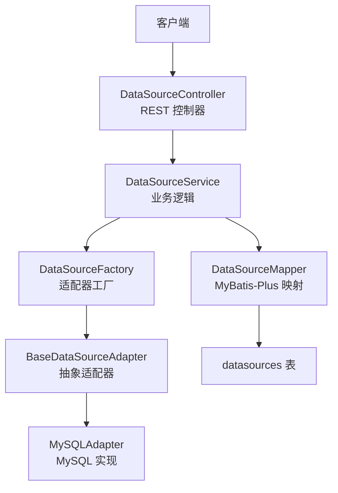
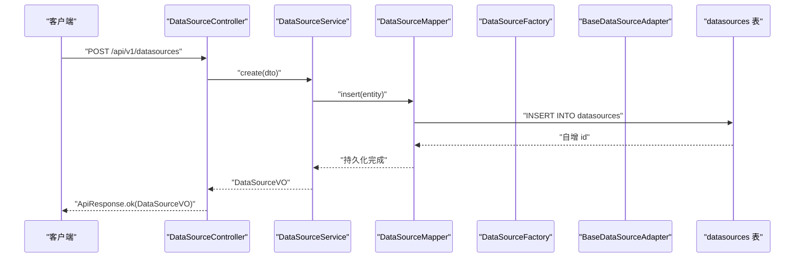
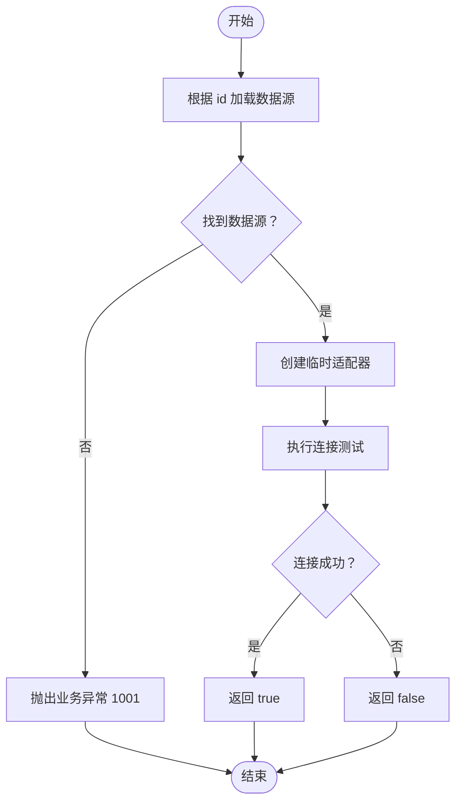
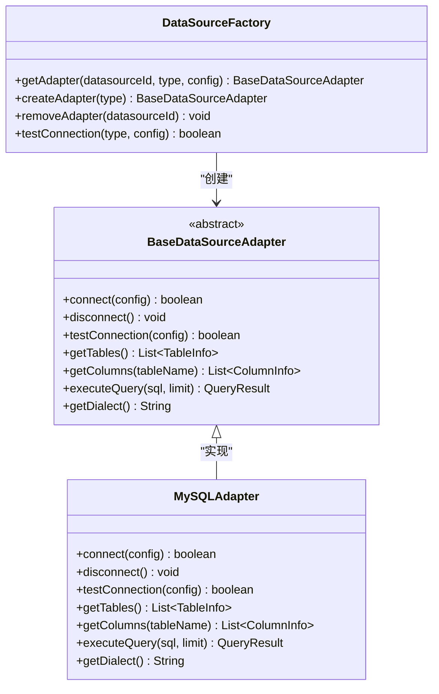
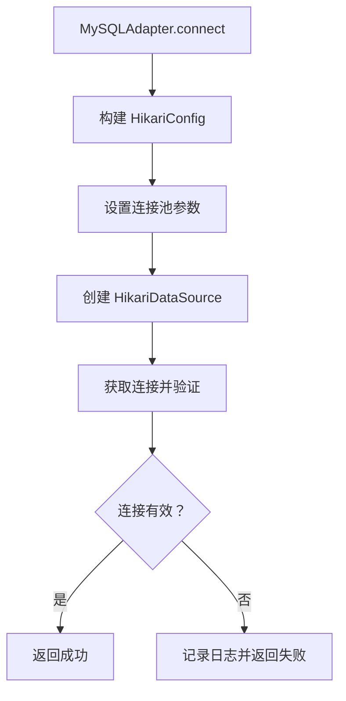

# 数据源接口

<cite>
**本文引用的文件**   
- [DataSourceController.java](file://backend/src/main/java/com/nlp2sql/controller/DataSourceController.java)
- [DataSourceService.java](file://backend/src/main/java/com/nlp2sql/service/DataSourceService.java)
- [DataSourceMapper.java](file://backend/src/main/java/com/nlp2sql/mapper/DataSourceMapper.java)
- [DataSource.java](file://backend/src/main/java/com/nlp2sql/model/DataSource.java)
- [DataSourceDTO.java](file://backend/src/main/java/com/nlp2sql/model/dto/DataSourceDTO.java)
- [DataSourceVO.java](file://backend/src/main/java/com/nlp2sql/model/vo/DataSourceVO.java)
- [ApiResponse.java](file://backend/src/main/java/com/nlp2sql/model/dto/ApiResponse.java)
- [ErrorCode.java](file://backend/src/main/java/com/nlp2sql/common/ErrorCode.java)
- [BusinessException.java](file://backend/src/main/java/com/nlp2sql/common/BusinessException.java)
- [GlobalExceptionHandler.java](file://backend/src/main/java/com/nlp2sql/config/GlobalExceptionHandler.java)
- [DataSourceFactory.java](file://backend/src/main/java/com/nlp2sql/adapter/DataSourceFactory.java)
- [BaseDataSourceAdapter.java](file://backend/src/main/java/com/nlp2sql/adapter/BaseDataSourceAdapter.java)
- [MySQLAdapter.java](file://backend/src/main/java/com/nlp2sql/adapter/MySQLAdapter.java)
</cite>

## 目录
1. [引言](#引言)
2. [项目结构定位](#项目结构定位)
3. [核心组件](#核心组件)
4. [架构总览](#架构总览)
5. [详细接口说明](#详细接口说明)
6. [依赖与扩展机制分析](#依赖与扩展机制分析)
7. [安全与敏感信息处理](#安全与敏感信息处理)
8. [连接池与故障转移](#连接池与故障转移)
9. [批量操作、导入导出能力说明](#批量操作导入导出能力说明)
10. [错误码与异常处理](#错误码与异常处理)
11. [性能与最佳实践](#性能与最佳实践)
12. [常见问题排查](#常见问题排查)
13. [结论](#结论)

## 引言
本文件聚焦于“数据源管理”相关后端接口，覆盖数据源的增删改查、连接测试、健康检查（由连接测试实现）、配置校验、类型支持与扩展机制、敏感信息处理、连接池管理以及当前缺失的批量操作和导入导出能力的现状说明。文档同时给出所有 HTTP 端点的 URL 模式、请求方法、请求头、请求体与响应体格式、状态码及错误码定义，帮助前端与第三方调用方准确对接。

## 项目结构定位
数据源管理功能位于 Spring Boot 后端模块中，采用典型的控制器—服务—映射器三层结构：
- 控制器层负责 HTTP 路由、参数校验与结果封装。
- 服务层负责业务逻辑、持久化与适配器交互。
- 映射器层基于 MyBatis-Plus 提供数据库 CRUD。
- 适配器层通过工厂模式支持多数据源类型并维护连接池。

**图表来源**
- [DataSourceController.java:1-50](file://backend/src/main/java/com/nlp2sql/controller/DataSourceController.java#L1-L50)
- [DataSourceService.java:1-95](file://backend/src/main/java/com/nlp2sql/service/DataSourceService.java#L1-L95)
- [DataSourceMapper.java:1-9](file://backend/src/main/java/com/nlp2sql/mapper/DataSourceMapper.java#L1-L9)
- [DataSourceFactory.java:1-49](file://backend/src/main/java/com/nlp2sql/adapter/DataSourceFactory.java#L1-L49)
- [BaseDataSourceAdapter.java:1-25](file://backend/src/main/java/com/nlp2sql/adapter/BaseDataSourceAdapter.java#L1-L25)
- [MySQLAdapter.java:1-203](file://backend/src/main/java/com/nlp2sql/adapter/MySQLAdapter.java#L1-L203)

**章节来源**
- [DataSourceController.java:1-50](file://backend/src/main/java/com/nlp2sql/controller/DataSourceController.java#L1-L50)
- [DataSourceService.java:1-95](file://backend/src/main/java/com/nlp2sql/service/DataSourceService.java#L1-L95)

## 核心组件
- DataSourceController：对外暴露数据源管理的 REST API。
- DataSourceService：封装数据源的业务逻辑，包括创建、查询、更新、删除、连接测试。
- DataSourceMapper：继承 MyBatis-Plus BaseMapper，提供基础 CRUD。
- DataSource：数据库实体，映射 datasources 表。
- DataSourceDTO：入参对象，包含字段校验注解。
- DataSourceVO：出参对象，对敏感字段做脱敏处理。
- ApiResponse：统一响应体，包含 code、message、data。
- ErrorCode：全局错误码常量。
- BusinessException：业务异常，携带错误码。
- GlobalExceptionHandler：全局异常处理器，将业务异常转换为统一响应。
- DataSourceFactory：根据类型创建并缓存适配器，提供连接测试。
- BaseDataSourceAdapter：数据源适配器抽象类。
- MySQLAdapter：MySQL 具体实现，使用 HikariCP 连接池。

**章节来源**
- [DataSourceController.java:1-50](file://backend/src/main/java/com/nlp2sql/controller/DataSourceController.java#L1-L50)
- [DataSourceService.java:1-95](file://backend/src/main/java/com/nlp2sql/service/DataSourceService.java#L1-L95)
- [DataSourceMapper.java:1-9](file://backend/src/main/java/com/nlp2sql/mapper/DataSourceMapper.java#L1-L9)
- [DataSource.java:1-48](file://backend/src/main/java/com/nlp2sql/model/DataSource.java#L1-L48)
- [DataSourceDTO.java:1-34](file://backend/src/main/java/com/nlp2sql/model/dto/DataSourceDTO.java#L1-L34)
- [DataSourceVO.java:1-38](file://backend/src/main/java/com/nlp2sql/model/vo/DataSourceVO.java#L1-L38)
- [ApiResponse.java:1-33](file://backend/src/main/java/com/nlp2sql/model/dto/ApiResponse.java#L1-L33)
- [ErrorCode.java:1-26](file://backend/src/main/java/com/nlp2sql/common/ErrorCode.java#L1-L26)
- [BusinessException.java:1-23](file://backend/src/main/java/com/nlp2sql/common/BusinessException.java#L1-L23)
- [GlobalExceptionHandler.java:1-50](file://backend/src/main/java/com/nlp2sql/config/GlobalExceptionHandler.java#L1-L50)
- [DataSourceFactory.java:1-49](file://backend/src/main/java/com/nlp2sql/adapter/DataSourceFactory.java#L1-L49)
- [BaseDataSourceAdapter.java:1-25](file://backend/src/main/java/com/nlp2sql/adapter/BaseDataSourceAdapter.java#L1-L25)
- [MySQLAdapter.java:1-203](file://backend/src/main/java/com/nlp2sql/adapter/MySQLAdapter.java#L1-L203)

## 架构总览
数据源管理的调用链如下：
1. 客户端发送 HTTP 请求到控制器。
2. 控制器进行参数校验并调用服务层。
3. 服务层读取或写入数据库，并在需要时调用适配器工厂。
4. 工厂根据数据源类型创建具体适配器，执行连接测试或建立连接池。
5. 返回统一响应体给客户端。

**图表来源**
- [DataSourceController.java:1-50](file://backend/src/main/java/com/nlp2sql/controller/DataSourceController.java#L1-L50)
- [DataSourceService.java:1-95](file://backend/src/main/java/com/nlp2sql/service/DataSourceService.java#L1-L95)
- [DataSourceMapper.java:1-9](file://backend/src/main/java/com/nlp2sql/mapper/DataSourceMapper.java#L1-L9)

## 详细接口说明

### 通用约定
- 基础路径：/api/v1/datasources
- 认证：当前控制器未标注鉴权注解；若启用安全配置，请按系统鉴权策略添加必要请求头（例如 Authorization）。
- 请求体编码：application/json
- 响应体：统一为 ApiResponse<T>，包含 code、message、data。
- 成功响应：HTTP 200，body.code=200，body.message="success"。
- 业务失败：HTTP 200，body.code 为业务错误码（如 1001），body.message 为可读消息。
- 参数校验失败：HTTP 400，body.code=400。
- 服务器内部错误：HTTP 500，body.code=9999。

### 创建数据源
- URL：POST /api/v1/datasources
- 请求头：Content-Type: application/json
- 请求体：DataSourceDTO
- 响应体：ApiResponse<DataSourceVO>

请求体字段说明（DataSourceDTO）：
- id：可选，服务端忽略。
- name：必填，字符串，非空。
- type：必填，字符串，非空，表示数据源类型（例如 mysql）。
- host：必填，字符串，非空。
- port：必填，整数，非空。
- databaseName：必填，字符串，非空。
- username：必填，字符串，非空。
- password：必填，字符串，非空。
- extraConfig：可选，字符串，用于扩展配置。

响应体字段说明（DataSourceVO）：
- id：数据源编号。
- name：名称。
- type：类型。
- host：主机地址。
- port：端口。
- databaseName：数据库名。
- username：用户名。
- password：固定为脱敏值“******”。
- extraConfig：扩展配置。
- createdAt：创建时间。
- updatedAt：更新时间。

状态码与错误码：
- 200：成功。
- 400：参数校验失败，message 为校验错误拼接。
- 500：服务器内部错误。

示例错误场景：
- 缺少必填字段：返回 400。
- 未知类型：后续扩展阶段可能抛出非法参数错误。

**章节来源**
- [DataSourceController.java:1-50](file://backend/src/main/java/com/nlp2sql/controller/DataSourceController.java#L1-L50)
- [DataSourceDTO.java:1-34](file://backend/src/main/java/com/nlp2sql/model/dto/DataSourceDTO.java#L1-L34)
- [DataSourceVO.java:1-38](file://backend/src/main/java/com/nlp2sql/model/vo/DataSourceVO.java#L1-L38)
- [ApiResponse.java:1-33](file://backend/src/main/java/com/nlp2sql/model/dto/ApiResponse.java#L1-L33)
- [GlobalExceptionHandler.java:1-50](file://backend/src/main/java/com/nlp2sql/config/GlobalExceptionHandler.java#L1-L50)

### 查询数据源列表
- URL：GET /api/v1/datasources
- 请求头：无特殊要求。
- 请求体：无。
- 响应体：ApiResponse<List<DataSourceVO>>

行为：
- 返回所有数据源列表，密码字段脱敏。

状态码：
- 200：成功。

**章节来源**
- [DataSourceController.java:1-50](file://backend/src/main/java/com/nlp2sql/controller/DataSourceController.java#L1-L50)
- [DataSourceService.java:1-95](file://backend/src/main/java/com/nlp2sql/service/DataSourceService.java#L1-L95)
- [DataSourceMapper.java:1-9](file://backend/src/main/java/com/nlp2sql/mapper/DataSourceMapper.java#L1-L9)

### 更新数据源
- URL：PUT /api/v1/datasources/{id}
- 路径参数：id，数据源编号。
- 请求体：DataSourceDTO
- 响应体：ApiResponse<DataSourceVO>

行为：
- 根据 id 查找数据源，不存在则抛业务异常。
- 更新 name、type、host、port、databaseName、username、extraConfig。
- 如果 password 为“******”，则不覆盖原密码，否则更新为新密码。
- 更新后清除适配器缓存，避免旧连接被复用。

状态码与错误码：
- 200：成功。
- 400：参数校验失败。
- 1001：数据源不存在。
- 500：服务器内部错误。

**章节来源**
- [DataSourceController.java:1-50](file://backend/src/main/java/com/nlp2sql/controller/DataSourceController.java#L1-L50)
- [DataSourceService.java:1-95](file://backend/src/main/java/com/nlp2sql/service/DataSourceService.java#L1-L95)
- [ErrorCode.java:1-26](file://backend/src/main/java/com/nlp2sql/common/ErrorCode.java#L1-L26)

### 删除数据源
- URL：DELETE /api/v1/datasources/{id}
- 路径参数：id，数据源编号。
- 响应体：ApiResponse<Void>

行为：
- 删除数据库记录。
- 清除适配器缓存，关闭对应连接。

状态码：
- 200：成功。

注意：
- 当前实现不会在删除前检查是否存在，但服务层 getById 在其他路径使用；此处直接删除，建议上游增加存在性检查或在控制器层增加校验。

**章节来源**
- [DataSourceController.java:1-50](file://backend/src/main/java/com/nlp2sql/controller/DataSourceController.java#L1-L50)
- [DataSourceService.java:1-95](file://backend/src/main/java/com/nlp2sql/service/DataSourceService.java#L1-L95)
- [DataSourceFactory.java:1-49](file://backend/src/main/java/com/nlp2sql/adapter/DataSourceFactory.java#L1-L49)

### 连接测试
- URL：POST /api/v1/datasources/{id}/test
- 路径参数：id，数据源编号。
- 请求体：无。
- 响应体：ApiResponse<Boolean>

行为：
- 根据 id 加载数据源配置。
- 使用适配器工厂按类型创建临时适配器，执行 testConnection。
- 成功后返回 true，失败返回 false。

状态码：
- 200：成功。
- 400：参数校验失败（较少见）。
- 1001：数据源不存在。
- 500：服务器内部错误。

流程图：

**图表来源**
- [DataSourceService.java:1-95](file://backend/src/main/java/com/nlp2sql/service/DataSourceService.java#L1-L95)
- [DataSourceFactory.java:1-49](file://backend/src/main/java/com/nlp2sql/adapter/DataSourceFactory.java#L1-L49)

**章节来源**
- [DataSourceController.java:1-50](file://backend/src/main/java/com/nlp2sql/controller/DataSourceController.java#L1-L50)
- [DataSourceService.java:1-95](file://backend/src/main/java/com/nlp2sql/service/DataSourceService.java#L1-L95)

## 依赖与扩展机制分析

### 适配器工厂与类型支持
- DataSourceFactory 根据 type 创建适配器，当前仅支持 mysql。
- createAdapter 使用 switch 表达式匹配类型，不支持的类型会抛出非法参数异常。
- getAdapter 会缓存已创建的适配器实例，便于复用连接。
- removeAdapter 在更新或删除数据源时清理缓存，断开连接。

扩展方式：
- 新增一个实现 BaseDataSourceAdapter 的具体适配器类。
- 在 DataSourceFactory.createAdapter 中添加新的 case 分支。
- 在数据源 DTO 中允许传递该类型的专属配置。

**图表来源**
- [DataSourceFactory.java:1-49](file://backend/src/main/java/com/nlp2sql/adapter/DataSourceFactory.java#L1-L49)
- [BaseDataSourceAdapter.java:1-25](file://backend/src/main/java/com/nlp2sql/adapter/BaseDataSourceAdapter.java#L1-L25)
- [MySQLAdapter.java:1-203](file://backend/src/main/java/com/nlp2sql/adapter/MySQLAdapter.java#L1-L203)

**章节来源**
- [DataSourceFactory.java:1-49](file://backend/src/main/java/com/nlp2sql/adapter/DataSourceFactory.java#L1-L49)
- [BaseDataSourceAdapter.java:1-25](file://backend/src/main/java/com/nlp2sql/adapter/BaseDataSourceAdapter.java#L1-L25)
- [MySQLAdapter.java:1-203](file://backend/src/main/java/com/nlp2sql/adapter/MySQLAdapter.java#L1-L203)

## 安全与敏感信息处理

### 敏感字段脱敏
- DataSourceVO.fromEntity 会将 password 设置为固定脱敏值“******”，避免泄露。
- DataSourceDTO 中 password 为必填，但更新时如果传入“******”，则不覆盖原密码，防止误清空。

### 加密存储现状
- 当前 DataSource.password 以明文形式存入数据库，未在实体或服务层进行加密。
- 建议在持久化前后增加加密/解密逻辑，例如在服务层封装加密工具或使用字段处理器。

### 传输安全
- 接口未强制 HTTPS，生产环境应通过网关或反向代理启用 TLS。
- 如需鉴权，应在控制器或全局安全配置中加入 JWT 等认证机制。

**章节来源**
- [DataSourceVO.java:1-38](file://backend/src/main/java/com/nlp2sql/model/vo/DataSourceVO.java#L1-L38)
- [DataSourceService.java:1-95](file://backend/src/main/java/com/nlp2sql/service/DataSourceService.java#L1-L95)
- [DataSource.java:1-48](file://backend/src/main/java/com/nlp2sql/model/DataSource.java#L1-L48)

## 连接池与故障转移

### 连接池管理
- MySQLAdapter 使用 HikariCP 作为连接池。
- connect 方法设置最大连接数、最小空闲连接、连接超时与空闲超时。
- testConnection 为每次测试创建独立的 HikariDataSource，测试完成后立即关闭。

连接池关键参数：
- 最大连接数：5。
- 最小空闲：1。
- 连接超时：10 秒。
- 空闲超时：300 秒。
- 测试连接超时：5 秒。

### 故障转移
- 当前实现未提供自动故障转移或主从切换逻辑。
- 若需高可用，可在适配器层实现多节点轮询、重试与健康检查，或在工厂层提供多个备选配置。

**图表来源**
- [MySQLAdapter.java:1-203](file://backend/src/main/java/com/nlp2sql/adapter/MySQLAdapter.java#L1-L203)

**章节来源**
- [MySQLAdapter.java:1-203](file://backend/src/main/java/com/nlp2sql/adapter/MySQLAdapter.java#L1-L203)

## 批量操作、导入导出能力说明

### 当前能力
- 当前控制器仅提供单条数据的创建、更新、删除与列表查询。
- 没有批量创建、批量删除、批量更新接口。
- 没有数据源配置的导入导出接口。

### 建议扩展方向
- 批量创建：POST /api/v1/datasources/batch，接收 DataSourceDTO[]。
- 批量删除：DELETE /api/v1/datasources/batch，接收 id[]。
- 导入：POST /api/v1/datasources/import，上传 JSON 或 CSV。
- 导出：GET /api/v1/datasources/export，返回 JSON 或 CSV。
- 这些接口可复用现有 DTO/VO，并在服务层实现批量事务与校验。

[本节为概念性规划，不涉及具体代码实现]

## 错误码与异常处理

### 统一响应体
ApiResponse 包含：
- code：业务或系统状态码。
- message：人类可读消息。
- data：业务数据。

默认成功：
- ok(data)：code=200，message="success"。
- ok()：code=200，message="success"，data=null。

默认错误：
- error(code, message)：返回指定 code 与 message。
- error(message)：code=500。

### 全局异常处理
- 业务异常 BusinessException：HTTP 200，返回业务错误码。
- 参数校验异常 MethodArgumentNotValidException：HTTP 400，合并字段错误信息。
- 非法参数异常 IllegalArgumentException：HTTP 400。
- 其他异常 Exception：HTTP 500，返回系统错误码。

### 数据源相关错误码
- BAD_REQUEST：400。
- UNAUTHORIZED：401。
- FORBIDDEN：403。
- NOT_FOUND：404。
- DATASOURCE_NOT_FOUND：1001。
- DATASOURCE_CONNECTION_FAILED：1002。
- DATASOURCE_DUPLICATE_NAME：1003。
- SQL_GENERATION_FAILED：2001。
- SQL_VALIDATION_FAILED：2002。
- SQL_EXECUTION_FAILED：2003。
- NO_SCHEMA_FOUND：2004。
- SYSTEM_ERROR：9999。

**章节来源**
- [ApiResponse.java:1-33](file://backend/src/main/java/com/nlp2sql/model/dto/ApiResponse.java#L1-L33)
- [GlobalExceptionHandler.java:1-50](file://backend/src/main/java/com/nlp2sql/config/GlobalExceptionHandler.java#L1-L50)
- [BusinessException.java:1-23](file://backend/src/main/java/com/nlp2sql/common/BusinessException.java#L1-L23)
- [ErrorCode.java:1-26](file://backend/src/main/java/com/nlp2sql/common/ErrorCode.java#L1-L26)

## 性能与最佳实践

### 性能要点
- 列表查询：当前使用 selectList(null)，返回全量数据，适合小规模数据源管理场景。
- 适配器缓存：DataSourceFactory 使用 ConcurrentHashMap 缓存适配器，减少重复创建成本。
- 连接池：HikariCP 提供高性能连接池，合理配置连接数与超时有助于稳定性。

### 最佳实践
- 分页与过滤：当数据源数量增长时，列表接口应支持分页、关键字过滤。
- 配置校验：在创建/更新前对 JDBC URL、驱动类、网络可达性进行预校验。
- 审计日志：记录数据源变更与连接测试结果，便于问题追溯。
- 权限控制：限制数据源管理与连接测试的访问角色。

[本节为通用指导，不涉及具体代码实现]

## 常见问题排查

### 常见错误
- 参数校验失败：检查必填字段是否齐全，类型是否正确。
- 数据源不存在：确认 id 正确且已创建。
- 连接测试失败：检查主机、端口、数据库名、用户名、密码与网络连通性。
- 未知数据源类型：确保 type 为受支持的值，当前仅 mysql。

### 排查步骤
1. 检查请求体是否符合 DataSourceDTO 约束。
2. 查看全局异常处理器输出日志，确认错误码与消息。
3. 检查适配器日志，确认连接是否成功建立。
4. 确认数据库服务与防火墙规则允许连接。

**章节来源**
- [GlobalExceptionHandler.java:1-50](file://backend/src/main/java/com/nlp2sql/config/GlobalExceptionHandler.java#L1-L50)
- [DataSourceService.java:1-95](file://backend/src/main/java/com/nlp2sql/service/DataSourceService.java#L1-L95)
- [MySQLAdapter.java:1-203](file://backend/src/main/java/com/nlp2sql/adapter/MySQLAdapter.java#L1-L203)

## 结论
数据源管理接口提供了基础的增删改查与连接测试能力，并通过适配器工厂支持可扩展的数据源类型。当前实现注重简洁与可用性，但在安全加密、批量操作、导入导出、高可用与故障转移方面仍有扩展空间。建议在生产环境中加强鉴权、加密存储、审计与监控，并根据实际数据源规模优化列表查询与连接池参数。