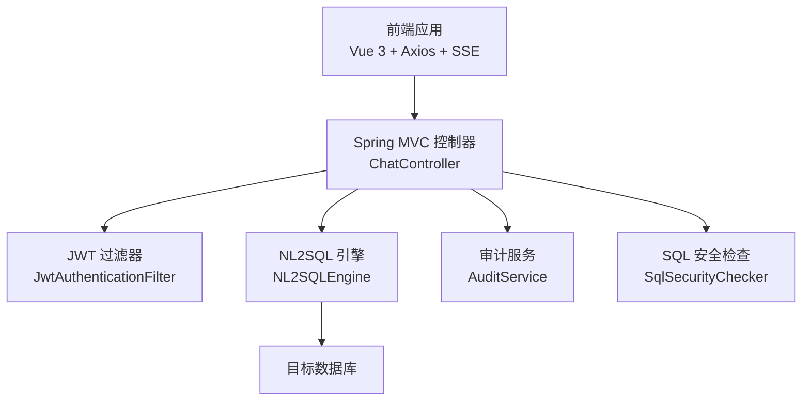
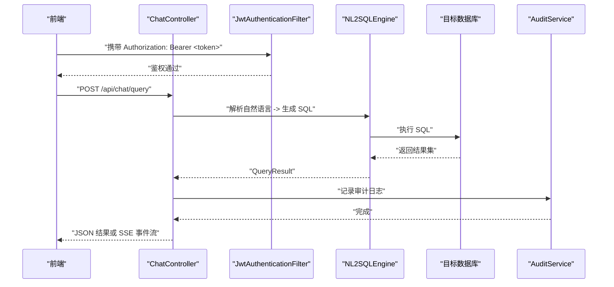
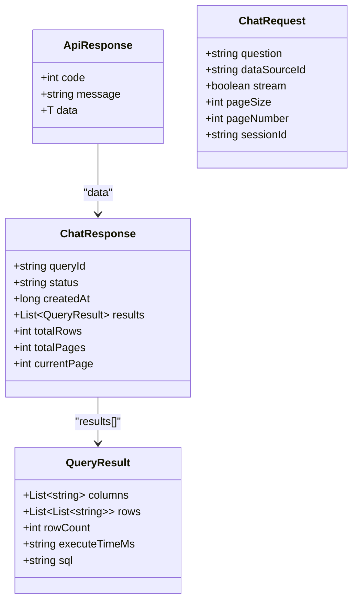
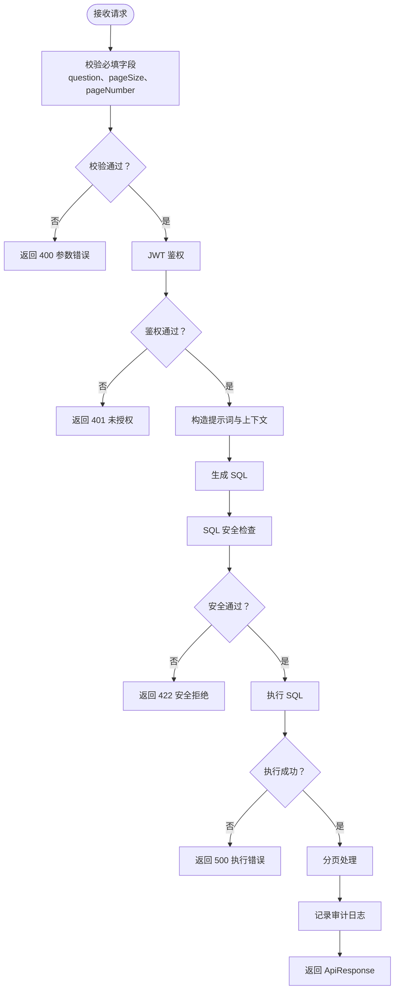
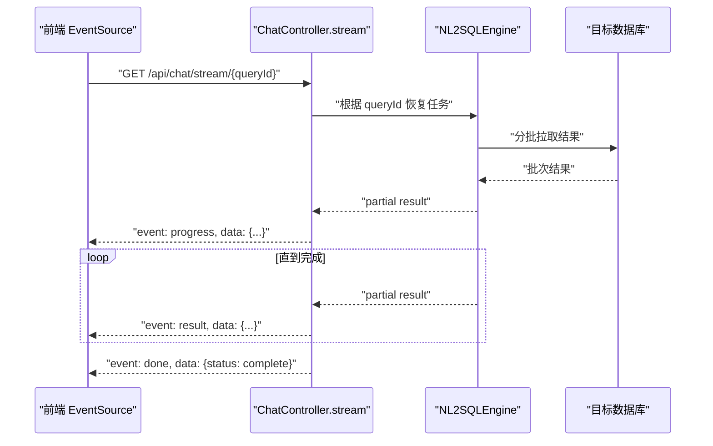
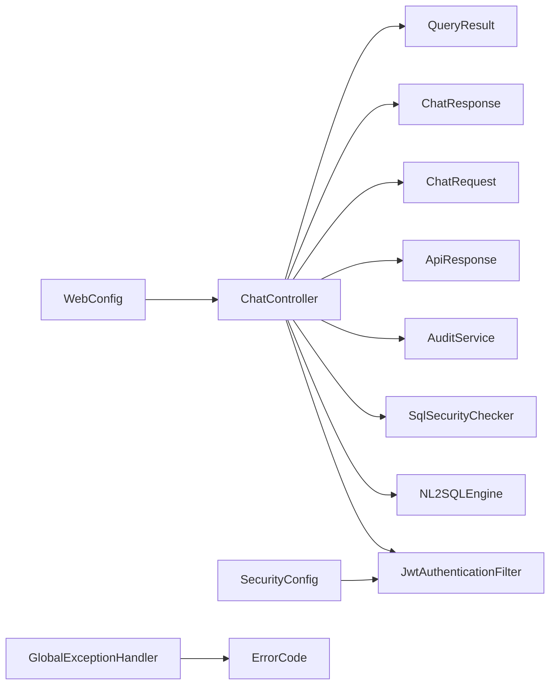

# 聊天查询接口

<cite>
**本文引用的文件**   
- [ChatController.java](file://backend/backend/src/main/java/com/nlp2sql/controller/ChatController.java)
- [ChatRequest.java](file://backend/backend/src/main/java/com/nlp2sql/model/dto/ChatRequest.java)
- [ChatResponse.java](file://backend/backend/src/main/java/com/nlp2sql/model/dto/ChatResponse.java)
- [QueryResult.java](file://backend/backend/src/main/java/com/nlp2sql/model/dto/QueryResult.java)
- [ApiResponse.java](file://backend/backend/src/main/java/com/nlp2sql/model/dto/ApiResponse.java)
- [ErrorCode.java](file://backend/backend/src/main/java/com/nlp2sql/common/ErrorCode.java)
- [GlobalExceptionHandler.java](file://backend/backend/src/main/java/com/nlp2sql/config/GlobalExceptionHandler.java)
- [SecurityConfig.java](file://backend/backend/src/main/java/com/nlp2sql/config/SecurityConfig.java)
- [WebConfig.java](file://backend/backend/src/main/java/com/nlp2sql/config/WebConfig.java)
- [JwtAuthenticationFilter.java](file://backend/backend/src/main/java/com/nlp2sql/security/JwtAuthenticationFilter.java)
- [SqlSecurityChecker.java](file://backend/backend/src/main/java/com/nlp2sql/security/SqlSecurityChecker.java)
- [NL2SQLEngine.java](file://backend/backend/src/main/java/com/nlp2sql/service/NL2SQLEngine.java)
- [AuditService.java](file://backend/backend/src/main/java/com/nlp2sql/service/AuditService.java)
- [client.js](file://frontend/frontend/src/api/client.js)
- [endpoints.js](file://frontend/frontend/src/api/endpoints.js)
- [chatStore.js](file://frontend/frontend/src/stores/chatStore.js)
- [application.yml](file://backend/backend/src/main/resources/application.yml)
</cite>

## 目录
1. [简介](#简介)
2. [项目结构](#项目结构)
3. [核心组件](#核心组件)
4. [架构总览](#架构总览)
5. [详细组件分析](#详细组件分析)
6. [依赖关系分析](#依赖关系分析)
7. [性能与并发](#性能与并发)
8. [故障排查](#故障排查)
9. [结论](#结论)

## 简介
本文档面向“聊天查询”能力，聚焦自然语言到 SQL（NL2SQL）的完整 API 生命周期：提交查询、执行处理、进度跟踪、结果获取，以及查询历史管理。文档覆盖以下要点：
- HTTP 端点、请求头、请求体、响应体、状态码与错误码
- 查询参数格式、约束与校验规则
- 结果格式支持与分页机制
- 流式响应实现与客户端处理示例
- 查询性能优化与并发控制建议
- 安全策略：JWT 鉴权、SQL 注入防护、审计日志

## 项目结构
后端采用 Spring Boot 分层架构：
- Controller 层暴露 RESTful API
- Service 层封装 NL2SQL 引擎、分类器、提示词构建、审计等
- Security 层负责 JWT 认证和 SQL 安全检查
- Common 层定义统一错误码与业务异常
- Config 层提供全局异常处理、安全配置、跨域配置等
- DTO/VO 层定义请求、响应及数据模型

前端基于 Vue 3 + Vite，使用 Axios 发起 HTTP 请求，并通过 SSE（Server-Sent Events）消费流式结果；同时通过 Vuex store 维护会话状态与查询历史。

**图表来源**
- [ChatController.java](file://backend/backend/src/main/java/com/nlp2sql/controller/ChatController.java)
- [NL2SQLEngine.java](file://backend/backend/src/main/java/com/nlp2sql/service/NL2SQLEngine.java)
- [JwtAuthenticationFilter.java](file://backend/backend/src/main/java/com/nlp2sql/security/JwtAuthenticationFilter.java)
- [SqlSecurityChecker.java](file://backend/backend/src/main/java/com/nlp2sql/security/SqlSecurityChecker.java)
- [AuditService.java](file://backend/backend/src/main/java/com/nlp2sql/service/AuditService.java)

**章节来源**
- [application.yml](file://backend/backend/src/main/resources/application.yml)

## 核心组件
- ChatController：对外暴露聊天查询相关 REST 接口，包括同步查询、流式查询、查询历史等。
- ChatRequest / ChatResponse：描述单次查询的请求结构与响应结构。
- QueryResult：封装 SQL 查询返回的行集、列元信息、统计信息等。
- ApiResponse：统一的 API 包装结构，包含状态码、消息和数据体。
- GlobalExceptionHandler：集中捕获异常并转换为统一错误响应。
- ErrorCode：系统级错误码枚举。
- JwtAuthenticationFilter：对受保护接口进行 JWT 校验。
- SqlSecurityChecker：对生成的 SQL 做安全检测，防止危险语句。
- NL2SQLEngine：核心 NL2SQL 推理与执行引擎。
- AuditService：记录查询审计日志。
- client.js / endpoints.js：前端 HTTP 客户端与端点常量。
- chatStore.js：前端会话与查询历史状态管理。

**章节来源**
- [ChatController.java](file://backend/backend/src/main/java/com/nlp2sql/controller/ChatController.java)
- [ChatRequest.java](file://backend/backend/src/main/java/com/nlp2sql/model/dto/ChatRequest.java)
- [ChatResponse.java](file://backend/backend/src/main/java/com/nlp2sql/model/dto/ChatResponse.java)
- [QueryResult.java](file://backend/backend/src/main/java/com/nlp2sql/model/dto/QueryResult.java)
- [ApiResponse.java](file://backend/backend/src/main/java/com/nlp2sql/model/dto/ApiResponse.java)
- [ErrorCode.java](file://backend/backend/src/main/java/com/nlp2sql/common/ErrorCode.java)
- [GlobalExceptionHandler.java](file://backend/backend/src/main/java/com/nlp2sql/config/GlobalExceptionHandler.java)
- [JwtAuthenticationFilter.java](file://backend/backend/src/main/java/com/nlp2sql/security/JwtAuthenticationFilter.java)
- [SqlSecurityChecker.java](file://backend/backend/src/main/java/com/nlp2sql/security/SqlSecurityChecker.java)
- [NL2SQLEngine.java](file://backend/backend/src/main/java/com/nlp2sql/service/NL2SQLEngine.java)
- [AuditService.java](file://backend/backend/src/main/java/com/nlp2sql/service/AuditService.java)
- [client.js](file://frontend/frontend/src/api/client.js)
- [endpoints.js](file://frontend/frontend/src/api/endpoints.js)
- [chatStore.js](file://frontend/frontend/src/stores/chatStore.js)

## 架构总览
下图展示一次自然语言查询从前端到后端的完整调用链，包括安全校验、NL2SQL 生成、SQL 执行、审计与结果返回。

**图表来源**
- [ChatController.java](file://backend/backend/src/main/java/com/nlp2sql/controller/ChatController.java)
- [NL2SQLEngine.java](file://backend/backend/src/main/java/com/nlp2sql/service/NL2SQLEngine.java)
- [JwtAuthenticationFilter.java](file://backend/backend/src/main/java/com/nlp2sql/security/JwtAuthenticationFilter.java)
- [AuditService.java](file://backend/backend/src/main/java/com/nlp2sql/service/AuditService.java)

## 详细组件分析

### 聊天查询接口规范

#### 通用约定
- 基础路径：`/api`
- 鉴权：除登录接口外，其他接口需携带 `Authorization: Bearer <JWT>`
- 内容类型：默认 `application/json`
- 统一响应：所有成功响应均包裹在 `ApiResponse<T>` 中，失败时由 `GlobalExceptionHandler` 输出统一错误结构

**图表来源**
- [ApiResponse.java](file://backend/backend/src/main/java/com/nlp2sql/model/dto/ApiResponse.java)
- [ChatRequest.java](file://backend/backend/src/main/java/com/nlp2sql/model/dto/ChatRequest.java)
- [ChatResponse.java](file://backend/backend/src/main/java/com/nlp2sql/model/dto/ChatResponse.java)
- [QueryResult.java](file://backend/backend/src/main/java/com/nlp2sql/model/dto/QueryResult.java)

#### 同步查询接口
- URL：`POST /api/chat/query`
- 鉴权：需要有效 JWT
- 请求体（JSON）：
  - `question`：必填，自然语言问题字符串
  - `dataSourceId`：可选，指定数据源标识
  - `stream`：可选，布尔值，是否启用流式响应（默认 false）
  - `pageSize`：可选，正整数，单页行数上限（默认由后端配置决定）
  - `pageNumber`：可选，正整数，当前页码（默认 1）
  - `sessionId`：可选，会话标识，用于关联多轮对话
- 响应体（JSON）：
  - `code`：业务状态码
  - `message`：提示信息
  - `data`：`ChatResponse` 对象，包含：
    - `queryId`：本次查询唯一标识
    - `status`：查询状态（如 success/error/pending）
    - `createdAt`：创建时间戳
    - `results`：`QueryResult` 列表（可能为空或含多条）
    - `totalRows`：总行数
    - `totalPages`：总页数
    - `currentPage`：当前页码
- 状态码：
  - 200：请求成功
  - 401：未授权或令牌无效
  - 400：参数校验失败
  - 403：权限不足（数据源不可用）
  - 422：语义或 SQL 安全校验失败
  - 500：服务器内部错误

**图表来源**
- [ChatController.java](file://backend/backend/src/main/java/com/nlp2sql/controller/ChatController.java)
- [SqlSecurityChecker.java](file://backend/backend/src/main/java/com/nlp2sql/security/SqlSecurityChecker.java)
- [GlobalExceptionHandler.java](file://backend/backend/src/main/java/com/nlp2sql/config/GlobalExceptionHandler.java)

**章节来源**
- [ChatController.java](file://backend/backend/src/main/java/com/nlp2sql/controller/ChatController.java)
- [ChatRequest.java](file://backend/backend/src/main/java/com/nlp2sql/model/dto/ChatRequest.java)
- [ChatResponse.java](file://backend/backend/src/main/java/com/nlp2sql/model/dto/ChatResponse.java)
- [QueryResult.java](file://backend/backend/src/main/java/com/nlp2sql/model/dto/QueryResult.java)
- [SqlSecurityChecker.java](file://backend/backend/src/main/java/com/nlp2sql/security/SqlSecurityChecker.java)
- [GlobalExceptionHandler.java](file://backend/backend/src/main/java/com/nlp2sql/config/GlobalExceptionHandler.java)

#### 流式查询接口
- URL：`GET /api/chat/stream/{queryId}`
- 鉴权：需要有效 JWT
- 说明：
  - 该接口以 Server-Sent Events（SSE）方式推送查询过程中的增量结果与状态更新
  - 首次事件通常为查询状态为 pending，随后逐步推送 partial 结果，最终推送 complete 或 error 状态
- 请求头：
  - `Authorization: Bearer <JWT>`
  - `Accept: text/event-stream`
- 事件体：
  - `data`：JSON 片段，包含部分行、累计行数、状态等信息
  - `event`：可选，区分不同事件类型（如 progress、result、done、error）
- 客户端处理：
  - 前端使用 `EventSource` 订阅事件流，逐步渲染表格或滚动结果
  - 当收到 done 或 error 事件后关闭连接

**图表来源**
- [ChatController.java](file://backend/backend/src/main/java/com/nlp2sql/controller/ChatController.java)
- [NL2SQLEngine.java](file://backend/backend/src/main/java/com/nlp2sql/service/NL2SQLEngine.java)

**章节来源**
- [ChatController.java](file://backend/backend/src/main/java/com/nlp2sql/controller/ChatController.java)

#### 查询历史接口
- 列出历史：
  - URL：`GET /api/chat/history`
  - 参数：
    - `pageSize`：可选，正整数
    - `pageNumber`：可选，正整数
    - `sessionId`：可选，按会话过滤
  - 响应：`ApiResponse<List<ChatResponse>>`
- 详情：
  - URL：`GET /api/chat/history/{queryId}`
  - 响应：`ApiResponse<ChatResponse>`
- 删除：
  - URL：`DELETE /api/chat/history/{queryId}`
  - 响应：`ApiResponse<Boolean>`

**章节来源**
- [ChatController.java](file://backend/backend/src/main/java/com/nlp2sql/controller/ChatController.java)

### 查询参数格式、约束与验证规则
- `question`：
  - 必填，非空字符串
  - 长度限制：最小 1，最大由后端配置决定（建议在 500 以内）
- `dataSourceId`：
  - 可选，字符串，需指向已注册且可访问的数据源
- `stream`：
  - 可选，布尔值，默认 false
- `pageSize`：
  - 可选，正整数，范围 1~N（建议 N≤500）
- `pageNumber`：
  - 可选，正整数，起始 1
- `sessionId`：
  - 可选，字符串，用于会话关联与历史分组

校验失败时，统一返回 400 或 422，并在 `message` 中给出具体原因。

**章节来源**
- [ChatRequest.java](file://backend/backend/src/main/java/com/nlp2sql/model/dto/ChatRequest.java)
- [GlobalExceptionHandler.java](file://backend/backend/src/main/java/com/nlp2sql/config/GlobalExceptionHandler.java)

### 结果格式与分页机制
- 结果封装：
  - `ChatResponse.results` 为 `QueryResult` 列表
  - `QueryResult.columns` 为列名数组
  - `QueryResult.rows` 为二维字符串数组
  - `QueryResult.rowCount` 为本次返回行数
  - `QueryResult.executeTimeMs` 为执行耗时（毫秒）
  - `QueryResult.sql` 为实际执行的 SQL（可用于调试）
- 分页字段：
  - `ChatResponse.totalRows`：总行数
  - `ChatResponse.totalPages`：总页数
  - `ChatResponse.currentPage`：当前页码
- 流式结果：
  - 每次推送包含部分 `rows` 与累计 `rowCount`
  - 最终事件包含 `status=complete` 与完整统计信息

**章节来源**
- [ChatResponse.java](file://backend/backend/src/main/java/com/nlp2sql/model/dto/ChatResponse.java)
- [QueryResult.java](file://backend/backend/src/main/java/com/nlp2sql/model/dto/QueryResult.java)

### 流式响应的客户端处理示例
- 使用浏览器 `EventSource` 订阅 `/api/chat/stream/{queryId}`
- 监听事件：
  - `progress`：显示加载进度与部分行数
  - `result`：追加渲染行
  - `done`：停止订阅，合并最终统计
  - `error`：显示错误消息并清理资源
- 前端代码参考：
  - [client.js](file://frontend/frontend/src/api/client.js)
  - [chatStore.js](file://frontend/frontend/src/stores/chatStore.js)

**章节来源**
- [client.js](file://frontend/frontend/src/api/client.js)
- [chatStore.js](file://frontend/frontend/src/stores/chatStore.js)

## 依赖关系分析
- Controller 依赖：
  - 安全过滤器（JWT）
  - NL2SQL 引擎
  - SQL 安全检查器
  - 审计服务
- DTO 依赖：
  - `ApiResponse` 作为统一包装
  - `ChatRequest`、`ChatResponse`、`QueryResult` 作为核心数据载体
- 配置依赖：
  - `SecurityConfig`：定义受保护端点与放行路径
  - `WebConfig`：定义跨域、拦截器等
  - `GlobalExceptionHandler`：统一异常映射
  - `ErrorCode`：错误码枚举

**图表来源**
- [ChatController.java](file://backend/backend/src/main/java/com/nlp2sql/controller/ChatController.java)
- [SecurityConfig.java](file://backend/backend/src/main/java/com/nlp2sql/config/SecurityConfig.java)
- [WebConfig.java](file://backend/backend/src/main/java/com/nlp2sql/config/WebConfig.java)
- [GlobalExceptionHandler.java](file://backend/backend/src/main/java/com/nlp2sql/config/GlobalExceptionHandler.java)
- [ErrorCode.java](file://backend/backend/src/main/java/com/nlp2sql/common/ErrorCode.java)
- [JwtAuthenticationFilter.java](file://backend/backend/src/main/java/com/nlp2sql/security/JwtAuthenticationFilter.java)
- [SqlSecurityChecker.java](file://backend/backend/src/main/java/com/nlp2sql/security/SqlSecurityChecker.java)
- [NL2SQLEngine.java](file://backend/backend/src/main/java/com/nlp2sql/service/NL2SQLEngine.java)
- [AuditService.java](file://backend/backend/src/main/java/com/nlp2sql/service/AuditService.java)
- [ApiResponse.java](file://backend/backend/src/main/java/com/nlp2sql/model/dto/ApiResponse.java)
- [ChatRequest.java](file://backend/backend/src/main/java/com/nlp2sql/model/dto/ChatRequest.java)
- [ChatResponse.java](file://backend/backend/src/main/java/com/nlp2sql/model/dto/ChatResponse.java)
- [QueryResult.java](file://backend/backend/src/main/java/com/nlp2sql/model/dto/QueryResult.java)

**章节来源**
- [ChatController.java](file://backend/backend/src/main/java/com/nlp2sql/controller/ChatController.java)
- [SecurityConfig.java](file://backend/backend/src/main/java/com/nlp2sql/config/SecurityConfig.java)
- [WebConfig.java](file://backend/backend/src/main/java/com/nlp2sql/config/WebConfig.java)
- [GlobalExceptionHandler.java](file://backend/backend/src/main/java/com/nlp2sql/config/GlobalExceptionHandler.java)
- [ErrorCode.java](file://backend/backend/src/main/java/com/nlp2sql/common/ErrorCode.java)
- [JwtAuthenticationFilter.java](file://backend/backend/src/main/java/com/nlp2sql/security/JwtAuthenticationFilter.java)
- [SqlSecurityChecker.java](file://backend/backend/src/main/java/com/nlp2sql/security/SqlSecurityChecker.java)
- [NL2SQLEngine.java](file://backend/backend/src/main/java/com/nlp2sql/service/NL2SQLEngine.java)
- [AuditService.java](file://backend/backend/src/main/java/com/nlp2sql/service/AuditService.java)
- [ApiResponse.java](file://backend/backend/src/main/java/com/nlp2sql/model/dto/ApiResponse.java)
- [ChatRequest.java](file://backend/backend/src/main/java/com/nlp2sql/model/dto/ChatRequest.java)
- [ChatResponse.java](file://backend/backend/src/main/java/com/nlp2sql/model/dto/ChatResponse.java)
- [QueryResult.java](file://backend/backend/src/main/java/com/nlp2sql/model/dto/QueryResult.java)

## 性能与并发
- 查询性能优化建议：
  - 限制 `pageSize`，避免一次性拉取大量数据
  - 优先使用流式接口获取大数据量结果，降低内存占用
  - 合理设置会话与缓存键，减少重复计算
  - 针对高频查询场景，可在服务层引入轻量缓存（例如 Redis），但需注意数据一致性
- 并发控制建议：
  - 对同一 `sessionId` 或 `dataSourceId` 进行限流，防止热点数据源过载
  - 对长耗时查询设置超时与取消机制
  - 使用异步任务队列处理复杂 NL2SQL 生成流程，提升吞吐
- 指标监控：
  - 记录每次查询的执行耗时、SQL 复杂度、结果行数
  - 监控错误率与慢查询比例，定期分析优化

[本节为通用指导，不直接分析具体文件]

## 故障排查
- 常见错误码与含义：
  - 400：参数校验失败（如缺少必填字段、分页参数非法）
  - 401：JWT 缺失或过期
  - 403：数据源不可用或无权限访问
  - 422：语义错误或 SQL 安全校验失败（如包含危险语句）
  - 500：服务器内部错误（如数据库连接失败、引擎异常）
- 排查步骤：
  - 检查请求头是否携带正确 JWT
  - 检查 `question` 是否清晰、明确
  - 查看 `QueryResult.sql` 确认生成的 SQL 是否符合预期
  - 检查后端日志中的异常堆栈与审计日志
- 工具与建议：
  - 使用 Postman 或 curl 先测试同步接口，再切换到流式接口
  - 在前端控制台打印 SSE 事件，定位渲染或断连问题
  - 通过 `TraceIdFilter` 提供的追踪 ID 在后端日志中定位请求链路

**章节来源**
- [ErrorCode.java](file://backend/backend/src/main/java/com/nlp2sql/common/ErrorCode.java)
- [GlobalExceptionHandler.java](file://backend/backend/src/main/java/com/nlp2sql/config/GlobalExceptionHandler.java)
- [SqlSecurityChecker.java](file://backend/backend/src/main/java/com/nlp2sql/security/SqlSecurityChecker.java)
- [QueryResult.java](file://backend/backend/src/main/java/com/nlp2sql/model/dto/QueryResult.java)

## 结论
本聊天查询接口围绕 NL2SQL 的核心链路，提供了从自然语言到 SQL 的端到端能力，并通过统一响应、分页、流式响应与审计日志，兼顾了易用性、可扩展性与安全性。在生产环境中，建议结合业务规模进行限流、缓存与监控配置，确保稳定性与性能。

[本节为总结性内容，不直接分析具体文件]