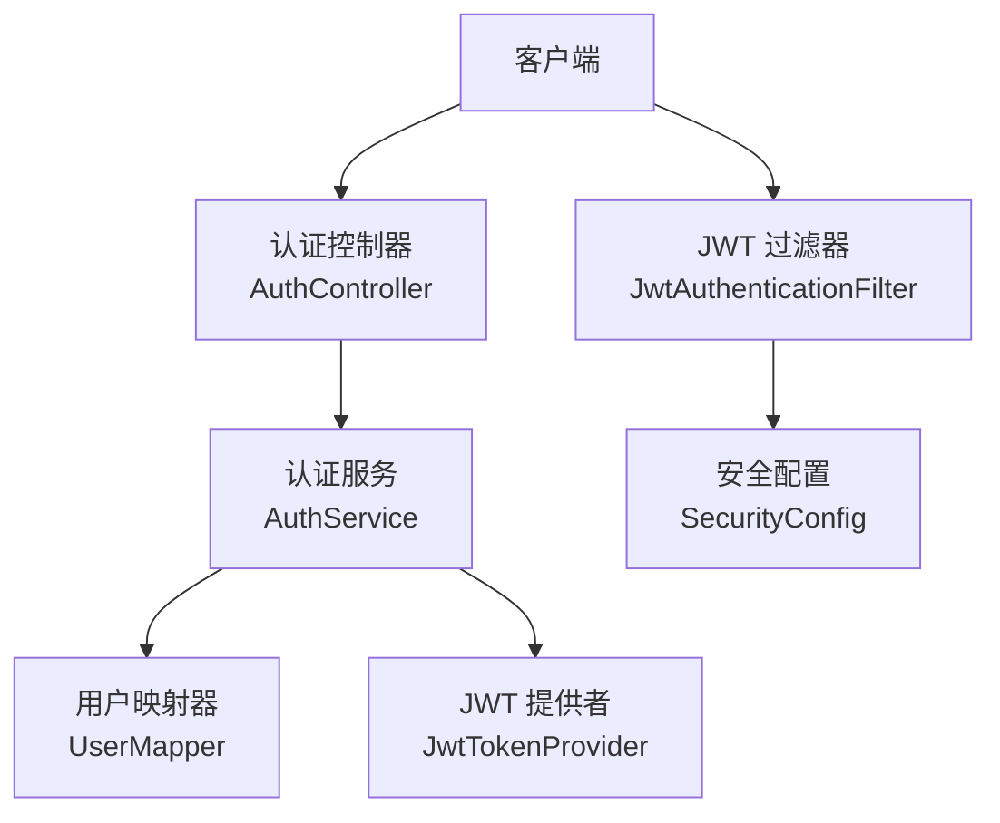
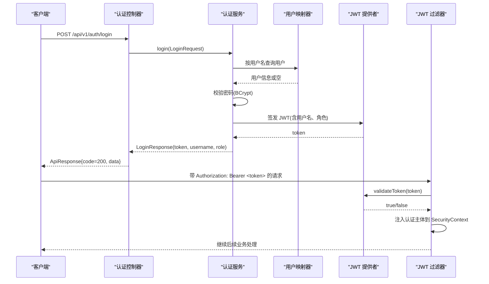
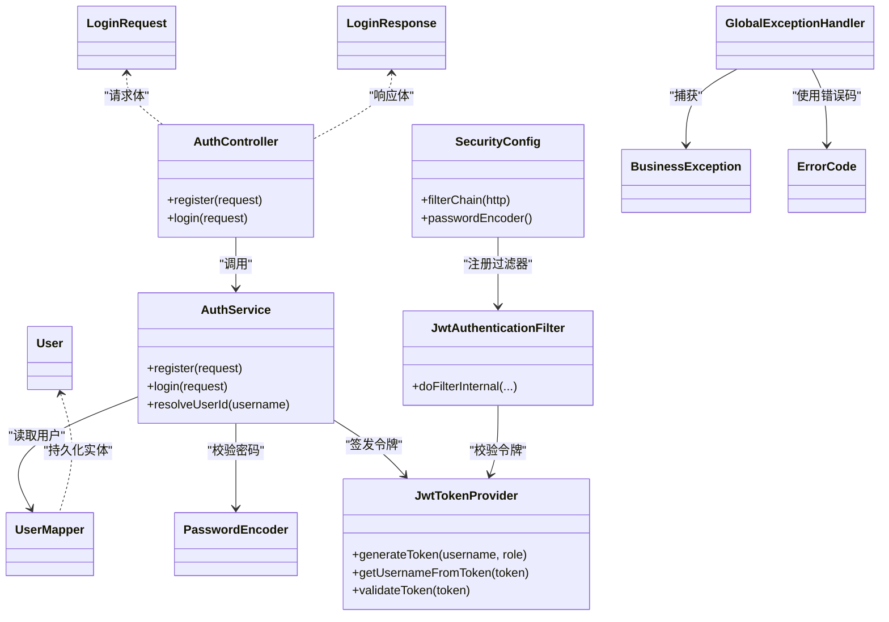

# 认证接口

<cite>
**本文引用的文件**
- [AuthController.java](file://backend/src/main/java/com/nlp2sql/controller/AuthController.java)
- [AuthService.java](file://backend/src/main/java/com/nlp2sql/service/AuthService.java)
- [JwtTokenProvider.java](file://backend/src/main/java/com/nlp2sql/security/JwtTokenProvider.java)
- [JwtAuthenticationFilter.java](file://backend/src/main/java/com/nlp2sql/security/JwtAuthenticationFilter.java)
- [SecurityConfig.java](file://backend/src/main/java/com/nlp2sql/config/SecurityConfig.java)
- [LoginRequest.java](file://backend/src/main/java/com/nlp2sql/model/dto/LoginRequest.java)
- [LoginResponse.java](file://backend/src/main/java/com/nlp2sql/model/dto/LoginResponse.java)
- [ErrorCode.java](file://backend/src/main/java/com/nlp2sql/common/ErrorCode.java)
- [BusinessException.java](file://backend/src/main/java/com/nlp2sql/common/BusinessException.java)
- [GlobalExceptionHandler.java](file://backend/src/main/java/com/nlp2sql/config/GlobalExceptionHandler.java)
- [User.java](file://backend/src/main/java/com/nlp2sql/model/User.java)
- [client.js](file://frontend/src/api/client.js)
- [endpoints.js](file://frontend/src/api/endpoints.js)
</cite>

## 目录
1. [简介](#简介)
2. [项目结构](#项目结构)
3. [核心组件](#核心组件)
4. [架构总览](#架构总览)
5. [详细接口定义](#详细接口定义)
6. [令牌获取、刷新与验证流程](#令牌获取刷新与验证流程)
7. [密码加密、用户验证与权限检查](#密码加密用户验证与权限检查)
8. [依赖关系分析](#依赖关系分析)
9. [性能考虑](#性能考虑)
10. [故障排查指南](#故障排查指南)
11. [结论](#结论)
12. [附录：客户端调用示例](#附录客户端调用示例)

## 简介
本文档面向后端和前端开发者，系统化说明本项目的认证相关 API 接口。内容涵盖用户注册、登录接口的请求格式、响应结构、JWT 令牌的生成与校验、密码加密与用户验证机制、全局异常处理与安全配置。文档同时提供前端客户端认证集成示例、错误码定义及常见问题的排错建议。

注意：当前实现未提供“登出”接口；由于系统采用无状态 JWT 模式，登出通常在客户端移除本地存储的令牌即可。

## 项目结构
与认证相关的代码分布在控制器、服务、安全、模型与配置等模块中：
- 控制器层暴露 HTTP 端点
- 服务层实现业务逻辑（注册、登录、解析用户）
- 安全层负责 JWT 生成、校验与请求级鉴权过滤
- 模型层定义用户实体与 DTO
- 配置层启用 Spring Security、密码编码器、白名单路径与过滤器链

图表来源
- [AuthController.java:1-31](file://backend/src/main/java/com/nlp2sql/controller/AuthController.java#L1-L31)
- [AuthService.java:1-68](file://backend/src/main/java/com/nlp2sql/service/AuthService.java#L1-L68)
- [JwtTokenProvider.java:1-55](file://backend/src/main/java/com/nlp2sql/security/JwtTokenProvider.java#L1-L55)
- [JwtAuthenticationFilter.java:1-51](file://backend/src/main/java/com/nlp2sql/security/JwtAuthenticationFilter.java#L1-L51)
- [SecurityConfig.java:1-44](file://backend/src/main/java/com/nlp2sql/config/SecurityConfig.java#L1-L44)

章节来源
- [AuthController.java:1-31](file://backend/src/main/java/com/nlp2sql/controller/AuthController.java#L1-L31)
- [AuthService.java:1-68](file://backend/src/main/java/com/nlp2sql/service/AuthService.java#L1-L68)
- [JwtTokenProvider.java:1-55](file://backend/src/main/java/com/nlp2sql/security/JwtTokenProvider.java#L1-L55)
- [JwtAuthenticationFilter.java:1-51](file://backend/src/main/java/com/nlp2sql/security/JwtAuthenticationFilter.java#L1-L51)
- [SecurityConfig.java:1-44](file://backend/src/main/java/com/nlp2sql/config/SecurityConfig.java#L1-L44)

## 核心组件
- 认证控制器：对外暴露注册与登录接口，统一返回 ApiResponse。
- 认证服务：负责用户名唯一性校验、密码 BCrypt 加密存储、登录凭证校验、JWT 令牌签发。
- JWT 提供者：基于 HMAC-SHA 密钥签发与校验 JWT，支持从令牌中提取用户名。
- JWT 过滤器：在每次请求中从 Authorization 头提取并校验 Bearer Token，注入 Spring Security 上下文。
- 安全配置：禁用 CSRF、无状态会话、开放认证与文档端点、其余端点需认证。
- 全局异常处理器：将业务异常、参数校验异常、非法参数异常与未知异常统一转换为 ApiResponse。

章节来源
- [AuthController.java:1-31](file://backend/src/main/java/com/nlp2sql/controller/AuthController.java#L1-L31)
- [AuthService.java:1-68](file://backend/src/main/java/com/nlp2sql/service/AuthService.java#L1-L68)
- [JwtTokenProvider.java:1-55](file://backend/src/main/java/com/nlp2sql/security/JwtTokenProvider.java#L1-L55)
- [JwtAuthenticationFilter.java:1-51](file://backend/src/main/java/com/nlp2sql/security/JwtAuthenticationFilter.java#L1-L51)
- [SecurityConfig.java:1-44](file://backend/src/main/java/com/nlp2sql/config/SecurityConfig.java#L1-L44)
- [GlobalExceptionHandler.java:1-50](file://backend/src/main/java/com/nlp2sql/config/GlobalExceptionHandler.java#L1-L50)

## 架构总览
下图展示一次“登录成功并访问受保护资源”的完整时序：

图表来源
- [AuthController.java:1-31](file://backend/src/main/java/com/nlp2sql/controller/AuthController.java#L1-L31)
- [AuthService.java:1-68](file://backend/src/main/java/com/nlp2sql/service/AuthService.java#L1-L68)
- [JwtTokenProvider.java:1-55](file://backend/src/main/java/com/nlp2sql/security/JwtTokenProvider.java#L1-L55)
- [JwtAuthenticationFilter.java:1-51](file://backend/src/main/java/com/nlp2sql/security/JwtAuthenticationFilter.java#L1-L51)

## 详细接口定义

### 通用响应体
所有接口统一返回 ApiResponse 包装体，包含以下字段：
- code：业务状态码，数字类型
- message：可读消息
- data：业务数据，可能为 null

当业务异常被捕获时，HTTP 状态码可能为 200 但 body.code 不为 200；参数校验失败通常返回 HTTP 400；服务器内部错误返回 HTTP 500。

章节来源
- [GlobalExceptionHandler.java:1-50](file://backend/src/main/java/com/nlp2sql/config/GlobalExceptionHandler.java#L1-L50)
- [ErrorCode.java:1-26](file://backend/src/main/java/com/nlp2sql/common/ErrorCode.java#L1-L26)

### 用户注册
- URL：POST /api/v1/auth/register
- 请求头：Content-Type: application/json
- 请求体：LoginRequest
  - username：字符串，必填
  - password：字符串，必填
- 成功响应：HTTP 200，ApiResponse.data 为字符串提示语
- 失败场景：
  - 用户名已存在：body.code = 400，message 指示重复
  - 参数为空：HTTP 400，message 为校验提示信息

章节来源
- [AuthController.java:1-31](file://backend/src/main/java/com/nlp2sql/controller/AuthController.java#L1-L31)
- [LoginRequest.java:1-14](file://backend/src/main/java/com/nlp2sql/model/dto/LoginRequest.java#L1-L14)
- [AuthService.java:1-68](file://backend/src/main/java/com/nlp2sql/service/AuthService.java#L1-L68)
- [GlobalExceptionHandler.java:1-50](file://backend/src/main/java/com/nlp2sql/config/GlobalExceptionHandler.java#L1-L50)
- [ErrorCode.java:1-26](file://backend/src/main/java/com/nlp2sql/common/ErrorCode.java#L1-L26)

### 用户登录
- URL：POST /api/v1/auth/login
- 请求头：Content-Type: application/json
- 请求体：LoginRequest
  - username：字符串，必填
  - password：字符串，必填
- 成功响应：HTTP 200，ApiResponse.data 为 LoginResponse
  - token：JWT 字符串
  - username：用户名
  - role：用户角色
- 失败场景：
  - 用户名或密码错误：body.code = 401，message 指示认证失败
  - 参数为空：HTTP 400，message 为校验提示信息

章节来源
- [AuthController.java:1-31](file://backend/src/main/java/com/nlp2sql/controller/AuthController.java#L1-L31)
- [LoginRequest.java:1-14](file://backend/src/main/java/com/nlp2sql/model/dto/LoginRequest.java#L1-L14)
- [LoginResponse.java:1-15](file://backend/src/main/java/com/nlp2sql/model/dto/LoginResponse.java#L1-L15)
- [AuthService.java:1-68](file://backend/src/main/java/com/nlp2sql/service/AuthService.java#L1-L68)
- [GlobalExceptionHandler.java:1-50](file://backend/src/main/java/com/nlp2sql/config/GlobalExceptionHandler.java#L1-L50)
- [ErrorCode.java:1-26](file://backend/src/main/java/com/nlp2sql/common/ErrorCode.java#L1-L26)

### 登出接口
- 当前实现未提供服务端登出端点。
- 由于使用无状态 JWT，登出建议在客户端删除本地存储的 token，并跳转至登录页。

章节来源
- [SecurityConfig.java:1-44](file://backend/src/main/java/com/nlp2sql/config/SecurityConfig.java#L1-L44)
- [client.js:1-48](file://frontend/src/api/client.js#L1-L48)

## 令牌获取、刷新与验证流程

### 令牌获取（登录）
- 客户端调用 /api/v1/auth/login 成功后，从响应体 data.token 获取 JWT。
- 客户端应将 token 保存在本地存储（如 localStorage），并在后续请求中通过 Authorization: Bearer <token> 发送。

章节来源
- [AuthService.java:1-68](file://backend/src/main/java/com/nlp2sql/service/AuthService.java#L1-L68)
- [JwtTokenProvider.java:1-55](file://backend/src/main/java/com/nlp2sql/security/JwtTokenProvider.java#L1-L55)
- [client.js:1-48](file://frontend/src/api/client.js#L1-L48)

### 令牌验证（请求鉴权）
- JwtAuthenticationFilter 在每个请求上从 Authorization 头提取 Bearer token。
- 使用 JwtTokenProvider.validateToken 校验签名与有效期。
- 校验通过后，从令牌主题字段提取用户名，构造认证主体并注入到 SecurityContext。

章节来源
- [JwtAuthenticationFilter.java:1-51](file://backend/src/main/java/com/nlp2sql/security/JwtAuthenticationFilter.java#L1-L51)
- [JwtTokenProvider.java:1-55](file://backend/src/main/java/com/nlp2sql/security/JwtTokenProvider.java#L1-L55)

### 令牌刷新
- 当前实现未提供独立刷新令牌接口。
- 如需刷新策略，可在现有基础上扩展：
  - 新增刷新接口，接收旧 token，校验后签发新 token。
  - 或在登录成功后返回双 token（access + refresh），由客户端在 access 过期时调用刷新接口续期。

章节来源
- [JwtTokenProvider.java:1-55](file://backend/src/main/java/com/nlp2sql/security/JwtTokenProvider.java#L1-L55)

## 密码加密、用户验证与权限检查

### 密码加密
- 使用 Spring Security 的 BCryptPasswordEncoder 对明文密码进行哈希存储。
- 注册时将用户传入的明文密码编码后写入数据库。

章节来源
- [SecurityConfig.java:1-44](file://backend/src/main/java/com/nlp2sql/config/SecurityConfig.java#L1-L44)
- [AuthService.java:1-68](file://backend/src/main/java/com/nlp2sql/service/AuthService.java#L1-L68)

### 用户验证
- 登录时根据用户名查询用户记录。
- 使用 PasswordEncoder.matches 对比明文密码与数据库中 BCrypt 密文。
- 校验失败抛出业务异常，最终由全局异常处理器转为统一响应。

章节来源
- [AuthService.java:1-68](file://backend/src/main/java/com/nlp2sql/service/AuthService.java#L1-L68)
- [GlobalExceptionHandler.java:1-50](file://backend/src/main/java/com/nlp2sql/config/GlobalExceptionHandler.java#L1-L50)

### 权限检查
- 当前 JWT 过滤器固定授予 ROLE_USER 权限。
- 控制器尚未进行基于角色的细粒度授权，可通过 Spring Security 的 @PreAuthorize 或自定义注解实现更细粒度的权限控制。

章节来源
- [JwtAuthenticationFilter.java:1-51](file://backend/src/main/java/com/nlp2sql/security/JwtAuthenticationFilter.java#L1-L51)
- [SecurityConfig.java:1-44](file://backend/src/main/java/com/nlp2sql/config/SecurityConfig.java#L1-L44)

## 依赖关系分析

图表来源
- [AuthController.java:1-31](file://backend/src/main/java/com/nlp2sql/controller/AuthController.java#L1-L31)
- [AuthService.java:1-68](file://backend/src/main/java/com/nlp2sql/service/AuthService.java#L1-L68)
- [JwtTokenProvider.java:1-55](file://backend/src/main/java/com/nlp2sql/security/JwtTokenProvider.java#L1-L55)
- [JwtAuthenticationFilter.java:1-51](file://backend/src/main/java/com/nlp2sql/security/JwtAuthenticationFilter.java#L1-L51)
- [SecurityConfig.java:1-44](file://backend/src/main/java/com/nlp2sql/config/SecurityConfig.java#L1-L44)
- [LoginRequest.java:1-14](file://backend/src/main/java/com/nlp2sql/model/dto/LoginRequest.java#L1-L14)
- [LoginResponse.java:1-15](file://backend/src/main/java/com/nlp2sql/model/dto/LoginResponse.java#L1-L15)
- [BusinessException.java:1-23](file://backend/src/main/java/com/nlp2sql/common/BusinessException.java#L1-L23)
- [GlobalExceptionHandler.java:1-50](file://backend/src/main/java/com/nlp2sql/config/GlobalExceptionHandler.java#L1-L50)
- [ErrorCode.java:1-26](file://backend/src/main/java/com/nlp2sql/common/ErrorCode.java#L1-L26)
- [User.java:1-22](file://backend/src/main/java/com/nlp2sql/model/User.java#L1-L22)

## 性能考虑
- 密码哈希：BCrypt 计算开销较高，建议在注册/登录路径避免不必要的重复哈希；当前实现仅在注册时编码、登录时匹配，符合常规做法。
- JWT 校验：过滤器在每次请求执行轻量签名校验，应确保密钥与过期时间合理配置，避免频繁 I/O。
- 数据库查询：登录与注册均按用户名单索引查询，若用户量增长，可考虑缓存热点用户信息以降低数据库压力。
- 无状态会话：关闭服务器端 Session，降低内存占用与集群共享成本。

[本节为通用指导，不直接分析具体文件]

## 故障排查指南

### 常见问题与定位
- 用户名已存在
  - 现象：注册失败，body.code = 400，message 提示重复
  - 原因：AuthService 在插入前校验用户名唯一性
  - 处理：更换用户名或清理测试数据
- 用户名或密码错误
  - 现象：登录失败，body.code = 401，message 提示认证失败
  - 原因：密码不匹配或用户不存在
  - 处理：核对凭据，确认用户是否已注册
- 参数为空或缺失
  - 现象：HTTP 400，message 为字段校验信息
  - 原因：LoginRequest 字段未满足 @NotBlank
  - 处理：补全请求体字段
- 未携带或无效令牌
  - 现象：访问受保护资源失败
  - 原因：Authorization 头缺失或 Bearer token 无效/过期
  - 处理：重新登录，确保客户端自动附加 Authorization 头
- 服务器内部错误
  - 现象：HTTP 500，body.code = 9999
  - 原因：未处理异常
  - 处理：查看后端日志，定位堆栈

章节来源
- [AuthService.java:1-68](file://backend/src/main/java/com/nlp2sql/service/AuthService.java#L1-L68)
- [GlobalExceptionHandler.java:1-50](file://backend/src/main/java/com/nlp2sql/config/GlobalExceptionHandler.java#L1-L50)
- [ErrorCode.java:1-26](file://backend/src/main/java/com/nlp2sql/common/ErrorCode.java#L1-L26)

### 错误码定义
- 400：请求参数错误或业务冲突（如用户名重复）
- 401：认证失败（用户名或密码错误）
- 403：禁止访问（当前未使用）
- 404：未找到（当前未使用）
- 9999：系统内部错误

章节来源
- [ErrorCode.java:1-26](file://backend/src/main/java/com/nlp2sql/common/ErrorCode.java#L1-L26)

## 结论
本项目实现了基础的认证能力：注册与登录、BCrypt 密码加密、JWT 令牌签发与校验、基于过滤器的请求级鉴权。安全配置默认开放认证与文档接口，其他接口均需携带有效 Bearer Token。当前未提供登出与令牌刷新接口，可通过客户端清除本地令牌与扩展服务端接口补齐。全局异常处理器保证一致的响应格式与错误码语义，便于前后端协同排错。

[本节为总结性内容，不直接分析具体文件]

## 附录：客户端调用示例

### 前端 Axios 客户端
- 基础地址：/api/v1
- 自动附加 Authorization 头：从 localStorage 读取 token
- 响应拦截：当返回体 code 非 200 时弹出错误提示并拒绝 Promise
- 401 处理：清除本地存储并跳转到登录页

章节来源
- [client.js:1-48](file://frontend/src/api/client.js#L1-L48)

### 认证端点封装
- 登录：POST /auth/login
- 注册：POST /auth/register

章节来源
- [endpoints.js:1-20](file://frontend/src/api/endpoints.js#L1-L20)

### 典型调用步骤
- 注册：调用 register(data)，data 为包含 username 与 password 的对象
- 登录：调用 login(data)，从响应 data.token 保存至 localStorage
- 访问受保护接口：通过 client 发起请求，自动附带 Authorization 头
- 登出：清除 localStorage 中的 token 与用户名，跳转登录页

章节来源
- [client.js:1-48](file://frontend/src/api/client.js#L1-L48)
- [endpoints.js:1-20](file://frontend/src/api/endpoints.js#L1-L20)