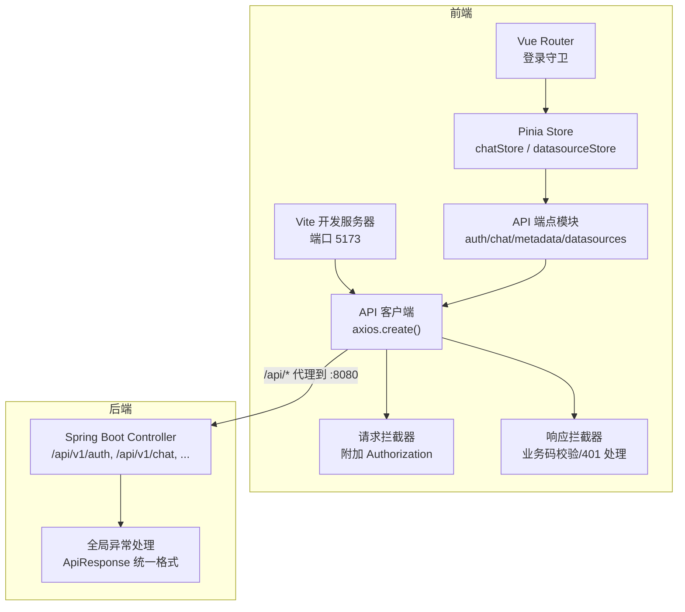
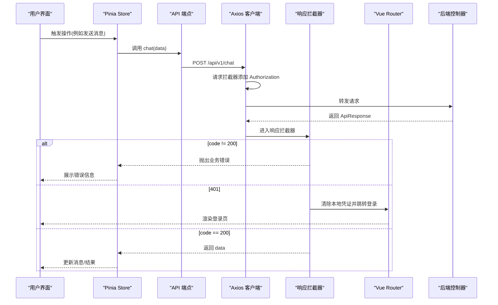
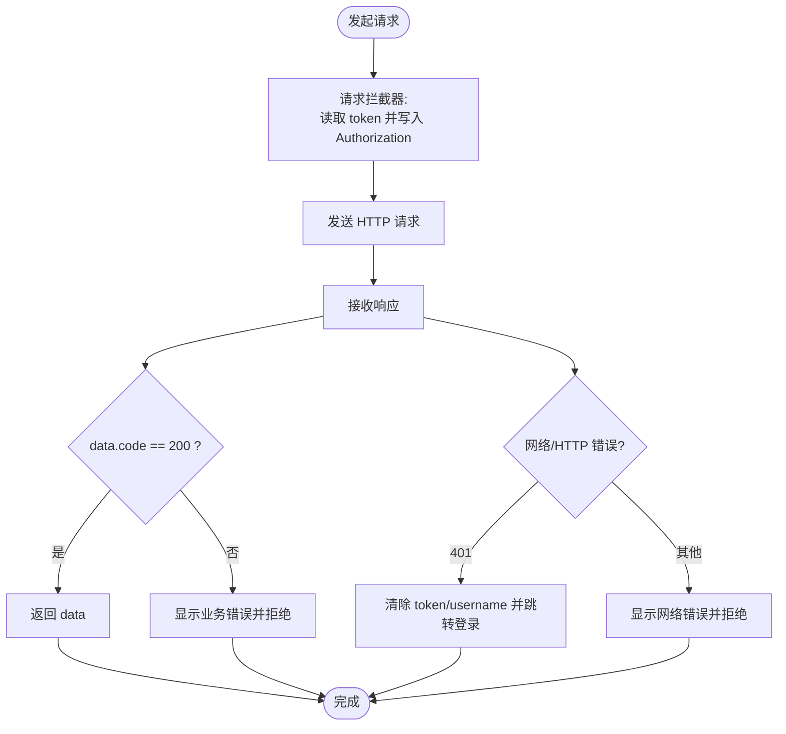
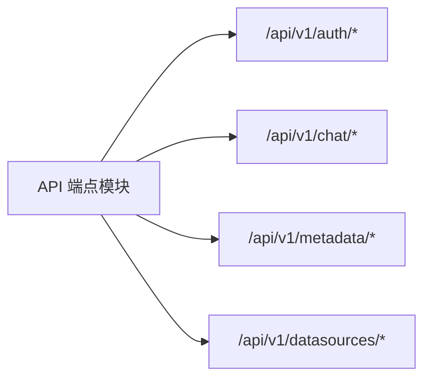
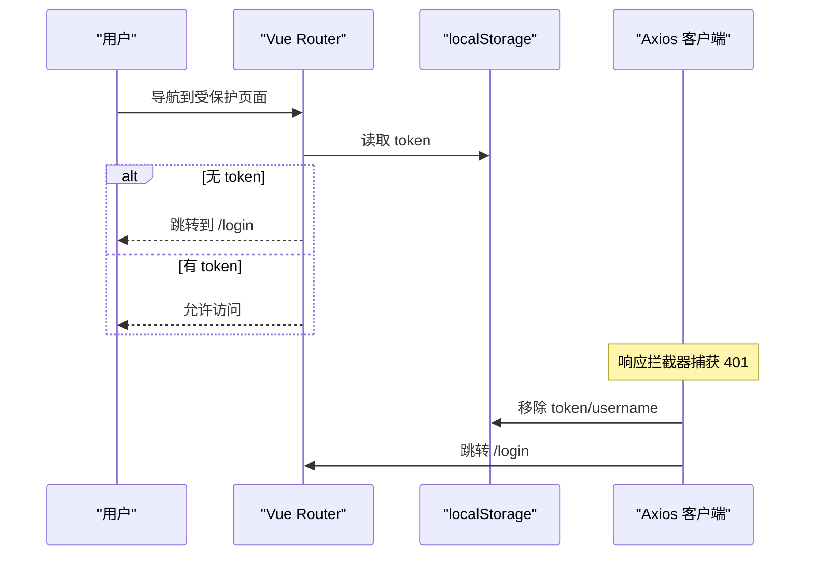
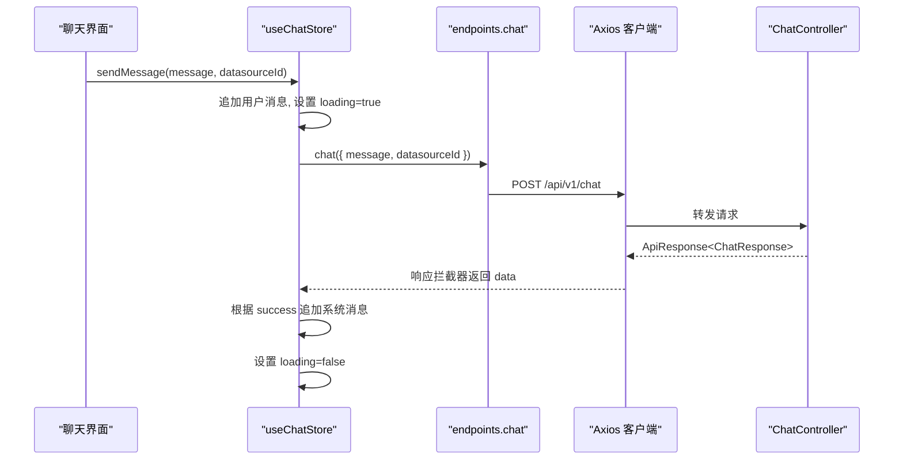
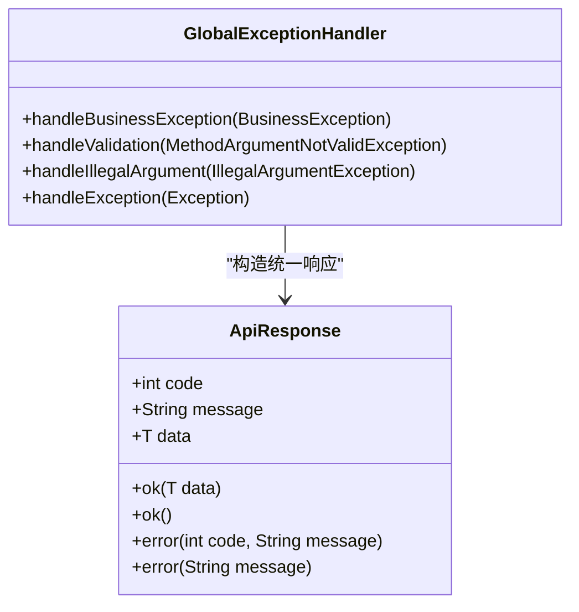
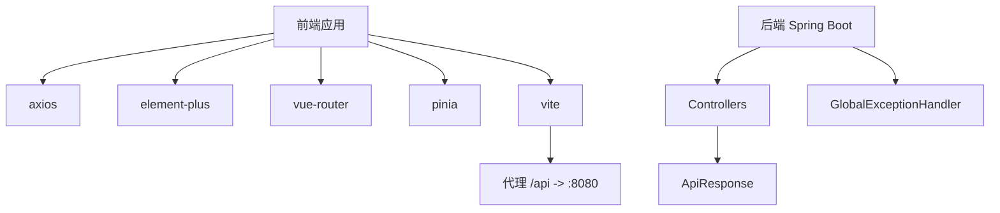
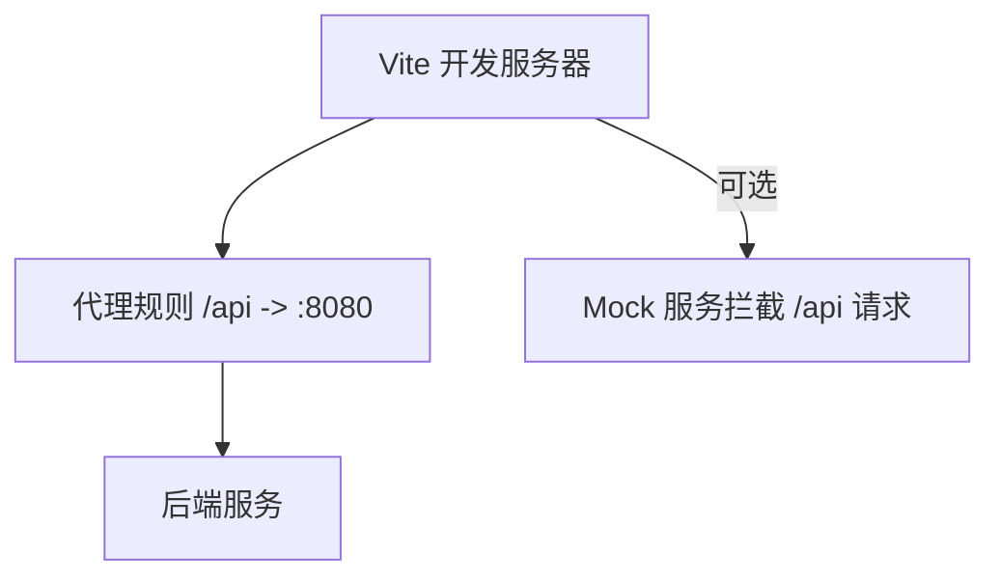

# API 集成

<cite>
**本文引用的文件**   
- [client.js](file://frontend/src/api/client.js)
- [endpoints.js](file://frontend/src/api/endpoints.js)
- [package.json](file://frontend/package.json)
- [vite.config.js](file://frontend/vite.config.js)
- [index.js](file://frontend/src/router/index.js)
- [chatStore.js](file://frontend/src/stores/chatStore.js)
- [datasourceStore.js](file://frontend/src/stores/datasourceStore.js)
- [ApiResponse.java](file://backend/src/main/java/com/nlp2sql/model/dto/ApiResponse.java)
- [GlobalExceptionHandler.java](file://backend/src/main/java/com/nlp2sql/config/GlobalExceptionHandler.java)
- [AuthController.java](file://backend/src/main/java/com/nlp2sql/controller/AuthController.java)
- [ChatController.java](file://backend/src/main/java/com/nlp2sql/controller/ChatController.java)
</cite>

## 目录
1. [简介](#简介)
2. [项目结构](#项目结构)
3. [核心组件](#核心组件)
4. [架构总览](#架构总览)
5. [详细组件分析](#详细组件分析)
6. [依赖关系分析](#依赖关系分析)
7. [性能与缓存策略](#性能与缓存策略)
8. [重试、超时与取消请求](#重试超时与取消请求)
9. [Mock 与服务端代理配置](#mock-与服务端代理配置)
10. [接口测试与调试最佳实践](#接口测试与调试最佳实践)
11. [结论](#结论)

## 简介
本文件面向前端开发者，系统性说明当前 Vue 3 + Vite + Axios 的 HTTP 通信层设计与实现。重点包括：
- Axios 客户端封装、请求/响应拦截器、统一错误处理
- API 端点组织方式与后端版本管理策略
- 认证与路由守卫联动
- Mock 数据与服务端代理方案
- 性能优化、缓存策略、重试与取消请求建议
- 接口测试与调试实践

## 项目结构
前端采用功能域划分：
- api：Axios 客户端与 API 端点定义
- stores：Pinia 状态管理
- router：Vue Router 路由与鉴权守卫
- views/components：页面与组件
- vite.config.js：开发服务器与代理配置

**图表来源**
- [vite.config.js:1-15](file://frontend/vite.config.js#L1-L15)
- [client.js:1-48](file://frontend/src/api/client.js#L1-L48)
- [endpoints.js:1-20](file://frontend/src/api/endpoints.js#L1-L20)
- [AuthController.java:1-31](file://backend/src/main/java/com/nlp2sql/controller/AuthController.java#L1-L31)
- [ChatController.java:1-30](file://backend/src/main/java/com/nlp2sql/controller/ChatController.java#L1-L30)
- [GlobalExceptionHandler.java:1-50](file://backend/src/main/java/com/nlp2sql/config/GlobalExceptionHandler.java#L1-L50)

**章节来源**
- [vite.config.js:1-15](file://frontend/vite.config.js#L1-L15)
- [package.json:1-23](file://frontend/package.json#L1-L23)

## 核心组件
- Axios 客户端封装：集中 baseURL、超时、通用头；提供请求/响应拦截器
- API 端点模块：按业务域导出函数，屏蔽底层 URL 细节
- Pinia Store：封装业务调用、加载态与 UI 反馈
- 路由守卫：未登录自动跳转至登录页
- 后端统一响应体与异常处理：code/message/data 结构，HTTP 状态码与业务码解耦

**章节来源**
- [client.js:1-48](file://frontend/src/api/client.js#L1-L48)
- [endpoints.js:1-20](file://frontend/src/api/endpoints.js#L1-L20)
- [chatStore.js:1-56](file://frontend/src/stores/chatStore.js#L1-L56)
- [datasourceStore.js:1-28](file://frontend/src/stores/datasourceStore.js#L1-L28)
- [index.js:1-39](file://frontend/src/router/index.js#L1-L39)
- [ApiResponse.java:1-33](file://backend/src/main/java/com/nlp2sql/model/dto/ApiResponse.java#L1-L33)
- [GlobalExceptionHandler.java:1-50](file://backend/src/main/java/com/nlp2sql/config/GlobalExceptionHandler.java#L1-L50)

## 架构总览
前后端通过 RESTful API 交互，路径以 `/api/v1` 为根。开发环境由 Vite 将 `/api` 前缀代理到后端 `http://localhost:8080`。前端在请求时注入 JWT，响应拦截器根据后端统一响应体进行成功或失败分支处理。

**图表来源**
- [chatStore.js:1-56](file://frontend/src/stores/chatStore.js#L1-L56)
- [endpoints.js:1-20](file://frontend/src/api/endpoints.js#L1-L20)
- [client.js:1-48](file://frontend/src/api/client.js#L1-L48)
- [index.js:1-39](file://frontend/src/router/index.js#L1-L39)
- [ChatController.java:1-30](file://backend/src/main/java/com/nlp2sql/controller/ChatController.java#L1-L30)

## 详细组件分析

### Axios 客户端与拦截器
- 基础配置：baseURL 使用 `/api/v1`，超时设为 60 秒，默认 Content-Type 为 application/json
- 请求拦截器：从 localStorage 读取 token，若存在则写入 Authorization 头
- 响应拦截器：
  - 成功分支：检查 response.data.code，若非 200，则弹出错误并拒绝 Promise
  - 失败分支：401 时清空本地凭证并跳转登录；其他错误弹出提示
- 导出统一的 client 实例供各 API 端点复用

**图表来源**
- [client.js:1-48](file://frontend/src/api/client.js#L1-L48)

**章节来源**
- [client.js:1-48](file://frontend/src/api/client.js#L1-L48)

### API 端点组织与版本管理
- 端点组织：按领域分组导出函数，如认证、对话、元数据、数据源管理
- 路径命名：与后端 Controller 的 @RequestMapping 保持一致，均为 `/api/v1/...`
- 版本策略：通过 baseURL 中的 v1 标识 API 版本；后续升级可在 baseURL 中改为 `/api/v2`，或在网关层做兼容

**图表来源**
- [endpoints.js:1-20](file://frontend/src/api/endpoints.js#L1-L20)
- [AuthController.java:1-31](file://backend/src/main/java/com/nlp2sql/controller/AuthController.java#L1-L31)
- [ChatController.java:1-30](file://backend/src/main/java/com/nlp2sql/controller/ChatController.java#L1-L30)

**章节来源**
- [endpoints.js:1-20](file://frontend/src/api/endpoints.js#L1-L20)
- [AuthController.java:1-31](file://backend/src/main/java/com/nlp2sql/controller/AuthController.java#L1-L31)
- [ChatController.java:1-30](file://backend/src/main/java/com/nlp2sql/controller/ChatController.java#L1-L30)

### 认证流程与路由守卫
- 登录成功后前端保存 token 到 localStorage
- 路由 beforeEach 守卫：访问非登录页且无 token 时强制跳转登录
- 响应拦截器捕获 401：清理本地凭证并重定向登录

**图表来源**
- [index.js:1-39](file://frontend/src/router/index.js#L1-L39)
- [client.js:1-48](file://frontend/src/api/client.js#L1-L48)

**章节来源**
- [index.js:1-39](file://frontend/src/router/index.js#L1-L39)
- [client.js:1-48](file://frontend/src/api/client.js#L1-L48)

### 业务调用示例：聊天对话
- Store 层负责编排：先加入用户消息、设置 loading、调用后端、根据 success 字段更新系统消息
- 后端 ChatController 接收 ChatRequest，返回 ApiResponse<ChatResponse>

**图表来源**
- [chatStore.js:1-56](file://frontend/src/stores/chatStore.js#L1-L56)
- [endpoints.js:1-20](file://frontend/src/api/endpoints.js#L1-L20)
- [ChatController.java:1-30](file://backend/src/main/java/com/nlp2sql/controller/ChatController.java#L1-L30)

**章节来源**
- [chatStore.js:1-56](file://frontend/src/stores/chatStore.js#L1-L56)
- [endpoints.js:1-20](file://frontend/src/api/endpoints.js#L1-L20)
- [ChatController.java:1-30](file://backend/src/main/java/com/nlp2sql/controller/ChatController.java#L1-L30)

### 后端统一响应与异常处理
- ApiResponse：包含 code、message、data，并提供 ok/error 静态工厂方法
- GlobalExceptionHandler：
  - 业务异常返回 200 与业务码
  - 参数校验异常返回 400 与错误信息拼接
  - 未捕获异常返回 500 与系统错误信息

**图表来源**
- [ApiResponse.java:1-33](file://backend/src/main/java/com/nlp2sql/model/dto/ApiResponse.java#L1-L33)
- [GlobalExceptionHandler.java:1-50](file://backend/src/main/java/com/nlp2sql/config/GlobalExceptionHandler.java#L1-L50)

**章节来源**
- [ApiResponse.java:1-33](file://backend/src/main/java/com/nlp2sql/model/dto/ApiResponse.java#L1-L33)
- [GlobalExceptionHandler.java:1-50](file://backend/src/main/java/com/nlp2sql/config/GlobalExceptionHandler.java#L1-L50)

## 依赖关系分析
- 前端依赖：axios、element-plus（用于消息提示）、vue-router、pinia
- 运行时：Vite 作为开发服务器，提供代理能力
- 后端依赖：Spring Boot Controller、统一响应体、全局异常处理

**图表来源**
- [package.json:1-23](file://frontend/package.json#L1-L23)
- [vite.config.js:1-15](file://frontend/vite.config.js#L1-L15)
- [GlobalExceptionHandler.java:1-50](file://backend/src/main/java/com/nlp2sql/config/GlobalExceptionHandler.java#L1-L50)
- [ApiResponse.java:1-33](file://backend/src/main/java/com/nlp2sql/model/dto/ApiResponse.java#L1-L33)

**章节来源**
- [package.json:1-23](file://frontend/package.json#L1-L23)
- [vite.config.js:1-15](file://frontend/vite.config.js#L1-L15)

## 性能与缓存策略
当前实现未内置 HTTP 级缓存与重试。可基于现有 Axios 实例扩展以下策略：
- 响应缓存
  - 对 GET 类接口增加内存缓存或持久化缓存（如 localStorage/IndexedDB）
  - 设置 TTL、脏读回退、按需失效（如刷新元数据后使相关键失效）
- 请求去重
  - 对相同 key 的请求合并，避免重复网络请求
- 预取与懒加载
  - 对可能用到的数据（如数据源列表）在合适时机预取
  - 对大列表分页加载，减少首屏压力
- 压缩与分片
  - 后端启用 gzip/br；前端合理拆分大响应体
- 连接优化
  - 控制并发上限，避免瞬时风暴

注意：上述为扩展建议，当前代码未直接实现，需自行在 Axios 拦截器或工具层补充。

[本节为通用指导，不直接分析具体文件]

## 重试、超时与取消请求
当前实现要点：
- 超时：Axios 已配置 timeout 为 60 秒
- 重试：未实现自动重试
- 取消：未显式使用 AbortController 或 axios.CancelToken

推荐增强方案：
- 自动重试
  - 仅对幂等 GET 请求启用指数退避重试
  - 限制最大重试次数与重试间隔
- 取消请求
  - 在组件卸载或切换路由时取消未完成的请求，避免状态更新冲突
- 超时兜底
  - 对用户明确提示“请求超时”，并提供重试按钮
- 节流与防抖
  - 搜索、过滤等操作加防抖；提交按钮加节流

由于当前代码未实现这些机制，建议在 client.js 中封装统一的请求包装函数，集中处理重试、取消与超时策略。

[本节为通用指导，不直接分析具体文件]

## Mock 与服务端代理配置
- 开发代理：Vite 已将 `/api` 代理到 `http://localhost:8080`，无需额外配置即可联调后端
- Mock 方案
  - Vite Mock：在开发环境下拦截 `/api` 请求返回固定数据
  - MSW：基于 Service Worker 的浏览器端 Mock，适合端到端场景
  - 环境变量开关：通过环境变量区分走真实后端还是 Mock

**图表来源**
- [vite.config.js:1-15](file://frontend/vite.config.js#L1-L15)

**章节来源**
- [vite.config.js:1-15](file://frontend/vite.config.js#L1-L15)

## 接口测试与调试最佳实践
- 断言后端统一响应结构
  - 确认 code、message、data 字段符合预期
  - 验证不同业务码在前端的错误提示是否准确
- 401 场景
  - 模拟 token 过期，校验是否清除本地凭证并跳转登录
- 网络异常
  - 模拟断网/超时，校验错误提示与 loading 状态恢复
- 端到端测试
  - 结合 MSW 对关键路径（登录、聊天、元数据）进行用例覆盖
- 日志与追踪
  - 记录请求 URL、耗时、错误堆栈；必要时携带 traceId 便于定位

**章节来源**
- [client.js:1-48](file://frontend/src/api/client.js#L1-L48)
- [ApiResponse.java:1-33](file://backend/src/main/java/com/nlp2sql/model/dto/ApiResponse.java#L1-L33)
- [GlobalExceptionHandler.java:1-50](file://backend/src/main/java/com/nlp2sql/config/GlobalExceptionHandler.java#L1-L50)

## 结论
本项目的前端 HTTP 通信层以 Axios 为核心，通过统一的客户端封装、拦截器和端点模块，实现了认证注入、业务码校验与 401 处理。后端以统一的 ApiResponse 和全局异常处理保证接口契约稳定。在此基础上，建议逐步引入响应缓存、请求去重、自动重试与取消请求等高级特性，并结合 Mock 与代理提升开发与联调效率。对于生产环境，应完善接口测试、监控与告警，确保通信层的健壮性与可观测性。