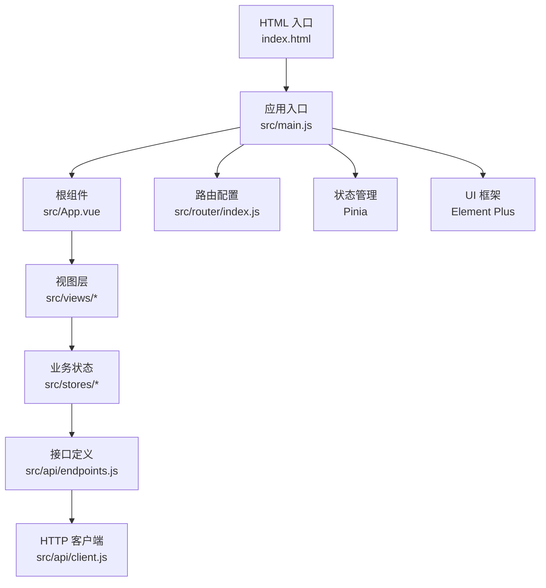
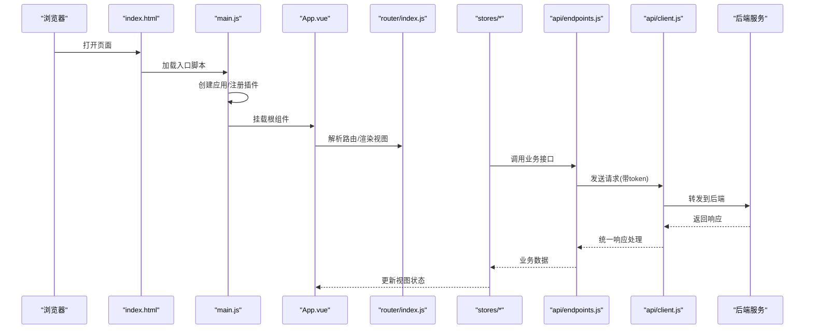
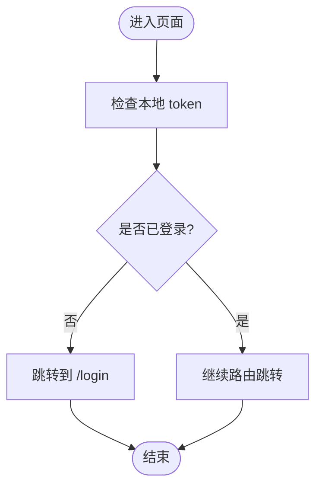
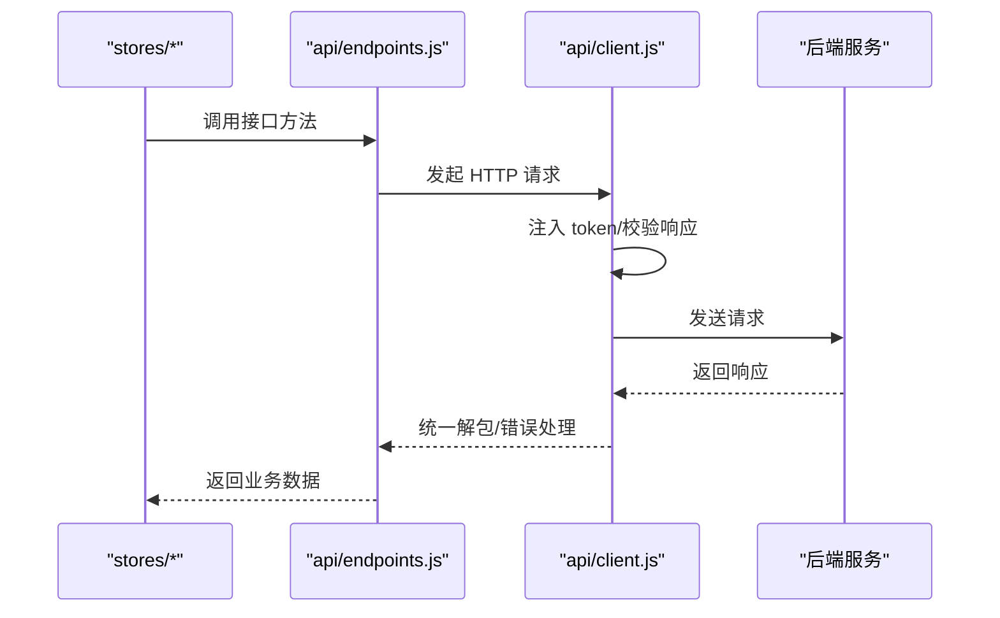
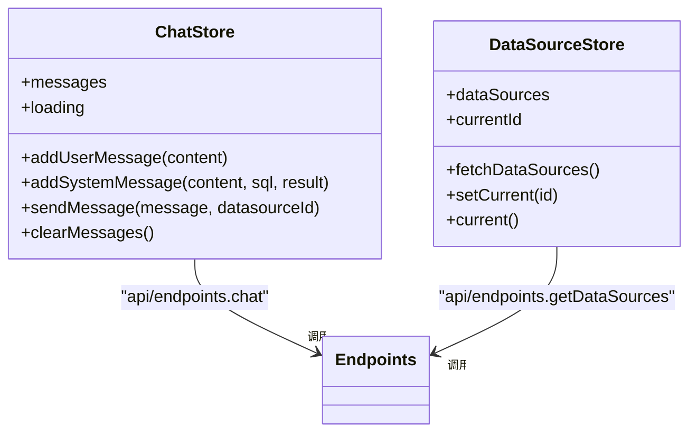
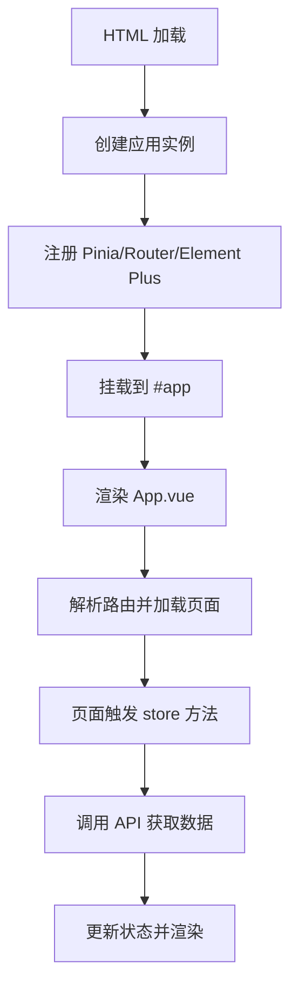
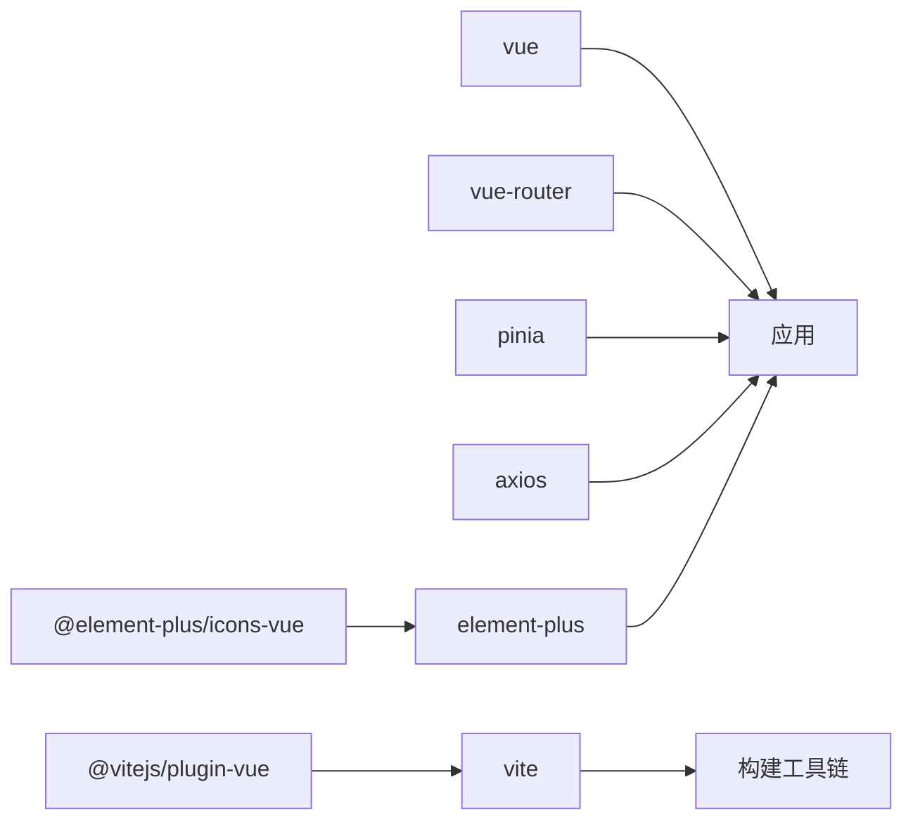

# Vue 应用结构

<cite>
**本文引用的文件**   
- [index.html](file://frontend/index.html)
- [package.json](file://frontend/package.json)
- [vite.config.js](file://frontend/vite.config.js)
- [main.js](file://frontend/src/main.js)
- [App.vue](file://frontend/src/App.vue)
- [router/index.js](file://frontend/src/router/index.js)
- [api/client.js](file://frontend/src/api/client.js)
- [api/endpoints.js](file://frontend/src/api/endpoints.js)
- [stores/chatStore.js](file://frontend/src/stores/chatStore.js)
- [stores/datasourceStore.js](file://frontend/src/stores/datasourceStore.js)
</cite>

## 目录
1. [简介](#简介)
2. [项目结构](#项目结构)
3. [核心组件](#核心组件)
4. [架构总览](#架构总览)
5. [详细组件分析](#详细组件分析)
6. [依赖关系分析](#依赖关系分析)
7. [性能与打包配置](#性能与打包配置)
8. [故障排查指南](#故障排查指南)
9. [结论](#结论)
10. [附录：最佳实践清单](#附录最佳实践清单)

## 简介
本文件面向前端开发者，系统化梳理该 Vue 3 + Vite 项目的整体结构与实现细节。重点覆盖入口文件组织、全局插件与服务注册、路由与页面组织、状态管理、HTTP 客户端封装、生命周期与初始化流程，以及开发规范、性能优化和打包策略。目标是帮助团队在现有工程基础上统一架构风格、提升可维护性与扩展性。

## 项目结构
该项目采用“按职责分层 + 功能模块”的前端目录组织方式：
- 构建与运行脚本位于根目录的配置文件与包描述文件中。
- 源码集中在 frontend/src 下，按 main 入口、视图 views、组件 components、路由 router、状态 stores、网络请求 api、样式 assets 划分。
- 页面级视图位于 views，通用 UI 片段位于 components，业务状态由 Pinia store 管理，API 接口集中在 api 层。

图表来源
- [index.html:1-13](file://frontend/index.html#L1-L13)
- [main.js:1-22](file://frontend/src/main.js#L1-L22)
- [App.vue:1-96](file://frontend/src/App.vue#L1-L96)
- [router/index.js:1-39](file://frontend/src/router/index.js#L1-L39)
- [api/client.js:1-48](file://frontend/src/api/client.js#L1-L48)
- [api/endpoints.js:1-20](file://frontend/src/api/endpoints.js#L1-L20)

章节来源
- [index.html:1-13](file://frontend/index.html#L1-L13)
- [package.json:1-23](file://frontend/package.json#L1-L23)
- [vite.config.js:1-15](file://frontend/vite.config.js#L1-L15)
- [main.js:1-22](file://frontend/src/main.js#L1-L22)

## 核心组件
- 应用入口 main.js：创建 Vue 应用实例，注册 Pinia、Vue Router、Element Plus，并挂载到 DOM。
- 根组件 App.vue：提供侧边栏导航、用户信息与退出登录逻辑，承载路由出口。
- 路由 router/index.js：定义页面路由、懒加载组件、默认重定向与全局前置守卫（未登录跳转）。
- HTTP 客户端 api/client.js：基于 Axios 封装基础 URL、超时、请求头、JWT 注入与错误提示。
- 接口层 api/endpoints.js：按业务域集中暴露认证、对话、元数据、数据源管理等 API。
- 状态管理 stores/chatStore.js 与 stores/datasourceStore.js：分别管理对话消息流与数据源列表/当前选择。

章节来源
- [main.js:1-22](file://frontend/src/main.js#L1-L22)
- [App.vue:1-96](file://frontend/src/App.vue#L1-L96)
- [router/index.js:1-39](file://frontend/src/router/index.js#L1-L39)
- [api/client.js:1-48](file://frontend/src/api/client.js#L1-L48)
- [api/endpoints.js:1-20](file://frontend/src/api/endpoints.js#L1-L20)
- [stores/chatStore.js:1-56](file://frontend/src/stores/chatStore.js#L1-L56)
- [stores/datasourceStore.js:1-28](file://frontend/src/stores/datasourceStore.js#L1-L28)

## 架构总览
从浏览器到后端的数据流如下：
- index.html 作为唯一 HTML 入口，加载 /src/main.js。
- main.js 初始化 Vue 应用并挂载到 #app。
- App.vue 渲染侧边栏与路由出口，控制菜单高亮和用户状态。
- 视图通过 Pinia store 发起业务操作，store 调用 api/endpoints.js 中的方法。
- endpoints.js 调用 client.js 封装的 axios 实例，自动携带 token 并处理响应。
- 请求经 Vite dev server 代理转发至后端服务。

图表来源
- [index.html:1-13](file://frontend/index.html#L1-L13)
- [main.js:1-22](file://frontend/src/main.js#L1-L22)
- [App.vue:1-96](file://frontend/src/App.vue#L1-L96)
- [router/index.js:1-39](file://frontend/src/router/index.js#L1-L39)
- [api/client.js:1-48](file://frontend/src/api/client.js#L1-L48)
- [api/endpoints.js:1-20](file://frontend/src/api/endpoints.js#L1-L20)

## 详细组件分析

### 应用入口与全局配置
- 应用初始化：使用 createApp 创建实例，依次注册 Pinia、Vue Router、Element Plus（含中文本地化），并挂载到 #app。
- 全局图标：遍历 ElementPlusIconsVue 将所有图标组件注册为全局组件，便于模板中直接使用。
- 全局样式：引入 assets/main.css 作为全局样式入口。

建议
- 将多环境配置抽离到环境变量或独立配置模块，避免硬编码 baseURL、端口等。
- 对 Element Plus 的配置项进行集中管理，便于切换主题与语言。

章节来源
- [main.js:1-22](file://frontend/src/main.js#L1-L22)

### 路由配置与页面组织
- 路由表包含首页重定向到聊天页，以及聊天、设置、登录三个页面；组件使用动态 import 实现按需加载。
- 使用 createWebHistory 模式，配合 Nginx 或服务器静态资源规则即可部署。
- 全局前置守卫：若访问非登录页且本地无 token，则跳转到登录页；登录成功后由业务逻辑写回 token。

图表来源
- [router/index.js:1-39](file://frontend/src/router/index.js#L1-L39)

建议
- 根据权限维度扩展路由守卫，例如角色/权限码校验。
- 对需要二次确认的敏感路由增加确认逻辑。
- 为每个页面增加路由级元信息，用于面包屑、标题与权限控制。

章节来源
- [router/index.js:1-39](file://frontend/src/router/index.js#L1-L39)

### 根组件与导航
- 根组件提供侧边栏菜单、当前激活项与用户信息显示，并通过 localStorage 获取用户名。
- 退出登录会清空本地 token 与用户名，并跳转到登录页。
- 路由出口 <router-view /> 承载具体页面内容。

建议
- 将用户信息纳入 Pinia 统一管理，避免多处读取 localStorage。
- 为菜单项增加权限控制与图标语义化。

章节来源
- [App.vue:1-96](file://frontend/src/App.vue#L1-L96)

### HTTP 客户端与接口层
- client.js 基于 axios 创建实例，统一设置基础路径、超时、请求头，并在请求拦截器中附加 Authorization 头。
- 响应拦截器根据后端统一返回结构判断成功与否，失败时弹出提示并拒绝 Promise；对 401 场景清除本地凭证并跳转登录。
- endpoints.js 按领域聚合接口方法，对外暴露 login、register、chat、metadata、datasources 等方法，屏蔽底层请求细节。

图表来源
- [api/client.js:1-48](file://frontend/src/api/client.js#L1-L48)
- [api/endpoints.js:1-20](file://frontend/src/api/endpoints.js#L1-L20)

建议
- 为不同后端版本增加客户端工厂或适配器，便于多环境或多协议接入。
- 将错误类型抽象为枚举，便于上层统一处理。
- 为长耗时接口添加取消请求能力与重试机制。

章节来源
- [api/client.js:1-48](file://frontend/src/api/client.js#L1-L48)
- [api/endpoints.js:1-20](file://frontend/src/api/endpoints.js#L1-L20)

### 状态管理与业务流程
- chatStore.js：维护消息列表与加载态，封装 addUserMessage、addSystemMessage、sendMessage、clearMessages。发送消息时调用后端对话接口，并将 SQL、列名、结果行等结构化数据写入系统消息。
- datasourceStore.js：维护数据源列表与当前选中 id，提供 fetchDataSources、setCurrent、current 等方法，并在首次加载时自动选择第一个数据源。

图表来源
- [stores/chatStore.js:1-56](file://frontend/src/stores/chatStore.js#L1-L56)
- [stores/datasourceStore.js:1-28](file://frontend/src/stores/datasourceStore.js#L1-L28)
- [api/endpoints.js:1-20](file://frontend/src/api/endpoints.js#L1-L20)

建议
- 对大量消息进行分页虚拟滚动或时间切片缓存。
- 将数据源列表加入缓存策略（如内存+持久化）减少重复请求。
- 将错误信息以结构化形式存储在 store，便于界面展示。

章节来源
- [stores/chatStore.js:1-56](file://frontend/src/stores/chatStore.js#L1-L56)
- [stores/datasourceStore.js:1-28](file://frontend/src/stores/datasourceStore.js#L1-L28)

### 应用生命周期与初始化流程
- HTML 入口加载 main.js。
- main.js 创建应用实例，注册 Pinia、Router、Element Plus 及全局图标，最后挂载到 DOM。
- App.vue 渲染后由 Router 决定当前视图。
- 路由守卫在每次路由变化前校验登录态。
- 视图组件在 mounted 等生命周期中触发 store 方法，store 再调用接口完成数据拉取与更新。

图表来源
- [index.html:1-13](file://frontend/index.html#L1-L13)
- [main.js:1-22](file://frontend/src/main.js#L1-L22)
- [App.vue:1-96](file://frontend/src/App.vue#L1-L96)
- [router/index.js:1-39](file://frontend/src/router/index.js#L1-L39)

## 依赖关系分析
- 运行时依赖：vue、vue-router、pinia、axios、element-plus、@element-plus/icons-vue。
- 构建依赖：@vitejs/plugin-vue、vite。
- 脚本命令：dev、build、preview。

图表来源
- [package.json:1-23](file://frontend/package.json#L1-L23)
- [vite.config.js:1-15](file://frontend/vite.config.js#L1-L15)

章节来源
- [package.json:1-23](file://frontend/package.json#L1-L23)
- [vite.config.js:1-15](file://frontend/vite.config.js#L1-L15)

## 性能与打包配置
- 开发服务器：端口固定为 5173，启用代理将 /api 转发至后端 http://localhost:8080，解决跨域问题。
- 路由懒加载：页面组件通过动态 import 按需加载，减小首屏体积。
- 组件与图标按需：Element Plus 可按需引入以减少体积；本项目已全局引入，建议在大型项目中改为按需引入。
- 构建输出：使用 Vite 标准构建流程，可通过环境变量区分开发与生产构建产物。

优化建议
- 开启 Gzip/Brotli 压缩与 CDN 分发。
- 对大图片、图表库等进行分包与懒加载。
- 对静态资源进行指纹命名与缓存策略优化。
- 使用 Tree Shaking 确保未用代码被剔除。
- 对长列表、大数据表格使用虚拟滚动与分页。

章节来源
- [vite.config.js:1-15](file://frontend/vite.config.js#L1-L15)

## 故障排查指南
常见问题与定位思路：
- 无法访问后端接口
  - 检查 vite.config.js 的代理配置是否与后端地址一致。
  - 确认请求路径是否以 /api 开头，确保走代理。
- 401 未授权
  - 检查本地是否存储了有效 token，client.js 会在 401 时清除凭证并跳转登录。
  - 核对后端 JWT 校验逻辑与过期策略。
- 中文显示异常或 UI 错乱
  - 确认 Element Plus 的中文本地化是否正确引入与应用。
- 路由守卫导致死循环
  - 检查登录页是否需要放行，确保登录成功后正确写入 token。

章节来源
- [api/client.js:1-48](file://frontend/src/api/client.js#L1-L48)
- [router/index.js:1-39](file://frontend/src/router/index.js#L1-L39)
- [vite.config.js:1-15](file://frontend/vite.config.js#L1-L15)

## 结论
该 Vue 3 + Vite 项目采用了清晰的分层结构：入口负责初始化与全局配置，路由负责页面组织与鉴权，视图负责交互，Pinia store 管理业务状态，API 层封装请求与错误处理。当前实现简洁可用，适合中小型项目快速迭代。后续可在按需引入、错误体系、权限模型、缓存策略等方面进一步规范化，以提升可维护性与可扩展性。

## 附录：最佳实践清单
- 入口与配置
  - 将环境变量与平台差异配置抽离到 .env 文件。
  - 将第三方 UI 库配置项集中管理。
- 路由
  - 为路由增加元信息（标题、权限、面包屑）。
  - 在路由守卫中实现细粒度权限控制。
- 网络
  - 统一错误码与错误码映射。
  - 增加请求取消、重试与幂等策略。
- 状态
  - 将用户信息、权限、偏好等全局状态纳入 Pinia。
  - 对高频数据增加缓存与失效策略。
- 组件
  - 遵循单一职责原则，拆分可复用组件。
  - 使用 props/emits 明确组件契约。
- 性能
  - 按需引入第三方库。
  - 对大图、图表、富文本编辑器等进行懒加载。
  - 合理使用 keep-alive 与路由级缓存。
- 打包
  - 使用 Vite 插件生态优化构建速度与产物大小。
  - 配置合理的 SourceMap 与监控上报。