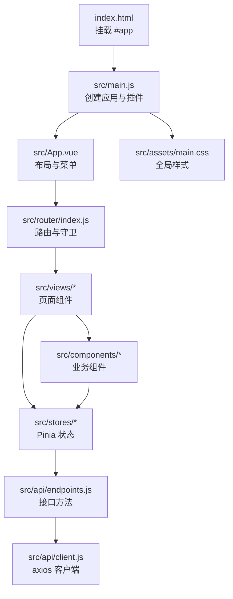
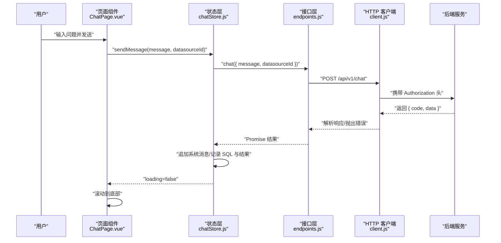
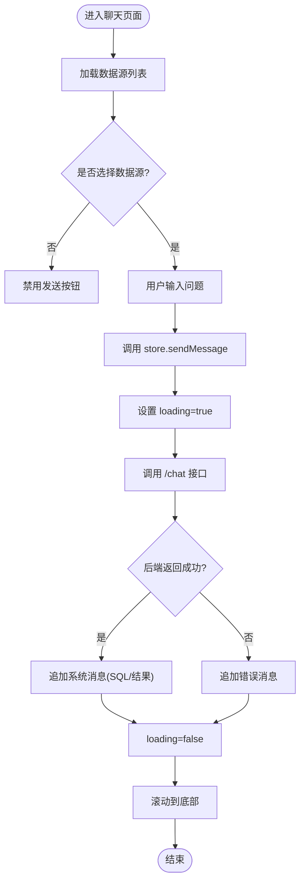
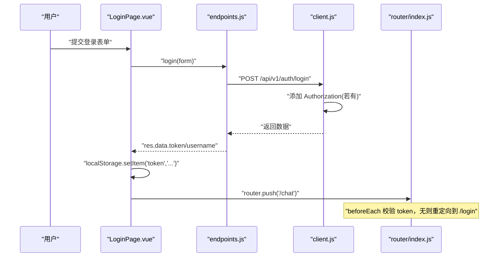
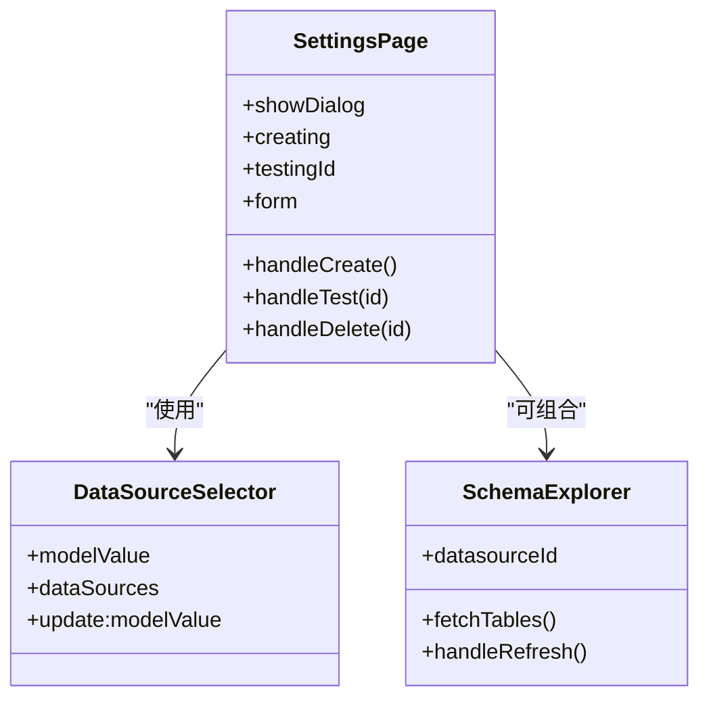
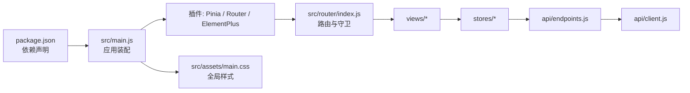

# 前端开发指南

<cite>
**本文引用的文件**   
- [package.json](file://frontend/package.json)
- [README.md](file://frontend/README.md)
- [index.html](file://frontend/index.html)
- [vite.config.js](file://frontend/vite.config.js)
- [src/main.js](file://frontend/src/main.js)
- [src/App.vue](file://frontend/src/App.vue)
- [src/router/index.js](file://frontend/src/router/index.js)
- [src/api/client.js](file://frontend/src/api/client.js)
- [src/api/endpoints.js](file://frontend/src/api/endpoints.js)
- [src/stores/chatStore.js](file://frontend/src/stores/chatStore.js)
- [src/stores/datasourceStore.js](file://frontend/src/stores/datasourceStore.js)
- [src/assets/main.css](file://frontend/src/assets/main.css)
- [src/views/ChatPage.vue](file://frontend/src/views/ChatPage.vue)
- [src/views/LoginPage.vue](file://frontend/src/views/LoginPage.vue)
- [src/views/SettingsPage.vue](file://frontend/src/views/SettingsPage.vue)
- [src/components/ChatInput.vue](file://frontend/src/components/ChatInput.vue)
- [src/components/ChatMessage.vue](file://frontend/src/components/ChatMessage.vue)
- [src/components/DataSourceSelector.vue](file://frontend/src/components/DataSourceSelector.vue)
- [src/components/ResultTable.vue](file://frontend/src/components/ResultTable.vue)
- [src/components/SchemaExplorer.vue](file://frontend/src/components/SchemaExplorer.vue)
- [src/components/HelloWorld.vue](file://frontend/src/components/HelloWorld.vue)
</cite>

## 目录
1. [简介](#简介)
2. [项目结构](#项目结构)
3. [核心组件](#核心组件)
4. [架构总览](#架构总览)
5. [详细组件分析](#详细组件分析)
6. [依赖与集成分析](#依赖与集成分析)
7. [性能与构建优化](#性能与构建优化)
8. [样式与主题规范](#样式与主题规范)
9. [开发与调试指南](#开发与调试指南)
10. [故障排查](#故障排查)
11. [结论](#结论)

## 简介
本指南面向前端开发者，系统梳理基于 Vue 3 + Vite + Pinia + Element Plus 的前端工程结构与开发规范。内容涵盖：
- 项目初始化、开发环境与热重载配置
- 路由与页面组织
- 状态管理（Pinia）设计
- API 客户端封装与错误处理
- 常用组件使用示例与最佳实践
- 样式组织、主题定制与响应式建议
- 构建产物优化与打包策略

该文档不直接展示源码内容，所有实现细节均通过“章节来源”标注对应文件路径与行号，便于定位与二次阅读。

**章节来源**
- [README.md:1-5](file://frontend/README.md#L1-L5)
- [package.json:1-23](file://frontend/package.json#L1-L23)

## 项目结构
项目采用功能与层次混合的组织方式：
- 入口与构建：`index.html` 挂载应用；`vite.config.js` 配置开发服务器与代理；`package.json` 声明脚本与依赖。
- 应用装配：`src/main.js` 创建应用、注册 Pinia、Element Plus、路由并挂载。
- 视图层：`src/views/` 下为页面级组件，负责组合业务子组件与调用 Store。
- 组件层：`src/components/` 提供可复用 UI 组件，如聊天输入、消息气泡、数据源选择器、结果表格、元数据树等。
- 状态层：`src/stores/` 使用 Pinia 定义 chat 与 datasource 两个模块。
- 接口层：`src/api/` 封装 axios 客户端与接口方法。
- 样式层：全局样式在 `src/assets/main.css`，各组件使用 scoped 样式。

**图表来源**
- [index.html:1-13](file://frontend/index.html#L1-L13)
- [src/main.js:1-22](file://frontend/src/main.js#L1-L22)
- [src/App.vue:1-96](file://frontend/src/App.vue#L1-L96)
- [src/router/index.js:1-39](file://frontend/src/router/index.js#L1-L39)
- [src/api/client.js:1-48](file://frontend/src/api/client.js#L1-L48)
- [src/api/endpoints.js:1-20](file://frontend/src/api/endpoints.js#L1-L20)
- [src/assets/main.css:1-88](file://frontend/src/assets/main.css#L1-L88)

**章节来源**
- [index.html:1-13](file://frontend/index.html#L1-L13)
- [vite.config.js:1-15](file://frontend/vite.config.js#L1-L15)
- [src/main.js:1-22](file://frontend/src/main.js#L1-L22)
- [src/App.vue:1-96](file://frontend/src/App.vue#L1-L96)

## 核心组件
本节从“页面-组件-状态-接口-样式”五个维度，总结关键职责与协作关系。

- 页面组件
  - ChatPage：组合数据源选择、聊天输入、消息列表与结果表格，协调 Store 发起对话请求，自动滚动到底部。
  - LoginPage：登录/注册表单，校验后调用认证接口，成功后持久化 token 与用户名并跳转。
  - SettingsPage：数据源增删改查、连接测试，维护本地表单状态并在操作后刷新列表。
- 组件
  - ChatInput：双向绑定文本，回车或点击发送，禁用态由父级控制。
  - ChatMessage：根据角色渲染用户/系统消息，展示 SQL 与结果摘要标签。
  - DataSourceSelector：封装 Element Plus Select，支持 v-model 双向绑定。
  - ResultTable：将列名作为表头，动态渲染行数据，限制最大高度。
  - SchemaExplorer：拉取并渲染数据库表与字段树，支持刷新。
- 状态管理
  - chatStore：维护消息列表与加载状态，封装 sendMessage 流程，统一成功/失败提示。
  - datasourceStore：维护数据源列表与当前选中项，提供获取与设置方法。
- 接口层
  - client：统一 baseURL、超时、鉴权注入、统一错误提示与 401 处理。
  - endpoints：按业务域导出 REST 方法，供 Store 与页面调用。
- 样式
  - main.css：CSS 变量、全局重置、侧边栏与主内容区布局、聊天消息气泡、SQL 展示块、输入区域基础样式。

**章节来源**
- [src/views/ChatPage.vue:1-179](file://frontend/src/views/ChatPage.vue#L1-L179)
- [src/views/LoginPage.vue:1-130](file://frontend/src/views/LoginPage.vue#L1-L130)
- [src/views/SettingsPage.vue:1-146](file://frontend/src/views/SettingsPage.vue#L1-L146)
- [src/components/ChatInput.vue:1-60](file://frontend/src/components/ChatInput.vue#L1-L60)
- [src/components/ChatMessage.vue:1-34](file://frontend/src/components/ChatMessage.vue#L1-L34)
- [src/components/DataSourceSelector.vue:1-27](file://frontend/src/components/DataSourceSelector.vue#L1-L27)
- [src/components/ResultTable.vue:1-36](file://frontend/src/components/ResultTable.vue#L1-L36)
- [src/components/SchemaExplorer.vue:1-133](file://frontend/src/components/SchemaExplorer.vue#L1-L133)
- [src/stores/chatStore.js:1-56](file://frontend/src/stores/chatStore.js#L1-L56)
- [src/stores/datasourceStore.js:1-28](file://frontend/src/stores/datasourceStore.js#L1-L28)
- [src/api/client.js:1-48](file://frontend/src/api/client.js#L1-L48)
- [src/api/endpoints.js:1-20](file://frontend/src/api/endpoints.js#L1-L20)
- [src/assets/main.css:1-88](file://frontend/src/assets/main.css#L1-L88)

## 架构总览
前端整体采用“页面组合 + 组件拆分 + Pinia 状态 + Axios 客户端”的分层架构。路由守卫保证未登录时重定向到登录页；API 客户端拦截器统一注入 Authorization 头并处理 401 场景；页面与组件仅关注展示与交互，业务逻辑下沉至 Store 与接口层。

**图表来源**
- [src/views/ChatPage.vue:1-179](file://frontend/src/views/ChatPage.vue#L1-L179)
- [src/stores/chatStore.js:1-56](file://frontend/src/stores/chatStore.js#L1-L56)
- [src/api/endpoints.js:1-20](file://frontend/src/api/endpoints.js#L1-L20)
- [src/api/client.js:1-48](file://frontend/src/api/client.js#L1-L48)

**章节来源**
- [src/router/index.js:1-39](file://frontend/src/router/index.js#L1-L39)
- [src/api/client.js:1-48](file://frontend/src/api/client.js#L1-L48)

## 详细组件分析

### 聊天对话流程
聊天对话是核心业务流程，涉及页面组合、Store 异步请求、消息展示与结果表格渲染。

**图表来源**
- [src/views/ChatPage.vue:1-179](file://frontend/src/views/ChatPage.vue#L1-L179)
- [src/stores/chatStore.js:1-56](file://frontend/src/stores/chatStore.js#L1-L56)

**章节来源**
- [src/views/ChatPage.vue:1-179](file://frontend/src/views/ChatPage.vue#L1-L179)
- [src/stores/chatStore.js:1-56](file://frontend/src/stores/chatStore.js#L1-L56)
- [src/components/ChatInput.vue:1-60](file://frontend/src/components/ChatInput.vue#L1-L60)
- [src/components/ChatMessage.vue:1-34](file://frontend/src/components/ChatMessage.vue#L1-L34)
- [src/components/ResultTable.vue:1-36](file://frontend/src/components/ResultTable.vue#L1-L36)

### 登录与鉴权流程
登录后将 token 与用户名写入 localStorage；路由守卫与 HTTP 拦截器共同保障鉴权一致性。

**图表来源**
- [src/views/LoginPage.vue:1-130](file://frontend/src/views/LoginPage.vue#L1-L130)
- [src/api/endpoints.js:1-20](file://frontend/src/api/endpoints.js#L1-L20)
- [src/api/client.js:1-48](file://frontend/src/api/client.js#L1-L48)
- [src/router/index.js:1-39](file://frontend/src/router/index.js#L1-L39)

**章节来源**
- [src/views/LoginPage.vue:1-130](file://frontend/src/views/LoginPage.vue#L1-L130)
- [src/router/index.js:1-39](file://frontend/src/router/index.js#L1-L39)
- [src/api/client.js:1-48](file://frontend/src/api/client.js#L1-L48)

### 数据源管理与元数据浏览
数据源管理页面负责数据源的增删改查与连接测试；SchemaExplorer 负责将后端表/列信息以树形结构展示。

**图表来源**
- [src/views/SettingsPage.vue:1-146](file://frontend/src/views/SettingsPage.vue#L1-L146)
- [src/components/DataSourceSelector.vue:1-27](file://frontend/src/components/DataSourceSelector.vue#L1-L27)
- [src/components/SchemaExplorer.vue:1-133](file://frontend/src/components/SchemaExplorer.vue#L1-L133)

**章节来源**
- [src/views/SettingsPage.vue:1-146](file://frontend/src/views/SettingsPage.vue#L1-L146)
- [src/components/SchemaExplorer.vue:1-133](file://frontend/src/components/SchemaExplorer.vue#L1-L133)

### 组件设计规范与最佳实践
- 使用 `<script setup>` 语法，保持组件简洁清晰。
- 组件属性与事件使用 `defineProps` 与 `defineEmits` 明确类型与契约。
- 对外暴露可控的 props（如 disabled、modelValue），内部状态尽量局部化。
- 复杂展示逻辑下沉到子组件（如 ChatMessage、ResultTable）。
- 通过 Pinia 集中管理跨组件共享状态（消息列表、数据源列表）。
- 接口调用统一经过 endpoints，避免在组件中直接耦合 axios。

**章节来源**
- [src/components/ChatInput.vue:1-60](file://frontend/src/components/ChatInput.vue#L1-L60)
- [src/components/ChatMessage.vue:1-34](file://frontend/src/components/ChatMessage.vue#L1-L34)
- [src/components/DataSourceSelector.vue:1-27](file://frontend/src/components/DataSourceSelector.vue#L1-L27)
- [src/components/ResultTable.vue:1-36](file://frontend/src/components/ResultTable.vue#L1-L36)
- [src/stores/chatStore.js:1-56](file://frontend/src/stores/chatStore.js#L1-L56)
- [src/stores/datasourceStore.js:1-28](file://frontend/src/stores/datasourceStore.js#L1-L28)

## 依赖与集成分析
- 运行时依赖
  - vue、vue-router、pinia、axios、element-plus、@element-plus/icons-vue。
- 开发依赖
  - vite、@vitejs/plugin-vue。
- 应用装配顺序
  - 先创建应用实例，再依次安装 Pinia、Router、Element Plus，最后挂载到 DOM。
  - 全局注册 Element Plus 图标组件，统一语言包为中文。
- 路由与权限
  - 默认首页重定向到 `/chat`。
  - 未携带 token 访问非登录页面时，强制跳转 `/login`。
- 网络与代理
  - 开发环境通过 Vite 代理将 `/api` 转发到后端服务。
  - API 客户端 baseURL 为 `/api/v1`，统一超时与 Content-Type。

**图表来源**
- [package.json:1-23](file://frontend/package.json#L1-L23)
- [src/main.js:1-22](file://frontend/src/main.js#L1-L22)
- [src/router/index.js:1-39](file://frontend/src/router/index.js#L1-L39)
- [src/api/client.js:1-48](file://frontend/src/api/client.js#L1-L48)
- [src/api/endpoints.js:1-20](file://frontend/src/api/endpoints.js#L1-L20)
- [src/assets/main.css:1-88](file://frontend/src/assets/main.css#L1-L88)

**章节来源**
- [package.json:1-23](file://frontend/package.json#L1-L23)
- [src/main.js:1-22](file://frontend/src/main.js#L1-L22)
- [src/router/index.js:1-39](file://frontend/src/router/index.js#L1-L39)
- [vite.config.js:1-15](file://frontend/vite.config.js#L1-L15)

## 性能与构建优化
- 开发体验
  - Vite 默认启用快速冷启动与热更新；端口 5173。
  - 开发代理将 `/api` 转发至后端服务，解决跨域。
- 构建优化建议
  - 按需引入 Element Plus 组件与样式，减少包体体积。
  - 对大图片或静态资源进行压缩与懒加载。
  - 开启 Vite 的代码分割与 gzip/brotli 压缩（可在后续扩展）。
  - 使用浏览器缓存策略，合理设置资源文件名哈希。
- 运行时优化
  - 列表渲染使用 key 提升 Diff 性能。
  - 大数据表格分页或虚拟滚动（可根据业务扩展）。
  - 长耗时接口增加取消机制与重试策略（可扩展）。

[本节为通用指导，不涉及具体源码片段]

## 样式与主题规范
- 全局样式
  - 使用 CSS 变量定义主题色、背景色与侧边栏宽度，便于统一换肤。
  - 全局重置 box-sizing，统一字体栈，确保多平台一致性。
- 布局
  - 应用容器采用 Flex 布局，左侧固定宽度侧边栏，右侧自适应主内容区。
  - 聊天区域采用上下分栏：上方消息列表，底部输入区域。
- 组件样式
  - 所有组件使用 scoped 样式，避免污染全局。
  - 通过 Element Plus 的类名与深度选择器调整内部元素样式。
- 响应式设计
  - 优先使用相对单位与弹性布局适配不同屏幕尺寸。
  - 在小屏设备下考虑隐藏次要信息或折叠侧边栏。

**章节来源**
- [src/assets/main.css:1-88](file://frontend/src/assets/main.css#L1-L88)
- [src/App.vue:1-96](file://frontend/src/App.vue#L1-L96)

## 开发与调试指南
- 环境搭建
  - 安装 Node.js 与包管理器（npm/yarn/pnpm）。
  - 在项目根目录执行依赖安装命令。
  - 启动开发服务器并访问指定端口。
- 运行脚本
  - 开发：启动 Vite 开发服务器，包含热重载。
  - 构建：生产构建产物。
  - 预览：预览构建产物。
- 本地联调
  - 确保后端服务在指定端口运行，Vite 代理会将 `/api` 转发至后端。
  - 若后端地址变更，修改 Vite 配置中的代理 target。
- 调试技巧
  - 使用浏览器 DevTools 查看 Network 面板，确认请求路径、Header 与响应体。
  - 检查 localStorage 中 token 与 username 是否正确写入。
  - 利用 console 输出 Store 状态变化，定位状态异常。

**章节来源**
- [package.json:1-23](file://frontend/package.json#L1-L23)
- [vite.config.js:1-15](file://frontend/vite.config.js#L1-L15)

## 故障排查
- 401 未授权
  - 现象：请求返回 401，客户端清除本地 token 并跳转登录页，同时弹出提示。
  - 排查：检查登录流程是否正确保存 token；确认后端 JWT 签发与校验逻辑。
- 接口报错提示
  - 现象：统一错误提示显示“请求失败”或后端返回的 message。
  - 排查：检查后端返回的 code 与 message 是否符合预期；必要时在客户端打印日志。
- 路由守卫导致无法进入页面
  - 现象：访问非登录页面被重定向到 `/login`。
  - 排查：确认 localStorage 中存在有效的 token；检查路由守卫逻辑。
- 代理不生效
  - 现象：开发环境请求未到达后端。
  - 排查：确认 Vite 代理配置与后端服务端口一致；检查浏览器控制台网络请求路径。

**章节来源**
- [src/api/client.js:1-48](file://frontend/src/api/client.js#L1-L48)
- [src/router/index.js:1-39](file://frontend/src/router/index.js#L1-L39)
- [vite.config.js:1-15](file://frontend/vite.config.js#L1-L15)

## 结论
本项目以清晰的层次划分与统一的工具链为基础，提供了稳定的聊天对话、数据源管理与元数据浏览能力。通过 Pinia 集中管理状态、Axios 客户端统一封装接口与错误处理，配合 Element Plus 的丰富组件体系，能够快速扩展更多业务页面与功能。建议后续持续完善按需引入、资源优化与单元测试，进一步提升性能与可维护性。