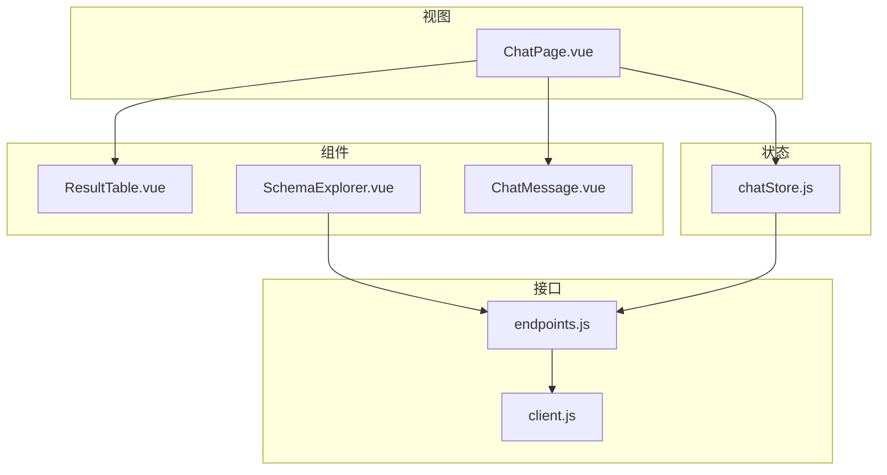
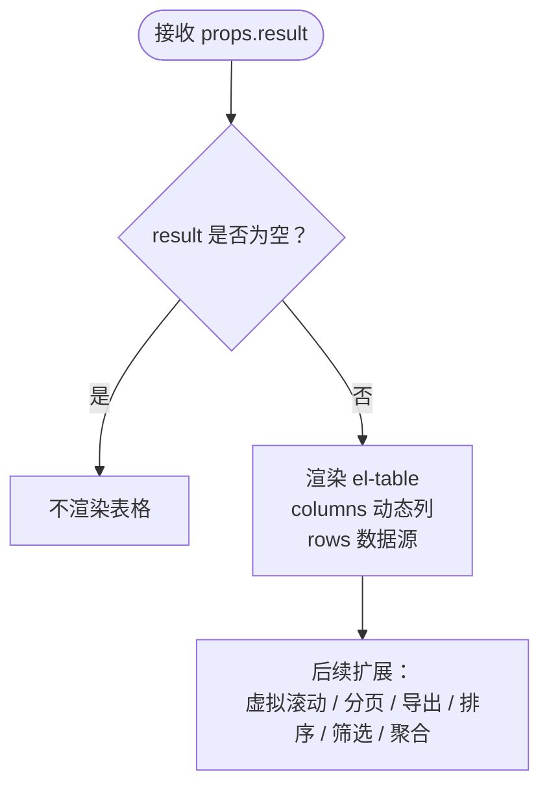
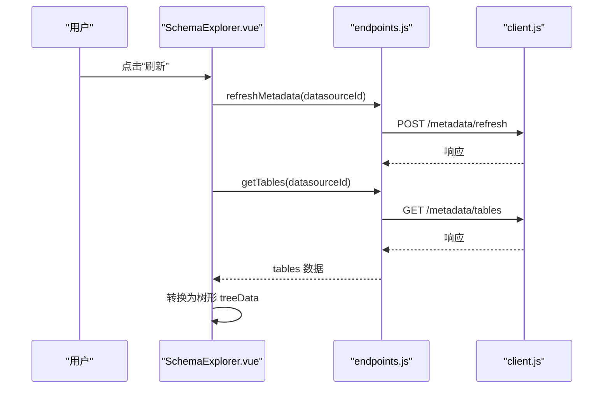
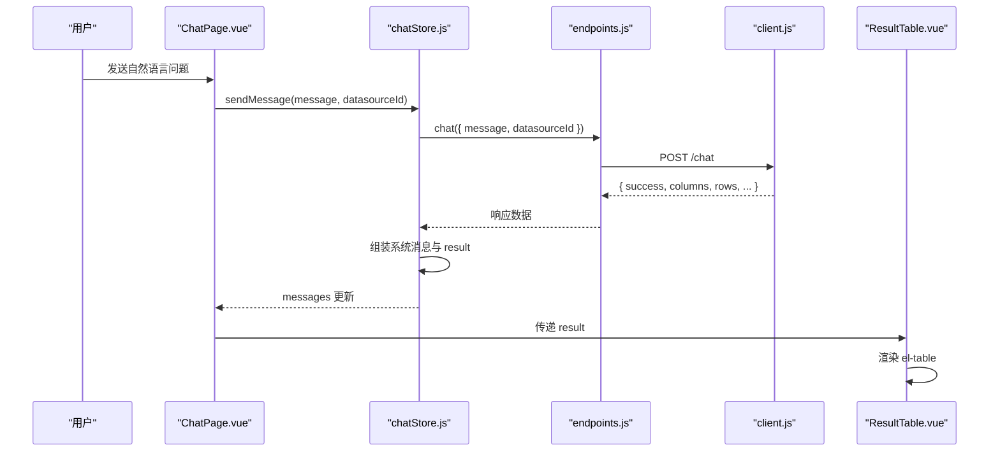
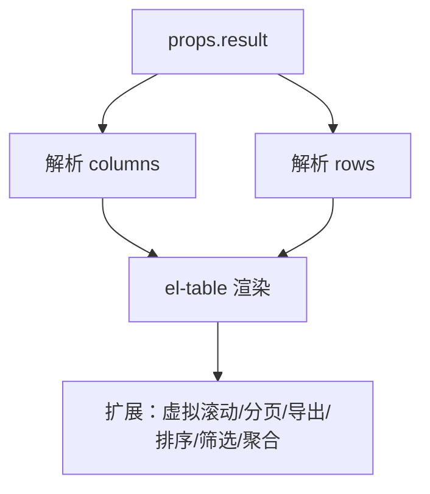
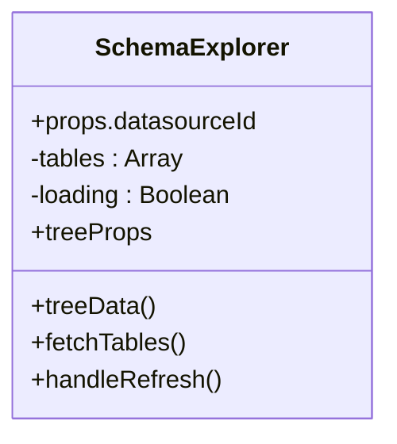
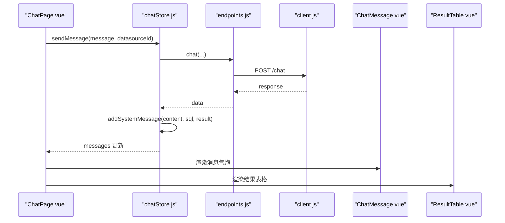
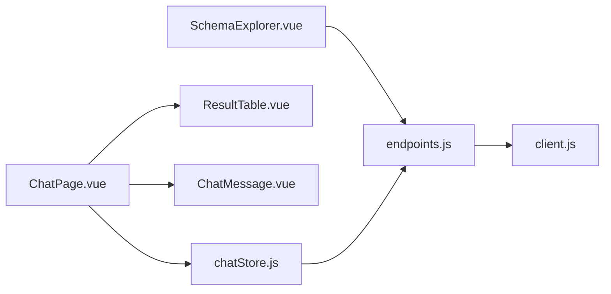

# 数据展示组件

<cite>
**本文引用的文件**
- [ResultTable.vue](file://frontend/src/components/ResultTable.vue)
- [SchemaExplorer.vue](file://frontend/src/components/SchemaExplorer.vue)
- [ChatPage.vue](file://frontend/src/views/ChatPage.vue)
- [chatStore.js](file://frontend/src/stores/chatStore.js)
- [endpoints.js](file://frontend/src/api/endpoints.js)
- [client.js](file://frontend/src/api/client.js)
- [ChatMessage.vue](file://frontend/src/components/ChatMessage.vue)
- [main.css](file://frontend/src/assets/main.css)
</cite>

## 目录
1. [引言](#引言)
2. [项目结构](#项目结构)
3. [核心组件](#核心组件)
4. [架构总览](#架构总览)
5. [详细组件分析](#详细组件分析)
6. [依赖关系分析](#依赖关系分析)
7. [性能与大数据优化](#性能与大数据优化)
8. [故障排查指南](#故障排查指南)
9. [结论](#结论)
10. [附录：面向前端开发者的实践清单](#附录面向前端开发者的实践清单)

## 引言
本文件聚焦于前端数据展示相关组件，重点包括：
- ResultTable：基于 Element Plus 的表格结果展示。
- SchemaExplorer：数据库表结构的树形浏览组件。
- ChatPage、chatStore、API 客户端等支撑这些组件的数据流与状态管理。

当前仓库中的 ResultTable 是一个轻量实现，尚未包含虚拟滚动、分页加载、导出、排序、筛选、聚合等高级能力；SchemaExplorer 实现了基础的树形展示与刷新，但缺少搜索过滤和节点选择。本文在“现状说明”的基础上，给出可落地的扩展方案、性能优化策略以及移动端适配建议，帮助前端开发者构建高效、可扩展的数据展示组件体系。

## 项目结构
与数据展示相关的代码主要位于前端模块中，关键文件分布如下：
- 组件层：ResultTable.vue、SchemaExplorer.vue、ChatMessage.vue
- 视图层：ChatPage.vue
- 状态层：chatStore.js
- API 层：client.js、endpoints.js
- 全局样式：main.css

**图表来源**
- [ChatPage.vue:1-179](file://frontend/src/views/ChatPage.vue#L1-L179)
- [ResultTable.vue:1-36](file://frontend/src/components/ResultTable.vue#L1-L36)
- [SchemaExplorer.vue:1-133](file://frontend/src/components/SchemaExplorer.vue#L1-L133)
- [chatStore.js:1-56](file://frontend/src/stores/chatStore.js#L1-L56)
- [endpoints.js:1-20](file://frontend/src/api/endpoints.js#L1-L20)
- [client.js:1-48](file://frontend/src/api/client.js#L1-L48)

**章节来源**
- [ChatPage.vue:1-179](file://frontend/src/views/ChatPage.vue#L1-L179)
- [ResultTable.vue:1-36](file://frontend/src/components/ResultTable.vue#L1-L36)
- [SchemaExplorer.vue:1-133](file://frontend/src/components/SchemaExplorer.vue#L1-L133)
- [chatStore.js:1-56](file://frontend/src/stores/chatStore.js#L1-L56)
- [endpoints.js:1-20](file://frontend/src/api/endpoints.js#L1-L20)
- [client.js:1-48](file://frontend/src/api/client.js#L1-L48)

## 核心组件
本节从“现状能力”与“扩展目标”两个维度说明 ResultTable 与 SchemaExplorer。

### ResultTable（结果表格）
- 现状能力
  - 接收父组件传入的 result 对象，包含 columns 与 rows。
  - 使用 Element Plus 的 el-table 渲染二维表格。
  - 开启边框、斑马纹、固定最大高度，列最小宽度 120，并启用超长内容溢出提示。
- 待扩展能力
  - 虚拟滚动：当 rows 达到万级时避免一次性创建大量 DOM。
  - 分页加载：按页拉取数据，减少首屏压力。
  - 导出：支持 CSV、Excel 导出。
  - 排序、筛选、聚合计算：列头排序、多条件筛选、汇总行或侧边统计。
  - 响应式布局：小屏下横向滚动、列宽自适应、工具栏折叠。

**图表来源**
- [ResultTable.vue:1-36](file://frontend/src/components/ResultTable.vue#L1-L36)

**章节来源**
- [ResultTable.vue:1-36](file://frontend/src/components/ResultTable.vue#L1-L36)
- [ChatPage.vue:1-179](file://frontend/src/views/ChatPage.vue#L1-L179)
- [chatStore.js:1-56](file://frontend/src/stores/chatStore.js#L1-L56)

### SchemaExplorer（表结构浏览器）
- 现状能力
  - 根据 datasourceId 拉取表列表，将后端返回的 tables 映射为树形结构。
  - 使用 el-tree 展示表与列，默认展开所有节点。
  - 提供“刷新”按钮，调用 refreshMetadata 后重新获取表结构。
- 待扩展能力
  - 搜索过滤：支持关键字匹配表名、列名、注释。
  - 节点选择：多选/单选表或列，用于生成 SQL 或作为查询上下文。
  - 懒加载：大库场景下按需加载列信息。
  - 状态持久化：记住上次展开、选中状态。

**图表来源**
- [SchemaExplorer.vue:1-133](file://frontend/src/components/SchemaExplorer.vue#L1-L133)
- [endpoints.js:1-20](file://frontend/src/api/endpoints.js#L1-L20)
- [client.js:1-48](file://frontend/src/api/client.js#L1-L48)

**章节来源**
- [SchemaExplorer.vue:1-133](file://frontend/src/components/SchemaExplorer.vue#L1-L133)
- [endpoints.js:1-20](file://frontend/src/api/endpoints.js#L1-L20)
- [client.js:1-48](file://frontend/src/api/client.js#L1-L48)

## 架构总览
下图展示了从用户输入到表格展示的完整链路，以及元数据浏览的辅助流程。

**图表来源**
- [ChatPage.vue:1-179](file://frontend/src/views/ChatPage.vue#L1-L179)
- [chatStore.js:1-56](file://frontend/src/stores/chatStore.js#L1-L56)
- [endpoints.js:1-20](file://frontend/src/api/endpoints.js#L1-L20)
- [client.js:1-48](file://frontend/src/api/client.js#L1-L48)
- [ResultTable.vue:1-36](file://frontend/src/components/ResultTable.vue#L1-L36)

## 详细组件分析

### ResultTable 深度分析
- 数据契约
  - props.result.columns：字符串数组，表示列名。
  - props.result.rows：二维数组或对象数组，表示数据行。
- 渲染逻辑
  - 动态列：通过 v-for 遍历 columns，绑定 prop 与 label。
  - 表格行为：border、stripe、size="small"、max-height="400"，启用 show-overflow-tooltip。
- 扩展点
  - 虚拟滚动：替换 el-table 为 el-virtual-list 或引入大型表格库（如 AG Grid），仅渲染可视区域行。
  - 分页加载：将 rows 改为分页模型 { total, page, pageSize, rows }，结合后端分页参数。
  - 导出：在组件内增加“导出”按钮，按列顺序拼接 CSV 或使用 xlsx 库导出 Excel。
  - 排序：为每列添加 sortable，前端维护 sortState，对 rows 进行稳定排序。
  - 筛选：在列头增加筛选器，维护 filterMap，按列类型执行文本/数值范围过滤。
  - 聚合：计算汇总行（如合计、平均、计数），放在表格底部或侧边面板。
  - 响应式：在小屏幕下隐藏次要列，或将表格置于抽屉/弹窗中。

**图表来源**
- [ResultTable.vue:1-36](file://frontend/src/components/ResultTable.vue#L1-L36)

**章节来源**
- [ResultTable.vue:1-36](file://frontend/src/components/ResultTable.vue#L1-L36)

### SchemaExplorer 深度分析
- 数据契约
  - 接收 props.datasourceId，若为空则不发起请求。
  - 内部维护 tables 原始数组，并通过 computed 转为 treeData。
- 树形结构
  - 每个 table 为一个根节点，children 为该表的列节点。
  - isTable 字段区分节点类型，用于图标显示。
- 交互流程
  - watch 监听 datasourceId，首次挂载即拉取数据。
  - handleRefresh 先调用 refreshMetadata 再重新拉取表结构。
- 扩展点
  - 搜索过滤：新增 searchKeyword，对表名、列名、comment 进行模糊匹配。
  - 节点选择：为节点增加 selectable，维护 selectedNodes，供上层组件使用。
  - 懒加载：当节点数较多时，延迟加载列信息。
  - 展开状态：记录 expandedKeys，提升用户体验。

**图表来源**
- [SchemaExplorer.vue:1-133](file://frontend/src/components/SchemaExplorer.vue#L1-L133)

**章节来源**
- [SchemaExplorer.vue:1-133](file://frontend/src/components/SchemaExplorer.vue#L1-L133)

### 数据流与状态管理
- ChatPage 负责组合 UI：顶部数据源选择、清空对话、消息列表、输入框。
- chatStore 维护 messages 与 loading，封装 sendMessage，统一处理成功/失败分支。
- endpoints 暴露 REST 接口函数，client 提供 axios 实例与拦截器。
- ChatMessage 展示消息气泡、SQL 片段与结果摘要（列数/行数）。

**图表来源**
- [ChatPage.vue:1-179](file://frontend/src/views/ChatPage.vue#L1-L179)
- [chatStore.js:1-56](file://frontend/src/stores/chatStore.js#L1-L56)
- [endpoints.js:1-20](file://frontend/src/api/endpoints.js#L1-L20)
- [client.js:1-48](file://frontend/src/api/client.js#L1-L48)
- [ChatMessage.vue:1-34](file://frontend/src/components/ChatMessage.vue#L1-L34)
- [ResultTable.vue:1-36](file://frontend/src/components/ResultTable.vue#L1-L36)

**章节来源**
- [ChatPage.vue:1-179](file://frontend/src/views/ChatPage.vue#L1-L179)
- [chatStore.js:1-56](file://frontend/src/stores/chatStore.js#L1-L56)
- [ChatMessage.vue:1-34](file://frontend/src/components/ChatMessage.vue#L1-L34)

## 依赖关系分析
- 组件耦合
  - ChatPage 强依赖 chatStore 与 ResultTable、ChatMessage。
  - SchemaExplorer 依赖 endpoints 提供的元数据接口。
  - chatStore 依赖 endpoints，间接依赖 client。
- 外部依赖
  - Element Plus：表格、树、图标、消息提示等 UI 组件。
  - Vue 3 Composition API：ref、computed、watch、onMounted 等。
  - Pinia：定义与使用 chatStore。
  - Axios：HTTP 客户端。

**图表来源**
- [ChatPage.vue:1-179](file://frontend/src/views/ChatPage.vue#L1-L179)
- [SchemaExplorer.vue:1-133](file://frontend/src/components/SchemaExplorer.vue#L1-L133)
- [chatStore.js:1-56](file://frontend/src/stores/chatStore.js#L1-L56)
- [endpoints.js:1-20](file://frontend/src/api/endpoints.js#L1-L20)
- [client.js:1-48](file://frontend/src/api/client.js#L1-L48)

**章节来源**
- [ChatPage.vue:1-179](file://frontend/src/views/ChatPage.vue#L1-L179)
- [SchemaExplorer.vue:1-133](file://frontend/src/components/SchemaExplorer.vue#L1-L133)
- [chatStore.js:1-56](file://frontend/src/stores/chatStore.js#L1-L56)
- [endpoints.js:1-20](file://frontend/src/api/endpoints.js#L1-L20)
- [client.js:1-48](file://frontend/src/api/client.js#L1-L48)

## 性能与大数据优化
以下建议适用于 ResultTable 的大数据量场景与整体数据可视化体验。

- 虚拟滚动
  - 适用场景：rows 超过数千条时，DOM 节点过多导致卡顿。
  - 方案：使用 el-virtual-list 或第三方虚拟表格，仅渲染可视区行；配合 rowKey 保证复用与稳定渲染。
  - 收益：显著降低内存占用与重排成本，保持流畅滚动。

- 分页加载
  - 适用场景：后端一次返回全量数据成本高。
  - 方案：将分页参数 page/pageSize 推送到后端，前端维护分页状态；表格底部保留分页控件。
  - 收益：首屏快速加载，按需获取更多数据。

- 导出优化
  - 适用场景：需要导出当前页或全部数据。
  - 方案：CSV 使用流式拼接；Excel 使用后台生成下载链接；避免在前端大规模构造二进制对象。
  - 收益：减少主线程阻塞，提升用户体验。

- 排序与筛选
  - 适用场景：用户频繁切换排序与筛选条件。
  - 方案：前端缓存排序键与筛选条件；对 rows 进行不可变更新；复杂条件交由后端分页+过滤。
  - 收益：减少重复计算，提高交互响应速度。

- 聚合计算
  - 适用场景：需要汇总统计（合计、均值、计数）。
  - 方案：对可见行进行增量计算；大数据时使用 Web Worker 或后端聚合。
  - 收益：避免主线程阻塞，保证交互流畅。

- 内存管理
  - 避免闭包引用大对象；及时解绑事件监听；组件卸载前清理定时器与 WebSocket。
  - 对长列表使用 key 稳定标识，避免不必要的重建。
  - 对图片与富文本进行懒加载与虚拟化。

- 响应式与移动端适配
  - 表格在小屏下启用横向滚动；隐藏次要列；工具栏折叠至抽屉。
  - 使用 CSS 变量控制主题与尺寸；结合媒体查询调整间距与字号。
  - 触摸友好的交互：增大点击区域，支持滑动翻页。

[本节为通用指导，不涉及具体文件实现]

## 故障排查指南
- 未选择数据源
  - 现象：SchemaExplorer 不触发请求。
  - 原因：props.datasourceId 为空时直接返回。
  - 解决：确保 ChatPage 已选择数据源并正确传递给子组件。

- 表格无数据
  - 现象：ResultTable 不渲染。
  - 原因：result 为空或 undefined。
  - 解决：检查 chatStore 是否正确组装 result；确认后端返回 columns 与 rows。

- 网络错误与鉴权失败
  - 现象：请求被拒绝或跳转到登录页。
  - 原因：client 拦截器对 401 进行处理；非 200 响应抛出错误。
  - 解决：检查 token 是否存在且有效；查看后端返回码与消息。

- 树形结构为空
  - 现象：SchemaExplorer 显示“暂无数据”。
  - 原因：getTables 返回空数组或请求失败。
  - 解决：检查接口连通性与权限；查看控制台错误日志。

**章节来源**
- [SchemaExplorer.vue:1-133](file://frontend/src/components/SchemaExplorer.vue#L1-L133)
- [ResultTable.vue:1-36](file://frontend/src/components/ResultTable.vue#L1-L36)
- [chatStore.js:1-56](file://frontend/src/stores/chatStore.js#L1-L56)
- [client.js:1-48](file://frontend/src/api/client.js#L1-L48)

## 结论
当前仓库中的数据展示组件具备基础能力：ResultTable 能展示后端返回的二维数据；SchemaExplorer 能展示表结构与列信息；ChatPage 与 chatStore 构成了聊天问答的核心流程。面向大数据与高可用体验，建议在 ResultTable 上优先补齐虚拟滚动与分页加载，随后逐步完善排序、筛选、聚合与导出；在 SchemaExplorer 上补充搜索过滤与节点选择，提升元数据导航效率。同时结合响应式设计与内存优化策略，打造高性能、易维护的前端数据展示体系。

[本节为总结性内容，不涉及具体文件实现]

## 附录：面向前端开发者的实践清单
- ResultTable
  - 优先接入虚拟滚动与分页加载，再考虑导出与聚合。
  - 为列定义类型与格式化规则，统一展示一致性。
  - 使用稳定的 rowKey，避免不必要的重渲染。
  - 对小屏设备隐藏次要列，并提供横向滚动。

- SchemaExplorer
  - 增加搜索框，支持表名、列名、注释模糊匹配。
  - 支持节点多选，并将选中项回传给父组件。
  - 对超大库采用懒加载列信息，减少初始渲染压力。
  - 记住上次展开与选中状态，提升用户体验。

- 数据流与状态
  - 将分页、排序、筛选等状态集中管理，避免散落在多个组件。
  - 对高频操作进行防抖与节流，减少不必要的请求。
  - 在 chatStore 中统一封装错误处理与重试逻辑。

- 性能与内存
  - 使用虚拟列表、懒加载、Web Worker 分担主线程压力。
  - 避免在模板中进行重型计算，必要时拆分为 computed 或异步任务。
  - 组件销毁时释放资源，防止内存泄漏。

- 可访问性与国际化
  - 为交互元素提供 aria 属性与键盘导航支持。
  - 使用 i18n 文案，便于多语言扩展。

[本节为通用指导，不涉及具体文件实现]