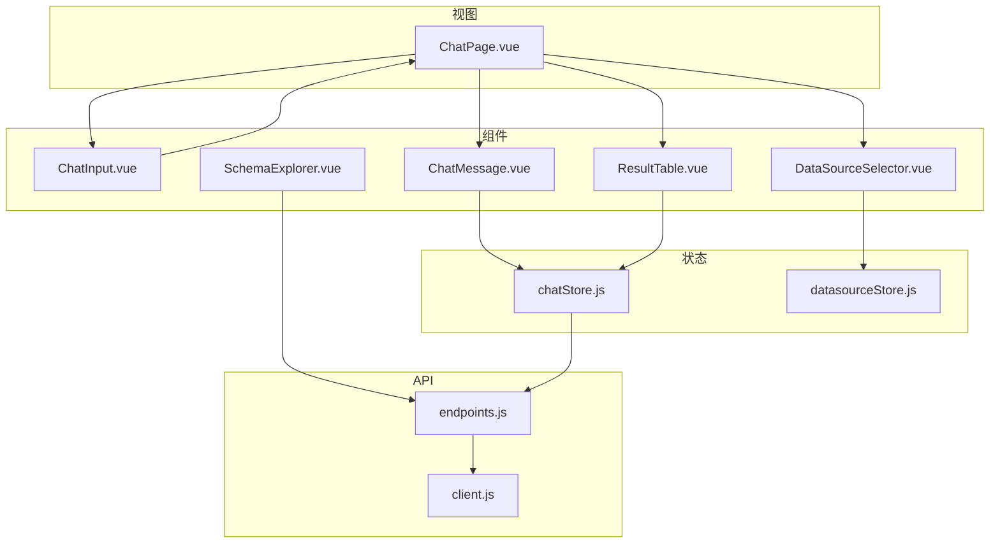
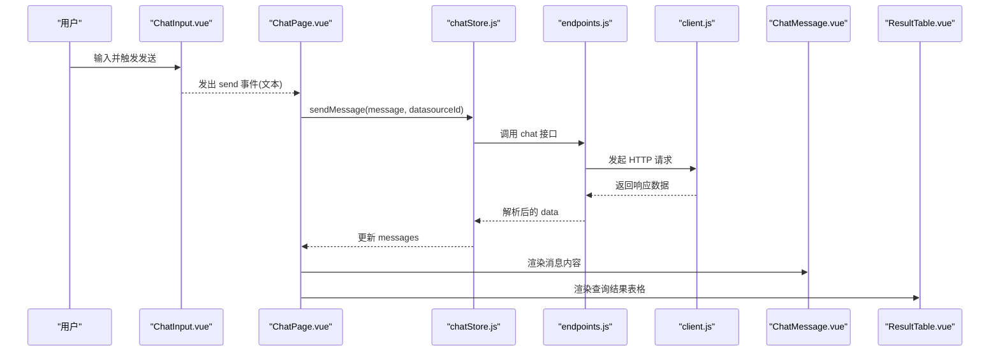
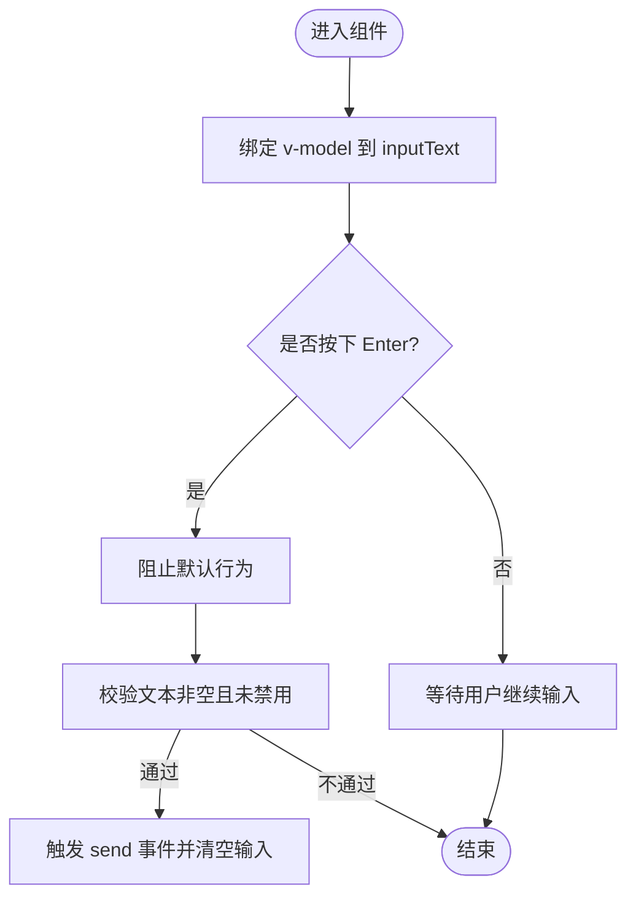
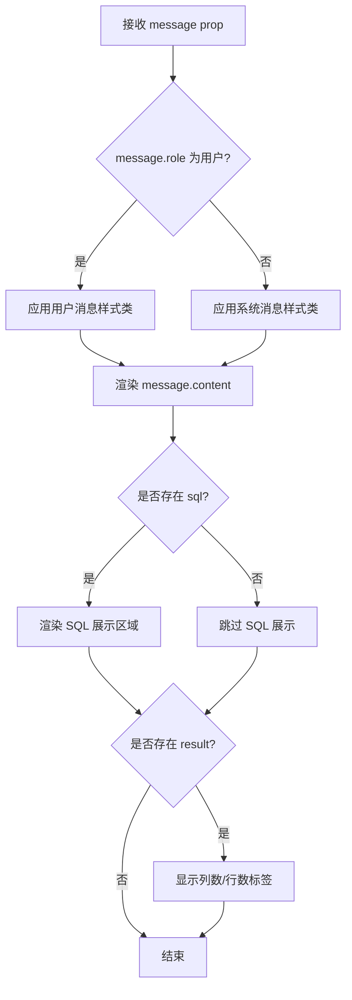
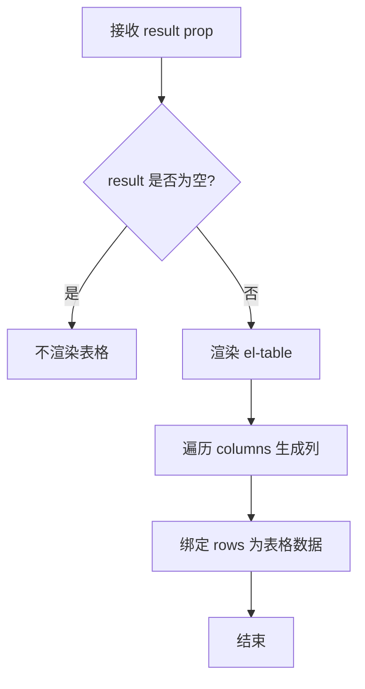
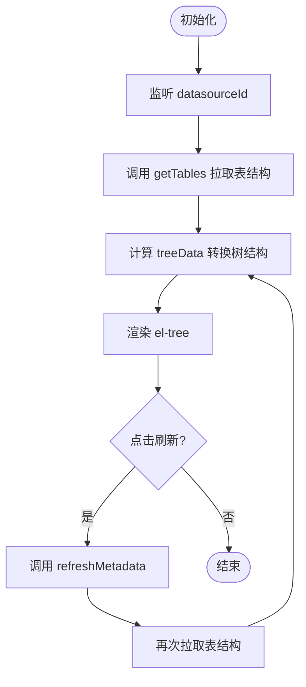
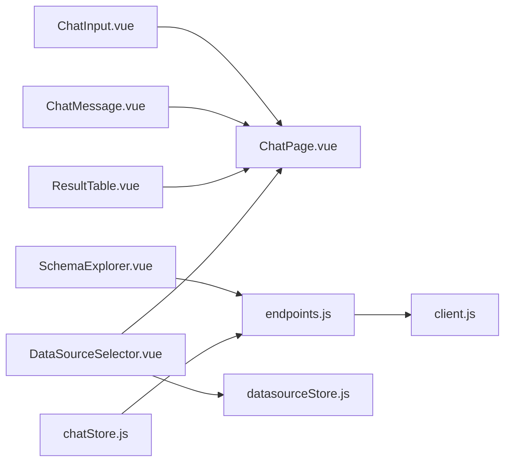

# 核心组件

<cite>
**本文引用的文件**
- [ChatInput.vue](file://frontend/src/components/ChatInput.vue)
- [ChatMessage.vue](file://frontend/src/components/ChatMessage.vue)
- [ResultTable.vue](file://frontend/src/components/ResultTable.vue)
- [SchemaExplorer.vue](file://frontend/src/components/SchemaExplorer.vue)
- [DataSourceSelector.vue](file://frontend/src/components/DataSourceSelector.vue)
- [ChatPage.vue](file://frontend/src/views/ChatPage.vue)
- [chatStore.js](file://frontend/src/stores/chatStore.js)
- [datasourceStore.js](file://frontend/src/stores/datasourceStore.js)
- [client.js](file://frontend/src/api/client.js)
- [endpoints.js](file://frontend/src/api/endpoints.js)
- [style.css](file://frontend/src/style.css)
- [main.css](file://frontend/src/assets/main.css)
</cite>

## 目录
1. [简介](#简介)
2. [项目结构](#项目结构)
3. [核心组件总览](#核心组件总览)
4. [架构总览](#架构总览)
5. [组件详细分析](#组件详细分析)
6. [依赖关系分析](#依赖关系分析)
7. [性能与可扩展性](#性能与可扩展性)
8. [样式与主题定制](#样式与主题定制)
9. [可复用性与组合模式](#可复用性与组合模式)
10. [故障排查指南](#故障排查指南)
11. [结论](#结论)

## 简介
本文件面向前端开发者，系统化梳理 NL2SQL 对话界面的核心 UI 组件：ChatInput、ChatMessage、ResultTable、SchemaExplorer 以及辅助组件 DataSourceSelector。文档从设计模式、Props 接口、事件处理、内部状态管理、数据流、错误处理、样式与主题适配、可复用性和组合模式等维度展开，帮助读者快速理解并高质量扩展这些组件。

## 项目结构
前端采用 Vue 3 + Element Plus + Pinia 的常见架构：
- 视图层由 ChatPage 组织页面布局与交互流程
- 组件层提供 ChatInput、ChatMessage、ResultTable、SchemaExplorer、DataSourceSelector 等独立 UI 能力
- 状态层通过 chatStore 与 datasourceStore 集中管理消息、加载态和数据源
- API 层通过 client 封装 axios，endpoints 暴露业务接口
- 样式层使用全局 CSS 变量与组件级 scoped 样式结合

**图表来源**
- [ChatPage.vue:1-179](file://frontend/src/views/ChatPage.vue#L1-L179)
- [ChatInput.vue:1-60](file://frontend/src/components/ChatInput.vue#L1-L60)
- [ChatMessage.vue:1-34](file://frontend/src/components/ChatMessage.vue#L1-L34)
- [ResultTable.vue:1-36](file://frontend/src/components/ResultTable.vue#L1-L36)
- [SchemaExplorer.vue:1-133](file://frontend/src/components/SchemaExplorer.vue#L1-L133)
- [DataSourceSelector.vue:1-27](file://frontend/src/components/DataSourceSelector.vue#L1-L27)
- [chatStore.js:1-56](file://frontend/src/stores/chatStore.js#L1-L56)
- [datasourceStore.js:1-28](file://frontend/src/stores/datasourceStore.js#L1-L28)
- [endpoints.js:1-20](file://frontend/src/api/endpoints.js#L1-L20)
- [client.js:1-48](file://frontend/src/api/client.js#L1-L48)

**章节来源**
- [ChatPage.vue:1-179](file://frontend/src/views/ChatPage.vue#L1-L179)
- [chatStore.js:1-56](file://frontend/src/stores/chatStore.js#L1-L56)
- [datasourceStore.js:1-28](file://frontend/src/stores/datasourceStore.js#L1-L28)
- [endpoints.js:1-20](file://frontend/src/api/endpoints.js#L1-L20)
- [client.js:1-48](file://frontend/src/api/client.js#L1-L48)

## 核心组件总览
- ChatInput：聊天输入框，支持禁用、回车发送、清空输入。
- ChatMessage：消息气泡，渲染用户/系统消息、SQL 片段和结果统计标签。
- ResultTable：基于 Element Plus 表格的数据展示容器，当前为只读展示。
- SchemaExplorer：数据库表结构浏览树，支持刷新元数据。
- DataSourceSelector：数据源选择下拉框，双向绑定当前数据源 ID。

**章节来源**
- [ChatInput.vue:1-60](file://frontend/src/components/ChatInput.vue#L1-L60)
- [ChatMessage.vue:1-34](file://frontend/src/components/ChatMessage.vue#L1-L34)
- [ResultTable.vue:1-36](file://frontend/src/components/ResultTable.vue#L1-L36)
- [SchemaExplorer.vue:1-133](file://frontend/src/components/SchemaExplorer.vue#L1-L133)
- [DataSourceSelector.vue:1-27](file://frontend/src/components/DataSourceSelector.vue#L1-L27)

## 架构总览
对话主流程如下：用户在 ChatInput 中输入问题，ChatPage 接收 send 事件后调用 chatStore.sendMessage，后者调用 endpoints.chat 接口；后端返回 SQL 与查询结果后，chatStore 追加系统消息；ChatMessage 与 ResultTable 分别渲染文本、SQL 与表格。

**图表来源**
- [ChatInput.vue:23-40](file://frontend/src/components/ChatInput.vue#L23-L40)
- [ChatPage.vue:63-108](file://frontend/src/views/ChatPage.vue#L63-L108)
- [chatStore.js:18-42](file://frontend/src/stores/chatStore.js#L18-L42)
- [endpoints.js:6-6](file://frontend/src/api/endpoints.js#L6-L6)
- [client.js:1-48](file://frontend/src/api/client.js#L1-L48)
- [ChatMessage.vue:1-34](file://frontend/src/components/ChatMessage.vue#L1-L34)
- [ResultTable.vue:1-36](file://frontend/src/components/ResultTable.vue#L1-L36)

## 组件详细分析

### ChatInput：输入处理与交互
职责
- 提供多行文本输入，支持禁用态、回车发送、按钮发送。
- 清理空白字符，避免空消息发送。
- 通过事件将输入文本交给父组件处理。

Props 与事件
- Props：disabled（布尔值），控制输入框与发送按钮禁用。
- 事件：send（字符串），当用户点击发送或按下回车时发出。

内部状态
- inputText：本地响应式输入值，发送后立即清空。

关键逻辑
- 监听 Enter 键，阻止默认行为并触发发送。
- 发送前校验非空与 disabled 状态。
- 发送成功后清空输入框，提升可用性。

**图表来源**
- [ChatInput.vue:1-22](file://frontend/src/components/ChatInput.vue#L1-L22)
- [ChatInput.vue:23-40](file://frontend/src/components/ChatInput.vue#L23-L40)

自动完成说明
- 当前实现不包含自动完成功能。如需扩展，可在 inputText 变化时调用后端提示接口，将候选项注入下拉建议区，并在选中时替换或补全输入。

最佳实践
- 保持单向数据流：仅向父组件抛出事件，不在子组件中直接修改外部状态。
- 对空输入做防御性校验，避免无效请求。
- 使用 :disabled 统一控制交互态，保证键盘与鼠标一致体验。

**章节来源**
- [ChatInput.vue:1-60](file://frontend/src/components/ChatInput.vue#L1-L60)

### ChatMessage：消息渲染与交互
职责
- 根据 role 区分用户消息与系统消息。
- 渲染消息正文、SQL 片段与结果摘要标签。
- 通过 props 接收单条消息对象，无副作用。

Props
- message（对象，必填）：包含 content、sql、result 等字段。

渲染逻辑
- 当存在 result 时，显示列数与行数摘要。
- 当存在 sql 时，以代码块形式展示生成的 SQL。

**图表来源**
- [ChatMessage.vue:1-34](file://frontend/src/components/ChatMessage.vue#L1-L34)

扩展建议
- 若需复制 SQL，可增加复制按钮与反馈。
- 若需高亮 SQL，可引入语法高亮库并按语言配置。
- 对于长消息，可考虑折叠/展开逻辑。

**章节来源**
- [ChatMessage.vue:1-34](file://frontend/src/components/ChatMessage.vue#L1-L34)

### ResultTable：数据表格展示
职责
- 将查询结果 columns 与 rows 映射为表格列与数据行。
- 提供基础滚动、边框与条纹样式。

Props
- result（对象，可选）：包含 columns 与 rows。

当前能力
- 动态列生成，每列最小宽度限制，超长内容工具提示。
- 固定最大高度，超出部分滚动。

待增强点
- 排序：在列上启用 sortable，或在 store 层维护排序状态。
- 筛选：增加搜索框或列筛选器。
- 分页：对大数据集进行分页。
- 导出：导出 CSV/Excel。

**图表来源**
- [ResultTable.vue:1-36](file://frontend/src/components/ResultTable.vue#L1-L36)

**章节来源**
- [ResultTable.vue:1-36](file://frontend/src/components/ResultTable.vue#L1-L36)

### SchemaExplorer：数据库结构浏览与选择机制
职责
- 按数据源 ID 获取表结构，并以树形结构展示表与列。
- 提供“刷新”操作，先刷新元数据再拉取最新结构。

Props
- datasourceId（数字或 null）：用于请求表结构。

内部状态
- tables：原始表列表。
- loading：加载态。
- treeData：计算属性，将 tables 转换为树节点。

关键逻辑
- 监听 datasourceId 变化，立即拉取表结构。
- 刷新时先调用 refreshMetadata，再重新拉取表结构。
- 树节点包含表名、注释、列名、数据类型、注释等信息。

**图表来源**
- [SchemaExplorer.vue:1-133](file://frontend/src/components/SchemaExplorer.vue#L1-L133)
- [endpoints.js:8-12](file://frontend/src/api/endpoints.js#L8-L12)

扩展建议
- 增加表/列选择回调，供对话上下文注入 schema。
- 支持多选与批量选择。
- 对大库场景增加懒加载与缓存策略。

**章节来源**
- [SchemaExplorer.vue:1-133](file://frontend/src/components/SchemaExplorer.vue#L1-L133)

### DataSourceSelector：数据源选择
职责
- 以 Element Plus Select 展示数据源列表，并与父组件双向绑定。

Props 与事件
- modelValue：当前选中的数据源 ID。
- dataSources：数据源数组。
- update:modelValue：双向绑定更新事件。

使用场景
- 通常置于聊天页头部，用于切换当前查询的数据源。

**章节来源**
- [DataSourceSelector.vue:1-27](file://frontend/src/components/DataSourceSelector.vue#L1-L27)

## 依赖关系分析
组件与模块之间的依赖如下：
- ChatInput 与 ChatMessage、ResultTable 被 ChatPage 组合使用。
- SchemaExplorer 依赖 endpoints 提供的元数据接口。
- DataSourceSelector 依赖 datasourceStore 提供的数据源列表。
- chatStore 负责消息生命周期与后端对话接口调用。
- client 为所有 API 提供拦截、鉴权与错误处理。

**图表来源**
- [ChatPage.vue:1-179](file://frontend/src/views/ChatPage.vue#L1-L179)
- [SchemaExplorer.vue:1-133](file://frontend/src/components/SchemaExplorer.vue#L1-L133)
- [DataSourceSelector.vue:1-27](file://frontend/src/components/DataSourceSelector.vue#L1-L27)
- [chatStore.js:1-56](file://frontend/src/stores/chatStore.js#L1-L56)
- [endpoints.js:1-20](file://frontend/src/api/endpoints.js#L1-L20)
- [client.js:1-48](file://frontend/src/api/client.js#L1-L48)

**章节来源**
- [ChatPage.vue:1-179](file://frontend/src/views/ChatPage.vue#L1-L179)
- [chatStore.js:1-56](file://frontend/src/stores/chatStore.js#L1-L56)
- [datasourceStore.js:1-28](file://frontend/src/stores/datasourceStore.js#L1-L28)
- [endpoints.js:1-20](file://frontend/src/api/endpoints.js#L1-L20)
- [client.js:1-48](file://frontend/src/api/client.js#L1-L48)

## 性能与可扩展性
- 列表渲染
  - ResultTable 使用固定最大高度，适合中等规模结果集；对大数据集建议分页或虚拟滚动。
  - SchemaExplorer 的树结构一次性渲染全部列，建议在表或列较多时采用懒加载。
- 网络请求
  - chatStore 在发送期间设置 loading 标志，避免重复提交。
  - client 设置超时时间为 60 秒，防止长时间阻塞。
- 状态管理
  - 消息与数据源状态集中在 Pinia Store，便于跨组件共享与调试。
- 可扩展方向
  - 为 ResultTable 增加排序、筛选、分页与导出。
  - 为 ChatInput 增加自动完成、快捷键与粘贴图片。
  - 为 SchemaExplorer 增加选择回调、多选与缓存。

[本节为通用指导，不直接分析具体文件]

## 样式与主题定制
全局样式与主题
- style.css 定义根级 CSS 变量，包括文本色、背景色、强调色、阴影、字体族等，并通过 prefers-color-scheme 提供暗色主题支持。
- main.css 定义业务相关的全局变量与应用布局，例如 --primary-color、--bg-color、--sidebar-width，并提供聊天消息气泡、SQL 展示、输入区域的基础样式。

组件样式
- 各组件使用 scoped 样式，避免污染全局。
- 可通过覆盖 Element Plus 的 CSS 变量或组件深度选择器调整外观。

定制建议
- 将品牌色、字号、圆角等抽象为 CSS 变量，集中管理。
- 在 ChatPage 与组件内复用 main.css 中的语义化类名，保持一致风格。
- 针对深色模式，优先使用已定义的 CSS 变量，减少硬编码颜色。

**章节来源**
- [style.css:1-200](file://frontend/src/style.css#L1-L200)
- [main.css:1-88](file://frontend/src/assets/main.css#L1-L88)

## 可复用性与组合模式
组合模式
- ChatPage 作为页面编排者，组合 ChatInput、ChatMessage、ResultTable、DataSourceSelector，并驱动 chatStore 的状态流转。
- SchemaExplorer 作为独立的元数据浏览组件，可与任意表单或对话框组合。

可复用性原则
- 组件尽量无副作用，props 驱动渲染，events 通知父组件。
- 状态下沉到 Store，避免在组件间传递过多复杂数据。
- 对外暴露稳定接口：如 ChatInput 的 send 事件、SchemaExplorer 的 datasourceId。

组合示例
- 在对话框中嵌入 SchemaExplorer，让用户选择表或列，再将选择结果注入对话上下文。
- 在聊天输入旁放置 DataSourceSelector，实现会话级数据源隔离。

[本节为通用指导，不直接分析具体文件]

## 故障排查指南
常见问题与定位思路
- 无法发送消息
  - 检查 ChatInput.disabled 与 ChatPage.selectedDsId 是否为空。
  - 确认 ChatPage.handleSend 是否正确调用 chatStore.sendMessage。
- 消息未更新或页面不滚动到底部
  - 检查 chatStore.messages 是否正确追加系统消息。
  - 确认 ChatPage 是否在 nextTick 后执行滚动到底部逻辑。
- 数据源为空
  - 检查 datasourcesStore.fetchDataSources 是否成功调用 getDataSources。
  - 查看 Network 面板中 /api/v1/datasources 的响应。
- 元数据刷新失败
  - 检查 SchemaExplorer.handleRefresh 是否正确调用 refreshMetadata 与 getTables。
  - 查看 endpoints.refreshMetadata 的请求参数 datasourceId 是否正确。
- 鉴权失败或跳转登录
  - 检查 client 响应拦截器对 401 的处理，确认 localStorage 中 token 是否存在。
  - 检查后端返回的 code 不为 200 时的 ElMessage 错误提示。

错误处理路径
- client 拦截器对非 200 响应与 401 进行统一处理，展示错误信息或跳转登录。
- chatStore 在 try/catch 中捕获异常并追加系统消息，避免界面崩溃。

**章节来源**
- [client.js:15-48](file://frontend/src/api/client.js#L15-L48)
- [chatStore.js:18-42](file://frontend/src/stores/chatStore.js#L18-L42)
- [ChatPage.vue:63-108](file://frontend/src/views/ChatPage.vue#L63-L108)
- [SchemaExplorer.vue:67-112](file://frontend/src/components/SchemaExplorer.vue#L67-L112)
- [endpoints.js:6-12](file://frontend/src/api/endpoints.js#L6-L12)

## 结论
本项目的核心 UI 组件围绕“输入—对话—结果—元数据”的主线构建，职责清晰、耦合度低。通过 ChatInput 的简洁事件模型、ChatMessage 的可扩展渲染、ResultTable 的可插拔表格能力、SchemaExplorer 的元数据浏览能力，以及 DataSourceSelector 的双向绑定选择，配合 chatStore 与 datasourceStore 的状态管理，形成了一套易于理解与扩展的前端架构。在此基础上，可按需增强自动完成、表格排序筛选、元数据选择回调与主题定制，进一步提升用户体验与开发效率。