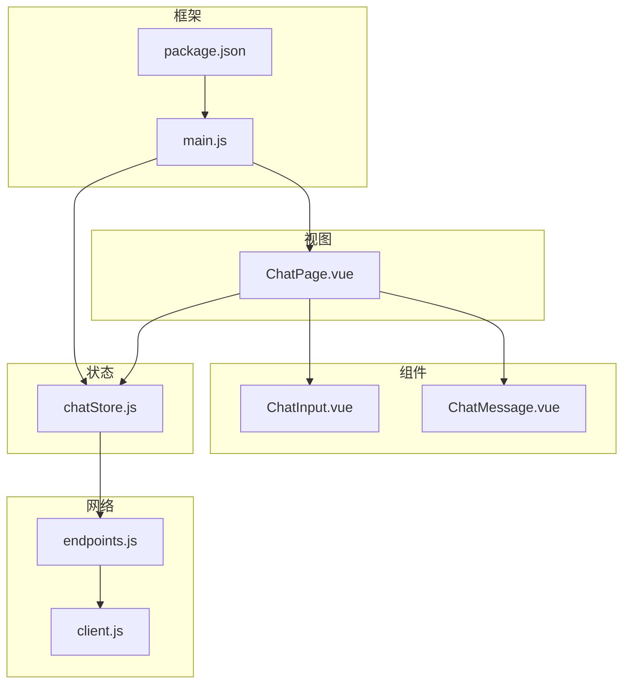
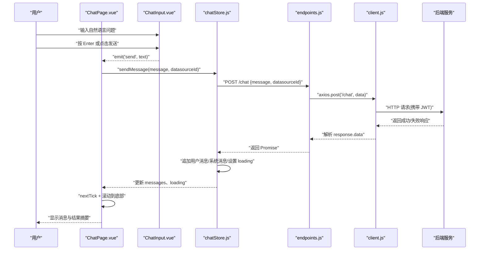
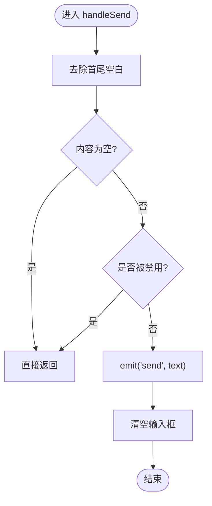
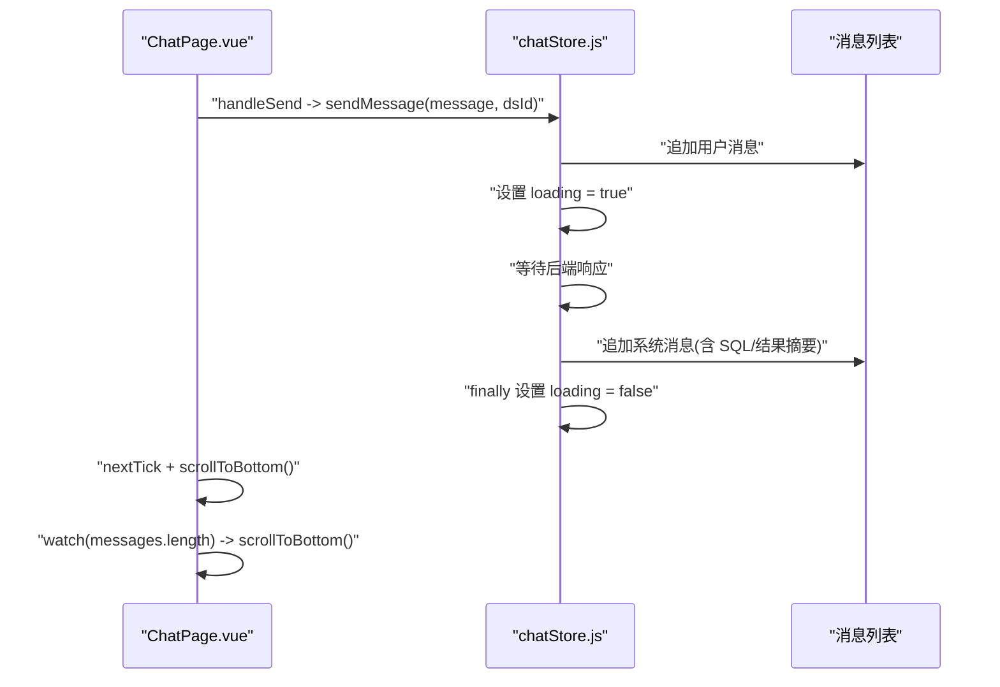
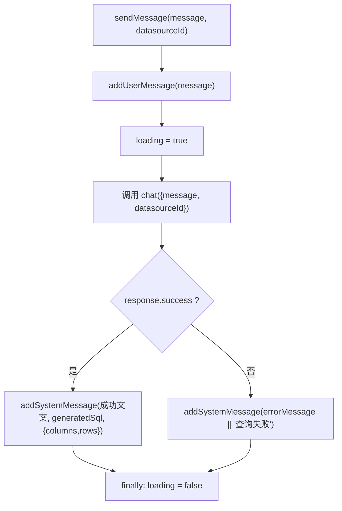
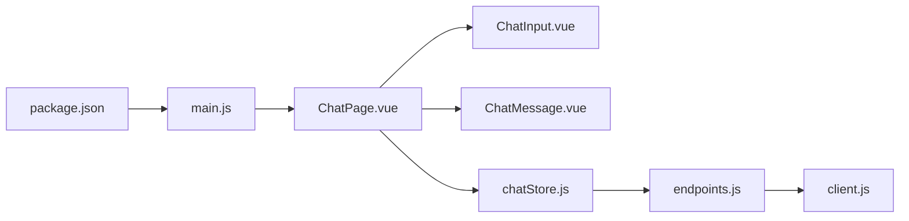

# 聊天组件

<cite>
**本文引用的文件**   
- [ChatInput.vue](file://frontend/src/components/ChatInput.vue)
- [ChatMessage.vue](file://frontend/src/components/ChatMessage.vue)
- [ChatPage.vue](file://frontend/src/views/ChatPage.vue)
- [chatStore.js](file://frontend/src/stores/chatStore.js)
- [client.js](file://frontend/src/api/client.js)
- [endpoints.js](file://frontend/src/api/endpoints.js)
- [main.js](file://frontend/src/main.js)
- [package.json](file://frontend/package.json)
</cite>

## 目录
1. [简介](#简介)
2. [项目结构](#项目结构)
3. [核心组件](#核心组件)
4. [架构总览](#架构总览)
5. [详细组件分析](#详细组件分析)
6. [依赖关系分析](#依赖关系分析)
7. [性能与体验优化](#性能与体验优化)
8. [故障排查指南](#故障排查指南)
9. [结论](#结论)

## 简介
本文件面向前端开发者，系统化梳理聊天相关的前端实现：包括用户输入、消息渲染、页面布局、状态管理与网络请求。重点覆盖 ChatInput、ChatMessage、ChatPage、聊天 Store、HTTP 客户端与接口封装等模块，帮助读者快速理解对话式界面的完整实现路径，并在此基础上扩展自动完成、WebSocket 实时流、Markdown 渲染、代码高亮和复制等功能。

## 项目结构
聊天相关的前端代码采用“视图 + 组件 + Store + API”的分层组织方式：
- 视图层：ChatPage 负责页面布局、示例提示、滚动控制与生命周期管理。
- 组件层：ChatInput 负责用户输入与发送；ChatMessage 负责单条消息的展示。
- 状态层：chatStore 管理消息列表、加载状态与发送流程。
- 网络层：client 基于 Axios 封装请求拦截与错误处理；endpoints 暴露 REST 接口。
- 应用初始化：main.js 注册 Pinia、Element Plus、路由与全局图标。

图表来源
- [ChatPage.vue:1-179](file://frontend/src/views/ChatPage.vue#L1-L179)
- [ChatInput.vue:1-60](file://frontend/src/components/ChatInput.vue#L1-L60)
- [ChatMessage.vue:1-34](file://frontend/src/components/ChatMessage.vue#L1-L34)
- [chatStore.js:1-56](file://frontend/src/stores/chatStore.js#L1-L56)
- [client.js:1-48](file://frontend/src/api/client.js#L1-L48)
- [endpoints.js:1-20](file://frontend/src/api/endpoints.js#L1-L20)
- [main.js:1-22](file://frontend/src/main.js#L1-L22)
- [package.json:1-23](file://frontend/package.json#L1-L23)

章节来源
- [ChatPage.vue:1-179](file://frontend/src/views/ChatPage.vue#L1-L179)
- [ChatInput.vue:1-60](file://frontend/src/components/ChatInput.vue#L1-L60)
- [ChatMessage.vue:1-34](file://frontend/src/components/ChatMessage.vue#L1-L34)
- [chatStore.js:1-56](file://frontend/src/stores/chatStore.js#L1-L56)
- [client.js:1-48](file://frontend/src/api/client.js#L1-L48)
- [endpoints.js:1-20](file://frontend/src/api/endpoints.js#L1-L20)
- [main.js:1-22](file://frontend/src/main.js#L1-L22)
- [package.json:1-23](file://frontend/package.json#L1-L23)

## 核心组件
- ChatInput：负责文本输入、禁用态、Enter 键发送、清空输入框。
- ChatMessage：负责渲染角色消息、SQL 片段与结果统计标签。
- ChatPage：页面容器，包含数据源选择、消息列表、空状态示例问题、底部输入区与滚动逻辑。
- chatStore：消息队列、加载状态、发送流程（调用后端接口）。
- client：Axios 实例，统一 baseURL、超时、Authorization 注入、401 跳转登录、错误提示。
- endpoints：REST 接口封装，包含 /chat 对话接口。

章节来源
- [ChatInput.vue:1-60](file://frontend/src/components/ChatInput.vue#L1-L60)
- [ChatMessage.vue:1-34](file://frontend/src/components/ChatMessage.vue#L1-L34)
- [ChatPage.vue:1-179](file://frontend/src/views/ChatPage.vue#L1-L179)
- [chatStore.js:1-56](file://frontend/src/stores/chatStore.js#L1-L56)
- [client.js:1-48](file://frontend/src/api/client.js#L1-L48)
- [endpoints.js:1-20](file://frontend/src/api/endpoints.js#L1-L20)

## 架构总览
下图展示了从用户输入到消息渲染的完整交互链路：

图表来源
- [ChatInput.vue:1-60](file://frontend/src/components/ChatInput.vue#L1-L60)
- [ChatPage.vue:1-179](file://frontend/src/views/ChatPage.vue#L1-L179)
- [chatStore.js:1-56](file://frontend/src/stores/chatStore.js#L1-L56)
- [endpoints.js:1-20](file://frontend/src/api/endpoints.js#L1-L20)
- [client.js:1-48](file://frontend/src/api/client.js#L1-L48)

## 详细组件分析

### ChatInput 组件：用户输入、键盘事件与发送机制
职责
- 双向绑定输入内容，支持多行文本域。
- 通过 exact.enter 阻止默认行为并触发发送。
- 在 disabled 状态下禁用输入与按钮，防止重复提交。
- 发送成功后清空输入框，避免残留文本。

关键流程
- 监听 @keydown.enter.exact.prevent 与按钮 @click，统一进入 handleSend。
- 校验非空且未被禁用后，向父组件 emit('send', text)，随后清空本地 inputText。

交互时序

图表来源
- [ChatInput.vue:1-60](file://frontend/src/components/ChatInput.vue#L1-L60)

可改进点
- 当前未实现自动补全与词法建议，可在输入时延迟查询元数据或历史语义，结合下拉面板进行补全。
- 可增加对 Ctrl/Cmd+Enter 的组合键支持，便于复杂查询场景下的快捷发送。
- 建议在禁用态增加视觉反馈（如 Tooltip），明确告知用户为何不可用。

章节来源
- [ChatInput.vue:1-60](file://frontend/src/components/ChatInput.vue#L1-L60)

### ChatMessage 组件：消息渲染、SQL 展示与结果统计
职责
- 根据 message.role 区分用户与系统消息气泡样式。
- 渲染 message.content 作为主要文本。
- 若存在 SQL，以独立区块展示生成的 SQL 语句。
- 若存在结果集，显示列数与行数统计标签。

数据结构约定
- role: 'user' | 'system'
- content: string
- sql?: string
- result?: { columns: number; rows: number }

注意事项
- 当前模板中 message.content 为纯文本插值，未启用 Markdown 渲染与 HTML 转义保护。
- SQL 与结果信息均以静态文本呈现，未提供复制按钮与语法高亮。

可改进点
- 引入 Markdown 渲染器与安全沙箱，对用户输入与系统回复分别处理。
- 使用代码高亮库对 SQL 进行着色，并提供一键复制功能。
- 将结果统计与表格展开/收起能力整合到同一卡片中，提升信息密度。

章节来源
- [ChatMessage.vue:1-34](file://frontend/src/components/ChatMessage.vue#L1-L34)

### ChatPage 页面：布局、消息流与实时交互
职责
- 顶部：数据源选择器与清空对话按钮。
- 中部：消息列表、空状态示例问题、加载中提示。
- 底部：ChatInput 输入区。
- 负责滚动到底部的时机控制与首次挂载时默认选中首个数据源。

消息流
- 当用户点击示例问题或发送消息时，调用 chatStore.sendMessage。
- 每次消息变化后，通过 nextTick 与 watch 双重保障滚动到底部。
- 当存在 msg.result 时，同时渲染 ResultTable 展示详细表格。

关键流程

图表来源
- [ChatPage.vue:1-179](file://frontend/src/views/ChatPage.vue#L1-L179)
- [chatStore.js:1-56](file://frontend/src/stores/chatStore.js#L1-L56)

可改进点
- 长列表虚拟化：当消息量较大时，使用虚拟滚动减少重排与重绘。
- 增量滚动：仅滚动新增部分，避免频繁计算 scrollTop。
- 骨架屏：在首次加载与切换数据源时提供占位骨架。

章节来源
- [ChatPage.vue:1-179](file://frontend/src/views/ChatPage.vue#L1-L179)

### chatStore：消息队列、加载状态与发送流程
职责
- 维护 messages 数组与 loading 布尔标志。
- addUserMessage/addSystemMessage 构造标准消息对象。
- sendMessage 编排完整发送流程：先追加用户消息，再发起请求，最后追加系统消息或错误消息。

数据模型
- messages: Array<{role, content, timestamp, sql?, result?}>
- loading: boolean

发送时序

图表来源
- [chatStore.js:1-56](file://frontend/src/stores/chatStore.js#L1-L56)

可改进点
- 添加消息去重与重试机制，支持断线重连。
- 支持取消正在进行的请求（AbortController）。
- 将执行耗时与行数纳入缓存策略，避免重复计算。

章节来源
- [chatStore.js:1-56](file://frontend/src/stores/chatStore.js#L1-L56)

### HTTP 客户端与接口封装
- client.js
  - 统一 baseURL 与超时时间。
  - 请求拦截：从 localStorage 读取 token 并注入 Authorization 头。
  - 响应拦截：对非 200 的业务码统一提示；401 清理登录态并跳转登录页。
- endpoints.js
  - 暴露 /chat 对话接口及其他元数据、数据源管理接口。

安全与异常
- 401 自动登出：清除 token 与用户名，跳转到登录页。
- 业务错误：统一 ElMessage 提示错误信息。
- 网络异常：捕获并提示通用网络错误。

章节来源
- [client.js:1-48](file://frontend/src/api/client.js#L1-L48)
- [endpoints.js:1-20](file://frontend/src/api/endpoints.js#L1-L20)

## 依赖关系分析
组件与模块之间的依赖如下：

图表来源
- [ChatPage.vue:1-179](file://frontend/src/views/ChatPage.vue#L1-L179)
- [ChatInput.vue:1-60](file://frontend/src/components/ChatInput.vue#L1-L60)
- [ChatMessage.vue:1-34](file://frontend/src/components/ChatMessage.vue#L1-L34)
- [chatStore.js:1-56](file://frontend/src/stores/chatStore.js#L1-L56)
- [endpoints.js:1-20](file://frontend/src/api/endpoints.js#L1-L20)
- [client.js:1-48](file://frontend/src/api/client.js#L1-L48)
- [main.js:1-22](file://frontend/src/main.js#L1-L22)
- [package.json:1-23](file://frontend/package.json#L1-L23)

耦合与内聚
- ChatPage 聚合多个子组件与 Store，承担编排职责，内聚性较高。
- chatStore 仅关注消息与发送流程，职责单一。
- HTTP 层与业务层解耦清晰，便于替换传输协议（如 WebSocket）。

潜在循环依赖
- 当前未发现循环导入。

外部依赖
- Vue 3、Pinia、Element Plus、Axios、Vue Router。

章节来源
- [ChatPage.vue:1-179](file://frontend/src/views/ChatPage.vue#L1-L179)
- [chatStore.js:1-56](file://frontend/src/stores/chatStore.js#L1-L56)
- [client.js:1-48](file://frontend/src/api/client.js#L1-L48)
- [package.json:1-23](file://frontend/package.json#L1-L23)

## 性能与体验优化

用户体验优化
- 自动补全：在 ChatInput 中输入时，延迟触发元数据或历史语义建议，结合下拉面板提高输入效率。
- 快捷键：支持 Ctrl/Cmd+Enter 发送，Shift+Enter 换行，Esc 聚焦输入框。
- 空状态引导：保留示例问题，鼓励用户快速上手。
- 加载反馈：在 ChatPage 中保持“正在分析并生成 SQL...”提示，避免无响应感。
- 滚动体验：仅在新增消息时滚动，避免频繁重排；必要时使用虚拟列表。

Markdown 与代码高亮
- 引入 Markdown 渲染器并对用户内容进行安全转义，对系统回复允许受控渲染。
- 使用代码高亮库对 SQL 着色，并为每个代码块提供复制按钮。
- 针对长文档进行分片渲染，避免一次性渲染导致卡顿。

WebSocket 实时交互
- 将 /chat 接口改为 SSE 或 WebSocket，实现流式输出与逐步预览。
- 前端维护连接状态、心跳检测与断线重连；对已发送但未确认的消息建立本地队列。
- 将“正在生成 SQL”的提示改为实时增量更新，提升感知速度。

内存与渲染
- 对大结果集使用分页或虚拟表格展示。
- 使用 key 稳定化列表项，避免不必要的重建。
- 避免在模板中进行昂贵计算，将计算逻辑下放到 computed 或 Store。

网络与容错
- 为长耗时请求设置合理超时与重试策略。
- 401 自动登出已在 client 中实现，建议在 Store 层增加“会话过期”提示。
- 对失败请求提供重试按钮，避免用户重新输入。

[本节为通用指导，不直接分析具体文件]

## 故障排查指南
常见问题与定位思路
- 无法发送消息
  - 检查 ChatInput 的 disabled 状态与父级传入的禁用条件。
  - 确认 ChatPage 中 selectedDsId 是否已选择。
- 登录后自动跳转
  - 确认后端返回 401 时，client 的响应拦截器会清理本地存储并跳转登录页。
- 消息未滚动到底部
  - 检查 nextTick 与 watch(messages.length) 是否生效，确认 messagesRef 是否正确引用。
- 请求失败或超时
  - 查看 client 的响应拦截器提示信息；确认后端接口路径与参数是否与 endpoints 定义一致。

定位要点
- 打开浏览器控制台，观察 axios 请求与响应。
- 检查 localStorage 中的 token 是否存在且有效。
- 验证 ChatPage 的数据源列表是否加载成功。

章节来源
- [client.js:1-48](file://frontend/src/api/client.js#L1-L48)
- [ChatPage.vue:1-179](file://frontend/src/views/ChatPage.vue#L1-L179)
- [ChatInput.vue:1-60](file://frontend/src/components/ChatInput.vue#L1-L60)

## 结论
当前聊天界面实现了基础的输入、发送、消息渲染与结果摘要展示，并通过 Pinia Store 集中管理状态，借助 Axios 完成 REST 请求。在此基础上，可以逐步扩展自动补全、Markdown 渲染、代码高亮、复制、WebSocket 流式输出、虚拟滚动与错误重试等能力，进一步提升用户体验与可维护性。

[本节为总结性内容，不直接分析具体文件]