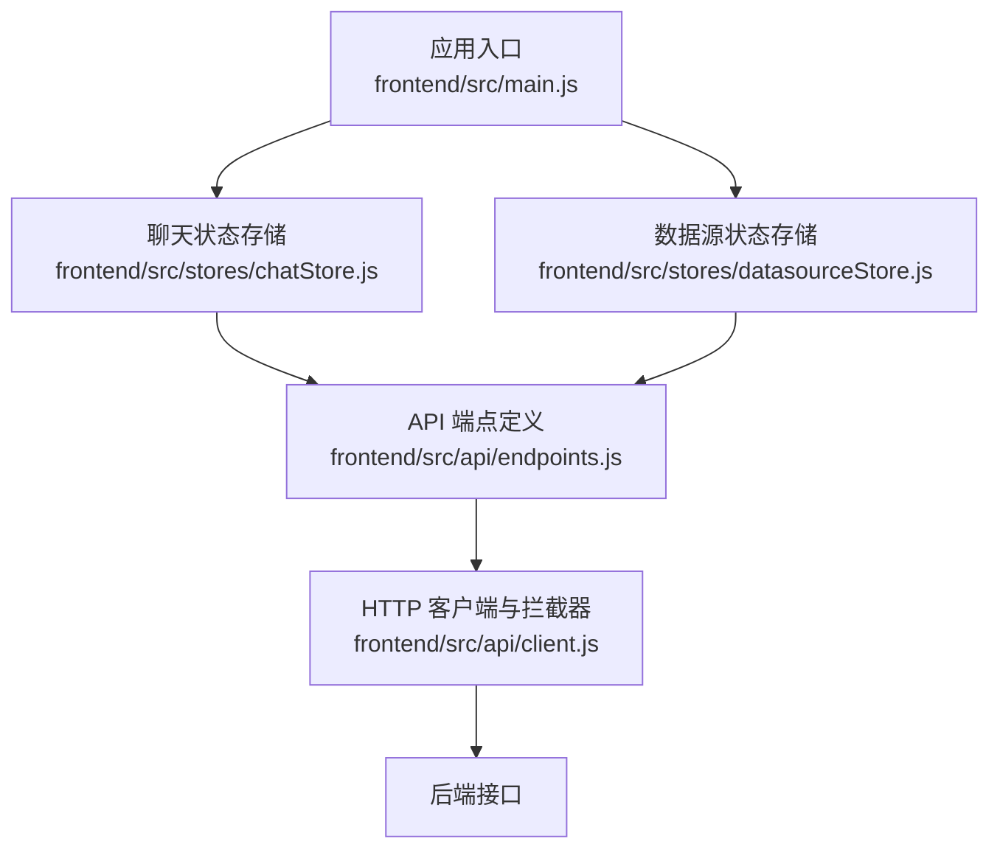
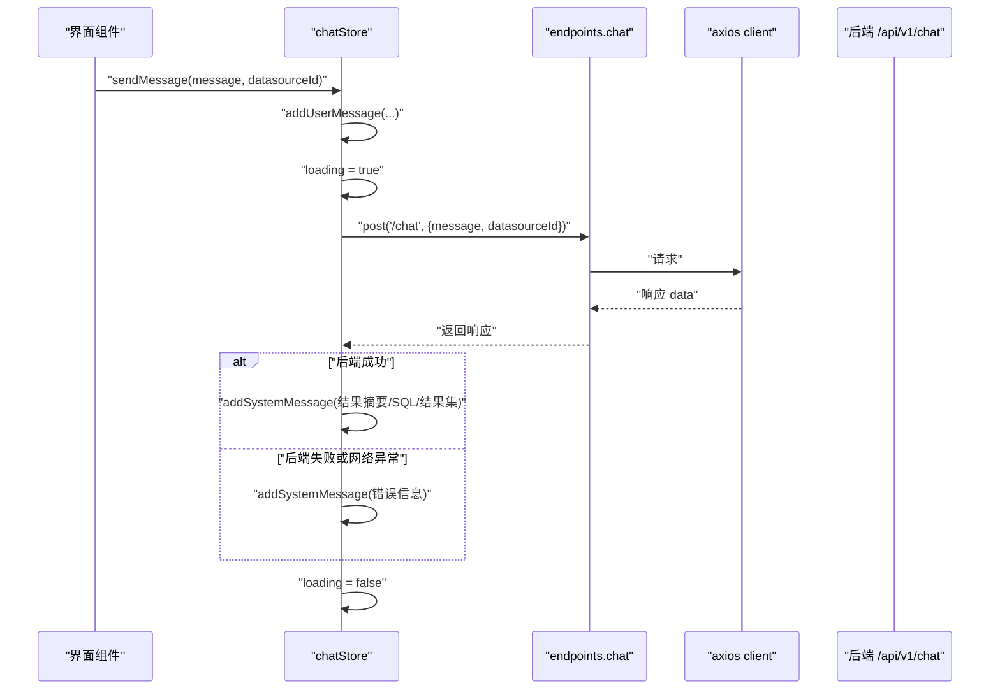
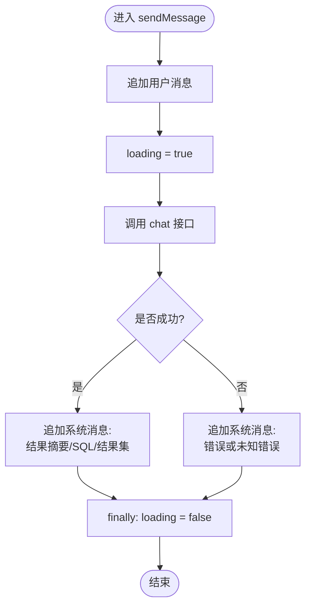
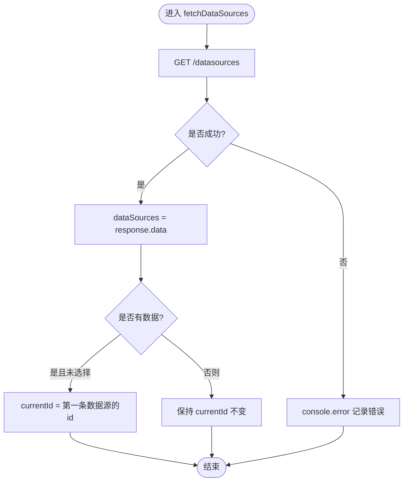
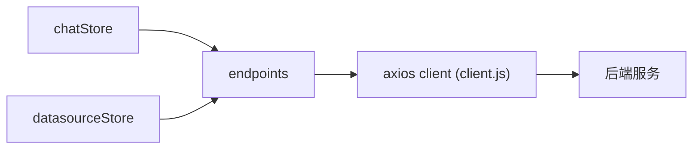

# 状态管理

<cite>
**本文引用的文件**   
- [frontend/src/stores/chatStore.js](file://frontend/src/stores/chatStore.js)
- [frontend/src/stores/datasourceStore.js](file://frontend/src/stores/datasourceStore.js)
- [frontend/src/main.js](file://frontend/src/main.js)
- [frontend/package.json](file://frontend/package.json)
- [frontend/src/api/client.js](file://frontend/src/api/client.js)
- [frontend/src/api/endpoints.js](file://frontend/src/api/endpoints.js)
</cite>

## 目录
1. [引言](#引言)
2. [项目结构](#项目结构)
3. [核心组件](#核心组件)
4. [架构总览](#架构总览)
5. [详细组件分析](#详细组件分析)
6. [依赖关系分析](#依赖关系分析)
7. [性能与优化](#性能与优化)
8. [调试与开发监控](#调试与开发监控)
9. [故障排查](#故障排查)
10. [结论](#结论)

## 引言
本文聚焦前端状态管理，围绕 Pinia store 的设计与模块化组织展开。重点解读对话状态管理（chatStore）和数据源状态同步（datasourceStore），涵盖异步处理、错误状态、缓存策略、持久化方案、调试手段与性能优化建议，帮助前端开发者在复杂场景中构建稳定、可维护且高性能的状态层。

## 项目结构
前端采用 Vue 3 + Pinia + Vite 的现代化技术栈，状态数据集中在 stores 目录下，通过 API 层与后端交互。Pinia 在应用入口初始化，全局可用。

图表来源
- [frontend/src/main.js:1-22](file://frontend/src/main.js#L1-L22)
- [frontend/src/stores/chatStore.js:1-56](file://frontend/src/stores/chatStore.js#L1-L56)
- [frontend/src/stores/datasourceStore.js:1-28](file://frontend/src/stores/datasourceStore.js#L1-L28)
- [frontend/src/api/endpoints.js:1-20](file://frontend/src/api/endpoints.js#L1-L20)
- [frontend/src/api/client.js:1-48](file://frontend/src/api/client.js#L1-L48)

章节来源
- [frontend/src/main.js:1-22](file://frontend/src/main.js#L1-L22)
- [frontend/package.json:1-23](file://frontend/package.json#L1-L23)

## 核心组件
- chatStore：负责对话消息列表、加载状态、发送消息、清空消息等逻辑，是 NL2SQL 对话流程的核心状态容器。
- datasourceStore：负责数据源列表、当前选中数据源、获取数据源、设置当前数据源以及根据 id 查找当前数据源对象。

关键职责边界：
- chatStore 不直接访问 HTTP 客户端，而是通过 endpoints 暴露的函数调用后端。
- datasourceStore 仅持有数据源相关状态，并在首次拉取成功后自动选择第一个数据源作为默认值。

章节来源
- [frontend/src/stores/chatStore.js:1-56](file://frontend/src/stores/chatStore.js#L1-L56)
- [frontend/src/stores/datasourceStore.js:1-28](file://frontend/src/stores/datasourceStore.js#L1-L28)

## 架构总览
状态层由两个相互独立的 Pinia store 组成，均通过统一的 API 层发起请求，并由 Axios 拦截器统一处理认证、错误提示与路由跳转。

图表来源
- [frontend/src/stores/chatStore.js:17-45](file://frontend/src/stores/chatStore.js#L17-L45)
- [frontend/src/api/endpoints.js:7-7](file://frontend/src/api/endpoints.js#L7-L7)
- [frontend/src/api/client.js:1-48](file://frontend/src/api/client.js#L1-L48)

## 详细组件分析

### chatStore：对话状态管理与消息处理
- 状态字段
  - messages：消息数组，包含用户消息与系统消息，带时间戳，便于排序和渲染。
  - loading：全局加载态，用于禁用输入、显示骨架屏或进度指示。
- 行为方法
  - addUserMessage：追加用户消息。
  - addSystemMessage：追加系统消息，支持携带 SQL 与查询结果，方便后续展示执行详情。
  - sendMessage：完整对话流程，包括入队用户消息、置为加载中、调用后端、根据响应追加系统消息、清理加载态；错误分支统一以系统消息呈现。
  - clearMessages：清空历史消息，常用于会话重置。

图表来源
- [frontend/src/stores/chatStore.js:17-45](file://frontend/src/stores/chatStore.js#L17-L45)

实现要点与复杂度：
- 消息追加使用数组 push，时间复杂度 O(1)，适合高频追加场景。
- 若需要按时间排序或去重，可在插入前对 messages 做归一化处理（如基于 timestamp 或 content hash）。
- 错误路径保证 finally 中恢复 loading，避免界面卡死。

潜在优化：
- 对大结果集进行分页或虚拟滚动渲染，避免一次性渲染大量表格行导致卡顿。
- 将 SQL 与结果集放在独立的结构体中，减少冗余字段传递。
- 对长耗时请求增加超时控制与重试机制（当前由 axios timeout 控制）。

章节来源
- [frontend/src/stores/chatStore.js:1-56](file://frontend/src/stores/chatStore.js#L1-L56)

### datasourceStore：数据源状态同步与缓存机制
- 状态字段
  - dataSources：数据源列表。
  - currentId：当前选中的数据源 ID。
- 行为方法
  - fetchDataSources：拉取数据源列表并赋值，若存在数据且未选择则自动选择第一条作为默认。
  - setCurrent：设置当前数据源 ID。
  - current：根据 currentId 查找当前数据源对象，供模板或业务逻辑消费。

图表来源
- [frontend/src/stores/datasourceStore.js:7-23](file://frontend/src/stores/datasourceStore.js#L7-L23)

缓存与一致性：
- 当前实现无本地缓存，每次调用 fetchDataSources 都会重新拉取。
- 建议在首次获取后写入 localStorage 或 sessionStorage，并在下次启动时优先读取缓存，再后台静默刷新以提升首屏速度。
- 可通过版本号或时间戳判断缓存是否过期，避免脏读。

章节来源
- [frontend/src/stores/datasourceStore.js:1-28](file://frontend/src/stores/datasourceStore.js#L1-L28)

### 应用入口与 Pinia 初始化
- main.js 中创建 Vue 应用实例，注册 ElementPlus 图标、路由、样式，并调用 createPinia 启用 Pinia。
- Pinia store 在任意组件中通过 useChatStore、useDataSourceStore 注入并使用。

章节来源
- [frontend/src/main.js:1-22](file://frontend/src/main.js#L1-L22)

## 依赖关系分析
- chatStore 依赖 endpoints.chat 发起对话请求。
- datasourceStore 依赖 endpoints.getDataSources 拉取数据源。
- endpoints 统一封装 Axios 客户端，client.js 提供 baseURL、超时、请求/响应拦截器。
- 所有状态变更均在 Pinia 内完成，组件只负责消费与触发 actions。

图表来源
- [frontend/src/stores/chatStore.js:1-56](file://frontend/src/stores/chatStore.js#L1-L56)
- [frontend/src/stores/datasourceStore.js:1-28](file://frontend/src/stores/datasourceStore.js#L1-L28)
- [frontend/src/api/endpoints.js:1-20](file://frontend/src/api/endpoints.js#L1-L20)
- [frontend/src/api/client.js:1-48](file://frontend/src/api/client.js#L1-L48)

章节来源
- [frontend/src/stores/chatStore.js:1-56](file://frontend/src/stores/chatStore.js#L1-L56)
- [frontend/src/stores/datasourceStore.js:1-28](file://frontend/src/stores/datasourceStore.js#L1-L28)
- [frontend/src/api/endpoints.js:1-20](file://frontend/src/api/endpoints.js#L1-L20)
- [frontend/src/api/client.js:1-48](file://frontend/src/api/client.js#L1-L48)

## 性能与优化
- 消息渲染优化
  - 对超长历史记录进行分页或虚拟列表渲染，避免 DOM 节点过多导致卡顿。
  - 对 result.rows 大表格采用虚拟滚动或分页展示。
- 状态更新优化
  - 合并多次连续更新，必要时使用批量更新或防抖/节流（例如快速切换数据源时）。
  - 对 messages 数组操作尽量使用不可变更新模式（如 map/filter 生成新数组）以便 Pinia 高效检测变更。
- 网络请求优化
  - 复用 Axios 实例，统一超时、重试、退避策略。
  - 对 GET 数据源列表添加缓存（内存 Map + 本地存储）与失效策略。
- 计算属性与派生状态
  - 将“当前数据源对象”“最近 N 条消息”等派生状态用 computed 暴露给视图，避免重复计算。
- 序列化与持久化
  - 对敏感字段（如 token）谨慎落盘；对非敏感状态（messages、dataSources）可考虑持久化以减少刷新丢失。

[本节为通用性能建议，不直接分析具体文件]

## 调试与开发监控
- Pinia Devtools
  - 浏览器安装 Pinia Devtools 插件，可在 Actions、State、Getters 面板查看实时状态与变更记录。
  - 在组件中使用 pinia.use() 或自定义 logger 中间件记录 action 调用轨迹。
- 控制台日志
  - datasourceStore 在拉取失败时输出 console.error，便于定位网络或权限问题。
- 断点与单步
  - 在 sendMessage、fetchDataSources 等方法内部打断点，观察状态流转与错误分支。
- 可视化监控
  - 在聊天界面暴露“最近一次请求耗时/行数”等信息，辅助评估后端性能。
  - 对大结果集统计行数与列数，超限给出警告提示。

章节来源
- [frontend/src/stores/datasourceStore.js:12-20](file://frontend/src/stores/datasourceStore.js#L12-L20)
- [frontend/src/stores/chatStore.js:24-45](file://frontend/src/stores/chatStore.js#L24-L45)

## 故障排查
常见问题与定位思路：
- 登录过期或鉴权失败
  - 现象：页面被重定向至登录页并提示“登录已过期”。
  - 原因：Axios 响应拦截器捕获 401，清除本地 token 并跳转。
  - 处理：检查后端 Token 有效期、刷新 Token 流程，或在客户端增加无感刷新机制。
- 网络错误与后端异常
  - 现象：弹出错误消息或系统消息显示“请求失败”。
  - 原因：响应码非 200 或网络异常。
  - 处理：结合后端日志与浏览器 Network 面板定位具体错误码与参数。
- 数据源为空或未选择
  - 现象：无法发起查询或下拉为空。
  - 原因：fetchDataSources 失败或后端返回空列表。
  - 处理：确认接口可达、权限正确，必要时手动调用 fetchDataSources 重试。
- 聊天消息未更新或加载态未释放
  - 现象：按钮一直显示加载中或消息不出现。
  - 原因：try/catch 分支遗漏或异步异常未进入 finally。
  - 处理：确保 loading 在 finally 中复位，并对异常分支补充日志。

章节来源
- [frontend/src/api/client.js:17-47](file://frontend/src/api/client.js#L17-L47)
- [frontend/src/stores/chatStore.js:24-52](file://frontend/src/stores/chatStore.js#L24-L52)
- [frontend/src/stores/datasourceStore.js:10-20](file://frontend/src/stores/datasourceStore.js#L10-L20)

## 结论
当前状态管理采用清晰的 Pinia 模块化设计：chatStore 专注对话生命周期与消息流，datasourceStore 专注数据源元数据与当前选择。二者通过统一的 endpoints 与 Axios 拦截器协作，具备良好的可测试性与可扩展性。未来可在缓存、持久化、错误恢复、渲染优化等方面进一步增强，以支撑更大规模的前端状态与更复杂的交互场景。