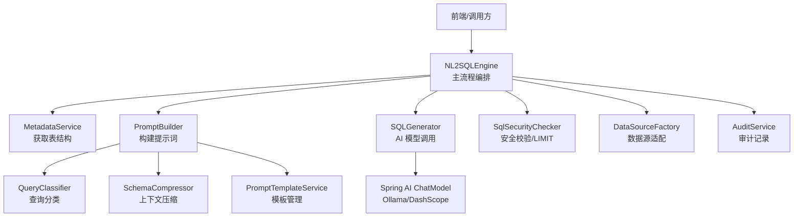
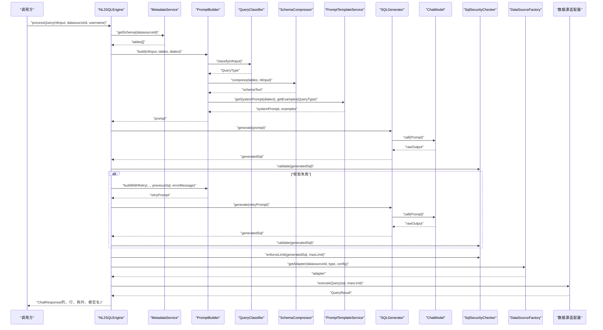
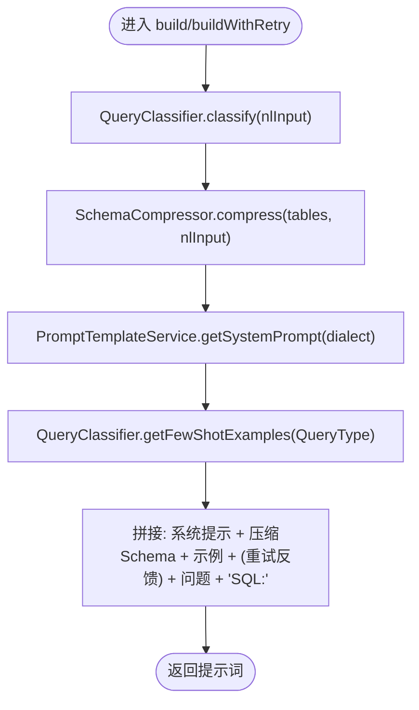
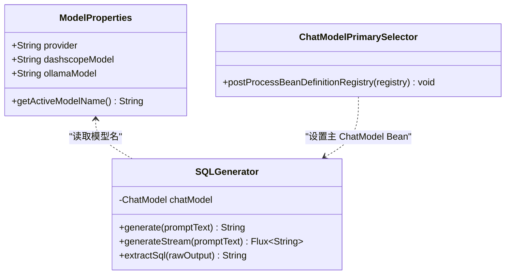
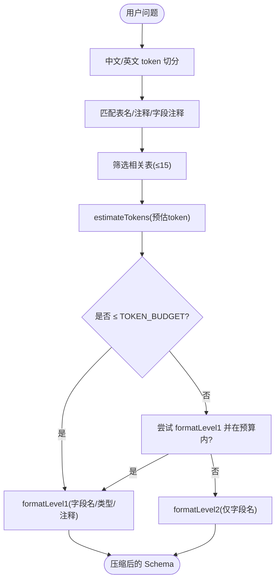
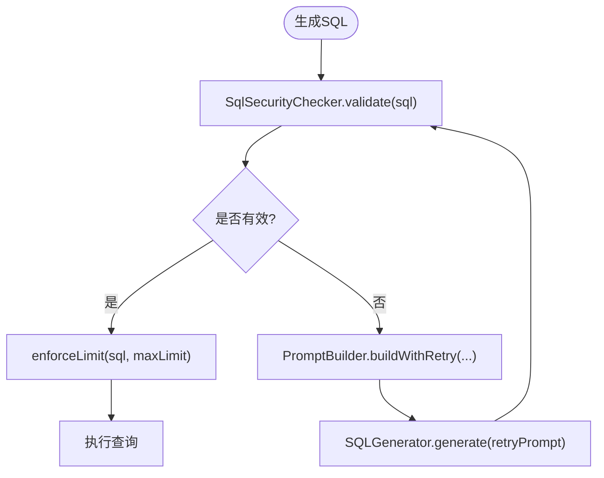
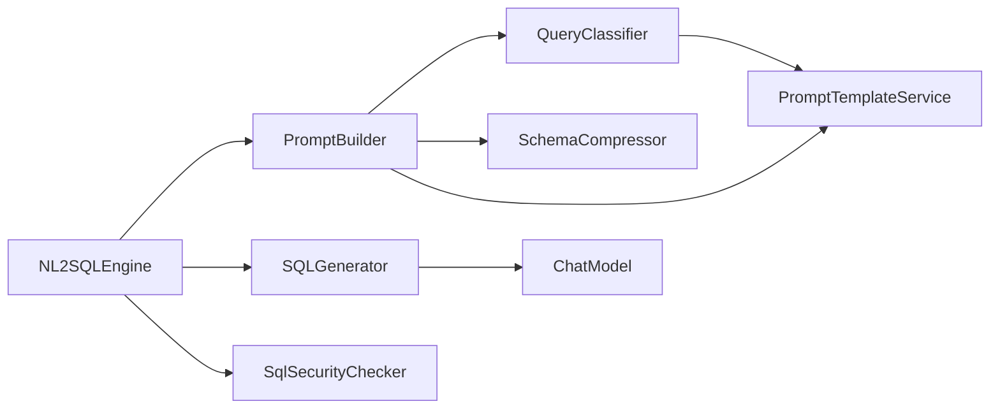

# NL2SQL 核心引擎

<cite>
**本文引用的文件**   
- [NL2SQLEngine.java](file://backend/src/main/java/com/nlp2sql/service/NL2SQLEngine.java)
- [QueryClassifier.java](file://backend/src/main/java/com/nlp2sql/service/QueryClassifier.java)
- [PromptBuilder.java](file://backend/src/main/java/com/nlp2sql/service/PromptBuilder.java)
- [PromptTemplateService.java](file://backend/src/main/java/com/nlp2sql/service/PromptTemplateService.java)
- [SQLGenerator.java](file://backend/src/main/java/com/nlp2sql/service/SQLGenerator.java)
- [SchemaCompressor.java](file://backend/src/main/java/com/nlp2sql/service/SchemaCompressor.java)
- [SqlSecurityChecker.java](file://backend/src/main/java/com/nlp2sql/security/SqlSecurityChecker.java)
- [ModelProperties.java](file://backend/src/main/java/com/nlp2sql/config/ModelProperties.java)
- [ChatModelPrimarySelector.java](file://backend/src/main/java/com/nlp2sql/config/ChatModelPrimarySelector.java)
- [application.yml](file://backend/src/main/resources/application.yml)
- [application-ollama.yml](file://backend/src/main/resources/application-ollama.yml)
- [v1.yml](file://backend/src/main/resources/prompts/v1.yml)
</cite>

## 目录
1. [简介](#简介)
2. [项目结构](#项目结构)
3. [核心组件](#核心组件)
4. [架构总览](#架构总览)
5. [详细组件分析](#详细组件分析)
6. [依赖关系分析](#依赖关系分析)
7. [性能与优化](#性能与优化)
8. [故障排查](#故障排查)
9. [结论](#结论)
10. [附录：自定义提示词模板开发指南](#附录自定义提示词模板开发指南)

## 简介
本文件面向“自然语言到 SQL”的核心引擎，系统性梳理从用户输入到最终查询结果的完整链路，重点解释以下能力：
- 查询意图分类：通过 QueryClassifier 将自然语言问题归类为简单查询、过滤、聚合、连接、子查询、Top-N、趋势、模糊匹配等类型。
- 动态提示构建：PromptBuilder 组合系统指令、压缩后的表结构、few-shot 示例与用户问题，生成高质量提示词。
- 模板管理：PromptTemplateService 从外部 YAML 加载系统提示、重试反馈、关键词与 few-shot 示例，支持版本化。
- AI 模型集成：基于 Spring AI 的 ChatModel，统一封装 Ollama 与 DashScope（通义千问）两种后端，并通过配置切换。
- SQL 生成与优化：SQLGenerator 负责调用大模型、流式输出与结果清洗；SqlSecurityChecker 提供安全校验、限制注入与强制 LIMIT。
- Few-shot 学习与上下文压缩：按查询类型选择少量代表性示例注入提示；SchemaCompressor 根据用户问题筛选相关表并执行两级压缩控制 token 用量。

该引擎以 NL2SQLEngine 为主流程编排器，串联 Schema 获取、提示构建、AI 生成、安全校验、数据源执行与审计记录，形成可观测、可扩展、可配置的 NL2SQL 服务。

## 项目结构
后端核心逻辑位于 service 层，关键类包括：
- NL2SQLEngine：主流程编排，协调元数据、提示构建、SQL 生成、安全校验与执行。
- PromptBuilder：组装提示词，融合系统指令、压缩 schema、few-shot 示例与用户问题。
- QueryClassifier：按关键词优先级对查询意图进行分类，并提供 few-shot 示例。
- PromptTemplateService：从 prompts 目录下的 YAML 加载模板，提供系统提示、重试反馈、关键词与示例。
- SQLGenerator：封装 Spring AI ChatModel，负责同步/流式生成与 SQL 文本提取。
- SchemaCompressor：对表结构进行相关性过滤与两级压缩，控制提示长度。
- SqlSecurityChecker：SQL 语法与语义安全检查、禁止关键字拦截、LIMIT 强制。
- ModelProperties 与 ChatModelPrimarySelector：模型提供方与 ChatModel Bean 选择策略。

**图示来源**
- [NL2SQLEngine.java:1-127](file://backend/src/main/java/com/nlp2sql/service/NL2SQLEngine.java#L1-L127)
- [PromptBuilder.java:1-73](file://backend/src/main/java/com/nlp2sql/service/PromptBuilder.java#L1-L73)
- [QueryClassifier.java:1-55](file://backend/src/main/java/com/nlp2sql/service/QueryClassifier.java#L1-L55)
- [SchemaCompressor.java:1-162](file://backend/src/main/java/com/nlp2sql/service/SchemaCompressor.java#L1-L162)
- [PromptTemplateService.java:1-98](file://backend/src/main/java/com/nlp2sql/service/PromptTemplateService.java#L1-L98)
- [SQLGenerator.java:1-73](file://backend/src/main/java/com/nlp2sql/service/SQLGenerator.java#L1-L73)

**章节来源**
- [NL2SQLEngine.java:1-127](file://backend/src/main/java/com/nlp2sql/service/NL2SQLEngine.java#L1-L127)
- [PromptBuilder.java:1-73](file://backend/src/main/java/com/nlp2sql/service/PromptBuilder.java#L1-L73)
- [QueryClassifier.java:1-55](file://backend/src/main/java/com/nlp2sql/service/QueryClassifier.java#L1-L55)
- [SchemaCompressor.java:1-162](file://backend/src/main/java/com/nlp2sql/service/SchemaCompressor.java#L1-L162)
- [PromptTemplateService.java:1-98](file://backend/src/main/java/com/nlp2sql/service/PromptTemplateService.java#L1-L98)
- [SQLGenerator.java:1-73](file://backend/src/main/java/com/nlp2sql/service/SQLGenerator.java#L1-L73)

## 核心组件
本节聚焦 NL2SQL 核心引擎的关键组件职责与交互关系。

- NL2SQLEngine
  - 作用：端到端处理用户自然语言查询，完成 Schema 获取、提示构建、AI 生成、安全校验、执行查询与审计。
  - 关键点：
    - 若 Schema 为空则直接拒绝请求。
    - 使用 PromptBuilder.build 生成初始提示，交由 SQLGenerator.generate 生成 SQL。
    - 使用 SqlSecurityChecker.validate 校验，失败时通过 buildWithRetry 重试最多 N 次。
    - 使用 enforceLimit 强制添加 LIMIT，避免全表扫描。
    - 通过 DataSourceFactory 获取适配器并执行 SQL，统计行数与耗时返回。
    - 无论成功或失败，均在 finally 中记录审计日志。

- PromptBuilder
  - 作用：组合系统提示、压缩后的 Schema、few-shot 示例与用户问题，生成最终提示。
  - 关键点：
    - 通过 QueryClassifier.classify 决定示例数量与类型。
    - 使用 SchemaCompressor.compress 控制上下文大小。
    - 提供 buildWithRetry 方法用于失败重试场景，注入错误反馈。

- QueryClassifier
  - 作用：按关键词优先级将用户输入分类为预定义查询类型。
  - 关键点：
    - 优先级顺序由 PRIORITY_ORDER 决定，先命中者优先。
    - 通过 PromptTemplateService.getKeywords 获取关键词列表。
    - 提供 getFewShotExamples 以便 PromptBuilder 插入对应类型的示例。

- PromptTemplateService
  - 作用：从 classpath 下 prompts/{version}.yml 加载模板，提供系统提示、重试反馈、关键词与示例。
  - 关键点：
    - 启动时加载默认版本，支持 loadTemplate 动态切换。
    - 使用 SnakeYAML 解析配置文件，对外暴露 getters。
    - 提供 getQueryTypes 与 getVersion 用于诊断与监控。

- SQLGenerator
  - 作用：封装 Spring AI ChatModel 调用，同步/流式生成，并提取纯 SQL 文本。
  - 关键点：
    - generate 调用 chatModel.call 并提取结果。
    - generateStream 返回 Flux 流式片段。
    - extractSql 去除 Markdown 代码块、分号尾缀，仅保留 SQL。

- SchemaCompressor
  - 作用：对用户问题相关的表结构进行过滤与两级压缩，控制 token 预算。
  - 关键点：
    - filterRelevantTables 基于中文/英文 token 匹配表名、注释、字段注释。
    - 优先返回 L1 格式（含字段名、类型与注释），否则回退 L2（仅字段名）。
    - estimateTokens 估算字符数近似 token，配合 TOKEN_BUDGET 做决策。

- SqlSecurityChecker
  - 作用：SQL 安全校验与 LIMIT 强制。
  - 关键点：
    - 黑名单关键字拦截（INSERT/UPDATE/DELETE/DROP/ALTER 等）。
    - AST 解析只允许 SELECT。
    - 检测堆叠查询、UNION 注入模式。
    - enforceLimit 自动追加 LIMIT，防止无界查询。

- ModelProperties 与 ChatModelPrimarySelector
  - 作用：集中管理模型提供方与名称，并按 provider 设置主 ChatModel Bean。
  - 关键点：
    - ModelProperties.getActiveModelName 根据 provider 选择 dashscope 或 ollama 模型名。
    - ChatModelPrimarySelector 在容器启动时根据 nlp2sql.model.provider 设置 primary Bean，解决多 provider 冲突。

**章节来源**
- [NL2SQLEngine.java:1-127](file://backend/src/main/java/com/nlp2sql/service/NL2SQLEngine.java#L1-L127)
- [PromptBuilder.java:1-73](file://backend/src/main/java/com/nlp2sql/service/PromptBuilder.java#L1-L73)
- [QueryClassifier.java:1-55](file://backend/src/main/java/com/nlp2sql/service/QueryClassifier.java#L1-L55)
- [PromptTemplateService.java:1-98](file://backend/src/main/java/com/nlp2sql/service/PromptTemplateService.java#L1-L98)
- [SQLGenerator.java:1-73](file://backend/src/main/java/com/nlp2sql/service/SQLGenerator.java#L1-L73)
- [SchemaCompressor.java:1-162](file://backend/src/main/java/com/nlp2sql/service/SchemaCompressor.java#L1-L162)
- [SqlSecurityChecker.java:1-88](file://backend/src/main/java/com/nlp2sql/security/SqlSecurityChecker.java#L1-L88)
- [ModelProperties.java:1-19](file://backend/src/main/java/com/nlp2sql/config/ModelProperties.java#L1-L19)
- [ChatModelPrimarySelector.java:1-57](file://backend/src/main/java/com/nlp2sql/config/ChatModelPrimarySelector.java#L1-L57)

## 架构总览
下图展示了从用户输入到 SQL 执行的端到端流程，包含重试与安全控制。

**图示来源**
- [NL2SQLEngine.java:1-127](file://backend/src/main/java/com/nlp2sql/service/NL2SQLEngine.java#L1-L127)
- [PromptBuilder.java:1-73](file://backend/src/main/java/com/nlp2sql/service/PromptBuilder.java#L1-L73)
- [QueryClassifier.java:1-55](file://backend/src/main/java/com/nlp2sql/service/QueryClassifier.java#L1-L55)
- [SchemaCompressor.java:1-162](file://backend/src/main/java/com/nlp2sql/service/SchemaCompressor.java#L1-L162)
- [PromptTemplateService.java:1-98](file://backend/src/main/java/com/nlp2sql/service/PromptTemplateService.java#L1-L98)
- [SQLGenerator.java:1-73](file://backend/src/main/java/com/nlp2sql/service/SQLGenerator.java#L1-L73)
- [SqlSecurityChecker.java:1-88](file://backend/src/main/java/com/nlp2sql/security/SqlSecurityChecker.java#L1-L88)

## 详细组件分析

### 查询分类机制：QueryClassifier
- 设计要点
  - 通过 PromptTemplateService.getKeywords 获取每个 QueryType 的关键词集合。
  - 按 PRIORITY_ORDER 顺序匹配，命中即返回，保证高优先级意图优先识别。
  - 空输入或空白输入降级为 SIMPLE_SELECT，确保最小可用行为。
- 复杂度
  - 时间复杂度：O(K×W)，K 为关键词种类数，W 为每类关键词数量；单次 classify 开销很小。
  - 空间复杂度：O(T)，T 为模板中所有关键词总数。
- 优化建议
  - 若关键词规模扩大，可引入前缀树或正则预编译缓存以提升匹配速度。
  - 可在 PromptTemplateService 中增加权重评分机制，替代单一命中优先。

**章节来源**
- [QueryClassifier.java:1-55](file://backend/src/main/java/com/nlp2sql/service/QueryClassifier.java#L1-L55)
- [PromptTemplateService.java:1-98](file://backend/src/main/java/com/nlp2sql/service/PromptTemplateService.java#L1-L98)

### 动态提示构建：PromptBuilder
- 设计要点
  - 使用 QueryClassifier.classify 选择示例集，并根据类型与最大示例数拼接 few-shot。
  - 通过 SchemaCompressor.compress 压缩表结构，再拼接系统提示与用户问题。
  - 提供 buildWithRetry 方法，注入上一次失败 SQL 与错误信息，引导模型自我修正。
- 关键路径
  - build：系统提示 + 压缩 Schema + 示例 + 问题 + “SQL:”。
  - buildWithRetry：系统提示 + 压缩 Schema + 示例 + 重试反馈 + 问题 + “SQL:”。
- 性能考量
  - 示例数量上限为 3（初次）和 2（重试），控制提示长度与延迟。

**图示来源**
- [PromptBuilder.java:1-73](file://backend/src/main/java/com/nlp2sql/service/PromptBuilder.java#L1-L73)
- [QueryClassifier.java:1-55](file://backend/src/main/java/com/nlp2sql/service/QueryClassifier.java#L1-L55)
- [SchemaCompressor.java:1-162](file://backend/src/main/java/com/nlp2sql/service/SchemaCompressor.java#L1-L162)
- [PromptTemplateService.java:1-98](file://backend/src/main/java/com/nlp2sql/service/PromptTemplateService.java#L1-L98)

**章节来源**
- [PromptBuilder.java:1-73](file://backend/src/main/java/com/nlp2sql/service/PromptBuilder.java#L1-L73)

### 模板管理：PromptTemplateService
- 设计要点
  - 启动阶段加载默认版本（由 prompt.version 指定），后续可通过 loadTemplate 动态切换。
  - 使用 SnakeYAML 解析 system_prompt、retry_feedback、keywords、examples。
  - 对外暴露 getKeywords/getExamples 供 QueryClassifier 与 PromptBuilder 使用。
- 可维护性
  - 通过 version 与 description 实现模板版本化管理，便于 A/B 测试与灰度发布。
- 异常处理
  - 模板加载失败抛出运行时异常，便于快速定位配置问题。

**章节来源**
- [PromptTemplateService.java:1-98](file://backend/src/main/java/com/nlp2sql/service/PromptTemplateService.java#L1-L98)

### AI 模型集成策略与多模型支持
- 集成方式
  - SQLGenerator 通过 Spring AI 的 ChatModel 抽象，屏蔽底层供应商差异。
  - ModelProperties 统一管理 provider、dashscope-model、ollama-model 及 activeModelName。
  - ChatModelPrimarySelector 根据 nlp2sql.model.provider 设置主 Bean，避免多 provider 同时存在时的冲突。
- 切换机制
  - application.yml 中 spring.ai.dashscope 与 spring.ai.ollama 分别定义各自参数。
  - application-ollama.yml 排除 DashScope 自动配置，避免缺少 API key 导致启动失败。
  - 通过修改 nlp2sql.model.provider 与 profiles.active 即可切换模型提供方。

**图示来源**
- [ModelProperties.java:1-19](file://backend/src/main/java/com/nlp2sql/config/ModelProperties.java#L1-L19)
- [ChatModelPrimarySelector.java:1-57](file://backend/src/main/java/com/nlp2sql/config/ChatModelPrimarySelector.java#L1-L57)
- [SQLGenerator.java:1-73](file://backend/src/main/java/com/nlp2sql/service/SQLGenerator.java#L1-L73)

**章节来源**
- [ModelProperties.java:1-19](file://backend/src/main/java/com/nlp2sql/config/ModelProperties.java#L1-L19)
- [ChatModelPrimarySelector.java:1-57](file://backend/src/main/java/com/nlp2sql/config/ChatModelPrimarySelector.java#L1-L57)
- [application.yml:1-117](file://backend/src/main/resources/application.yml#L1-L117)
- [application-ollama.yml:1-12](file://backend/src/main/resources/application-ollama.yml#L1-L12)

### SQL 生成优化与清理
- SQLGenerator.extractSql
  - 去除 Markdown 代码块标记（反引号包裹），截取首个换行之后与最后一个反引号之前的内容。
  - 去除末尾分号，避免数据库驱动误判为多条语句。
- 流式输出
  - generateStream 返回 Flux，逐段返回模型输出片段，可用于前端打字机效果。
- 性能建议
  - 结合 PromptBuilder 的示例数量限制与 SchemaCompressor 的 token 预算，降低长提示导致的延迟与成本。

**章节来源**
- [SQLGenerator.java:1-73](file://backend/src/main/java/com/nlp2sql/service/SQLGenerator.java#L1-L73)

### Few-shot Learning 与上下文压缩
- Few-shot 学习
  - PromptTemplateService 在 v1.yml 中为每个 QueryType 提供若干 question/sql 示例。
  - QueryClassifier.getFewShotExamples 按类型返回示例，PromptBuilder 最多取前 N 条注入提示。
- 上下文压缩
  - SchemaCompressor.filterRelevantTables 基于中文/英文 token 匹配表名、注释、字段注释，筛选相关表（最多 15 张）。
  - formatLevel1 输出字段名+类型+注释；formatLevel2 仅输出字段名。
  - estimateTokens 估算字符数，超过 TOKEN_BUDGET（800）则回退到 L2 或直接输出 L1 但仍在预算内。
- 价值
  - 减少无关表结构对模型的干扰，提升 SQL 准确率与响应速度。

**图示来源**
- [SchemaCompressor.java:1-162](file://backend/src/main/java/com/nlp2sql/service/SchemaCompressor.java#L1-L162)

**章节来源**
- [SchemaCompressor.java:1-162](file://backend/src/main/java/com/nlp2sql/service/SchemaCompressor.java#L1-L162)
- [v1.yml:1-149](file://backend/src/main/resources/prompts/v1.yml#L1-L149)

### 安全校验与重试机制
- SqlSecurityChecker.validate
  - 黑名单关键字检查。
  - AST 解析只允许 SELECT。
  - 堆叠查询与 UNION 注入模式检测。
- SqlSecurityChecker.enforceLimit
  - 若未包含 LIMIT，自动追加 maxLimit，避免全表扫描。
- NL2SQLEngine.validateWithRetry
  - 首次 validate 失败后，通过 PromptBuilder.buildWithRetry 构造重试提示，最多重试 maxRetry 次。
  - 每次重试均重新调用 SQLGenerator.generate 与 SqlSecurityChecker.validate。

**图示来源**
- [NL2SQLEngine.java:1-127](file://backend/src/main/java/com/nlp2sql/service/NL2SQLEngine.java#L1-L127)
- [PromptBuilder.java:1-73](file://backend/src/main/java/com/nlp2sql/service/PromptBuilder.java#L1-L73)
- [SQLGenerator.java:1-73](file://backend/src/main/java/com/nlp2sql/service/SQLGenerator.java#L1-L73)
- [SqlSecurityChecker.java:1-88](file://backend/src/main/java/com/nlp2sql/security/SqlSecurityChecker.java#L1-L88)

**章节来源**
- [NL2SQLEngine.java:1-127](file://backend/src/main/java/com/nlp2sql/service/NL2SQLEngine.java#L1-L127)
- [SqlSecurityChecker.java:1-88](file://backend/src/main/java/com/nlp2sql/security/SqlSecurityChecker.java#L1-L88)

## 依赖关系分析
- 组件耦合
  - NL2SQLEngine 作为编排者，依赖较多服务，但职责清晰：调度、重试、审计。
  - PromptBuilder 依赖 QueryClassifier、SchemaCompressor、PromptTemplateService，解耦了提示构建细节。
  - SQLGenerator 仅依赖 Spring AI ChatModel，易于替换底层供应商。
- 外部依赖
  - Spring AI ChatModel：DashScope 与 Ollama 两个供应商通过配置文件与 Bean 选择策略切换。
  - JSQLParser：用于 SQL AST 解析与安全检查。
  - SnakeYAML：用于提示词模板解析。
- 潜在循环依赖
  - 当前未发现循环依赖；各服务之间单向依赖，层次清晰。

**图示来源**
- [NL2SQLEngine.java:1-127](file://backend/src/main/java/com/nlp2sql/service/NL2SQLEngine.java#L1-L127)
- [PromptBuilder.java:1-73](file://backend/src/main/java/com/nlp2sql/service/PromptBuilder.java#L1-L73)
- [QueryClassifier.java:1-55](file://backend/src/main/java/com/nlp2sql/service/QueryClassifier.java#L1-L55)
- [SchemaCompressor.java:1-162](file://backend/src/main/java/com/nlp2sql/service/SchemaCompressor.java#L1-L162)
- [PromptTemplateService.java:1-98](file://backend/src/main/java/com/nlp2sql/service/PromptTemplateService.java#L1-L98)
- [SQLGenerator.java:1-73](file://backend/src/main/java/com/nlp2sql/service/SQLGenerator.java#L1-L73)

**章节来源**
- [NL2SQLEngine.java:1-127](file://backend/src/main/java/com/nlp2sql/service/NL2SQLEngine.java#L1-L127)
- [PromptBuilder.java:1-73](file://backend/src/main/java/com/nlp2sql/service/PromptBuilder.java#L1-L73)
- [QueryClassifier.java:1-55](file://backend/src/main/java/com/nlp2sql/service/QueryClassifier.java#L1-L55)
- [SchemaCompressor.java:1-162](file://backend/src/main/java/com/nlp2sql/service/SchemaCompressor.java#L1-L162)
- [PromptTemplateService.java:1-98](file://backend/src/main/java/com/nlp2sql/service/PromptTemplateService.java#L1-L98)
- [SQLGenerator.java:1-73](file://backend/src/main/java/com/nlp2sql/service/SQLGenerator.java#L1-L73)

## 性能与优化
- 提示词长度控制
  - 使用 PromptBuilder 限制示例数量（初次 3 条、重试 2 条），减少无效上下文。
  - 使用 SchemaCompressor 的 TOKEN_BUDGET 与两级压缩策略，避免超长 Schema 导致模型超时或精度下降。
- 模型调用优化
  - 使用 SQLGenerator.generateStream 实现流式输出，改善用户体验。
  - 合理设置 temperature=0，提高 SQL 生成的稳定性。
- 安全与资源保护
  - enforceLimit 强制 LIMIT，避免无界查询造成数据库压力。
  - SqlSecurityChecker 的黑名单与注入检测可减少恶意或危险 SQL 执行风险。
- 配置调优建议
  - 调整 sql-security.max-retry 平衡成功率与延迟。
  - 调整 prompt.version 与 vN.yml 中的示例质量，提升 Few-shot 效果。
  - 针对 Ollama 本地模型，适当增大 num-ctx 以适应更长提示。

[本节为通用指导，不直接分析具体文件]

## 故障排查
- 模板加载失败
  - 现象：启动时报无法加载提示词模板。
  - 排查：确认 prompts/{version}.yml 是否存在且格式正确；检查 prompt.version 配置。
- 模型切换失败
  - 现象：启动时出现 ChatModel bean 冲突或缺失。
  - 排查：检查 nlp2sql.model.provider 是否为 dashscope 或 ollama；如使用 Ollama，确认已启用 application-ollama.yml 排除 DashScope 自动配置。
- SQL 生成失败或反复失败
  - 现象：多次重试后仍报 SQL 校验失败。
  - 排查：查看 SqlSecurityChecker 的错误信息；检查 PromptTemplateService.retry_feedback 模板是否正确；必要时增加 or 优化 Few-shot 示例。
- 查询结果无数据或超限制
  - 现象：执行返回行数为 0 或被 LIMIT 截断。
  - 排查：检查 enforceLimit 的 maxLimit 配置；确认业务逻辑是否需要更大分页或分页接口。

**章节来源**
- [PromptTemplateService.java:1-98](file://backend/src/main/java/com/nlp2sql/service/PromptTemplateService.java#L1-L98)
- [application.yml:1-117](file://backend/src/main/resources/application.yml#L1-L117)
- [application-ollama.yml:1-12](file://backend/src/main/resources/application-ollama.yml#L1-L12)
- [NL2SQLEngine.java:1-127](file://backend/src/main/java/com/nlp2sql/service/NL2SQLEngine.java#L1-L127)
- [SqlSecurityChecker.java:1-88](file://backend/src/main/java/com/nlp2sql/security/SqlSecurityChecker.java#L1-L88)

## 结论
本 NL2SQL 核心引擎通过清晰的职责分层与可配置的外部化模板，实现了从自然语言到 SQL 的稳定转换。其关键优势包括：
- 意图分类与 Few-shot 示例增强理解能力。
- Schema 相关性过滤与两级压缩，控制上下文长度，提升效率与准确率。
- 基于 Spring AI 的多模型支持与 Bean 级切换，兼顾云端与本地部署。
- 严格的安全校验与 LIMIT 强制，保障数据库安全与资源可控。
- 完整的审计与重试机制，便于追踪与排错。

在实际落地中，建议持续优化提示词模板、Few-shot 示例与 Schema 压缩策略，并结合业务场景调整模型参数与安全阈值。

[本节为总结性内容，不直接分析具体文件]

## 附录：自定义提示词模板开发指南
- 模板位置与命名
  - 新增模板文件置于 resources/prompts/ 目录下，命名为 vX.yml（X 为版本号）。
  - 通过 application.yml 中 prompt.version 指定当前生效版本。
- 模板结构与字段说明
  - system_prompt：系统指令，包含 {dialect} 占位符，由 PromptTemplateService 注入数据库方言。
  - retry_feedback：重试反馈模板，包含 {previousSql} 与 {errorMessage} 占位符。
  - keywords：按 QueryType 组织关键词列表，用于 QueryClassifier.classify。
  - examples：按 QueryType 组织的 question/sql 示例对，用于 Few-shot 注入。
- 开发步骤
  - 复制 v1.yml 为新版本 vX.yml，根据需要调整 system_prompt、keywords 与 examples。
  - 在 application.yml 中将 prompt.version 改为 vX。
  - 重启应用并验证 PromptTemplateService 加载日志。
- 最佳实践
  - 保持示例与业务语义一致，覆盖常见 QueryType 的典型场景。
  - 控制示例数量，避免提示过长；优先精选高质量样例。
  - 定期评估不同版本的生成准确率与延迟，逐步灰度升级。

**章节来源**
- [PromptTemplateService.java:1-98](file://backend/src/main/java/com/nlp2sql/service/PromptTemplateService.java#L1-L98)
- [v1.yml:1-149](file://backend/src/main/resources/prompts/v1.yml#L1-L149)
- [application.yml:1-117](file://backend/src/main/resources/application.yml#L1-L117)