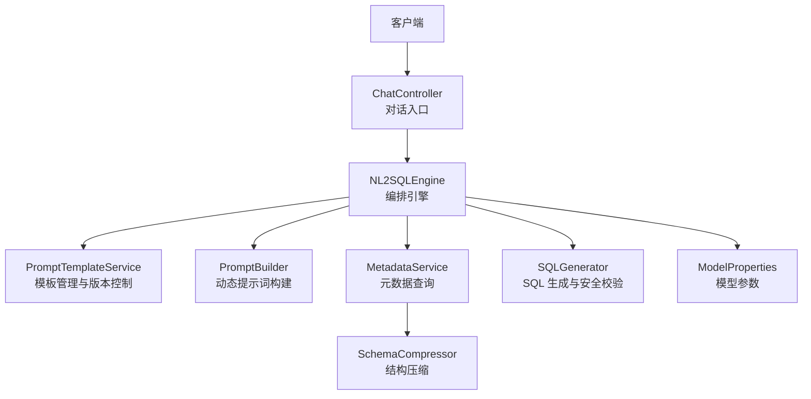
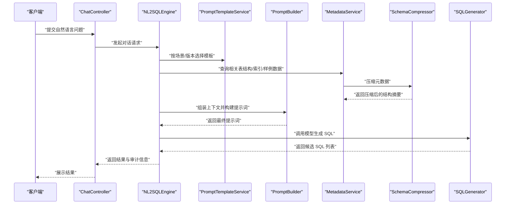
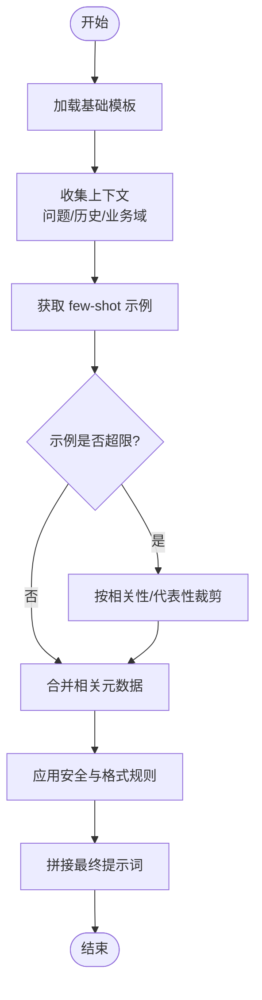
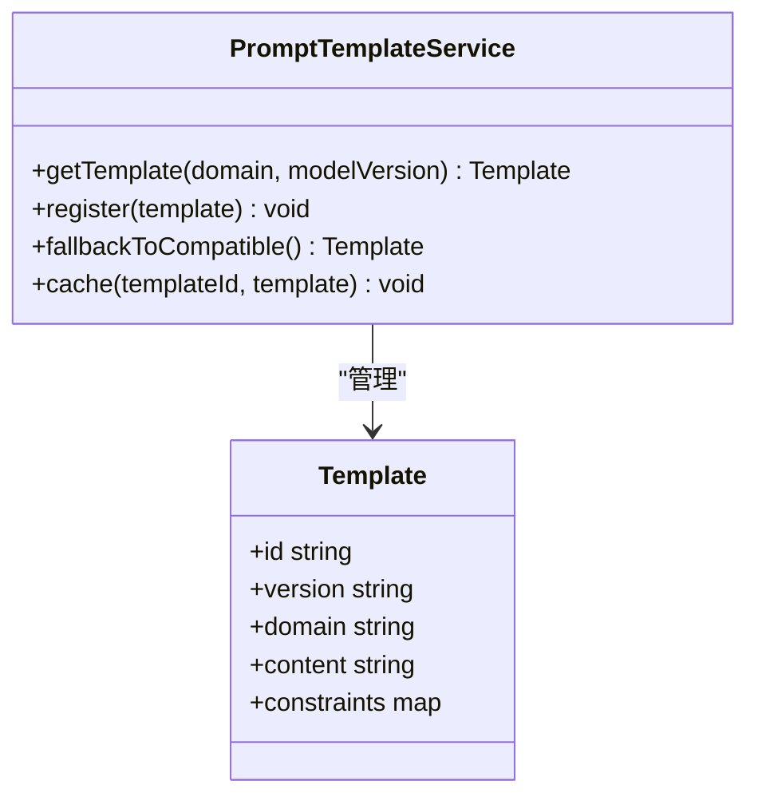
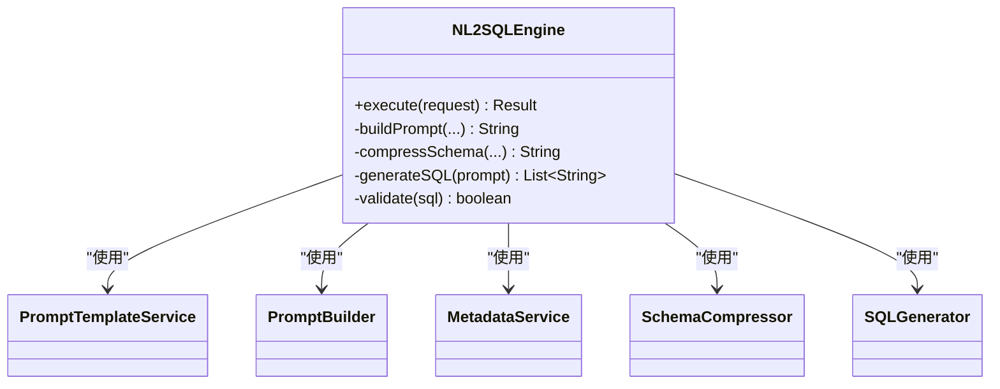
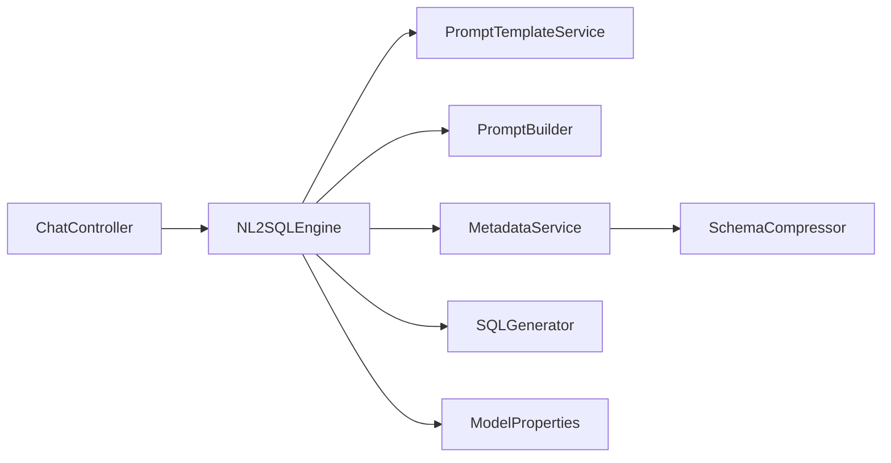

# 提示词工程

<cite>
**本文引用的文件**   
- [PromptBuilder.java](file://backend/backend/src/main/java/com/nlp2sql/service/PromptBuilder.java)
- [PromptTemplateService.java](file://backend/backend/src/main/java/com/nlp2sql/service/PromptTemplateService.java)
- [NL2SQLEngine.java](file://backend/backend/src/main/java/com/nlp2sql/service/NL2SQLEngine.java)
- [ModelProperties.java](file://backend/backend/src/main/java/com/nlp2sql/config/ModelProperties.java)
- [ChatController.java](file://backend/backend/src/main/java/com/nlp2sql/controller/ChatController.java)
- [MetadataService.java](file://backend/backend/src/main/java/com/nlp2sql/service/MetadataService.java)
- [SchemaCompressor.java](file://backend/backend/src/main/java/com/nlp2sql/service/SchemaCompressor.java)
- [SQLGenerator.java](file://backend/backend/src/main/java/com/nlp2sql/service/SQLGenerator.java)
- [application.yml](file://backend/backend/src/main/resources/application.yml)
- [application-ollama.yml](file://backend/backend/src/main/resources/application-ollama.yml)
</cite>

## 目录
1. [引言](#引言)
2. [项目结构](#项目结构)
3. [核心组件](#核心组件)
4. [架构总览](#架构总览)
5. [详细组件分析](#详细组件分析)
6. [依赖关系分析](#依赖关系分析)
7. [性能与容量规划](#性能与容量规划)
8. [故障排查指南](#故障排查指南)
9. [结论](#结论)
10. [附录：模板设计模式与最佳实践](#附录模板设计模式与最佳实践)

## 引言
本文件面向“提示词工程”主题，聚焦以下目标：
- 解释 PromptBuilder 的动态提示词构建算法与上下文组装机制。
- 说明 PromptTemplateService 的模板管理与版本控制策略。
- 给出 few-shot learning 示例的设计原则与落地建议。
- 规范外部 YAML 模板文件的结构与配置方法。
- 提供提示词优化技巧、效果评估指标、模板设计模式与性能调优建议。

本项目是一个 NL2SQL 系统，后端基于 Spring Boot，前端为 Vue 3；提示词工程位于后端服务层，通过控制器接入对话流程，结合元数据压缩与 SQL 安全校验，最终生成可执行的 SQL 语句。

## 项目结构
从提示词工程视角，相关代码主要分布在 service 层与 config、resources 中：
- service 层：PromptBuilder、PromptTemplateService、NL2SQLEngine、MetadataService、SchemaCompressor、SQLGenerator
- config 层：ModelProperties（模型参数）
- resources：application.yml、application-ollama.yml（运行时配置，可能包含模型与提示词路径等）
- controller 层：ChatController（对话入口，触发提示词构建与 SQL 生成）

**图表来源**
- [ChatController.java](file://backend/backend/src/main/java/com/nlp2sql/controller/ChatController.java)
- [NL2SQLEngine.java](file://backend/backend/src/main/java/com/nlp2sql/service/NL2SQLEngine.java)
- [PromptTemplateService.java](file://backend/backend/src/main/java/com/nlp2sql/service/PromptTemplateService.java)
- [PromptBuilder.java](file://backend/backend/src/main/java/com/nlp2sql/service/PromptBuilder.java)
- [MetadataService.java](file://backend/backend/src/main/java/com/nlp2sql/service/MetadataService.java)
- [SchemaCompressor.java](file://backend/backend/src/main/java/com/nlp2sql/service/SchemaCompressor.java)
- [SQLGenerator.java](file://backend/backend/src/main/java/com/nlp2sql/service/SQLGenerator.java)
- [ModelProperties.java](file://backend/backend/src/main/java/com/nlp2sql/config/ModelProperties.java)

**章节来源**
- [ChatController.java](file://backend/backend/src/main/java/com/nlp2sql/controller/ChatController.java)
- [NL2SQLEngine.java](file://backend/backend/src/main/java/com/nlp2sql/service/NL2SQLEngine.java)
- [PromptTemplateService.java](file://backend/backend/src/main/java/com/nlp2sql/service/PromptTemplateService.java)
- [PromptBuilder.java](file://backend/backend/src/main/java/com/nlp2sql/service/PromptBuilder.java)
- [MetadataService.java](file://backend/backend/src/main/java/com/nlp2sql/service/MetadataService.java)
- [SchemaCompressor.java](file://backend/backend/src/main/java/com/nlp2sql/service/SchemaCompressor.java)
- [SQLGenerator.java](file://backend/backend/src/main/java/com/nlp2sql/service/SQLGenerator.java)
- [ModelProperties.java](file://backend/backend/src/main/java/com/nlp2sql/config/ModelProperties.java)

## 核心组件
- PromptBuilder：负责将用户问题、上下文、元数据、few-shot 示例、系统规则等拼装成最终提示词。其关键职责包括：
  - 选择并加载模板（由 PromptTemplateService 管理）。
  - 按任务类型或场景注入差异化上下文。
  - 控制示例数量与长度，避免超出模型上下文窗口。
  - 对敏感字段进行脱敏或掩码处理。
- PromptTemplateService：负责模板的加载、缓存、版本选择与回退策略，支持多语言、多业务域、多模型适配。
- NL2SQLEngine：作为编排器，协调提示词构建、元数据压缩、SQL 生成与安全检查。
- MetadataService + SchemaCompressor：负责从数据库获取元数据并进行压缩，以最小化提示词体积。
- SQLGenerator：根据提示词调用大模型生成 SQL，并结合安全策略进行二次校验。
- ModelProperties：集中管理模型名称、温度、最大 token、超时等参数。

**章节来源**
- [PromptBuilder.java](file://backend/backend/src/main/java/com/nlp2sql/service/PromptBuilder.java)
- [PromptTemplateService.java](file://backend/backend/src/main/java/com/nlp2sql/service/PromptTemplateService.java)
- [NL2SQLEngine.java](file://backend/backend/src/main/java/com/nlp2sql/service/NL2SQLEngine.java)
- [MetadataService.java](file://backend/backend/src/main/java/com/nlp2sql/service/MetadataService.java)
- [SchemaCompressor.java](file://backend/backend/src/main/java/com/nlp2sql/service/SchemaCompressor.java)
- [SQLGenerator.java](file://backend/backend/src/main/java/com/nlp2sql/service/SQLGenerator.java)
- [ModelProperties.java](file://backend/backend/src/main/java/com/nlp2sql/config/ModelProperties.java)

## 架构总览
下面的序列图展示了从用户提问到 SQL 生成的端到端流程，突出提示词构建在其中的位置与作用。

**图表来源**
- [ChatController.java](file://backend/backend/src/main/java/com/nlp2sql/controller/ChatController.java)
- [NL2SQLEngine.java](file://backend/backend/src/main/java/com/nlp2sql/service/NL2SQLEngine.java)
- [PromptTemplateService.java](file://backend/backend/src/main/java/com/nlp2sql/service/PromptTemplateService.java)
- [PromptBuilder.java](file://backend/backend/src/main/java/com/nlp2sql/service/PromptBuilder.java)
- [MetadataService.java](file://backend/backend/src/main/java/com/nlp2sql/service/MetadataService.java)
- [SchemaCompressor.java](file://backend/backend/src/main/java/com/nlp2sql/service/SchemaCompressor.java)
- [SQLGenerator.java](file://backend/backend/src/main/java/com/nlp2sql/service/SQLGenerator.java)

## 详细组件分析

### PromptBuilder：动态提示词构建与上下文组装
- 输入
  - 用户问题、历史对话（可选）、业务域标签、模型参数（温度、最大输出长度等）。
  - 由 NL2SQLEngine 传入的元数据摘要与 few-shot 示例集合。
- 构建流程要点
  - 模板选择：依据业务域、模型能力、版本策略从 PromptTemplateService 获取基础模板。
  - 上下文拼装：将“角色定义、任务说明、约束条件、输出格式、few-shot 示例、当前问题”按固定顺序拼接。
  - 示例裁剪：当示例过多时，按相关性或代表性进行裁剪，确保不超过模型上下文上限。
  - 元数据融合：仅注入与问题相关的表/字段，避免无关噪声。
  - 安全与合规：去除或替换敏感信息，添加必要的安全声明。
- 复杂度
  - 时间复杂度主要由字符串拼接与示例过滤决定，近似 O(n)（n 为示例数与片段总数）。
  - 空间复杂度取决于最终提示词长度，需受模型上下文限制。

**图表来源**
- [PromptBuilder.java](file://backend/backend/src/main/java/com/nlp2sql/service/PromptBuilder.java)
- [PromptTemplateService.java](file://backend/backend/src/main/java/com/nlp2sql/service/PromptTemplateService.java)
- [SchemaCompressor.java](file://backend/backend/src/main/java/com/nlp2sql/service/SchemaCompressor.java)

**章节来源**
- [PromptBuilder.java](file://backend/backend/src/main/java/com/nlp2sql/service/PromptBuilder.java)
- [PromptTemplateService.java](file://backend/backend/src/main/java/com/nlp2sql/service/PromptTemplateService.java)
- [SchemaCompressor.java](file://backend/backend/src/main/java/com/nlp2sql/service/SchemaCompressor.java)

### PromptTemplateService：模板管理与版本控制
- 功能职责
  - 模板注册：支持按领域、模型、版本维度注册模板。
  - 版本选择：根据运行时配置（如 application.yml）与模型能力选择最合适的模板版本。
  - 回退策略：若首选模板不可用，则自动回退到兼容版本。
  - 缓存：对常用模板进行内存缓存，降低 I/O 开销。
  - 扩展点：预留接口用于新增模板类型（如分步推理、工具调用、多轮对话）。
- 版本控制建议
  - 语义化版本号（主版本/次版本/修订号），与模型能力或业务变更对齐。
  - 变更日志：记录模板改动影响范围与回归测试用例。
  - 灰度发布：先小流量验证，再全量上线。

**图表来源**
- [PromptTemplateService.java](file://backend/backend/src/main/java/com/nlp2sql/service/PromptTemplateService.java)

**章节来源**
- [PromptTemplateService.java](file://backend/backend/src/main/java/com/nlp2sql/service/PromptTemplateService.java)

### NL2SQLEngine：编排器
- 作用
  - 串联提示词构建、元数据压缩、SQL 生成与安全校验。
  - 统一异常与审计，便于追踪与回溯。
- 关键流程
  - 解析请求：识别意图、提取实体、确定业务域。
  - 构建提示词：委托 PromptTemplateService 与 PromptBuilder。
  - 执行生成：调用 SQLGenerator 生成候选 SQL。
  - 后处理：执行计划检查、权限校验、结果格式化。

**图表来源**
- [NL2SQLEngine.java](file://backend/backend/src/main/java/com/nlp2sql/service/NL2SQLEngine.java)
- [PromptTemplateService.java](file://backend/backend/src/main/java/com/nlp2sql/service/PromptTemplateService.java)
- [PromptBuilder.java](file://backend/backend/src/main/java/com/nlp2sql/service/PromptBuilder.java)
- [MetadataService.java](file://backend/backend/src/main/java/com/nlp2sql/service/MetadataService.java)
- [SchemaCompressor.java](file://backend/backend/src/main/java/com/nlp2sql/service/SchemaCompressor.java)
- [SQLGenerator.java](file://backend/backend/src/main/java/com/nlp2sql/service/SQLGenerator.java)

**章节来源**
- [NL2SQLEngine.java](file://backend/backend/src/main/java/com/nlp2sql/service/NL2SQLEngine.java)

### 与控制器和数据源的集成
- ChatController 暴露对话接口，接收前端请求并交由 NL2SQLEngine 处理。
- MetadataService 从数据库读取元数据，供 SchemaCompressor 压缩。
- SQLGenerator 负责与模型交互并返回候选 SQL，同时配合安全策略进行二次校验。

**章节来源**
- [ChatController.java](file://backend/backend/src/main/java/com/nlp2sql/controller/ChatController.java)
- [MetadataService.java](file://backend/backend/src/main/java/com/nlp2sql/service/MetadataService.java)
- [SQLGenerator.java](file://backend/backend/src/main/java/com/nlp2sql/service/SQLGenerator.java)

## 依赖关系分析
- 耦合性
  - NL2SQLEngine 作为编排中心，依赖多个服务，但通过接口解耦，利于单元测试与替换实现。
  - PromptBuilder 与 PromptTemplateService 紧密协作，前者消费后者提供的模板能力。
- 外部依赖
  - 模型调用：由 SQLGenerator 封装，具体模型细节可通过 ModelProperties 配置。
  - 配置中心：application.yml 与 application-ollama.yml 提供运行时参数与环境切换。

**图表来源**
- [ChatController.java](file://backend/backend/src/main/java/com/nlp2sql/controller/ChatController.java)
- [NL2SQLEngine.java](file://backend/backend/src/main/java/com/nlp2sql/service/NL2SQLEngine.java)
- [PromptTemplateService.java](file://backend/backend/src/main/java/com/nlp2sql/service/PromptTemplateService.java)
- [PromptBuilder.java](file://backend/backend/src/main/java/com/nlp2sql/service/PromptBuilder.java)
- [MetadataService.java](file://backend/backend/src/main/java/com/nlp2sql/service/MetadataService.java)
- [SchemaCompressor.java](file://backend/backend/src/main/java/com/nlp2sql/service/SchemaCompressor.java)
- [SQLGenerator.java](file://backend/backend/src/main/java/com/nlp2sql/service/SQLGenerator.java)
- [ModelProperties.java](file://backend/backend/src/main/java/com/nlp2sql/config/ModelProperties.java)

**章节来源**
- [application.yml](file://backend/backend/src/main/resources/application.yml)
- [application-ollama.yml](file://backend/backend/src/main/resources/application-ollama.yml)

## 性能与容量规划
- 提示词大小控制
  - 使用 SchemaCompressor 压缩元数据，只保留必要表结构与关键字段。
  - 限制 few-shot 示例数量，优先选择高代表性样本。
- 并发与缓存
  - 对频繁使用的模板进行内存缓存，减少重复解析与 I/O。
  - 控制并发请求下的提示词构建队列长度，避免峰值抖动。
- 模型参数调优
  - 调整 temperature、top_p、max_tokens 等参数，平衡创造性与稳定性。
  - 针对长文本场景，提高 chunk 分割与重试策略。
- 监控与度量
  - 记录每次请求的提示词长度、示例数量、压缩率、延迟、失败率。
  - 建立 A/B 对比通道，评估不同模板版本的效果差异。

[本节为通用性能指导，不直接分析具体文件]

## 故障排查指南
- 常见问题定位
  - 提示词过长导致截断：检查示例裁剪逻辑与元数据压缩策略。
  - 模板版本错误：核对 PromptTemplateService 的版本选择与回退策略。
  - 模型调用失败：检查 ModelProperties 的配置与网络连通性。
  - 安全校验拦截：查看 SQL 生成后的校验规则与安全策略。
- 诊断手段
  - 开启调试日志，打印提示词构建各阶段的关键中间结果。
  - 使用审计表记录提示词哈希、模型版本、参数与结果，便于回溯。
  - 对高频失败问题构造最小复现用例，逐步隔离原因。

**章节来源**
- [ModelProperties.java](file://backend/backend/src/main/java/com/nlp2sql/config/ModelProperties.java)
- [PromptTemplateService.java](file://backend/backend/src/main/java/com/nlp2sql/service/PromptTemplateService.java)
- [PromptBuilder.java](file://backend/backend/src/main/java/com/nlp2sql/service/PromptBuilder.java)
- [SQLGenerator.java](file://backend/backend/src/main/java/com/nlp2sql/service/SQLGenerator.java)

## 结论
提示词工程在本项目中承担“理解—装配—约束—生成”的核心职能。通过 PromptTemplateService 的模板化管理与版本控制，以及 PromptBuilder 的动态上下文组装，系统在可控范围内实现了高质量 NL2SQL 生成。配合元数据压缩、示例裁剪与安全校验，能够在保证准确率的同时兼顾性能与成本。

[本节为总结性内容，不直接分析具体文件]

## 附录：模板设计模式与最佳实践

### 外部 YAML 模板文件结构与配置
- 推荐结构
  - 按 domain（业务域）与 model（模型）组织模板目录。
  - 每个模板包含：
    - system：角色与系统规则
    - instructions：任务指令与输出格式
    - constraints：安全与合规约束
    - examples：few-shot 示例数组（question / sql / explanation）
    - schema_hint：元数据注入占位符
- 配置方法
  - 在 application.yml 或 application-ollama.yml 中指定模板根路径、默认版本与回退策略。
  - 使用环境变量区分开发/测试/生产环境，便于灰度发布。

[本节为通用指导，不直接分析具体文件]

### Few-shot Learning 示例设计与最佳实践
- 代表性：覆盖典型查询模式（聚合、连接、过滤、排序、分页）。
- 多样性：涵盖不同表规模、字段命名风格与业务术语。
- 可解释性：附带简要解释，帮助模型学习推理路径。
- 去敏与合规：不包含真实敏感数据，必要时使用合成数据。
- 数量控制：通常 3–5 个示例为宜，避免超出上下文窗口。

[本节为通用指导，不直接分析具体文件]

### 提示词优化技巧
- 结构化表达：明确分隔“角色/任务/约束/示例/问题”。
- 渐进式引导：复杂任务拆分为子步骤，要求模型分步输出。
- 负面约束：明确禁止行为（如不要返回多余信息）。
- 一致性：保持术语一致，避免歧义。
- 评测驱动：以 SQL 正确率、执行耗时、失败率为核心指标，持续迭代。

[本节为通用指导，不直接分析具体文件]

### 模板设计模式
- 单模板多场景：通过变量注入不同业务域与模型能力。
- 分层模板：system/instructions/examples 分离，便于独立维护。
- 组合模板：将通用约束与领域专用指令组合，减少重复。
- 回退模板：为旧模型或低能力模型准备降级版本。

[本节为通用指导，不直接分析具体文件]

### 效果评估指标
- 准确率：SQL 与标准答案等价的比例（考虑语义等价与执行结果一致）。
- 执行成功率：生成 SQL 可执行且无语法/权限错误的比例。
- 延迟与吞吐：P50/P95 延迟、QPS。
- 成本：Token 消耗与费用。
- 稳定性：不同批次、不同负载下的波动程度。

[本节为通用指导，不直接分析具体文件]