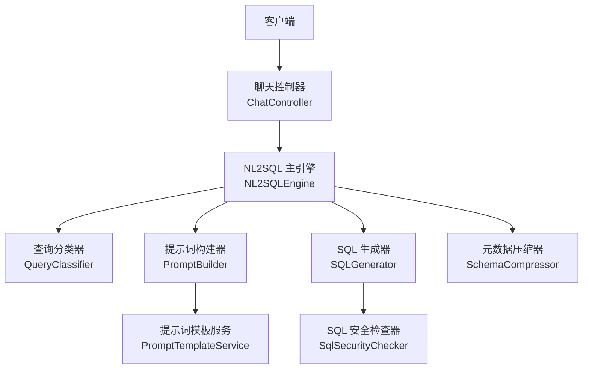
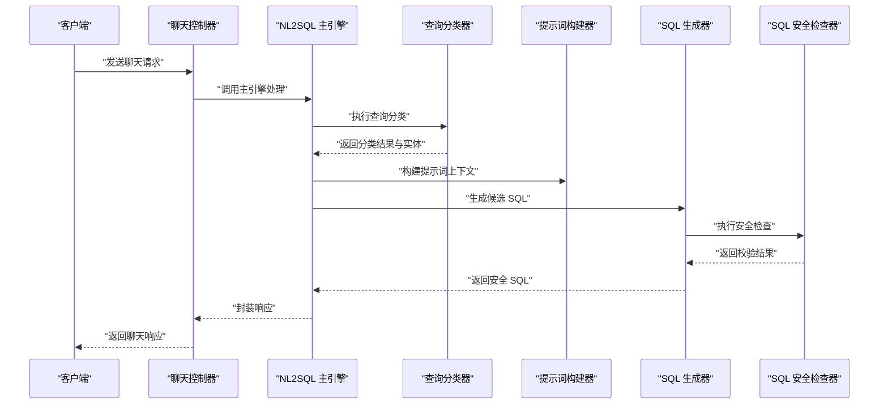
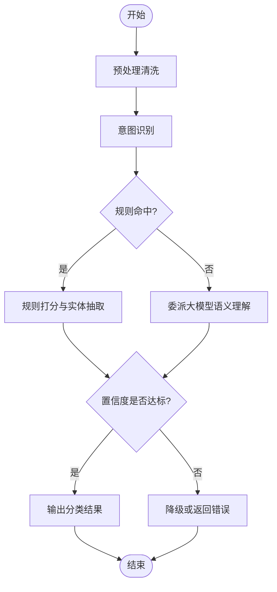
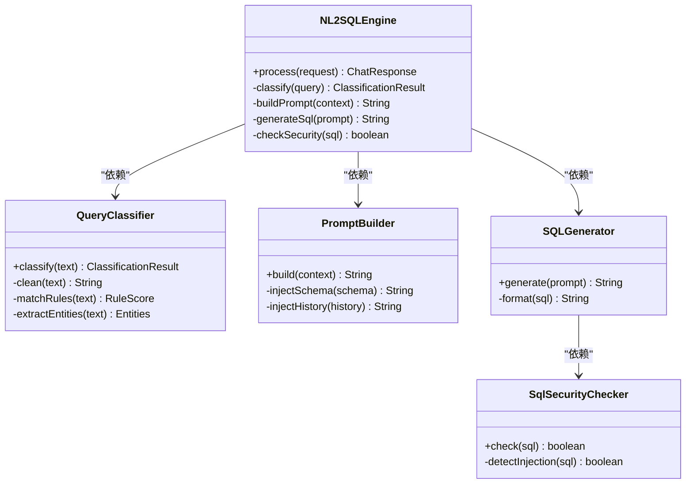
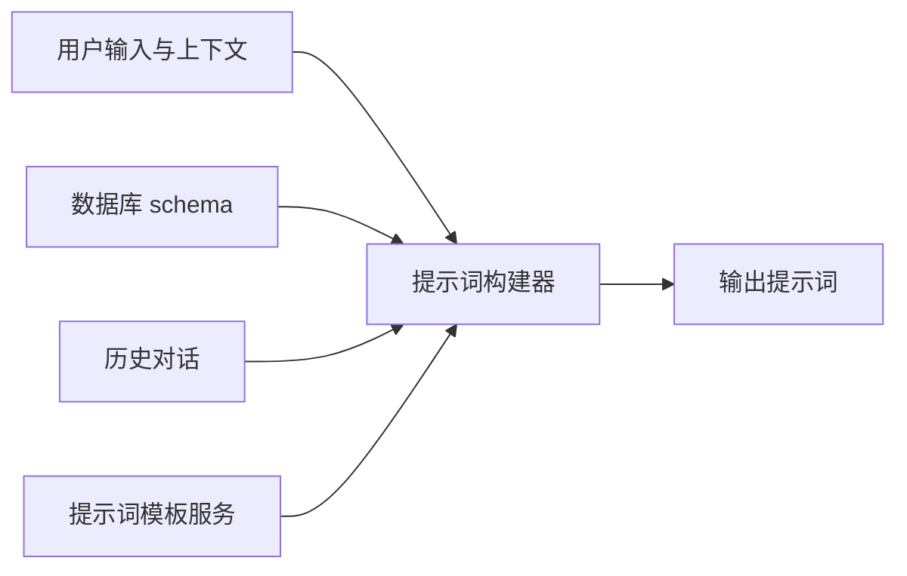
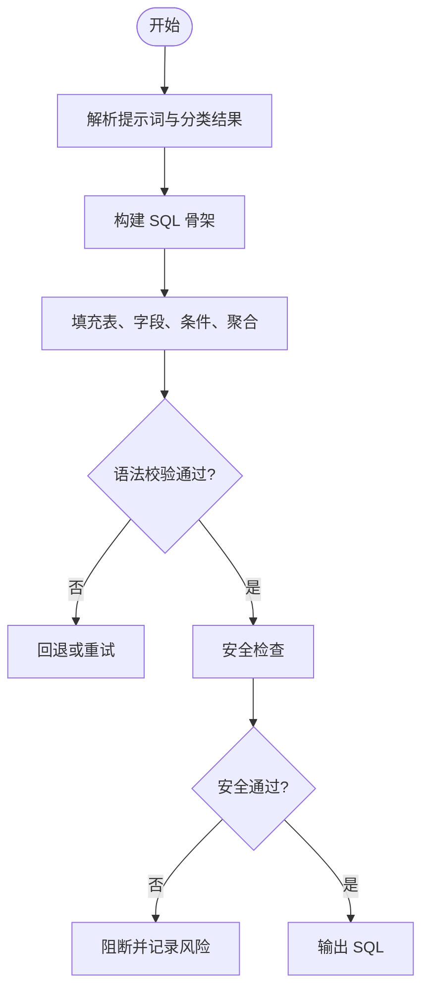
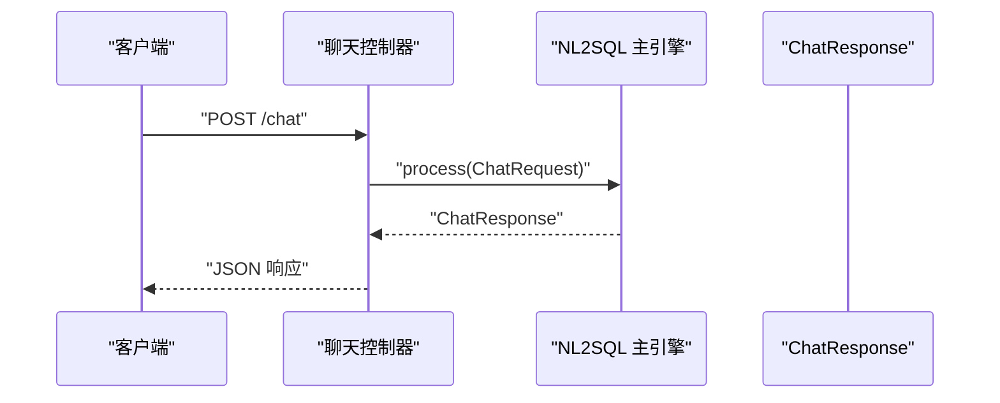
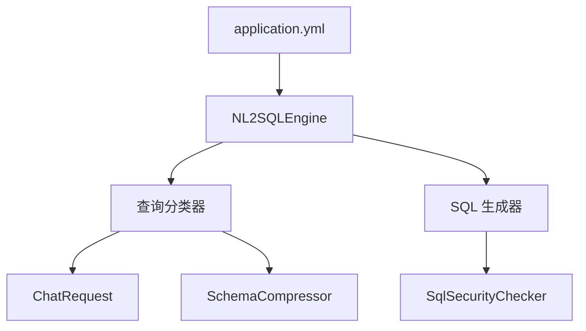

# 查询分类器

<cite>
**本文引用的文件**   
- [QueryClassifier.java](file://backend/backend/src/main/java/com/nlp2sql/service/QueryClassifier.java)
- [NL2SQLEngine.java](file://backend/backend/src/main/java/com/nlp2sql/service/NL2SQLEngine.java)
- [PromptBuilder.java](file://backend/backend/src/main/java/com/nlp2sql/service/PromptBuilder.java)
- [PromptTemplateService.java](file://backend/backend/src/main/java/com/nlp2sql/service/PromptTemplateService.java)
- [SQLGenerator.java](file://backend/backend/src/main/java/com/nlp2sql/service/SQLGenerator.java)
- [SchemaCompressor.java](file://backend/backend/src/main/java/com/nlp2sql/service/SchemaCompressor.java)
- [ChatController.java](file://backend/backend/src/main/java/com/nlp2sql/controller/ChatController.java)
- [ChatRequest.java](file://backend/backend/src/main/java/com/nlp2sql/model/dto/ChatRequest.java)
- [ChatResponse.java](file://backend/backend/src/main/java/com/nlp2sql/model/dto/ChatResponse.java)
- [SqlSecurityChecker.java](file://backend/backend/src/main/java/com/nlp2sql/security/SqlSecurityChecker.java)
- [application.yml](file://backend/backend/src/main/resources/application.yml)
- [technical_proposal.md](file://docs/docs/technical_proposal.md)
</cite>

## 目录
1. [简介](#简介)
2. [项目结构定位](#项目结构定位)
3. [核心组件总览](#核心组件总览)
4. [架构概览](#架构概览)
5. [详细组件分析](#详细组件分析)
6. [依赖关系分析](#依赖关系分析)
7. [性能与准确率优化](#性能与准确率优化)
8. [故障排查指南](#故障排查指南)
9. [结论](#结论)
10. [附录：扩展示例与最佳实践](#附录扩展示例与最佳实践)

## 简介
本文件聚焦于自然语言转 SQL 系统中的“查询分类器”，系统通过规则匹配、模式识别与大模型提示词工程相结合的方式，对用户自然语言进行意图识别、实体提取和语义理解，并据此生成可执行的 SQL。查询分类器承担以下职责：
- 将用户输入识别为 SELECT、INSERT、UPDATE、DELETE 等基础查询类型。
- 抽取表名、字段名、条件值、聚合维度等关键实体。
- 在必要时调用大模型完成更复杂的语义解析，同时保留规则引擎的确定性与可控性。
- 输出结构化分类结果，供后续 SQL 生成与安全校验使用。

本项目采用分层设计：控制器负责接口，服务层实现业务编排，安全模块负责 SQL 注入防护，配置与提示词模板支撑灵活扩展。

## 项目结构定位
查询分类器位于后端服务层 service 包中，并与控制器、数据源适配、安全校验、提示词构建以及 SQL 生成模块协同工作。整体代码路径以 `com.nlp2sql` 为根包，相关类分布如下：
- 控制器：接收前端对话请求，返回统一响应。
- 服务层：包含查询分类、提示词构建、SQL 生成、元数据压缩、NL2SQL 主引擎等。
- 安全层：提供 SQL 注入检测与拦截。
- 模型层：定义请求与响应 DTO。
- 配置层：应用配置与安全策略。
- 资源层：提示词模板与应用配置。

**图表来源**
- [ChatController.java](file://backend/backend/src/main/java/com/nlp2sql/controller/ChatController.java)
- [NL2SQLEngine.java](file://backend/backend/src/main/java/com/nlp2sql/service/NL2SQLEngine.java)
- [QueryClassifier.java](file://backend/backend/src/main/java/com/nlp2sql/service/QueryClassifier.java)
- [PromptBuilder.java](file://backend/backend/src/main/java/com/nlp2sql/service/PromptBuilder.java)
- [PromptTemplateService.java](file://backend/backend/src/main/java/com/nlp2sql/service/PromptTemplateService.java)
- [SQLGenerator.java](file://backend/backend/src/main/java/com/nlp2sql/service/SQLGenerator.java)
- [SchemaCompressor.java](file://backend/backend/src/main/java/com/nlp2sql/service/SchemaCompressor.java)
- [SqlSecurityChecker.java](file://backend/backend/src/main/java/com/nlp2sql/security/SqlSecurityChecker.java)

**章节来源**
- [technical_proposal.md](file://docs/docs/technical_proposal.md)

## 核心组件总览
- 查询分类器（QueryClassifier）：负责意图识别、规则匹配、实体抽取，并可委派给大模型进行复杂语义理解。
- NL2SQL 主引擎（NL2SQLEngine）：编排分类、提示词构建、SQL 生成、安全校验等流程。
- 提示词构建器（PromptBuilder）：组装上下文、数据库 schema、历史对话等信息到提示词。
- 提示词模板服务（PromptTemplateService）：加载与管理外部提示词模板。
- SQL 生成器（SQLGenerator）：基于分类结果或大模型输出生成 SQL。
- 元数据压缩器（SchemaCompressor）：对数据库元数据进行压缩，减少提示词体积。
- 聊天控制器（ChatController）：对外暴露聊天接口，接收 ChatRequest，返回 ChatResponse。
- SQL 安全检查器（SqlSecurityChecker）：执行 SQL 注入与高危操作检测。

**章节来源**
- [QueryClassifier.java](file://backend/backend/src/main/java/com/nlp2sql/service/QueryClassifier.java)
- [NL2SQLEngine.java](file://backend/backend/src/main/java/com/nlp2sql/service/NL2SQLEngine.java)
- [PromptBuilder.java](file://backend/backend/src/main/java/com/nlp2sql/service/PromptBuilder.java)
- [PromptTemplateService.java](file://backend/backend/src/main/java/com/nlp2sql/service/PromptTemplateService.java)
- [SQLGenerator.java](file://backend/backend/src/main/java/com/nlp2sql/service/SQLGenerator.java)
- [SchemaCompressor.java](file://backend/backend/src/main/java/com/nlp2sql/service/SchemaCompressor.java)
- [ChatController.java](file://backend/backend/src/main/java/com/nlp2sql/controller/ChatController.java)
- [SqlSecurityChecker.java](file://backend/backend/src/main/java/com/nlp2sql/security/SqlSecurityChecker.java)

## 架构概览
查询分类器在 NL2SQL 主流程中的位置如下：

**图表来源**
- [ChatController.java](file://backend/backend/src/main/java/com/nlp2sql/controller/ChatController.java)
- [NL2SQLEngine.java](file://backend/backend/src/main/java/com/nlp2sql/service/NL2SQLEngine.java)
- [QueryClassifier.java](file://backend/backend/src/main/java/com/nlp2sql/service/QueryClassifier.java)
- [PromptBuilder.java](file://backend/backend/src/main/java/com/nlp2sql/service/PromptBuilder.java)
- [SQLGenerator.java](file://backend/backend/src/main/java/com/nlp2sql/service/SQLGenerator.java)
- [SqlSecurityChecker.java](file://backend/backend/src/main/java/com/nlp2sql/security/SqlSecurityChecker.java)

## 详细组件分析

### 查询分类器（QueryClassifier）
查询分类器是自然语言到 SQL 的关键入口，承担以下功能：
- 预处理清洗：去除多余空白、标准化标点、归一化大小写、去除无意义停用词。
- 意图识别：判断用户意图属于 SELECT、INSERT、UPDATE、DELETE 或其他（如统计、报表、DDL 等）。
- 规则匹配：基于正则表达式、关键词词典、语法片段匹配进行快速判定。
- 实体抽取：从输入中抽取表名、字段名、条件值、时间范围、排序方向、聚合维度等。
- 置信度评分：根据规则命中数、关键词权重、语义相似度计算置信度。
- 语义委派：当规则置信度低于阈值时，委派给大模型进行语义理解。

#### 分类算法与规则匹配机制
- 规则集组织：按查询类型分桶，每个类型包含一组优先级不同的规则；规则支持关键词、正则、语法片段、上下文条件。
- 匹配策略：顺序优先与权重打分结合；高优先级规则先匹配，命中后加分；多规则累计分数决定最终类别。
- 实体映射：将抽取到的自然语言实体映射到数据库 schema 中的真实表、列、枚举值。
- 歧义消解：对同名表、同名列、模糊条件进行消解，优先选择高频使用或最近访问过的对象。

**图表来源**
- [QueryClassifier.java](file://backend/backend/src/main/java/com/nlp2sql/service/QueryClassifier.java)

#### 不同类型查询的识别逻辑
- SELECT：常见动词包括“查询”“列出”“查看”“统计”“汇总”；特征包括 WHERE、ORDER BY、GROUP BY、聚合函数、分页、排序等。
- INSERT：常见动词包括“新增”“插入”“创建”“登记”；特征包括键值对、必填字段、默认值、批量插入。
- UPDATE：常见动词包括“更新”“修改”“调整”“变更”；特征包括 SET 子句、条件限定、增量更新。
- DELETE：常见动词包括“删除”“移除”“注销”“清空”；特征包括强条件约束、批量删除限制、软删除标记。

#### 查询意图分析与实体提取
- 意图分析：结合动词、名词、量词、时态、语序进行意图判断；引入领域词典提高准确性。
- 实体提取：表名、字段名、条件值、时间窗口、排序字段、聚合维度、分组字段、分页参数。
- 语义理解：对于复杂语句（多表关联、嵌套条件、跨库查询），调用大模型补充缺失信息。

#### 置信度评估与降级策略
- 置信度由规则命中率、关键词权重、实体映射成功率、上下文一致性组成。
- 若置信度低于阈值，则触发降级：退回规则未命中的分支、调用大模型、或返回需澄清的错误提示。

**章节来源**
- [QueryClassifier.java](file://backend/backend/src/main/java/com/nlp2sql/service/QueryClassifier.java)

### NL2SQL 主引擎（NL2SQLEngine）
NL2SQLEngine 协调查询分类、提示词构建、SQL 生成与安全校验：
- 接收 ChatRequest，调用 QueryClassifier 进行分类。
- 根据分类结果与数据库 schema，调用 PromptBuilder 构建提示词。
- 调用 SQLGenerator 生成 SQL，并通过 SqlSecurityChecker 进行安全检查。
- 封装 ChatResponse 返回给控制器。

**图表来源**
- [NL2SQLEngine.java](file://backend/backend/src/main/java/com/nlp2sql/service/NL2SQLEngine.java)
- [QueryClassifier.java](file://backend/backend/src/main/java/com/nlp2sql/service/QueryClassifier.java)
- [PromptBuilder.java](file://backend/backend/src/main/java/com/nlp2sql/service/PromptBuilder.java)
- [SQLGenerator.java](file://backend/backend/src/main/java/com/nlp2sql/service/SQLGenerator.java)
- [SqlSecurityChecker.java](file://backend/backend/src/main/java/com/nlp2sql/security/SqlSecurityChecker.java)

**章节来源**
- [NL2SQLEngine.java](file://backend/backend/src/main/java/com/nlp2sql/service/NL2SQLEngine.java)

### 提示词构建器（PromptBuilder）与模板服务（PromptTemplateService）
- PromptBuilder：负责组装用户问题、数据库 schema、历史对话、上下文约束，生成结构化提示词。
- PromptTemplateService：从外部 YAML 模板加载提示词框架，支持版本管理与动态替换变量。

**图表来源**
- [PromptBuilder.java](file://backend/backend/src/main/java/com/nlp2sql/service/PromptBuilder.java)
- [PromptTemplateService.java](file://backend/backend/src/main/java/com/nlp2sql/service/PromptTemplateService.java)

**章节来源**
- [PromptBuilder.java](file://backend/backend/src/main/java/com/nlp2sql/service/PromptBuilder.java)
- [PromptTemplateService.java](file://backend/backend/src/main/java/com/nlp2sql/service/PromptTemplateService.java)

### SQL 生成器（SQLGenerator）
- 基于分类结果与提示词生成候选 SQL。
- 支持多种方言与语法变体。
- 调用 SqlSecurityChecker 进行安全检查，拦截高危操作。

**图表来源**
- [SQLGenerator.java](file://backend/backend/src/main/java/com/nlp2sql/service/SQLGenerator.java)
- [SqlSecurityChecker.java](file://backend/backend/src/main/java/com/nlp2sql/security/SqlSecurityChecker.java)

**章节来源**
- [SQLGenerator.java](file://backend/backend/src/main/java/com/nlp2sql/service/SQLGenerator.java)
- [SqlSecurityChecker.java](file://backend/backend/src/main/java/com/nlp2sql/security/SqlSecurityChecker.java)

### 聊天控制器（ChatController）
- 暴露聊天接口，接收 ChatRequest，返回 ChatResponse。
- 调用 NL2SQLEngine 完成分类、生成、安全检查全流程。
- 统一异常处理与审计日志记录。

**图表来源**
- [ChatController.java](file://backend/backend/src/main/java/com/nlp2sql/controller/ChatController.java)
- [ChatRequest.java](file://backend/backend/src/main/java/com/nlp2sql/model/dto/ChatRequest.java)
- [ChatResponse.java](file://backend/backend/src/main/java/com/nlp2sql/model/dto/ChatResponse.java)

**章节来源**
- [ChatController.java](file://backend/backend/src/main/java/com/nlp2sql/controller/ChatController.java)
- [ChatRequest.java](file://backend/backend/src/main/java/com/nlp2sql/model/dto/ChatRequest.java)
- [ChatResponse.java](file://backend/backend/src/main/java/com/nlp2sql/model/dto/ChatResponse.java)

## 依赖关系分析
查询分类器的直接依赖包括：
- 输入模型：ChatRequest，承载用户输入与上下文。
- 元数据：SchemaCompressor，压缩数据库 schema，降低提示词体积。
- 安全：SqlSecurityChecker，用于 SQL 生成后的安全检查。
- 配置：application.yml，承载分类阈值、提示词开关、安全策略等配置项。

**图表来源**
- [QueryClassifier.java](file://backend/backend/src/main/java/com/nlp2sql/service/QueryClassifier.java)
- [SchemaCompressor.java](file://backend/backend/src/main/java/com/nlp2sql/service/SchemaCompressor.java)
- [SQLGenerator.java](file://backend/backend/src/main/java/com/nlp2sql/service/SQLGenerator.java)
- [SqlSecurityChecker.java](file://backend/backend/src/main/java/com/nlp2sql/security/SqlSecurityChecker.java)
- [NL2SQLEngine.java](file://backend/backend/src/main/java/com/nlp2sql/service/NL2SQLEngine.java)
- [application.yml](file://backend/backend/src/main/resources/application.yml)

**章节来源**
- [QueryClassifier.java](file://backend/backend/src/main/java/com/nlp2sql/service/QueryClassifier.java)
- [SchemaCompressor.java](file://backend/backend/src/main/java/com/nlp2sql/service/SchemaCompressor.java)
- [SQLGenerator.java](file://backend/backend/src/main/java/com/nlp2sql/service/SQLGenerator.java)
- [SqlSecurityChecker.java](file://backend/backend/src/main/java/com/nlp2sql/security/SqlSecurityChecker.java)
- [NL2SQLEngine.java](file://backend/backend/src/main/java/com/nlp2sql/service/NL2SQLEngine.java)
- [application.yml](file://backend/backend/src/main/resources/application.yml)

## 性能与准确率优化
- 规则缓存与预编译：对常用规则进行编译与缓存，提升匹配速度。
- 实体映射索引：对表名、字段名建立倒排索引，加速实体匹配。
- 置信度阈值调优：根据线上误判率动态调整阈值，平衡召回与精确率。
- 大模型调用节流：仅在低置信度时调用大模型，降低延迟与成本。
- 提示词压缩：通过 SchemaCompressor 压缩 schema，减少 token 消耗。
- A/B 测试与回归验证：持续评估新规则与新模板的效果，确保稳定性。

[本节为通用指导，不直接分析具体文件]

## 故障排查指南
- 分类失败或误判：
  - 检查规则是否覆盖该场景，必要时添加或调整规则。
  - 查看置信度评分，确认是否低于阈值导致降级。
  - 核对实体映射是否正确，是否存在命名歧义。
- SQL 被阻断：
  - 检查 SqlSecurityChecker 的规则是否过于严格。
  - 确认生成的 SQL 是否符合安全规范，避免高危关键字。
- 提示词过长或超时：
  - 使用 SchemaCompressor 压缩 schema。
  - 精简历史对话与上下文。
- 配置不正确：
  - 检查 application.yml 的分类阈值、安全策略、提示词开关。

**章节来源**
- [SqlSecurityChecker.java](file://backend/backend/src/main/java/com/nlp2sql/security/SqlSecurityChecker.java)
- [application.yml](file://backend/backend/src/main/resources/application.yml)

## 结论
查询分类器通过规则匹配与语义委派的混合机制，在保证确定性的同时具备较强的泛化能力。结合 NL2SQL 主引擎、提示词构建器、SQL 生成器与安全校验器，形成端到端的自然语言转 SQL 流程。通过持续的规则优化、阈值调优与提示词管理，可以稳步提升准确率与性能。

[本节为总结，不直接分析具体文件]

## 附录：扩展示例与最佳实践

### 扩展新的查询类型
步骤建议：
- 在查询分类器中添加新类型的规则集与关键词。
- 定义对应的实体抽取逻辑，例如新增“导出”“备份”“同步”等动作。
- 在 SQL 生成器中增加对应骨架与方言支持。
- 在安全检查器中增加新类型的安全规则。
- 更新提示词模板，加入新类型的示例与约束。
- 配置阈值与开关，并在单元测试中验证准确率。

参考路径：
- 分类规则与实体抽取：[QueryClassifier.java](file://backend/backend/src/main/java/com/nlp2sql/service/QueryClassifier.java)
- SQL 生成骨架：[SQLGenerator.java](file://backend/backend/src/main/java/com/nlp2sql/service/SQLGenerator.java)
- 安全检查规则：[SqlSecurityChecker.java](file://backend/backend/src/main/java/com/nlp2sql/security/SqlSecurityChecker.java)
- 提示词模板：[PromptTemplateService.java](file://backend/backend/src/main/java/com/nlp2sql/service/PromptTemplateService.java)

**章节来源**
- [QueryClassifier.java](file://backend/backend/src/main/java/com/nlp2sql/service/QueryClassifier.java)
- [SQLGenerator.java](file://backend/backend/src/main/java/com/nlp2sql/service/SQLGenerator.java)
- [SqlSecurityChecker.java](file://backend/backend/src/main/java/com/nlp2sql/security/SqlSecurityChecker.java)
- [PromptTemplateService.java](file://backend/backend/src/main/java/com/nlp2sql/service/PromptTemplateService.java)

### 自定义分类规则的最佳实践
- 规则粒度适中：避免过粗或过细，便于维护与评估。
- 规则优先级清晰：高优先级规则应明确且稳定。
- 实体映射准确：使用 schema 白名单与别名映射，减少歧义。
- 置信度可解释：记录命中规则、实体映射与评分细节，便于调试。
- 持续迭代：定期回顾误判样本，补充规则与优化阈值。

[本节为通用指导，不直接分析具体文件]