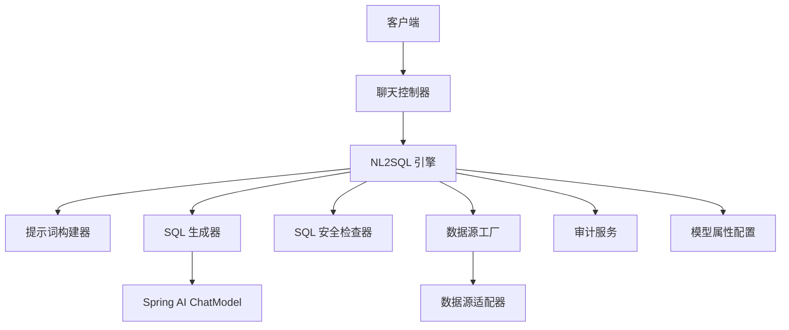
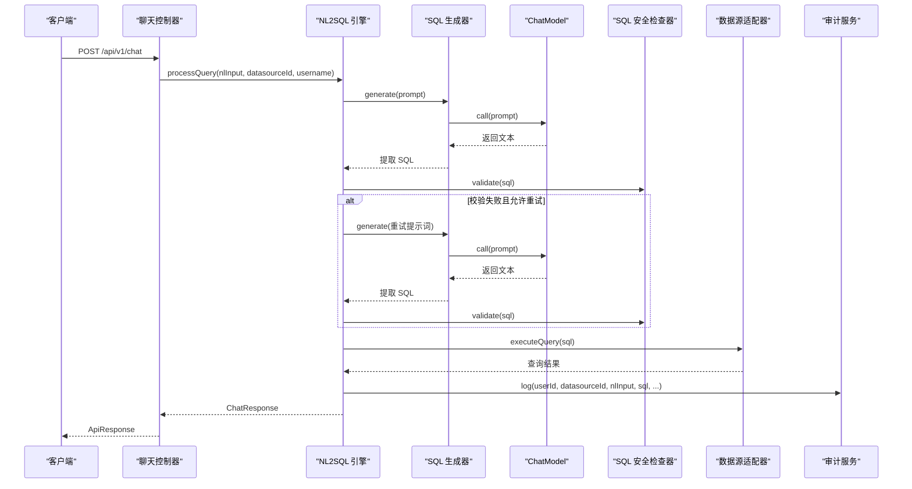
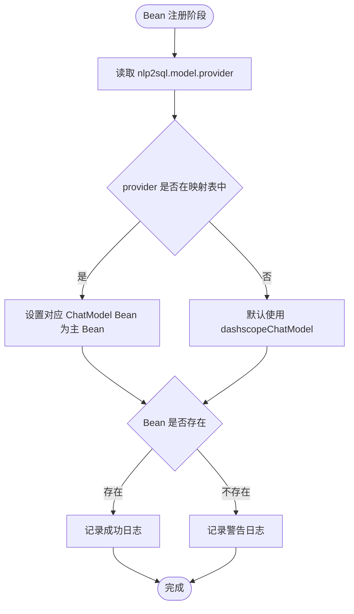
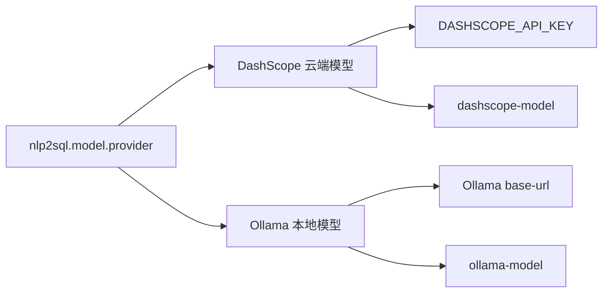
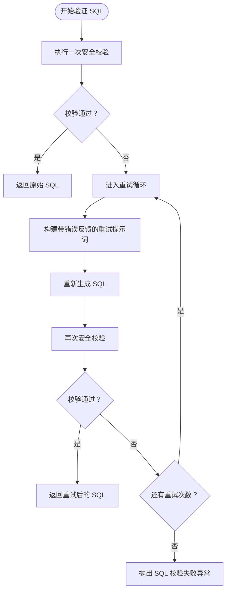
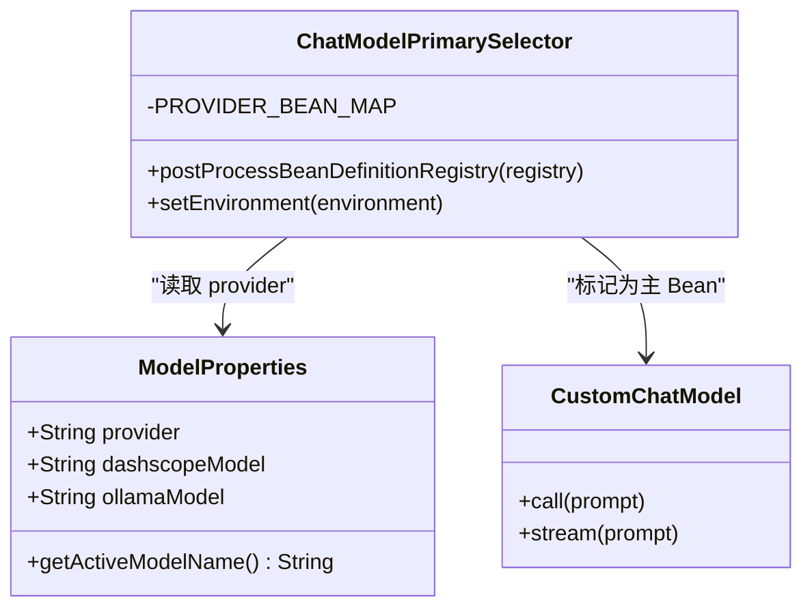

# 模型集成

<cite>
**本文引用的文件**   
- [ChatModelPrimarySelector.java](file://backend/src/main/java/com/nlp2sql/config/ChatModelPrimarySelector.java)
- [ModelProperties.java](file://backend/src/main/java/com/nlp2sql/config/ModelProperties.java)
- [application.yml](file://backend/src/main/resources/application.yml)
- [application-ollama.yml](file://backend/src/main/resources/application-ollama.yml)
- [NL2SQLEngine.java](file://backend/src/main/java/com/nlp2sql/service/NL2SQLEngine.java)
- [SQLGenerator.java](file://backend/src/main/java/com/nlp2sql/service/SQLGenerator.java)
- [ChatController.java](file://backend/src/main/java/com/nlp2sql/controller/ChatController.java)
- [technical_proposal.md](file://docs/technical_proposal.md)
</cite>

## 目录
1. [引言](#引言)
2. [项目结构与模型集成范围](#项目结构与模型集成范围)
3. [核心组件总览](#核心组件总览)
4. [架构总览与调用链](#架构总览与调用链)
5. [ChatModelPrimarySelector 多模型选择策略](#chatmodelprimaryselector-多模型选择策略)
6. [Ollama 与 DashScope 配置差异](#ollama-与-dashscope-配置差异)
7. [重试、超时与错误恢复机制](#重试超时与错误恢复机制)
8. [自定义模型适配器开发指南](#自定义模型适配器开发指南)
9. [性能监控与成本优化](#性能监控与成本优化)
10. [配置示例与最佳实践](#配置示例与最佳实践)
11. [故障排查指南](#故障排查指南)
12. [结论](#结论)

## 引言
本文面向 NL2SQL 系统的模型集成部分，重点说明：
- ChatModelPrimarySelector 如何根据配置动态选择一个主 ChatModel Bean。
- Ollama 本地模型与 DashScope 云端模型的配置差异与切换方式。
- SQL 生成链路中的重试、校验与错误恢复。
- 如何扩展新的模型适配层，以及当前系统已有的模型能力边界。
- 如何在现有架构下实现模型性能监控与成本优化。

本说明基于后端 Spring Boot 工程中的配置类、服务类与控制器代码，并结合技术方案文档进行解读。

## 项目结构与模型集成范围
NL2SQL 后端采用分层结构：
- Controller 接收自然语言查询。
- Service 层负责 Schema 获取、Prompt 构建、SQL 生成、安全校验、执行与审计。
- ModelProperties 管理模型提供者与模型名称。
- ChatModelPrimarySelector 在 Spring 容器启动阶段决定哪个 ChatModel Bean 成为主 Bean。
- SQLGenerator 通过 Spring AI 的 ChatModel 接口调用底层模型。
- application.yml 与 application-ollama.yml 控制数据源、Redis、Spring AI、SQL 安全与模型选择等全局配置。

**图表来源**
- [ChatController.java:1-30](file://backend/src/main/java/com/nlp2sql/controller/ChatController.java#L1-L30)
- [NL2SQLEngine.java:1-127](file://backend/src/main/java/com/nlp2sql/service/NL2SQLEngine.java#L1-L127)
- [SQLGenerator.java:1-73](file://backend/src/main/java/com/nlp2sql/service/SQLGenerator.java#L1-L73)
- [ModelProperties.java:1-19](file://backend/src/main/java/com/nlp2sql/config/ModelProperties.java#L1-L19)

**章节来源**
- [technical_proposal.md:1-128](file://docs/technical_proposal.md#L1-L128)
- [application.yml:1-117](file://backend/src/main/resources/application.yml#L1-L117)

## 核心组件总览
- ChatModelPrimarySelector：根据 nlp2sql.model.provider 选择 dashscopeChatModel 或 ollamaChatModel 作为主 ChatModel Bean。
- ModelProperties：集中管理 model.provider、dashscope-model、ollama-model，并提供 activeModelName。
- SQLGenerator：封装 Spring AI ChatModel 调用，解析返回文本为 SQL。
- NL2SQLEngine：串联 Prompt、SQL 生成、校验、执行、审计；包含 SQL 校验失败后的重试逻辑。
- ChatController：对外暴露 /api/v1/chat 接口。
- application.yml：定义数据库、Redis、Spring AI、SQL 安全、模型选择等配置。
- application-ollama.yml：排除 DashScope 自动配置，避免仅使用 Ollama 时因缺少 API Key 启动失败。

**章节来源**
- [ChatModelPrimarySelector.java:1-57](file://backend/src/main/java/com/nlp2sql/config/ChatModelPrimarySelector.java#L1-L57)
- [ModelProperties.java:1-19](file://backend/src/main/java/com/nlp2sql/config/ModelProperties.java#L1-L19)
- [SQLGenerator.java:1-73](file://backend/src/main/java/com/nlp2sql/service/SQLGenerator.java#L1-L73)
- [NL2SQLEngine.java:1-127](file://backend/src/main/java/com/nlp2sql/service/NL2SQLEngine.java#L1-L127)
- [ChatController.java:1-30](file://backend/src/main/java/com/nlp2sql/controller/ChatController.java#L1-L30)
- [application.yml:1-117](file://backend/src/main/resources/application.yml#L1-L117)
- [application-ollama.yml:1-12](file://backend/src/main/resources/application-ollama.yml#L1-L12)

## 架构总览与调用链
NL2SQL 的核心调用链如下：
1. 前端调用 /api/v1/chat。
2. ChatController 解析请求并调用 NL2SQLEngine.processQuery。
3. NL2SQLEngine 获取数据源元数据，构建 Prompt。
4. SQLGenerator 调用 ChatModel 生成 SQL。
5. NL2SQLEngine 对 SQL 做安全校验，必要时重试。
6. 通过数据源适配器执行 SQL，得到结果。
7. 记录审计日志并返回结果。

**图表来源**
- [ChatController.java:1-30](file://backend/src/main/java/com/nlp2sql/controller/ChatController.java#L1-L30)
- [NL2SQLEngine.java:1-127](file://backend/src/main/java/com/nlp2sql/service/NL2SQLEngine.java#L1-L127)
- [SQLGenerator.java:1-73](file://backend/src/main/java/com/nlp2sql/service/SQLGenerator.java#L1-L73)

**章节来源**
- [ChatController.java:1-30](file://backend/src/main/java/com/nlp2sql/controller/ChatController.java#L1-L30)
- [NL2SQLEngine.java:1-127](file://backend/src/main/java/com/nlp2sql/service/NL2SQLEngine.java#L1-L127)
- [SQLGenerator.java:1-73](file://backend/src/main/java/com/nlp2sql/service/SQLGenerator.java#L1-L73)

## ChatModelPrimarySelector 多模型选择策略
ChatModelPrimarySelector 是模型集成的关键入口。它实现了两个 Spring 扩展点：
- EnvironmentAware：读取环境变量。
- BeanDefinitionRegistryPostProcessor：在 Spring 容器注册 Bean 定义后，根据配置将对应 ChatModel Bean 标记为 @Primary。

核心策略：
- provider 映射表将字符串 provider 映射到具体 Bean 名称：
  - dashscope → dashscopeChatModel
  - ollama → ollamaChatModel
- 如果未识别 provider，则默认选择 dashscopeChatModel 并输出警告日志。
- 如果目标 Bean 不存在，则输出警告日志，提示检查对应 provider 的配置是否完整。

该设计解决了同时存在多个 ChatModel 实现时的 Bean 冲突问题，并通过外部配置集中控制“主模型”。

**图表来源**
- [ChatModelPrimarySelector.java:1-57](file://backend/src/main/java/com/nlp2sql/config/ChatModelPrimarySelector.java#L1-L57)

**章节来源**
- [ChatModelPrimarySelector.java:1-57](file://backend/src/main/java/com/nlp2sql/config/ChatModelPrimarySelector.java#L1-L57)

## Ollama 与 DashScope 配置差异
### 共同点
- 两者都通过 Spring AI 的 ChatModel 抽象接入。
- 模型名由 ModelProperties 统一管理，activeModelName 根据 provider 动态选择。
- 应用默认 profile 设置为 dashscope，但可通过 profile 切换。

### DashScope（通义千问云端）
- 需要设置 DASHSCOPE_API_KEY 环境变量。
- application.yml 中 spring.ai.dashscope.api-key 从环境变量读取。
- spring.ai.dashscope.chat.options.model 使用 nlp2sql.model.dashscope-model。
- temperature 设置为 0，用于稳定生成 SQL。

### Ollama（本地模型）
- base-url 指向本地 Ollama 服务地址。
- spring.ai.ollama.chat.options.model 使用 nlp2sql.model.ollama-model。
- 额外支持 num-ctx 上下文长度参数。
- application-ollama.yml 会排除 DashScope 相关自动配置，避免无 API Key 时启动失败。

### 切换方式
- 修改 application.yml 中 nlp2sql.model.provider 为 dashscope 或 ollama。
- 或者激活不同 profile，并在环境变量中提供相应密钥或本地服务地址。

**图表来源**
- [application.yml:1-117](file://backend/src/main/resources/application.yml#L1-L117)
- [application-ollama.yml:1-12](file://backend/src/main/resources/application-ollama.yml#L1-L12)
- [ModelProperties.java:1-19](file://backend/src/main/java/com/nlp2sql/config/ModelProperties.java#L1-L19)

**章节来源**
- [application.yml:1-117](file://backend/src/main/resources/application.yml#L1-L117)
- [application-ollama.yml:1-12](file://backend/src/main/resources/application-ollama.yml#L1-L12)
- [ModelProperties.java:1-19](file://backend/src/main/java/com/nlp2sql/config/ModelProperties.java#L1-L19)

## 重试、超时与错误恢复机制
### SQL 生成与校验重试
NL2SQLEngine 中的 validateWithRetry 方法实现 SQL 校验失败后的重试：
- 首次调用 SQL 安全检查器。
- 若校验失败，则循环最多 maxRetry 次，每次重新构建带错误反馈的提示词，再次生成 SQL 并校验。
- 所有重试仍失败时抛出业务异常，表示 SQL 校验失败。

该重试属于“语义级重试”，即通过更详细的错误信息引导模型生成更安全的 SQL，而不是网络层面的自动重试。

**图表来源**
- [NL2SQLEngine.java:1-127](file://backend/src/main/java/com/nlp2sql/service/NL2SQLEngine.java#L1-L127)

### 超时处理
当前仓库中没有发现针对 ChatModel 调用的显式超时配置：
- application.yml 中有数据库连接超时和 Redis 连接池配置。
- sql-security.query-timeout-seconds 出现在配置项中，但 NL2SQLEngine 当前只读取了 max-limit 与 max-retry。
- SQLGenerator 直接调用 chatModel.call，没有包装超时或降级逻辑。

因此，当前系统的“超时”主要体现在数据库侧和可能的 Spring AI 底层实现；模型调用本身的超时并未在本工程中显式控制。

### 错误恢复机制
- 业务异常：如找不到 Schema、SQL 生成失败、SQL 执行失败，会被转换为统一业务异常。
- 系统异常：非预期异常被捕获后记录日志，并转为系统错误。
- 审计记录：无论成功或失败，finally 块都会记录审计日志，便于后续追踪。
- SQL 生成失败判断：如果模型返回空或包含无法理解提示，会直接抛出业务异常，不进入执行流程。

**章节来源**
- [NL2SQLEngine.java:1-127](file://backend/src/main/java/com/nlp2sql/service/NL2SQLEngine.java#L1-L127)
- [SQLGenerator.java:1-73](file://backend/src/main/java/com/nlp2sql/service/SQLGenerator.java#L1-L73)
- [application.yml:1-117](file://backend/src/main/resources/application.yml#L1-L117)

## 自定义模型适配器开发指南
这里的“模型适配器”可从两个层面理解：

### 1. 模型提供方适配器（ChatModel 抽象）
当前系统通过 Spring AI 的 ChatModel 接口访问模型。若要在不修改 NL2SQLEngine 的前提下接入新模型提供方，建议：
- 创建一个自定义 ChatModel Bean，例如 customChatModel。
- 在 ChatModelPrimarySelector 的 provider 映射中添加新 provider 名称，并映射到该 Bean 名称。
- 在 application.yml 中新增对应 provider 的 Spring AI 配置项。
- 如需排除某些自动配置，可参考 application-ollama.yml 的模式，新建 profile 配置文件。

**图表来源**
- [ChatModelPrimarySelector.java:1-57](file://backend/src/main/java/com/nlp2sql/config/ChatModelPrimarySelector.java#L1-L57)
- [ModelProperties.java:1-19](file://backend/src/main/java/com/nlp2sql/config/ModelProperties.java#L1-L19)

### 2. 数据源适配器（已存在的 Adapter 模式）
项目中已有 BaseDataSourceAdapter、MySQLAdapter 与 DataSourceFactory，用于对接不同数据库。虽然这不是“模型适配器”，但它是扩展新数据源的参考模式：
- 继承基类实现特定方言和执行逻辑。
- 通过工厂创建或获取适配器实例。
- 新增数据源类型时，扩展工厂和配置。

如果要扩展“模型提供方”，应优先复用 ChatModel 抽象；如果要扩展“数据源”，则复用 Adapter 模式。

**章节来源**
- [ChatModelPrimarySelector.java:1-57](file://backend/src/main/java/com/nlp2sql/config/ChatModelPrimarySelector.java#L1-L57)
- [ModelProperties.java:1-19](file://backend/src/main/java/com/nlp2sql/config/ModelProperties.java#L1-L19)
- [application.yml:1-117](file://backend/src/main/resources/application.yml#L1-L117)
- [application-ollama.yml:1-12](file://backend/src/main/resources/application-ollama.yml#L1-L12)

## 性能监控与成本优化
### 性能监控
当前系统具备的基础监控点：
- 审计日志：记录用户、数据源、自然语言输入、生成的 SQL、校验状态、执行状态、行数、耗时与错误信息。
- 日志级别：com.nlp2sql 使用 DEBUG，便于调试模型调用链路。
- 执行耗时：ChatResponse 中包含 executionTimeMs，可用于统计端到端延迟。

可进一步增强：
- 在 SQLGenerator.generate 中增加单次模型调用耗时统计。
- 在 ChatModelPrimarySelector 中标记实际使用的 provider 与模型名，便于按 provider 维度分析性能。
- 将审计日志写入可查询系统，并按 provider、model、datasource、success/failure 维度聚合。

### 成本优化
- 使用 ModelProperties.getActiveModelName 返回当前活动模型名，结合审计日志可按模型统计调用量。
- 对频繁重复查询可使用 Schema 缓存（schema-cache.ttl-seconds），减少重复元数据加载。
- 限制查询结果行数（max-limit），降低下游处理和传输成本。
- 对高成本云端模型（如 DashScope）可设置更低温度、更严格提示词，减少无效生成。
- 对于本地模型（Ollama），可通过调整 num-ctx 和模型大小平衡性能与资源占用。

**章节来源**
- [NL2SQLEngine.java:1-127](file://backend/src/main/java/com/nlp2sql/service/NL2SQLEngine.java#L1-L127)
- [ModelProperties.java:1-19](file://backend/src/main/java/com/nlp2sql/config/ModelProperties.java#L1-L19)
- [application.yml:1-117](file://backend/src/main/resources/application.yml#L1-L117)

## 配置示例与最佳实践
### 使用 DashScope
- 设置环境变量 DASHSCOPE_API_KEY。
- 保持 profiles.active 为 dashscope，或显式指定 spring.profiles.active=dashscope。
- 设置 nlp2sql.model.provider=dashscope。
- 设置 nlp2sql.model.dashscope-model 为所需模型，如 qwen-plus。

### 使用 Ollama
- 确保本地运行 Ollama 服务。
- 设置 nlp2sql.model.provider=ollama。
- 设置 nlp2sql.model.ollama-model 为本地模型名，如 qwen2.5-coder:7b。
- 使用 application-ollama.yml 排除 DashScope 自动配置，避免无 API Key 启动失败。

### SQL 安全与重试
- sql-security.max-retry 控制 SQL 校验失败后的重试次数。
- sql-security.max-limit 控制最大返回行数。
- prompt.version 控制提示词模板版本。

**章节来源**
- [application.yml:1-117](file://backend/src/main/resources/application.yml#L1-L117)
- [application-ollama.yml:1-12](file://backend/src/main/resources/application-ollama.yml#L1-L12)
- [NL2SQLEngine.java:1-127](file://backend/src/main/java/com/nlp2sql/service/NL2SQLEngine.java#L1-L127)

## 故障排查指南
### 无法确定主 ChatModel
现象：
- 启动时报 Bean 冲突，或 ChatModel 注入不符合预期。

排查步骤：
- 检查 nlp2sql.model.provider 是否为 dashscope 或 ollama。
- 确认对应的 ChatModel Bean 是否存在。
- 查看 ChatModelPrimarySelector 的日志，确认是否选择了预期的 Bean。

**章节来源**
- [ChatModelPrimarySelector.java:1-57](file://backend/src/main/java/com/nlp2sql/config/ChatModelPrimarySelector.java#L1-L57)

### DashScope 启动失败
现象：
- 未设置 DASHSCOPE_API_KEY 时使用 dashscope profile 启动失败。

排查步骤：
- 检查环境变量 DASHSCOPE_API_KEY。
- 如果只想用 Ollama，请切换到 ollama profile，或使用 application-ollama.yml 排除 DashScope 自动配置。

**章节来源**
- [application.yml:1-117](file://backend/src/main/resources/application.yml#L1-L117)
- [application-ollama.yml:1-12](file://backend/src/main/resources/application-ollama.yml#L1-L12)

### 模型返回无法理解或生成空 SQL
现象：
- NL2SQLEngine 抛出 SQL 生成失败或无法理解查询。

排查步骤：
- 检查提示词版本是否正确。
- 检查数据源 Schema 是否成功加载。
- 调整用户问题表述，使其更接近结构化查询意图。
- 提高 nlp2sql.model.dashscope-model 或更换更强的模型。

**章节来源**
- [NL2SQLEngine.java:1-127](file://backend/src/main/java/com/nlp2sql/service/NL2SQLEngine.java#L1-L127)

### SQL 校验反复失败
现象：
- 多次重试后仍抛 SQL 校验失败。

排查步骤：
- 检查 SQL 安全检查规则是否过于严格。
- 查看审计日志中的 validationPassed 与 errorMessage。
- 调整提示词模板，使模型更容易生成符合规则的 SQL。
- 适当增加 sql-security.max-retry，但不宜过大以免掩盖提示词问题。

**章节来源**
- [NL2SQLEngine.java:1-127](file://backend/src/main/java/com/nlp2sql/service/NL2SQLEngine.java#L1-L127)

### 模型调用超时
现象：
- 前端请求长时间无响应。

排查步骤：
- 检查 Spring AI 底层 ChatModel 实现是否配置超时。
- 检查 Ollama 服务是否正常运行。
- 检查 DashScope API Key 和网络连通性。
- 在当前工程中未发现 ChatModel 显式超时，需结合运行时框架与网络栈排查。

**章节来源**
- [SQLGenerator.java:1-73](file://backend/src/main/java/com/nlp2sql/service/SQLGenerator.java#L1-L73)
- [application.yml:1-117](file://backend/src/main/resources/application.yml#L1-L117)

## 结论
本项目的模型集成以 Spring AI 的 ChatModel 抽象为核心，通过 ChatModelPrimarySelector 实现 provider 级别的动态主 Bean 选择，从而在同一应用中灵活切换 Ollama 与 DashScope。SQL 生成链路中内置了语义级重试机制，配合审计日志可实现基础的可观测性。当前工程尚未对模型调用本身实现显式超时、熔断或多模型负载均衡；若需要这些能力，可在 SQLGenerator 层或 ChatModel 适配层扩展。通过 ModelProperties 与配置中心化管理，系统在模型名、provider、提示词版本等方面具备良好的可扩展性。