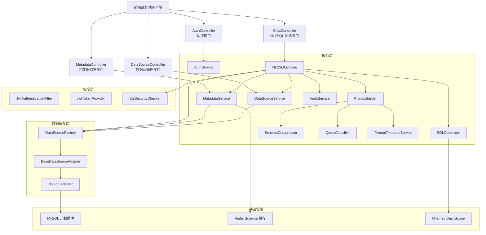
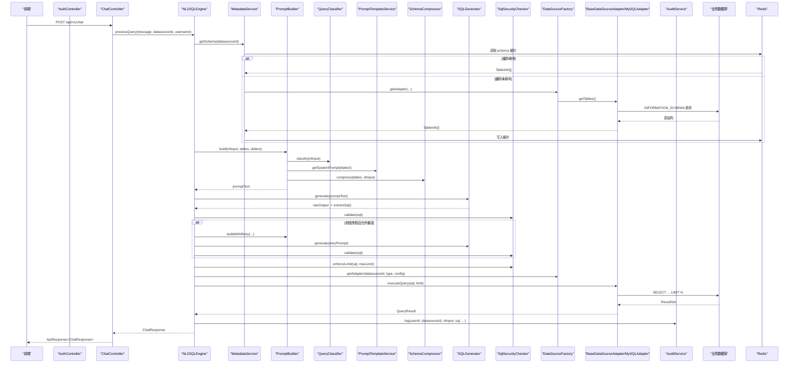
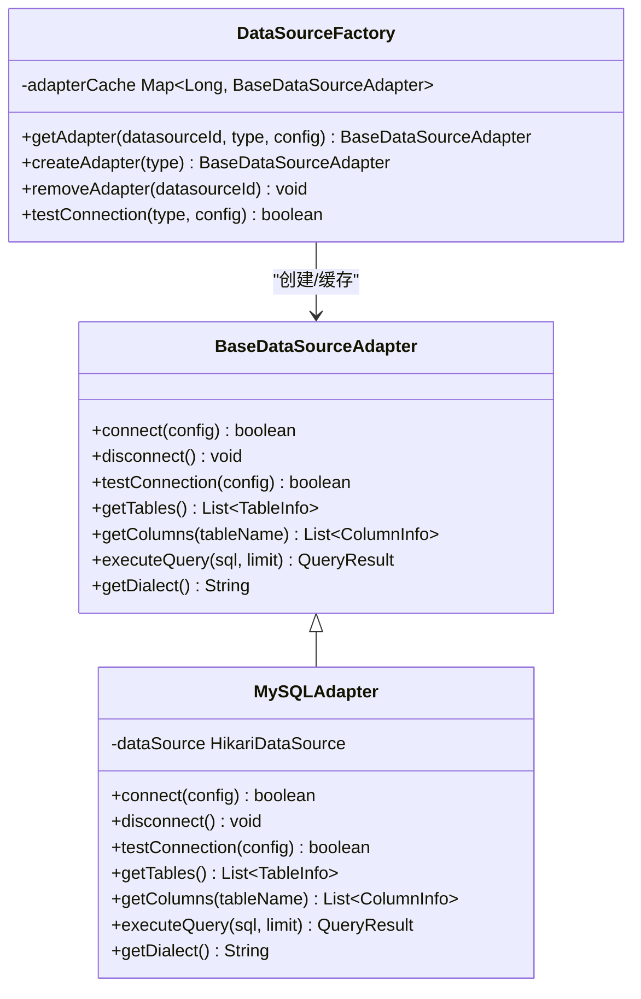
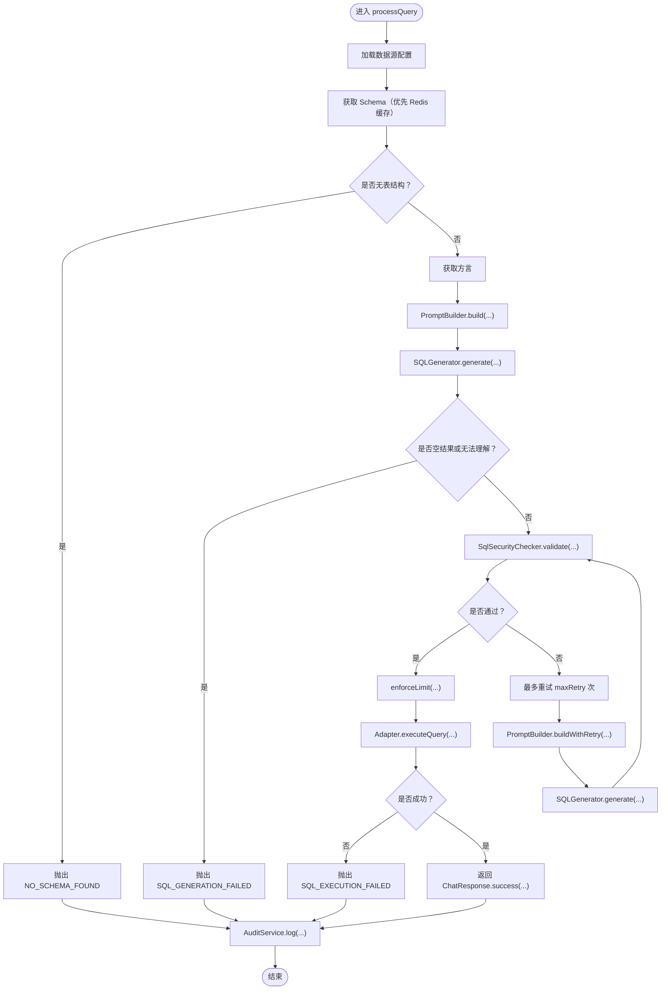
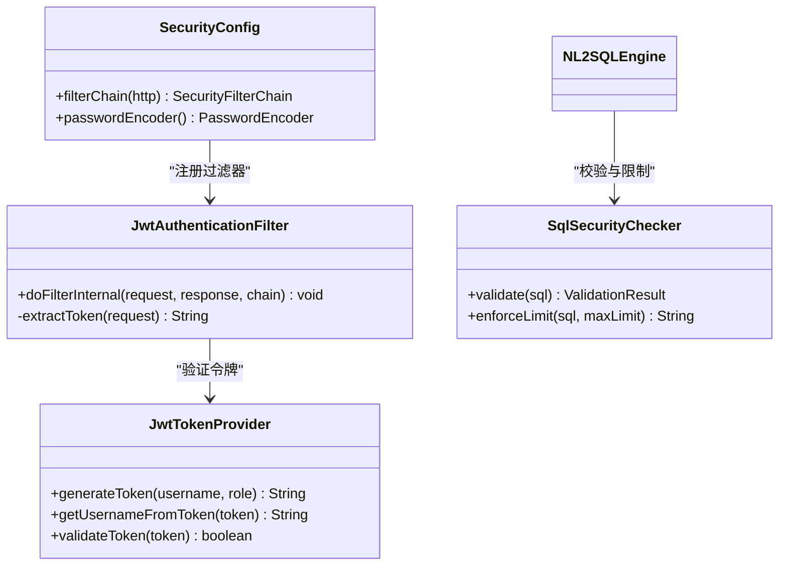
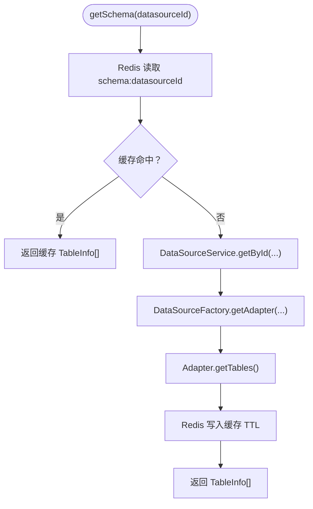
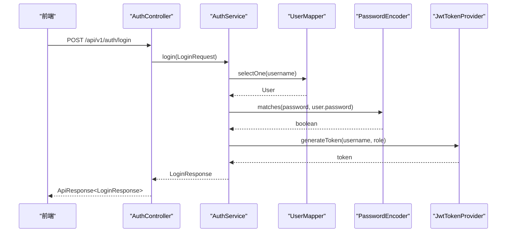

# 后端开发指南

<cite>
**本文引用的文件**   
- [pom.xml](file://backend/pom.xml)
- [Nlp2SqlApplication.java](file://backend/src/main/java/com/nlp2sql/Nlp2SqlApplication.java)
- [application.yml](file://backend/src/main/resources/application.yml)
- [application-ollama.yml](file://backend/src/main/resources/application-ollama.yml)
- [BaseDataSourceAdapter.java](file://backend/src/main/java/com/nlp2sql/adapter/BaseDataSourceAdapter.java)
- [MySQLAdapter.java](file://backend/src/main/java/com/nlp2sql/adapter/MySQLAdapter.java)
- [DataSourceFactory.java](file://backend/src/main/java/com/nlp2sql/adapter/DataSourceFactory.java)
- [MyBatisPlusConfig.java](file://backend/src/main/java/com/nlp2sql/config/MyBatisPlusConfig.java)
- [RedisConfig.java](file://backend/src/main/java/com/nlp2sql/config/RedisConfig.java)
- [SecurityConfig.java](file://backend/src/main/java/com/nlp2sql/config/SecurityConfig.java)
- [ChatModelPrimarySelector.java](file://backend/src/main/java/com/nlp2sql/config/ChatModelPrimarySelector.java)
- [ModelProperties.java](file://backend/src/main/java/com/nlp2sql/config/ModelProperties.java)
- [GlobalExceptionHandler.java](file://backend/src/main/java/com/nlp2sql/config/GlobalExceptionHandler.java)
- [WebConfig.java](file://backend/src/main/java/com/nlp2sql/config/WebConfig.java)
- [AuthController.java](file://backend/src/main/java/com/nlp2sql/controller/AuthController.java)
- [ChatController.java](file://backend/src/main/java/com/nlp2sql/controller/ChatController.java)
- [DataSourceController.java](file://backend/src/main/java/com/nlp2sql/controller/DataSourceController.java)
- [MetadataController.java](file://backend/src/main/java/com/nlp2sql/controller/MetadataController.java)
- [JwtAuthenticationFilter.java](file://backend/src/main/java/com/nlp2sql/security/JwtAuthenticationFilter.java)
- [JwtTokenProvider.java](file://backend/src/main/java/com/nlp2sql/security/JwtTokenProvider.java)
- [SqlSecurityChecker.java](file://backend/src/main/java/com/nlp2sql/security/SqlSecurityChecker.java)
- [AuthService.java](file://backend/src/main/java/com/nlp2sql/service/AuthService.java)
- [NL2SQLEngine.java](file://backend/src/main/java/com/nlp2sql/service/NL2SQLEngine.java)
- [PromptBuilder.java](file://backend/src/main/java/com/nlp2sql/service/PromptBuilder.java)
- [PromptTemplateService.java](file://backend/src/main/java/com/nlp2sql/service/PromptTemplateService.java)
- [QueryClassifier.java](file://backend/src/src/main/java/com/nlp2sql/service/QueryClassifier.java)
- [SQLGenerator.java](file://backend/src/main/java/com/nlp2sql/service/SQLGenerator.java)
- [MetadataService.java](file://backend/src/main/java/com/nlp2sql/service/MetadataService.java)
- [DataSourceService.java](file://backend/src/main/java/com/nlp2sql/service/DataSourceService.java)
- [AuditService.java](file://backend/src/main/java/com/nlp2sql/service/AuditService.java)
- [SchemaCompressor.java](file://backend/src/main/java/com/nlp2sql/service/SchemaCompressor.java)
- [BusinessException.java](file://backend/src/main/java/com/nlp2sql/common/BusinessException.java)
- [ErrorCode.java](file://backend/src/main/java/com/nlp2sql/common/ErrorCode.java)
- [TraceIdFilter.java](file://backend/src/main/java/com/nlp2sql/common/TraceIdFilter.java)
- [User.java](file://backend/src/main/java/com/nlp2sql/model/User.java)
- [DataSource.java](file://backend/src/main/java/com/nlp2sql/model/DataSource.java)
- [AuditLog.java](file://backend/src/main/java/com/nlp2sql/model/AuditLog.java)
- [TableInfo.java](file://backend/src/main/java/com/nlp2sql/model/TableInfo.java)
- [ColumnInfo.java](file://backend/src/main/java/com/nlp2sql/model/ColumnInfo.java)
- [ApiResponse.java](file://backend/src/main/java/com/nlp2sql/model/dto/ApiResponse.java)
- [ChatRequest.java](file://backend/src/main/java/com/nlp2sql/model/dto/ChatRequest.java)
- [ChatResponse.java](file://backend/src/main/java/com/nlp2sql/model/dto/ChatResponse.java)
- [LoginRequest.java](file://backend/src/main/java/com/nlp2sql/model/dto/LoginRequest.java)
- [LoginResponse.java](file://backend/src/main/java/com/nlp2sql/model/dto/LoginResponse.java)
- [DataSourceDTO.java](file://backend/src/main/java/com/nlp2sql/model/dto/DataSourceDTO.java)
- [QueryResult.java](file://backend/src/main/java/com/nlp2sql/model/dto/QueryResult.java)
- [DataSourceVO.java](file://backend/src/main/java/com/nlp2sql/model/vo/DataSourceVO.java)
- [technical_proposal.md](file://docs/technical_proposal.md)
- [user_manual.md](file://docs/user_manual.md)
- [test_report.md](file://docs/test_report.md)
</cite>

## 目录
1. [简介](#简介)
2. [项目结构](#项目结构)
3. [核心组件](#核心组件)
4. [架构总览](#架构总览)
5. [详细组件分析](#详细组件分析)
6. [依赖与构建](#依赖与构建)
7. [开发规范与扩展方法](#开发规范与扩展方法)
8. [单元测试编写指南](#单元测试编写指南)
9. [性能优化与安全加固](#性能优化与安全加固)
10. [常见问题排查](#常见问题排查)
11. [结论](#结论)

## 简介
本指南面向有经验的 Java 开发者，系统性说明 NL2SQL 智能查询系统后端（Spring Boot）的架构、模块职责、实现原理、扩展方式以及开发与运维最佳实践。项目通过自然语言生成 SQL，结合多层安全校验、元数据缓存和多数据源适配器，提供稳定可控的只读查询能力；同时支持 Ollama 本地模型与 DashScope 云端模型的灵活切换。

## 项目结构
后端采用分层架构：控制器暴露 REST API，服务层编排 NL2SQL 流程，适配器对接不同数据库，安全组件负责认证与 SQL 安全检查，配置类集中管理基础设施行为。

**图示来源** 
- [AuthController.java:1-31](file://backend/src/main/java/com/nlp2sql/controller/AuthController.java#L1-L31)
- [ChatController.java:1-30](file://backend/src/main/java/com/nlp2sql/controller/ChatController.java#L1-L30)
- [DataSourceController.java:1-50](file://backend/src/main/java/com/nlp2sql/controller/DataSourceController.java#L1-L50)
- [MetadataController.java:1-38](file://backend/src/main/java/com/nlp2sql/controller/MetadataController.java#L1-L38)
- [NL2SQLEngine.java:1-127](file://backend/src/main/java/com/nlp2sql/service/NL2SQLEngine.java#L1-L127)
- [PromptBuilder.java:1-73](file://backend/src/main/java/com/nlp2sql/service/PromptBuilder.java#L1-L73)
- [SQLGenerator.java:1-73](file://backend/src/main/java/com/nlp2sql/service/SQLGenerator.java#L1-L73)
- [MetadataService.java:1-93](file://backend/src/main/java/com/nlp2sql/service/MetadataService.java#L1-L93)
- [DataSourceService.java:1-95](file://backend/src/main/java/com/nlp2sql/service/DataSourceService.java#L1-L95)
- [AuditService.java:1-31](file://backend/src/main/java/com/nlp2sql/service/AuditService.java#L1-L31)
- [SchemaCompressor.java:1-162](file://backend/src/main/java/com/nlp2sql/service/SchemaCompressor.java#L1-L162)
- [QueryClassifier.java:1-55](file://backend/src/main/java/com/nlp2sql/service/QueryClassifier.java#L1-L55)
- [PromptTemplateService.java:1-98](file://backend/src/main/java/com/nlp2sql/service/PromptTemplateService.java#L1-L98)
- [JwtAuthenticationFilter.java:1-51](file://backend/src/main/java/com/nlp2sql/security/JwtAuthenticationFilter.java#L1-L51)
- [JwtTokenProvider.java:1-55](file://backend/src/main/java/com/nlp2sql/security/JwtTokenProvider.java#L1-L55)
- [SqlSecurityChecker.java:1-88](file://backend/src/main/java/com/nlp2sql/security/SqlSecurityChecker.java#L1-L88)
- [BaseDataSourceAdapter.java:1-25](file://backend/src/main/java/com/nlp2sql/adapter/BaseDataSourceAdapter.java#L1-L25)
- [MySQLAdapter.java:1-203](file://backend/src/main/java/com/nlp2sql/adapter/MySQLAdapter.java#L1-L203)
- [DataSourceFactory.java:1-49](file://backend/src/main/java/com/nlp2sql/adapter/DataSourceFactory.java#L1-L49)

**章节来源**
- [technical_proposal.md:1-128](file://docs/technical_proposal.md#L1-L128)
- [user_manual.md:1-136](file://docs/user_manual.md#L1-L136)

## 核心组件
- 应用入口：启用异步，启动 Spring Boot 应用。
- 配置中心：MyBatis-Plus、Redis、Spring Security、跨域、全局异常、模型选择器、模型属性。
- 控制器：认证、对话、数据源管理、元数据浏览。
- 安全：JWT 过滤器与令牌提供者、SQL 安全校验。
- 服务：认证、NL2SQL 引擎、提示词构建、SQL 生成、元数据、数据源、审计、Schema 压缩、查询分类、提示词模板。
- 适配器：抽象基类、MySQL 实现、工厂。
- 模型：用户、数据源、审计日志、表/字段信息、请求响应 DTO、视图对象 VO。

**章节来源**
- [Nlp2SqlApplication.java:1-14](file://backend/src/main/java/com/nlp2sql/Nlp2SqlApplication.java#L1-L14)
- [MyBatisPlusConfig.java:1-38](file://backend/src/main/java/com/nlp2sql/config/MyBatisPlusConfig.java#L1-L38)
- [RedisConfig.java:1-24](file://backend/src/main/java/com/nlp2sql/config/RedisConfig.java#L1-L24)
- [SecurityConfig.java:1-44](file://backend/src/main/java/com/nlp2sql/config/SecurityConfig.java#L1-L44)
- [GlobalExceptionHandler.java:1-50](file://backend/src/main/java/com/nlp2sql/config/GlobalExceptionHandler.java#L1-L50)
- [WebConfig.java:1-26](file://backend/src/main/java/com/nlp2sql/config/WebConfig.java#L1-L26)
- [ChatModelPrimarySelector.java:1-57](file://backend/src/main/java/com/nlp2sql/config/ChatModelPrimarySelector.java#L1-L57)
- [ModelProperties.java:1-19](file://backend/src/main/java/com/nlp2sql/config/ModelProperties.java#L1-L19)

## 架构总览
NL2SQL 的核心调用链从 ChatController 开始，经过 NL2SQLEngine 编排 Schema 获取、提示词构建、SQL 生成、安全校验、执行查询和审计记录；认证由 JwtAuthenticationFilter 前置校验，SQL 安全由 SqlSecurityChecker 进行关键词黑名单、AST 解析与注入检测；元数据通过 MetadataService 使用 Redis 缓存；多数据源通过 DataSourceFactory 与 BaseDataSourceAdapter/MySQLAdapter 接入。

**图示来源**
- [ChatController.java:1-30](file://backend/src/main/java/com/nlp2sql/controller/ChatController.java#L1-L30)
- [NL2SQLEngine.java:1-127](file://backend/src/main/java/com/nlp2sql/service/NL2SQLEngine.java#L1-L127)
- [MetadataService.java:1-93](file://backend/src/main/java/com/nlp2sql/service/MetadataService.java#L1-L93)
- [PromptBuilder.java:1-73](file://backend/src/main/java/com/nlp2sql/service/PromptBuilder.java#L1-L73)
- [QueryClassifier.java:1-55](file://backend/src/main/java/com/nlp2sql/service/QueryClassifier.java#L1-L55)
- [PromptTemplateService.java:1-98](file://backend/src/main/java/com/nlp2sql/service/PromptTemplateService.java#L1-L98)
- [SchemaCompressor.java:1-162](file://backend/src/main/java/com/nlp2sql/service/SchemaCompressor.java#L1-L162)
- [SQLGenerator.java:1-73](file://backend/src/main/java/com/nlp2sql/service/SQLGenerator.java#L1-L73)
- [SqlSecurityChecker.java:1-88](file://backend/src/main/java/com/nlp2sql/security/SqlSecurityChecker.java#L1-L88)
- [DataSourceFactory.java:1-49](file://backend/src/main/java/com/nlp2sql/adapter/DataSourceFactory.java#L1-L49)
- [MySQLAdapter.java:1-203](file://backend/src/main/java/com/nlp2sql/adapter/MySQLAdapter.java#L1-L203)
- [AuditService.java:1-31](file://backend/src/main/java/com/nlp2sql/service/AuditService.java#L1-L31)

## 详细组件分析

### 适配器层与多数据源扩展
适配器层基于策略模式定义统一接口，当前实现 MySQLAdapter，并通过 DataSourceFactory 管理实例与连接池。

**图示来源**
- [BaseDataSourceAdapter.java:1-25](file://backend/src/main/java/com/nlp2sql/adapter/BaseDataSourceAdapter.java#L1-L25)
- [MySQLAdapter.java:1-203](file://backend/src/main/java/com/nlp2sql/adapter/MySQLAdapter.java#L1-L203)
- [DataSourceFactory.java:1-49](file://backend/src/main/java/com/nlp2sql/adapter/DataSourceFactory.java#L1-L49)

扩展新数据源步骤：
1. 新建实现 BaseDataSourceAdapter 的具体适配器类。
2. 在 DataSourceFactory.createAdapter 中新增分支注册。
3. 在 DataSourceService.update/delete 时确保 adapter 缓存清理逻辑保持有效。
4. 如需新的连接参数，扩展 DataSource.toAdapterConfig 或 DTO/VO。

**章节来源**
- [BaseDataSourceAdapter.java:1-25](file://backend/src/main/java/com/nlp2sql/adapter/BaseDataSourceAdapter.java#L1-L25)
- [MySQLAdapter.java:1-203](file://backend/src/main/java/com/nlp2sql/adapter/MySQLAdapter.java#L1-L203)
- [DataSourceFactory.java:1-49](file://backend/src/main/java/com/nlp2sql/adapter/DataSourceFactory.java#L1-L49)
- [DataSourceService.java:1-95](file://backend/src/main/java/com/nlp2sql/service/DataSourceService.java#L1-L95)
- [DataSource.java:1-48](file://backend/src/main/java/com/nlp2sql/model/DataSource.java#L1-L48)

### NL2SQL 引擎与提示词工程
NL2SQLEngine 是核心编排器：获取 Schema、构建 Prompt、调用模型生成 SQL、安全校验、执行查询并记录审计。

**图示来源**
- [NL2SQLEngine.java:1-127](file://backend/src/main/java/com/nlp2sql/service/NL2SQLEngine.java#L1-L127)
- [PromptBuilder.java:1-73](file://backend/src/main/java/com/nlp2sql/service/PromptBuilder.java#L1-L73)
- [SQLGenerator.java:1-73](file://backend/src/main/java/com/nlp2sql/service/SQLGenerator.java#L1-L73)
- [SqlSecurityChecker.java:1-88](file://backend/src/main/java/com/nlp2sql/security/SqlSecurityChecker.java#L1-L88)
- [AuditService.java:1-31](file://backend/src/main/java/com/nlp2sql/service/AuditService.java#L1-L31)

提示词工程要点：
- PromptTemplateService 从外部 YAML 模板加载系统指令、重试反馈、关键词与 Few-shot 示例。
- QueryClassifier 按优先级匹配关键词确定查询类型，用于选择 Few-shot 示例。
- SchemaCompressor 对表结构进行三级压缩，控制 Token 预算，避免过长上下文。

**章节来源**
- [PromptTemplateService.java:1-98](file://backend/src/main/java/com/nlp2sql/service/PromptTemplateService.java#L1-L98)
- [QueryClassifier.java:1-55](file://backend/src/main/java/com/nlp2sql/service/QueryClassifier.java#L1-L55)
- [SchemaCompressor.java:1-162](file://backend/src/main/java/com/nlp2sql/service/SchemaCompressor.java#L1-L162)
- [PromptBuilder.java:1-73](file://backend/src/main/java/com/nlp2sql/service/PromptBuilder.java#L1-L73)

### 安全体系
- 认证：JwtAuthenticationFilter 从 Authorization 头提取 Bearer Token，JwtTokenProvider 生成/验证 JWT，SecurityConfig 禁用 CSRF、无状态会话、放行认证与文档接口。
- SQL 安全：SqlSecurityChecker 做关键词黑名单、AST 解析为 Select、堆叠查询/UNION 注入检测，并提供 enforceLimit 强制限制行数。

**图示来源**
- [JwtAuthenticationFilter.java:1-51](file://backend/src/main/java/com/nlp2sql/security/JwtAuthenticationFilter.java#L1-L51)
- [JwtTokenProvider.java:1-55](file://backend/src/main/java/com/nlp2sql/security/JwtTokenProvider.java#L1-L55)
- [SecurityConfig.java:1-44](file://backend/src/main/java/com/nlp2sql/config/SecurityConfig.java#L1-L44)
- [SqlSecurityChecker.java:1-88](file://backend/src/main/java/com/nlp2sql/security/SqlSecurityChecker.java#L1-L88)

**章节来源**
- [SecurityConfig.java:1-44](file://backend/src/main/java/com/nlp2sql/config/SecurityConfig.java#L1-L44)
- [JwtAuthenticationFilter.java:1-51](file://backend/src/main/java/com/nlp2sql/security/JwtAuthenticationFilter.java#L1-L51)
- [JwtTokenProvider.java:1-55](file://backend/src/main/java/com/nlp2sql/security/JwtTokenProvider.java#L1-L55)
- [SqlSecurityChecker.java:1-88](file://backend/src/main/java/com/nlp2sql/security/SqlSecurityChecker.java#L1-L88)

### 元数据与缓存
MetadataService 先从 Redis 读取 Schema 缓存，未命中则通过适配器拉取表结构并回填缓存；刷新接口会删除缓存并重建适配器。

**图示来源**
- [MetadataService.java:1-93](file://backend/src/main/java/com/nlp2sql/service/MetadataService.java#L1-L93)
- [DataSourceFactory.java:1-49](file://backend/src/main/java/com/nlp2sql/adapter/DataSourceFactory.java#L1-L49)
- [RedisConfig.java:1-24](file://backend/src/main/java/com/nlp2sql/config/RedisConfig.java#L1-L24)

**章节来源**
- [MetadataService.java:1-93](file://backend/src/main/java/com/nlp2sql/service/MetadataService.java#L1-L93)

### 认证与用户
AuthService 负责注册、登录与用户 ID 解析；密码使用 BCrypt 加密；登录后返回 JWT。

**图示来源**
- [AuthController.java:1-31](file://backend/src/main/java/com/nlp2sql/controller/AuthController.java#L1-L31)
- [AuthService.java:1-68](file://backend/src/main/java/com/nlp2sql/service/AuthService.java#L1-L68)
- [JwtTokenProvider.java:1-55](file://backend/src/main/java/com/nlp2sql/security/JwtTokenProvider.java#L1-L55)

**章节来源**
- [AuthService.java:1-68](file://backend/src/main/java/com/nlp2sql/service/AuthService.java#L1-L68)
- [User.java:1-22](file://backend/src/main/java/com/nlp2sql/model/User.java#L1-L22)

### 数据源管理
DataSourceService 提供 CRUD、连接测试与适配器缓存清理；DataSourceController 暴露 REST 接口。

**章节来源**
- [DataSourceController.java:1-50](file://backend/src/main/java/com/nlp2sql/controller/DataSourceController.java#L1-L50)
- [DataSourceService.java:1-95](file://backend/src/main/java/com/nlp2sql/service/DataSourceService.java#L1-L95)
- [DataSource.java:1-48](file://backend/src/main/java/com/nlp2sql/model/DataSource.java#L1-L48)
- [DataSourceDTO.java:1-34](file://backend/src/main/java/com/nlp2sql/model/dto/DataSourceDTO.java#L1-L34)
- [DataSourceVO.java:1-38](file://backend/src/main/java/com/nlp2sql/model/vo/DataSourceVO.java#L1-L38)

### 全局异常与追踪
GlobalExceptionHandler 将业务异常、参数校验异常、非法参数与未处理异常统一封装为 ApiResponse；TraceIdFilter 在请求链路注入 traceId 到 MDC 并回写响应头。

**章节来源**
- [GlobalExceptionHandler.java:1-50](file://backend/src/main/java/com/nlp2sql/config/GlobalExceptionHandler.java#L1-L50)
- [BusinessException.java:1-23](file://backend/src/main/java/com/nlp2sql/common/BusinessException.java#L1-L23)
- [ErrorCode.java:1-26](file://backend/src/main/java/com/nlp2sql/common/ErrorCode.java#L1-L26)
- [TraceIdFilter.java:1-43](file://backend/src/main/java/com/nlp2sql/common/TraceIdFilter.java#L1-L43)

## 依赖与构建
- 构建工具：Maven。
- JDK：17。
- Spring Boot：3.3.4。
- 关键依赖：
  - spring-boot-starter-web、spring-boot-starter-data-redis、spring-boot-starter-security、spring-boot-starter-validation
  - mybatis-plus-spring-boot3-starter（ORM）、mysql-connector-j（运行时）
  - jjwt（JWT）、jsqlparser（SQL AST 分析）
  - spring-ai-alibaba-starter-dashscope、spring-ai-starter-model-ollama（模型服务）
  - springdoc-openapi-starter-webmvc-ui（API 文档）
  - lombok、jackson-databind、commons-pool2

构建与运行命令：
- 编译打包：mvn clean package
- 运行应用：mvn spring-boot:run
- 指定 profile（如 ollama）：mvn spring-boot:run -Dspring.profiles.active=ollama

配置文件：
- application.yml：服务器端口、数据库、Redis、Jackson、Spring AI、MyBatis-Plus、JWT、模型 provider 与模型名、SQL 安全配置、提示词版本、Schema 缓存 TTL、SpringDoc、日志级别与格式。
- application-ollama.yml：排除 DashScope 自动配置，避免无 API Key 启动失败。

**章节来源**
- [pom.xml:1-194](file://backend/pom.xml#L1-L194)
- [application.yml:1-117](file://backend/src/main/resources/application.yml#L1-L117)
- [application-ollama.yml:1-12](file://backend/src/main/resources/application-ollama.yml#L1-L12)

## 开发规范与扩展方法

### 代码组织规范
- 包结构：controller、service、security、adapter、config、model、common、mapper。
- 控制器仅做参数校验与委托调用，不承载复杂业务。
- 服务层编排业务流，适配器隔离数据源差异，安全组件独立于业务。
- 对外统一返回 ApiResponse，业务异常使用 BusinessException + ErrorCode。

### 扩展模型 Provider
- 在 application.yml 中调整 nlp2sql.model.provider 与对应模型名称。
- ChatModelPrimarySelector 根据 provider 动态标记主 ChatModel bean，避免冲突。
- 若引入新 Provider，需在 PROVIDER_BEAN_MAP 中添加映射。

**章节来源**
- [ChatModelPrimarySelector.java:1-57](file://backend/src/main/java/com/nlp2sql/config/ChatModelPrimarySelector.java#L1-L57)
- [ModelProperties.java:1-19](file://backend/src/main/java/com/nlp2sql/config/ModelProperties.java#L1-L19)
- [application.yml:1-117](file://backend/src/main/resources/application.yml#L1-L117)

### 扩展提示词模板
- 在 resources/prompts 下新增 yml 模板文件，并在 application.yml 中设置 prompt.version。
- PromptTemplateService 在初始化时加载模板，提供系统提示词、重试反馈、关键词与示例。

**章节来源**
- [PromptTemplateService.java:1-98](file://backend/src/main/java/com/nlp2sql/service/PromptTemplateService.java#L1-L98)
- [application.yml:1-117](file://backend/src/main/resources/application.yml#L1-L117)

### 扩展数据源
- 继承 BaseDataSourceAdapter 实现 connect/disconnect/testConnection/getTables/getColumns/executeQuery/getDialect。
- 在 DataSourceFactory.createAdapter 中注册新类型。
- 若需要额外配置字段，扩展 DataSourceDTO/VO 与 toAdapterConfig。

**章节来源**
- [BaseDataSourceAdapter.java:1-25](file://backend/src/main/java/com/nlp2sql/adapter/BaseDataSourceAdapter.java#L1-L25)
- [DataSourceFactory.java:1-49](file://backend/src/main/java/com/nlp2sql/adapter/DataSourceFactory.java#L1-L49)
- [DataSource.java:1-48](file://backend/src/main/java/com/nlp2sql/model/DataSource.java#L1-L48)
- [DataSourceDTO.java:1-34](file://backend/src/main/java/com/nlp2sql/model/dto/DataSourceDTO.java#L1-L34)
- [DataSourceVO.java:1-38](file://backend/src/main/java/com/nlp2sql/model/vo/DataSourceVO.java#L1-L38)

## 单元测试编写指南
建议覆盖以下范围：
- 认证：注册重复用户名、错误密码登录、无 token 访问受保护接口。
- 数据源：创建/更新/删除、连接测试（成功/失败）。
- 元数据：获取表列表、字段列表、刷新缓存。
- NL2SQL：简单查询、条件过滤、聚合、JOIN、TOP-N、模糊匹配、子查询。
- SQL 安全：INSERT/DELETE/DROP、堆叠查询、UNION 注入、注释注入、自动添加 LIMIT。
- 性能：端到端延迟、Schema 缓存命中时间、前端首屏加载。

可参考测试报告中的测试矩阵作为用例设计依据。

**章节来源**
- [test_report.md:1-108](file://docs/test_report.md#L1-L108)

## 性能优化与安全加固

### 性能优化
- Schema 缓存：MetadataService 使用 Redis 缓存表结构，TTL 可通过 schema-cache.ttl-seconds 配置。
- 连接池：HikariCP 在 MySQLAdapter 中配置连接池参数；应用级数据库连接池在 application.yml 中配置。
- 模型输出截断：SQLGenerator.extractSql 去除 Markdown 代码块与多余分号，减少无效文本。
- 提示词压缩：SchemaCompressor 控制 Token 预算，避免过长上下文影响模型推理速度。
- 查询超时：MySQLAdapter.executeQuery 设置 Statement 查询超时，避免长事务拖慢服务。

**章节来源**
- [MetadataService.java:1-93](file://backend/src/main/java/com/nlp2sql/service/MetadataService.java#L1-L93)
- [MySQLAdapter.java:1-203](file://backend/src/main/java/com/nlp2sql/adapter/MySQLAdapter.java#L1-L203)
- [SQLGenerator.java:1-73](file://backend/src/main/java/com/nlp2sql/service/SQLGenerator.java#L1-L73)
- [SchemaCompressor.java:1-162](file://backend/src/main/java/com/nlp2sql/service/SchemaCompressor.java#L1-L162)
- [application.yml:1-117](file://backend/src/main/resources/application.yml#L1-L117)

### 安全加固
- 认证与鉴权：禁用 CSRF，无状态会话，仅开放认证与文档接口；其他接口需携带有效 JWT。
- 密码存储：BCrypt 加密，避免明文存储。
- SQL 安全：关键词黑名单、AST 解析限制为 SELECT、堆叠查询/UNION 注入检测、强制 LIMIT。
- 最小权限：建议使用只读数据库用户，作为最终防线。
- 审计与追踪：所有查询操作记录审计日志；TraceIdFilter 注入 traceId 便于问题定位。

**章节来源**
- [SecurityConfig.java:1-44](file://backend/src/main/java/com/nlp2sql/config/SecurityConfig.java#L1-L44)
- [AuthService.java:1-68](file://backend/src/main/java/com/nlp2sql/service/AuthService.java#L1-L68)
- [SqlSecurityChecker.java:1-88](file://backend/src/main/java/com/nlp2sql/security/SqlSecurityChecker.java#L1-L88)
- [TraceIdFilter.java:1-43](file://backend/src/main/java/com/nlp2sql/common/TraceIdFilter.java#L1-L43)
- [AuditService.java:1-31](file://backend/src/main/java/com/nlp2sql/service/AuditService.java#L1-L31)

## 常见问题排查
- 无法连接数据库：检查 host/port/databaseName/username/password；使用 DataSourceController 的测试连接接口验证。
- Schema 缓存异常：检查 Redis 连接与权限；使用 MetadataController 刷新接口重建缓存。
- 模型调用失败：确认 Ollama 或 DashScope 配置正确；必要时切换到另一个 provider。
- SQL 被拒绝：查看 SqlSecurityChecker 的错误信息；简化问题或调整表述以符合只读查询约束。
- 跨域问题：确认 WebConfig 允许的 Origin 包含前端地址。

**章节来源**
- [DataSourceController.java:1-50](file://backend/src/main/java/com/nlp2sql/controller/DataSourceController.java#L1-L50)
- [MetadataController.java:1-38](file://backend/src/main/java/com/nlp2sql/controller/MetadataController.java#L1-L38)
- [application.yml:1-117](file://backend/src/main/resources/application.yml#L1-L117)
- [WebConfig.java:1-26](file://backend/src/main/java/com/nlp2sql/config/WebConfig.java#L1-L26)
- [SqlSecurityChecker.java:1-88](file://backend/src/main/java/com/nlp2sql/security/SqlSecurityChecker.java#L1-L88)

## 结论
本项目通过清晰的层次划分、严格的 SQL 安全策略、可扩展的数据源适配器与灵活的模型 Provider 机制，为自然语言转 SQL 场景提供了稳健的后端基础。开发者可在现有框架上快速扩展新的数据源、提示词模板与模型集成，同时借助统一的异常处理、审计日志与链路追踪提升可观测性与可维护性。