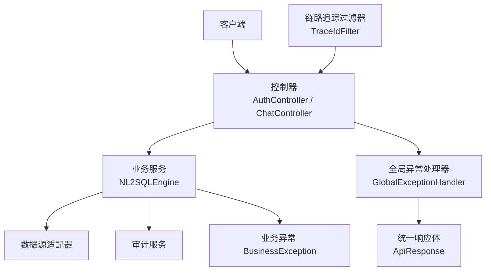
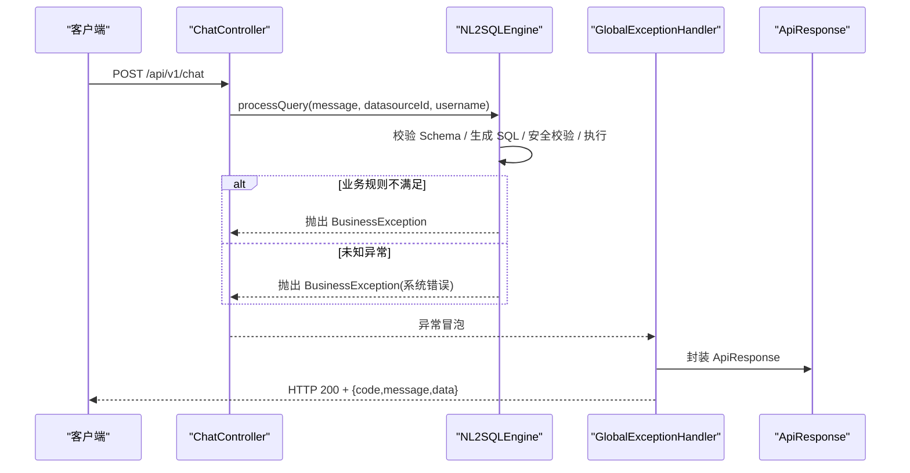
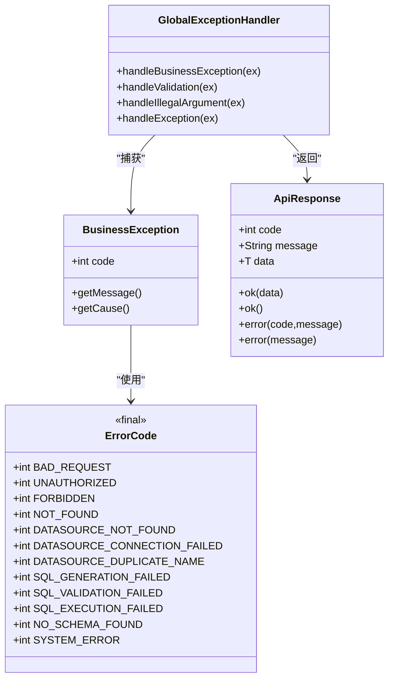
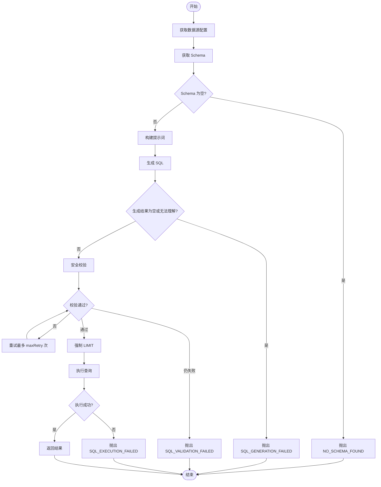

# 异常处理

<cite>
**本文引用的文件**   
- [GlobalExceptionHandler.java](file://backend/src/main/java/com/nlp2sql/config/GlobalExceptionHandler.java)
- [BusinessException.java](file://backend/src/main/java/com/nlp2sql/common/BusinessException.java)
- [ErrorCode.java](file://backend/src/main/java/com/nlp2sql/common/ErrorCode.java)
- [ApiResponse.java](file://backend/src/main/java/com/nlp2sql/model/dto/ApiResponse.java)
- [TraceIdFilter.java](file://backend/src/main/java/com/nlp2sql/common/TraceIdFilter.java)
- [AuthController.java](file://backend/src/main/java/com/nlp2sql/controller/AuthController.java)
- [ChatController.java](file://backend/src/main/java/com/nlp2sql/controller/ChatController.java)
- [NL2SQLEngine.java](file://backend/src/main/java/com/nlp2sql/service/NL2SQLEngine.java)
- [pom.xml](file://backend/pom.xml)
</cite>

## 目录
1. [引言](#引言)
2. [项目结构与异常相关入口](#项目结构与异常相关入口)
3. [核心组件](#核心组件)
4. [架构总览](#架构总览)
5. [详细组件分析](#详细组件分析)
6. [依赖与耦合分析](#依赖与耦合分析)
7. [性能与可扩展性](#性能与可扩展性)
8. [日志、追踪与监控告警](#日志追踪与监控告警)
9. [生产环境错误追踪与调试](#生产环境错误追踪与调试)
10. [常见问题排查](#常见问题排查)
11. [结论](#结论)

## 引言
本文聚焦后端异常处理体系，围绕全局异常拦截器、统一响应体、业务异常分类、错误码规范、链路追踪和审计日志进行系统化说明。目标读者包括后端开发者、测试工程师、运维人员以及需要理解系统错误语义的产品或安全相关人员。

该项目的异常处理遵循“控制器抛出明确异常 → 全局处理器统一转换 → 返回统一响应体”的设计原则，并通过过滤器注入链路追踪标识，配合服务层审计日志实现可观测性。

## 项目结构与异常相关入口
异常处理相关代码主要分布在以下包：
- config：全局异常处理器
- common：业务异常、错误码常量、链路追踪过滤器
- model.dto：统一响应体
- controller：暴露接口并依赖服务
- service：业务逻辑，向上抛出业务异常
- pom.xml：Spring Boot Web、Validation、SLF4J 等依赖

图表来源
- [GlobalExceptionHandler.java:1-50](file://backend/src/main/java/com/nlp2sql/config/GlobalExceptionHandler.java#L1-L50)
- [BusinessException.java:1-23](file://backend/src/main/java/com/nlp2sql/common/BusinessException.java#L1-L23)
- [ErrorCode.java:1-26](file://backend/src/main/java/com/nlp2sql/common/ErrorCode.java#L1-L26)
- [ApiResponse.java:1-33](file://backend/src/main/java/com/nlp2sql/model/dto/ApiResponse.java#L1-L33)
- [TraceIdFilter.java:1-43](file://backend/src/main/java/com/nlp2sql/common/TraceIdFilter.java#L1-L43)
- [AuthController.java:1-31](file://backend/src/main/java/com/nlp2sql/controller/AuthController.java#L1-L31)
- [ChatController.java:1-30](file://backend/src/main/java/com/nlp2sql/controller/ChatController.java#L1-L30)
- [NL2SQLEngine.java:1-127](file://backend/src/main/java/com/nlp2sql/service/NL2SQLEngine.java#L1-L127)

章节来源
- [GlobalExceptionHandler.java:1-50](file://backend/src/main/java/com/nlp2sql/config/GlobalExceptionHandler.java#L1-L50)
- [TraceIdFilter.java:1-43](file://backend/src/main/java/com/nlp2sql/common/TraceIdFilter.java#L1-L43)
- [AuthController.java:1-31](file://backend/src/main/java/com/nlp2sql/controller/AuthController.java#L1-L31)
- [ChatController.java:1-30](file://backend/src/main/java/com/nlp2sql/controller/ChatController.java#L1-L30)
- [NL2SQLEngine.java:1-127](file://backend/src/main/java/com/nlp2sql/service/NL2SQLEngine.java#L1-L127)

## 核心组件
本节从职责、数据结构、异常传播路径角度解析关键类。

### 全局异常处理器
职责：
- 捕获业务异常、参数校验异常、非法参数异常和未处理异常。
- 将异常转换为统一的 ApiResponse 结构。
- 对业务异常使用 warn 级别日志，对未处理异常使用 error 级别并记录堆栈。

关键点：
- 业务异常始终返回 HTTP 200，由 body.code 表达错误语义。
- 参数校验失败聚合字段错误消息。
- 兜底异常返回 SYSTEM_ERROR 固定错误码。

章节来源
- [GlobalExceptionHandler.java:1-50](file://backend/src/main/java/com/nlp2sql/config/GlobalExceptionHandler.java#L1-L50)

### 业务异常
职责：
- 承载业务错误码与可读消息。
- 支持带原始异常的构造方式，便于根因追踪。

设计要点：
- 继承 RuntimeException，适合在业务层抛出。
- code 通过 Getter 暴露给统一响应体。

章节来源
- [BusinessException.java:1-23](file://backend/src/main/java/com/nlp2sql/common/BusinessException.java#L1-L23)

### 错误码规范
职责：
- 集中定义业务错误码常量。
- 按领域分段：通用 4xx、数据源 1xxx、NL2SQL 2xxx、系统 9xxx。

扩展建议：
- 新增错误时按域分配区间，避免冲突。
- 为错误码补充文档化说明（可在注释中增加“触发场景 + 修复建议”）。

章节来源
- [ErrorCode.java:1-26](file://backend/src/main/java/com/nlp2sql/common/ErrorCode.java#L1-L26)

### 统一响应体
职责：
- 对外暴露统一的 JSON 结构：code、message、data。
- 提供 ok、error 静态工厂方法，简化构建。

注意：
- error(String) 默认 code 为 500；若需语义化错误码，应优先使用 error(int, String)。
- 成功响应统一使用 200。

章节来源
- [ApiResponse.java:1-33](file://backend/src/main/java/com/nlp2sql/model/dto/ApiResponse.java#L1-L33)

### 链路追踪过滤器
职责：
- 读取请求头 X-Trace-Id，缺失则生成 UUID。
- 写入 MDC traceId，供日志框架输出。
- 回写响应头 X-Trace-Id，便于前端串联链路。

价值：
- 全链路日志关联，便于定位跨组件问题。
- 结合审计日志形成端到端可观测闭环。

章节来源
- [TraceIdFilter.java:1-43](file://backend/src/main/java/com/nlp2sql/common/TraceIdFilter.java#L1-L43)

## 架构总览
下图展示一次 NL2SQL 查询的异常路径：控制器接收请求后调用引擎，引擎在服务层抛出自定义业务异常；全局异常处理器捕获并转为统一响应体返回。

图表来源
- [ChatController.java:1-30](file://backend/src/main/java/com/nlp2sql/controller/ChatController.java#L1-L30)
- [NL2SQLEngine.java:1-127](file://backend/src/main/java/com/nlp2sql/service/NL2SQLEngine.java#L1-L127)
- [GlobalExceptionHandler.java:1-50](file://backend/src/main/java/com/nlp2sql/config/GlobalExceptionHandler.java#L1-L50)
- [ApiResponse.java:1-33](file://backend/src/main/java/com/nlp2sql/model/dto/ApiResponse.java#L1-L33)

## 详细组件分析

### 全局异常处理器的拦截策略
拦截顺序与行为：
- 业务异常：warn 日志，HTTP 200，body.code=业务错误码。
- 参数校验异常：聚合字段错误信息，HTTP 400，body.code=BAD_REQUEST。
- 非法参数异常：HTTP 400，body.code=BAD_REQUEST。
- 其他异常：error 日志，HTTP 500，body.code=SYSTEM_ERROR。

建议优化：
- 对未处理异常，尽量保留原始异常 message 到响应体以便调试，但生产环境应脱敏。
- 可增加自定义注解区分“用户可感知错误”和“系统内部错误”，以便统计指标。

章节来源
- [GlobalExceptionHandler.java:1-50](file://backend/src/main/java/com/nlp2sql/config/GlobalExceptionHandler.java#L1-L50)

### 业务异常与错误码的分类模型

图表来源
- [BusinessException.java:1-23](file://backend/src/main/java/com/nlp2sql/common/BusinessException.java#L1-L23)
- [ErrorCode.java:1-26](file://backend/src/main/java/com/nlp2sql/common/ErrorCode.java#L1-L26)
- [GlobalExceptionHandler.java:1-50](file://backend/src/main/java/com/nlp2sql/config/GlobalExceptionHandler.java#L1-L50)
- [ApiResponse.java:1-33](file://backend/src/main/java/com/nlp2sql/model/dto/ApiResponse.java#L1-L33)

### NL2SQL 引擎的错误处理流程
引擎在多个阶段可能失败：Schema 为空、AI 生成失败、SQL 校验失败、数据库执行失败、外部依赖异常等。最终统一以 BusinessException 抛出，并由全局异常处理器转换。

图表来源
- [NL2SQLEngine.java:1-127](file://backend/src/main/java/com/nlp2sql/service/NL2SQLEngine.java#L1-L127)
- [ErrorCode.java:1-26](file://backend/src/main/java/com/nlp2sql/common/ErrorCode.java#L1-L26)

章节来源
- [NL2SQLEngine.java:1-127](file://backend/src/main/java/com/nlp2sql/service/NL2SQLEngine.java#L1-L127)

### 控制器的异常协作
认证与对话控制器本身不做复杂异常处理，主要依赖服务层抛出的 BusinessException，并由全局异常处理器统一转换。这保持了控制器的简洁性与职责单一。

章节来源
- [AuthController.java:1-31](file://backend/src/main/java/com/nlp2sql/controller/AuthController.java#L1-L31)
- [ChatController.java:1-30](file://backend/src/main/java/com/nlp2sql/controller/ChatController.java#L1-L30)

## 依赖与耦合分析
- GlobalExceptionHandler 依赖：
  - BusinessException、ErrorCode、ApiResponse
  - SLF4J Logger
  - Spring MVC 异常处理注解与验证异常
- TraceIdFilter 依赖：
  - Servlet API、SLF4J MDC、Spring 过滤器抽象
- NL2SQLEngine 依赖：
  - 数据源适配、元数据、安全校验、提示词构建、SQL 生成、审计服务、认证服务等
- 统一响应体 ApiResponse 被所有控制器和服务包装返回使用

潜在风险：
- 全局异常处理器与业务异常强耦合，新增异常类型需同步更新处理器。
- 错误码集中在一个类中，随业务增长建议拆分为域级枚举或常量类。

章节来源
- [GlobalExceptionHandler.java:1-50](file://backend/src/main/java/com/nlp2sql/config/GlobalExceptionHandler.java#L1-L50)
- [TraceIdFilter.java:1-43](file://backend/src/main/java/com/nlp2sql/common/TraceIdFilter.java#L1-L43)
- [NL2SQLEngine.java:1-127](file://backend/src/main/java/com/nlp2sql/service/NL2SQLEngine.java#L1-L127)
- [ApiResponse.java:1-33](file://backend/src/main/java/com/nlp2sql/model/dto/ApiResponse.java#L1-L33)

## 性能与可扩展性
- 全局异常处理器采用轻量判断分支，时间复杂度接近 O(1)，对性能影响极小。
- 链路追踪过滤器仅在头部读写与 MDC 操作，开销极低。
- NL2SQLEngine 的重试机制受配置限制，避免无限重试导致雪崩。

可扩展建议：
- 将错误码迁移为枚举或分域常量类，提升类型安全与 IDE 提示体验。
- 为常见异常添加自定义注解（如 UserError、SystemError），便于全局处理器分类统计与限流。
- 引入结构化日志（JSON）和指标上报（Prometheus），自动统计各错误码分布。

[本节为通用建议，不直接分析具体源码]

## 日志、追踪与监控告警

### 日志记录策略
- 业务异常：warn 级别，包含 code 与 message，便于快速识别业务错误。
- 未处理异常：error 级别，包含完整堆栈，便于根因分析。
- NL2SQLEngine：关键步骤记录 info/error，并在 finally 中落盘审计日志。

### 链路追踪
- TraceIdFilter 在请求进入时生成或复用 X-Trace-Id，写入 MDC，并回写响应头。
- 建议在日志 pattern 中加入 traceId，使同一请求的所有日志可串联。

### 监控告警方案
- 基于错误码维度统计：BAD_REQUEST、NO_SCHEMA_FOUND、SQL_GENERATION_FAILED、SQL_VALIDATION_FAILED、SQL_EXECUTION_FAILED、SYSTEM_ERROR。
- 阈值告警：当某错误码在短时间窗口内激增，触发告警。
- 结合审计日志：统计 SQL 生成成功率、校验失败率、执行失败率，观察模型与校验策略效果。

章节来源
- [GlobalExceptionHandler.java:1-50](file://backend/src/main/java/com/nlp2sql/config/GlobalExceptionHandler.java#L1-L50)
- [TraceIdFilter.java:1-43](file://backend/src/main/java/com/nlp2sql/common/TraceIdFilter.java#L1-L43)
- [NL2SQLEngine.java:1-127](file://backend/src/main/java/com/nlp2sql/service/NL2SQLEngine.java#L1-L127)

## 生产环境错误追踪与调试

### 快速定位问题
- 通过响应体中的 code 与 message 判断错误类别。
- 通过请求与响应头中的 X-Trace-Id 在全链路日志中检索对应 traceId。
- 查看审计日志，确认输入自然语言、生成的 SQL、校验状态、执行结果与耗时。

### 调试建议
- 开发环境：提高日志级别，保留更多中间状态；必要时临时打印 prompt 与 SQL。
- 预生产环境：启用结构化日志，接入集中式日志平台，建立错误码看板。
- 生产环境：对敏感信息进行脱敏，确保错误消息不包含密码、密钥、内部拓扑等。

### 错误追踪闭环
- 用户反馈 → 凭 X-Trace-Id 检索日志 → 定位业务异常或系统异常 → 根据错误码归因 → 修正配置或代码 → 回归验证。

章节来源
- [TraceIdFilter.java:1-43](file://backend/src/main/java/com/nlp2sql/common/TraceIdFilter.java#L1-L43)
- [GlobalExceptionHandler.java:1-50](file://backend/src/main/java/com/nlp2sql/config/GlobalExceptionHandler.java#L1-L50)
- [NL2SQLEngine.java:1-127](file://backend/src/main/java/com/nlp2sql/service/NL2SQLEngine.java#L1-L127)

## 常见问题排查

### 问题一：前端收到 HTTP 200 但业务失败
现象：
- 浏览器显示 200，但 body.code 非成功值。

原因：
- 全局异常处理器对业务异常统一返回 HTTP 200，由 body.code 表达业务语义。

处理：
- 前端应根据 code 判断成功与否，而非仅依赖 HTTP 状态码。

章节来源
- [GlobalExceptionHandler.java:1-50](file://backend/src/main/java/com/nlp2sql/config/GlobalExceptionHandler.java#L1-L50)
- [ApiResponse.java:1-33](file://backend/src/main/java/com/nlp2sql/model/dto/ApiResponse.java#L1-L33)

### 问题二：参数校验错误信息不明确
现象：
- 字段校验失败时，前端收到的 message 不够直观。

原因：
- 当前聚合了字段默认消息，但未做翻译或统一格式化。

处理：
- 在 DTO 上完善 @NotBlank/@Size 等注解的 message。
- 可按需增加国际化资源文件或统一错误文案库。

章节来源
- [GlobalExceptionHandler.java:1-50](file://backend/src/main/java/com/nlp2sql/config/GlobalExceptionHandler.java#L1-L50)
- [AuthController.java:1-31](file://backend/src/main/java/com/nlp2sql/controller/AuthController.java#L1-L31)

### 问题三：AI 生成 SQL 不稳定导致反复失败
现象：
- 频繁出现 SQL_GENERATION_FAILED 或 SQL_VALIDATION_FAILED。

原因：
- 模型理解能力不足或提示词不佳；安全校验严格。

处理：
- 优化 PromptBuilder 与提示词模板。
- 调整 SqlSecurityChecker 规则与 maxRetry。
- 结合审计日志分析失败原因，逐步收敛问题语句。

章节来源
- [NL2SQLEngine.java:1-127](file://backend/src/main/java/com/nlp2sql/service/NL2SQLEngine.java#L1-L127)
- [ErrorCode.java:1-26](file://backend/src/main/java/com/nlp2sql/common/ErrorCode.java#L1-L26)

### 问题四：无法关联跨组件日志
现象：
- 难以在同一请求的不同组件间串联日志。

原因：
- 未在日志 pattern 中使用 traceId。

处理：
- 在日志配置中启用 MDC traceId。
- 确保 TraceIdFilter 正常执行且未被过滤器链跳过。

章节来源
- [TraceIdFilter.java:1-43](file://backend/src/main/java/com/nlp2sql/common/TraceIdFilter.java#L1-L43)

## 结论
本项目的异常处理体系以“业务异常 + 全局拦截 + 统一响应”为核心，配合链路追踪与审计日志，实现了清晰的错误语义、可观测的故障定位路径和可扩展的错误分类空间。未来可进一步细化错误码管理、增强国际化与结构化日志，并对接指标与告警平台，以提升生产环境的稳定性与排障效率。