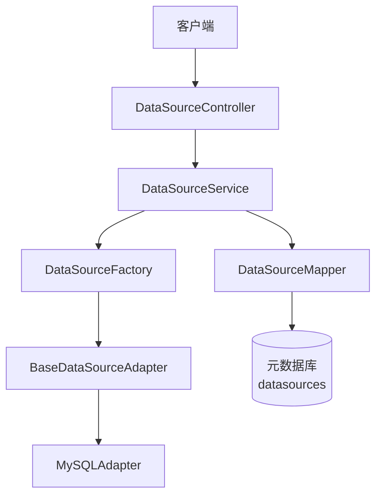
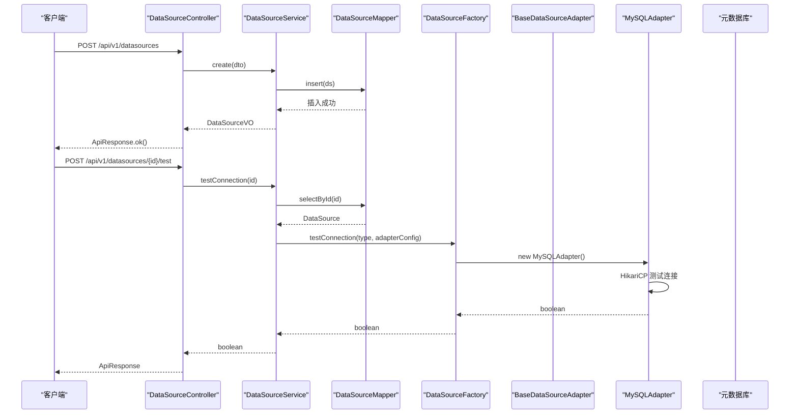
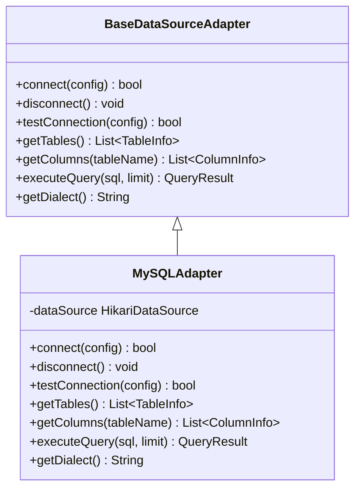
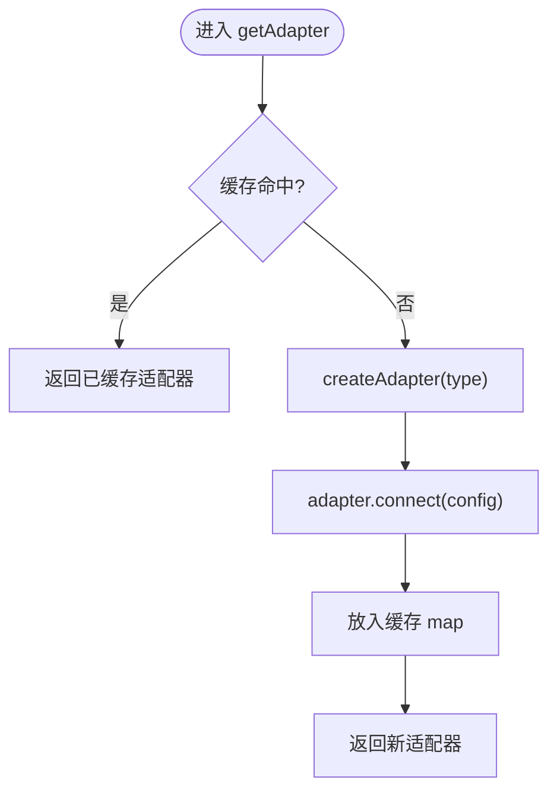
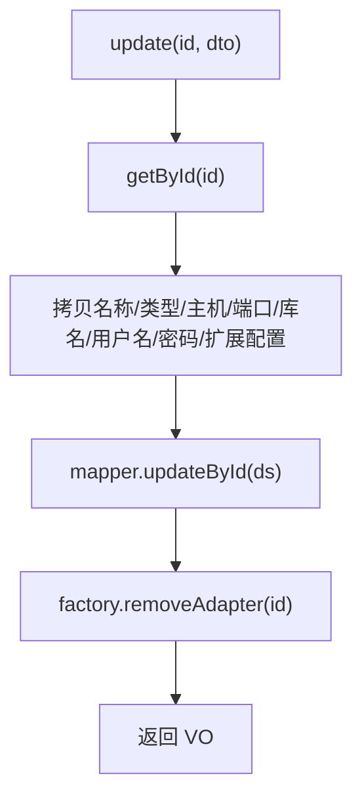
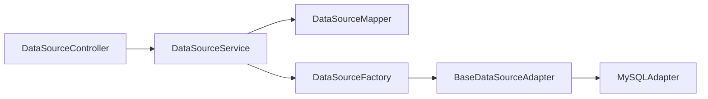

# 工厂与注册机制

<cite>
**本文引用的文件**   
- [DataSourceFactory.java](file://backend/src/main/java/com/nlp2sql/adapter/DataSourceFactory.java)
- [BaseDataSourceAdapter.java](file://backend/src/main/java/com/nlp2sql/adapter/BaseDataSourceAdapter.java)
- [MySQLAdapter.java](file://backend/src/main/java/com/nlp2sql/adapter/MySQLAdapter.java)
- [DataSourceController.java](file://backend/src/main/java/com/nlp2sql/controller/DataSourceController.java)
- [DataSourceService.java](file://backend/src/main/java/com/nlp2sql/service/DataSourceService.java)
- [DataSourceMapper.java](file://backend/src/main/java/com/nlp2sql/mapper/DataSourceMapper.java)
- [DataSource.java](file://backend/src/main/java/com/nlp2sql/model/DataSource.java)
- [DataSourceDTO.java](file://backend/src/main/java/com/nlp2sql/model/dto/DataSourceDTO.java)
- [BusinessException.java](file://backend/src/main/java/com/nlp2sql/common/BusinessException.java)
- [ErrorCode.java](file://backend/src/main/java/com/nlp2sql/common/ErrorCode.java)
</cite>

## 目录
1. [引言](#引言)
2. [项目结构](#项目结构)
3. [核心组件](#核心组件)
4. [架构总览](#架构总览)
5. [详细组件分析](#详细组件分析)
6. [依赖关系分析](#依赖关系分析)
7. [性能与并发特性](#性能与并发特性)
8. [动态加载、热更新与配置管理](#动态加载热更新与配置管理)
9. [插件化扩展与 SPI 设计](#插件化扩展与-spi-设计)
10. [生产安全与最佳实践](#生产安全与最佳实践)
11. [故障排查指南](#故障排查指南)
12. [结论](#结论)

## 引言
本文件围绕数据源工厂与注册机制展开，聚焦以下目标：
- 解释 DataSourceFactory 的适配器创建流程与缓存注册表管理；
- 梳理 Controller 层对数据源的增删改查及连接测试的业务逻辑；
- 说明当前实现中的安全校验、权限控制、加密策略现状与改进建议；
- 给出运行时动态加载新数据源类型、热更新和配置管理的可行方案；
- 提供插件化架构与 SPI 扩展点设计，指导如何新增数据库支持；
- 讨论并发安全、线程池与连接池监控、资源清理、故障恢复等生产级能力。

## 项目结构
后端采用 Spring Boot + MyBatis Plus 分层架构，关键包如下：
- adapter：数据源适配器抽象与具体实现，由工厂统一创建与缓存；
- controller：REST API 入口，暴露数据源 CRUD 与连接测试；
- service：业务编排层，负责实体转换、持久化与工厂调用；
- mapper：MyBatis Plus Mapper 接口，对接元数据表 datasources；
- model：领域模型、数据传输对象 VO/DTO；
- common：通用异常与错误码；
- config/security：Spring 配置与安全相关类（未在本文件深入）。

图示来源
- [DataSourceController.java:1-50](file://backend/src/main/java/com/nlp2sql/controller/DataSourceController.java#L1-L50)
- [DataSourceService.java:1-95](file://backend/src/main/java/com/nlp2sql/service/DataSourceService.java#L1-L95)
- [DataSourceFactory.java:1-49](file://backend/src/main/java/com/nlp2sql/adapter/DataSourceFactory.java#L1-L49)
- [BaseDataSourceAdapter.java:1-25](file://backend/src/main/java/com/nlp2sql/adapter/BaseDataSourceAdapter.java#L1-L25)
- [MySQLAdapter.java:1-200](file://backend/src/main/java/com/nlp2sql/adapter/MySQLAdapter.java#L1-L200)
- [DataSourceMapper.java:1-9](file://backend/src/main/java/com/nlp2sql/mapper/DataSourceMapper.java#L1-L9)

章节来源
- [DataSourceController.java:1-50](file://backend/src/main/java/com/nlp2sql/controller/DataSourceController.java#L1-L50)
- [DataSourceService.java:1-95](file://backend/src/main/java/com/nlp2sql/service/DataSourceService.java#L1-L95)
- [DataSourceFactory.java:1-49](file://backend/src/main/java/com/nlp2sql/adapter/DataSourceFactory.java#L1-L49)
- [BaseDataSourceAdapter.java:1-25](file://backend/src/main/java/com/nlp2sql/adapter/BaseDataSourceAdapter.java#L1-L25)
- [MySQLAdapter.java:1-200](file://backend/src/main/java/com/nlp2sql/adapter/MySQLAdapter.java#L1-L200)
- [DataSourceMapper.java:1-9](file://backend/src/main/java/com/nlp2sql/mapper/DataSourceMapper.java#L1-L9)

## 核心组件
- BaseDataSourceAdapter：定义数据源适配器的统一契约，包含连接、断开、测试、元数据读取与查询执行等抽象方法。
- MySQLAdapter：MySQL 的具体实现，使用 HikariCP 管理连接池，提供建链、测试、获取表/列、执行 SQL 的能力。
- DataSourceFactory：适配器工厂与轻量注册中心，按数据源 ID 缓存适配器实例，并提供类型到实现的静态映射与连接测试。
- DataSourceService：数据源业务服务，封装 CRUD、实体转换、缓存失效与连接测试编排。
- DataSourceController：对外 REST API，接收 DTO、委托 Service 处理并返回统一响应。
- DataSourceMapper：基于 MyBatis Plus 的数据访问接口。
- DataSource / DataSourceDTO：持久化模型与入参校验模型。

章节来源
- [BaseDataSourceAdapter.java:1-25](file://backend/src/main/java/com/nlp2sql/adapter/BaseDataSourceAdapter.java#L1-L25)
- [MySQLAdapter.java:1-200](file://backend/src/main/java/com/nlp2sql/adapter/MySQLAdapter.java#L1-L200)
- [DataSourceFactory.java:1-49](file://backend/src/main/java/com/nlp2sql/adapter/DataSourceFactory.java#L1-L49)
- [DataSourceService.java:1-95](file://backend/src/main/java/com/nlp2sql/service/DataSourceService.java#L1-L95)
- [DataSourceController.java:1-50](file://backend/src/main/java/com/nlp2sql/controller/DataSourceController.java#L1-L50)
- [DataSourceMapper.java:1-9](file://backend/src/main/java/com/nlp2sql/mapper/DataSourceMapper.java#L1-L9)
- [DataSource.java:1-48](file://backend/src/main/java/com/nlp2sql/model/DataSource.java#L1-L48)
- [DataSourceDTO.java:1-34](file://backend/src/main/java/com/nlp2sql/model/dto/DataSourceDTO.java#L1-L34)

## 架构总览
下图展示一次数据源创建到连接测试的完整时序。

图示来源
- [DataSourceController.java:1-50](file://backend/src/main/java/com/nlp2sql/controller/DataSourceController.java#L1-L50)
- [DataSourceService.java:1-95](file://backend/src/main/java/com/nlp2sql/service/DataSourceService.java#L1-L95)
- [DataSourceMapper.java:1-9](file://backend/src/main/java/com/nlp2sql/mapper/DataSourceMapper.java#L1-L9)
- [DataSourceFactory.java:1-49](file://backend/src/main/java/com/nlp2sql/adapter/DataSourceFactory.java#L1-L49)
- [MySQLAdapter.java:1-200](file://backend/src/main/java/com/nlp2sql/adapter/MySQLAdapter.java#L1-L200)

## 详细组件分析

### 适配器抽象与实现
- BaseDataSourceAdapter 定义了统一的适配器接口，包括 connect、disconnect、testConnection、getTables、getColumns、executeQuery、getDialect。
- MySQLAdapter 基于 JDBC 与 HikariCP 实现上述接口：
  - connect：构建 jdbcUrl，初始化 HikariConfig，设置连接池参数，进行有效性校验；
  - disconnect：关闭 HikariDataSource；
  - testConnection：临时构造 HikariDataSource 做连通性检测并在 finally 中释放；
  - getTables/getColumns：通过 INFORMATION_SCHEMA 读取元数据；
  - executeQuery：执行 SQL，限制结果行数，统计执行耗时；
  - getDialect：返回方言标识（实现细节未截全，但意图明确）。

图示来源
- [BaseDataSourceAdapter.java:1-25](file://backend/src/main/java/com/nlp2sql/adapter/BaseDataSourceAdapter.java#L1-L25)
- [MySQLAdapter.java:1-200](file://backend/src/main/java/com/nlp2sql/adapter/MySQLAdapter.java#L1-L200)

章节来源
- [BaseDataSourceAdapter.java:1-25](file://backend/src/main/java/com/nlp2sql/adapter/BaseDataSourceAdapter.java#L1-L25)
- [MySQLAdapter.java:1-200](file://backend/src/main/java/com/nlp2sql/adapter/MySQLAdapter.java#L1-L200)

### 工厂与注册表管理
- DataSourceFactory 使用 ConcurrentHashMap<Long, BaseDataSourceAdapter> 作为按数据源 ID 的适配器缓存。
- getAdapter：按 datasourceId 惰性创建并缓存适配器；先根据 type 创建适配器，再 connect 后放入缓存。
- createAdapter：基于 type 字符串进行 switch 分支匹配，目前仅支持 mysql，其余类型抛出非法参数异常。
- removeAdapter：从缓存移除并调用 disconnect 释放资源。
- testConnection：不进入缓存，直接创建临时适配器执行测试连接后断开。

图示来源
- [DataSourceFactory.java:1-49](file://backend/src/main/java/com/nlp2sql/adapter/DataSourceFactory.java#L1-L49)

章节来源
- [DataSourceFactory.java:1-49](file://backend/src/main/java/com/nlp2sql/adapter/DataSourceFactory.java#L1-L49)

### Controller 层数据源 CRUD 与业务验证
- DataSourceController 暴露以下端点：
  - POST /api/v1/datasources：创建数据源；
  - GET /api/v1/datasources：列出数据源；
  - PUT /api/v1/datasources/{id}：更新数据源；
  - DELETE /api/v1/datasources/{id}：删除数据源；
  - POST /api/v1/datasources/{id}/test：连接测试。
- 入参校验通过 Jakarta Validation（@NotBlank、@NotNull）在 DTO 层完成。
- 控制器本身不做复杂业务判断，主要委托 DataSourceService。

章节来源
- [DataSourceController.java:1-50](file://backend/src/main/java/com/nlp2sql/controller/DataSourceController.java#L1-L50)
- [DataSourceDTO.java:1-34](file://backend/src/main/java/com/nlp2sql/model/dto/DataSourceDTO.java#L1-L34)

### Service 层编排与缓存失效
- DataSourceService 封装了：
  - create/update/delete：调用 Mapper 持久化，并在 update/delete 时主动清理工厂缓存；
  - list：从数据库拉取并转换为 VO；
  - testConnection：从数据库加载实体，构造适配器配置并委托工厂测试；
  - getById：内部方法，不存在则抛业务异常 BusinessException(ErrorCode.DATASOURCE_NOT_FOUND)。
- 密码字段更新保护：当传入值为占位符“******”时不覆盖已有密码。

图示来源
- [DataSourceService.java:1-95](file://backend/src/main/java/com/nlp2sql/service/DataSourceService.java#L1-L95)
- [DataSourceFactory.java:1-49](file://backend/src/main/java/com/nlp2sql/adapter/DataSourceFactory.java#L1-L49)

章节来源
- [DataSourceService.java:1-95](file://backend/src/main/java/com/nlp2sql/service/DataSourceService.java#L1-L95)
- [BusinessException.java](file://backend/src/main/java/com/nlp2sql/common/BusinessException.java)
- [ErrorCode.java](file://backend/src/main/java/com/nlp2sql/common/ErrorCode.java)

### 数据模型与映射
- DataSource：持久化实体，包含 id、name、type、host、port、databaseName、username、password、extraConfig、createdAt、updatedAt；提供 toAdapterConfig 将实体转为适配器配置 Map。
- DataSourceDTO：请求体 DTO，带校验注解。
- DataSourceMapper：继承 MyBatis Plus BaseMapper，无需额外 XML。

章节来源
- [DataSource.java:1-48](file://backend/src/main/java/com/nlp2sql/model/DataSource.java#L1-L48)
- [DataSourceDTO.java:1-34](file://backend/src/main/java/com/nlp2sql/model/dto/DataSourceDTO.java#L1-L34)
- [DataSourceMapper.java:1-9](file://backend/src/main/java/com/nlp2sql/mapper/DataSourceMapper.java#L1-L9)

## 依赖关系分析
- Controller 依赖 Service；Service 依赖 Mapper 与 Factory；Factory 依赖具体 Adapter；Adapter 依赖 JDBC/HikariCP。
- 耦合点集中在 Factory.createAdapter 的类型分发与 Service 对工厂缓存的失效操作。

图示来源
- [DataSourceController.java:1-50](file://backend/src/main/java/com/nlp2sql/controller/DataSourceController.java#L1-L50)
- [DataSourceService.java:1-95](file://backend/src/main/java/com/nlp2sql/service/DataSourceService.java#L1-L95)
- [DataSourceFactory.java:1-49](file://backend/src/main/java/com/nlp2sql/adapter/DataSourceFactory.java#L1-L49)
- [BaseDataSourceAdapter.java:1-25](file://backend/src/main/java/com/nlp2sql/adapter/BaseDataSourceAdapter.java#L1-L25)
- [MySQLAdapter.java:1-200](file://backend/src/main/java/com/nlp2sql/adapter/MySQLAdapter.java#L1-L200)

章节来源
- [DataSourceController.java:1-50](file://backend/src/main/java/com/nlp2sql/controller/DataSourceController.java#L1-L50)
- [DataSourceService.java:1-95](file://backend/src/main/java/com/nlp2sql/service/DataSourceService.java#L1-L95)
- [DataSourceFactory.java:1-49](file://backend/src/main/java/com/nlp2sql/adapter/DataSourceFactory.java#L1-L49)

## 性能与并发特性
- 工厂缓存：ConcurrentHashMap 保证并发安全的键值缓存，避免重复创建适配器；按 datasourceId 粒度隔离。
- 连接池：MySQLAdapter 使用 HikariCP，默认最大连接数 5，空闲超时与连接超时均有配置，适合中等并发场景。
- 查询执行：executeQuery 设置语句级超时并限制返回行数，降低慢查询风险。
- 潜在优化点：
  - 连接池参数应可配置化（最大连接数、超时、空闲时间等），而非硬编码；
  - 可考虑全局线程池或任务队列用于异步元数据刷新与批量连接测试；
  - 增加连接池指标采集（活跃、空闲、等待、失败次数）以便监控告警。

章节来源
- [DataSourceFactory.java:1-49](file://backend/src/main/java/com/nlp2sql/adapter/DataSourceFactory.java#L1-L49)
- [MySQLAdapter.java:1-200](file://backend/src/main/java/com/nlp2sql/adapter/MySQLAdapter.java#L1-L200)

## 动态加载、热更新与配置管理
- 当前状态：
  - 静态注册：DataSourceFactory.createAdapter 通过 switch 分支按 type 选择实现类，新增类型需修改代码并重启。
  - 运行时缓存：DataSourceFactory.getAdapter 会缓存适配器实例；DataSourceService.update/delete 会主动清理缓存，达到局部热更新效果。
  - 配置来源：DataSource 持久化到元数据库，运行时通过 Mapper 读取；DTO 提供前端输入校验。
- 推荐演进：
  - 支持 SPI 动态加载：通过 Java SPI 或服务发现机制扫描实现类，避免 switch 分支；
  - 版本管理：为 DataSource 增加 version 字段，结合乐观锁防止并发覆盖；同时为适配器引入 capability 版本声明；
  - 配置中心：将连接参数与敏感信息迁移至配置中心（如 Nacos/Apollo），本地仅存引用与密钥别名；
  - 灰度与回滚：新增类型先以只读模式启用，经冒烟测试后再开放写入。

章节来源
- [DataSourceFactory.java:1-49](file://backend/src/main/java/com/nlp2sql/adapter/DataSourceFactory.java#L1-L49)
- [DataSourceService.java:1-95](file://backend/src/main/java/com/nlp2sql/service/DataSourceService.java#L1-L95)
- [DataSource.java:1-48](file://backend/src/main/java/com/nlp2sql/model/DataSource.java#L1-L48)

## 插件化扩展与 SPI 设计
- 扩展点：
  - BaseDataSourceAdapter：每个新数据库只需实现该抽象类；
  - DataSourceFactory：扩展类型到实现的映射策略；
  - DataSourceService：如需特定类型的特殊校验或预热逻辑，可在 Service 层扩展。
- SPI 建议方案：
  - 定义 SPI 接口：例如 DataSourceAdapterFactory，提供 getType() 与 create(config)；
  - 通过 META-INF/services 或服务容器自动发现所有实现类；
  - 启动阶段构建 Type -> AdapterFactory 注册表，供 Factory 使用；
  - 支持运行时热插拔：监听外部事件（如配置变更）重新扫描实现类，替换旧注册项。
- 新增数据库步骤：
  1) 新建 XxxAdapter 继承 BaseDataSourceAdapter；
  2) 在 SPI 注册表中声明 type 与实现；
  3) 在 DataSourceFactory 中接入注册表；
  4) 编写单元测试验证 connect/testConnection/getTables/executeQuery；
  5) 在前端与文档中补充类型选项与示例配置。

章节来源
- [BaseDataSourceAdapter.java:1-25](file://backend/src/main/java/com/nlp2sql/adapter/BaseDataSourceAdapter.java#L1-L25)
- [DataSourceFactory.java:1-49](file://backend/src/main/java/com/nlp2sql/adapter/DataSourceFactory.java#L1-L49)

## 生产安全与最佳实践
- 权限校验：
  - 当前 Controller 未内置鉴权逻辑，建议在 Web 层集成 JWT/授权过滤器，并对数据源操作接口实施 RBAC 控制；
  - 建议增加审计日志记录数据源变更与连接测试结果。
- 数据安全：
  - 密码传输：建议开启 HTTPS，避免明文传输；
  - 密码存储：建议使用加密存储（如 AES-KMS 或 Vault），并在 Service 层解密后传给适配器；
  - 日志脱敏：确保日志中不打印 password 与敏感 extraConfig。
- SQL 安全：
  - 查询执行前增加白名单/语法树校验，拦截危险关键字与注入攻击；
  - 限制执行时长、结果集大小与扫描范围。
- 连接安全：
  - 数据库连接启用 SSL/TLS；
  - 最小权限原则，为应用账户授予必要最小权限。

章节来源
- [DataSourceController.java:1-50](file://backend/src/main/java/com/nlp2sql/controller/DataSourceController.java#L1-L50)
- [MySQLAdapter.java:1-200](file://backend/src/main/java/com/nlp2sql/adapter/MySQLAdapter.java#L1-L200)

## 故障排查指南
- 无法创建数据源：
  - 检查 DTO 校验是否通过（名称、类型、主机、端口、库名、用户名、密码）；
  - 查看数据库插入是否成功；
  - 确认类型是否为受支持类型（当前仅 mysql）。
- 连接测试失败：
  - 检查网络可达性与凭据正确性；
  - 观察 HikariCP 连接超时与可用性；
  - 关注 MySQLAdapter 的错误日志。
- 更新后查询异常：
  - 确认 Service 已清理旧适配器缓存；
  - 若存在其他模块复用旧缓存，需同步失效。
- 常见错误码：
  - DATASOURCE_NOT_FOUND：Service.getById 找不到数据源实体。

章节来源
- [DataSourceService.java:1-95](file://backend/src/main/java/com/nlp2sql/service/DataSourceService.java#L1-L95)
- [BusinessException.java](file://backend/src/main/java/com/nlp2sql/common/BusinessException.java)
- [ErrorCode.java](file://backend/src/main/java/com/nlp2sql/common/ErrorCode.java)
- [MySQLAdapter.java:1-200](file://backend/src/main/java/com/nlp2sql/adapter/MySQLAdapter.java#L1-L200)

## 结论
当前实现通过 BaseDataSourceAdapter 抽象与 DataSourceFactory 缓存实现了可扩展的数据源接入框架，配合 DataSourceService 与 Controller 提供了完善的数据源管理与连接测试能力。面向生产环境，建议进一步完善 SPI 动态加载、配置中心与加密存储、权限与审计、连接池监控与限流、以及更细粒度的错误处理与可观测性，从而形成稳定、安全、易扩展的企业级 NL2SQL 数据源基础设施。