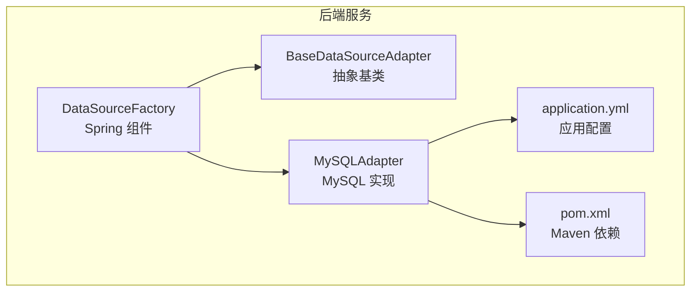
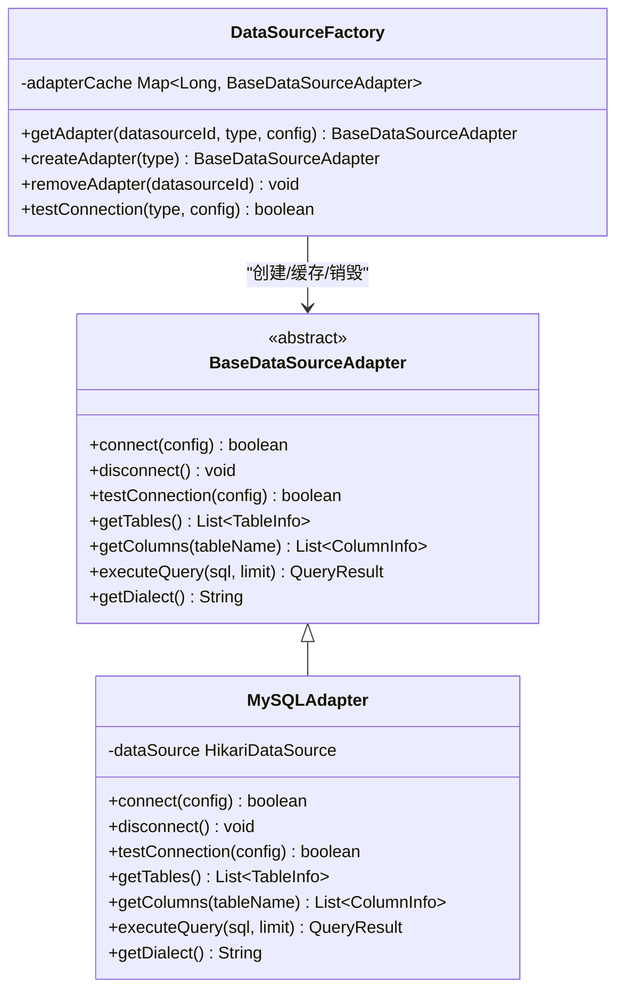
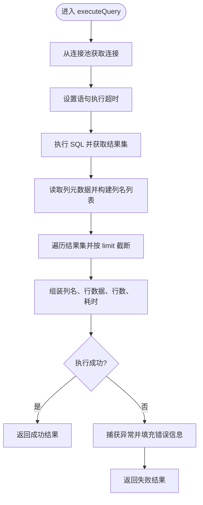
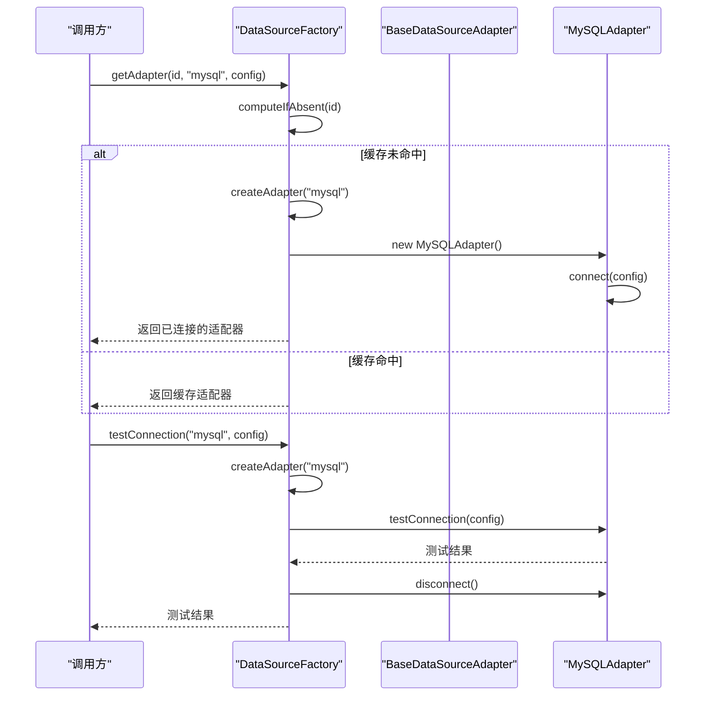
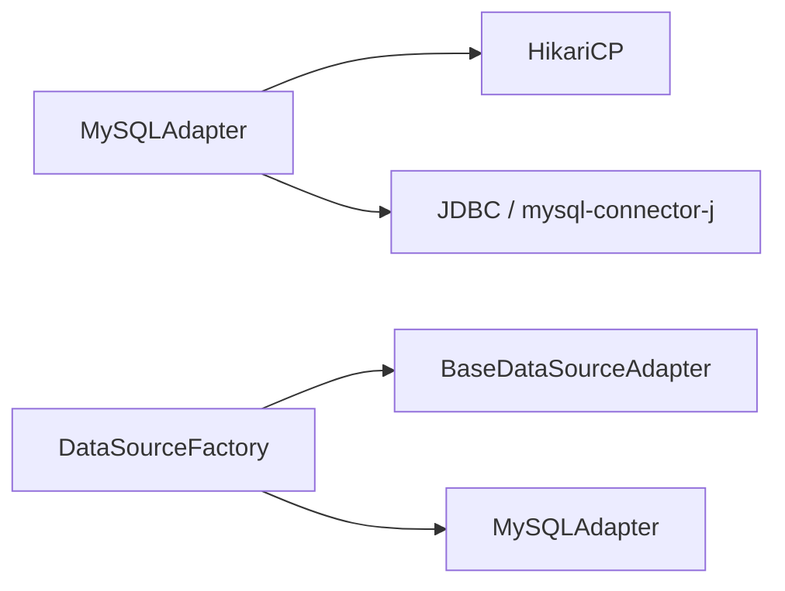

# 数据源适配器

<cite>
**本文引用的文件**   
- [BaseDataSourceAdapter.java](file://backend/src/main/java/com/nlp2sql/adapter/BaseDataSourceAdapter.java)
- [MySQLAdapter.java](file://backend/src/main/java/com/nlp2sql/adapter/MySQLAdapter.java)
- [DataSourceFactory.java](file://backend/src/main/java/com/nlp2sql/adapter/DataSourceFactory.java)
- [application.yml](file://backend/src/main/resources/application.yml)
- [pom.xml](file://backend/pom.xml)
</cite>

## 目录
1. [引言](#引言)
2. [项目结构](#项目结构)
3. [核心组件](#核心组件)
4. [架构总览](#架构总览)
5. [详细组件分析](#详细组件分析)
6. [依赖关系分析](#依赖关系分析)
7. [性能与连接池优化](#性能与连接池优化)
8. [事务管理建议](#事务管理建议)
9. [新数据源适配器开发指南](#新数据源适配器开发指南)
10. [测试方法](#测试方法)
11. [分布式环境与故障转移](#分布式环境与故障转移)
12. [故障排查](#故障排查)
13. [结论](#结论)

## 引言
本文聚焦于后端“数据源适配器系统”，围绕策略模式、模板方法与工厂模式，解释如何通过统一抽象对接多种数据库或数据源。当前仓库已实现 MySQL 适配器的完整生命周期：连接建立、连接测试、元数据获取（表与列）、SQL 执行与结果封装，并通过 HikariCP 提供连接池能力。同时给出扩展新数据源的步骤、测试方式以及在分布式环境下的连接管理与故障转移建议。

## 项目结构
数据源适配器相关代码位于后端 Java 模块的 adapter 包中，包含一个抽象基类、一个 MySQL 具体实现以及一个 Spring 管理的工厂类。应用配置集中在 application.yml；依赖由 Maven 管理。

图表来源
- [DataSourceFactory.java:1-49](file://backend/src/main/java/com/nlp2sql/adapter/DataSourceFactory.java#L1-L49)
- [BaseDataSourceAdapter.java:1-25](file://backend/src/main/java/com/nlp2sql/adapter/BaseDataSourceAdapter.java#L1-L25)
- [MySQLAdapter.java:1-203](file://backend/src/main/java/com/nlp2sql/adapter/MySQLAdapter.java#L1-L203)
- [application.yml:1-117](file://backend/src/main/resources/application.yml#L1-L117)
- [pom.xml:1-194](file://backend/pom.xml#L1-L194)

章节来源
- [BaseDataSourceAdapter.java:1-25](file://backend/src/main/java/com/nlp2sql/adapter/BaseDataSourceAdapter.java#L1-L25)
- [MySQLAdapter.java:1-203](file://backend/src/main/java/com/nlp2sql/adapter/MySQLAdapter.java#L1-L203)
- [DataSourceFactory.java:1-49](file://backend/src/main/java/com/nlp2sql/adapter/DataSourceFactory.java#L1-L49)
- [application.yml:1-117](file://backend/src/main/resources/application.yml#L1-L117)
- [pom.xml:1-194](file://backend/pom.xml#L1-L194)

## 核心组件
- BaseDataSourceAdapter：定义数据源适配器统一接口，作为策略基类，暴露连接、断开、测试连接、获取表列表、获取字段信息、执行查询与方言标识等能力。
- MySQLAdapter：基于 JDBC + HikariCP 的 MySQL 数据源实现，完成连接池初始化、元数据读取、SQL 执行和结果封装。
- DataSourceFactory：Spring 组件，负责按类型创建适配器、按数据源 ID 缓存并复用适配器实例、支持连接测试与销毁释放。

章节来源
- [BaseDataSourceAdapter.java:1-25](file://backend/src/main/java/com/nlp2sql/adapter/BaseDataSourceAdapter.java#L1-L25)
- [MySQLAdapter.java:1-203](file://backend/src/main/java/com/nlp2sql/adapter/MySQLAdapter.java#L1-L203)
- [DataSourceFactory.java:1-49](file://backend/src/main/java/com/nlp2sql/adapter/DataSourceFactory.java#L1-L49)

## 架构总览
下图展示了策略模式在数据源适配器中的体现：上层通过工厂获取具体适配器，调用统一的抽象接口，底层由不同实现提供差异化的连接与执行细节。

图表来源
- [BaseDataSourceAdapter.java:1-25](file://backend/src/main/java/com/nlp2sql/adapter/BaseDataSourceAdapter.java#L1-L25)
- [MySQLAdapter.java:1-203](file://backend/src/main/java/com/nlp2sql/adapter/MySQLAdapter.java#L1-L203)
- [DataSourceFactory.java:1-49](file://backend/src/main/java/com/nlp2sql/adapter/DataSourceFactory.java#L1-L49)

## 详细组件分析

### BaseDataSourceAdapter：策略抽象与模板方法
- 设计要点
  - 以抽象类定义“数据源适配器”的统一契约，屏蔽底层数据库差异。
  - 对外暴露 connect/disconnect/testConnection/getTables/getColumns/executeQuery/getDialect 等方法，供上层业务统一调用。
- 复杂度
  - 接口层无额外逻辑，时间复杂度取决于各实现；空间复杂度主要受返回集合大小影响。
- 可优化点
  - 可在基类中加入参数校验、日志埋点、重试与熔断等横切逻辑，减少子类重复代码。

章节来源
- [BaseDataSourceAdapter.java:1-25](file://backend/src/main/java/com/nlp2sql/adapter/BaseDataSourceAdapter.java#L1-L25)

### MySQLAdapter：JDBC + HikariCP 的具体实现
- 连接与连接池
  - 使用 HikariConfig 构建连接池，设置最大连接数、空闲连接数、连接超时与空闲超时。
  - 首次连接成功后，通过 isValid 验证连接有效性。
- 连接测试
  - testConnection 会临时创建一个最小化连接池进行连通性检查，并在 finally 中关闭。
- 元数据读取
  - getTables 通过 INFORMATION_SCHEMA.TABLES 获取当前库下表名与注释。
  - getColumns 通过 INFORMATION_SCHEMA.COLUMNS 获取字段名、类型、键、是否可空、默认值等。
- SQL 执行
  - executeQuery 设置语句级超时，逐行读取 ResultSet 并组装为列名到值的映射列表，同时记录执行耗时与成功状态。
- 方言标识
  - getDialect 返回 “mysql”。

图表来源
- [MySQLAdapter.java:130-203](file://backend/src/main/java/com/nlp2sql/adapter/MySQLAdapter.java#L130-L203)

章节来源
- [MySQLAdapter.java:1-203](file://backend/src/main/java/com/nlp2sql/adapter/MySQLAdapter.java#L1-L203)

### DataSourceFactory：工厂与适配器注册机制
- 工厂职责
  - createAdapter：根据 type 字符串创建对应适配器实例，目前仅支持 “mysql”。
  - getAdapter：按 datasourceId 获取或创建并缓存适配器实例，避免重复创建连接池。
  - removeAdapter：从缓存移除适配器并调用 disconnect 释放资源。
  - testConnection：创建临时适配器进行连通性测试，并在 finally 中释放。
- 线程安全
  - 使用 ConcurrentHashMap 维护适配器缓存，保证并发访问安全。
- 扩展性
  - 新增数据源只需在 createAdapter 的分支中添加 new XxxAdapter() 即可。

图表来源
- [DataSourceFactory.java:1-49](file://backend/src/main/java/com/nlp2sql/adapter/DataSourceFactory.java#L1-L49)
- [MySQLAdapter.java:1-120](file://backend/src/main/java/com/nlp2sql/adapter/MySQLAdapter.java#L1-L120)

章节来源
- [DataSourceFactory.java:1-49](file://backend/src/main/java/com/nlp2sql/adapter/DataSourceFactory.java#L1-L49)

## 依赖关系分析
- 运行时依赖
  - MySQL 驱动：mysql-connector-j（用于 JDBC 连接）。
  - 连接池：HikariCP（通过 HikariDataSource/HikariConfig）。
  - Spring Boot Web、Security、Redis、MyBatis-Plus、Spring AI 等其它功能依赖，但与数据源适配器直接耦合的是 MySQL 驱动与 HikariCP。
- 配置依赖
  - application.yml 中定义了后端元数据库的 Hikari 连接池参数及 Redis、AI、JWT 等配置，但 MySQLAdapter 内部自建 Hikari 连接池，未直接读取该配置文件。

图表来源
- [pom.xml:1-194](file://backend/pom.xml#L1-L194)
- [MySQLAdapter.java:1-203](file://backend/src/main/java/com/nlp2sql/adapter/MySQLAdapter.java#L1-L203)
- [DataSourceFactory.java:1-49](file://backend/src/main/java/com/nlp2sql/adapter/DataSourceFactory.java#L1-L49)

章节来源
- [pom.xml:1-194](file://backend/pom.xml#L1-L194)
- [MySQLAdapter.java:1-203](file://backend/src/main/java/com/nlp2sql/adapter/MySQLAdapter.java#L1-L203)
- [DataSourceFactory.java:1-49](file://backend/src/main/java/com/nlp2sql/adapter/DataSourceFactory.java#L1-L49)

## 性能与连接池优化
- 当前 MySQLAdapter 的连接池配置
  - maximumPoolSize=5，minimumIdle=1，connectionTimeout=10s，idleTimeout=300s。
  - 适合中等并发场景；若 QPS 较高，需结合压测调整。
- 调优建议
  - 依据 CPU 核数、连接等待时间与慢查询比例动态调节 maximumPoolSize。
  - 合理设置 connectionTimeout 与 idleTimeout，避免连接泄漏与资源浪费。
  - 对大结果集增加分页/限制条数（limit），降低内存占用与网络传输开销。
  - 在 getTables/getColumns 等元数据查询中尽量只取必要字段，避免全量扫描 INFORMATION_SCHEMA。
- 监控指标
  - 连接池活跃连接数、等待队列长度、连接创建/销毁速率、SQL 执行耗时分布、错误率。

章节来源
- [MySQLAdapter.java:20-70](file://backend/src/main/java/com/nlp2sql/adapter/MySQLAdapter.java#L20-L70)
- [MySQLAdapter.java:130-203](file://backend/src/main/java/com/nlp2sql/adapter/MySQLAdapter.java#L130-L203)

## 事务管理建议
- 当前适配器层面未封装事务，executeQuery 直接使用 Statement 执行单条 SQL。
- 如需事务
  - 在业务服务层统一管理事务，通过 DataSourceFactory 获取同一适配器后，在同一 Connection 上开启/提交/回滚事务。
  - 或使用 MyBatis/Spring Transaction 注解封装多步操作，确保共享同一个连接。
- 注意事项
  - 跨多个数据源的事务需要引入分布式事务方案（如 Seata），或在应用层做补偿逻辑。
  - 谨慎使用长事务，避免连接被长时间占用导致连接池耗尽。

[本节为通用建议，不直接分析具体源码文件]

## 新数据源适配器开发指南
- 步骤
  1. 新建实现类继承 BaseDataSourceAdapter。
  2. 实现 connect/disconnect/testConnection 方法，内部自行管理连接或连接池。
  3. 实现 getTables/getColumns，按目标数据源元数据接口拉取结构与字段信息。
  4. 实现 executeQuery，封装列名与行数据为 QueryResult，处理超时、限流与错误信息。
  5. 实现 getDialect，返回唯一方言标识。
  6. 在 DataSourceFactory.createAdapter 中新增 type 分支，注册新适配器。
- 最佳实践
  - 连接池：优先使用成熟连接池（如 HikariCP）或数据源 SDK 提供的连接池。
  - 参数校验：在 connect 中对必填项进行校验，提前失败。
  - 资源释放：确保 disconnect/close 能正确释放连接与连接池。
  - 错误语义：将异常转换为明确的错误码与消息，便于前端展示与监控告警。

[本节为通用指导，不直接分析具体源码文件]

## 测试方法
- 单元测试建议
  - 覆盖 connect/testConnection 成功与失败路径。
  - 覆盖 getTables/getColumns 空结果与异常场景。
  - 覆盖 executeQuery 正常查询、空结果、超时、非法 SQL 等情况。
  - 使用 Mockito 模拟连接与结果集，减少对真实数据库依赖。
- 集成测试建议
  - 启动嵌入式数据库或 Docker 容器，验证端到端流程。
  - 验证 DataSourceFactory 的缓存、销毁与并发安全性。
- 回归与性能测试
  - 使用 JMH 或压测工具评估高并发下连接池行为与 SQL 吞吐。

[本节为通用指导，不直接分析具体源码文件]

## 分布式环境与故障转移
- 现状
  - DataSourceFactory 使用本地内存 ConcurrentHashMap 缓存适配器，不适用于多实例部署。
- 改进方向
  - 全局注册中心：将适配器类型与可用节点注册到 Redis/Zookeeper/Nacos，消费者动态发现。
  - 连接池隔离：每个数据源 ID 对应独立连接池，避免热点数据源阻塞其他请求。
  - 健康检查与自动剔除：定期探测数据源可用性，失败时快速切换至备用节点。
  - 读写分离与多副本：主库写、从库读，读请求路由至多个从库，提升吞吐与容灾能力。
  - 限流与熔断：对慢查询与异常进行限流熔断，保护整体服务稳定性。

[本节为通用架构建议，不直接分析具体源码文件]

## 故障排查
- 连接失败
  - 检查 host/port/databaseName/username/password 是否正确。
  - 确认 MySQL 服务可达、账号权限、防火墙规则。
  - 查看日志中连接失败的错误堆栈。
- 连接池问题
  - 连接池耗尽：增大 maximumPoolSize 或优化慢查询。
  - 连接泄漏：检查是否存在未关闭的连接或异常路径未释放。
- 元数据查询缓慢
  - INFORMATION_SCHEMA 在大库上可能较慢，考虑缓存表结构或定时刷新。
- SQL 执行超时
  - 调整语句级超时与业务侧 limit，定位慢查询并优化索引或改写 SQL。

章节来源
- [MySQLAdapter.java:20-70](file://backend/src/main/java/com/nlp2sql/adapter/MySQLAdapter.java#L20-L70)
- [MySQLAdapter.java:130-203](file://backend/src/main/java/com/nlp2sql/adapter/MySQLAdapter.java#L130-L203)

## 结论
本项目的数据源适配器系统采用“抽象策略 + 模板方法 + 工厂”的组合，清晰解耦了不同数据源的连接与执行细节。MySQLAdapter 基于 HikariCP 实现了连接池、元数据抽取与 SQL 执行；DataSourceFactory 提供了适配器创建、缓存与销毁的生命周期管理。未来可通过扩展新的适配器类型、完善分布式注册与健康检查、增强事务与连接池配置，进一步提升系统的可扩展性与可用性。