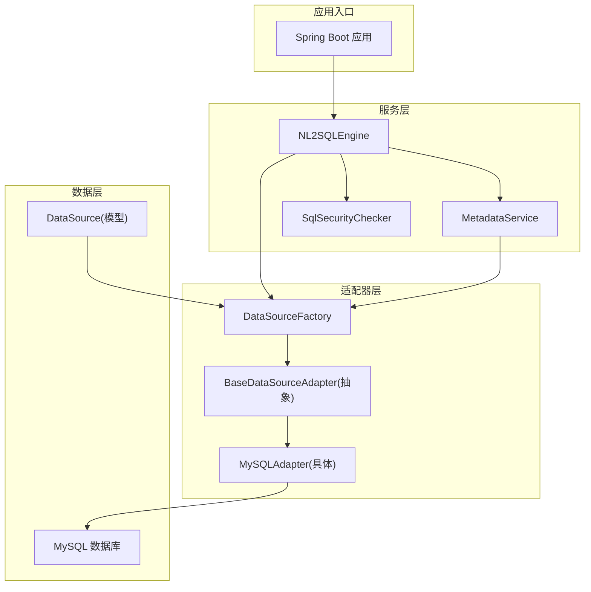
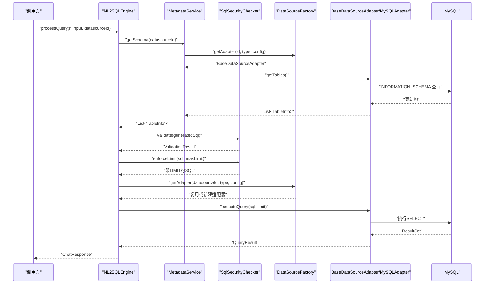
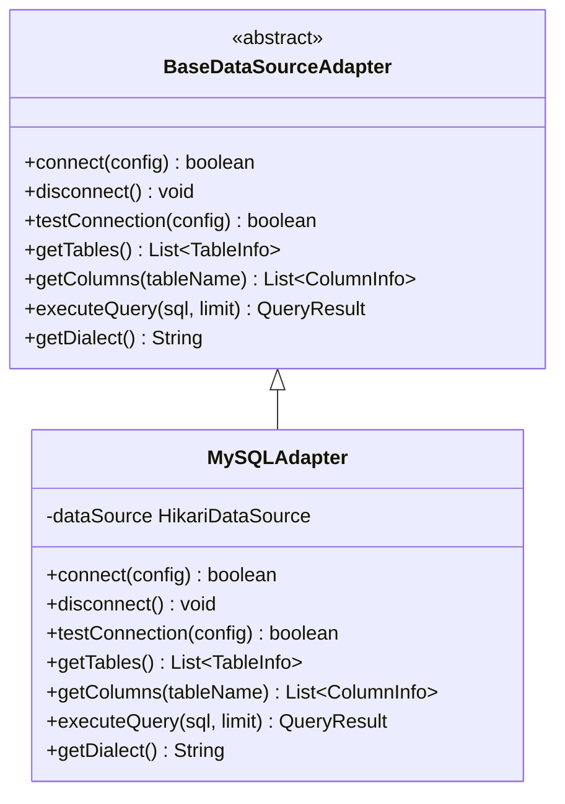
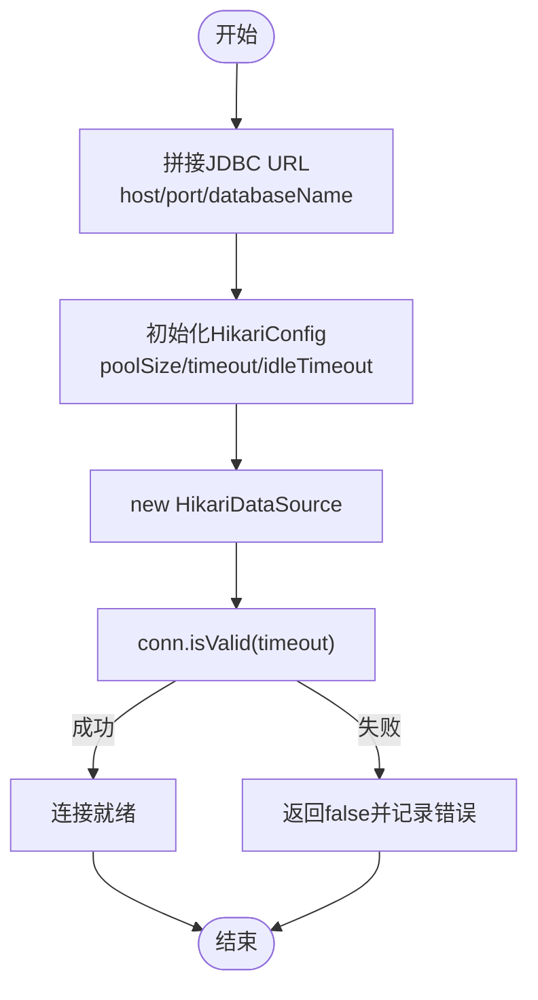
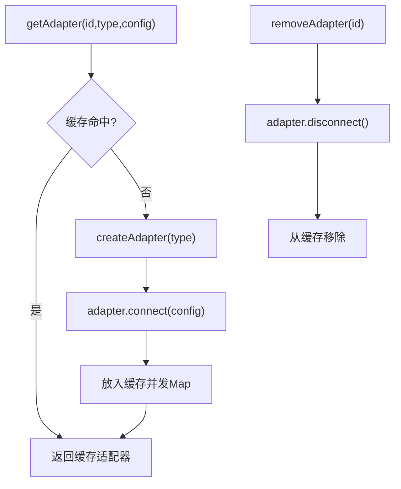
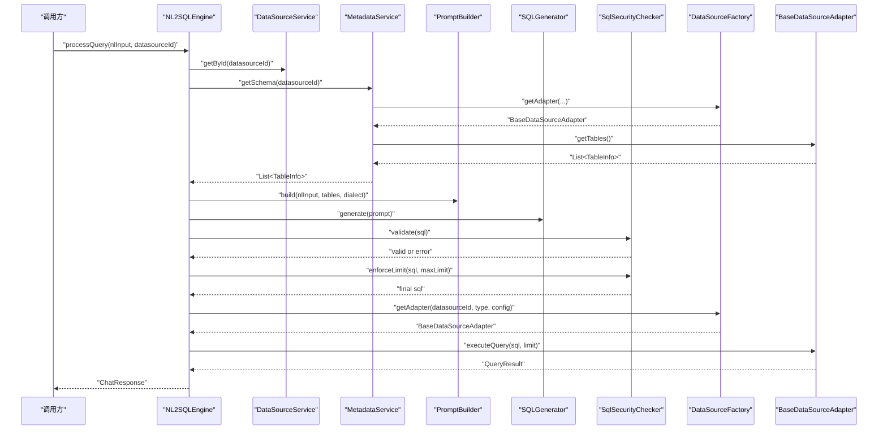
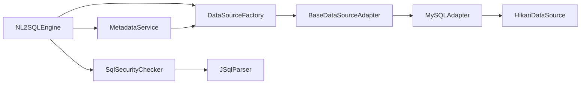

# 适配器模式实现

<cite>
**本文引用的文件**
- [BaseDataSourceAdapter.java](file://backend/src/main/java/com/nlp2sql/adapter/BaseDataSourceAdapter.java)
- [MySQLAdapter.java](file://backend/src/main/java/com/nlp2sql/adapter/MySQLAdapter.java)
- [DataSourceFactory.java](file://backend/src/main/java/com/nlp2sql/adapter/DataSourceFactory.java)
- [DataSource.java](file://backend/src/main/java/com/nlp2sql/model/DataSource.java)
- [NL2SQLEngine.java](file://backend/src/main/java/com/nlp2sql/service/NL2SQLEngine.java)
- [MetadataService.java](file://backend/src/main/java/com/nlp2sql/service/MetadataService.java)
- [SqlSecurityChecker.java](file://backend/src/main/java/com/nlp2sql/security/SqlSecurityChecker.java)
- [pom.xml](file://backend/pom.xml)
</cite>

## 目录
1. [引言](#引言)
2. [项目结构](#项目结构)
3. [核心组件](#核心组件)
4. [架构总览](#架构总览)
5. [详细组件分析](#详细组件分析)
6. [依赖关系分析](#依赖关系分析)
7. [性能考虑](#性能考虑)
8. [故障排查指南](#故障排查指南)
9. [结论](#结论)
10. [附录：自定义适配器开发指南](#附录自定义适配器开发指南)

## 引言
本文件聚焦于数据源适配器模式的实现，围绕 BaseDataSourceAdapter 的模板方法设计、MySQLAdapter 的具体方言实现、以及 DataSourceFactory 的生命周期与缓存管理展开。同时说明 NL2SQLEngine、MetadataService、SqlSecurityChecker 等上层组件如何协作完成“自然语言到 SQL”的查询执行流程，并提供扩展新数据源适配器的完整规范与实践建议。

## 项目结构
后端采用 Spring Boot + MyBatis-Plus + JSqlParser 的技术栈，数据访问层通过适配器模式屏蔽不同数据库的差异。关键位置如下：
- 适配器抽象与实现：com.nlp2sql.adapter
- 数据模型与 DTO：com.nlp2sql.model 与 com.nlp2sql.model.dto
- 服务层：com.nlp2sql.service
- 安全校验：com.nlp2sql.security
- 配置与依赖：backend/pom.xml

图表来源
- [NL2SQLEngine.java:1-127](file://backend/src/main/java/com/nlp2sql/service/NL2SQLEngine.java#L1-L127)
- [MetadataService.java:1-93](file://backend/src/main/java/com/nlp2sql/service/MetadataService.java#L1-L93)
- [SqlSecurityChecker.java:1-88](file://backend/src/main/java/com/nlp2sql/security/SqlSecurityChecker.java#L1-L88)
- [DataSourceFactory.java:1-49](file://backend/src/main/java/com/nlp2sql/adapter/DataSourceFactory.java#L1-L49)
- [BaseDataSourceAdapter.java:1-25](file://backend/src/main/java/com/nlp2sql/adapter/BaseDataSourceAdapter.java#L1-L25)
- [MySQLAdapter.java:1-203](file://backend/src/main/java/com/nlp2sql/adapter/MySQLAdapter.java#L1-L203)
- [DataSource.java:1-48](file://backend/src/main/java/com/nlp2sql/model/DataSource.java#L1-L48)

章节来源
- [pom.xml:1-194](file://backend/pom.xml#L1-L194)

## 核心组件
- BaseDataSourceAdapter：定义数据源连接的统一接口，包括连接、断开、测试连接、获取表与列、执行查询、方言标识等抽象方法。
- MySQLAdapter：基于 HikariCP 连接池实现 MySQL 的方言适配、JDBC 操作、结果封装。
- DataSourceFactory：按类型创建并缓存适配器实例，提供连接测试与清理能力。
- NL2SQLEngine：编排 Schema 获取、Prompt 构建、SQL 生成、安全校验、执行查询与审计记录。
- MetadataService：从数据源拉取 Schema，结合 Redis 缓存加速后续查询。
- SqlSecurityChecker：基于 JSqlParser 进行 SQL 白名单校验、注入检测与 LIMIT 强制。

章节来源
- [BaseDataSourceAdapter.java:1-25](file://backend/src/main/java/com/nlp2sql/adapter/BaseDataSourceAdapter.java#L1-L25)
- [MySQLAdapter.java:1-203](file://backend/src/main/java/com/nlp2sql/adapter/MySQLAdapter.java#L1-L203)
- [DataSourceFactory.java:1-49](file://backend/src/main/java/com/nlp2sql/adapter/DataSourceFactory.java#L1-L49)
- [NL2SQLEngine.java:1-127](file://backend/src/main/java/com/nlp2sql/service/NL2SQLEngine.java#L1-L127)
- [MetadataService.java:1-93](file://backend/src/main/java/com/nlp2sql/service/MetadataService.java#L1-L93)
- [SqlSecurityChecker.java:1-88](file://backend/src/main/java/com/nlp2sql/security/SqlSecurityChecker.java#L1-L88)

## 架构总览
下图展示了从用户输入到最终结果的端到端调用链，突出适配器在其中的角色。

图表来源
- [NL2SQLEngine.java:1-127](file://backend/src/main/java/com/nlp2sql/service/NL2SQLEngine.java#L1-L127)
- [MetadataService.java:1-93](file://backend/src/main/java/com/nlp2sql/service/MetadataService.java#L1-L93)
- [SqlSecurityChecker.java:1-88](file://backend/src/main/java/com/nlp2sql/security/SqlSecurityChecker.java#L1-L88)
- [DataSourceFactory.java:1-49](file://backend/src/main/java/com/nlp2sql/adapter/DataSourceFactory.java#L1-L49)
- [MySQLAdapter.java:1-203](file://backend/src/main/java/com/nlp2sql/adapter/MySQLAdapter.java#L1-L203)

## 详细组件分析

### BaseDataSourceAdapter：模板方法与通用职责
BaseDataSourceAdapter 定义了所有数据源适配器必须实现的统一契约：
- 连接管理：connect(config)、disconnect()
- 连接测试：testConnection(config)
- 元数据读取：getTables()、getColumns(tableName)
- 查询执行：executeQuery(sql, limit)
- 方言标识：getDialect()

该抽象类不包含具体实现，但明确了各子类的职责边界，便于上层服务以统一方式调用不同数据库。

图表来源
- [BaseDataSourceAdapter.java:1-25](file://backend/src/main/java/com/nlp2sql/adapter/BaseDataSourceAdapter.java#L1-L25)
- [MySQLAdapter.java:1-203](file://backend/src/main/java/com/nlp2sql/adapter/MySQLAdapter.java#L1-L203)

章节来源
- [BaseDataSourceAdapter.java:1-25](file://backend/src/main/java/com/nlp2sql/adapter/BaseDataSourceAdapter.java#L1-L25)

### MySQLAdapter：MySQL 方言与连接细节
MySQLAdapter 实现了 BaseDataSourceAdapter 的全部抽象方法，关键点如下：
- 连接建立
  - 使用 HikariConfig 构造 HikariDataSource，设置 JDBC URL、用户名、密码及连接池参数（最大池大小、空闲超时、连接超时）。
  - 通过 Connection.isValid(timeout) 验证连接有效性。
- 断开连接
  - 检查 dataSource 是否已关闭后再关闭，避免重复关闭异常。
- 测试连接
  - 临时创建 HikariDataSource，最小化资源占用后释放。
- 元数据读取
  - 通过 INFORMATION_SCHEMA.TABLES 与 COLUMNS 读取表与列信息，映射为 TableInfo 与 ColumnInfo。
- 查询执行
  - 使用 Statement 执行 SELECT，设置查询超时；解析 ResultSetMetaData 得到列名；将行转为 Map<String,Object> 列表；统计行数并封装 QueryResult。
- 方言标识
  - 返回 MySQL 方言字符串，供 Prompt 构建时使用。

图表来源
- [MySQLAdapter.java:1-203](file://backend/src/main/java/com/nlp2sql/adapter/MySQLAdapter.java#L1-L203)

章节来源
- [MySQLAdapter.java:1-203](file://backend/src/main/java/com/nlp2sql/adapter/MySQLAdapter.java#L1-L203)

### DataSourceFactory：工厂与生命周期管理
DataSourceFactory 负责：
- 根据数据类型创建对应适配器实例。
- 以 datasourceId 为键缓存适配器，避免重复创建。
- 首次 getAdapter 时自动 connect。
- removeAdapter 时主动 disconnect，防止连接泄漏。
- testConnection 用于无状态连接测试。

图表来源
- [DataSourceFactory.java:1-49](file://backend/src/main/java/com/nlp2sql/adapter/DataSourceFactory.java#L1-L49)

章节来源
- [DataSourceFactory.java:1-49](file://backend/src/main/java/com/nlp2sql/adapter/DataSourceFactory.java#L1-L49)

### NL2SQLEngine：编排查询流水线
NL2SQLEngine 串联以下阶段：
- 从 DataSourceService 获取数据源配置。
- 通过 MetadataService 获取 Schema（含缓存）。
- 使用 PromptBuilder 与 SQLGenerator 生成 SQL。
- 通过 SqlSecurityChecker 做语法与安全校验，并强制添加 LIMIT。
- 通过 DataSourceFactory 获取适配器并执行查询。
- 记录审计日志。

图表来源
- [NL2SQLEngine.java:1-127](file://backend/src/main/java/com/nlp2sql/service/NL2SQLEngine.java#L1-L127)
- [MetadataService.java:1-93](file://backend/src/main/java/com/nlp2sql/service/MetadataService.java#L1-L93)
- [SqlSecurityChecker.java:1-88](file://backend/src/main/java/com/nlp2sql/security/SqlSecurityChecker.java#L1-L88)
- [DataSourceFactory.java:1-49](file://backend/src/main/java/com/nlp2sql/adapter/DataSourceFactory.java#L1-L49)
- [BaseDataSourceAdapter.java:1-25](file://backend/src/main/java/com/nlp2sql/adapter/BaseDataSourceAdapter.java#L1-L25)

章节来源
- [NL2SQLEngine.java:1-127](file://backend/src/main/java/com/nlp2sql/service/NL2SQLEngine.java#L1-L127)

### MetadataService：Schema 缓存与刷新
- 优先从 Redis 读取 Schema 缓存，减少频繁访问数据库。
- 未命中则通过 DataSourceFactory 获取适配器并拉取表结构，再写回缓存。
- refreshCache 删除缓存并重建 Schema。
- 提供 getTables/getColumns 便捷方法。

章节来源
- [MetadataService.java:1-93](file://backend/src/main/java/com/nlp2sql/service/MetadataService.java#L1-L93)

### SqlSecurityChecker：SQL 安全校验与 LIMIT 强制
- 黑名单关键词拦截危险语句。
- 使用 JSqlParser 解析 SQL，仅允许 SELECT。
- 正则检测堆叠查询、UNION 注入等风险模式。
- enforceLimit 确保查询带有上限，防止大结果集拖垮系统。

章节来源
- [SqlSecurityChecker.java:1-88](file://backend/src/main/java/com/nlp2sql/security/SqlSecurityChecker.java#L1-L88)

### DataSource 模型与配置转换
- DataSource 存储数据源基础信息（名称、类型、主机、端口、库名、用户名、密码、额外配置）。
- toAdapterConfig 将实体转换为适配器所需的 Map 配置，供工厂创建适配器时使用。

章节来源
- [DataSource.java:1-48](file://backend/src/main/java/com/nlp2sql/model/DataSource.java#L1-L48)

## 依赖关系分析
- NL2SQLEngine 依赖：PromptBuilder、SQLGenerator、SqlSecurityChecker、MetadataService、DataSourceFactory、AuditService、DataSourceService、AuthService、ModelProperties。
- MetadataService 依赖：RedisTemplate、DataSourceFactory、DataSourceService。
- MySQLAdapter 依赖：HikariCP、JDBC、SLF4J。
- SqlSecurityChecker 依赖：JSqlParser。

图表来源
- [NL2SQLEngine.java:1-127](file://backend/src/main/java/com/nlp2sql/service/NL2SQLEngine.java#L1-L127)
- [MetadataService.java:1-93](file://backend/src/main/java/com/nlp2sql/service/MetadataService.java#L1-L93)
- [SqlSecurityChecker.java:1-88](file://backend/src/main/java/com/nlp2sql/security/SqlSecurityChecker.java#L1-L88)
- [DataSourceFactory.java:1-49](file://backend/src/main/java/com/nlp2sql/adapter/DataSourceFactory.java#L1-L49)
- [MySQLAdapter.java:1-203](file://backend/src/main/java/com/nlp2sql/adapter/MySQLAdapter.java#L1-L203)

章节来源
- [pom.xml:1-194](file://backend/pom.xml#L1-L194)

## 性能考虑
- 连接池优化
  - MySQLAdapter 默认最大连接数为 5，空闲超时 300s，连接超时 10s。可根据并发与数据库承载能力调整 maximumPoolSize、idleTimeout、connectionTimeout。
- 查询超时控制
  - executeQuery 设置 statement 查询超时，避免长事务阻塞连接。
- 结果集限制
  - NL2SQLEngine 通过 maxLimit 限制返回行数；SqlSecurityChecker.enforceLimit 保证 SQL 中带有 LIMIT。
- Schema 缓存
  - MetadataService 使用 Redis 缓存表结构，降低频繁元数据查询开销。
- 适配器复用
  - DataSourceFactory 以 datasourceId 为键缓存适配器实例，避免重复创建连接池。
- 批量操作建议
  - 当前 executeQuery 面向单条 SELECT；如需批量写入/更新，可在新的适配器方法中引入批处理接口，并配合事务边界管理。

[本节为通用性能指导，不直接分析具体代码文件]

## 故障排查指南
- 连接失败
  - 检查 host/port/databaseName/username/password 是否正确；确认网络可达与防火墙策略；查看 MySQLAdapter 的连接日志。
- 元数据读取失败
  - 确认数据库用户具有 INFORMATION_SCHEMA 读取权限；检查 schema 是否为空导致后续步骤失败。
- SQL 校验失败
  - 若被识别为非法关键字或非 SELECT，需调整 Prompt 或重试逻辑；查看 SqlSecurityChecker 的错误消息。
- 查询执行异常
  - 关注 executeQuery 中的 SQLException 日志；检查 SQL 语法与 LIMIT 限制；必要时提高 max-limit 配置。
- 适配器未释放
  - 使用 DataSourceFactory.removeAdapter 显式释放；确保 MetadataService.refreshCache 后能重建缓存。

章节来源
- [MySQLAdapter.java:1-203](file://backend/src/main/java/com/nlp2sql/adapter/MySQLAdapter.java#L1-L203)
- [SqlSecurityChecker.java:1-88](file://backend/src/main/java/com/nlp2sql/security/SqlSecurityChecker.java#L1-L88)
- [DataSourceFactory.java:1-49](file://backend/src/main/java/com/nlp2sql/adapter/DataSourceFactory.java#L1-L49)

## 结论
本项目通过 BaseDataSourceAdapter 抽象出数据源操作的统一契约，MySQLAdapter 作为第一个具体实现承担连接池、方言差异与结果封装职责。DataSourceFactory 提供适配器创建与生命周期管理，配合 MetadataService 的 Schema 缓存与 NL2SQLEngine 的流水线编排，形成稳定可扩展的数据访问层。SqlSecurityChecker 保障 SQL 的安全性与可控性。整体架构清晰、可维护性强，适合继续扩展更多数据库类型。

## 附录：自定义适配器开发指南

### 接口规范
实现 BaseDataSourceAdapter 的所有抽象方法：
- connect(Map<String,Object>)：依据配置建立连接；返回布尔值表示是否成功。
- disconnect()：释放底层连接资源。
- testConnection(Map<String,Object>)：轻量级连通性测试，通常不应持久持有连接。
- getTables()：返回表清单，包含注释等元数据。
- getColumns(String tableName)：返回字段清单，包含类型、键、默认值、可空性等。
- executeQuery(String sql, int limit)：执行只读查询，返回 QueryResult（包含列名、行数据、行数、耗时、是否成功与错误信息）。
- getDialect()：返回数据库方言标识，用于 Prompt 构建。

章节来源
- [BaseDataSourceAdapter.java:1-25](file://backend/src/main/java/com/nlp2sql/adapter/BaseDataSourceAdapter.java#L1-L25)

### 配置要求
- 配置键约定：host、port、databaseName、username、password（可由 DataSource.toAdapterConfig 提供）。
- 额外配置：可通过 extraConfig 字段传递特定参数（如驱动类、SSL、时区等），由具体适配器解析。

章节来源
- [DataSource.java:1-48](file://backend/src/main/java/com/nlp2sql/model/DataSource.java#L1-L48)

### 工厂注册
- 在 DataSourceFactory.createAdapter 中新增 case 分支，返回你的适配器实例。
- 建议使用 switch 表达式，保持类型集中管理。

章节来源
- [DataSourceFactory.java:1-49](file://backend/src/main/java/com/nlp2sql/adapter/DataSourceFactory.java#L1-L49)

### 测试方法
- 单元测试建议覆盖：
  - connect/testConnection 成功与失败路径。
  - getTables/getColumns 正常与空结果场景。
  - executeQuery 成功、空结果、SQL 异常、超时。
  - disconnect 多次调用不抛异常。
- 集成测试建议：
  - 使用测试数据库实例，验证真实方言行为与分页效果。
  - 校验 Schema 缓存命中率与失效刷新。

[本节为通用测试指导，不直接分析具体代码文件]

### 最佳实践
- 连接池
  - 合理设置最大连接数、空闲超时、连接超时；避免过大连接数导致数据库过载。
- 事务处理
  - 当前适配器仅支持只读 SELECT；如需写操作，请在新的方法中明确事务边界，并在调用方控制提交/回滚。
- 错误处理
  - 统一捕获底层异常，记录结构化日志，返回标准错误信息。
- 性能优化
  - 限制结果集大小；使用 PreparedStatement 防注入；对高频元数据查询启用缓存。
  - 避免在循环内频繁创建连接；复用 Statement/ResultSet 上下文。
- 可观测性
  - 记录连接池指标、SQL 执行时间、失败率；在 NL2SQLEngine 中已有执行时长统计。

[本节为通用最佳实践，不直接分析具体代码文件]