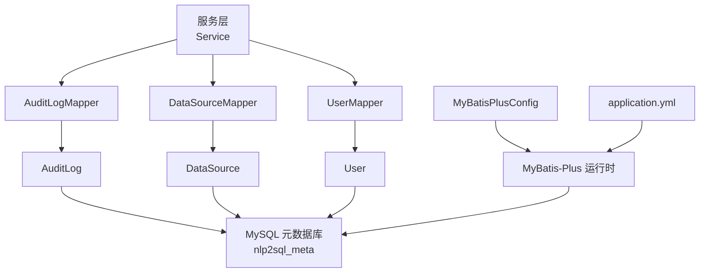
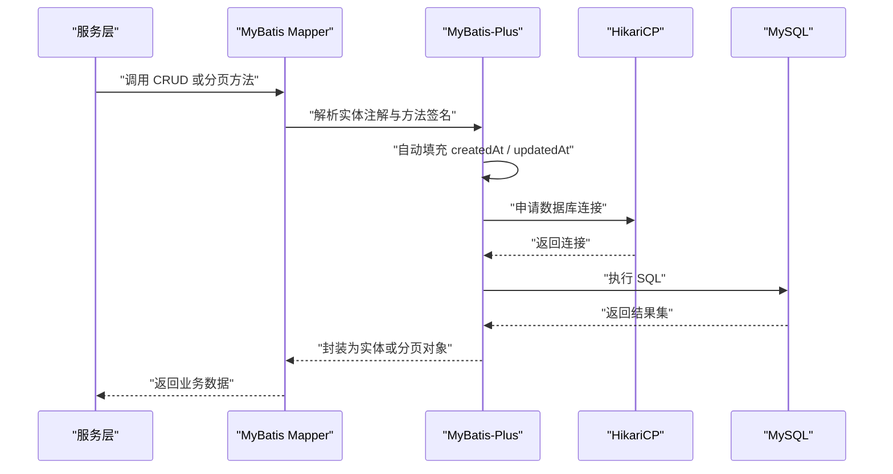
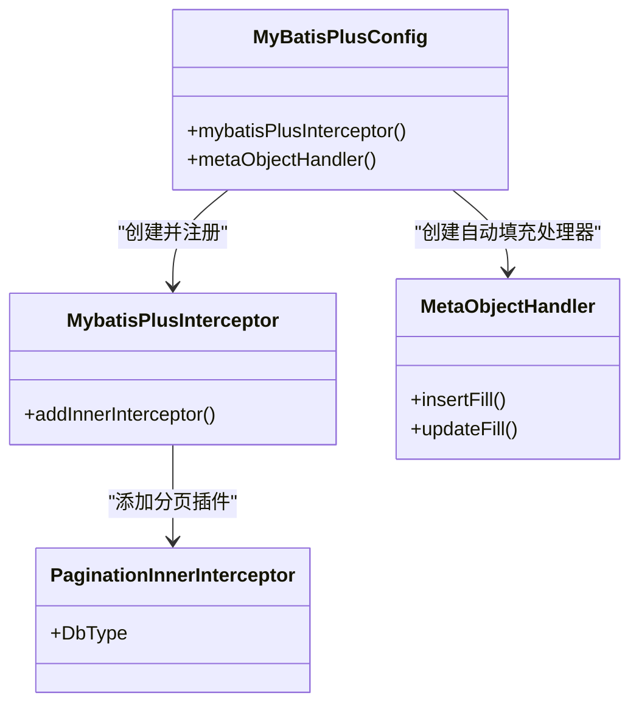
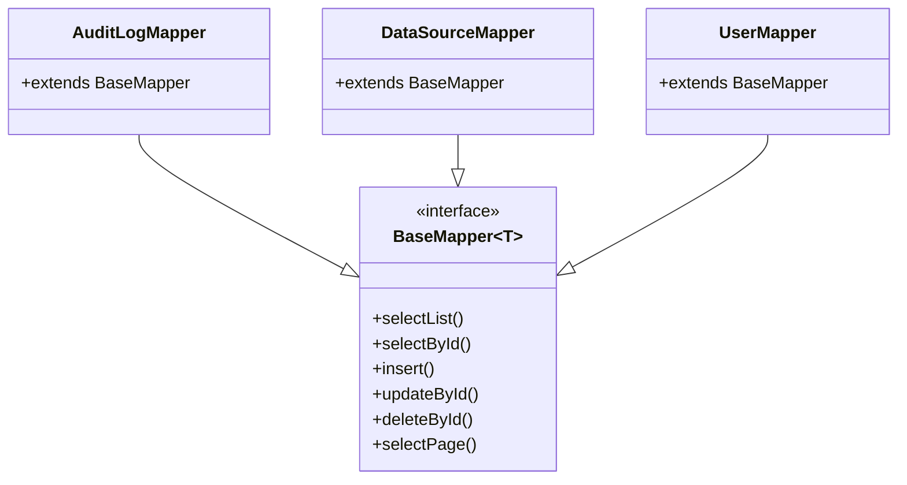
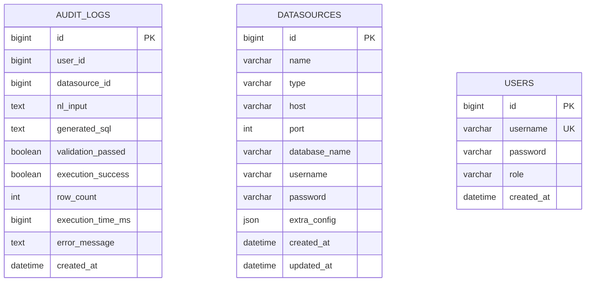
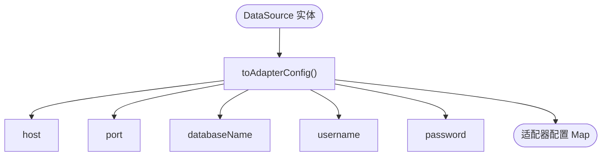
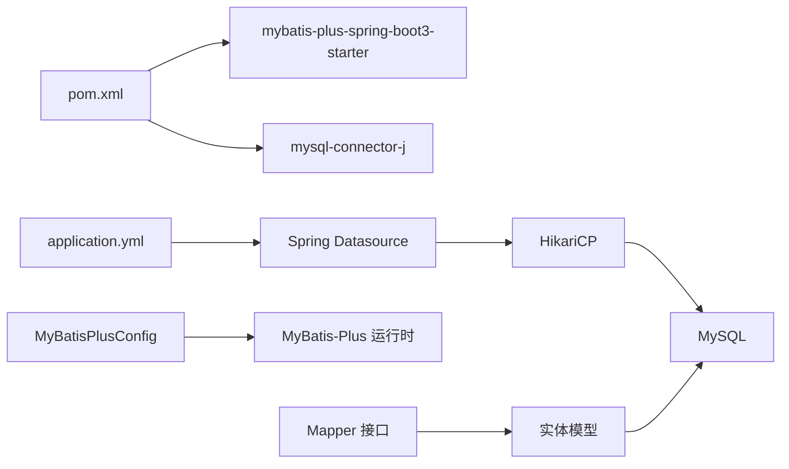

# 数据访问层

<cite>
**本文引用的文件**   
- [MyBatisPlusConfig.java](file://backend/src/main/java/com/nlp2sql/config/MyBatisPlusConfig.java)
- [AuditLogMapper.java](file://backend/src/main/java/com/nlp2sql/mapper/AuditLogMapper.java)
- [DataSourceMapper.java](file://backend/src/main/java/com/nlp2sql/mapper/DataSourceMapper.java)
- [UserMapper.java](file://backend/src/main/java/com/nlp2sql/mapper/UserMapper.java)
- [AuditLog.java](file://backend/src/main/java/com/nlp2sql/model/AuditLog.java)
- [DataSource.java](file://backend/src/main/java/com/nlp2sql/model/DataSource.java)
- [User.java](file://backend/src/main/java/com/nlp2sql/model/User.java)
- [application.yml](file://backend/src/main/resources/application.yml)
- [pom.xml](file://backend/pom.xml)
- [init_backend.sql](file://sql/init_backend.sql)
</cite>

## 目录

1. [引言](#引言)
2. [项目结构中的数据访问层](#项目结构中的数据访问层)
3. [核心组件总览](#核心组件总览)
4. [架构概览](#架构概览)
5. [详细组件分析](#详细组件分析)
6. [依赖关系分析](#依赖关系分析)
7. [性能与连接池调优](#性能与连接池调优)
8. [复杂查询、分页与事务最佳实践](#复杂查询分页与事务最佳实践)
9. [故障排查指南](#故障排查指南)
10. [结论](#结论)

## 引言

本文聚焦 NL2SQL 后端的数据访问层，围绕 MyBatis-Plus 的配置、ORM 映射策略、Mapper 接口设计、实体模型规范、分页机制、批量操作方式以及数据库连接池配置展开。该数据访问层基于 Spring Boot 3、MyBatis-Plus 3.5.7 和 MySQL 元数据库构建，负责管理三类核心业务表：数据源配置表、用户表和审计日志表。

从职责上看，数据访问层并不直接处理自然语言转 SQL 的业务逻辑，而是为上层服务提供稳定的持久化能力：保存数据源元信息、维护系统用户、记录审计日志，并支持后续扩展更多业务表。

## 项目结构中的数据访问层

在项目中，数据访问层主要分布在以下三个包中：

| 层次 | 包路径 | 职责 |
|---|---|---|
| 配置层 | `com.nlp2sql.config` | 注册 MyBatis-Plus 插件、自动填充处理器等全局行为 |
| 数据访问层 | `com.nlp2sql.mapper` | 声明各表的 Mapper 接口 |
| 模型层 | `com.nlp2sql.model` | 定义 ORM 实体类及字段映射 |
| 资源层 | `backend/src/main/resources` | 数据库连接、Redis、MyBatis-Plus 全局配置 |
| 数据库脚本 | `sql/init_backend.sql` | 元数据库建表语句 |

**图示来源**   
- [MyBatisPlusConfig.java:1-38](file://backend/src/main/java/com/nlp2sql/config/MyBatisPlusConfig.java#L1-L38)
- [AuditLogMapper.java:1-9](file://backend/src/main/java/com/nlp2sql/mapper/AuditLogMapper.java#L1-L9)
- [DataSourceMapper.java:1-9](file://backend/src/main/java/com/nlp2sql/mapper/DataSourceMapper.java#L1-L9)
- [UserMapper.java:1-9](file://backend/src/main/java/com/nlp2sql/mapper/UserMapper.java#L1-L9)
- [AuditLog.java:1-34](file://backend/src/main/java/com/nlp2sql/model/AuditLog.java#L1-L34)
- [DataSource.java:1-48](file://backend/src/main/java/com/nlp2sql/model/DataSource.java#L1-L48)
- [User.java:1-22](file://backend/src/main/java/com/nlp2sql/model/User.java#L1-L22)
- [application.yml:1-117](file://backend/src/main/resources/application.yml#L1-L117)

**章节来源**   
- [MyBatisPlusConfig.java:1-38](file://backend/src/main/java/com/nlp2sql/config/MyBatisPlusConfig.java#L1-L38)
- [application.yml:1-117](file://backend/src/main/resources/application.yml#L1-L117)
- [init_backend.sql:1-47](file://sql/init_backend.sql#L1-L47)

## 核心组件总览

数据访问层的核心由四部分组成：

1. **MyBatis-Plus 配置**：启用分页插件、设置自动填充时间字段、开启驼峰命名映射。
2. **Mapper 接口**：继承 `BaseMapper`，获得增删改查、条件构造、分页等通用能力。
3. **实体模型**：使用 Lombok 简化代码，通过 MyBatis-Plus 注解完成表名、主键、字段填充策略映射。
4. **应用配置**：通过 Spring Boot 配置数据源、HikariCP 连接池、MyBatis-Plus 全局行为和日志实现。

当前项目中的三个 Mapper 都是轻量接口，没有自定义 XML SQL；因此查询优化主要依赖 MyBatis-Plus 的条件构造器、分页插件和合理的索引设计。

**章节来源**   
- [AuditLogMapper.java:1-9](file://backend/src/main/java/com/nlp2sql/mapper/AuditLogMapper.java#L1-L9)
- [DataSourceMapper.java:1-9](file://backend/src/main/java/com/nlp2sql/mapper/DataSourceMapper.java#L1-L9)
- [UserMapper.java:1-9](file://backend/src/main/java/com/nlp2sql/mapper/UserMapper.java#L1-L9)
- [application.yml:86-102](file://backend/src/main/resources/application.yml#L86-L102)

## 架构概览

下图展示了一次典型的数据访问调用流程：服务层调用 Mapper，MyBatis-Plus 将实体对象映射到 SQL，并通过 HikariCP 获取数据库连接执行查询或更新。

**图示来源**   
- [MyBatisPlusConfig.java:10-38](file://backend/src/main/java/com/nlp2sql/config/MyBatisPlusConfig.java#L10-L38)
- [application.yml:10-25](file://backend/src/main/resources/application.yml#L10-L25)

## 详细组件分析

### MyBatis-Plus 配置分析

`MyBatisPlusConfig` 是数据访问层的关键配置类，主要承担两个职责：

1. **注册分页拦截器**  
   - 通过 `MybatisPlusInterceptor` 添加 `PaginationInnerInterceptor`。
   - 指定数据库类型为 MySQL。
   - 这样在使用 MyBatis-Plus 的分页 API 时，框架会自动改写 SQL 并追加分页参数。

2. **注册自动填充处理器**  
   - 插入时填充 `createdAt` 和 `updatedAt`。
   - 更新时填充 `updatedAt`。
   - 配合实体类中的 `@TableField(fill = FieldFill.*)` 使用。

这种设计把“公共字段自动填充”从业务代码中剥离出来，避免每个 Service 重复写时间赋值逻辑。

**图示来源**   
- [MyBatisPlusConfig.java:10-38](file://backend/src/main/java/com/nlp2sql/config/MyBatisPlusConfig.java#L10-L38)

**章节来源**   
- [MyBatisPlusConfig.java:1-38](file://backend/src/main/java/com/nlp2sql/config/MyBatisPlusConfig.java#L1-L38)

### Mapper 接口分析

当前三个 Mapper 都采用最简风格：继承 `BaseMapper<T>` 并使用 `@Mapper` 注解。这意味着它们直接使用 MyBatis-Plus 提供的通用方法，例如：

| Mapper | 对应表 | 主要用途 |
|---|---|---|
| `AuditLogMapper` | `audit_logs` | 记录自然语言查询的审计日志 |
| `DataSourceMapper` | `datasources` | 管理外部数据源配置 |
| `UserMapper` | `users` | 管理系统用户 |

由于没有自定义 XML SQL，当前实现的查询优化空间主要体现在：

- 使用 MyBatis-Plus 的 `QueryWrapper` 或 `LambdaQueryWrapper` 精确构造条件。
- 避免无必要的全表扫描。
- 利用数据库索引。
- 在需要批量写入时使用 MyBatis-Plus 或 JDBC 批处理方式。

**图示来源**   
- [AuditLogMapper.java:1-9](file://backend/src/main/java/com/nlp2sql/mapper/AuditLogMapper.java#L1-L9)
- [DataSourceMapper.java:1-9](file://backend/src/main/java/com/nlp2sql/mapper/DataSourceMapper.java#L1-L9)
- [UserMapper.java:1-9](file://backend/src/main/java/com/nlp2sql/mapper/UserMapper.java#L1-L9)

**章节来源**   
- [AuditLogMapper.java:1-9](file://backend/src/main/java/com/nlp2sql/mapper/AuditLogMapper.java#L1-L9)
- [DataSourceMapper.java:1-9](file://backend/src/main/java/com/nlp2sql/mapper/DataSourceMapper.java#L1-L9)
- [UserMapper.java:1-9](file://backend/src/main/java/com/nlp2sql/mapper/UserMapper.java#L1-L9)

### 实体模型设计与字段映射规则

#### 实体关系图

**图示来源**   
- [init_backend.sql:7-47](file://sql/init_backend.sql#L7-L47)

#### 字段映射要点

| 实体 | 表名 | 主键策略 | 自动填充字段 | 特殊映射说明 |
|---|---|---|---|---|
| `AuditLog` | `audit_logs` | 自增 | `createdAt` | 审计日志不需要 `updatedAt` |
| `DataSource` | `datasources` | 自增 | `createdAt`、`updatedAt` | 额外配置以字符串形式存储 JSON |
| `User` | `users` | 自增 | `createdAt` | 用户名唯一，密码使用 BCrypt 加密 |

#### 自动填充语义

- `@TableId(type = IdType.AUTO)`：表示主键由数据库自增生成。
- `@TableField(fill = FieldFill.INSERT)`：仅在插入时填充。
- `@TableField(fill = FieldFill.INSERT_UPDATE)`：插入和更新时都填充。
- `MetaObjectHandler.insertFill`：同时填充 `createdAt` 和 `updatedAt`。
- `MetaObjectHandler.updateFill`：仅更新 `updatedAt`。

#### 数据源实体的适配器转换

`DataSource.toAdapterConfig()` 方法将实体转换为适配器所需的配置 Map，包含主机、端口、数据库名、用户名和密码。这个方法是 ORM 实体与数据源适配层之间的桥接点。

**图示来源**   
- [DataSource.java:1-48](file://backend/src/main/java/com/nlp2sql/model/DataSource.java#L1-L48)

**章节来源**   
- [AuditLog.java:1-34](file://backend/src/main/java/com/nlp2sql/model/AuditLog.java#L1-L34)
- [DataSource.java:1-48](file://backend/src/main/java/com/nlp2sql/model/DataSource.java#L1-L48)
- [User.java:1-22](file://backend/src/main/java/com/nlp2sql/model/User.java#L1-L22)
- [init_backend.sql:7-47](file://sql/init_backend.sql#L7-L47)

### MyBatis-Plus 全局配置与映射行为

`application.yml` 中 MyBatis-Plus 相关配置包括：

| 配置项 | 值 | 含义 |
|---|---|---|
| `mapper-locations` | `classpath:mapper/*.xml` | 预留 XML Mapper 扫描位置 |
| `type-aliases-package` | `com.nlp2sql.model` | 自动扫描实体类作为类型别名 |
| `map-underscore-to-camel-case` | `true` | 下划线字段自动映射到驼峰属性 |
| `log-impl` | Slf4j | 使用 SLF4J 输出 MyBatis 日志 |
| `global-config.db-config.id-type` | `auto` | 主键默认自增策略 |
| `logic-delete-field` | `deleted` | 逻辑删除字段名 |
| `logic-delete-value` | `1` | 逻辑删除值 |
| `logic-not-delete-value` | `0` | 未删除值 |

需要注意：当前实体类并没有统一声明 `deleted` 字段，但全局配置已经启用了逻辑删除能力。如果未来新增需要软删除的表，应优先复用这一约定。

**章节来源**   
- [application.yml:86-102](file://backend/src/main/resources/application.yml#L86-L102)

## 依赖关系分析

数据访问层的依赖关系如下：

**图示来源**   
- [pom.xml:1-194](file://backend/pom.xml#L1-L194)
- [application.yml:10-25](file://backend/src/main/resources/application.yml#L10-L25)
- [MyBatisPlusConfig.java:10-38](file://backend/src/main/java/com/nlp2sql/config/MyBatisPlusConfig.java#L10-L38)

**章节来源**   
- [pom.xml:1-194](file://backend/pom.xml#L1-L194)
- [application.yml:10-25](file://backend/src/main/resources/application.yml#L10-L25)

## 性能与连接池调优

### 数据库连接池

当前使用 Spring Boot 默认的 HikariCP 连接池，关键参数如下：

| 参数 | 当前值 | 建议 |
|---|---:|---|
| `maximum-pool-size` | 10 | 根据并发连接数和数据库承载能力调整；NL2SQL 场景通常不要求极高连接数 |
| `minimum-idle` | 5 | 保持最小空闲连接，减少冷启动延迟 |
| `connection-timeout` | 30000 毫秒 | 连接超时时间，可结合慢查询监控调整 |

### Redis 连接池

Redis 使用 Lettuce 连接池，当前配置：

| 参数 | 当前值 | 说明 |
|---:|---:|---|
| `max-active` | 8 | 最大活跃连接数 |
| `max-idle` | 8 | 最大空闲连接数 |
| `min-idle` | 0 | 最小空闲连接数 |
| `max-wait` | `-1ms` | 无限等待获取连接，存在潜在阻塞风险 |

建议在压测环境中观察 Redis 连接等待情况，必要时限制 `max-wait` 并合理调整连接池大小。

### MyBatis 日志

当前启用 SLF4J 日志实现，便于通过日志框架统一收集 SQL 执行信息。生产环境建议关闭详细 SQL 日志或降低日志级别，避免 IO 成为瓶颈。

**章节来源**   
- [application.yml:10-25](file://backend/src/main/resources/application.yml#L10-L25)
- [application.yml:27-45](file://backend/src/main/resources/application.yml#L27-L45)
- [application.yml:92-98](file://backend/src/main/resources/application.yml#L92-L98)

## 复杂查询、分页与事务最佳实践

### 复杂查询

当前 Mapper 未提供自定义 SQL，复杂查询推荐遵循以下模式：

1. 使用 `LambdaQueryWrapper` 编写类型安全的条件。
2. 避免 `SELECT *`，只查询必要字段。
3. 对高频过滤字段建立数据库索引。
4. 如需多表关联，可在 Mapper 中添加自定义 XML SQL，并在 `mapper-locations` 中扫描。
5. 对于审计日志这类高写入表，应避免在热点路径中进行复杂查询。

数据库脚本中已为审计日志表创建两个索引：

| 索引列 | 用途 |
|---|---|
| `user_id` | 按用户查询审计记录 |
| `created_at` | 按时间范围查询审计记录 |

**章节来源**   
- [init_backend.sql:31-47](file://sql/init_backend.sql#L31-L47)

### 分页查询

分页查询依赖 `PaginationInnerInterceptor`。使用 MyBatis-Plus 的 `IPage` 或分页查询 API 时，框架会拦截 SQL 并追加分页逻辑。

最佳实践：

- 始终为分页查询指定合理上限，防止一次返回过多数据。
- 对分页排序字段建立索引。
- 避免在分页前进行全表聚合或大结果集内存计算。
- 前端分页参数应与后端校验结合，防止恶意偏移量。

**章节来源**   
- [MyBatisPlusConfig.java:10-22](file://backend/src/main/java/com/nlp2sql/config/MyBatisPlusConfig.java#L10-L22)

### 批量操作

当前项目未显式暴露批量 Mapper 方法。若需批量写入，推荐以下方式：

1. **小批量写入**：多次调用 `insert` 或 `save`，适合少量数据。
2. **JDBC 批处理**：通过 `SqlSession` 或 `JdbcTemplate` 执行批提交，适合审计日志等高吞吐写入。
3. **MyBatis-Plus 扩展**：在 Mapper 中定义批量插入方法，配合 XML 或 Provider 实现。
4. **异步落库**：对审计日志等非强一致写入，可考虑先入队列再批量落库。

注意：大量单条插入会导致事务膨胀和连接占用时间增加，应尽量合并提交。

### 事务管理

虽然本节不分析具体 Service 实现，但从数据访问层角度，事务边界应由服务层控制：

- 写操作必须包裹在事务中。
- 跨多个 Mapper 的操作应放在同一个事务内。
- 读多写少场景可使用只读事务减少连接压力。
- 异常时应确保审计日志能够正确记录失败原因和执行耗时。

## 故障排查指南

### 常见问题

| 问题 | 可能原因 | 排查建议 |
|---|---|---|
| 启动时报数据源错误 | MySQL 地址、用户名、密码或驱动配置错误 | 检查 `application.yml` 的 `spring.datasource` 配置 |
| 时间字段为空 | 实体缺少自动填充注解或处理器未生效 | 检查 `@TableField(fill = ...)` 和 `MetaObjectHandler` |
| 分页无效 | 未注册分页插件或数据库类型不匹配 | 检查 `PaginationInnerInterceptor` 和 `DbType.MYSQL` |
| 驼峰字段未映射 | 未开启下划线转驼峰 | 检查 `map-underscore-to-camel-case` |
| 连接池耗尽 | 并发过高或连接未释放 | 调整 HikariCP 参数并检查长事务 |
| Redis 连接等待 | 连接池过小或 `max-wait` 过大 | 调整 Lettuce 连接池参数 |

### 数据库初始化

项目提供了元数据库初始化脚本，用于创建 `nlp2sql_meta` 数据库及其三张核心表。部署时应确保该脚本已在目标 MySQL 实例中执行。

**章节来源**   
- [application.yml:10-25](file://backend/src/main/resources/application.yml#L10-L25)
- [MyBatisPlusConfig.java:10-38](file://backend/src/main/java/com/nlp2sql/config/MyBatisPlusConfig.java#L10-L38)
- [init_backend.sql:1-47](file://sql/init_backend.sql#L1-L47)

## 结论

当前数据访问层采用简洁清晰的 MyBatis-Plus 方案：

- 通过配置类集中管理分页和自动填充。
- 通过 `BaseMapper` 快速获得通用 CRUD 能力。
- 通过实体注解完成表名、主键和字段填充映射。
- 通过 Spring Boot 配置统一管理数据库连接池和 MyBatis-Plus 行为。
- 通过数据库脚本明确表结构和索引策略。

后续可扩展方向包括：

- 为高频查询引入自定义 XML SQL。
- 为审计日志等高写入表设计专用批量写入通道。
- 根据压测结果调优 HikariCP 和 Redis 连接池。
- 为需要软删除的表启用逻辑删除字段。
- 在 Mapper 中补充类型安全且可复用的条件构造方法，提升查询可读性和一致性。