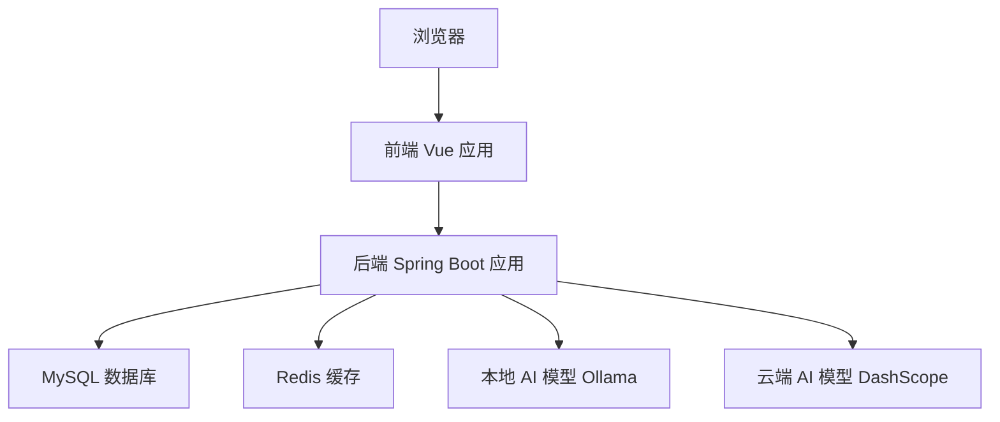
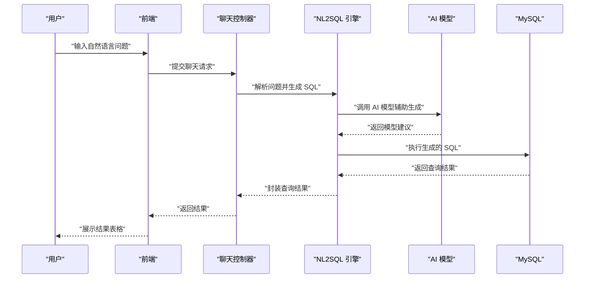

# 快速开始

<cite>
**本文引用的文件**   
- [backend/pom.xml](file://backend/pom.xml)
- [backend/src/main/resources/application.yml](file://backend/src/main/resources/application.yml)
- [backend/src/main/resources/application-ollama.yml](file://backend/src/main/resources/application-ollama.yml)
- [backend/src/main/java/com/nlp2sql/config/RedisConfig.java](file://backend/src/main/java/com/nlp2sql/config/RedisConfig.java)
- [backend/src/main/java/com/nlp2sql/config/ModelProperties.java](file://backend/src/main/java/com/nlp2sql/config/ModelProperties.java)
- [backend/src/main/java/com/nlp2sql/config/WebConfig.java](file://backend/src/main/java/com/nlp2sql/config/WebConfig.java)
- [backend/src/main/java/com/nlp2sql/security/JwtAuthenticationFilter.java](file://backend/src/main/java/com/nlp2sql/security/JwtAuthenticationFilter.java)
- [backend/src/main/java/com/nlp2sql/controller/AuthController.java](file://backend/src/main/java/com/nlp2sql/controller/AuthController.java)
- [backend/src/main/java/com/nlp2sql/controller/ChatController.java](file://backend/src/main/java/com/nlp2sql/controller/ChatController.java)
- [backend/src/main/java/com/nlp2sql/controller/DataSourceController.java](file://backend/src/main/java/com/nlp2sql/controller/DataSourceController.java)
- [backend/src/main/java/com/nlp2sql/service/NL2SQLEngine.java](file://backend/src/main/java/com/nlp2sql/service/NL2SQLEngine.java)
- [frontend/package.json](file://frontend/package.json)
- [frontend/vite.config.js](file://frontend/vite.config.js)
- [frontend/src/api/endpoints.js](file://frontend/src/api/endpoints.js)
- [sql/init_backend.sql](file://sql/init_backend.sql)
</cite>

## 目录
1. [简介](#简介)
2. [环境要求](#环境要求)
3. [安装步骤](#安装步骤)
4. [配置说明](#配置说明)
5. [启动与验证](#启动与验证)
6. [首次使用流程](#首次使用流程)
7. [常见问题排查](#常见问题排查)
8. [结论](#结论)

## 简介
本指南面向第一次接触 NL2SQL 系统的用户，目标是帮助你在本地或开发环境中独立完成部署，并成功执行第一个自然语言查询。系统由三部分组成：
- 后端：Spring Boot 应用，负责安全认证、数据源管理、元数据获取、NL2SQL 推理和 SQL 安全校验。
- 前端：Vue 3 + Vite 应用，提供对话式查询界面。
- 外部依赖：MySQL（业务数据）、Redis（会话/缓存）、AI 模型服务（Ollama 或 DashScope）。

**图示来源**
- [backend/src/main/java/com/nlp2sql/config/RedisConfig.java](file://backend/src/main/java/com/nlp2sql/config/RedisConfig.java)
- [backend/src/main/java/com/nlp2sql/config/ModelProperties.java](file://backend/src/main/java/com/nlp2sql/config/ModelProperties.java)
- [backend/src/main/java/com/nlp2sql/controller/ChatController.java](file://backend/src/main/java/com/nlp2sql/controller/ChatController.java)
- [backend/src/main/java/com/nlp2sql/service/NL2SQLEngine.java](file://backend/src/main/java/com/nlp2sql/service/NL2SQLEngine.java)

**章节来源**
- [backend/pom.xml:1-194](file://backend/pom.xml#L1-L194)

## 环境要求
- JDK 17+：后端基于 Spring Boot 3.3.4，编译目标为 Java 17。
- Maven：用于构建后端项目。
- Node.js 18+：前端使用 Vite 和 Vue 3。
- MySQL 8.0：存储业务数据和后端元数据。
- Redis 7.x：用于会话、缓存等场景。
- AI 模型服务（二选一）：
  - Ollama：本地运行，适合离线环境和调试。
  - DashScope：阿里云通义千问云端模型，需要 API Key。

**章节来源**
- [backend/pom.xml:1-194](file://backend/pom.xml#L1-L194)

## 安装步骤

### 一、准备外部依赖
1. 启动 MySQL 8.0，创建数据库，并执行初始化脚本。
2. 启动 Redis 7.x，确认默认端口可访问。
3. 选择 AI 模型服务：
   - 如果使用 Ollama，请安装并启动 Ollama，确保本地模型服务可用。
   - 如果使用 DashScope，请在控制台申请 API Key，并记录到环境变量或配置文件。

**章节来源**
- [sql/init_backend.sql](file://sql/init_backend.sql)

### 二、后端依赖安装与构建
1. 进入后端目录。
2. 使用 Maven 清理并编译项目。
3. 如果网络受限，请先配置 Maven 镜像源。

构建完成后，后端将生成可运行的 Spring Boot 应用包。

**章节来源**
- [backend/pom.xml:1-194](file://backend/pom.xml#L1-L194)

### 三、数据库初始化
在 MySQL 中执行后端初始化脚本，创建元数据库表结构；随后可根据需要导入示例业务数据。

建议顺序：
1. 执行后端元数据初始化脚本。
2. 如需演示功能，再导入示例业务数据。

**章节来源**
- [sql/init_backend.sql](file://sql/init_backend.sql)

### 四、前端依赖安装
1. 进入前端目录。
2. 使用 Node.js 包管理器安装依赖。
3. 安装完成后即可进入开发模式或构建生产版本。

**章节来源**
- [frontend/package.json](file://frontend/package.json)

## 配置说明

### 核心配置文件
后端主要使用以下配置文件：
- application.yml：基础配置，包括服务端口、数据库连接、Redis 连接、跨域、API 文档开关等。
- application-ollama.yml：Ollama 本地模型专用配置。

你可以根据实际部署环境修改这些文件。

**章节来源**
- [backend/src/main/resources/application.yml](file://backend/src/main/resources/application.yml)
- [backend/src/main/resources/application-ollama.yml](file://backend/src/main/resources/application-ollama.yml)

### 数据库连接配置
后端通过 MyBatis-Plus 访问 MySQL。你需要在 application.yml 中设置：
- JDBC URL
- 用户名
- 密码
- 驱动类名（通常由 Spring Boot 自动识别）

若业务数据位于不同库，可在数据源配置中分别维护多套连接信息。

**章节来源**
- [backend/pom.xml:1-194](file://backend/pom.xml#L1-L194)
- [backend/src/main/resources/application.yml](file://backend/src/main/resources/application.yml)

### Redis 配置
Redis 用于会话、缓存和性能优化。你需要在 application.yml 中配置：
- Redis 主机地址
- 端口
- 密码（如有）
- 数据库索引
- 连接池参数

后端通过 RedisConfig 注入 Redis 相关组件。

**章节来源**
- [backend/src/main/resources/application.yml](file://backend/src/main/resources/application.yml)
- [backend/src/main/java/com/nlp2sql/config/RedisConfig.java](file://backend/src/main/java/com/nlp2sql/config/RedisConfig.java)

### AI 模型配置

#### Ollama 模式
适用于本地离线环境。你需要：
1. 启动 Ollama 服务。
2. 在 application-ollama.yml 中启用 Ollama 模式。
3. 配置 Ollama 的 Base URL、模型名称、超时时间等参数。
4. 确保后端能通过网络访问 Ollama 接口。

**章节来源**
- [backend/src/main/resources/application-ollama.yml](file://backend/src/main/resources/application-ollama.yml)
- [backend/src/main/java/com/nlp2sql/config/ModelProperties.java](file://backend/src/main/java/com/nlp2sql/config/ModelProperties.java)

#### DashScope 模式
适用于云端模型调用。你需要：
1. 申请 DashScope API Key。
2. 在 application.yml 中配置 DashScope 的 API Key、Base URL、模型名称等。
3. 关闭或忽略 Ollama 配置，避免冲突。

DashScope 通过 Spring AI Alibaba Starter 接入后端。

**章节来源**
- [backend/pom.xml:1-194](file://backend/pom.xml#L1-L194)
- [backend/src/main/resources/application.yml](file://backend/src/main/resources/application.yml)
- [backend/src/main/java/com/nlp2sql/config/ModelProperties.java](file://backend/src/main/java/com/nlp2sql/config/ModelProperties.java)

### 跨域与安全配置
- WebConfig：定义跨域策略，允许前端开发服务器访问后端接口。
- JwtAuthenticationFilter：对请求进行 JWT 校验，保护受保护接口。
- AuthController：提供登录、注册等认证接口。

**章节来源**
- [backend/src/main/java/com/nlp2sql/config/WebConfig.java](file://backend/src/main/java/com/nlp2sql/config/WebConfig.java)
- [backend/src/main/java/com/nlp2sql/security/JwtAuthenticationFilter.java](file://backend/src/main/java/com/nlp2sql/security/JwtAuthenticationFilter.java)
- [backend/src/main/java/com/nlp2sql/controller/AuthController.java](file://backend/src/main/java/com/nlp2sql/controller/AuthController.java)

### 前端代理配置
前端开发模式下，Vite 可通过代理把前端请求转发到后端，避免跨域问题。你可以在 vite.config.js 中设置：
- 代理目标地址
- 代理路径前缀
- 是否重写路径

前端接口路径由 endpoints.js 统一维护。

**章节来源**
- [frontend/vite.config.js](file://frontend/vite.config.js)
- [frontend/src/api/endpoints.js](file://frontend/src/api/endpoints.js)

## 启动与验证

### 启动后端
1. 确保 MySQL、Redis、AI 模型服务已启动。
2. 检查 application.yml 和 application-ollama.yml 的配置是否正确。
3. 使用 Maven 启动 Spring Boot 应用。
4. 观察启动日志，确认：
   - 数据库连接成功
   - Redis 连接成功
   - AI 模型服务可访问
   - 安全过滤器和跨域配置加载正常

常见健康检查方式：
- 查看后端启动端口是否正常监听。
- 访问 Swagger/OpenAPI 文档页面（如已启用）。

**章节来源**
- [backend/src/main/resources/application.yml](file://backend/src/main/resources/application.yml)
- [backend/src/main/resources/application-ollama.yml](file://backend/src/main/resources/application-ollama.yml)
- [backend/src/main/java/com/nlp2sql/config/RedisConfig.java](file://backend/src/main/java/com/nlp2sql/config/RedisConfig.java)
- [backend/src/main/java/com/nlp2sql/config/WebConfig.java](file://backend/src/main/java/com/nlp2sql/config/WebConfig.java)

### 启动前端
1. 确保后端已启动。
2. 进入前端目录。
3. 启动前端开发服务器。
4. 在浏览器中打开前端地址。
5. 如果前端无法访问后端，检查 vite.config.js 的代理配置和 endpoints.js 中的接口路径。

**章节来源**
- [frontend/vite.config.js](file://frontend/vite.config.js)
- [frontend/src/api/endpoints.js](file://frontend/src/api/endpoints.js)

### 基本验证清单
- 数据库元数据表已创建。
- Redis 可读写。
- Ollama 或 DashScope 可响应模型请求。
- 前端可打开登录页。
- 登录后能访问聊天和数据源管理页面。

**章节来源**
- [sql/init_backend.sql](file://sql/init_backend.sql)
- [backend/src/main/java/com/nlp2sql/controller/AuthController.java](file://backend/src/main/java/com/nlp2sql/controller/AuthController.java)
- [backend/src/main/java/com/nlp2sql/controller/ChatController.java](file://backend/src/main/java/com/nlp2sql/controller/ChatController.java)
- [backend/src/main/java/com/nlp2sql/controller/DataSourceController.java](file://backend/src/main/java/com/nlp2sql/controller/DataSourceController.java)

## 首次使用流程

### 第一步：注册账号
1. 打开前端登录页。
2. 使用注册接口创建一个管理员或普通用户账号。
3. 成功后返回登录态或令牌，后续请求需携带该令牌。

**章节来源**
- [backend/src/main/java/com/nlp2sql/controller/AuthController.java](file://backend/src/main/java/com/nlp2sql/controller/AuthController.java)
- [backend/src/main/java/com/nlp2sql/security/JwtAuthenticationFilter.java](file://backend/src/main/java/com/nlp2sql/security/JwtAuthenticationFilter.java)

### 第二步：配置数据源
1. 在前端或后端数据源管理接口中新增一个 MySQL 数据源。
2. 填写目标数据库的连接地址、用户名、密码。
3. 保存后，后端会尝试连接该数据源并读取元数据。
4. 元数据可用于提示词构建、SQL 生成和安全校验。

**章节来源**
- [backend/src/main/java/com/nlp2sql/controller/DataSourceController.java](file://backend/src/main/java/com/nlp2sql/controller/DataSourceController.java)

### 第三步：执行第一个自然语言查询
1. 在聊天页面输入自然语言问题，例如查询某个表的汇总统计。
2. 后端根据当前选中的数据源和业务上下文，调用 NL2SQL 引擎。
3. 引擎结合 AI 模型生成 SQL，并进行安全校验。
4. 通过后，后端执行 SQL 并返回结果表格。

**图示来源**
- [backend/src/main/java/com/nlp2sql/controller/ChatController.java](file://backend/src/main/java/com/nlp2sql/controller/ChatController.java)
- [backend/src/main/java/com/nlp2sql/service/NL2SQLEngine.java](file://backend/src/main/java/com/nlp2sql/service/NL2SQLEngine.java)

**章节来源**
- [backend/src/main/java/com/nlp2sql/controller/ChatController.java](file://backend/src/main/java/com/nlp2sql/controller/ChatController.java)
- [backend/src/main/java/com/nlp2sql/service/NL2SQLEngine.java](file://backend/src/main/java/com/nlp2sql/service/NL2SQLEngine.java)

## 常见问题排查

| 问题 | 可能原因 | 解决方法 |
| --- | --- | --- |
| 后端启动失败，数据库连接错误 | application.yml 中数据库 URL、用户名、密码配置不正确 | 核对数据库地址、端口、库名、用户名和密码；确认 MySQL 已启动且权限正确 |
| Redis 连接失败 | Redis 未启动、地址或密码配置错误 | 启动 Redis；检查 Redis 主机、端口、密码和索引配置 |
| Ollama 调用失败 | Ollama 未启动或 Base URL 配置错误 | 启动 Ollama；检查 application-ollama.yml 中的地址和模型名称 |
| DashScope 调用失败 | API Key 无效或服务不可用 | 检查 DashScope API Key；确认网络可达云端服务 |
| 前端无法访问后端 | Vite 代理配置错误或后端端口不一致 | 检查 vite.config.js 代理目标地址；确认后端服务端口 |
| 登录后仍提示未授权 | JWT 令牌未正确传递或过滤器拦截 | 检查前端请求头是否携带令牌；确认 JwtAuthenticationFilter 生效 |
| 聊天查询无结果 | 数据源未配置或元数据未加载 | 先配置并测试数据源；确认后端能读取表结构和字段信息 |

**章节来源**
- [backend/src/main/resources/application.yml](file://backend/src/main/resources/application.yml)
- [backend/src/main/resources/application-ollama.yml](file://backend/src/main/resources/application-ollama.yml)
- [backend/src/main/java/com/nlp2sql/config/RedisConfig.java](file://backend/src/main/java/com/nlp2sql/config/RedisConfig.java)
- [backend/src/main/java/com/nlp2sql/security/JwtAuthenticationFilter.java](file://backend/src/main/java/com/nlp2sql/security/JwtAuthenticationFilter.java)
- [frontend/vite.config.js](file://frontend/vite.config.js)

## 结论
按照本指南完成环境准备、依赖安装、数据库初始化、前后端配置和启动后，你已经具备运行 NL2SQL 系统的基础能力。接下来可以逐步完善数据源、优化 AI 模型配置，并根据业务需求扩展更多查询场景。如果遇到部署问题，优先从数据库、Redis、AI 模型服务和跨域代理四个方向排查。