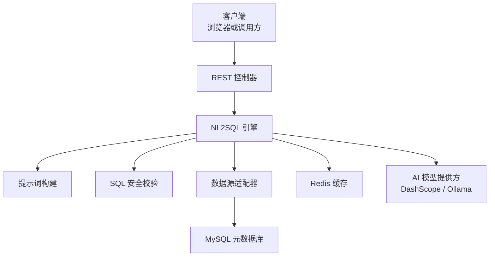
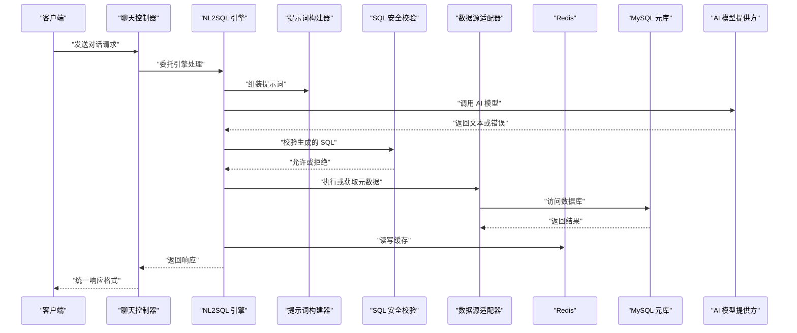
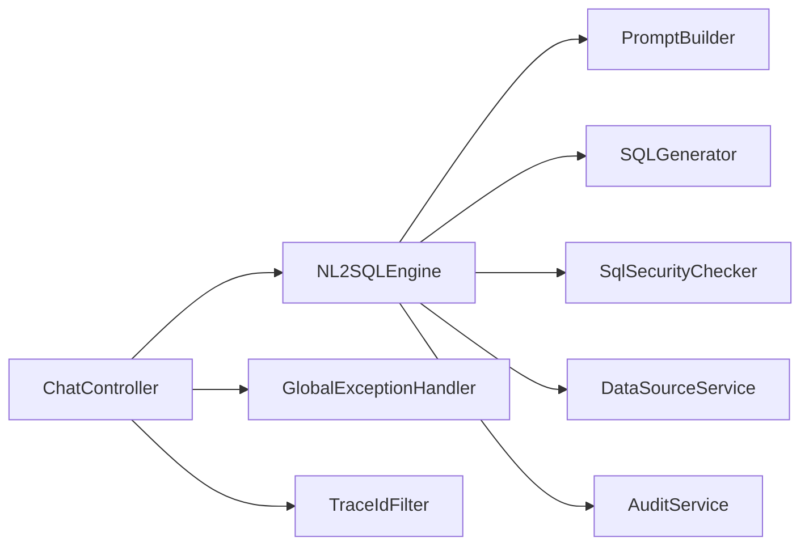

# 故障排查

<cite>
**本文引用的文件**   
- [application.yml](file://backend/src/main/resources/application.yml)
- [application-ollama.yml](file://backend/src/main/resources/application-ollama.yml)
- [GlobalExceptionHandler.java](file://backend/src/main/java/com/nlp2sql/config/GlobalExceptionHandler.java)
- [BusinessException.java](file://backend/src/main/java/com/nlp2sql/common/BusinessException.java)
- [ErrorCode.java](file://backend/src/main/java/com/nlp2sql/common/ErrorCode.java)
- [TraceIdFilter.java](file://backend/src/main/java/com/nlp2sql/common/TraceIdFilter.java)
- [NL2SQLEngine.java](file://backend/src/main/java/com/nlp2sql/service/NL2SQLEngine.java)
- [ChatController.java](file://backend/src/main/java/com/nlp2sql/controller/ChatController.java)
- [PromptBuilder.java](file://backend/src/main/java/com/nlp2sql/service/PromptBuilder.java)
- [SQLGenerator.java](file://backend/src/main/java/com/nlp2sql/service/SQLGenerator.java)
- [SqlSecurityChecker.java](file://backend/src/main/java/com/nlp2sql/security/SqlSecurityChecker.java)
- [ModelProperties.java](file://backend/src/main/java/com/nlp2sql/config/ModelProperties.java)
- [DataSourceService.java](file://backend/src/main/java/com/nlp2sql/service/DataSourceService.java)
- [DataSourceController.java](file://backend/src/main/java/com/nlp2sql/controller/DataSourceController.java)
- [RedisConfig.java](file://backend/src/main/java/com/nlp2sql/config/RedisConfig.java)
- [MyBatisPlusConfig.java](file://backend/src/main/java/com/nlp2sql/config/MyBatisPlusConfig.java)
- [SecurityConfig.java](file://backend/src/main/java/com/nlp2sql/config/SecurityConfig.java)
- [JwtAuthenticationFilter.java](file://backend/src/main/java/com/nlp2sql/security/JwtAuthenticationFilter.java)
- [AuditService.java](file://backend/src/main/java/com/nlp2sql/service/AuditService.java)
- [prompt_template_service.py](file://py_peoject/py_peoject/model_test/prompt_template_service.py)
</cite>

## 目录
1. [引言](#引言)
2. [项目结构与排查范围](#项目结构与排查范围)
3. [核心组件与关键流程](#核心组件与关键流程)
4. [架构总览](#架构总览)
5. [详细故障分类与排查步骤](#详细故障分类与排查步骤)
6. [依赖关系分析](#依赖关系分析)
7. [性能瓶颈定位与调优建议](#性能瓶颈定位与调优建议)
8. [监控指标解读与告警规则](#监控指标解读与告警规则)
9. [应急预案与恢复流程](#应急预案与恢复流程)
10. [问题复现与根因分析方法论](#问题复现与根因分析方法论)
11. [结论](#结论)

## 引言
本文面向生产环境运维、后端开发与测试人员，聚焦 NL2SQL 系统的典型故障场景，包括数据库连接异常、AI 模型调用失败、接口超时与性能退化等。文档提供从现象到根因的完整排查路径，涵盖日志定位、配置校验、参数调优、监控告警、应急切换与恢复操作，并给出可复用的方法论。

## 项目结构与排查范围
系统由 Spring Boot 后端、MySQL 元数据库、Redis 缓存、可选 AI 模型提供方（DashScope 或 Ollama）组成；前端通过 REST API 与后端交互。故障排查重点集中在后端服务、外部依赖以及 AI 模型接入层。

**图表来源**
- [ChatController.java](file://backend/src/main/java/com/nlp2sql/controller/ChatController.java)
- [NL2SQLEngine.java](file://backend/src/main/java/com/nlp2sql/service/NL2SQLEngine.java)
- [PromptBuilder.java](file://backend/src/main/java/com/nlp2sql/service/PromptBuilder.java)
- [SqlSecurityChecker.java](file://backend/src/main/java/com/nlp2sql/security/SqlSecurityChecker.java)
- [application.yml](file://backend/src/main/resources/application.yml)

**章节来源**
- [application.yml:1-117](file://backend/src/main/resources/application.yml#L1-L117)

## 核心组件与关键流程
- 对话接口：用户输入自然语言后，控制器接收请求，交由 NL2SQL 引擎处理，最终返回 SQL 或执行结果。
- 提示词构建：根据模板和上下文拼装提示词，影响模型输出质量。
- SQL 生成与安全：将模型输出解析为 SQL，并通过安全策略限制查询风险。
- 数据源适配：根据配置的数据库类型访问 MySQL 元数据或业务数据。
- 配置中心：Spring 配置集中管理数据库、Redis、AI 模型、JWT、日志等。

**章节来源**
- [ChatController.java](file://backend/src/main/java/com/nlp2sql/controller/ChatController.java)
- [NL2SQLEngine.java](file://backend/src/main/java/com/nlp2sql/service/NL2SQLEngine.java)
- [PromptBuilder.java](file://backend/src/main/java/com/nlp2sql/service/PromptBuilder.java)
- [SQLGenerator.java](file://backend/src/main/java/com/nlp2sql/service/SQLGenerator.java)
- [SqlSecurityChecker.java](file://backend/src/main/java/com/nlp2sql/security/SqlSecurityChecker.java)

## 架构总览

**图表来源**
- [ChatController.java](file://backend/src/main/java/com/nlp2sql/controller/ChatController.java)
- [NL2SQLEngine.java](file://backend/src/main/java/com/nlp2sql/service/NL2SQLEngine.java)
- [PromptBuilder.java](file://backend/src/main/java/com/nlp2sql/service/PromptBuilder.java)
- [SqlSecurityChecker.java](file://backend/src/main/java/com/nlp2sql/security/SqlSecurityChecker.java)
- [application.yml](file://backend/src/main/resources/application.yml)

## 详细故障分类与排查步骤

### 一、数据库连接问题（MySQL 元库）
常见症状：
- 应用启动失败，报数据源不可用或驱动加载失败。
- 接口返回“数据库连接超时”“连接池耗尽”。
- 查询慢或频繁出现连接被拒绝。

排查步骤：
1. 核对 JDBC URL、用户名、密码、时区、SSL 等参数是否与部署环境一致。
   - 参考：[application.yml](file://backend/src/main/resources/application.yml#L1-L117)
2. 检查 HikariCP 连接池大小是否过小导致并发不足。
   - 参考：`spring.datasource.hikari.maximum-pool-size`、`minimum-idle`、`connection-timeout`。
3. 验证 MySQL 服务可达性与权限：端口连通、账号权限、白名单、防火墙。
4. 观察 MyBatis-Plus 日志是否打印 SQL 及执行时间，确认慢查询。
   - 参考：`mybatis-plus.configuration.log-impl`。
5. 若连接池耗尽，优先排查长事务、未关闭资源、慢查询；必要时临时提升池大小并限流。

快速自检清单：
- 能否使用相同凭据在本地直连 MySQL？
- 连接池是否打满？最大活跃连接数是否接近上限？
- 是否存在大表全表扫描或无索引查询？

优化建议：
- 调整 `maximum-pool-size` 与业务并发匹配，避免过大造成数据库压力。
- 开启慢查询日志，结合索引优化。
- 对热点元数据增加 Redis 缓存，降低 MySQL 压力。

**章节来源**
- [application.yml:1-117](file://backend/src/main/resources/application.yml#L1-L117)
- [MyBatisPlusConfig.java](file://backend/src/main/java/com/nlp2sql/config/MyBatisPlusConfig.java)

### 二、Redis 缓存连接与性能问题
常见症状：
- 启动时报 Redis 连接失败。
- 接口偶发超时或读取不到缓存。
- 缓存命中率低，元数据重复查询 MySQL。

排查步骤：
1. 核对 Redis host、port、password、database 是否正确。
   - 参考：`spring.data.redis.*`。
2. 检查 Lettuce 连接池参数：`max-active`、`max-idle`、`min-idle`、`max-wait`。
3. 确认 Schema 缓存 TTL 设置是否合理，避免过期过短导致抖动。
   - 参考：`schema-cache.ttl-seconds`。
4. 观察缓存命中逻辑，确认是否按预期写入与失效。

优化建议：
- 根据连接池大小与业务 QPS 调整 Lettuce pool 参数。
- 热点 schema 适当延长 TTL，并结合一致性策略。
- 对缓存击穿/雪崩增加防护，如随机过期、互斥锁。

**章节来源**
- [application.yml:1-117](file://backend/src/main/resources/application.yml#L1-L117)
- [RedisConfig.java](file://backend/src/main/java/com/nlp2sql/config/RedisConfig.java)

### 三、AI 模型调用失败（DashScope / Ollama）
常见症状：
- 调用 AI 模型返回空内容、乱码或报错。
- 使用 DashScope 时缺少 API Key 启动失败。
- 使用 Ollama 时本地模型拉取失败或服务不可达。

排查步骤：
1. 确认当前激活 profile 与模型提供方一致。
   - 默认使用 DashScope，如需 Ollama 请切换 profile 并排除 DashScope 自动配置。
   - 参考：`spring.profiles.active`、[application.yml](file://backend/src/main/resources/application.yml#L1-L117)、[application-ollama.yml](file://backend/src/main/resources/application-ollama.yml#L1-L12)。
2. 检查环境变量 `DASHSCOPE_API_KEY` 是否已注入。
3. 核对模型名称与温度等参数是否合法。
   - 参考：`nlp2sql.model.provider`、`nlp2sql.model.dashscope-model`、`nlp2sql.model.ollama-model`。
4. 验证 Ollama 服务地址与端口是否可达，模型是否已拉取。
5. 查看 Spring AI 日志中模型调用请求与响应片段，确认网络与鉴权。

应急方案：
- 临时切换 provider 到可用提供方。
- 对模型调用增加降级策略：返回兜底 SQL 或提示重试。

**章节来源**
- [application.yml:1-117](file://backend/src/main/resources/application.yml#L1-L117)
- [application-ollama.yml:1-12](file://backend/src/main/resources/application-ollama.yml#L1-L12)
- [ModelProperties.java](file://backend/src/main/java/com/nlp2sql/config/ModelProperties.java)

### 四、SQL 安全校验拦截
常见症状：
- 正常查询被拦截，提示“不安全 SQL”。
- 某些合法查询被误判。

排查步骤：
1. 查看安全策略：最大 LIMIT、超时秒数、重试次数。
   - 参考：`sql-security.max-limit`、`sql-security.query-timeout-seconds`、`sql-security.max-retry`。
2. 审查 SqlSecurityChecker 的判断规则，确认是否包含必要白名单。
3. 若业务确实需要更高 LIMIT，应通过审批流程调整配置而非直接放宽。

优化建议：
- 引入动态策略：按用户角色、租户、数据域设定不同限额。
- 记录被拦截 SQL 至审计日志，便于回溯。

**章节来源**
- [application.yml:1-117](file://backend/src/main/resources/application.yml#L1-L117)
- [SqlSecurityChecker.java](file://backend/src/main/java/com/nlp2sql/security/SqlSecurityChecker.java)

### 五、提示词与模型输出不稳定
常见症状：
- 同样问题多次生成不同 SQL。
- 模型输出不符合预期格式，导致解析失败。

排查步骤：
1. 检查 PromptBuilder 拼接逻辑与模板版本。
   - 参考：`prompt.version`。
2. 核对模型温度、上下文长度等参数。
   - 参考：`ai.dashscope.chat.options.temperature`、`ai.ollama.chat.options.num-ctx`。
3. 观察 PromptTemplateService 与外部 Python 模板服务的协作（如有）。
   - 参考：[prompt_template_service.py](file://py_peoject/py_peoject/model_test/prompt_template_service.py)。

优化建议：
- 固定 prompt 版本，配合灰度发布与回滚。
- 对高风险查询采用更低 temperature 与更强约束。
- 对模型输出进行结构化校验，失败时走重试或降级。

**章节来源**
- [application.yml:1-117](file://backend/src/main/resources/application.yml#L1-L117)
- [PromptBuilder.java](file://backend/src/main/java/com/nlp2sql/service/PromptBuilder.java)
- [prompt_template_service.py](file://py_peoject/py_peoject/model_test/prompt_template_service.py)

### 六、认证与会话问题（JWT）
常见症状：
- 登录后无法访问接口，提示未认证。
- Token 过期或签名错误。

排查步骤：
1. 检查 JWT secret 与过期时间配置。
   - 参考：`jwt.secret`、`jwt.expiration`。
2. 确认 SecurityConfig 与 JwtAuthenticationFilter 是否启用。
3. 核对前端携带 token 的请求头是否正确。

优化建议：
- 将敏感密钥移至环境变量或密钥管理服务。
- 实现 refresh token 机制减少频繁登录。

**章节来源**
- [application.yml:1-117](file://backend/src/main/resources/application.yml#L1-L117)
- [SecurityConfig.java](file://backend/src/main/java/com/nlp2sql/config/SecurityConfig.java)
- [JwtAuthenticationFilter.java](file://backend/src/main/java/com/nlp2sql/security/JwtAuthenticationFilter.java)

### 七、全局异常与统一响应
常见问题：
- 异常堆栈直接返回给前端。
- 业务错误码不清晰，难以定位。

排查步骤：
1. 确认 GlobalExceptionHandler 是否捕获所有异常并转为统一响应。
2. 检查 BusinessException 与 ErrorCode 定义是否覆盖主要错误分支。
3. 确保 TraceIdFilter 在链路中注入 traceId，便于跨模块追踪。

优化建议：
- 对第三方依赖异常做二次包装，统一错误码。
- 在关键路径埋点日志，包含 traceId、用户、参数摘要。

**章节来源**
- [GlobalExceptionHandler.java](file://backend/src/main/java/com/nlp2sql/config/GlobalExceptionHandler.java)
- [BusinessException.java](file://backend/src/main/java/com/nlp2sql/common/BusinessException.java)
- [ErrorCode.java](file://backend/src/main/java/com/nlp2sql/common/ErrorCode.java)
- [TraceIdFilter.java](file://backend/src/main/java/com/nlp2sql/common/TraceIdFilter.java)

### 八、数据源管理与元数据同步
常见问题：
- 新增数据源后无法获取表结构。
- 元数据更新延迟或不一致。

排查步骤：
1. 检查 DataSourceController 与 DataSourceService 的数据源注册流程。
2. 确认适配器是否正确识别数据库类型并建立连接。
3. 验证元数据缓存是否按预期刷新。

优化建议：
- 数据源变更触发增量刷新，避免全量重建。
- 对失败连接进行健康检查与告警。

**章节来源**
- [DataSourceController.java](file://backend/src/main/java/com/nlp2sql/controller/DataSourceController.java)
- [DataSourceService.java](file://backend/src/main/java/com/nlp2sql/service/DataSourceService.java)

## 依赖关系分析

**图表来源**
- [ChatController.java](file://backend/src/main/java/com/nlp2sql/controller/ChatController.java)
- [NL2SQLEngine.java](file://backend/src/main/java/com/nlp2sql/service/NL2SQLEngine.java)
- [PromptBuilder.java](file://backend/src/main/java/com/nlp2sql/service/PromptBuilder.java)
- [SQLGenerator.java](file://backend/src/main/java/com/nlp2sql/service/SQLGenerator.java)
- [SqlSecurityChecker.java](file://backend/src/main/java/com/nlp2sql/security/SqlSecurityChecker.java)
- [DataSourceService.java](file://backend/src/main/java/com/nlp2sql/service/DataSourceService.java)
- [AuditService.java](file://backend/src/main/java/com/nlp2sql/service/AuditService.java)
- [GlobalExceptionHandler.java](file://backend/src/main/java/com/nlp2sql/config/GlobalExceptionHandler.java)
- [TraceIdFilter.java](file://backend/src/main/java/com/nlp2sql/common/TraceIdFilter.java)

**章节来源**
- [ChatController.java](file://backend/src/main/java/com/nlp2sql/controller/ChatController.java)
- [NL2SQLEngine.java](file://backend/src/main/java/com/nlp2sql/service/NL2SQLEngine.java)

## 性能瓶颈定位与调优建议

### 定位方法
- 使用 tracing 与日志中的耗时字段，划分各阶段耗时：模型调用、SQL 解析、数据库查询、缓存读写。
- 结合数据库慢查询日志与连接池监控，识别热点表与长事务。
- 对模型调用增加重试与熔断，避免雪崩。

### 关键参数建议
- 数据库连接池：根据峰值并发调整 `maximum-pool-size`，保持 `minimum-idle` 与连接复用。
- Redis 连接池：根据 QPS 调整 `max-active`、`max-idle`，避免连接饥饿。
- Schema 缓存 TTL：热点 schema 提高 TTL，冷数据缩短 TTL。
- SQL 安全限制：根据业务需求适度放宽 LIMIT，但需配套审计与限流。
- 模型温度与上下文：稳定场景降低 temperature，增大 num-ctx 以容纳更多上下文。

**章节来源**
- [application.yml:1-117](file://backend/src/main/resources/application.yml#L1-L117)

## 监控指标解读与告警规则

### 推荐指标
- 接口成功率与延迟分布（P50/P90/P95/P99）。
- 数据库连接池使用率、等待队列长度、连接创建失败次数。
- Redis 连接池使用率、命令延迟、命中率。
- AI 模型调用成功率、平均耗时、错误码分布。
- SQL 安全拦截次数与被拒绝 SQL 样本。
- 审计日志写入速率与失败次数。

### 告警规则建议
- 接口成功率低于阈值持续 N 分钟。
- 数据库连接池使用率超过 80% 持续 N 分钟。
- Redis 连接池使用率超过 80% 持续 N 分钟。
- AI 模型调用失败率超过阈值。
- SQL 安全拦截激增。
- 审计日志写入失败。

### 日志与追踪
- 确保所有关键路径包含 traceId。
- 对异常路径输出结构化日志，包含请求摘要、上游错误、下游状态。
- 将关键指标暴露到监控系统（如 Prometheus + Grafana）。

**章节来源**
- [application.yml:1-117](file://backend/src/main/resources/application.yml#L1-L117)
- [TraceIdFilter.java](file://backend/src/main/java/com/nlp2sql/common/TraceIdFilter.java)
- [AuditService.java](file://backend/src/main/java/com/nlp2sql/service/AuditService.java)

## 应急预案与恢复流程

### 预案分级
- P0：服务不可用、核心功能中断。
- P1：部分功能降级、性能严重退化。
- P2：非核心功能异常、可观测性缺失。

### 通用流程
1. 发现与定级：监控告警与用户反馈触发工单。
2. 止血：隔离故障源、降级非必要功能、切换到备用提供方。
3. 诊断：收集日志、指标、快照；基于 traceId 串联链路。
4. 修复：修复配置或代码，灰度发布。
5. 验证：回归测试与冒烟用例。
6. 恢复：逐步放量，观察指标稳定。
7. 复盘：根因分析、改进措施、演练更新。

### 具体场景
- AI 模型不可用：立即切换到另一 provider 或降级为规则 SQL。
- 数据库连接池耗尽：临时扩容连接池，限流高并发请求，清理长事务。
- Redis 故障：跳过缓存直接读库，随后恢复缓存并预热。

**章节来源**
- [application.yml:1-117](file://backend/src/main/resources/application.yml#L1-L117)

## 问题复现与根因分析方法论

### 复现要点
- 最小化复现场景：保留必要输入与上下文。
- 固定环境：锁定配置、模型版本、提示词版本。
- 数据脱敏：避免泄露敏感信息。
- 多轮验证：至少三次稳定复现。

### 根因分析步骤
1. 明确现象：错误码、日志关键字、traceId。
2. 分层定位：控制器 -> 引擎 -> 外部依赖。
3. 假设与证伪：逐个排除可能原因。
4. 证据链：日志、指标、配置、变更记录。
5. 结论与对策：根因、短期缓解、长期改进。

### 常用技巧
- 二分法缩小范围：关闭非必要依赖或功能。
- 对比法：与正常环境差异比对。
- 压测法：构造边界条件触发问题。
- 回溯法：结合变更记录与发布时间定位。

**章节来源**
- [GlobalExceptionHandler.java](file://backend/src/main/java/com/nlp2sql/config/GlobalExceptionHandler.java)
- [AuditService.java](file://backend/src/main/java/com/nlp2sql/service/AuditService.java)

## 结论
本指南围绕 NL2SQL 系统的核心链路，给出数据库、缓存、AI 模型、安全策略、认证与会话等关键问题的排查路径与优化建议。建议团队在此基础上完善监控告警、标准化日志规范、建立应急预案与复盘机制，持续提升系统稳定性与可观测性。