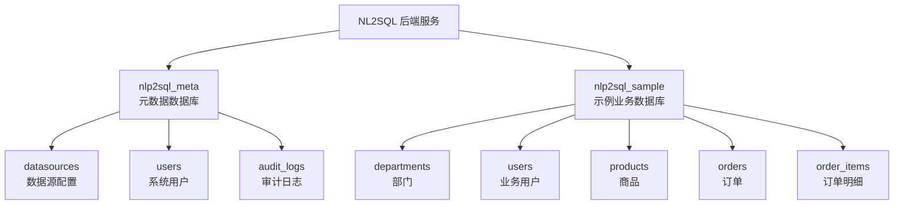
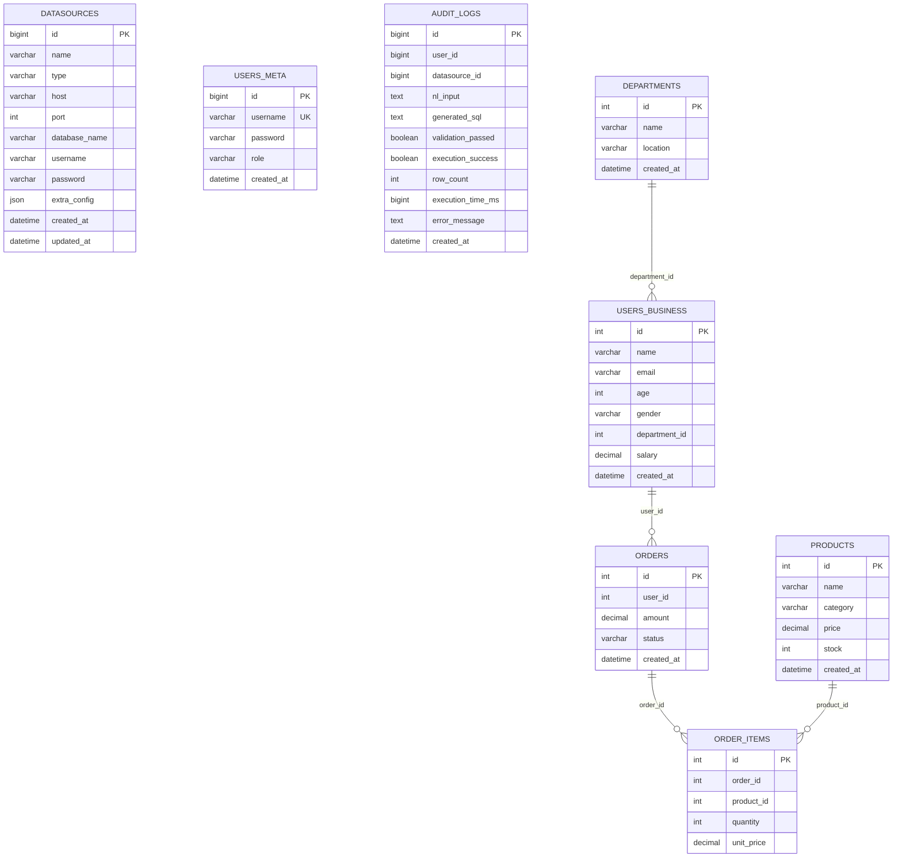
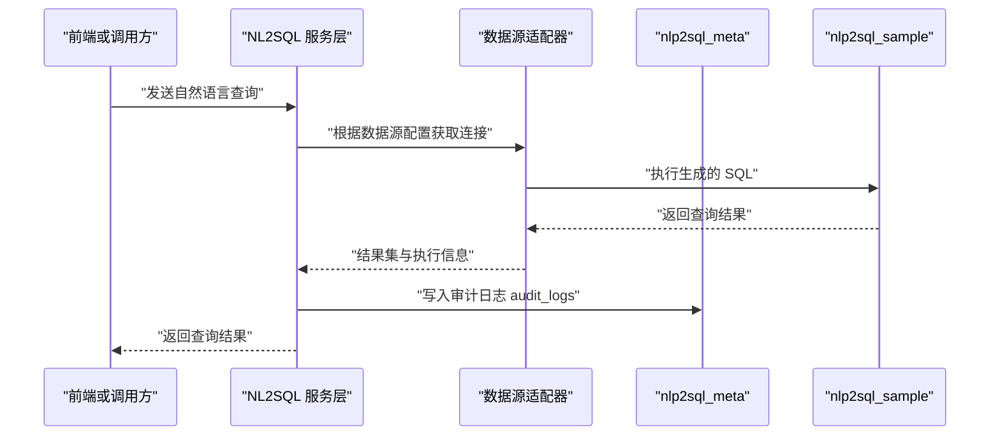
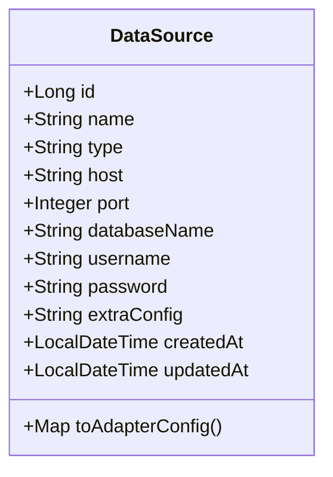
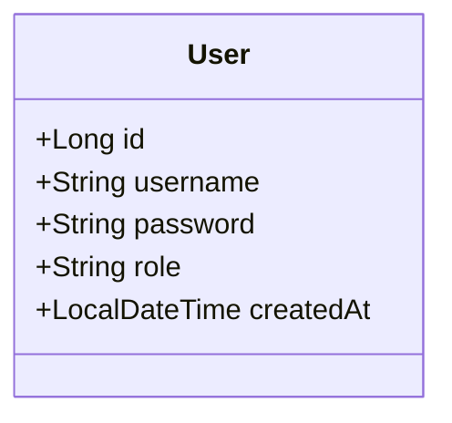
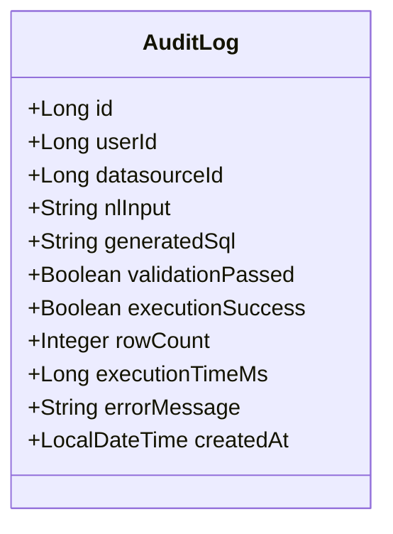
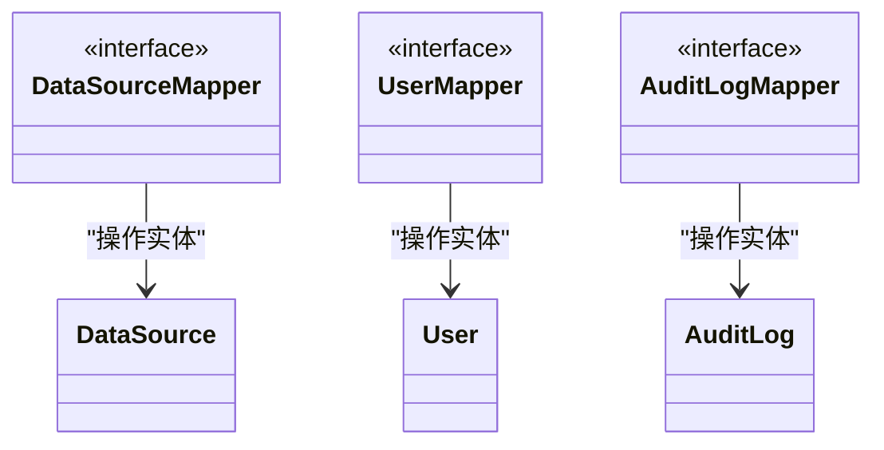
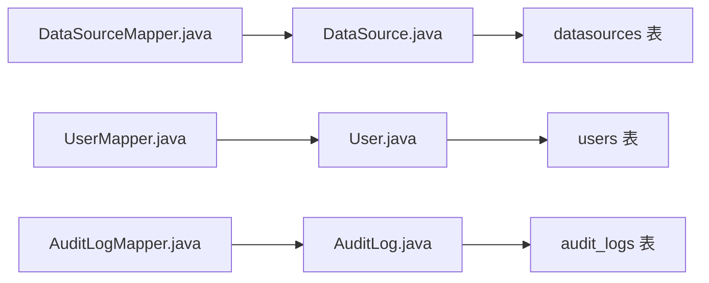

# 数据库设计

<cite>
**本文引用的文件**
- [init_backend.sql](file://sql/init_backend.sql)
- [mysql_sample.sql](file://sql/sample_data/mysql_sample.sql)
- [DataSource.java](file://backend/src/main/java/com/nlp2sql/model/DataSource.java)
- [User.java](file://backend/src/main/java/com/nlp2sql/model/User.java)
- [AuditLog.java](file://backend/src/main/java/com/nlp2sql/model/AuditLog.java)
- [DataSourceMapper.java](file://backend/src/main/java/com/nlp2sql/mapper/DataSourceMapper.java)
- [UserMapper.java](file://backend/src/main/java/com/nlp2sql/mapper/UserMapper.java)
- [AuditLogMapper.java](file://backend/src/main/java/com/nlp2sql/mapper/AuditLogMapper.java)
</cite>

## 目录
1. [引言](#引言)
2. [项目结构与数据库边界](#项目结构与数据库边界)
3. [核心实体与表结构](#核心实体与表结构)
4. [架构总览与数据流](#架构总览与数据流)
5. [详细组件分析](#详细组件分析)
6. [依赖关系分析](#依赖关系分析)
7. [索引设计与性能优化](#索引设计与性能优化)
8. [数据迁移、版本管理与回滚](#数据迁移版本管理与回滚)
9. [备份恢复与灾难恢复](#备份恢复与灾难恢复)
10. [数据质量检查与完整性约束](#数据质量检查与完整性约束)
11. [分库分表与水平扩展方案](#分库分表与水平扩展方案)
12. [结论](#结论)

## 引言
本文件面向 NL2SQL 后端系统的数据库设计，围绕元数据数据库 nlp2sql_meta 与示例业务数据库 nlp2sql_sample 展开。文档从整体架构、实体关系、主外键约束、索引策略、性能优化、迁移版本管理、回滚机制、备份恢复与灾备、数据质量检查，到分库分表和水平扩展给出系统化说明，帮助读者在理解现有实现的同时具备演进能力。

## 项目结构与数据库边界
本项目涉及两类数据库：
- 元数据数据库 nlp2sql_meta：用于存储 NL2SQL 系统自身的配置、用户和审计日志等元数据。
- 示例业务数据库 nlp2sql_sample：作为可被连接的目标业务数据库，提供部门、用户、商品、订单等业务表样例。

**图表来源**
- [init_backend.sql:1-47](file://sql/init_backend.sql#L1-L47)
- [mysql_sample.sql:1-149](file://sql/sample_data/mysql_sample.sql#L1-L149)

**章节来源**
- [init_backend.sql:1-47](file://sql/init_backend.sql#L1-L47)
- [mysql_sample.sql:1-149](file://sql/sample_data/mysql_sample.sql#L1-L149)

## 核心实体与表结构
本节聚焦三个核心实体及其对应表：数据源配置 datasources、系统用户 users、审计日志 audit_logs。同时补充示例业务库中的关键业务表，以展示完整的数据域。

### 元数据实体
- 数据源配置 datasources
  - 用途：保存目标数据库连接信息，包括类型、主机、端口、库名、用户名、加密密码和额外配置。
  - 关键字段：id（主键自增）、name、type、host、port、database_name、username、password、extra_config（JSON）、created_at、updated_at。
- 系统用户 users
  - 用途：系统登录与权限角色。
  - 关键字段：id（主键自增）、username（唯一）、password（BCrypt 加密）、role、created_at。
- 审计日志 audit_logs
  - 用途：记录自然语言输入、生成 SQL、校验结果、执行结果、行数、耗时、错误信息和时间戳；包含 user_id、datasource_id 关联查询维度。
  - 关键字段：id（主键自增）、user_id、datasource_id、nl_input、generated_sql、validation_passed、execution_success、row_count、execution_time_ms、errorMessage、created_at；包含 user_id 与 created_at 索引。

### 示例业务实体
- departments：部门基本信息。
- users：业务用户信息，含 department_id 外键指向部门。
- products：商品信息。
- orders：订单主表，含 user_id 外键指向业务用户。
- order_items：订单明细，含 order_id、product_id 两个外键。

**图表来源**
- [init_backend.sql:1-47](file://sql/init_backend.sql#L1-L47)
- [mysql_sample.sql:1-149](file://sql/sample_data/mysql_sample.sql#L1-L149)

**章节来源**
- [init_backend.sql:1-47](file://sql/init_backend.sql#L1-L47)
- [mysql_sample.sql:1-149](file://sql/sample_data/mysql_sample.sql#L1-L149)

## 架构总览与数据流
NL2SQL 后端通过数据源适配器访问目标业务库，并将查询过程与结果写入元数据库的审计日志中。

**图表来源**
- [DataSource.java:1-48](file://backend/src/main/java/com/nlp2sql/model/DataSource.java#L1-L48)
- [AuditLog.java:1-34](file://backend/src/main/java/com/nlp2sql/model/AuditLog.java#L1-L34)
- [init_backend.sql:1-47](file://sql/init_backend.sql#L1-L47)
- [mysql_sample.sql:1-149](file://sql/sample_data/mysql_sample.sql#L1-L149)

## 详细组件分析

### 数据源配置模型 DataSource
- 字段映射：使用 MyBatis-Plus 注解将 Java 对象映射到 datasources 表。
- 自动填充：createdAt、updatedAt 由框架自动填充插入与更新场景。
- 适配配置转换：toAdapterConfig 方法将领域字段转换为适配器所需的配置 Map，便于统一接入不同数据库类型。

**图表来源**
- [DataSource.java:1-48](file://backend/src/main/java/com/nlp2sql/model/DataSource.java#L1-L48)

**章节来源**
- [DataSource.java:1-48](file://backend/src/main/java/com/nlp2sql/model/DataSource.java#L1-L48)

### 系统用户模型 User
- 字段映射：映射至 users 表，包含用户名、密码与角色。
- 自动填充：createdAt 在插入时自动填充。

**图表来源**
- [User.java:1-22](file://backend/src/main/java/com/nlp2sql/model/User.java#L1-L22)

**章节来源**
- [User.java:1-22](file://backend/src/main/java/com/nlp2sql/model/User.java#L1-L22)

### 审计日志模型 AuditLog
- 字段映射：映射至 audit_logs 表，涵盖用户、数据源、自然语言输入、生成 SQL、校验与执行状态、行数、耗时、错误信息与时间戳。
- 自动填充：createdAt 在插入时自动填充。

**图表来源**
- [AuditLog.java:1-34](file://backend/src/main/java/com/nlp2sql/model/AuditLog.java#L1-L34)

**章节来源**
- [AuditLog.java:1-34](file://backend/src/main/java/com/nlp2sql/model/AuditLog.java#L1-L34)

### Mapper 层接口
- DataSourceMapper、UserMapper、AuditLogMapper 分别继承 BaseMapper，提供基础 CRUD 能力，无自定义 SQL，体现最小化持久化层设计。

**图表来源**
- [DataSourceMapper.java:1-9](file://backend/src/main/java/com/nlp2sql/mapper/DataSourceMapper.java#L1-L9)
- [UserMapper.java:1-9](file://backend/src/main/java/com/nlp2sql/mapper/UserMapper.java#L1-L9)
- [AuditLogMapper.java:1-9](file://backend/src/main/java/com/nlp2sql/mapper/AuditLogMapper.java#L1-L9)

**章节来源**
- [DataSourceMapper.java:1-9](file://backend/src/main/java/com/nlp2sql/mapper/DataSourceMapper.java#L1-L9)
- [UserMapper.java:1-9](file://backend/src/main/java/com/nlp2sql/mapper/UserMapper.java#L1-L9)
- [AuditLogMapper.java:1-9](file://backend/src/main/java/com/nlp2sql/mapper/AuditLogMapper.java#L1-L9)

## 依赖关系分析
- 模型与表映射：DataSource、User、AuditLog 均通过注解直接映射到 init_backend.sql 中定义的表结构，保证领域模型与物理表的一致性。
- Mapper 与模型：各 Mapper 仅声明对相应实体的基础操作，不引入复杂 SQL，降低耦合度。
- 业务库依赖：示例业务库的结构与关系完全独立于元数据库，便于多租户或多环境复用。

**图表来源**
- [DataSource.java:1-48](file://backend/src/main/java/com/nlp2sql/model/DataSource.java#L1-L48)
- [User.java:1-22](file://backend/src/main/java/com/nlp2sql/model/User.java#L1-L22)
- [AuditLog.java:1-34](file://backend/src/main/java/com/nlp2sql/model/AuditLog.java#L1-L34)
- [DataSourceMapper.java:1-9](file://backend/src/main/java/com/nlp2sql/mapper/DataSourceMapper.java#L1-L9)
- [UserMapper.java:1-9](file://backend/src/main/java/com/nlp2sql/mapper/UserMapper.java#L1-L9)
- [AuditLogMapper.java:1-9](file://backend/src/main/java/com/nlp2sql/mapper/AuditLogMapper.java#L1-L9)

**章节来源**
- [DataSource.java:1-48](file://backend/src/main/java/com/nlp2sql/model/DataSource.java#L1-L48)
- [User.java:1-22](file://backend/src/main/java/com/nlp2sql/model/User.java#L1-L22)
- [AuditLog.java:1-34](file://backend/src/main/java/com/nlp2sql/model/AuditLog.java#L1-L34)
- [DataSourceMapper.java:1-9](file://backend/src/main/java/com/nlp2sql/mapper/DataSourceMapper.java#L1-L9)
- [UserMapper.java:1-9](file://backend/src/main/java/com/nlp2sql/mapper/UserMapper.java#L1-L9)
- [AuditLogMapper.java:1-9](file://backend/src/main/java/com/nlp2sql/mapper/AuditLogMapper.java#L1-L9)

## 索引设计与性能优化
- 显式索引
  - audit_logs.user_id：按用户维度检索审计记录。
  - audit_logs.created_at：按时间范围筛选审计记录。
  - 业务库 users.department_id、users.name、products.category、orders.user_id、orders.status、orders.created_at、order_items.order_id、order_items.product_id：提升常见查询与关联效率。
- 建议优化
  - 复合索引：若经常按 user_id + created_at 联合查询，可在 audit_logs 上创建 (user_id, created_at) 复合索引。
  - 覆盖索引：针对高频统计查询（如某用户在最近 N 天的执行次数），考虑覆盖列以减少回表。
  - 大表分区：audit_logs 随时间增长快，可按 created_at 进行月/季度分区，结合清理策略。
  - 冷热分离：历史审计归档到冷存储或只读副本，减轻主库压力。
  - 连接池与缓存：对数据源连接池参数调优，避免频繁创建连接；对热点数据源元信息进行短期缓存。

**章节来源**
- [init_backend.sql:1-47](file://sql/init_backend.sql#L1-L47)
- [mysql_sample.sql:1-149](file://sql/sample_data/mysql_sample.sql#L1-L149)

## 数据迁移、版本管理与回滚
- 当前状态
  - 初始化脚本位于 sql/init_backend.sql，创建 nlp2sql_meta 库及三张核心表，并设置字符集为 utf8mb4，排序规则为 utf8mb4_unicode_ci。
  - 示例业务库初始化脚本位于 sql/sample_data/mysql_sample.sql，创建 nlp2sql_sample 库及业务表并插入测试数据。
- 版本管理建议
  - 采用版本号命名规范，例如 V1__init.sql、V2__add_audit_partition.sql，并在变更脚本中增加幂等判断（IF NOT EXISTS）。
  - 建立变更记录表 schema_migrations，记录已应用脚本版本，避免重复执行。
  - 所有 DDL 变更需附带回滚脚本 Rollback_Vx__xxx.sql，明确撤销步骤与数据修复策略。
- 回滚机制
  - 先评估影响面（是否涉及数据丢失），再执行回滚脚本。
  - 对涉及数据结构的变更，先导出数据快照，再执行回滚。
  - 回滚后验证索引、约束与数据一致性。

**章节来源**
- [init_backend.sql:1-47](file://sql/init_backend.sql#L1-L47)
- [mysql_sample.sql:1-149](file://sql/sample_data/mysql_sample.sql#L1-L149)

## 备份恢复与灾难恢复
- 备份策略
  - 全量备份：定期（如每日）对 nlp2sql_meta 与 nlp2sql_sample 进行逻辑备份（mysqldump）或物理备份（XtraBackup）。
  - 增量备份：开启二进制日志，按小时或天归档增量备份。
  - 异地容灾：将备份复制到异地对象存储或磁带库，确保站点级故障可用。
- 恢复流程
  - 先恢复元数据库，再恢复业务库，确保系统配置一致。
  - 校验备份完整性与一致性，必要时运行校验脚本。
  - 恢复后进行冒烟测试，验证关键查询与审计写入。
- 灾难恢复目标
  - RPO（恢复点目标）：建议不超过 1 小时。
  - RTO（恢复时间目标）：建议不超过 4 小时（视业务容忍度调整）。

[本节为通用实践指导，不直接分析具体文件]

## 数据质量检查与完整性约束
- 主键与唯一性
  - 所有表均定义主键 id，users.username 具备唯一约束，防止重复账号。
- 非空与默认值
  - 关键字段（如 name、type、nl_input 等）强制非空，减少脏数据。
  - 时间字段默认当前时间，便于追踪记录生命周期。
- 数据类型选择
  - JSON 字段 extra_config 用于灵活扩展数据源配置，但需配合应用层校验。
  - 金额字段使用 DECIMAL 以保证精度。
- 应用层校验
  - 数据源连接信息在写入前进行连通性检测与格式校验。
  - 审计日志写入前对 nl_input、generated_sql 长度与敏感信息进行脱敏处理。
- 定期数据质量巡检
  - 检查空值比例、异常枚举值、数值越界（如负库存、负薪资）。
  - 校验外键语义一致性（例如业务库 users.department_id 是否存在对应部门）。

**章节来源**
- [init_backend.sql:1-47](file://sql/init_backend.sql#L1-L47)
- [mysql_sample.sql:1-149](file://sql/sample_data/mysql_sample.sql#L1-L149)

## 分库分表与水平扩展方案
- 分库策略
  - 按业务域拆分：将 nlp2sql_sample 下的订单域与商品域拆分为独立库，降低单库压力。
  - 按租户拆分：多租户场景下按 tenant_id 路由到不同实例，隔离数据与资源。
- 分表策略
  - 审计日志 audit_logs：按 created_at 按月分表，或按 user_id 哈希分表，兼顾查询与写入性能。
  - 订单表 orders 与 order_items：按 user_id 或订单号哈希分表，提升高并发写入与查询吞吐。
- 路由与治理
  - 使用中间件或框架（如 ShardingSphere）实现读写分离、动态路由与全局序列。
  - 跨分片查询尽量通过聚合层或离线数仓完成，避免在线 OLTP 压力过大。
- 扩容与迁移
  - 平滑扩容：新增节点后逐步迁移部分分区/分片，保持服务可用性。
  - 数据迁移：双写过渡期保证一致性，完成后切换流量并下线旧节点。

[本节为概念性扩展方案，不直接分析具体文件]

## 结论
当前数据库设计清晰区分了元数据与示例业务数据，核心实体覆盖数据源配置、系统用户与审计日志，并通过索引提升了常用查询性能。建议在后续演进中引入版本化迁移与回滚机制、完善数据质量校验与监控、规划分库分表与灾备体系，以支撑更高并发与更复杂的业务场景。