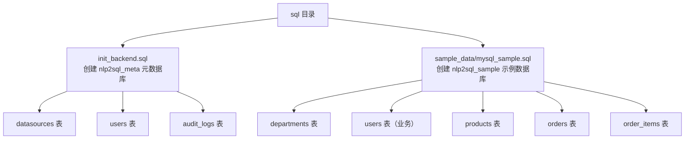
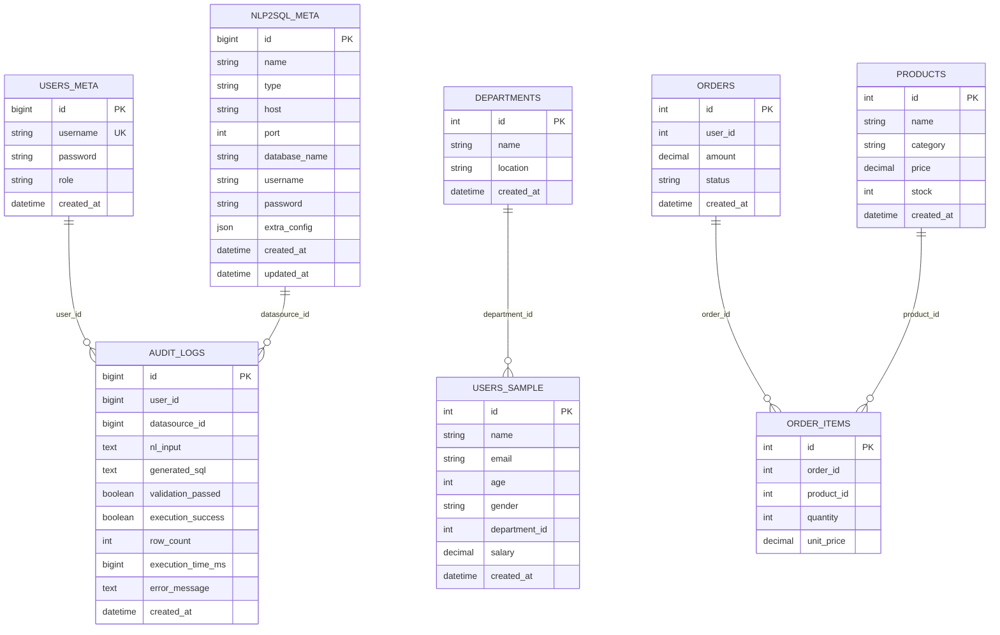
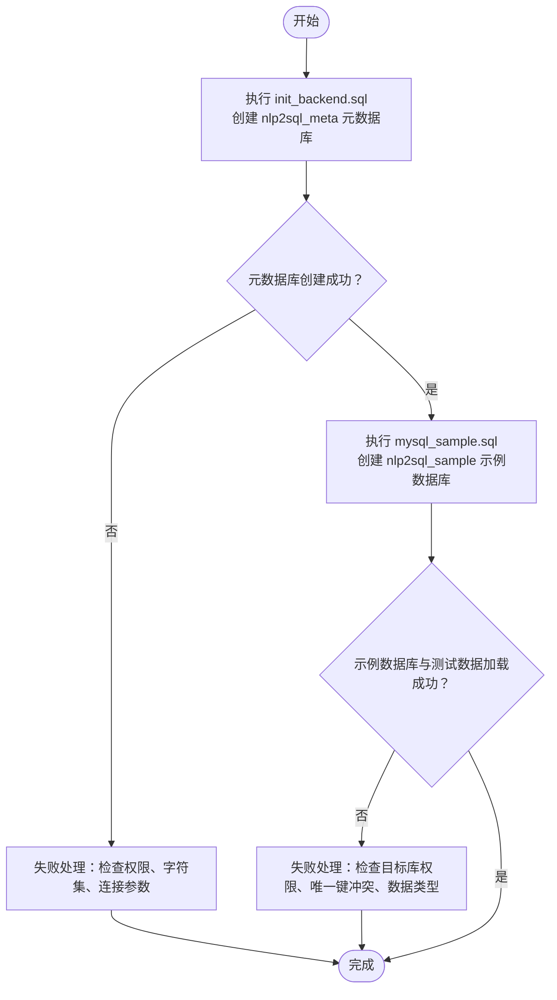
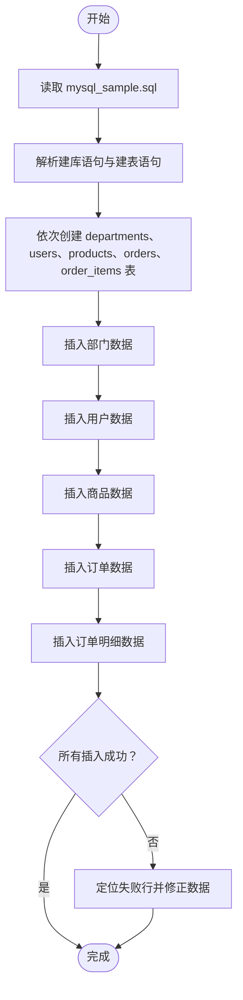
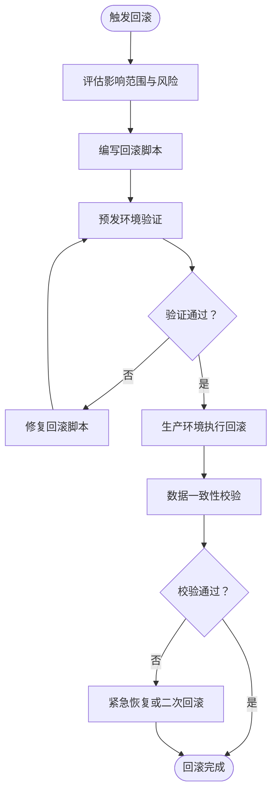
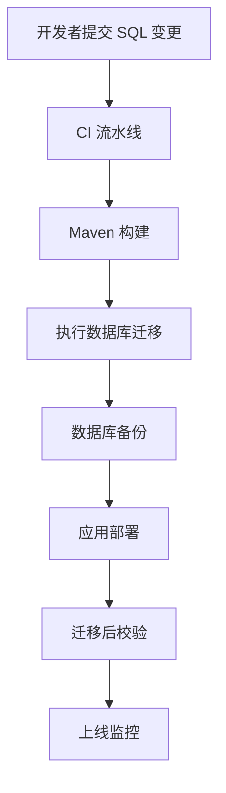
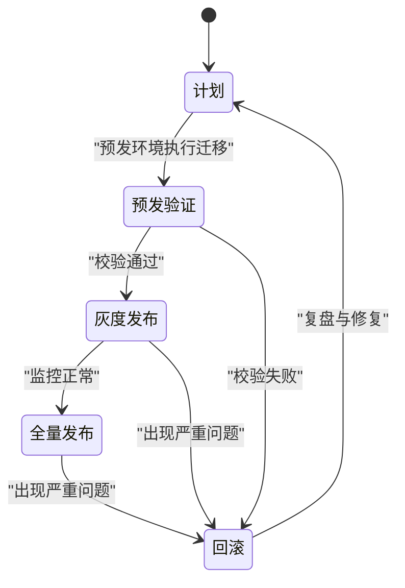
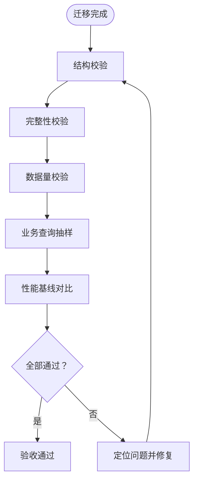

# 数据迁移

<cite>
**本文引用的文件**   
- [sql/init_backend.sql](file://sql/init_backend.sql)
- [sql/sample_data/mysql_sample.sql](file://sql/sample_data/mysql_sample.sql)
- [docs/technical_proposal.md](file://docs/technical_proposal.md)
- [backend/pom.xml](file://backend/pom.xml)
</cite>

## 目录
1. [引言](#引言)
2. [项目结构中的数据库脚本组织](#项目结构中的数据库脚本组织)
3. [核心数据库对象与依赖关系](#核心数据库对象与依赖关系)
4. [初始化脚本执行顺序](#初始化脚本执行顺序)
5. [版本控制与变更管理策略](#版本控制与变更管理策略)
6. [样本数据与测试数据准备](#样本数据与测试数据准备)
7. [回滚脚本编写规范与执行流程](#回滚脚本编写规范与执行流程)
8. [数据迁移工具链与自动化脚本](#数据迁移工具链与自动化脚本)
9. [生产环境迁移策略与风险控制](#生产环境迁移策略与风险控制)
10. [数据验证与质量检查方法](#数据验证与质量检查方法)
11. [常见问题排查](#常见问题排查)
12. [结论](#结论)

## 引言
本文件聚焦 NL2SQL 智能查询系统的数据迁移实践，重点说明后端元数据库与示例业务数据库的初始化脚本、依赖关系、版本控制方式、样本数据准备、回滚策略、自动化迁移方案以及生产环境的迁移风险控制。文档面向具备基础 SQL 能力的读者，同时为运维和开发提供可操作的迁移指南。

## 项目结构中的数据库脚本组织
仓库将数据库相关脚本集中在 sql 目录下：
- init_backend.sql：创建并初始化后端元数据库 nlp2sql_meta，包含数据源配置表、用户表和审计日志表。
- sample_data/mysql_sample.sql：创建示例业务数据库 nlp2sql_sample，包含部门、用户、商品、订单及订单明细等表，并插入测试数据。

**图示来源**
- [sql/init_backend.sql:1-47](file://sql/init_backend.sql#L1-L47)
- [sql/sample_data/mysql_sample.sql:1-149](file://sql/sample_data/mysql_sample.sql#L1-L149)

**章节来源**
- [docs/technical_proposal.md:100-128](file://docs/technical_proposal.md#L100-L128)

## 核心数据库对象与依赖关系
### 元数据库 nlp2sql_meta
- datasources：存储多数据源连接信息，支持 MySQL、PostgreSQL、Hive、HDFS、REST API、GraphQL 等类型，字段包含主机、端口、库名、用户名、加密密码及 JSON 扩展配置。
- users：系统用户信息，用户名唯一，密码使用 BCrypt 加密，角色默认 USER。
- audit_logs：记录自然语言输入、生成的 SQL、校验结果、执行成功与否、返回行数、耗时、错误信息和时间戳，并对 user_id、created_at 建立索引。

### 示例业务数据库 nlp2sql_sample
- departments：部门维度。
- users：业务用户表，含邮箱、年龄、性别、所属部门、薪资等。
- products：商品信息，含分类、价格、库存。
- orders：订单表，含用户ID、金额、状态和时间。
- order_items：订单明细，关联订单与商品，含数量、单价。

**图示来源**
- [sql/init_backend.sql:1-47](file://sql/init_backend.sql#L1-L47)
- [sql/sample_data/mysql_sample.sql:1-149](file://sql/sample_data/mysql_sample.sql#L1-L149)

**章节来源**
- [docs/technical_proposal.md:75-99](file://docs/technical_proposal.md#L75-L99)

## 初始化脚本执行顺序
推荐按以下顺序执行：
1. 先执行 init_backend.sql，创建 nlp2sql_meta 元数据库及其三张核心表。
2. 再执行 mysql_sample.sql，创建 nlp2sql_sample 示例数据库、业务表并插入测试数据。

**图示来源**
- [sql/init_backend.sql:1-47](file://sql/init_backend.sql#L1-L47)
- [sql/sample_data/mysql_sample.sql:1-149](file://sql/sample_data/mysql_sample.sql#L1-L149)

**章节来源**
- [docs/technical_proposal.md:116-128](file://docs/technical_proposal.md#L116-L128)

## 版本控制与变更管理策略
当前仓库未引入 Flyway、Liquibase 等数据库版本化工具，也未发现 migrate 或 rollback 命名风格的脚本。因此，项目的“版本控制”主要通过 Git 提交历史对 SQL 脚本进行追踪，变更管理建议采用如下规范：
- 为每个变更创建独立分支，提交独立的 SQL 变更脚本，避免在现有脚本上直接覆盖。
- 对现有脚本的增量修改应保留幂等性（例如使用 IF NOT EXISTS、IF EXISTS），降低重复执行风险。
- 建议在仓库中新增 migration 目录，按版本号命名脚本（如 V1__init.sql、V2__add_indexes.sql），并在部署流水线中统一执行。
- 对于破坏性变更（删除列、修改类型、重建表），必须配套回滚脚本，并在合并请求中明确影响范围。

由于当前实现仅以 Git 作为版本载体，建议在后续迭代中引入数据库迁移工具，以实现更严格的版本演进与回滚能力。

**章节来源**
- [backend/pom.xml:1-194](file://backend/pom.xml#L1-L194)
- [docs/technical_proposal.md:100-128](file://docs/technical_proposal.md#L100-L128)

## 样本数据与测试数据准备
mysql_sample.sql 不仅定义示例数据库结构，还直接插入了部门、用户、商品、订单、订单明细等多类测试数据，便于快速启动前后端联调。

准备步骤建议：
- 确认 MySQL 服务可用且具备建库权限。
- 执行 mysql_sample.sql 后，检查目标库是否已存在，避免误覆盖。
- 验证关键表的行数是否符合预期，确保外键逻辑与业务语义一致。

**图示来源**
- [sql/sample_data/mysql_sample.sql:1-149](file://sql/sample_data/mysql_sample.sql#L1-L149)

**章节来源**
- [docs/technical_proposal.md:88-99](file://docs/technical_proposal.md#L88-L99)

## 回滚脚本编写规范与执行流程
当前仓库未提供显式回滚脚本。建议按照以下原则编写与执行回滚脚本：

- 命名规范：rollback_Vx__描述.sql，对应正向迁移脚本 Vx__描述.sql。
- 内容要求：
  - 针对 DROP TABLE / ALTER TABLE / DROP INDEX 等破坏性操作，提供逆向恢复语句。
  - 对 INSERT/UPDATE/DELETE 等数据变更，提供基于时间戳、批次号或快照的回滚逻辑。
  - 保持幂等性与可重复执行能力，避免因部分失败导致二次回滚异常。
- 执行流程：
  1. 评估变更影响范围，确定需要回滚的版本。
  2. 先在预发环境执行回滚脚本，验证数据一致性。
  3. 通过监控与数据校验脚本确认回滚结果。
  4. 在低峰时段执行生产回滚，必要时配合应用灰度发布。

[本节为通用方法论说明，不直接分析具体源码文件]

## 数据迁移工具链与自动化脚本
目前后端 pom.xml 未引入 Flyway、Liquibase 等迁移插件，也没有现成的自动化迁移脚本。建议的迁移工具链包括：
- 数据库迁移工具：Flyway 或 Liquibase，用于版本化与自动迁移。
- 构建与部署：Maven 集成 Flyway/Liquibase 插件，在打包阶段执行迁移。
- 流水线：在 CI/CD 流水线中增加迁移任务，确保每次部署前自动执行迁移。
- 备份与快照：在执行迁移前对目标数据库做快照或备份，支持快速回滚。
- 校验脚本：迁移完成后运行一致性校验脚本，比对表结构、行数与关键指标。

[本节为通用方法论说明，不直接分析具体源码文件]

## 生产环境迁移策略与风险控制
生产环境迁移需遵循“低风险、可回滚、可观测”的原则：
- 分阶段推进：开发 → 预发 → 灰度 → 全量。
- 变更窗口：选择业务低峰期执行，减少用户影响。
- 最小变更：优先采用向后兼容的变更（新增列、新增表），避免直接删除或重命名字段。
- 回滚预案：提前准备好回滚脚本与回滚演练，确保失败时能快速恢复。
- 访问控制：生产数据库只读账户执行查询，管理员账户仅在受控条件下执行迁移。
- 监控告警：迁移过程中对慢查询、锁等待、错误率进行监控与告警。

[本节为通用方法论说明，不直接分析具体源码文件]

## 数据验证与质量检查方法
为确保迁移质量，建议执行以下验证项：
- 结构校验：核对目标数据库是否存在期望的表、列、索引与约束。
- 数据完整性：检查主外键关系、非空约束、唯一约束是否满足。
- 数据量校验：对比各表行数、关键字段分布是否与预期一致。
- 业务校验：抽样执行典型查询，验证结果符合业务语义。
- 性能校验：观察关键查询的执行计划与耗时，确保无退化。

[本节为通用方法论说明，不直接分析具体源码文件]

## 常见问题排查
- 元数据库无法创建：
  - 检查数据库连接参数、字符集与排序规则设置。
  - 确认执行账户具有创建数据库与表的权限。
- 示例数据库被覆盖：
  - 若目标库已存在，脚本可能跳过或报错；应先备份再执行。
- 数据插入失败：
  - 检查唯一键冲突、数据类型不匹配、外键约束。
- 审计日志缺失：
  - 检查应用是否正确写入 audit_logs，确认 user_id、datasource_id 是否有效。

**章节来源**
- [sql/init_backend.sql:1-47](file://sql/init_backend.sql#L1-L47)
- [sql/sample_data/mysql_sample.sql:1-149](file://sql/sample_data/mysql_sample.sql#L1-L149)

## 结论
当前仓库的数据迁移以手工执行的 SQL 脚本为主，尚未引入数据库版本化管理工具。为保障迁移质量与可回滚性，建议尽快引入 Flyway 或 Liquibase，并将 init_backend.sql 与 sample_data/mysql_sample.sql 拆分为版本化脚本。在生产环境中，应结合备份、灰度、监控与回滚预案，严格控制迁移风险。同时，建立完善的迁移后数据校验流程，确保结构与数据的一致性、完整性和业务正确性。