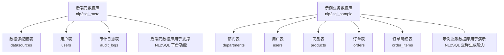
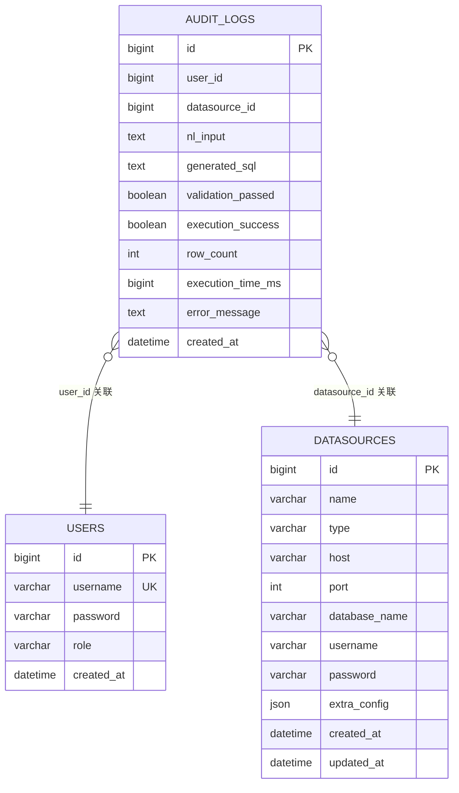
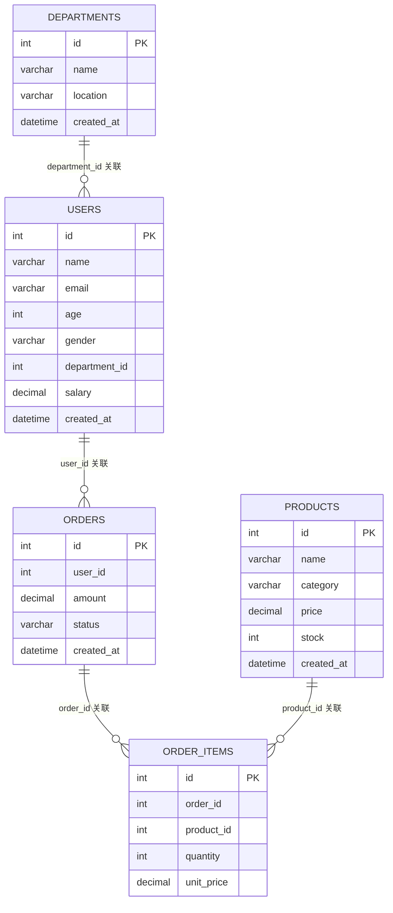

# 表结构设计

<cite>
**本文引用的文件**   
- [后端元数据库初始化脚本](file://sql/init_backend.sql)
- [示例测试数据库脚本](file://sql/sample_data/mysql_sample.sql)
</cite>

## 目录
1. [引言](#引言)
2. [项目结构与数据模型总览](#项目结构与数据模型总览)
3. [核心表结构定义与数据字典](#核心表结构定义与数据字典)
4. [实体关系图与引用完整性](#实体关系图与引用完整性)
5. [主键、外键与唯一约束设计原则](#主键外键与唯一约束设计原则)
6. [索引策略与查询优化](#索引策略与查询优化)
7. [范式化与反范式化的权衡](#范式化与反范式化的权衡)
8. [性能考量与维护建议](#性能考量与维护建议)
9. [故障排查指南](#故障排查指南)
10. [结论](#结论)

## 引言
本文档围绕 NL2SQL 项目的两套数据库进行系统化说明：  
- 后端元数据库 nlp2sql_meta，用于保存系统运行所需的用户、数据源配置与审计日志等元信息。  
- 示例业务数据库 nlp2sql_sample，用于演示 NL2SQL 引擎将自然语言转换为 SQL 的查询场景，包含部门、用户、商品、订单与订单明细等典型业务表。

文档目标包括：  
- 完整梳理每张表的字段、数据类型、约束与注释含义。  
- 明确表之间的关系与引用完整性策略。  
- 给出主键、外键与唯一约束的设计原则。  
- 总结索引策略与常见查询优化建议。  
- 通过 ER 图和关系映射图直观表达数据模型。  
- 讨论范式化与反范式化在本项目中的取舍。

## 项目结构与数据模型总览
本项目涉及两个相互独立的数据库：  
- 后端元数据库 nlp2sql_meta：面向平台能力，管理“数据源”“用户”“审计日志”。  
- 示例业务数据库 nlp2sql_sample：面向业务演示，提供部门、用户、商品、订单及订单明细等业务实体。

**图表来源**  
- [后端元数据库初始化脚本:1-47](file://sql/init_backend.sql#L1-L47)  
- [示例测试数据库脚本:1-149](file://sql/sample_data/mysql_sample.sql#L1-L149)

**章节来源**  
- [后端元数据库初始化脚本:1-47](file://sql/init_backend.sql#L1-L47)  
- [示例测试数据库脚本:1-149](file://sql/sample_data/mysql_sample.sql#L1-L149)

## 核心表结构定义与数据字典

### 后端元数据库 nlp2sql_meta

#### 数据源配置表 datasources
| 字段名 | 数据类型 | 是否可空 | 默认值 | 约束 | 含义与使用方式 |
|---|---|---:|---|---|---|
| id | BIGINT | 否 | 自增 | 主键 | 数据源记录的唯一标识 |
| name | VARCHAR(100) | 否 | 无 | 非空 | 数据源名称 |
| type | VARCHAR(50) | 否 | 无 | 非空 | 数据源类型，例如 mysql、postgresql、hive、hdfs、rest_api、graphql |
| host | VARCHAR(200) | 是 | 无 | 可选 | 主机地址 |
| port | INT | 是 | 无 | 可选 | 端口号 |
| database_name | VARCHAR(100) | 是 | 无 | 可选 | 连接的数据库名 |
| username | VARCHAR(100) | 是 | 无 | 可选 | 连接用户名 |
| password | VARCHAR(200) | 是 | 无 | 可选；备注为加密存储 | 连接密码，应使用加密方式保存 |
| extra_config | JSON | 是 | 无 | 可选 | 额外配置，以 JSON 格式扩展不同数据源的特殊参数 |
| created_at | DATETIME | 否 | 当前时间戳 | 创建时间 |
| updated_at | DATETIME | 否 | 当前时间戳；更新时自动刷新 | 更新时间 |

该表用于集中管理 NL2SQL 需要访问的各种外部数据源，支持多种类型并通过 JSON 字段灵活扩展配置项。

**章节来源**  
- [后端元数据库初始化脚本:8-22](file://sql/init_backend.sql#L8-L22)

#### 用户表 users
| 字段名 | 数据类型 | 是否可空 | 默认值 | 约束 | 含义与使用方式 |
|---|---|---:|---|---|---|
| id | BIGINT | 否 | 自增 | 主键 | 用户记录的唯一标识 |
| username | VARCHAR(50) | 否 | 无 | 唯一且非空 | 登录用户名，全局唯一 |
| password | VARCHAR(200) | 否 | 无 | 非空；备注为 BCrypt 加密 | 用户密码，应以安全哈希算法存储 |
| role | VARCHAR(20) | 否 | USER | 非空 | 用户角色，默认值为普通用户 |
| created_at | DATETIME | 否 | 当前时间戳 | 创建时间 |

该表承载系统用户身份与基础权限维度。用户名作为唯一标识，便于在审计日志中与具体用户关联。

**章节来源**  
- [后端元数据库初始化脚本:24-31](file://sql/init_backend.sql#L24-L31)

#### 审计日志表 audit_logs
| 字段名 | 数据类型 | 是否可空 | 默认值 | 约束 | 含义与使用方式 |
|---|---|---:|---|---|---|
| id | BIGINT | 否 | 自增 | 主键 | 审计日志记录的唯一标识 |
| user_id | BIGINT | 是 | 无 | 可选；逻辑上应关联 users.id | 发起请求的用户 ID |
| datasource_id | BIGINT | 是 | 无 | 可选；逻辑上应关联 datasources.id | 本次查询使用的数据源 ID |
| nl_input | TEXT | 否 | 无 | 非空 | 用户输入的自然语言问题 |
| generated_sql | TEXT | 是 | 无 | 可选 | AI 生成的 SQL 语句 |
| validation_passed | BOOLEAN | 是 | 无 | 可选 | SQL 安全检查是否通过 |
| execution_success | BOOLEAN | 是 | 无 | 可选 | 最终执行是否成功 |
| row_count | INT | 是 | 无 | 可选 | 返回结果行数 |
| execution_time_ms | BIGINT | 是 | 无 | 可选 | 执行耗时，单位为毫秒 |
| error_message | TEXT | 是 | 无 | 可选 | 错误信息 |
| created_at | DATETIME | 否 | 当前时间戳 | 创建时间 |
| 索引 idx_user_id | 基于 user_id | 辅助索引 | 无 | 用于按用户查询审计记录 |
| 索引 idx_created_at | 基于 created_at | 辅助索引 | 无 | 用于按时间范围筛选审计记录 |

该表用于追踪每次 NL2SQL 请求的关键链路：从自然语言输入到 SQL 生成、校验、执行结果及异常信息，是安全审计与性能分析的重要数据来源。

**章节来源**  
- [后端元数据库初始化脚本:33-47](file://sql/init_backend.sql#L33-L47)

### 示例业务数据库 nlp2sql_sample

#### 部门表 departments
| 字段名 | 数据类型 | 是否可空 | 默认值 | 约束 | 含义与使用方式 |
|---|---|---:|---|---|---|
| id | INT | 否 | 自增 | 主键 | 部门唯一标识 |
| name | VARCHAR(50) | 否 | 无 | 非空 | 部门名称 |
| location | VARCHAR(100) | 是 | 无 | 可选 | 部门位置 |
| created_at | DATETIME | 否 | 当前时间戳 | 创建时间 |

该表描述组织内部的基本部门信息，供员工归属参考。

**章节来源**  
- [示例测试数据库脚本:8-15](file://sql/sample_data/mysql_sample.sql#L8-L15)

#### 用户表 users
| 字段名 | 数据类型 | 是否可空 | 默认值 | 约束 | 含义与使用方式 |
|---|---|---:|---|---|---|
| id | INT | 否 | 自增 | 主键 | 用户唯一标识 |
| name | VARCHAR(50) | 否 | 无 | 非空 | 姓名 |
| email | VARCHAR(100) | 是 | 无 | 可选 | 邮箱 |
| age | INT | 是 | 无 | 可选 | 年龄 |
| gender | VARCHAR(10) | 是 | 无 | 可选 | 性别 |
| department_id | INT | 是 | 无 | 可选；逻辑上应关联 departments.id | 所属部门 ID |
| salary | DECIMAL(10, 2) | 是 | 无 | 可选 | 薪资 |
| created_at | DATETIME | 否 | 当前时间戳 | 创建时间 |
| 索引 idx_department_id | 基于 department_id | 辅助索引 | 无 | 用于按部门统计或筛选员工 |
| 索引 idx_name | 基于 name | 辅助索引 | 无 | 用于按姓名快速查找 |

该表表示业务系统中的员工信息，并与部门表存在逻辑归属关系。

**章节来源**  
- [示例测试数据库脚本:17-31](file://sql/sample_data/mysql_sample.sql#L17-L31)

#### 商品表 products
| 字段名 | 数据类型 | 是否可空 | 默认值 | 约束 | 含义与使用方式 |
|---|---|---:|---|---|---|
| id | INT | 否 | 自增 | 主键 | 商品唯一标识 |
| name | VARCHAR(100) | 否 | 无 | 非空 | 商品名称 |
| category | VARCHAR(50) | 是 | 无 | 可选 | 商品分类 |
| price | DECIMAL(10, 2) | 否 | 无 | 非空 | 商品价格 |
| stock | INT | 否 | 0 | 非空 | 库存数量 |
| created_at | DATETIME | 否 | 当前时间戳 | 创建时间 |
| 索引 idx_category | 基于 category | 辅助索引 | 无 | 用于按分类查询商品 |

该表描述可售商品的基础信息与库存状态。

**章节来源**  
- [示例测试数据库脚本:33-45](file://sql/sample_data/mysql_sample.sql#L33-L45)

#### 订单表 orders
| 字段名 | 数据类型 | 是否可空 | 默认值 | 约束 | 含义与使用方式 |
|---|---|---:|---|---|---|
| id | INT | 否 | 自增 | 主键 | 订单唯一标识 |
| user_id | INT | 否 | 无 | 非空；逻辑上应关联 users.id | 下单用户 ID |
| amount | DECIMAL(12, 2) | 否 | 无 | 非空 | 订单金额 |
| status | VARCHAR(20) | 否 | 待支付 | 非空 | 订单状态，例如待支付、已支付、已发货、已完成、已取消 |
| created_at | DATETIME | 否 | 当前时间戳 | 创建时间 |
| 索引 idx_user_id | 基于 user_id | 辅助索引 | 无 | 用于按用户查询订单 |
| 索引 idx_status | 基于 status | 辅助索引 | 无 | 用于按状态筛选订单 |
| 索引 idx_created_at | 基于 created_at | 辅助索引 | 无 | 用于按时间范围查询订单 |

该表记录用户的消费行为与订单生命周期。

**章节来源**  
- [示例测试数据库脚本:47-61](file://sql/sample_data/mysql_sample.sql#L47-L61)

#### 订单明细表 order_items
| 字段名 | 数据类型 | 是否可空 | 默认值 | 约束 | 含义与使用方式 |
|---|---|---:|---|---|---|
| id | INT | 否 | 自增 | 主键 | 订单明细唯一标识 |
| order_id | INT | 否 | 无 | 非空；逻辑上应关联 orders.id | 所属订单 ID |
| product_id | INT | 否 | 无 | 非空；逻辑上应关联 products.id | 所购商品 ID |
| quantity | INT | 否 | 无 | 非空 | 购买数量 |
| unit_price | DECIMAL(10, 2) | 否 | 无 | 非空 | 下单时的商品单价 |
| 索引 idx_order_id | 基于 order_id | 辅助索引 | 无 | 用于按订单查询明细 |
| 索引 idx_product_id | 基于 product_id | 辅助索引 | 无 | 用于按商品统计销量或价格历史 |

该表实现订单与商品的多对多关系，并保留交易快照信息。

**章节来源**  
- [示例测试数据库脚本:63-75](file://sql/sample_data/mysql_sample.sql#L63-L75)

## 实体关系图与引用完整性

### 后端元数据库实体关系图

**图表来源**  
- [后端元数据库初始化脚本:8-47](file://sql/init_backend.sql#L8-L47)

说明：  
- audit_logs.user_id 逻辑上指向 users.id。  
- audit_logs.datasource_id 逻辑上指向 datasources.id。  
- 虽然脚本中未显式声明外键约束，但语义上应保持引用完整性。

### 示例业务数据库实体关系图

**图表来源**  
- [示例测试数据库脚本:8-75](file://sql/sample_data/mysql_sample.sql#L8-L75)

说明：  
- users.department_id 逻辑上指向 departments.id。  
- orders.user_id 逻辑上指向 users.id。  
- order_items.order_id 逻辑上指向 orders.id。  
- order_items.product_id 逻辑上指向 products.id。

**章节来源**  
- [后端元数据库初始化脚本:8-47](file://sql/init_backend.sql#L8-L47)  
- [示例测试数据库脚本:8-75](file://sql/sample_data/mysql_sample.sql#L8-L75)

## 主键、外键与唯一约束设计原则

### 主键设计原则
- 所有表均使用自增整数或长整型作为主键，保证记录唯一性与顺序插入性能。  
- 后端元数据库使用 BIGINT 主键，示例业务数据库使用 INT 主键，体现不同规模与增长预期。  
- 主键不携带业务语义，避免后续业务变化导致主键迁移成本。

### 唯一约束设计原则
- 后端 users.username 设置唯一约束，确保系统用户登录名全局唯一。  
- 示例业务数据库未在 users.email 上设置唯一约束，因此如需强一致邮箱唯一性，应在应用层或数据库层补充约束。

### 外键与引用完整性
- 当前脚本未显式声明外键约束，而是通过字段命名与注释表达逻辑关系。  
- 建议在关键路径上补充物理外键约束，尤其是：  
  - audit_logs.user_id → users.id  
  - audit_logs.datasource_id → datasources.id  
  - users.department_id → departments.id  
  - orders.user_id → users.id  
  - order_items.order_id → orders.id  
  - order_items.product_id → products.id  
- 若因性能或分库分表原因暂不添加物理外键，则必须在应用层严格维护引用完整性，防止孤儿记录产生。

**章节来源**  
- [后端元数据库初始化脚本:8-47](file://sql/init_backend.sql#L8-L47)  
- [示例测试数据库脚本:8-75](file://sql/sample_data/mysql_sample.sql#L8-L75)

## 索引策略与查询优化

### 已有索引分析

| 表 | 索引或关键字段 | 用途 | 适用查询模式 |
|---|---|---|---|
| audit_logs | 主键 id | 主键查询、排序 | 按审计记录 ID 精确查找 |
| audit_logs | idx_user_id | 按用户查询审计日志 | 用户维度审计、排障 |
| audit_logs | idx_created_at | 按时间查询审计日志 | 时间段审计、报表导出 |
| users | 主键 id | 主键查询 | 用户信息精确查找 |
| users | username 唯一索引 | 用户名登录校验 | 用户认证、账号查找 |
| users | idx_department_id | 按部门统计或筛选 | 部门员工列表、汇总 |
| users | idx_name | 按姓名查找 | 模糊或精确姓名搜索 |
| products | 主键 id | 主键查询 | 商品信息精确查找 |
| products | idx_category | 按分类查询 | 分类商品列表 |
| orders | 主键 id | 主键查询 | 订单信息精确查找 |
| orders | idx_user_id | 按用户查订单 | 用户订单列表 |
| orders | idx_status | 按状态筛选 | 状态统计、任务队列处理 |
| orders | idx_created_at | 按时间查询 | 时间范围订单统计 |
| order_items | 主键 id | 主键查询 | 明细行精确查找 |
| order_items | idx_order_id | 按订单查明细 | 订单详情展开 |
| order_items | idx_product_id | 按商品查明细 | 商品销量、价格历史分析 |

### 查询优化建议
- 优先利用现有索引完成常见过滤条件，如按 user_id、status、created_at、category、department_id 查询。  
- 复合查询场景中考虑复合索引，例如：  
  - orders(status, created_at) 用于按状态和时间范围联合筛选。  
  - audit_logs(user_id, created_at) 用于按用户和时间范围联合检索。  
- 对大文本字段 nl_input、generated_sql、error_message 不建议建立全文索引，除非确有全文检索需求；否则应控制写入频率与归档策略。  
- 对高频统计字段如 orders.status、products.category，注意索引选择性，避免低选择性索引被优化器忽略。  
- 审计日志表随时间增长较快，建议按月或按季度分区，并结合 idx_created_at 进行高效裁剪。

**章节来源**  
- [后端元数据库初始化脚本:33-47](file://sql/init_backend.sql#L33-L47)  
- [示例测试数据库脚本:17-75](file://sql/sample_data/mysql_sample.sql#L17-L75)

## 范式化与反范式化的权衡

### 范式化方面
- 部门与用户分离，订单与订单明细分离，符合第三范式的基本思想，减少冗余并保持数据一致性。  
- 订单明细只保存 order_id、product_id、quantity、unit_price，不直接复制订单或商品的冗余信息，有利于统一维护主数据。

### 反范式化方面
- order_items.unit_price 属于交易快照字段，即使后续商品价格变动，也不应回写历史订单明细，这体现了反范式化设计中的“快照化”思想。  
- audit_logs 中同时保存 nl_input、generated_sql、row_count、execution_time_ms、error_message 等大量描述性字段，属于面向查询优化的宽表设计，便于审计分析与问题定位。

### 权衡建议
- 对于主数据（部门、商品）保持较高范式程度，避免重复维护。  
- 对于事务快照和审计事实表，适度反范式以提升读取性能和分析效率。  
- 当新增频繁变更的业务维度时，应评估是否引入新的维度表，而不是无限膨胀事实表。

**章节来源**  
- [示例测试数据库脚本:47-75](file://sql/sample_data/mysql_sample.sql#L47-L75)  
- [后端元数据库初始化脚本:33-47](file://sql/init_backend.sql#L33-L47)

## 性能考量与维护建议

### 数据量与增长预期
- audit_logs 可能随 NL2SQL 调用量快速增长，需关注写入吞吐、存储空间与归档清理。  
- orders 与 order_items 随电商类业务增长，需注意订单查询、统计与明细展开的性能。

### 存储与字符集
- 所有数据库均使用 utf8mb4 与 utf8mb4_unicode_ci 排序规则，适合国际化与表情符号存储。  
- TEXT、JSON、VARCHAR 等可变长度字段应避免过度放大默认长度，防止页内碎片与内存分配开销。

### 安全与敏感字段
- datasources.password 应加密存储，不应明文落库。  
- users.password 使用 BCrypt 哈希，符合密码安全实践。  
- audit_logs.error_message 可能包含敏感信息，应限制访问权限并考虑脱敏策略。

### 可维护性建议
- 建议为逻辑外键增加物理外键约束，或在 ORM/MyBatis 层增加级联检查。  
- 为高频查询补充复合索引，定期查看慢查询日志。  
- 对审计日志与示例数据进行分层归档，生产环境不应长期保留原始测试数据。

[本节为通用性能与维护建议，不直接分析特定代码片段]

## 故障排查指南

### 审计日志缺失或无法关联用户
- 现象：audit_logs.user_id 为空或关联不到 users。  
- 排查要点：  
  - 检查用户登录流程是否正确设置 user_id。  
  - 检查 users.username 是否唯一，是否存在重复用户名导致关联异常。  
  - 确认审计写入是否在事务边界内，避免部分写入。

### 数据源连接失败
- 现象：datasources 配置正确但无法连接目标数据库。  
- 排查要点：  
  - 检查 host、port、database_name、username、password 配置。  
  - 检查 extra_config 是否包含必要参数。  
  - 确认 password 是否按预期加密。

### 订单与明细不一致
- 现象：order_items 中存在孤立的 order_id 或 product_id。  
- 排查要点：  
  - 检查删除订单或商品时是否同步清理明细。  
  - 建议在应用层增加外键一致性校验。  
  - 如需强一致性，可在数据库中补充外键约束。

**章节来源**  
- [后端元数据库初始化脚本:8-47](file://sql/init_backend.sql#L8-L47)  
- [示例测试数据库脚本:47-75](file://sql/sample_data/mysql_sample.sql#L47-L75)

## 结论
本项目采用双数据库架构：后端元数据库负责平台能力，示例业务数据库负责 NL2SQL 查询演示。两库均采用清晰的自增主键、合理的字符集与索引设计，并在审计日志和业务事实表中体现了适度的反范式化，以平衡一致性与查询性能。

未来可进一步：  
- 补充物理外键约束，强化引用完整性。  
- 根据实际查询负载完善复合索引。  
- 对审计日志与业务大表实施分区与归档。  
- 对敏感字段加强加密、脱敏与访问控制。

[本节为总结性内容，不直接分析特定代码片段]