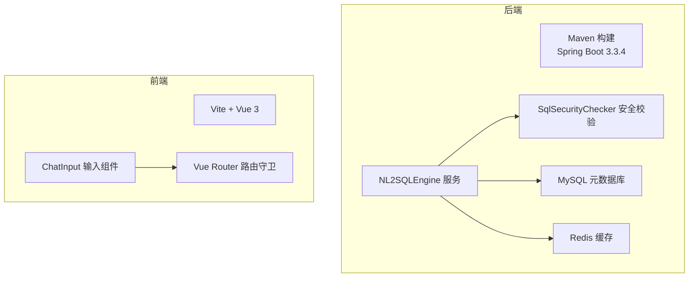
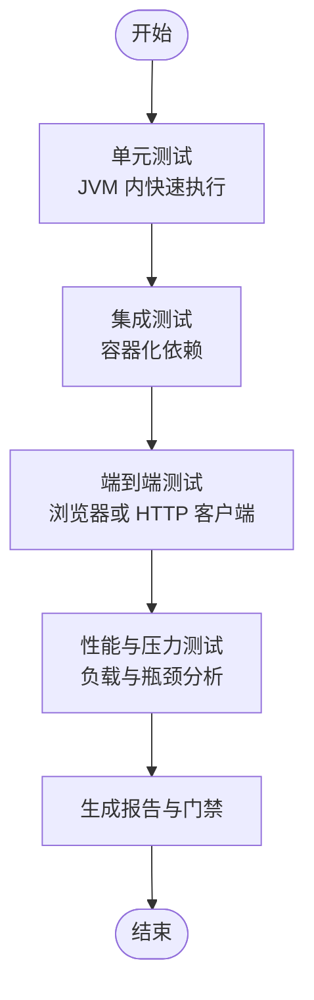
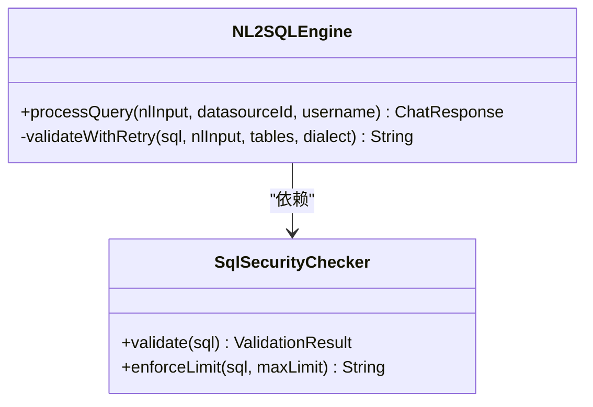
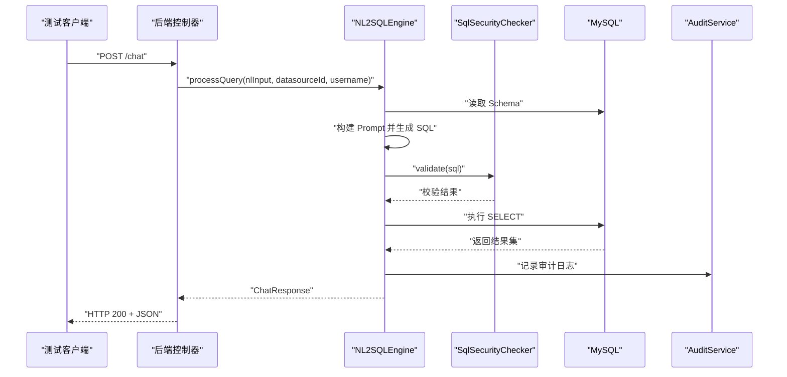
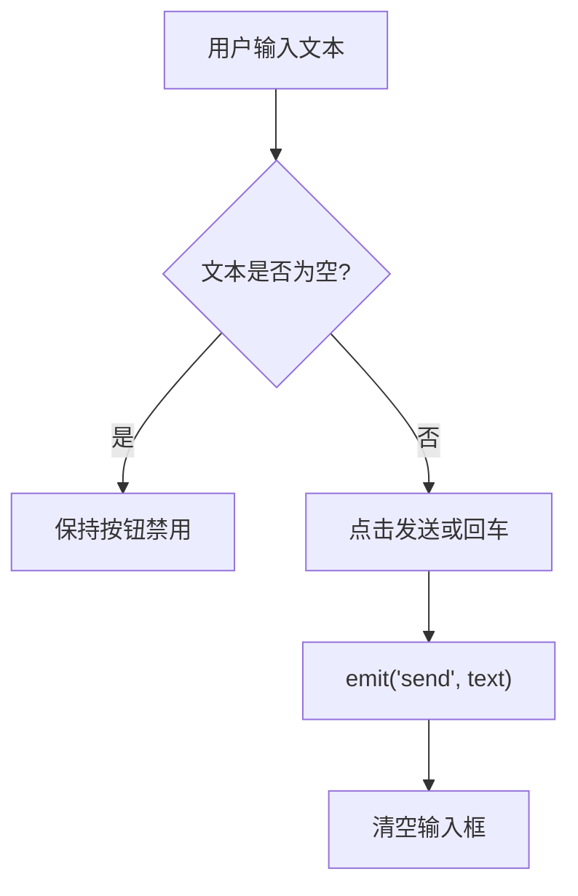
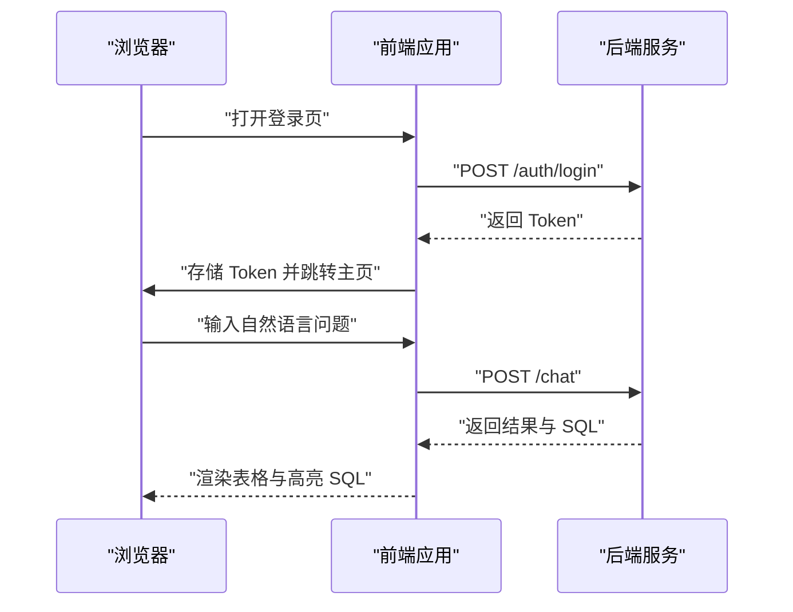
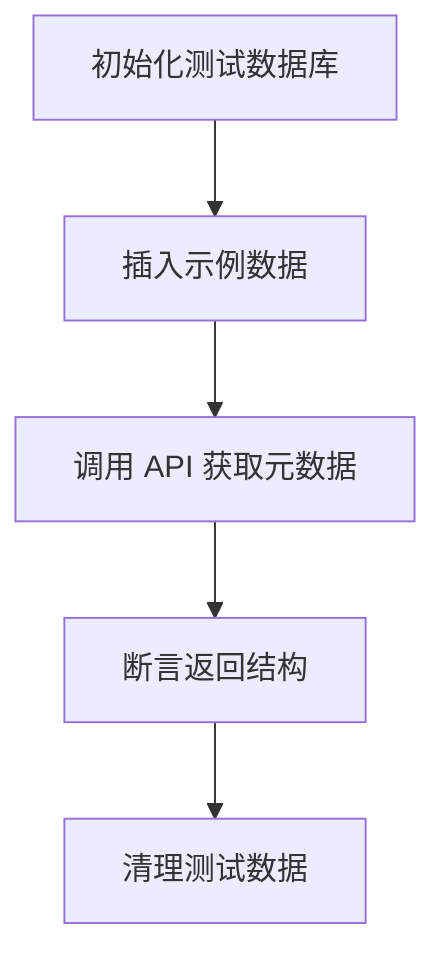
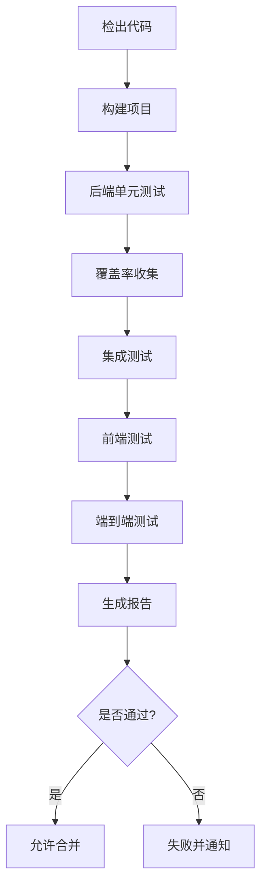
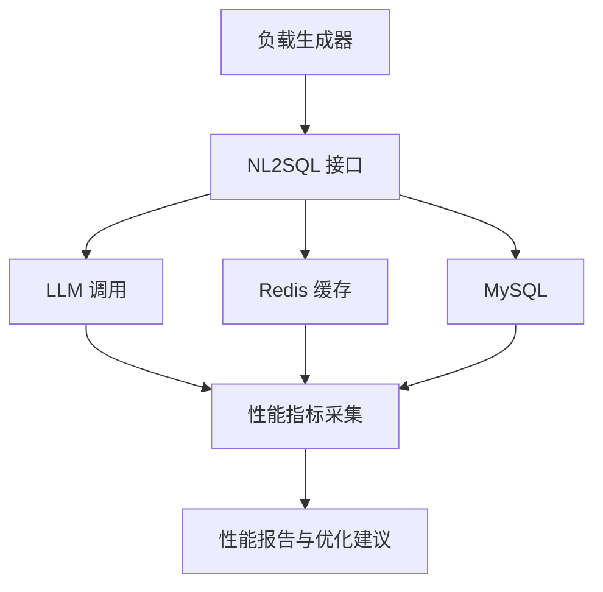

# 测试指南

<cite>
**本文引用的文件**   
- [pom.xml](file://backend/pom.xml)
- [package.json](file://frontend/package.json)
- [test_report.md](file://docs/test_report.md)
- [NL2SQLEngine.java](file://backend/src/main/java/com/nlp2sql/service/NL2SQLEngine.java)
- [SqlSecurityChecker.java](file://backend/src/main/java/com/nlp2sql/security/SqlSecurityChecker.java)
- [ChatInput.vue](file://frontend/src/components/ChatInput.vue)
- [index.js](file://frontend/src/router/index.js)
</cite>

## 目录
1. [引言](#引言)
2. [项目结构与测试现状](#项目结构与测试现状)
3. [测试分层与策略总览](#测试分层与策略总览)
4. [后端单元测试](#后端单元测试)
5. [后端集成测试](#后端集成测试)
6. [前端单元测试与组件测试](#前端单元测试与组件测试)
7. [端到端测试](#端到端测试)
8. [API 测试与数据库测试](#api-测试与数据库测试)
9. [Mock 数据与测试数据准备](#mock-数据与测试数据准备)
10. [测试覆盖率要求与统计方法](#测试覆盖率要求与统计方法)
11. [持续集成中的自动化测试流程](#持续集成中的自动化测试流程)
12. [性能测试与压力测试](#性能测试与压力测试)
13. [故障排查与常见问题](#故障排查与常见问题)
14. [结论](#结论)

## 引言
本测试指南面向 NL2SQL 智能查询系统的研发与质量保障团队，目标是明确单元测试、集成测试、端到端测试的编写方法与最佳实践，说明测试框架选择、配置方式、Mock 数据策略，覆盖 API 测试、数据库测试、前端组件测试的具体实现路径，并给出覆盖率指标、持续集成自动化流程以及性能与压力测试的实施建议。文档同时结合现有代码结构，确保可操作性和落地性。

## 项目结构与测试现状
当前仓库已具备完整的前后端工程骨架：后端为 Spring Boot + MyBatis-Plus + Redis + Spring Security + Spring AI 技术栈；前端为 Vue 3 + Vite + Element Plus + Pinia + Vue Router。已有测试规划与范围记录在测试报告中，但尚未发现正式的后端测试类与前端的测试脚本。

**图表来源**
- [pom.xml:1-194](file://backend/pom.xml#L1-L194)
- [package.json:1-23](file://frontend/package.json#L1-L23)
- [NL2SQLEngine.java:1-127](file://backend/src/main/java/com/nlp2sql/service/NL2SQLEngine.java#L1-L127)
- [SqlSecurityChecker.java:1-88](file://backend/src/main/java/com/nlp2sql/security/SqlSecurityChecker.java#L1-L88)
- [ChatInput.vue:1-60](file://frontend/src/components/ChatInput.vue#L1-L60)
- [index.js:1-39](file://frontend/src/router/index.js#L1-L39)

**章节来源**
- [pom.xml:1-194](file://backend/pom.xml#L1-L194)
- [package.json:1-23](file://frontend/package.json#L1-L23)
- [test_report.md:1-108](file://docs/test_report.md#L1-L108)

## 测试分层与策略总览
建议采用四层测试体系：
- 单元测试：针对纯函数、工具类、安全校验、Prompt 构建等无外部依赖逻辑。
- 集成测试：围绕控制器、服务层、持久层与外部系统（数据库、Redis、AI 模型）协作场景。
- 端到端测试：从浏览器或 HTTP 客户端发起请求，验证用户全流程。
- 非功能性测试：性能、稳定性、安全与兼容性测试。

核心原则：
- 优先单元测试，保证快速反馈。
- 使用 Mock 隔离外部依赖（LLM、数据库、Redis）。
- 关键业务链路必须有集成测试覆盖。
- 前端以组件测试为主，必要时补充 E2E。
- 所有测试可重复、可回滚、可观测。

[此图为概念流程，不直接映射具体源码]

## 后端单元测试
### 测试目标与范围
- 安全校验器：黑名单关键字、AST 解析、堆叠查询、UNION 注入检测、LIMIT 强制追加。
- Prompt 构建与重试逻辑：不同方言与表结构的提示词构造。
- 引擎编排：Schema 获取失败、模型返回空 SQL、校验失败重试、审计日志触发。

### 推荐测试框架与配置
- JUnit 5 + Mockito：用于纯逻辑断言与依赖 Mock。
- Spring Boot Test：用于带上下文的服务级单测。
- 在 Maven 中通过 spring-boot-starter-test 提供基础依赖，已在项目依赖中声明。

### 典型测试用例设计
- SqlSecurityChecker 单元测试
  - 输入为空或空白时返回失败。
  - 包含 INSERT/DELETE/DROP 等关键字被拒绝。
  - 非 SELECT 语句被拒绝。
  - 堆叠查询与 UNION 注入被拦截。
  - enforceLimit 在未含 LIMIT 时自动追加上限。
- NL2SQLEngine 单元测试
  - Schema 为空时抛出业务异常。
  - 模型返回空或无法理解时抛出业务异常。
  - 校验失败后按 maxRetry 次数重试，最终仍失败则抛错。
  - 成功执行后返回结果且审计日志被调用。

**图表来源**
- [NL2SQLEngine.java:1-127](file://backend/src/main/java/com/nlp2sql/service/NL2SQLEngine.java#L1-L127)
- [SqlSecurityChecker.java:1-88](file://backend/src/main/java/com/nlp2sql/security/SqlSecurityChecker.java#L1-L88)

**章节来源**
- [SqlSecurityChecker.java:1-88](file://backend/src/main/java/com/nlp2sql/security/SqlSecurityChecker.java#L1-L88)
- [NL2SQLEngine.java:1-127](file://backend/src/main/java/com/nlp2sql/service/NL2SQLEngine.java#L1-L127)

## 后端集成测试
### 测试目标与范围
- 认证接口：注册、登录、Token 校验、未授权访问。
- 数据源管理：创建、连接测试、列表、更新、删除。
- 元数据接口：表列表、字段详情、Schema 刷新。
- NL2SQL 核心流程：自然语言到 SQL 的全链路。

### 推荐测试框架与配置
- @SpringBootTest：启动应用上下文进行全链路集成测试。
- @WebMvcTest：仅加载 Web 层，配合 MockMvc 做接口契约测试。
- Testcontainers：启动真实 MySQL 与 Redis，避免环境差异。
- @MockBean：对 LLM 调用、外部 SDK 等进行模拟。

### 关键测试场景
- 认证模块
  - 正确凭据登录返回 Token。
  - 错误密码返回认证失败。
  - 无 Token 访问受保护接口返回 401。
- 数据源管理
  - 创建 MySQL 数据源并成功测试连接。
  - 错误配置下连接失败。
  - CRUD 操作返回预期状态码与数据结构。
- NL2SQL 核心功能
  - 简单查询、条件过滤、聚合、JOIN、TOP-N、模糊匹配、子查询。
  - 校验失败重试机制是否生效。
  - 审计日志是否记录。

**图表来源**
- [NL2SQLEngine.java:1-127](file://backend/src/main/java/com/nlp2sql/service/NL2SQLEngine.java#L1-L127)
- [SqlSecurityChecker.java:1-88](file://backend/src/main/java/com/nlp2sql/security/SqlSecurityChecker.java#L1-L88)

**章节来源**
- [test_report.md:1-108](file://docs/test_report.md#L1-L108)
- [NL2SQLEngine.java:1-127](file://backend/src/main/java/com/nlp2sql/service/NL2SQLEngine.java#L1-L127)

## 前端单元测试与组件测试
### 测试目标与范围
- 组件交互：输入框发送、禁用状态、回车提交。
- 路由守卫：未登录跳转登录页。
- 状态管理：聊天与数据源 Store 行为。

### 推荐测试框架与配置
- Vitest + @vue/test-utils：轻量、与 Vite 原生集成。
- Vue Router 测试：使用 createMemoryHistory 进行路由导航测试。
- Pinia 测试：createPinia 实例化 Store 并断言状态变化。

### 典型测试用例设计
- ChatInput 组件
  - 初始文本为空，按钮禁用。
  - 输入文本后点击发送触发事件。
  - 回车键触发发送且清空输入。
  - disabled 属性为真时不可发送。
- 路由守卫
  - 访问 /chat 且无 token 时重定向到 /login。
  - 有 token 时可正常进入页面。

**图表来源**
- [ChatInput.vue:1-60](file://frontend/src/components/ChatInput.vue#L1-L60)

**章节来源**
- [ChatInput.vue:1-60](file://frontend/src/components/ChatInput.vue#L1-L60)
- [index.js:1-39](file://frontend/src/router/index.js#L1-L39)

## 端到端测试
### 测试目标与范围
- 登录流程：输入用户名与密码，成功后跳转主页。
- 数据源选择：下拉展示可用数据源并切换。
- 自然语言输入：发送问题并展示结果表格与 SQL。
- 退出登录：清除 Token 并跳转登录页。

### 推荐方案
- Playwright 或 Cypress：跨浏览器自动化测试。
- 使用固定测试账号与测试数据，确保可重复性。
- 录制关键用户旅程，结合截图与网络请求断言。

[此图为概念流程，不直接映射具体源码]

## API 测试与数据库测试
### API 测试
- 使用 MockMvc 对控制器进行契约测试，断言状态码、响应体结构、错误消息。
- 对安全相关接口断言鉴权逻辑，如未携带 Token 返回 401。
- 对 NL2SQL 接口断言 SQL 生成与结果集结构。

### 数据库测试
- 使用 Testcontainers 启动 MySQL 容器，运行初始化脚本与示例数据。
- 使用 Flyway/Liquibase 管理测试数据变更，保证幂等与可回滚。
- 断言元数据接口返回的表与字段信息符合预期。

[此图为概念流程，不直接映射具体源码]

## Mock 数据与测试数据准备
### 后端
- Mock LLM 调用：对 PromptTemplateService 与 SQLGenerator 进行模拟，返回可控的 SQL 与错误。
- Mock 外部依赖：DataSourceFactory、MetadataService、AuthService、AuditService 等使用 @MockBean。
- 数据库测试数据：在 resources/test 下维护 SQL 脚本，分别用于认证、数据源、元数据、NL2SQL 场景。

### 前端
- Mock API 请求：使用 vitest 的 fetch/XHR mock 或 axios-mock-adapter。
- 组件 Props 与 Emits：构造最小 Props 集合，断发事件与状态变化。
- Store 数据：构造最小 State 与 Actions，断言副作用与 UI 表现。

**章节来源**
- [test_report.md:1-108](file://docs/test_report.md#L1-L108)

## 测试覆盖率要求与统计方法
### 建议指标
- 后端
  - 行覆盖率 ≥ 80%。
  - 分支覆盖率 ≥ 70%。
  - 安全校验类覆盖率 ≥ 90%。
- 前端
  - 组件覆盖率 ≥ 75%。
  - 路由与 Store 覆盖率 ≥ 70%。

### 统计方法
- 后端 JaCoCo：在 Maven 中集成 jacoco-maven-plugin，生成 HTML 与 XML 报告。
- 前端 Istanbul/v8：Vitest 默认支持覆盖率输出，生成 HTML 报告。
- 将覆盖率阈值作为 CI 门禁，低于阈值阻断合并。

**章节来源**
- [pom.xml:1-194](file://backend/pom.xml#L1-L194)
- [package.json:1-23](file://frontend/package.json#L1-L23)

## 持续集成中的自动化测试流程
建议流水线阶段：
- 代码检查：静态分析与规范检查。
- 单元测试：JVM 内快速执行，生成覆盖率。
- 集成测试：启动容器化依赖，执行接口与数据库测试。
- 前端测试：组件与路由测试。
- 端到端测试：Playwright/Cypress 跨浏览器运行。
- 报告归档：JaCoCo、Istanbul、E2E 截图与视频。

[此图为概念流程，不直接映射具体源码]

## 性能测试与压力测试
### 目标与指标
- SQL 生成延迟：端到端时间 < 10s。
- Schema 缓存命中：查询时间 < 100ms。
- 前端首屏加载：加载时间 < 3s。

### 推荐工具与方法
- 后端：JMeter 或 k6 压测 NL2SQL 接口，观察 CPU、内存、线程池与数据库连接池。
- 前端：Lighthouse 或 WebPageTest 评估首屏与资源体积。
- 缓存：Redis 命中率与过期策略验证。
- 模型调用：对 LLM 调用设置超时与熔断，避免雪崩。

[此图为概念流程，不直接映射具体源码]

**章节来源**
- [test_report.md:1-108](file://docs/test_report.md#L1-L108)

## 故障排查与常见问题
- 安全校验误报
  - 检查黑名单关键字与正则表达式，确认 UNION 注入模式是否过于严格。
  - 查看 AST 解析失败原因，必要时放宽注释处理策略。
- SQL 生成失败
  - 检查 Prompt 构建是否包含足够 Schema 信息。
  - 重试次数与最大 LIMIT 配置是否合理。
- 前端路由守卫异常
  - 确认 localStorage 中 token 是否存在与格式是否正确。
  - 断言 beforeEach 的重定向逻辑。
- 集成测试依赖缺失
  - 检查 Testcontainers 镜像拉取与端口占用。
  - 确认 MySQL/Redis 初始化脚本执行顺序。

**章节来源**
- [SqlSecurityChecker.java:1-88](file://backend/src/main/java/com/nlp2sql/security/SqlSecurityChecker.java#L1-L88)
- [NL2SQLEngine.java:1-127](file://backend/src/main/java/com/nlp2sql/service/NL2SQLEngine.java#L1-L127)
- [index.js:1-39](file://frontend/src/router/index.js#L1-L39)

## 结论
本项目已具备完善的后端与前端架构基础，测试策略应以“安全校验为核心、NL2SQL 链路为重点、前后端协同验证”为主线。通过 JUnit/Mockito 与 Vitest 建立快速单元反馈，借助 Testcontainers 与容器化依赖提升集成可靠性，使用 Playwright/Cypress 完成端到端闭环，并以覆盖率与性能指标作为质量门禁。建议在下一迭代中补齐实际测试用例与 CI 流水线，逐步提升整体质量与交付效率。