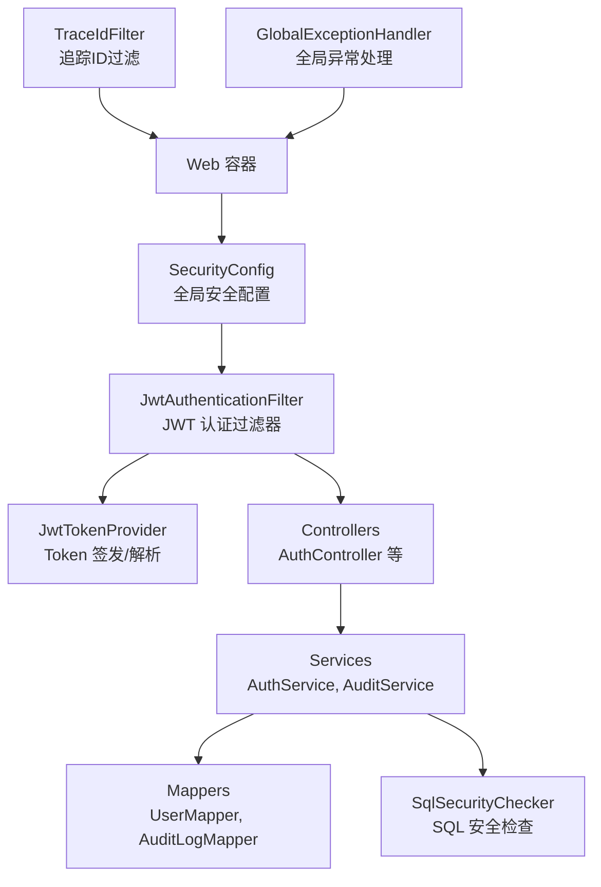
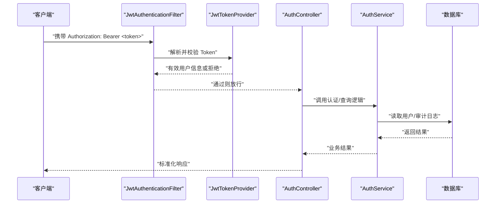
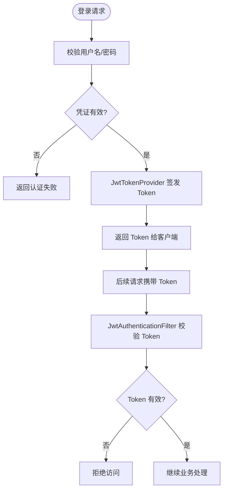
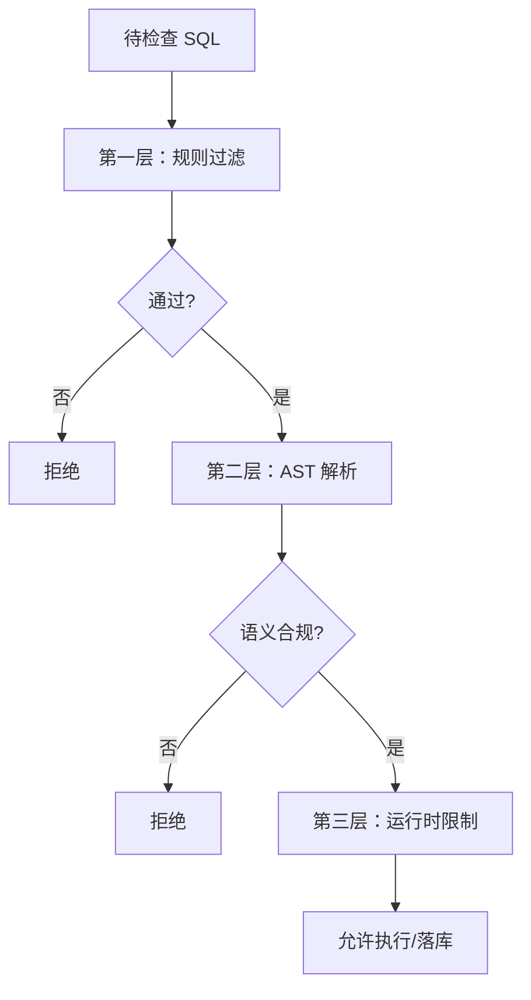
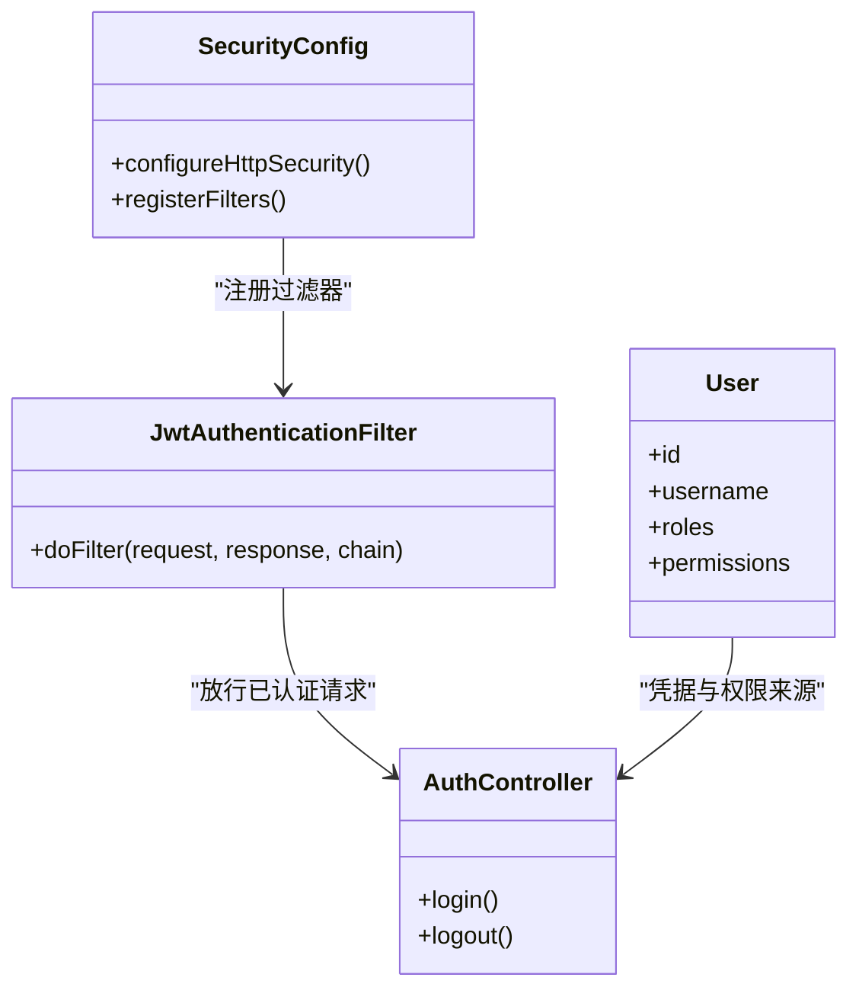
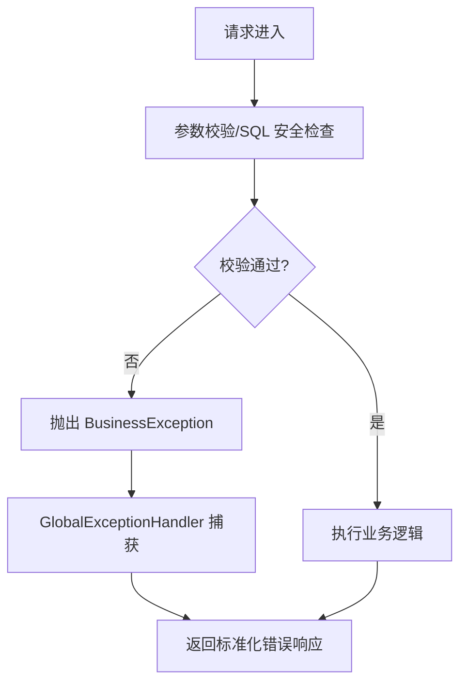
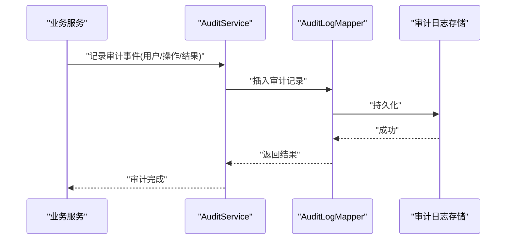
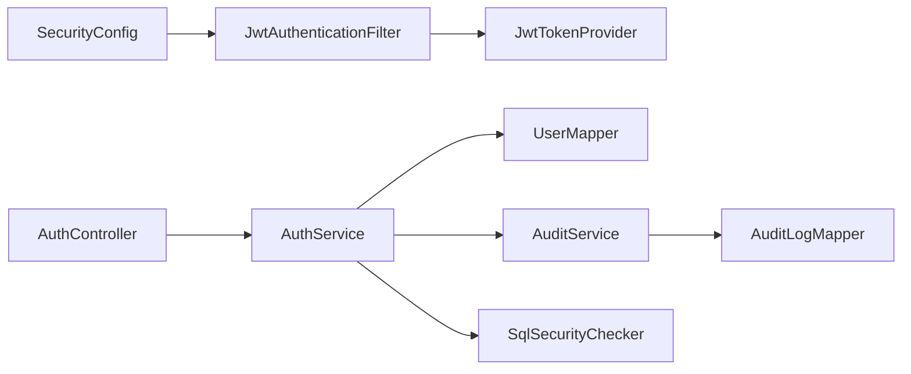

# 安全架构

<cite>
**本文引用的文件**   
- [SecurityConfig.java](file://backend/backend/src/main/java/com/nlp2sql/config/SecurityConfig.java)
- [JwtAuthenticationFilter.java](file://backend/backend/src/main/java/com/nlp2sql/security/JwtAuthenticationFilter.java)
- [JwtTokenProvider.java](file://backend/backend/src/main/java/com/nlp2sql/security/JwtTokenProvider.java)
- [SqlSecurityChecker.java](file://backend/backend/src/main/java/com/nlp2sql/security/SqlSecurityChecker.java)
- [AuthController.java](file://backend/backend/src/main/java/com/nlp2sql/controller/AuthController.java)
- [AuthService.java](file://backend/backend/src/main/java/com/nlp2sql/service/AuthService.java)
- [User.java](file://backend/backend/src/main/java/com/nlp2sql/model/User.java)
- [UserMapper.java](file://backend/backend/src/main/java/com/nlp2sql/mapper/UserMapper.java)
- [AuditLog.java](file://backend/backend/src/main/java/com/nlp2sql/model/AuditLog.java)
- [AuditLogMapper.java](file://backend/backend/src/main/java/com/nlp2sql/mapper/AuditLogMapper.java)
- [AuditService.java](file://backend/backend/src/main/java/com/nlp2sql/service/AuditService.java)
- [GlobalExceptionHandler.java](file://backend/backend/src/main/java/com/nlp2sql/config/GlobalExceptionHandler.java)
- [BusinessException.java](file://backend/backend/src/main/java/com/nlp2sql/common/BusinessException.java)
- [ErrorCode.java](file://backend/backend/src/main/java/com/nlp2sql/common/ErrorCode.java)
- [TraceIdFilter.java](file://backend/backend/src/main/java/com/nlp2sql/common/TraceIdFilter.java)
- [application.yml](file://backend/backend/src/main/resources/application.yml)
</cite>

## 目录
1. [引言](#引言)
2. [项目结构中的安全位置](#项目结构中的安全位置)
3. [核心安全组件](#核心安全组件)
4. [体系结构总览](#体系结构总览)
5. [详细组件分析](#详细组件分析)
6. [依赖关系与耦合分析](#依赖关系与耦合分析)
7. [性能与安全权衡](#性能与安全权衡)
8. [故障排查与常见问题](#故障排查与常见问题)
9. [结论](#结论)

## 引言
本文件面向后端 Spring Boot 应用，系统化梳理 NL2SQL 系统的安全架构。重点覆盖：
- 身份认证：基于 JWT 的无状态认证流程与 Token 生命周期管理。
- 授权控制：接口级访问控制、白名单放行与默认拒绝策略。
- SQL 注入防护：三层防御机制与 AST 解析技术。
- 请求验证：输入校验、错误统一处理与可观测性。
- 审计与监控：操作审计日志、追踪 ID 与异常上报。

本说明不直接粘贴代码，而是通过“文件路径 + 行号”的方式定位实现细节，便于读者在仓库中快速溯源。

## 项目结构中的安全位置
安全相关代码主要分布在以下包中：
- config：全局安全配置、Web 配置、异常处理器。
- security：JWT 过滤器、Token 提供者、SQL 安全检查器。
- controller：认证入口控制器。
- service：认证服务、审计服务、业务服务。
- model：用户模型、审计日志模型等。
- mapper：数据访问层，负责用户和审计日志持久化。
- common：业务异常、错误码、追踪过滤器。

**图示来源**
- [SecurityConfig.java](file://backend/backend/src/main/java/com/nlp2sql/config/SecurityConfig.java)
- [JwtAuthenticationFilter.java](file://backend/backend/src/main/java/com/nlp2sql/security/JwtAuthenticationFilter.java)
- [JwtTokenProvider.java](file://backend/backend/src/main/java/com/nlp2sql/security/JwtTokenProvider.java)
- [AuthController.java](file://backend/backend/src/main/java/com/nlp2sql/controller/AuthController.java)
- [AuthService.java](file://backend/backend/src/main/java/com/nlp2sql/service/AuthService.java)
- [AuditService.java](file://backend/backend/src/main/java/com/nlp2sql/service/AuditService.java)
- [SqlSecurityChecker.java](file://backend/backend/src/main/java/com/nlp2sql/security/SqlSecurityChecker.java)
- [TraceIdFilter.java](file://backend/backend/src/main/java/com/nlp2sql/common/TraceIdFilter.java)
- [GlobalExceptionHandler.java](file://backend/backend/src/main/java/com/nlp2sql/config/GlobalExceptionHandler.java)

**章节来源**
- [SecurityConfig.java](file://backend/backend/src/main/java/com/nlp2sql/config/SecurityConfig.java)
- [application.yml](file://backend/backend/src/main/resources/application.yml)

## 核心安全组件
- 全局安全配置（SecurityConfig）
  - 定义 Web 安全规则、白名单路径、拦截器注册点。
  - 集中暴露安全相关的 Bean 与配置项。
- JWT 认证过滤器（JwtAuthenticationFilter）
  - 从请求头提取并校验 Token，将已认证主体注入到安全上下文。
  - 对未携带或无效 Token 的请求进行拦截。
- JWT Token 提供者（JwtTokenProvider）
  - 负责 Token 生成、解析、过期校验、密钥管理等。
- SQL 安全检查器（SqlSecurityChecker）
  - 对生成的 SQL 执行语法检查、危险操作检测、AST 语义分析。
- 认证控制器与服务（AuthController / AuthService）
  - 登录、注销、刷新 Token 等认证能力。
  - 结合用户模型与 Mapper 完成凭证校验与权限信息装配。
- 审计与可观测性（AuditService / AuditLog / AuditLogMapper / TraceIdFilter）
  - 记录关键操作、失败原因、请求轨迹。
  - 为每个请求分配追踪 ID，贯穿日志链路。
- 异常与错误处理（GlobalExceptionHandler / BusinessException / ErrorCode）
  - 统一捕获业务异常、安全异常，返回标准化错误响应。

**章节来源**
- [SecurityConfig.java](file://backend/backend/src/main/java/com/nlp2sql/config/SecurityConfig.java)
- [JwtAuthenticationFilter.java](file://backend/backend/src/main/java/com/nlp2sql/security/JwtAuthenticationFilter.java)
- [JwtTokenProvider.java](file://backend/backend/src/main/java/com/nlp2sql/security/JwtTokenProvider.java)
- [SqlSecurityChecker.java](file://backend/backend/src/main/java/com/nlp2sql/security/SqlSecurityChecker.java)
- [AuthController.java](file://backend/backend/src/main/java/com/nlp2sql/controller/AuthController.java)
- [AuthService.java](file://backend/backend/src/main/java/com/nlp2sql/service/AuthService.java)
- [AuditService.java](file://backend/backend/src/main/java/com/nlp2sql/service/AuditService.java)
- [AuditLog.java](file://backend/backend/src/main/java/com/nlp2sql/model/AuditLog.java)
- [AuditLogMapper.java](file://backend/backend/src/main/java/com/nlp2sql/mapper/AuditLogMapper.java)
- [User.java](file://backend/backend/src/main/java/com/nlp2sql/model/User.java)
- [UserMapper.java](file://backend/backend/src/main/java/com/nlp2sql/mapper/UserMapper.java)
- [GlobalExceptionHandler.java](file://backend/backend/src/main/java/com/nlp2sql/config/GlobalExceptionHandler.java)
- [BusinessException.java](file://backend/backend/src/main/java/com/nlp2sql/common/BusinessException.java)
- [ErrorCode.java](file://backend/backend/src/main/java/com/nlp2sql/common/ErrorCode.java)
- [TraceIdFilter.java](file://backend/backend/src/main/java/com/nlp2sql/common/TraceIdFilter.java)

## 体系结构总览
整体采用“网关式安全前置校验 + 服务内二次校验”的多层防护设计：
- 第一层：HTTP 层鉴权（JWT 过滤器），确保只有合法用户进入控制器。
- 第二层：业务层输入校验与 SQL 安全检查，防止非法参数与恶意 SQL。
- 第三层：数据库与数据源适配层，最小权限原则与连接隔离。
- 横向支撑：审计日志、追踪 ID、统一异常处理，形成闭环可观测性。

**图示来源**
- [JwtAuthenticationFilter.java](file://backend/backend/src/main/java/com/nlp2sql/security/JwtAuthenticationFilter.java)
- [JwtTokenProvider.java](file://backend/backend/src/main/java/com/nlp2sql/security/JwtTokenProvider.java)
- [AuthController.java](file://backend/backend/src/main/java/com/nlp2sql/controller/AuthController.java)
- [AuthService.java](file://backend/backend/src/main/java/com/nlp2sql/service/AuthService.java)
- [UserMapper.java](file://backend/backend/src/main/java/com/nlp2sql/mapper/UserMapper.java)

**章节来源**
- [JwtAuthenticationFilter.java](file://backend/backend/src/main/java/com/nlp2sql/security/JwtAuthenticationFilter.java)
- [JwtTokenProvider.java](file://backend/backend/src/main/java/com/nlp2sql/security/JwtTokenProvider.java)
- [AuthController.java](file://backend/backend/src/main/java/com/nlp2sql/controller/AuthController.java)
- [AuthService.java](file://backend/backend/src/main/java/com/nlp2sql/service/AuthService.java)

## 详细组件分析

### JWT 认证机制与 Token 管理
- 认证流程
  - 客户端登录成功后，服务端使用 JwtTokenProvider 签发 Token，并返回给客户端。
  - 后续请求由 JwtAuthenticationFilter 拦截，解析并验证 Token，将用户信息写入安全上下文。
  - 若 Token 缺失、过期或签名校验失败，直接拒绝请求。
- Token 管理策略
  - 建议设置合理过期时间；必要时支持刷新机制（如双 Token：Access/Refresh）。
  - 敏感操作可引入服务端黑名单或短期会话缓存，提高撤销能力。
  - 密钥轮换应通过配置中心或环境变量管理，避免硬编码。
- 与用户模型的关联
  - 用户实体 User 包含基本身份信息；UserMapper 提供按用户名或 ID 查询的能力。
  - 权限信息可从用户角色/权限表扩展，结合 SecurityConfig 的路径白名单实现细粒度控制。

**图示来源**
- [JwtTokenProvider.java](file://backend/backend/src/main/java/com/nlp2sql/security/JwtTokenProvider.java)
- [JwtAuthenticationFilter.java](file://backend/backend/src/main/java/com/nlp2sql/security/JwtAuthenticationFilter.java)
- [AuthService.java](file://backend/backend/src/main/java/com/nlp2sql/service/AuthService.java)
- [User.java](file://backend/backend/src/main/java/com/nlp2sql/model/User.java)
- [UserMapper.java](file://backend/backend/src/main/java/com/nlp2sql/mapper/UserMapper.java)

**章节来源**
- [JwtTokenProvider.java](file://backend/backend/src/main/java/com/nlp2sql/security/JwtTokenProvider.java)
- [JwtAuthenticationFilter.java](file://backend/backend/src/main/java/com/nlp2sql/security/JwtAuthenticationFilter.java)
- [AuthService.java](file://backend/backend/src/main/java/com/nlp2sql/service/AuthService.java)
- [User.java](file://backend/backend/src/main/java/com/nlp2sql/model/User.java)
- [UserMapper.java](file://backend/backend/src/main/java/com/nlp2sql/mapper/UserMapper.java)

### SQL 安全检查器的三层防御机制
- 第一层：静态规则与正则过滤
  - 针对常见危险关键字、注释注入、多语句拼接等进行初步过滤。
  - 优点：速度快；缺点：易被绕过。
- 第二层：AST 解析与语义检查
  - 将 SQL 转换为抽象语法树，校验语句类型、对象名、列名与聚合函数等。
  - 阻止非 SELECT 语句、DDL/DML 高危操作，限制跨库/跨 schema 访问。
- 第三层：运行时沙箱与最小权限
  - 使用只读账号、最小权限原则连接数据库；限制超时、行数、资源上限。
  - 对大查询进行限流与熔断保护。

**图示来源**
- [SqlSecurityChecker.java](file://backend/backend/src/main/java/com/nlp2sql/security/SqlSecurityChecker.java)

**章节来源**
- [SqlSecurityChecker.java](file://backend/backend/src/main/java/com/nlp2sql/security/SqlSecurityChecker.java)

### 访问控制与权限模型
- 路径级访问控制
  - SecurityConfig 定义白名单与拦截范围，公开接口无需认证，受保护接口需有效 Token。
- 角色与权限扩展
  - 可在 User 模型上扩展角色字段，或在独立权限表中维护角色-权限映射。
  - 结合注解或方法级鉴权（如 @PreAuthorize）实现细粒度控制。
- 数据级权限
  - 根据租户/部门维度在查询条件中注入数据范围，避免越权访问。

**图示来源**
- [SecurityConfig.java](file://backend/backend/src/main/java/com/nlp2sql/config/SecurityConfig.java)
- [JwtAuthenticationFilter.java](file://backend/backend/src/main/java/com/nlp2sql/security/JwtAuthenticationFilter.java)
- [AuthController.java](file://backend/backend/src/main/java/com/nlp2sql/controller/AuthController.java)
- [User.java](file://backend/backend/src/main/java/com/nlp2sql/model/User.java)

**章节来源**
- [SecurityConfig.java](file://backend/backend/src/main/java/com/nlp2sql/config/SecurityConfig.java)
- [User.java](file://backend/backend/src/main/java/com/nlp2sql/model/User.java)

### 请求验证与统一异常处理
- 请求验证
  - 控制器入参使用校验注解，Service 层进行业务规则校验。
  - 对 SQL 文本、查询长度、参数范围进行限制。
- 统一异常处理
  - GlobalExceptionHandler 捕获业务异常与安全异常，输出标准 ApiResponse。
  - BusinessException 与 ErrorCode 规范化错误码，便于前端与监控告警。
- 可观测性
  - TraceIdFilter 为每次请求生成唯一追踪 ID，贯穿日志链路与审计记录。

**图示来源**
- [GlobalExceptionHandler.java](file://backend/backend/src/main/java/com/nlp2sql/config/GlobalExceptionHandler.java)
- [BusinessException.java](file://backend/backend/src/main/java/com/nlp2sql/common/BusinessException.java)
- [ErrorCode.java](file://backend/backend/src/main/java/com/nlp2sql/common/ErrorCode.java)
- [TraceIdFilter.java](file://backend/backend/src/main/java/com/nlp2sql/common/TraceIdFilter.java)

**章节来源**
- [GlobalExceptionHandler.java](file://backend/backend/src/main/java/com/nlp2sql/config/GlobalExceptionHandler.java)
- [BusinessException.java](file://backend/backend/src/main/java/com/nlp2sql/common/BusinessException.java)
- [ErrorCode.java](file://backend/backend/src/main/java/com/nlp2sql/common/ErrorCode.java)
- [TraceIdFilter.java](file://backend/backend/src/main/java/com/nlp2sql/common/TraceIdFilter.java)

### 安全审计与监控
- 审计事件
  - 登录成功/失败、Token 刷新、SQL 执行结果、权限拒绝等事件写入审计日志。
- 审计存储
  - AuditService 调用 AuditLogMapper 持久化审计记录，支持按用户、时间、操作类型检索。
- 监控指标
  - 统计认证失败率、SQL 拒绝率、慢查询比例、异常率，配合外部监控系统（如 Prometheus/Grafana）。
- 可追溯性
  - 审计记录包含追踪 ID、用户标识、IP、UA、SQL 摘要（脱敏）、耗时等字段。

**图示来源**
- [AuditService.java](file://backend/backend/src/main/java/com/nlp2sql/service/AuditService.java)
- [AuditLog.java](file://backend/backend/src/main/java/com/nlp2sql/model/AuditLog.java)
- [AuditLogMapper.java](file://backend/backend/src/main/java/com/nlp2sql/mapper/AuditLogMapper.java)

**章节来源**
- [AuditService.java](file://backend/backend/src/main/java/com/nlp2sql/service/AuditService.java)
- [AuditLog.java](file://backend/backend/src/main/java/com/nlp2sql/model/AuditLog.java)
- [AuditLogMapper.java](file://backend/backend/src/main/java/com/nlp2sql/mapper/AuditLogMapper.java)

## 依赖关系与耦合分析
- 松耦合点
  - JWT 功能集中在 JwtTokenProvider，过滤器仅做流程编排。
  - SQL 安全检查以 SqlSecurityChecker 为单一入口，便于扩展规则与 AST 引擎。
  - 审计通过 AuditService 抽象，不影响主业务流程。
- 潜在耦合点
  - SecurityConfig 与 JwtAuthenticationFilter 强绑定，过滤器变更需要同步调整配置。
  - 若权限模型扩展至方法级鉴权，需在 Controller/Service 增加注解，可能影响现有代码。
- 外部依赖
  - 数据库连接池、Redis（用于会话或黑名单）、外部监控与日志平台。

**图示来源**
- [SecurityConfig.java](file://backend/backend/src/main/java/com/nlp2sql/config/SecurityConfig.java)
- [JwtAuthenticationFilter.java](file://backend/backend/src/main/java/com/nlp2sql/security/JwtAuthenticationFilter.java)
- [JwtTokenProvider.java](file://backend/backend/src/main/java/com/nlp2sql/security/JwtTokenProvider.java)
- [AuthController.java](file://backend/backend/src/main/java/com/nlp2sql/controller/AuthController.java)
- [AuthService.java](file://backend/backend/src/main/java/com/nlp2sql/service/AuthService.java)
- [UserMapper.java](file://backend/backend/src/main/java/com/nlp2sql/mapper/UserMapper.java)
- [AuditService.java](file://backend/backend/src/main/java/com/nlp2sql/service/AuditService.java)
- [AuditLogMapper.java](file://backend/backend/src/main/java/com/nlp2sql/mapper/AuditLogMapper.java)
- [SqlSecurityChecker.java](file://backend/backend/src/main/java/com/nlp2sql/security/SqlSecurityChecker.java)

**章节来源**
- [SecurityConfig.java](file://backend/backend/src/main/java/com/nlp2sql/config/SecurityConfig.java)
- [JwtAuthenticationFilter.java](file://backend/backend/src/main/java/com/nlp2sql/security/JwtAuthenticationFilter.java)
- [JwtTokenProvider.java](file://backend/backend/src/main/java/com/nlp2sql/security/JwtTokenProvider.java)
- [AuthController.java](file://backend/backend/src/main/java/com/nlp2sql/controller/AuthController.java)
- [AuthService.java](file://backend/backend/src/main/java/com/nlp2sql/service/AuthService.java)
- [UserMapper.java](file://backend/backend/src/main/java/com/nlp2sql/mapper/UserMapper.java)
- [AuditService.java](file://backend/backend/src/main/java/com/nlp2sql/service/AuditService.java)
- [AuditLogMapper.java](file://backend/backend/src/main/java/com/nlp2sql/mapper/AuditLogMapper.java)
- [SqlSecurityChecker.java](file://backend/backend/src/main/java/com/nlp2sql/security/SqlSecurityChecker.java)

## 性能与安全权衡
- JWT 解析开销
  - 每次请求均需解析 Token，建议开启 CPU 友好的签名算法与缓存热点用户信息。
- SQL 安全检查
  - AST 解析成本较高，建议对高频 SQL 做结果缓存与规则预热。
- 审计写入
  - 异步落库或批量提交，避免阻塞主流程；控制日志体积与保留周期。
- 连接与资源
  - 数据库连接池大小、查询超时、最大返回行数、并发限制需根据负载调优。

[本节为通用指导，不直接分析具体文件]

## 故障排查与常见问题
- Token 相关问题
  - 现象：频繁 401 或未认证。
  - 排查：检查 JwtTokenProvider 的密钥与过期策略；确认 JwtAuthenticationFilter 是否正确解析请求头。
- SQL 被误拦
  - 现象：合法查询被 SqlSecurityChecker 拒绝。
  - 排查：查看审计日志与拦截规则，优化 AST 规则或放宽特定场景白名单。
- 审计缺失
  - 现象：关键操作未记录。
  - 排查：检查 AuditService 是否被调用、AuditLogMapper 是否正常持久化、数据库连接可用。
- 异常未统一
  - 现象：返回格式不一致。
  - 排查：确认 GlobalExceptionHandler 已生效，BusinessException 与 ErrorCode 使用正确。

**章节来源**
- [JwtTokenProvider.java](file://backend/backend/src/main/java/com/nlp2sql/security/JwtTokenProvider.java)
- [JwtAuthenticationFilter.java](file://backend/backend/src/main/java/com/nlp2sql/security/JwtAuthenticationFilter.java)
- [SqlSecurityChecker.java](file://backend/backend/src/main/java/com/nlp2sql/security/SqlSecurityChecker.java)
- [AuditService.java](file://backend/backend/src/main/java/com/nlp2sql/service/AuditService.java)
- [AuditLogMapper.java](file://backend/backend/src/main/java/com/nlp2sql/mapper/AuditLogMapper.java)
- [GlobalExceptionHandler.java](file://backend/backend/src/main/java/com/nlp2sql/config/GlobalExceptionHandler.java)
- [BusinessException.java](file://backend/backend/src/main/java/com/nlp2sql/common/BusinessException.java)
- [ErrorCode.java](file://backend/backend/src/main/java/com/nlp2sql/common/ErrorCode.java)

## 结论
该安全架构通过 JWT 认证、多层 SQL 安全检查、统一的异常与审计机制，构建了较为完整的安全防线。建议在后续迭代中：
- 完善角色与权限模型，落地方法级鉴权。
- 强化 Token 刷新与黑名单机制，提升撤销能力。
- 持续优化 SQL 安全检查规则与 AST 引擎，降低误判率。
- 建立安全指标看板与告警策略，提升可观测性与响应速度。

[本节为总结性内容，不直接分析具体文件]