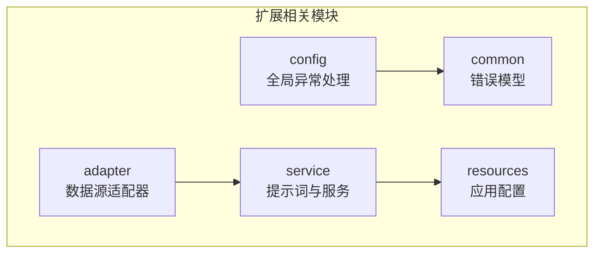
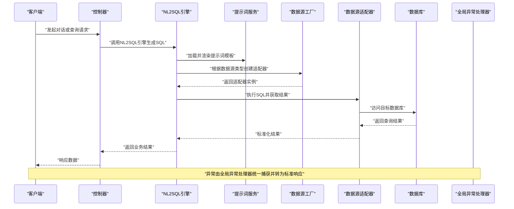
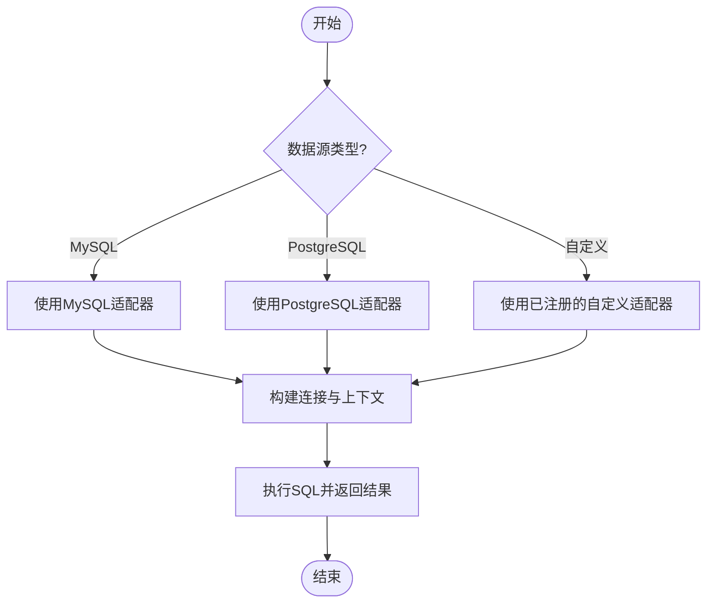
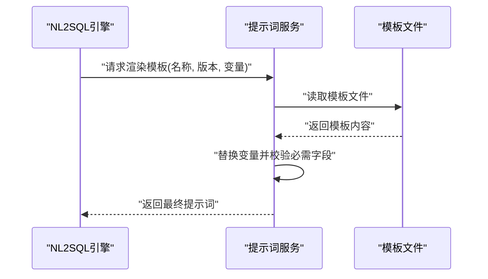
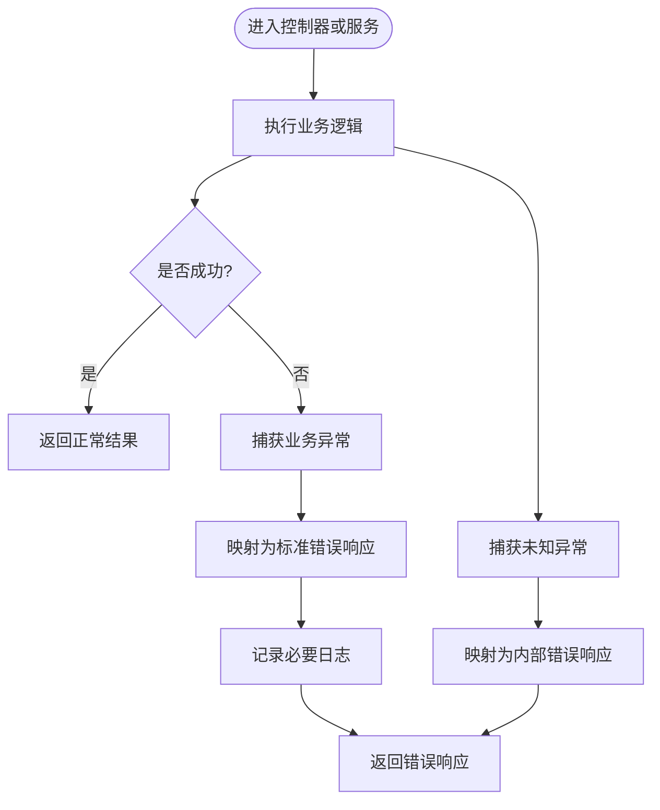
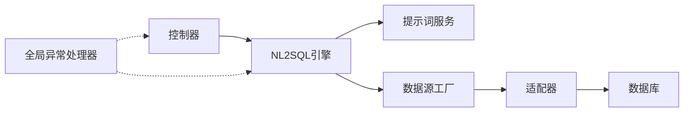
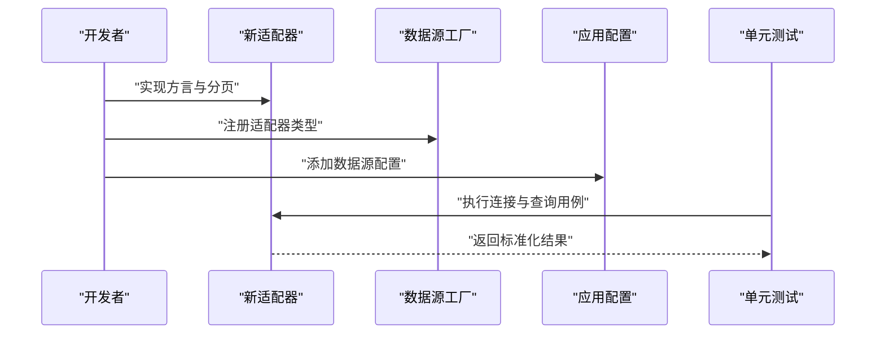
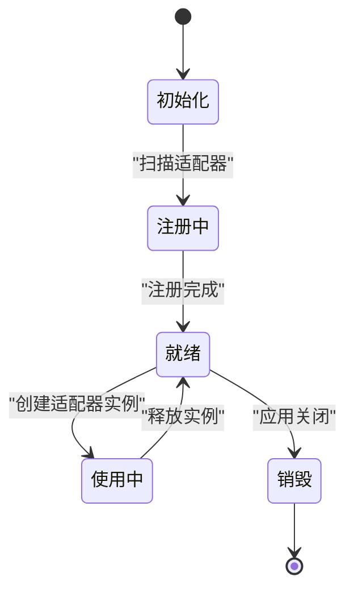

# 扩展点设计

<cite>
**本文引用的文件**   
- [BaseDataSourceAdapter.java](file://backend/backend/src/main/java/com/nlp2sql/adapter/BaseDataSourceAdapter.java)
- [DataSourceFactory.java](file://backend/backend/src/main/java/com/nlp2sql/adapter/DataSourceFactory.java)
- [MySQLAdapter.java](file://backend/backend/src/main/java/com/nlp2sql/adapter/MySQLAdapter.java)
- [PromptTemplateService.java](file://backend/backend/src/main/java/com/nlp2sql/service/PromptTemplateService.java)
- [GlobalExceptionHandler.java](file://backend/backend/src/main/java/com/nlp2sql/config/GlobalExceptionHandler.java)
- [BusinessException.java](file://backend/backend/src/main/java/com/nlp2sql/common/BusinessException.java)
- [ErrorCode.java](file://backend/backend/src/main/java/com/nlp2sql/common/ErrorCode.java)
- [application.yml](file://backend/backend/src/main/resources/application.yml)
</cite>

## 目录
1. [引言](#引言)
2. [项目结构与扩展点定位](#项目结构与扩展点定位)
3. [核心扩展点总览](#核心扩展点总览)
4. [架构概览](#架构概览)
5. [详细组件分析](#详细组件分析)
6. [依赖关系分析](#依赖关系分析)
7. [性能与可扩展性考虑](#性能与可扩展性考虑)
8. [扩展开发规范与最佳实践](#扩展开发规范与最佳实践)
9. [集成指南](#集成指南)
10. [生命周期管理与配置方式](#生命周期管理与配置方式)
11. [向后兼容性与版本管理策略](#向后兼容性与版本管理策略)
12. [故障排查指南](#故障排查指南)
13. [结论](#结论)

## 引言
本文件面向希望为系统新增数据源、提示词模板或异常处理行为的开发者，系统化说明系统的扩展点设计与插件化架构。文档围绕以下扩展主题展开：
- 数据源适配器扩展机制
- 提示词模板扩展机制
- 异常处理器扩展机制
- 扩展点的接口定义、生命周期、配置方式
- 扩展示例、集成步骤与最佳实践
- 向后兼容性与版本管理策略

## 项目结构与扩展点定位
系统后端基于 Spring Boot 组织代码，按职责划分多个包，扩展点主要分布在如下位置：
- 数据源适配层：位于 adapter 包，提供基础抽象、工厂和默认实现
- 提示词服务层：位于 service 包，负责提示词加载与组装
- 全局异常处理：位于 config 包，集中捕获并转换业务异常
- 通用错误模型：位于 common 包，统一错误码与业务异常类型
- 应用配置：resources 下 application.yml 用于驱动运行时行为



[本节未直接分析具体源码文件]

## 核心扩展点总览
系统暴露的扩展点可归纳为三类：
- 数据源适配器扩展点
  - 通过基类抽象连接参数、方言特性等共性能力
  - 通过工厂根据类型动态创建适配器实例
  - 提供 MySQL 默认实现作为参考
- 提示词模板扩展点
  - 由服务层统一管理提示词加载、版本与组合
  - 支持以外部模板文件进行扩展
- 异常处理器扩展点
  - 全局异常处理器将业务异常转换为标准响应
  - 业务异常与错误码解耦，便于扩展新的错误场景

```mermaid
classDiagram
    class BaseDataSourceAdapter {
        +获取连接信息()
        +构建查询上下文()
        +执行安全校验()
        +解析结果()
    }
    class DataSourceFactory {
        +创建适配器(类型, 配置)
        +注册适配器(类型, 工厂方法)
    }
    class MySQLAdapter {
        +方言特性()
        +分页语法()
    }
    class PromptTemplateService {
        +加载模板(名称, 版本)
        +渲染模板(模板名, 变量)
        +列出可用模板()
    }
    class GlobalExceptionHandler {
        +处理业务异常(异常)
        +处理未知异常(异常)
    }
    class BusinessException {
        +错误码()
        +消息()
        +附加信息()
    }
    class ErrorCode {
        +枚举值()
    }

    BaseDataSourceAdapter <|-- MySQLAdapter : "继承"
    DataSourceFactory --> BaseDataSourceAdapter : "创建"
    PromptTemplateService --> "使用" : "模板资源"
    GlobalExceptionHandler --> BusinessException : "捕获"
    BusinessException --> ErrorCode : "引用"
```

**图示来源**
- [BaseDataSourceAdapter.java](file://backend/backend/src/main/java/com/nlp2sql/adapter/BaseDataSourceAdapter.java)
- [DataSourceFactory.java](file://backend/backend/src/main/java/com/nlp2sql/adapter/DataSourceFactory.java)
- [MySQLAdapter.java](file://backend/backend/src/main/java/com/nlp2sql/adapter/MySQLAdapter.java)
- [PromptTemplateService.java](file://backend/backend/src/main/java/com/nlp2sql/service/PromptTemplateService.java)
- [GlobalExceptionHandler.java](file://backend/backend/src/main/java/com/nlp2sql/config/GlobalExceptionHandler.java)
- [BusinessException.java](file://backend/backend/src/main/java/com/nlp2sql/common/BusinessException.java)
- [ErrorCode.java](file://backend/backend/src/main/java/com/nlp2sql/common/ErrorCode.java)

**章节来源**
- [BaseDataSourceAdapter.java](file://backend/backend/src/main/java/com/nlp2sql/adapter/BaseDataSourceAdapter.java)
- [DataSourceFactory.java](file://backend/backend/src/main/java/com/nlp2sql/adapter/DataSourceFactory.java)
- [MySQLAdapter.java](file://backend/backend/src/main/java/com/nlp2sql/adapter/MySQLAdapter.java)
- [PromptTemplateService.java](file://backend/backend/src/main/java/com/nlp2sql/service/PromptTemplateService.java)
- [GlobalExceptionHandler.java](file://backend/backend/src/main/java/com/nlp2sql/config/GlobalExceptionHandler.java)
- [BusinessException.java](file://backend/backend/src/main/java/com/nlp2sql/common/BusinessException.java)
- [ErrorCode.java](file://backend/backend/src/main/java/com/nlp2sql/common/ErrorCode.java)

## 架构概览
下图展示从请求进入、NL2SQL 引擎到数据源适配器与提示词服务的整体流程，以及异常在何处被统一捕获并返回。



**图示来源**
- [PromptTemplateService.java](file://backend/backend/src/main/java/com/nlp2sql/service/PromptTemplateService.java)
- [DataSourceFactory.java](file://backend/backend/src/main/java/com/nlp2sql/adapter/DataSourceFactory.java)
- [BaseDataSourceAdapter.java](file://backend/backend/src/main/java/com/nlp2sql/adapter/BaseDataSourceAdapter.java)
- [GlobalExceptionHandler.java](file://backend/backend/src/main/java/com/nlp2sql/config/GlobalExceptionHandler.java)

## 详细组件分析

### 数据源适配器扩展机制
- 基类职责
  - 封装通用连接参数、方言特性、SQL 安全校验、结果标准化等
  - 提供子类可重写的方法钩子，如方言差异、分页语法、函数映射等
- 工厂职责
  - 根据配置中的“类型”字段选择对应适配器
  - 支持运行时注册新适配器，便于热插拔扩展
- 默认实现
  - MySQL 适配器演示如何覆盖方言、分页与安全策略



**图示来源**
- [DataSourceFactory.java](file://backend/backend/src/main/java/com/nlp2sql/adapter/DataSourceFactory.java)
- [BaseDataSourceAdapter.java](file://backend/backend/src/main/java/com/nlp2sql/adapter/BaseDataSourceAdapter.java)
- [MySQLAdapter.java](file://backend/backend/src/main/java/com/nlp2sql/adapter/MySQLAdapter.java)

**章节来源**
- [BaseDataSourceAdapter.java](file://backend/backend/src/main/java/com/nlp2sql/adapter/BaseDataSourceAdapter.java)
- [DataSourceFactory.java](file://backend/backend/src/main/java/com/nlp2sql/adapter/DataSourceFactory.java)
- [MySQLAdapter.java](file://backend/backend/src/main/java/com/nlp2sql/adapter/MySQLAdapter.java)

### 提示词模板扩展机制
- 模板服务职责
  - 按名称与版本加载模板
  - 渲染模板并注入上下文（如用户问题、表结构摘要、方言信息等）
  - 维护可用模板清单，便于前端或管理端展示
- 扩展方式
  - 通过外部 YAML 模板文件扩展不同场景的提示词
  - 支持多版本并存，按版本选择渲染
- 与引擎协作
  - NL2SQL 引擎在生成 SQL 前调用模板服务，确保提示词与数据源方言一致



**图示来源**
- [PromptTemplateService.java](file://backend/backend/src/main/java/com/nlp2sql/service/PromptTemplateService.java)

**章节来源**
- [PromptTemplateService.java](file://backend/backend/src/main/java/com/nlp2sql/service/PromptTemplateService.java)

### 异常处理器扩展机制
- 全局异常处理器职责
  - 捕获业务异常与未知异常
  - 将业务异常转换为统一的 API 响应格式
  - 记录必要的诊断信息，避免泄露敏感细节
- 业务异常与错误码
  - 业务异常携带错误码与附加信息
  - 错误码集中定义，便于扩展新错误类型并保持向前兼容



**图示来源**
- [GlobalExceptionHandler.java](file://backend/backend/src/main/java/com/nlp2sql/config/GlobalExceptionHandler.java)
- [BusinessException.java](file://backend/backend/src/main/java/com/nlp2sql/common/BusinessException.java)
- [ErrorCode.java](file://backend/backend/src/main/java/com/nlp2sql/common/ErrorCode.java)

**章节来源**
- [GlobalExceptionHandler.java](file://backend/backend/src/main/java/com/nlp2sql/config/GlobalExceptionHandler.java)
- [BusinessException.java](file://backend/backend/src/main/java/com/nlp2sql/common/BusinessException.java)
- [ErrorCode.java](file://backend/backend/src/main/java/com/nlp2sql/common/ErrorCode.java)

## 依赖关系分析
- 低耦合原则
  - 数据源适配器通过工厂解耦；新增数据库无需修改核心引擎
  - 提示词模板与引擎解耦，便于独立迭代
  - 异常处理与业务逻辑解耦，便于统一治理
- 关键依赖链
  - 控制器 → NL2SQL 引擎 → 提示词服务 / 数据源工厂 → 适配器 → 数据库
  - 全局异常处理器拦截所有未处理异常，向上返回统一响应



**图示来源**
- [PromptTemplateService.java](file://backend/backend/src/main/java/com/nlp2sql/service/PromptTemplateService.java)
- [DataSourceFactory.java](file://backend/backend/src/main/java/com/nlp2sql/adapter/DataSourceFactory.java)
- [BaseDataSourceAdapter.java](file://backend/backend/src/main/java/com/nlp2sql/adapter/BaseDataSourceAdapter.java)
- [GlobalExceptionHandler.java](file://backend/backend/src/main/java/com/nlp2sql/config/GlobalExceptionHandler.java)

**章节来源**
- [DataSourceFactory.java](file://backend/backend/src/main/java/com/nlp2sql/adapter/DataSourceFactory.java)
- [PromptTemplateService.java](file://backend/backend/src/main/java/com/nlp2sql/service/PromptTemplateService.java)
- [GlobalExceptionHandler.java](file://backend/backend/src/main/java/com/nlp2sql/config/GlobalExceptionHandler.java)

## 性能与可扩展性考虑
- 适配器缓存
  - 对常用元数据或方言常量进行缓存，减少重复计算
- 工厂注册优化
  - 启动时完成适配器注册，避免运行时反射开销
- 模板渲染优化
  - 预编译高频模板，按需懒加载低频模板
- 异常路径优化
  - 快速失败策略，避免无谓的资源占用
- 扩展点设计
  - 保持接口稳定，新增功能通过扩展点接入，不影响既有实现

[本节为通用建议，不直接分析具体源码文件]

## 扩展开发规范与最佳实践

### 数据源适配器扩展规范
- 继承基类
  - 继承数据源适配器基类，覆写方言、分页、函数映射等方法
- 安全优先
  - 遵循基类的安全校验策略，禁止执行高危语句
- 版本兼容
  - 针对同一数据源的不同版本，提供版本判断分支，保证兼容
- 工厂注册
  - 向工厂注册新的适配器类型，并提供唯一标识符
- 单元测试
  - 为方言差异、分页语法、结果映射编写用例

**章节来源**
- [BaseDataSourceAdapter.java](file://backend/backend/src/main/java/com/nlp2sql/adapter/BaseDataSourceAdapter.java)
- [DataSourceFactory.java](file://backend/backend/src/main/java/com/nlp2sql/adapter/DataSourceFactory.java)
- [MySQLAdapter.java](file://backend/backend/src/main/java/com/nlp2sql/adapter/MySQLAdapter.java)

### 提示词模板扩展规范
- 模板命名
  - 采用“场景_版本”命名，例如“nl2sql_query_v1”
- 变量契约
  - 明确必填变量，并在渲染前校验
- 多版本并存
  - 通过版本号控制渲染策略，逐步迁移旧版本
- 测试覆盖
  - 为典型输入构造断言，确保输出符合预期

**章节来源**
- [PromptTemplateService.java](file://backend/backend/src/main/java/com/nlp2sql/service/PromptTemplateService.java)

### 异常处理器扩展规范
- 错误码管理
  - 新增错误码需集中在错误码枚举中定义，避免散乱字符串
- 业务异常
  - 抛出业务异常时附带清晰的错误信息与上下文
- 日志与脱敏
  - 记录必要诊断信息，避免泄露密码、密钥等敏感数据
- 统一响应
  - 确保对外响应体结构一致，便于前端统一处理

**章节来源**
- [GlobalExceptionHandler.java](file://backend/backend/src/main/java/com/nlp2sql/config/GlobalExceptionHandler.java)
- [BusinessException.java](file://backend/backend/src/main/java/com/nlp2sql/common/BusinessException.java)
- [ErrorCode.java](file://backend/backend/src/main/java/com/nlp2sql/common/ErrorCode.java)

## 集成指南

### 新增数据源适配器的步骤
1. 新建适配器类，继承数据源适配器基类
2. 实现方言特性、分页语法与结果映射
3. 在工厂中注册新类型与对应的创建方法
4. 在应用配置中声明数据源类型与连接参数
5. 编写单测验证连接、查询、分页与安全校验



**图示来源**
- [BaseDataSourceAdapter.java](file://backend/backend/src/main/java/com/nlp2sql/adapter/BaseDataSourceAdapter.java)
- [DataSourceFactory.java](file://backend/backend/src/main/java/com/nlp2sql/adapter/DataSourceFactory.java)
- [application.yml](file://backend/backend/src/main/resources/application.yml)

**章节来源**
- [BaseDataSourceAdapter.java](file://backend/backend/src/main/java/com/nlp2sql/adapter/BaseDataSourceAdapter.java)
- [DataSourceFactory.java](file://backend/backend/src/main/java/com/nlp2sql/adapter/DataSourceFactory.java)
- [application.yml](file://backend/backend/src/main/resources/application.yml)

### 新增提示词模板的步骤
1. 在模板目录下新增 YAML 模板文件
2. 在模板服务中注册模板名称与版本
3. 在引擎调用处指定模板名称与版本
4. 编写渲染用例，校验变量替换与输出稳定性

**章节来源**
- [PromptTemplateService.java](file://backend/backend/src/main/java/com/nlp2sql/service/PromptTemplateService.java)

### 新增异常处理逻辑的步骤
1. 定义新的错误码
2. 在服务或控制器中抛出业务异常
3. 在全局异常处理器中补充处理分支
4. 编写用例验证响应结构与日志输出

**章节来源**
- [ErrorCode.java](file://backend/backend/src/main/java/com/nlp2sql/common/ErrorCode.java)
- [BusinessException.java](file://backend/backend/src/main/java/com/nlp2sql/common/BusinessException.java)
- [GlobalExceptionHandler.java](file://backend/backend/src/main/java/com/nlp2sql/config/GlobalExceptionHandler.java)

## 生命周期管理与配置方式

### 适配器生命周期
- 启动阶段
  - 工厂扫描并注册所有适配器类型
- 运行阶段
  - 根据请求中的数据类型选择适配器
  - 适配器负责连接建立、执行与关闭
- 销毁阶段
  - 释放连接池与临时资源



**图示来源**
- [DataSourceFactory.java](file://backend/backend/src/main/java/com/nlp2sql/adapter/DataSourceFactory.java)
- [BaseDataSourceAdapter.java](file://backend/backend/src/main/java/com/nlp2sql/adapter/BaseDataSourceAdapter.java)

### 模板生命周期
- 加载阶段
  - 启动时加载可用模板清单
- 渲染阶段
  - 按需加载模板文件并渲染
- 更新阶段
  - 支持热重载或重启后生效的策略

**章节来源**
- [PromptTemplateService.java](file://backend/backend/src/main/java/com/nlp2sql/service/PromptTemplateService.java)

### 配置方式
- 应用配置
  - application.yml 中声明数据源类型、连接参数、提示词版本等
- 环境变量
  - 敏感信息（如密码、密钥）建议使用环境变量注入
- 配置校验
  - 启动时校验必填项，缺失则快速失败

**章节来源**
- [application.yml](file://backend/backend/src/main/resources/application.yml)

## 向后兼容性与版本管理策略

### 数据源适配器
- 接口稳定
  - 基类方法保持稳定，新增能力通过可选方法或扩展点引入
- 版本标记
  - 对破坏性变更标注版本，并提供迁移指引
- 灰度发布
  - 通过配置开关切换新旧实现，降低风险

### 提示词模板
- 版本控制
  - 每个模板带版本号，默认使用稳定版本
- 渐进迁移
  - 允许旧版本继续运行，同时逐步切换到新版本
- 回滚策略
  - 若新版本导致异常，可快速切回旧版本

### 异常处理
- 错误码演进
  - 新增错误码不改变既有编码语义
- 响应体兼容
  - 新增字段采用可选形式，前端忽略未知字段

[本节为通用策略说明，不直接分析具体源码文件]

## 故障排查指南
- 无法创建数据源适配器
  - 检查工厂是否注册了该类型
  - 确认应用配置中的类型与连接参数正确
- 提示词渲染失败
  - 检查模板名称与版本是否存在
  - 校验必填变量是否传入
- 异常未返回标准响应
  - 确认抛出的为业务异常
  - 检查全局异常处理器是否捕获到相应类型

**章节来源**
- [DataSourceFactory.java](file://backend/backend/src/main/java/com/nlp2sql/adapter/DataSourceFactory.java)
- [PromptTemplateService.java](file://backend/backend/src/main/java/com/nlp2sql/service/PromptTemplateService.java)
- [GlobalExceptionHandler.java](file://backend/backend/src/main/java/com/nlp2sql/config/GlobalExceptionHandler.java)

## 结论
通过将数据源适配器、提示词模板与异常处理抽象为可扩展的组件，系统在保持核心稳定的前提下具备强大的插件化能力。开发者只需遵循既定接口与规范，即可在不侵入主流程的情况下扩展新的数据库、新的提示词场景与新的错误处理策略。配合清晰的生命周期与配置管理，以及稳健的版本与兼容性策略，系统能够持续演进并支撑多样化的业务需求。