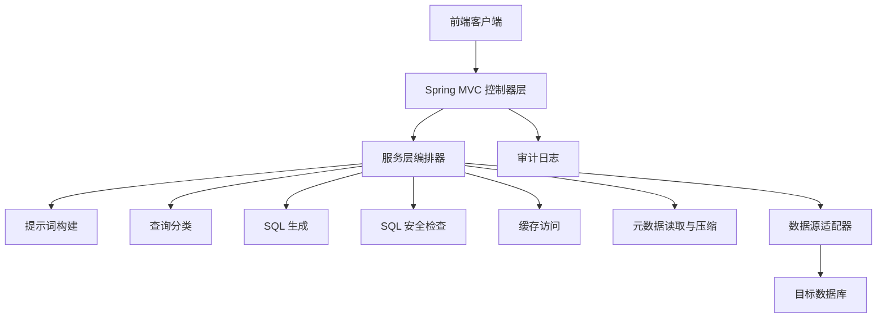
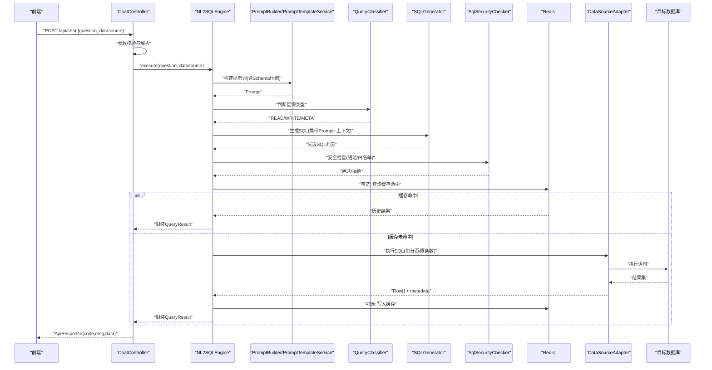
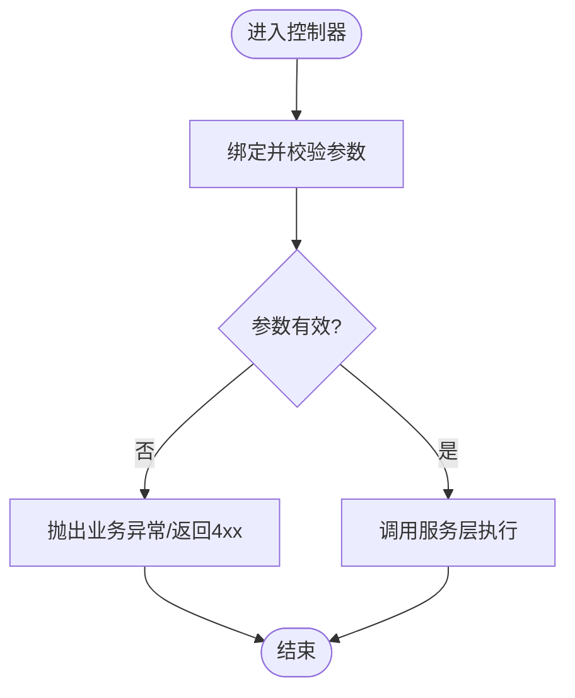
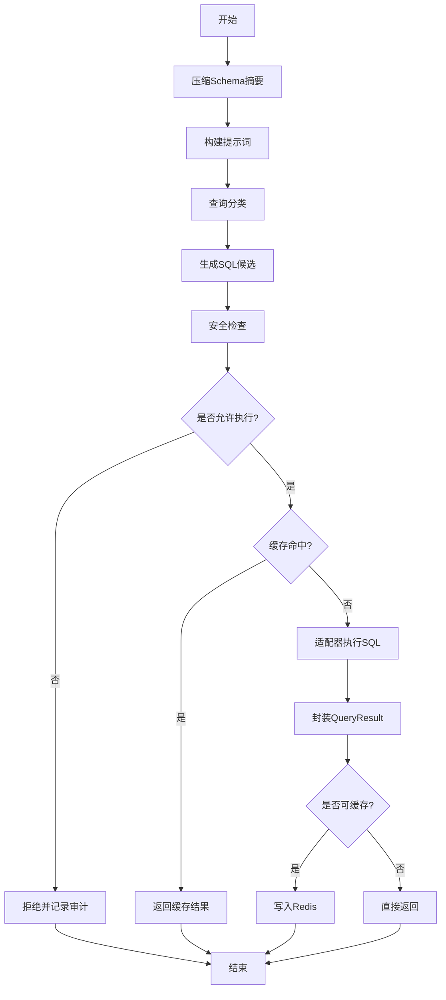
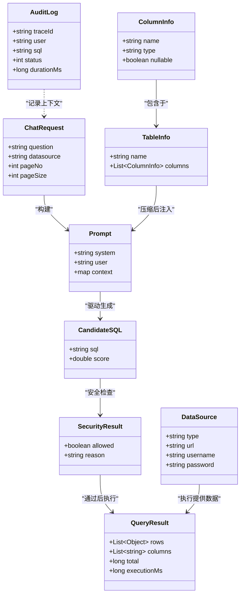
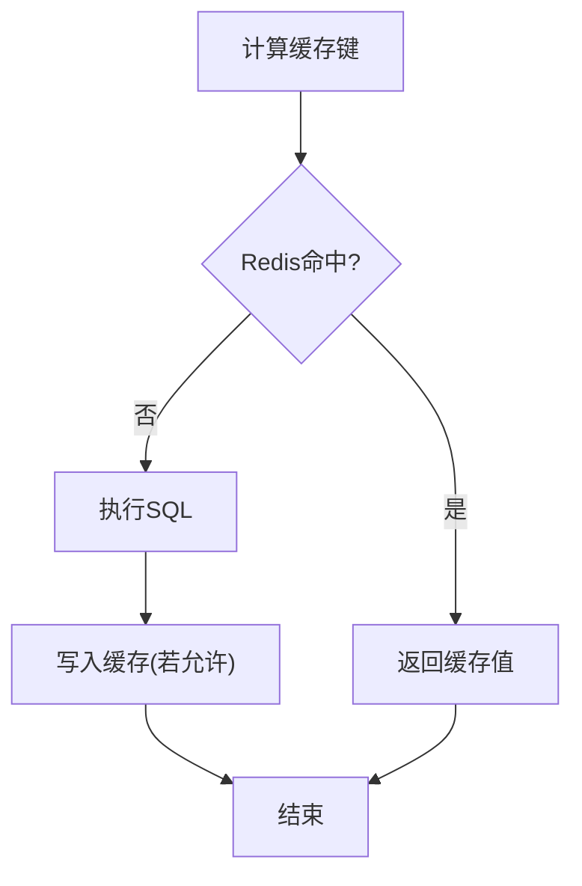
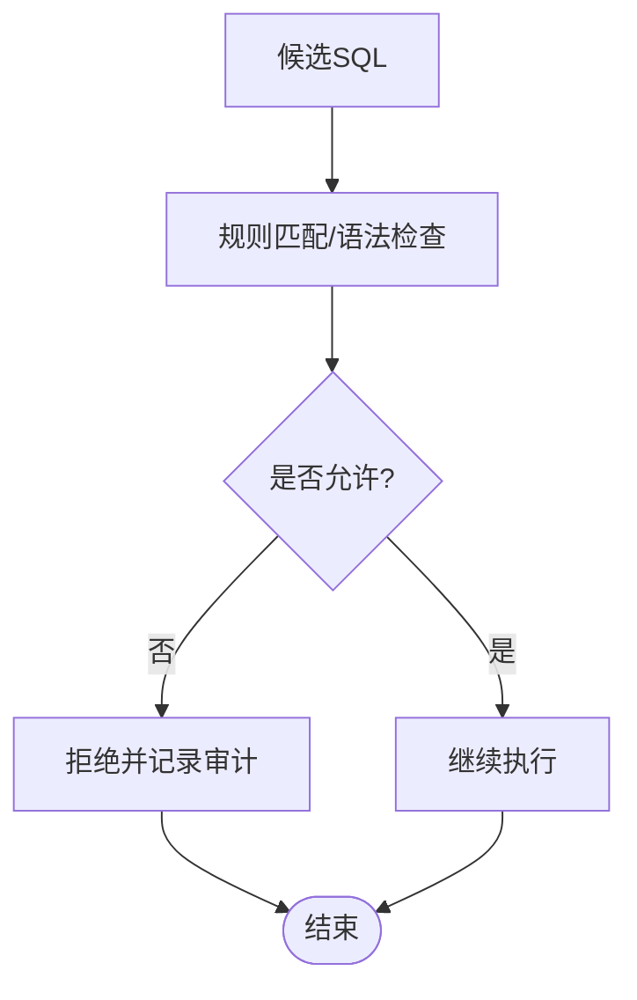
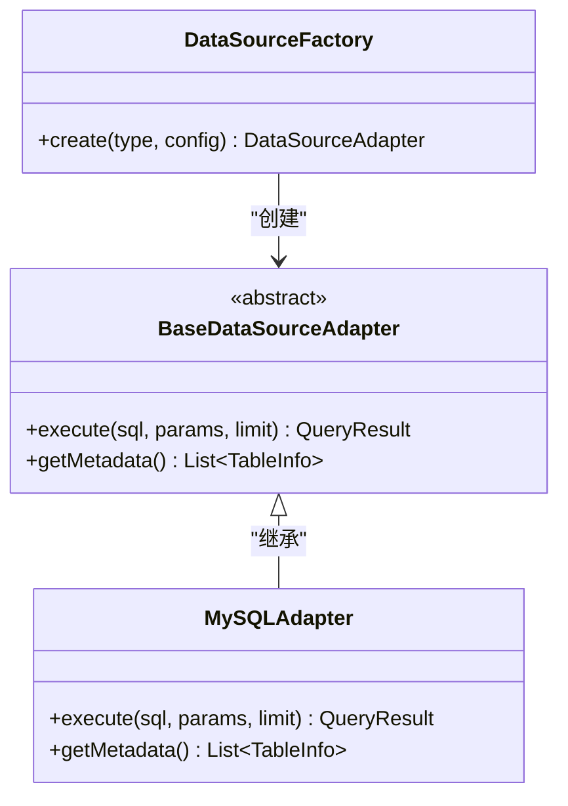
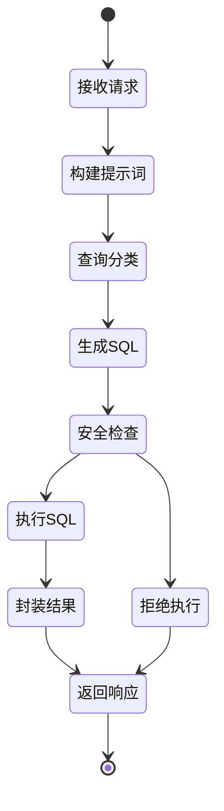
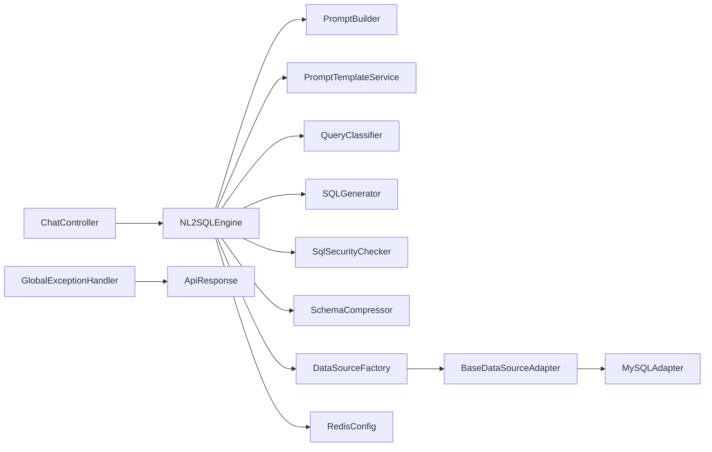

# 数据流设计

<cite>
**本文引用的文件**   
- [Nlp2SqlApplication.java](file://backend/backend/src/main/java/com/nlp2sql/Nlp2SqlApplication.java)
- [ChatController.java](file://backend/backend/src/main/java/com/nlp2sql/controller/ChatController.java)
- [NL2SQLEngine.java](file://backend/backend/src/main/java/com/nlp2sql/service/NL2SQLEngine.java)
- [SQLGenerator.java](file://backend/backend/src/main/java/com/nlp2sql/service/SQLGenerator.java)
- [PromptBuilder.java](file://backend/backend/src/main/java/com/nlp2sql/service/PromptBuilder.java)
- [PromptTemplateService.java](file://backend/backend/src/main/java/com/nlp2sql/service/PromptTemplateService.java)
- [QueryClassifier.java](file://backend/backend/src/main/java/com/nlp2sql/service/QueryClassifier.java)
- [SchemaCompressor.java](file://backend/backend/src/main/java/com/nlp2sql/service/SchemaCompressor.java)
- [SqlSecurityChecker.java](file://backend/backend/src/main/java/com/nlp2sql/security/SqlSecurityChecker.java)
- [DataSourceFactory.java](file://backend/backend/src/main/java/com/nlp2sql/adapter/DataSourceFactory.java)
- [BaseDataSourceAdapter.java](file://backend/backend/src/main/java/com/nlp2sql/adapter/BaseDataSourceAdapter.java)
- [MySQLAdapter.java](file://backend/backend/src/main/java/com/nlp2sql/adapter/MySQLAdapter.java)
- [RedisConfig.java](file://backend/backend/src/main/java/com/nlp2sql/config/RedisConfig.java)
- [TraceIdFilter.java](file://backend/backend/src/main/java/com/nlp2sql/common/TraceIdFilter.java)
- [GlobalExceptionHandler.java](file://backend/backend/src/main/java/com/nlp2sql/config/GlobalExceptionHandler.java)
- [BusinessException.java](file://backend/backend/src/main/java/com/nlp2sql/common/BusinessException.java)
- [ErrorCode.java](file://backend/backend/src/main/java/com/nlp2sql/common/ErrorCode.java)
- [ApiResponse.java](file://backend/backend/src/main/java/com/nlp2sql/model/dto/ApiResponse.java)
- [ChatRequest.java](file://backend/backend/src/main/java/com/nlp2sql/model/dto/ChatRequest.java)
- [ChatResponse.java](file://backend/backend/src/main/java/com/nlp2sql/model/dto/ChatResponse.java)
- [QueryResult.java](file://backend/backend/src/main/java/com/nlp2sql/model/dto/QueryResult.java)
- [DataSource.java](file://backend/backend/src/main/java/com/nlp2sql/model/DataSource.java)
- [TableInfo.java](file://backend/backend/src/main/java/com/nlp2sql/model/TableInfo.java)
- [ColumnInfo.java](file://backend/backend/src/main/java/com/nlp2sql/model/ColumnInfo.java)
- [AuditLog.java](file://backend/backend/src/main/java/com/nlp2sql/model/AuditLog.java)
- [User.java](file://backend/backend/src/main/java/com/nlp2sql/model/User.java)
- [application.yml](file://backend/backend/src/main/resources/application.yml)
</cite>

## 目录
1. [引言](#引言)
2. [项目结构](#项目结构)
3. [核心组件](#核心组件)
4. [架构总览](#架构总览)
5. [详细数据流分析](#详细数据流分析)
6. [依赖关系分析](#依赖关系分析)
7. [性能与一致性](#性能与一致性)
8. [故障排查指南](#故障排查指南)
9. [结论](#结论)

## 引言
本文面向 NL2SQL 后端系统，聚焦“从用户输入到 SQL 执行结果返回”的完整数据流设计。文档覆盖请求路由、参数校验与转换、自然语言到 SQL 的生成链路、安全校验、缓存处理、元数据压缩、数据源适配、错误传播、事务边界、异步扩展点以及性能优化策略，帮助读者理解各层对象在系统中的流转与变换。

## 项目结构
后端采用 Spring Boot + MyBatis Plus 的分层架构：
- 控制器层：接收 HTTP 请求，完成参数绑定、基础校验，调用服务层。
- 服务层：编排 NL2SQL 核心流程，包括提示词构建、查询分类、SQL 生成、安全校验、缓存与审计。
- 适配器层：抽象多数据源执行能力，当前实现 MySQL 适配器。
- 安全层：JWT 认证、SQL 安全规则检查。
- 配置层：Redis、MyBatis Plus、Web、安全等配置。
- 通用与模型：统一响应体、业务异常、DTO/VO/领域模型。

[本图为概念性结构示意，不直接映射具体代码文件]

## 核心组件
- 入口应用：Nlp2SqlApplication 负责 Spring Boot 应用启动与扫描。
- 控制器：ChatController 暴露对话式 NL2SQL 接口，接收 ChatRequest，返回 ChatResponse。
- NL2SQL 引擎：NL2SQLEngine 串联提示词构建、查询分类、SQL 生成、安全校验、缓存与执行。
- SQL 生成：SQLGenerator 负责将自然语言与上下文转换为候选 SQL。
- 提示词：PromptBuilder 与 PromptTemplateService 负责模板加载与变量注入。
- 查询分类：QueryClassifier 判断是否为读/写或元数据类查询，决定后续策略。
- 元数据压缩：SchemaCompressor 压缩表结构与列信息，减少 LLM 上下文开销。
- 安全校验：SqlSecurityChecker 对生成的 SQL 进行白名单与风险语法检查。
- 数据源适配：DataSourceFactory 根据配置选择具体适配器；BaseDataSourceAdapter 提供公共执行逻辑；MySQLAdapter 实现 MySQL 方言。
- 缓存：RedisConfig 提供 Redis 连接与键空间约定，用于缓存 Schema 摘要、热点查询结果。
- 追踪与异常：TraceIdFilter 为请求注入 TraceId；GlobalExceptionHandler 统一异常包装为 ApiResponse。

**章节来源**
- [Nlp2SqlApplication.java](file://backend/backend/src/main/java/com/nlp2sql/Nlp2SqlApplication.java)
- [ChatController.java](file://backend/backend/src/main/java/com/nlp2sql/controller/ChatController.java)
- [NL2SQLEngine.java](file://backend/backend/src/main/java/com/nlp2sql/service/NL2SQLEngine.java)
- [SQLGenerator.java](file://backend/backend/src/main/java/com/nlp2sql/service/SQLGenerator.java)
- [PromptBuilder.java](file://backend/backend/src/main/java/com/nlp2sql/service/PromptBuilder.java)
- [PromptTemplateService.java](file://backend/backend/src/main/java/com/nlp2sql/service/PromptTemplateService.java)
- [QueryClassifier.java](file://backend/backend/src/main/java/com/nlp2sql/service/QueryClassifier.java)
- [SchemaCompressor.java](file://backend/backend/src/main/java/com/nlp2sql/service/SchemaCompressor.java)
- [SqlSecurityChecker.java](file://backend/backend/src/main/java/com/nlp2sql/security/SqlSecurityChecker.java)
- [DataSourceFactory.java](file://backend/backend/src/main/java/com/nlp2sql/adapter/DataSourceFactory.java)
- [BaseDataSourceAdapter.java](file://backend/backend/src/main/java/com/nlp2sql/adapter/BaseDataSourceAdapter.java)
- [MySQLAdapter.java](file://backend/backend/src/main/java/com/nlp2sql/adapter/MySQLAdapter.java)
- [RedisConfig.java](file://backend/backend/src/main/java/com/nlp2sql/config/RedisConfig.java)
- [TraceIdFilter.java](file://backend/backend/src/main/java/com/nlp2sql/common/TraceIdFilter.java)
- [GlobalExceptionHandler.java](file://backend/backend/src/main/java/com/nlp2sql/config/GlobalExceptionHandler.java)

## 架构总览
下图展示一次典型聊天请求的数据流：从前端到控制器的参数绑定，再到服务层的 NL2SQL 流水线，最终通过适配器执行 SQL 并返回结构化结果。

**图表来源**
- [ChatController.java](file://backend/backend/src/main/java/com/nlp2sql/controller/ChatController.java)
- [NL2SQLEngine.java](file://backend/backend/src/main/java/com/nlp2sql/service/NL2SQLEngine.java)
- [PromptBuilder.java](file://backend/backend/src/main/java/com/nlp2sql/service/PromptBuilder.java)
- [PromptTemplateService.java](file://backend/backend/src/main/java/com/nlp2sql/service/PromptTemplateService.java)
- [QueryClassifier.java](file://backend/backend/src/main/java/com/nlp2sql/service/QueryClassifier.java)
- [SQLGenerator.java](file://backend/backend/src/main/java/com/nlp2sql/service/SQLGenerator.java)
- [SqlSecurityChecker.java](file://backend/backend/src/main/java/com/nlp2sql/security/SqlSecurityChecker.java)
- [RedisConfig.java](file://backend/backend/src/main/java/com/nlp2sql/config/RedisConfig.java)
- [BaseDataSourceAdapter.java](file://backend/backend/src/main/java/com/nlp2sql/adapter/BaseDataSourceAdapter.java)
- [MySQLAdapter.java](file://backend/backend/src/main/java/com/nlp2sql/adapter/MySQLAdapter.java)

## 详细数据流分析

### 1. 请求接入与参数传递
- 控制器接收 ChatRequest，包含问题文本、数据源标识、分页参数等。
- 进行基础非空与长度校验，必要时将 DTO 转为内部领域对象。
- 将 TraceId 透传到后续链路（由过滤器注入）。

**图表来源**
- [ChatController.java](file://backend/backend/src/main/java/com/nlp2sql/controller/ChatController.java)
- [TraceIdFilter.java](file://backend/backend/src/main/java/com/nlp2sql/common/TraceIdFilter.java)
- [ApiResponse.java](file://backend/backend/src/main/java/com/nlp2sql/model/dto/ApiResponse.java)

**章节来源**
- [ChatController.java](file://backend/backend/src/main/java/com/nlp2sql/controller/ChatController.java)
- [TraceIdFilter.java](file://backend/backend/src/main/java/com/nlp2sql/common/TraceIdFilter.java)

### 2. NL2SQL 主流程
NL2SQLEngine 作为编排中心，按以下顺序推进：
1. 加载 Schema 摘要：通过 SchemaCompressor 压缩 TableInfo/ColumnInfo 为紧凑表示。
2. 构建提示词：PromptTemplateService 加载外部 YAML 模板，PromptBuilder 注入用户问题、Schema 摘要、数据源方言等信息。
3. 查询分类：QueryClassifier 识别是否为读、写、DDL/DML 危险操作或元数据查询。
4. SQL 生成：SQLGenerator 基于提示词与上下文生成候选 SQL，支持多条候选并按策略择优。
5. 安全校验：SqlSecurityChecker 对候选 SQL 进行语法树或正则规则检查，过滤高风险语句。
6. 缓存决策：对只读且稳定的查询计算缓存键（如规范化后的 SQL + 数据源），尝试命中 Redis。
7. 执行与结果封装：通过 DataSourceAdapter 执行 SQL，获取 Row[] 与字段元数据，封装为 QueryResult。

**图表来源**
- [NL2SQLEngine.java](file://backend/backend/src/main/java/com/nlp2sql/service/NL2SQLEngine.java)
- [SchemaCompressor.java](file://backend/backend/src/main/java/com/nlp2sql/service/SchemaCompressor.java)
- [PromptBuilder.java](file://backend/backend/src/main/java/com/nlp2sql/service/PromptBuilder.java)
- [PromptTemplateService.java](file://backend/backend/src/main/java/com/nlp2sql/service/PromptTemplateService.java)
- [QueryClassifier.java](file://backend/backend/src/main/java/com/nlp2sql/service/QueryClassifier.java)
- [SQLGenerator.java](file://backend/backend/src/main/java/com/nlp2sql/service/SQLGenerator.java)
- [SqlSecurityChecker.java](file://backend/backend/src/main/java/com/nlp2sql/security/SqlSecurityChecker.java)
- [RedisConfig.java](file://backend/backend/src/main/java/com/nlp2sql/config/RedisConfig.java)
- [BaseDataSourceAdapter.java](file://backend/backend/src/main/java/com/nlp2sql/adapter/BaseDataSourceAdapter.java)

**章节来源**
- [NL2SQLEngine.java](file://backend/backend/src/main/java/com/nlp2sql/service/NL2SQLEngine.java)
- [PromptBuilder.java](file://backend/backend/src/main/java/com/nlp2sql/service/PromptBuilder.java)
- [PromptTemplateService.java](file://backend/backend/src/main/java/com/nlp2sql/service/PromptTemplateService.java)
- [QueryClassifier.java](file://backend/backend/src/main/java/com/nlp2sql/service/QueryClassifier.java)
- [SQLGenerator.java](file://backend/backend/src/main/java/com/nlp2sql/service/SQLGenerator.java)
- [SchemaCompressor.java](file://backend/backend/src/main/java/com/nlp2sql/service/SchemaCompressor.java)
- [SqlSecurityChecker.java](file://backend/backend/src/main/java/com/nlp2sql/security/SqlSecurityChecker.java)
- [RedisConfig.java](file://backend/backend/src/main/java/com/nlp2sql/config/RedisConfig.java)

### 3. 关键数据对象及其转换
- ChatRequest：前端入参，包含 question、datasource、pageNo、pageSize 等。
- Prompt：由 PromptBuilder 组装的自然语言指令与 Schema 摘要。
- CandidateSQL：SQLGenerator 产出的候选 SQL 集合。
- SecurityResult：SqlSecurityChecker 的输出，标记允许/拒绝及原因。
- QueryResult：封装 rows、columns、total、executionTime 等。
- DataSource/Connection：由 DataSourceFactory 根据配置创建连接池。
- TableInfo/ColumnInfo：元数据实体，被 SchemaCompressor 压缩为轻量摘要。
- AuditLog：记录用户、SQL、耗时、状态码，便于审计与分析。

**图表来源**
- [ChatRequest.java](file://backend/backend/src/main/java/com/nlp2sql/model/dto/ChatRequest.java)
- [PromptBuilder.java](file://backend/backend/src/main/java/com/nlp2sql/service/PromptBuilder.java)
- [SQLGenerator.java](file://backend/backend/src/main/java/com/nlp2sql/service/SQLGenerator.java)
- [SqlSecurityChecker.java](file://backend/backend/src/main/java/com/nlp2sql/security/SqlSecurityChecker.java)
- [QueryResult.java](file://backend/backend/src/main/java/com/nlp2sql/model/dto/QueryResult.java)
- [DataSource.java](file://backend/backend/src/main/java/com/nlp2sql/model/DataSource.java)
- [TableInfo.java](file://backend/backend/src/main/java/com/nlp2sql/model/TableInfo.java)
- [ColumnInfo.java](file://backend/backend/src/main/java/com/nlp2sql/model/ColumnInfo.java)
- [AuditLog.java](file://backend/backend/src/main/java/com/nlp2sql/model/AuditLog.java)

**章节来源**
- [ChatRequest.java](file://backend/backend/src/main/java/com/nlp2sql/model/dto/ChatRequest.java)
- [QueryResult.java](file://backend/backend/src/main/java/com/nlp2sql/model/dto/QueryResult.java)
- [DataSource.java](file://backend/backend/src/main/java/com/nlp2sql/model/DataSource.java)
- [TableInfo.java](file://backend/backend/src/main/java/com/nlp2sql/model/TableInfo.java)
- [ColumnInfo.java](file://backend/backend/src/main/java/com/nlp2sql/model/ColumnInfo.java)
- [AuditLog.java](file://backend/backend/src/main/java/com/nlp2sql/model/AuditLog.java)

### 4. 缓存处理
- 键空间：建议以“数据源标识 + 规范化SQL + 分页参数哈希”组成缓存键。
- 命中策略：仅对 SELECT 且无会话状态的查询启用缓存。
- 失效策略：DML/DDL 变更后主动清理相关 Schema 摘要缓存。
- TTL：根据数据新鲜度要求设置过期时间，避免脏读。

**图表来源**
- [RedisConfig.java](file://backend/backend/src/main/java/com/nlp2sql/config/RedisConfig.java)
- [NL2SQLEngine.java](file://backend/backend/src/main/java/com/nlp2sql/service/NL2SQLEngine.java)

**章节来源**
- [RedisConfig.java](file://backend/backend/src/main/java/com/nlp2sql/config/RedisConfig.java)
- [NL2SQLEngine.java](file://backend/backend/src/main/java/com/nlp2sql/service/NL2SQLEngine.java)

### 5. 安全校验与审计
- SQL 安全检查：禁止高危关键字、限制 JOIN/子查询复杂度、强制表名白名单（可按数据源维度配置）。
- 审计记录：统一记录 TraceId、用户、SQL、状态码、耗时，便于溯源。
- 异常分类：业务异常（BusinessException）与系统异常分别处理，统一封装为 ApiResponse。

**图表来源**
- [SqlSecurityChecker.java](file://backend/backend/src/main/java/com/nlp2sql/security/SqlSecurityChecker.java)
- [AuditLog.java](file://backend/backend/src/main/java/com/nlp2sql/model/AuditLog.java)
- [GlobalExceptionHandler.java](file://backend/backend/src/main/java/com/nlp2sql/config/GlobalExceptionHandler.java)
- [BusinessException.java](file://backend/backend/src/main/java/com/nlp2sql/common/BusinessException.java)
- [ApiResponse.java](file://backend/backend/src/main/java/com/nlp2sql/model/dto/ApiResponse.java)

**章节来源**
- [SqlSecurityChecker.java](file://backend/backend/src/main/java/com/nlp2sql/security/SqlSecurityChecker.java)
- [GlobalExceptionHandler.java](file://backend/backend/src/main/java/com/nlp2sql/config/GlobalExceptionHandler.java)
- [BusinessException.java](file://backend/backend/src/main/java/com/nlp2sql/common/BusinessException.java)
- [ApiResponse.java](file://backend/backend/src/main/java/com/nlp2sql/model/dto/ApiResponse.java)

### 6. 数据源适配与事务边界
- 工厂模式：DataSourceFactory 依据 application.yml 中 datasource.type 选择具体实现。
- 基类抽象：BaseDataSourceAdapter 定义 execute(sql, params, limit)、getMetadata() 等接口。
- 方言实现：MySQLAdapter 针对 MySQL 方言与分页策略做适配。
- 事务边界：读操作使用只读事务；写操作开启事务并在异常时回滚。

**图表来源**
- [DataSourceFactory.java](file://backend/backend/src/main/java/com/nlp2sql/adapter/DataSourceFactory.java)
- [BaseDataSourceAdapter.java](file://backend/backend/src/main/java/com/nlp2sql/adapter/BaseDataSourceAdapter.java)
- [MySQLAdapter.java](file://backend/backend/src/main/java/com/nlp2sql/adapter/MySQLAdapter.java)

**章节来源**
- [DataSourceFactory.java](file://backend/backend/src/main/java/com/nlp2sql/adapter/DataSourceFactory.java)
- [BaseDataSourceAdapter.java](file://backend/backend/src/main/java/com/nlp2sql/adapter/BaseDataSourceAdapter.java)
- [MySQLAdapter.java](file://backend/backend/src/main/java/com/nlp2sql/adapter/MySQLAdapter.java)
- [application.yml](file://backend/backend/src/main/resources/application.yml)

### 7. 状态转换图（NL2SQL 生命周期）

[本图为概念性状态转换，不直接映射具体代码文件]

## 依赖关系分析
- 控制器依赖服务层：ChatController -> NL2SQLEngine。
- 服务层依赖工具与组件：NL2SQLEngine -> PromptBuilder、PromptTemplateService、QueryClassifier、SQLGenerator、SqlSecurityChecker、SchemaCompressor、DataSourceFactory、Redis。
- 适配器层解耦数据源：DataSourceFactory -> BaseDataSourceAdapter -> MySQLAdapter。
- 安全与异常：GlobalExceptionHandler 捕获所有未处理异常并转为 ApiResponse。
- 配置：application.yml 提供数据源、Redis、LLM 等配置项。

**图表来源**
- [ChatController.java](file://backend/backend/src/main/java/com/nlp2sql/controller/ChatController.java)
- [NL2SQLEngine.java](file://backend/backend/src/main/java/com/nlp2sql/service/NL2SQLEngine.java)
- [PromptBuilder.java](file://backend/backend/src/main/java/com/nlp2sql/service/PromptBuilder.java)
- [PromptTemplateService.java](file://backend/backend/src/main/java/com/nlp2sql/service/PromptTemplateService.java)
- [QueryClassifier.java](file://backend/backend/src/main/java/com/nlp2sql/service/QueryClassifier.java)
- [SQLGenerator.java](file://backend/backend/src/main/java/com/nlp2sql/service/SQLGenerator.java)
- [SqlSecurityChecker.java](file://backend/backend/src/main/java/com/nlp2sql/security/SqlSecurityChecker.java)
- [SchemaCompressor.java](file://backend/backend/src/main/java/com/nlp2sql/service/SchemaCompressor.java)
- [DataSourceFactory.java](file://backend/backend/src/main/java/com/nlp2sql/adapter/DataSourceFactory.java)
- [BaseDataSourceAdapter.java](file://backend/backend/src/main/java/com/nlp2sql/adapter/BaseDataSourceAdapter.java)
- [MySQLAdapter.java](file://backend/backend/src/main/java/com/nlp2sql/adapter/MySQLAdapter.java)
- [RedisConfig.java](file://backend/backend/src/main/java/com/nlp2sql/config/RedisConfig.java)
- [GlobalExceptionHandler.java](file://backend/backend/src/main/java/com/nlp2sql/config/GlobalExceptionHandler.java)
- [ApiResponse.java](file://backend/backend/src/main/java/com/nlp2sql/model/dto/ApiResponse.java)

**章节来源**
- [ChatController.java](file://backend/backend/src/main/java/com/nlp2sql/controller/ChatController.java)
- [NL2SQLEngine.java](file://backend/backend/src/main/java/com/nlp2sql/service/NL2SQLEngine.java)
- [application.yml](file://backend/backend/src/main/resources/application.yml)

## 性能与一致性
- 性能优化
  - Schema 压缩：仅传输必要表/列信息，降低 LLM 输入成本。
  - 缓存：Redis 缓存热点查询结果，降低数据库压力。
  - 分页与限条：强制 LIMIT 与分页参数，防止大结果集拖垮链路。
  - 并行化：对多个候选 SQL 的安全检查与执行可进行并发评估（需谨慎保证幂等）。
  - 连接池：合理配置 HikariCP/Druid 等连接池参数，提高吞吐。
- 一致性保障
  - 只读事务：SELECT 走只读事务，减少锁竞争。
  - 写事务：DML 包裹事务，异常回滚，确保原子性。
  - 缓存失效：DDL/DML 变更后主动清理相关 Schema 摘要与查询缓存。
  - 审计与追踪：全链路 TraceId，结合审计日志进行回溯。
- 异步处理建议
  - 长耗时任务（如复杂 SQL 生成、大批量导出）可改为异步队列，前端轮询或 WebSocket 推送结果。
  - 异步任务需保留 TraceId 与上下文，便于监控。

[本节为通用指导，不直接分析具体文件]

## 故障排查指南
- 常见问题定位
  - 参数校验失败：检查 ChatRequest 必填字段与格式。
  - SQL 被拒绝：查看 SqlSecurityChecker 拒绝原因，调整白名单或改写问题。
  - 缓存不一致：确认 DDL/DML 后是否触发缓存清理；核对缓存键构成。
  - 数据源连接失败：检查 application.yml 中数据源配置与网络连通性。
  - 异常未捕获：确认 GlobalExceptionHandler 是否正确拦截并返回 ApiResponse。
- 诊断步骤
  - 使用 TraceId 关联日志，快速定位链路瓶颈。
  - 打开慢查询日志，观察 SQL 执行耗时。
  - 监控 Redis 命中率与延迟，必要时扩容或调整 TTL。
  - 审计日志中检索高危 SQL 与失败请求，及时复盘。

**章节来源**
- [GlobalExceptionHandler.java](file://backend/backend/src/main/java/com/nlp2sql/config/GlobalExceptionHandler.java)
- [BusinessException.java](file://backend/backend/src/main/java/com/nlp2sql/common/BusinessException.java)
- [ErrorCode.java](file://backend/backend/src/main/java/com/nlp2sql/common/ErrorCode.java)
- [ApiResponse.java](file://backend/backend/src/main/java/com/nlp2sql/model/dto/ApiResponse.java)
- [SqlSecurityChecker.java](file://backend/backend/src/main/java/com/nlp2sql/security/SqlSecurityChecker.java)
- [RedisConfig.java](file://backend/backend/src/main/java/com/nlp2sql/config/RedisConfig.java)
- [application.yml](file://backend/backend/src/main/resources/application.yml)

## 结论
本数据流设计围绕 NL2SQL 的核心链路展开，通过分层解耦、安全前置、缓存加速与适配器抽象，在保证一致性与安全性的前提下提升性能与可扩展性。建议在后续迭代中引入异步任务与更细粒度的权限控制，并结合指标监控持续优化。