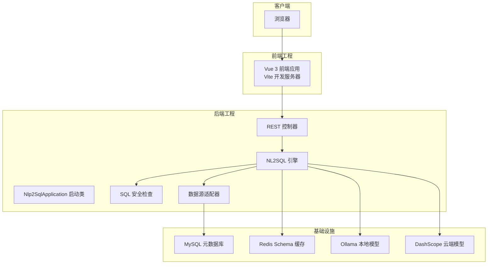
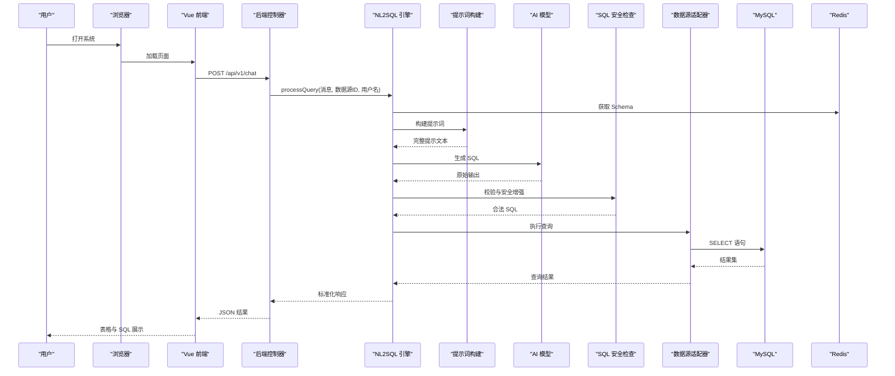
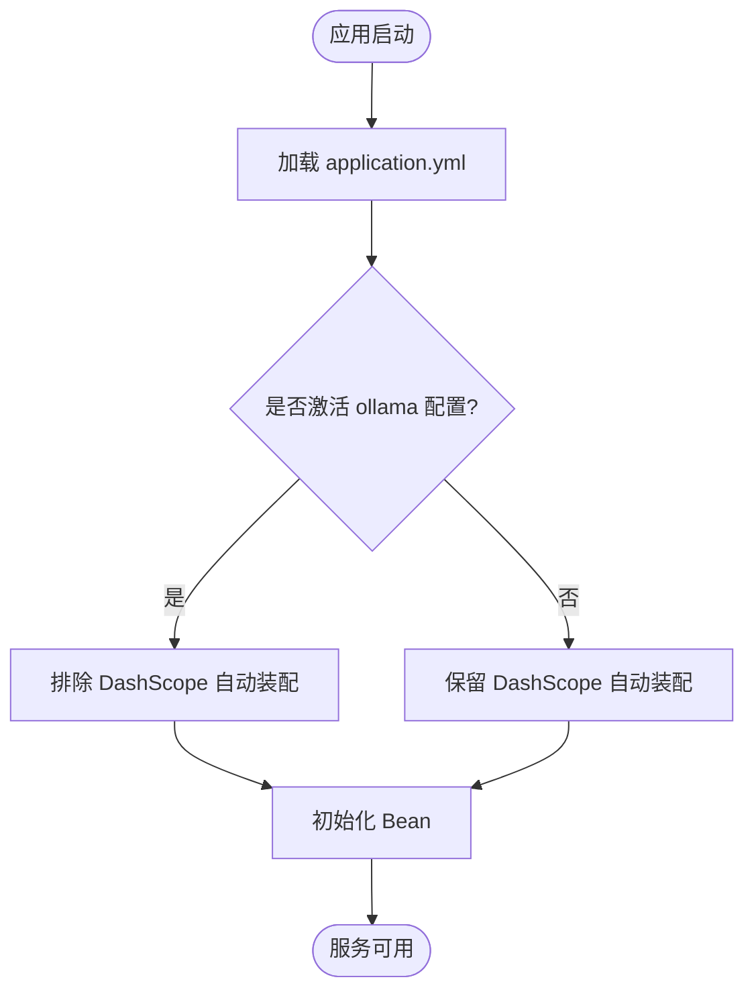
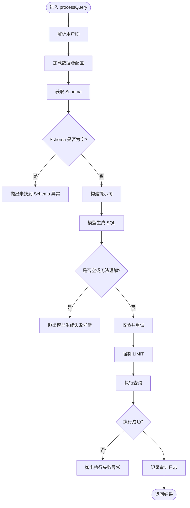
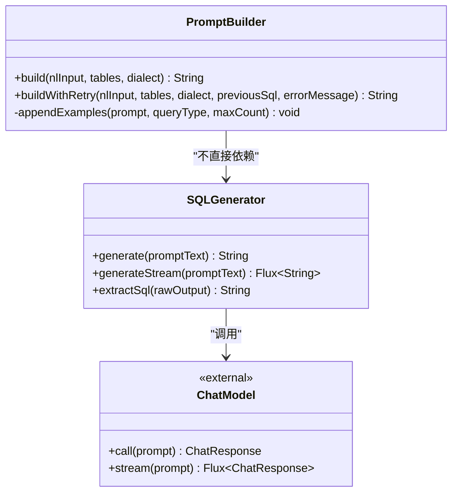
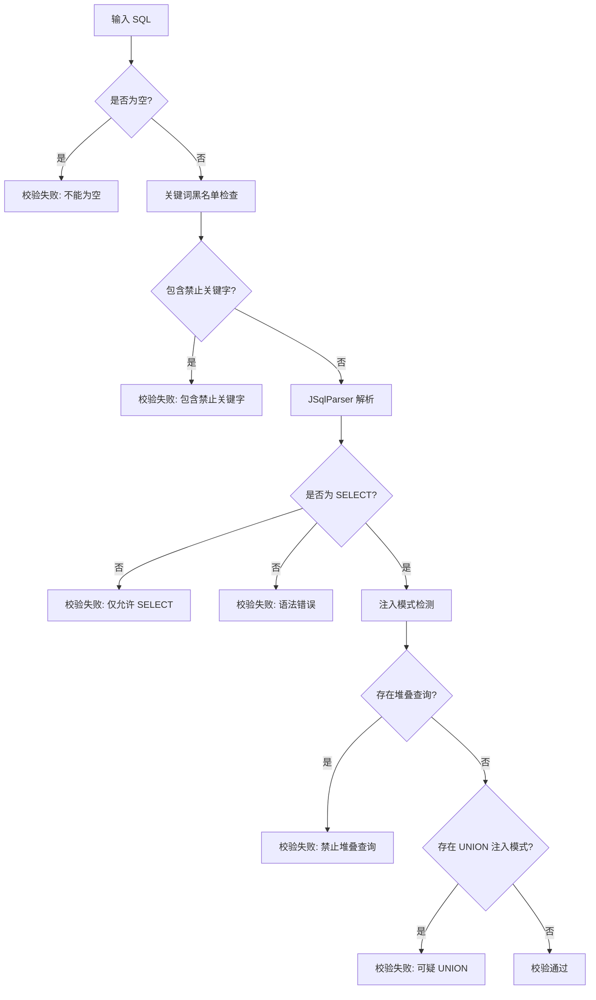
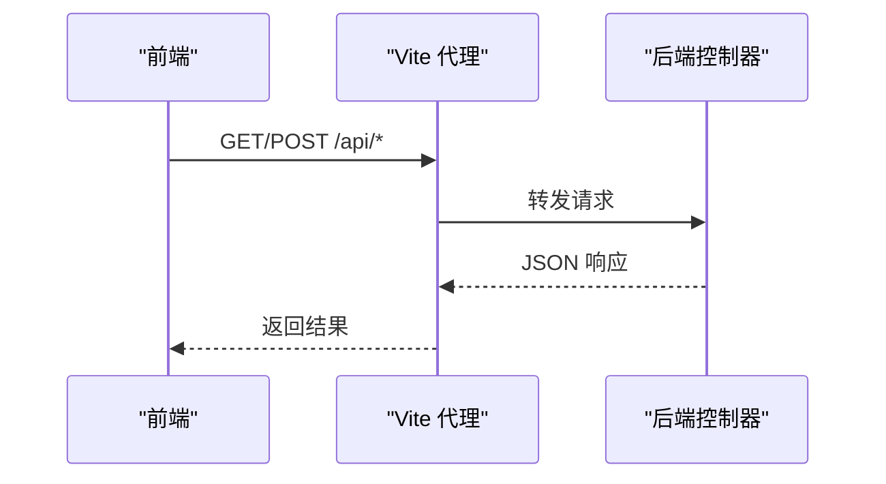
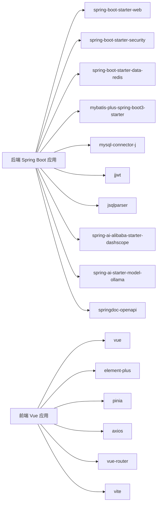
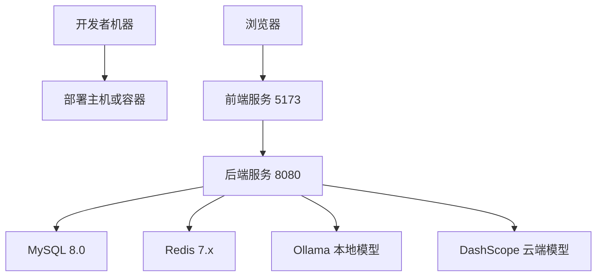

# 架构总览

<cite>
**本文引用的文件**
- [backend/pom.xml](file://backend/pom.xml)
- [frontend/package.json](file://frontend/package.json)
- [backend/src/main/java/com/nlp2sql/Nlp2SqlApplication.java](file://backend/src/main/java/com/nlp2sql/Nlp2SqlApplication.java)
- [backend/src/main/resources/application.yml](file://backend/src/main/resources/application.yml)
- [backend/src/main/resources/application-ollama.yml](file://backend/src/main/resources/application-ollama.yml)
- [frontend/vite.config.js](file://frontend/vite.config.js)
- [backend/src/main/java/com/nlp2sql/controller/ChatController.java](file://backend/src/main/java/com/nlp2sql/controller/ChatController.java)
- [backend/src/main/java/com/nlp2sql/service/NL2SQLEngine.java](file://backend/src/main/java/com/nlp2sql/service/NL2SQLEngine.java)
- [backend/src/main/java/com/nlp2sql/service/PromptBuilder.java](file://backend/src/main/java/com/nlp2sql/service/PromptBuilder.java)
- [backend/src/main/java/com/nlp2sql/service/SQLGenerator.java](file://backend/src/main/java/com/nlp2sql/service/SQLGenerator.java)
- [backend/src/main/java/com/nlp2sql/security/SqlSecurityChecker.java](file://backend/src/main/java/com/nlp2sql/security/SqlSecurityChecker.java)
- [docs/technical_proposal.md](file://docs/technical_proposal.md)
- [docs/user_manual.md](file://docs/user_manual.md)
- [sql/init_backend.sql](file://sql/init_backend.sql)
</cite>

## 目录
1. [引言](#引言)
2. [项目结构](#项目结构)
3. [核心组件](#核心组件)
4. [架构总览](#架构总览)
5. [详细组件分析](#详细组件分析)
6. [依赖关系分析](#依赖关系分析)
7. [性能与容量特性](#性能与容量特性)
8. [部署拓扑与环境要求](#部署拓扑与环境要求)
9. [故障排查指南](#故障排查指南)
10. [结论](#结论)

## 引言
本系统是一个自然语言到 SQL（NL2SQL）的智能查询平台。用户通过浏览器输入自然语言问题，后端将问题转换为只读 SQL，执行后返回结果表。系统采用前后端分离架构：前端使用 Vue 3 + Vite，后端使用 Spring Boot + MyBatis-Plus；元数据与审计日志存储在 MySQL，Schema 信息缓存于 Redis；模型推理通过 Spring AI 接入 Ollama 或 DashScope。

本架构总览文档面向技术负责人、运维人员和产品人员，帮助读者快速理解系统分层、组件职责、安全机制、可扩展点以及部署环境。

**章节来源**
- [docs/technical_proposal.md:1-128](file://docs/technical_proposal.md#L1-L128)
- [docs/user_manual.md:1-136](file://docs/user_manual.md#L1-L136)

## 项目结构
仓库按领域与职责划分：
- backend：Spring Boot 后端服务，包含控制器、服务层、安全校验、适配器、配置和启动类。
- frontend：Vue 3 前端应用，提供对话界面、数据源选择、结果展示和路由状态管理。
- sql：数据库初始化脚本和示例数据。
- docs：技术方案、用户手册等文档。
- py_peoject：历史 Python 测试代码，不影响当前主架构。

**图表来源**
- [backend/src/main/java/com/nlp2sql/Nlp2SqlApplication.java:1-14](file://backend/src/main/java/com/nlp2sql/Nlp2SqlApplication.java#L1-L14)
- [backend/src/main/java/com/nlp2sql/controller/ChatController.java:1-30](file://backend/src/main/java/com/nlp2sql/controller/ChatController.java#L1-L30)
- [backend/src/main/java/com/nlp2sql/service/NL2SQLEngine.java:1-127](file://backend/src/main/java/com/nlp2sql/service/NL2SQLEngine.java#L1-L127)
- [backend/src/main/java/com/nlp2sql/security/SqlSecurityChecker.java:1-88](file://backend/src/main/java/com/nlp2sql/security/SqlSecurityChecker.java#L1-L88)
- [backend/src/main/resources/application.yml:1-117](file://backend/src/main/resources/application.yml#L1-L117)
- [frontend/vite.config.js:1-15](file://frontend/vite.config.js#L1-L15)

**章节来源**
- [backend/pom.xml:1-194](file://backend/pom.xml#L1-L194)
- [frontend/package.json:1-23](file://frontend/package.json#L1-L23)
- [backend/src/main/java/com/nlp2sql/Nlp2SqlApplication.java:1-14](file://backend/src/main/java/com/nlp2sql/Nlp2SqlApplication.java#L1-L14)
- [frontend/vite.config.js:1-15](file://frontend/vite.config.js#L1-L15)

## 核心组件
- 启动入口：Nlp2SqlApplication 启用异步能力并启动 Spring Boot 容器。
- REST 控制器：暴露 /api/v1/chat 等接口，接收请求并调用服务层。
- NL2SQL 引擎：串联 Schema 获取、提示词构建、模型生成、安全校验、执行查询与审计记录。
- Prompt 工程：PromptBuilder 组合系统指令、压缩后的 Schema、Few-shot 示例和用户问题。
- 模型适配：SQLGenerator 基于 Spring AI 的 ChatModel 调用 Ollama 或 DashScope。
- 安全层：SqlSecurityChecker 实现关键词黑名单、AST 解析、注入模式检测与 LIMIT 强制。
- 数据源适配：通过工厂和抽象基类扩展不同数据库类型。
- 元数据与审计：MyBatis-Plus 操作 MySQL 元库，记录用户、数据源与审计日志。
- 缓存：Redis 缓存表结构以缩短提示词长度、提升响应速度。

**章节来源**
- [backend/src/main/java/com/nlp2sql/Nlp2SqlApplication.java:1-14](file://backend/src/main/java/com/nlp2sql/Nlp2SqlApplication.java#L1-L14)
- [backend/src/main/java/com/nlp2sql/controller/ChatController.java:1-30](file://backend/src/main/java/com/nlp2sql/controller/ChatController.java#L1-L30)
- [backend/src/main/java/com/nlp2sql/service/NL2SQLEngine.java:1-127](file://backend/src/main/java/com/nlp2sql/service/NL2SQLEngine.java#L1-L127)
- [backend/src/main/java/com/nlp2sql/service/PromptBuilder.java:1-73](file://backend/src/main/java/com/nlp2sql/service/PromptBuilder.java#L1-L73)
- [backend/src/main/java/com/nlp2sql/service/SQLGenerator.java:1-73](file://backend/src/main/java/com/nlp2sql/service/SQLGenerator.java#L1-L73)
- [backend/src/main/java/com/nlp2sql/security/SqlSecurityChecker.java:1-88](file://backend/src/main/java/com/nlp2sql/security/SqlSecurityChecker.java#L1-L88)

## 架构总览
系统采用前后端分离的分层架构：
- 表现层：Vue 3 单页应用，通过 Axios 调用后端 API。
- 网关与边界：后端控制器统一承载鉴权、参数校验与异常转换。
- 业务层：NL2SQL 引擎协调提示词构建、模型调用、SQL 安全校验与执行。
- 适配层：多数据源适配器封装不同数据库执行细节。
- 基础设施层：MySQL 持久化元数据与审计日志，Redis 缓存 Schema，AI 模型提供推理能力。

**图表来源**
- [backend/src/main/java/com/nlp2sql/controller/ChatController.java:1-30](file://backend/src/main/java/com/nlp2sql/controller/ChatController.java#L1-L30)
- [backend/src/main/java/com/nlp2sql/service/NL2SQLEngine.java:1-127](file://backend/src/main/java/com/nlp2sql/service/NL2SQLEngine.java#L1-L127)
- [backend/src/main/java/com/nlp2sql/service/PromptBuilder.java:1-73](file://backend/src/main/java/com/nlp2sql/service/PromptBuilder.java#L1-L73)
- [backend/src/main/java/com/nlp2sql/service/SQLGenerator.java:1-73](file://backend/src/main/java/com/nlp2sql/service/SQLGenerator.java#L1-L73)
- [backend/src/main/java/com/nlp2sql/security/SqlSecurityChecker.java:1-88](file://backend/src/main/java/com/nlp2sql/security/SqlSecurityChecker.java#L1-L88)
- [backend/src/main/resources/application.yml:1-117](file://backend/src/main/resources/application.yml#L1-L117)

## 详细组件分析

### 后端启动与配置
- Nlp2SqlApplication 作为 Spring Boot 入口，开启异步注解，便于后续异步任务扩展。
- application.yml 集中配置：
  - 服务端口与上下文路径。
  - MySQL 连接池、Redis 连接池、Jackson 序列化。
  - Spring AI 双提供者（DashScope、Ollama）及模型名、温度等参数。
  - MyBatis-Plus 全局配置、Mapper 位置与逻辑删除字段。
  - JWT 密钥与过期时间。
  - SQL 安全策略上限、重试次数。
  - Prompt 模板版本、Schema 缓存 TTL。
  - OpenAPI 文档与日志级别。
- application-ollama.yml 排除 DashScope 自动装配，避免缺少 API Key 时启动失败。

**图表来源**
- [backend/src/main/java/com/nlp2sql/Nlp2SqlApplication.java:1-14](file://backend/src/main/java/com/nlp2sql/Nlp2SqlApplication.java#L1-L14)
- [backend/src/main/resources/application.yml:1-117](file://backend/src/main/resources/application.yml#L1-L117)
- [backend/src/main/resources/application-ollama.yml:1-12](file://backend/src/main/resources/application-ollama.yml#L1-L12)

**章节来源**
- [backend/src/main/java/com/nlp2sql/Nlp2SqlApplication.java:1-14](file://backend/src/main/java/com/nlp2sql/Nlp2SqlApplication.java#L1-L14)
- [backend/src/main/resources/application.yml:1-117](file://backend/src/main/resources/application.yml#L1-L117)
- [backend/src/main/resources/application-ollama.yml:1-12](file://backend/src/main/resources/application-ollama.yml#L1-L12)

### NL2SQL 核心处理流程
NL2SQLEngine 承担端到端编排：
- 解析用户名并映射为用户 ID。
- 根据 datasourceId 获取数据源配置与 Schema。
- 选择数据库方言并构建提示词。
- 调用 SQLGenerator 生成 SQL。
- 若模型无法理解则抛出业务异常。
- 对生成的 SQL 进行多次校验与重试。
- 强制添加 LIMIT，执行查询。
- 记录审计日志，返回结构化结果。

**图表来源**
- [backend/src/main/java/com/nlp2sql/service/NL2SQLEngine.java:1-127](file://backend/src/main/java/com/nlp2sql/service/NL2SQLEngine.java#L1-L127)

**章节来源**
- [backend/src/main/java/com/nlp2sql/service/NL2SQLEngine.java:1-127](file://backend/src/main/java/com/nlp2sql/service/NL2SQLEngine.java#L1-L127)

### 提示词工程与模型调用
- PromptBuilder 负责组装系统提示词、压缩后的 Schema、Few-shot 示例和用户问题；支持失败重试场景下的二次提示词构建。
- SQLGenerator 封装 Spring AI 的 ChatModel：
  - 同步生成：返回清洗后的 SQL。
  - 流式生成：返回增量文本片段。
  - 文本清洗：去除 Markdown 反引号块与多余分号。

**图表来源**
- [backend/src/main/java/com/nlp2sql/service/PromptBuilder.java:1-73](file://backend/src/main/java/com/nlp2sql/service/PromptBuilder.java#L1-L73)
- [backend/src/main/java/com/nlp2sql/service/SQLGenerator.java:1-73](file://backend/src/main/java/com/nlp2sql/service/SQLGenerator.java#L1-L73)

**章节来源**
- [backend/src/main/java/com/nlp2sql/service/PromptBuilder.java:1-73](file://backend/src/main/java/com/nlp2sql/service/PromptBuilder.java#L1-L73)
- [backend/src/main/java/com/nlp2sql/service/SQLGenerator.java:1-73](file://backend/src/main/java/com/nlp2sql/service/SQLGenerator.java#L1-L73)

### SQL 安全校验与限制
SqlSecurityChecker 提供四层防御：
- L1：禁止危险关键字集合。
- L2：JSqlParser AST 解析，仅允许 SELECT。
- L3：堆叠查询、UNION 注入、注释注入检测。
- L4：运行时通过数据库只读用户约束（由外部数据源账号保证）。

同时提供 enforceLimit 方法为未带 LIMIT 的 SQL 追加上限。

**图表来源**
- [backend/src/main/java/com/nlp2sql/security/SqlSecurityChecker.java:1-88](file://backend/src/main/java/com/nlp2sql/security/SqlSecurityChecker.java#L1-L88)

**章节来源**
- [backend/src/main/java/com/nlp2sql/security/SqlSecurityChecker.java:1-88](file://backend/src/main/java/com/nlp2sql/security/SqlSecurityChecker.java#L1-L88)

### 前端与后端协作
- Vite 开发服务器在 5173 端口启动，并将 /api 代理至 http://localhost:8080。
- 用户在前端发起聊天请求，前端通过 Axios 调用后端 REST API。
- 后端控制器完成参数校验、认证上下文传递，并返回统一 ApiResponse。

**图表来源**
- [frontend/vite.config.js:1-15](file://frontend/vite.config.js#L1-L15)
- [backend/src/main/java/com/nlp2sql/controller/ChatController.java:1-30](file://backend/src/main/java/com/nlp2sql/controller/ChatController.java#L1-L30)

**章节来源**
- [frontend/vite.config.js:1-15](file://frontend/vite.config.js#L1-L15)
- [backend/src/main/java/com/nlp2sql/controller/ChatController.java:1-30](file://backend/src/main/java/com/nlp2sql/controller/ChatController.java#L1-L30)

## 依赖关系分析
后端主要依赖：
- Spring Boot Web、Security、Validation、Data Redis。
- MyBatis-Plus 与 MySQL Connector。
- JJWT 用于无状态认证。
- JSqlParser 用于 SQL AST 分析。
- Spring AI Alibaba（DashScope）与 Spring AI Ollama。
- SpringDoc OpenAPI、Lombok、Jackson。

前端主要依赖：
- Vue 3、Element Plus、Pinia、Axios、Vue Router。
- Vite 构建工具与 Vue 插件。

**图表来源**
- [backend/pom.xml:1-194](file://backend/pom.xml#L1-L194)
- [frontend/package.json:1-23](file://frontend/package.json#L1-L23)

**章节来源**
- [backend/pom.xml:1-194](file://backend/pom.xml#L1-L194)
- [frontend/package.json:1-23](file://frontend/package.json#L1-L23)

## 性能与容量特性
- Schema 缓存：Redis 缓存表结构，TTL 可配置，减少重复 Schema 构建开销。
- 查询限制：默认最大返回行数与超时时间可在配置中调整。
- 重试机制：SQL 校验失败时可按配置重试，结合提示词反馈优化生成质量。
- 模型参数：temperature=0 降低随机性，num-ctx=4096 控制上下文窗口大小。
- 连接池：HikariCP 与 Lettuce 连接池参数可调节以适应不同负载。

**章节来源**
- [backend/src/main/resources/application.yml:1-117](file://backend/src/main/resources/application.yml#L1-L117)
- [backend/src/main/java/com/nlp2sql/service/NL2SQLEngine.java:1-127](file://backend/src/main/java/com/nlp2sql/service/NL2SQLEngine.java#L1-L127)

## 部署拓扑与环境要求
- JDK 17+，Maven 3.9+。
- Node.js 18+，npm/yarn 用于前端构建。
- MySQL 8.0：初始化 nlp2sql_meta 元数据库与示例数据。
- Redis 7.x：用于 Schema 缓存。
- Ollama：本地部署 qwen2.5-coder:7b，或通过环境变量启用 DashScope。
- 默认端口：后端 8080，前端 5173。

**图表来源**
- [docs/technical_proposal.md:1-128](file://docs/technical_proposal.md#L1-L128)
- [docs/user_manual.md:1-136](file://docs/user_manual.md#L1-L136)
- [backend/src/main/resources/application.yml:1-117](file://backend/src/main/resources/application.yml#L1-L117)
- [sql/init_backend.sql:1-47](file://sql/init_backend.sql#L1-L47)

**章节来源**
- [docs/technical_proposal.md:1-128](file://docs/technical_proposal.md#L1-L128)
- [docs/user_manual.md:1-136](file://docs/user_manual.md#L1-L136)
- [sql/init_backend.sql:1-47](file://sql/init_backend.sql#L1-L47)

## 故障排查指南
- 模型无法理解查询：
  - 检查提示词版本与 Few-shot 示例是否匹配。
  - 尝试更具体的自然语言描述。
- SQL 校验失败：
  - 查看是否包含禁止关键字或非 SELECT 语句。
  - 确认是否存在堆叠查询或 UNION 注入模式。
- 数据源连接失败：
  - 核对主机、端口、数据库名、用户名与密码。
  - 确认防火墙放行与数据库用户具备 SELECT 权限。
- 查询缓慢：
  - 首次查询需调用模型，等待数秒属正常。
  - 检查 Redis 缓存命中与数据库索引。
- 前端无法访问后端：
  - 检查 Vite 代理目标地址是否正确。
  - 确认后端服务已启动且端口可达。

**章节来源**
- [backend/src/main/java/com/nlp2sql/security/SqlSecurityChecker.java:1-88](file://backend/src/main/java/com/nlp2sql/security/SqlSecurityChecker.java#L1-L88)
- [backend/src/main/java/com/nlp2sql/service/NL2SQLEngine.java:1-127](file://backend/src/main/java/com/nlp2sql/service/NL2SQLEngine.java#L1-L127)
- [docs/user_manual.md:1-136](file://docs/user_manual.md#L1-L136)

## 结论
该系统以模块化设计为核心，将 NL2SQL 链路拆分为提示词工程、模型调用、安全校验与数据源适配，具备良好的可扩展性与安全性。前后端分离与多模型支持使系统在本地与云端场景中均可灵活运行。建议在生产环境中：
- 严格配置 JWT 密钥与数据源只读账号。
- 合理设置 Schema 缓存 TTL 与查询限制。
- 监控模型调用延迟与成功率。
- 持续优化提示词与 Few-shot 示例以提升准确率。