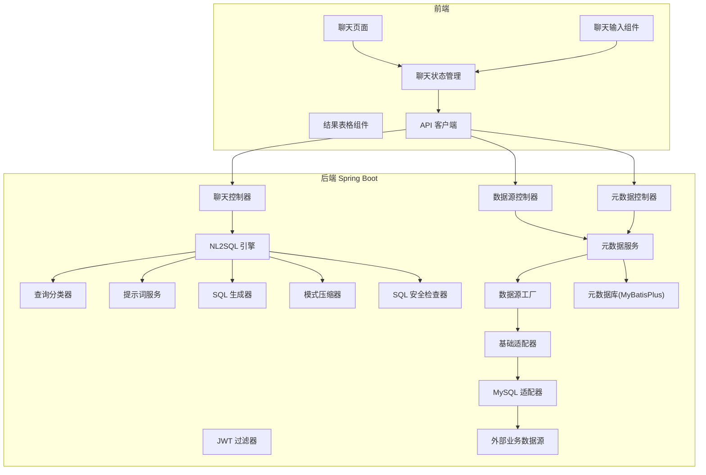
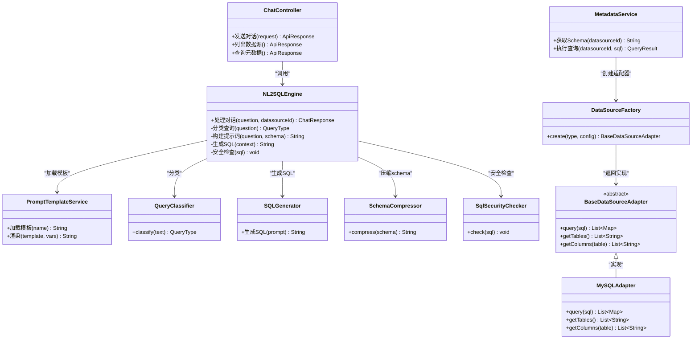
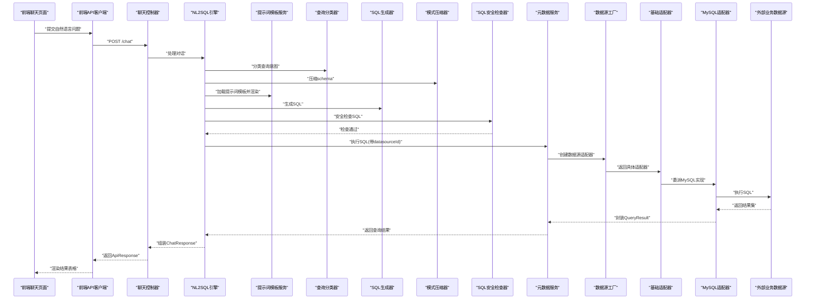
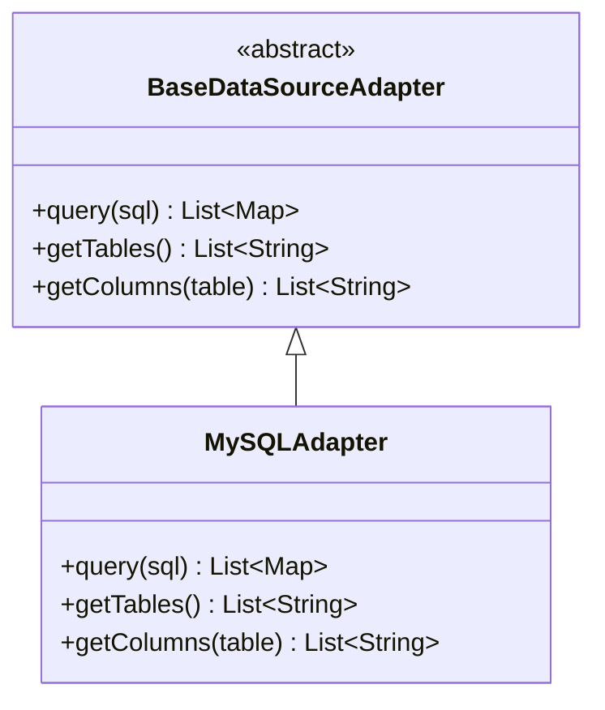
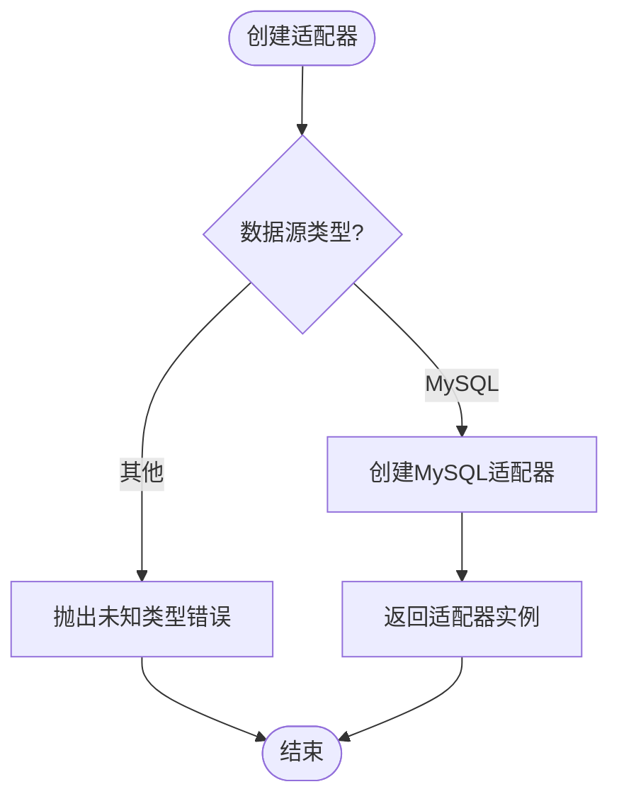
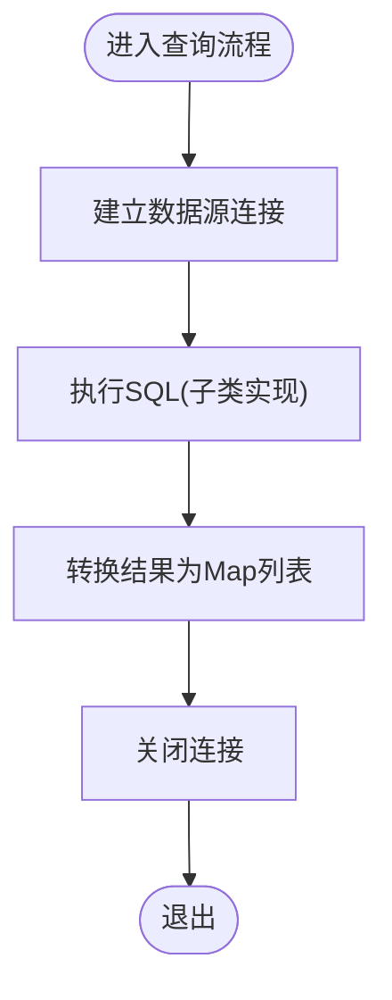
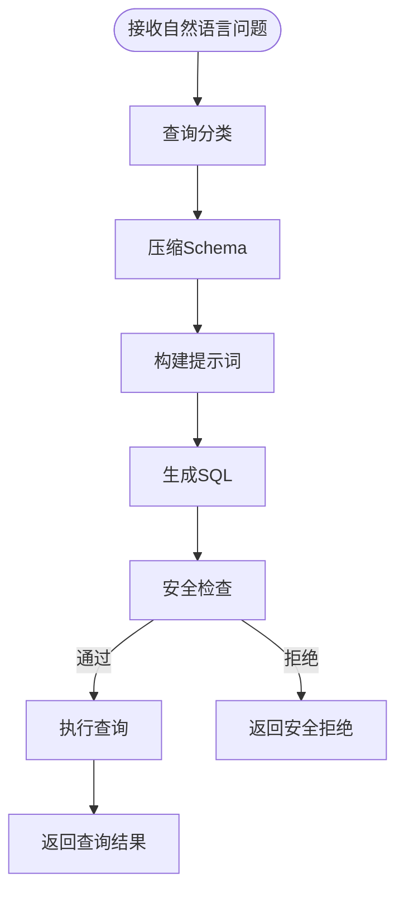
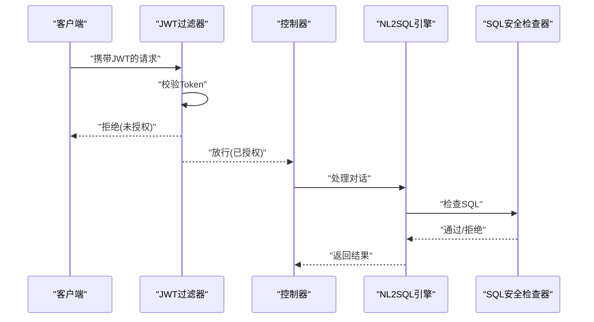
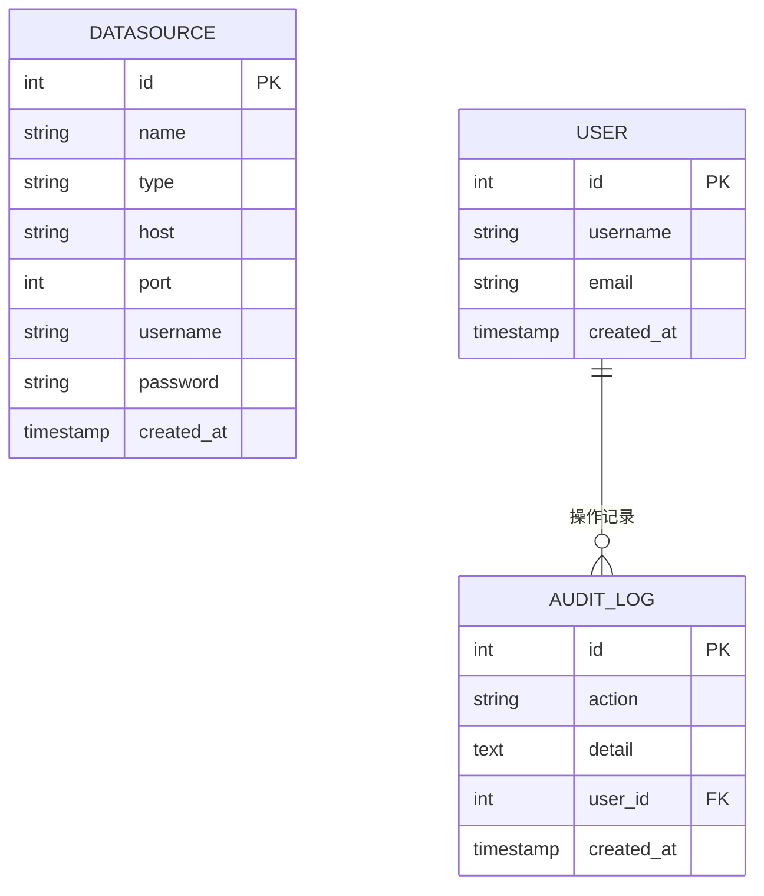
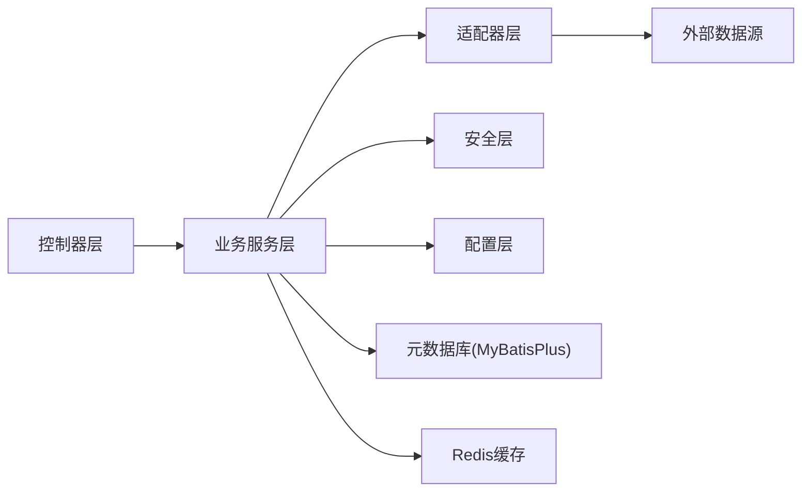

# 系统架构

<cite>
**本文引用的文件**   
- [后端入口类](file://backend/backend/src/main/java/com/nlp2sql/Nlp2SqlApplication.java)
- [聊天控制器](file://backend/backend/src/main/java/com/nlp2sql/controller/ChatController.java)
- [数据源控制器](file://backend/backend/src/main/java/com/nlp2sql/controller/DataSourceController.java)
- [元数据控制器](file://backend/backend/src/main/java/com/nlp2sql/controller/MetadataController.java)
- [认证控制器](file://backend/backend/src/main/java/com/nlp2sql/controller/AuthController.java)
- [NL2SQL 引擎](file://backend/backend/src/main/java/com/nlp2sql/service/NL2SQLEngine.java)
- [提示词构建器](file://backend/backend/src/main/java/com/nlp2sql/service/PromptBuilder.java)
- [提示词模板服务](file://backend/backend/src/main/java/com/nlp2sql/service/PromptTemplateService.java)
- [查询分类器](file://backend/backend/src/main/java/com/nlp2sql/service/QueryClassifier.java)
- [SQL 生成器](file://backend/backend/src/main/java/com/nlp2sql/service/SQLGenerator.java)
- [模式压缩器](file://backend/backend/src/main/java/com/nlp2sql/service/SchemaCompressor.java)
- [元数据服务](file://backend/backend/src/main/java/com/nlp2sql/service/MetadataService.java)
- [审计服务](file://backend/backend/src/main/java/com/nlp2sql/service/AuditService.java)
- [数据源服务](file://backend/backend/src/main/java/com/nlp2sql/service/DataSourceService.java)
- [基础数据源适配器](file://backend/backend/src/main/java/com/nlp2sql/adapter/BaseDataSourceAdapter.java)
- [数据源工厂](file://backend/backend/src/main/java/com/nlp2sql/adapter/DataSourceFactory.java)
- [MySQL 适配器](file://backend/backend/src/main/java/com/nlp2sql/adapter/MySQLAdapter.java)
- [JWT 认证过滤器](file://backend/backend/src/main/java/com/nlp2sql/security/JwtAuthenticationFilter.java)
- [JWT Token 提供者](file://backend/backend/src/main/java/com/nlp2sql/security/JwtTokenProvider.java)
- [SQL 安全检查器](file://backend/backend/src/main/java/com/nlp2sql/security/SqlSecurityChecker.java)
- [Web 配置](file://backend/backend/src/main/java/com/nlp2sql/config/WebConfig.java)
- [安全配置](file://backend/backend/src/main/java/com/nlp2sql/config/SecurityConfig.java)
- [模型属性](file://backend/backend/src/main/java/com/nlp2sql/config/ModelProperties.java)
- [聊天模型主选择器](file://backend/backend/src/main/java/com/nlp2sql/config/ChatModelPrimarySelector.java)
- [MyBatisPlus 配置](file://backend/backend/src/main/java/com/nlp2sql/config/MyBatisPlusConfig.java)
- [Redis 配置](file://backend/backend/src/main/java/com/nlp2sql/config/RedisConfig.java)
- [全局异常处理器](file://backend/backend/src/main/java/com/nlp2sql/config/GlobalExceptionHandler.java)
- [业务异常](file://backend/backend/src/main/java/com/nlp2sql/common/BusinessException.java)
- [错误码](file://backend/backend/src/main/java/com/nlp2sql/common/ErrorCode.java)
- [链路追踪过滤器](file://backend/backend/src/main/java/com/nlp2sql/common/TraceIdFilter.java)
- [聊天请求 DTO](file://backend/backend/src/main/java/com/nlp2sql/model/dto/ChatRequest.java)
- [聊天响应 DTO](file://backend/backend/src/main/java/com/nlp2sql/model/dto/ChatResponse.java)
- [API 响应包装](file://backend/backend/src/main/java/com/nlp2sql/model/dto/ApiResponse.java)
- [查询结果 DTO](file://backend/backend/src/main/java/com/nlp2sql/model/dto/QueryResult.java)
- [数据源 DTO](file://backend/backend/src/main/java/com/nlp2sql/model/dto/DataSourceDTO.java)
- [登录请求 DTO](file://backend/backend/src/main/java/com/nlp2sql/model/dto/LoginRequest.java)
- [登录响应 DTO](file://backend/backend/src/main/java/com/nlp2sql/model/dto/LoginResponse.java)
- [数据源实体](file://backend/backend/src/main/java/com/nlp2sql/model/DataSource.java)
- [用户实体](file://backend/backend/src/main/java/com/nlp2sql/model/User.java)
- [审计日志实体](file://backend/backend/src/main/java/com/nlp2sql/model/AuditLog.java)
- [表信息模型](file://backend/backend/src/main/java/com/nlp2sql/model/TableInfo.java)
- [列信息模型](file://backend/backend/src/main/java/com/nlp2sql/model/ColumnInfo.java)
- [数据源 Mapper](file://backend/backend/src/main/java/com/nlp2sql/mapper/DataSourceMapper.java)
- [用户 Mapper](file://backend/backend/src/main/java/com/nlp2sql/mapper/UserMapper.java)
- [审计日志 Mapper](file://backend/backend/src/main/java/com/nlp2sql/mapper/AuditLogMapper.java)
- [后端应用配置文件](file://backend/backend/src/main/resources/application.yml)
- [Ollama 运行配置](file://backend/backend/src/main/resources/application-ollama.yml)
- [前端 API 客户端](file://frontend/frontend/src/api/client.js)
- [前端 API 端点定义](file://frontend/frontend/src/api/endpoints.js)
- [聊天页面](file://frontend/frontend/src/views/ChatPage.vue)
- [登录页面](file://frontend/frontend/src/views/LoginPage.vue)
- [设置页面](file://frontend/frontend/src/views/SettingsPage.vue)
- [聊天输入组件](file://frontend/frontend/src/components/ChatInput.vue)
- [消息展示组件](file://frontend/frontend/src/components/ChatMessage.vue)
- [数据源选择器组件](file://frontend/frontend/src/components/DataSourceSelector.vue)
- [结果表格组件](file://frontend/frontend/src/components/ResultTable.vue)
- [模式浏览器组件](file://frontend/frontend/src/components/SchemaExplorer.vue)
- [聊天状态管理](file://frontend/frontend/src/stores/chatStore.js)
- [数据源状态管理](file://frontend/frontend/src/stores/datasourceStore.js)
</cite>

## 目录
1. [引言](#引言)
2. [项目结构](#项目结构)
3. [核心组件](#核心组件)
4. [架构总览](#架构总览)
5. [详细组件分析](#详细组件分析)
6. [依赖关系分析](#依赖关系分析)
7. [性能与扩展性](#性能与扩展性)
8. [故障排查指南](#故障排查指南)
9. [结论](#结论)

## 引言
本架构文档面向 NL2SQL 系统，描述从自然语言到 SQL 的端到端流程。系统采用分层架构：表现层负责 Web 接口与前端交互；业务层封装对话、提示词、查询分类、SQL 生成与安全校验；数据访问层通过 MyBatisPlus 和数据库适配器对接元数据库与实际数据源。整体设计强调可插拔的数据源适配、可控的大模型调用与严格的安全边界，目标是让非技术人员通过自然语言完成数据分析，同时保障数据安全与可审计。

## 项目结构
后端基于 Spring Boot，包组织按职责划分：controller 暴露 REST 接口；service 实现 NL2SQL 核心逻辑；adapter 提供数据源抽象；security 实现鉴权与 SQL 安全检查；config 集中配置；mapper 映射元数据库表；model 包含实体、DTO 与 VO。前端为 Vue 3 + Vite 应用，使用 Pinia 风格的状态管理与组件化 UI。

**图示来源**
- [聊天控制器:1-200](file://backend/backend/src/main/java/com/nlp2sql/controller/ChatController.java#L1-L200)
- [NL2SQL 引擎:1-200](file://backend/backend/src/main/java/com/nlp2sql/service/NL2SQLEngine.java#L1-L200)
- [数据源工厂:1-200](file://backend/backend/src/main/java/com/nlp2sql/adapter/DataSourceFactory.java#L1-L200)
- [基础数据源适配器:1-200](file://backend/backend/src/main/java/com/nlp2sql/adapter/BaseDataSourceAdapter.java#L1-L200)
- [MySQL 适配器:1-200](file://backend/backend/src/main/java/com/nlp2sql/adapter/MySQLAdapter.java#L1-L200)
- [聊天页面:1-200](file://frontend/frontend/src/views/ChatPage.vue#L1-L200)
- [前端 API 客户端:1-200](file://frontend/frontend/src/api/client.js#L1-L200)

**章节来源**
- [后端入口类:1-100](file://backend/backend/src/main/java/com/nlp2sql/Nlp2SqlApplication.java#L1-L100)
- [后端应用配置文件:1-200](file://backend/backend/src/main/resources/application.yml#L1-L200)
- [前端 API 端点定义:1-200](file://frontend/frontend/src/api/endpoints.js#L1-L200)

## 核心组件
- 表现层：REST 控制器统一处理 HTTP 请求，返回标准 ApiResponse。
- 业务层：NL2SQLEngine 编排提示词、分类、生成与安全校验；PromptTemplateService 加载 YAML 模板；SchemaCompressor 压缩 schema 以降低大模型上下文成本。
- 数据访问层：MyBatisPlus 读取元数据；Data Source Adapter 抽象不同数据库方言；DataSourceFactory 按类型创建适配器实例。
- 安全层：JwtAuthenticationFilter 校验令牌；SqlSecurityChecker 对生成 SQL 进行危险语法拦截。
- 前端：Vue 3 页面与组件，Pinia 风格状态管理，调用后端 REST 接口渲染表格与模式树。

关键职责边界：
- Controller 不持有复杂业务逻辑，仅做参数校验、调用 Service 并返回统一响应。
- Service 组合多个子服务（Prompt、Classifier、Generator、Security），保持单一职责。
- Adapter 屏蔽多数据源差异，对外暴露统一方法集。

**章节来源**
- [聊天控制器:1-200](file://backend/backend/src/main/java/com/nlp2sql/controller/ChatController.java#L1-L200)
- [NL2SQL 引擎:1-200](file://backend/backend/src/main/java/com/nlp2sql/service/NL2SQLEngine.java#L1-L200)
- [提示词模板服务:1-200](file://backend/backend/src/main/java/com/nlp2sql/service/PromptTemplateService.java#L1-L200)
- [SQL 生成器:1-200](file://backend/backend/src/main/java/com/nlp2sql/service/SQLGenerator.java#L1-L200)
- [查询分类器:1-200](file://backend/backend/src/main/java/com/nlp2sql/service/QueryClassifier.java#L1-L200)
- [模式压缩器:1-200](file://backend/backend/src/main/java/com/nlp2sql/service/SchemaCompressor.java#L1-L200)
- [元数据服务:1-200](file://backend/backend/src/main/java/com/nlp2sql/service/MetadataService.java#L1-L200)
- [基础数据源适配器:1-200](file://backend/backend/src/main/java/com/nlp2sql/adapter/BaseDataSourceAdapter.java#L1-L200)
- [数据源工厂:1-200](file://backend/backend/src/main/java/com/nlp2sql/adapter/DataSourceFactory.java#L1-L200)
- [JWT 认证过滤器:1-200](file://backend/backend/src/main/java/com/nlp2sql/security/JwtAuthenticationFilter.java#L1-L200)
- [SQL 安全检查器:1-200](file://backend/backend/src/main/java/com/nlp2sql/security/SqlSecurityChecker.java#L1-L200)

## 架构总览
系统采用“控制器—服务—适配器”的分层结构，配合策略模式与工厂模式实现数据源可扩展，模板方法模式统一适配器骨架，安全策略贯穿全流程。

**图示来源**
- [聊天控制器:1-200](file://backend/backend/src/main/java/com/nlp2sql/controller/ChatController.java#L1-L200)
- [NL2SQL 引擎:1-200](file://backend/backend/src/main/java/com/nlp2sql/service/NL2SQLEngine.java#L1-L200)
- [提示词模板服务:1-200](file://backend/backend/src/main/java/com/nlp2sql/service/PromptTemplateService.java#L1-L200)
- [SQL 生成器:1-200](file://backend/backend/src/main/java/com/nlp2sql/service/SQLGenerator.java#L1-L200)
- [查询分类器:1-200](file://backend/backend/src/main/java/com/nlp2sql/service/QueryClassifier.java#L1-L200)
- [模式压缩器:1-200](file://backend/backend/src/main/java/com/nlp2sql/service/SchemaCompressor.java#L1-L200)
- [元数据服务:1-200](file://backend/backend/src/main/java/com/nlp2sql/service/MetadataService.java#L1-L200)
- [数据源工厂:1-200](file://backend/backend/src/main/java/com/nlp2sql/adapter/DataSourceFactory.java#L1-L200)
- [基础数据源适配器:1-200](file://backend/backend/src/main/java/com/nlp2sql/adapter/BaseDataSourceAdapter.java#L1-L200)
- [MySQL 适配器:1-200](file://backend/backend/src/main/java/com/nlp2sql/adapter/MySQLAdapter.java#L1-L200)
- [SQL 安全检查器:1-200](file://backend/backend/src/main/java/com/nlp2sql/security/SqlSecurityChecker.java#L1-L200)

## 详细组件分析

### 聊天控制层与前端交互
聊天控制器接收自然语言问题与目标数据源 ID，委托 NL2SQLEngine 完成后续流程；同时提供数据源列表与元数据浏览能力。前端通过统一的 API 客户端调用后端接口，状态由 chatStore 管理，UI 由 ChatInput、ChatMessage、ResultTable 等组件呈现。

**图示来源**
- [聊天控制器:1-200](file://backend/backend/src/main/java/com/nlp2sql/controller/ChatController.java#L1-L200)
- [NL2SQL 引擎:1-200](file://backend/backend/src/main/java/com/nlp2sql/service/NL2SQLEngine.java#L1-L200)
- [提示词模板服务:1-200](file://backend/backend/src/main/java/com/nlp2sql/service/PromptTemplateService.java#L1-L200)
- [查询分类器:1-200](file://backend/backend/src/main/java/com/nlp2sql/service/QueryClassifier.java#L1-L200)
- [SQL 生成器:1-200](file://backend/backend/src/main/java/com/nlp2sql/service/SQLGenerator.java#L1-L200)
- [模式压缩器:1-200](file://backend/backend/src/main/java/com/nlp2sql/service/SchemaCompressor.java#L1-L200)
- [元数据服务:1-200](file://backend/backend/src/main/java/com/nlp2sql/service/MetadataService.java#L1-L200)
- [数据源工厂:1-200](file://backend/backend/src/main/java/com/nlp2sql/adapter/DataSourceFactory.java#L1-L200)
- [基础数据源适配器:1-200](file://backend/backend/src/main/java/com/nlp2sql/adapter/BaseDataSourceAdapter.java#L1-L200)
- [MySQL 适配器:1-200](file://backend/backend/src/main/java/com/nlp2sql/adapter/MySQLAdapter.java#L1-L200)
- [前端 API 客户端:1-200](file://frontend/frontend/src/api/client.js#L1-L200)
- [聊天页面:1-200](file://frontend/frontend/src/views/ChatPage.vue#L1-L200)

**章节来源**
- [聊天控制器:1-200](file://backend/backend/src/main/java/com/nlp2sql/controller/ChatController.java#L1-L200)
- [聊天请求 DTO:1-200](file://backend/backend/src/main/java/com/nlp2sql/model/dto/ChatRequest.java#L1-L200)
- [聊天响应 DTO:1-200](file://backend/backend/src/main/java/com/nlp2sql/model/dto/ChatResponse.java#L1-L200)
- [API 响应包装:1-200](file://backend/backend/src/main/java/com/nlp2sql/model/dto/ApiResponse.java#L1-L200)
- [前端 API 端点定义:1-200](file://frontend/frontend/src/api/endpoints.js#L1-L200)
- [聊天状态管理:1-200](file://frontend/frontend/src/stores/chatStore.js#L1-L200)

### 策略模式：数据源适配器
BaseDataSourceAdapter 定义统一查询与元数据获取接口；MySQLAdapter 针对 MySQL 方言实现细节。新增数据库只需新增适配器实现并注册到工厂，无需修改上层调用方。

**图示来源**
- [基础数据源适配器:1-200](file://backend/backend/src/main/java/com/nlp2sql/adapter/BaseDataSourceAdapter.java#L1-L200)
- [MySQL 适配器:1-200](file://backend/backend/src/main/java/com/nlp2sql/adapter/MySQLAdapter.java#L1-L200)

**章节来源**
- [基础数据源适配器:1-200](file://backend/backend/src/main/java/com/nlp2sql/adapter/BaseDataSourceAdapter.java#L1-L200)
- [MySQL 适配器:1-200](file://backend/backend/src/main/java/com/nlp2sql/adapter/MySQLAdapter.java#L1-L200)

### 工厂模式：适配器创建
DataSourceFactory 根据数据源类型创建对应适配器实例，隐藏具体实现类与连接配置细节。Service 层只依赖抽象接口，提升可测试性与可替换性。

**图示来源**
- [数据源工厂:1-200](file://backend/backend/src/main/java/com/nlp2sql/adapter/DataSourceFactory.java#L1-L200)

**章节来源**
- [数据源工厂:1-200](file://backend/backend/src/main/java/com/nlp2sql/adapter/DataSourceFactory.java#L1-L200)

### 模板方法模式：基础适配器类
BaseDataSourceAdapter 定义算法骨架：先建立连接、再执行查询、最后关闭资源；子类仅需实现具体 SQL 方言相关逻辑。这样确保所有适配器具备一致的生命周期与错误处理行为。

**图示来源**
- [基础数据源适配器:1-200](file://backend/backend/src/main/java/com/nlp2sql/adapter/BaseDataSourceAdapter.java#L1-L200)

**章节来源**
- [基础数据源适配器:1-200](file://backend/backend/src/main/java/com/nlp2sql/adapter/BaseDataSourceAdapter.java#L1-L200)

### NL2SQL 引擎编排
NL2SQLEngine 是业务编排中心，串联 QueryClassifier、PromptTemplateService、SchemaCompressor、SQLGenerator 与 SqlSecurityChecker，最终通过 MetadataService 执行查询并返回结构化结果。该层将 AI 推理过程与数据访问解耦，便于单独优化或替换各组件。

**图示来源**
- [NL2SQL 引擎:1-200](file://backend/backend/src/main/java/com/nlp2sql/service/NL2SQLEngine.java#L1-L200)
- [查询分类器:1-200](file://backend/backend/src/main/java/com/nlp2sql/service/QueryClassifier.java#L1-L200)
- [模式压缩器:1-200](file://backend/backend/src/main/java/com/nlp2sql/service/SchemaCompressor.java#L1-L200)
- [提示词模板服务:1-200](file://backend/backend/src/main/java/com/nlp2sql/service/PromptTemplateService.java#L1-L200)
- [SQL 生成器:1-200](file://backend/backend/src/main/java/com/nlp2sql/service/SQLGenerator.java#L1-L200)
- [SQL 安全检查器:1-200](file://backend/backend/src/main/java/com/nlp2sql/security/SqlSecurityChecker.java#L1-L200)

**章节来源**
- [NL2SQL 引擎:1-200](file://backend/backend/src/main/java/com/nlp2sql/service/NL2SQLEngine.java#L1-L200)

### 提示词与模板管理
PromptTemplateService 从外部 YAML 模板加载提示词，支持版本管理与动态渲染；PromptBuilder 在此基础上拼装上下文变量（如 schema、用户意图）。模板外置有利于非开发人员维护提示词内容，降低硬编码风险。

**章节来源**
- [提示词模板服务:1-200](file://backend/backend/src/main/java/com/nlp2sql/service/PromptTemplateService.java#L1-L200)
- [提示词构建器:1-200](file://backend/backend/src/main/java/com/nlp2sql/service/PromptBuilder.java#L1-L200)

### 安全与权限
JwtAuthenticationFilter 在请求到达控制器前校验 JWT，未授权请求直接拒绝；SqlSecurityChecker 对生成的 SQL 进行危险语法检测，防止注入或破坏性语句。安全配置由 SecurityConfig 统一管理，结合 TraceIdFilter 实现全链路追踪。

**图示来源**
- [JWT 认证过滤器:1-200](file://backend/backend/src/main/java/com/nlp2sql/security/JwtAuthenticationFilter.java#L1-L200)
- [SQL 安全检查器:1-200](file://backend/backend/src/main/java/com/nlp2sql/security/SqlSecurityChecker.java#L1-L200)
- [聊天控制器:1-200](file://backend/backend/src/main/java/com/nlp2sql/controller/ChatController.java#L1-L200)
- [NL2SQL 引擎:1-200](file://backend/backend/src/main/java/com/nlp2sql/service/NL2SQLEngine.java#L1-L200)

**章节来源**
- [JWT 认证过滤器:1-200](file://backend/backend/src/main/java/com/nlp2sql/security/JwtAuthenticationFilter.java#L1-L200)
- [SQL 安全检查器:1-200](file://backend/backend/src/main/java/com/nlp2sql/security/SqlSecurityChecker.java#L1-L200)
- [安全配置:1-200](file://backend/backend/src/main/java/com/nlp2sql/config/SecurityConfig.java#L1-L200)
- [链路追踪过滤器:1-200](file://backend/backend/src/main/java/com/nlp2sql/common/TraceIdFilter.java#L1-L200)

### 元数据与数据源管理
MetadataService 负责从元数据库读取表结构与列信息，并通过 DataSourceService 管理数据源配置；DataSourceController 暴露数据源增删改查接口；DataSourceDTO 与 DataSource 实体承载配置信息。

**图示来源**
- [数据源实体:1-200](file://backend/backend/src/main/java/com/nlp2sql/model/DataSource.java#L1-L200)
- [用户实体:1-200](file://backend/backend/src/main/java/com/nlp2sql/model/User.java#L1-L200)
- [审计日志实体:1-200](file://backend/backend/src/main/java/com/nlp2sql/model/AuditLog.java#L1-L200)

**章节来源**
- [元数据服务:1-200](file://backend/backend/src/main/java/com/nlp2sql/service/MetadataService.java#L1-L200)
- [数据源服务:1-200](file://backend/backend/src/main/java/com/nlp2sql/service/DataSourceService.java#L1-L200)
- [数据源控制器:1-200](file://backend/backend/src/main/java/com/nlp2sql/controller/DataSourceController.java#L1-L200)
- [数据源 DTO:1-200](file://backend/backend/src/main/java/com/nlp2sql/model/dto/DataSourceDTO.java#L1-L200)
- [数据源 Mapper:1-200](file://backend/backend/src/main/java/com/nlp2sql/mapper/DataSourceMapper.java#L1-L200)

## 依赖关系分析
- 控制器依赖服务层，服务层依赖适配器与安全检查器，适配器依赖具体数据库驱动。
- MyBatisPlus 配置集中管理数据源与分页插件；Redis 配置用于缓存热点 schema 或会话上下文。
- ModelProperties 与 ChatModelPrimarySelector 决定大模型后端与优先级策略，便于切换不同 LLM 提供商。

**图示来源**
- [MyBatisPlus 配置:1-200](file://backend/backend/src/main/java/com/nlp2sql/config/MyBatisPlusConfig.java#L1-L200)
- [Redis 配置:1-200](file://backend/backend/src/main/java/com/nlp2sql/config/RedisConfig.java#L1-L200)
- [模型属性:1-200](file://backend/backend/src/main/java/com/nlp2sql/config/ModelProperties.java#L1-L200)
- [聊天模型主选择器:1-200](file://backend/backend/src/main/java/com/nlp2sql/config/ChatModelPrimarySelector.java#L1-L200)

**章节来源**
- [MyBatisPlus 配置:1-200](file://backend/backend/src/main/java/com/nlp2sql/config/MyBatisPlusConfig.java#L1-L200)
- [Redis 配置:1-200](file://backend/backend/src/main/java/com/nlp2sql/config/RedisConfig.java#L1-L200)
- [模型属性:1-200](file://backend/backend/src/main/java/com/nlp2sql/config/ModelProperties.java#L1-L200)
- [聊天模型主选择器:1-200](file://backend/backend/src/main/java/com/nlp2sql/config/ChatModelPrimarySelector.java#L1-L200)

## 性能与扩展性
- 可扩展性
  - 新增数据源：实现 BaseDataSourceAdapter 并在 DataSourceFactory 中注册。
  - 新增大模型后端：扩展 ChatModelPrimarySelector 与 ModelProperties。
  - 提示词版本化：通过 PromptTemplateService 加载 YAML 模板，支持灰度与回滚。
- 可维护性
  - 控制器薄、服务厚，职责清晰；异常统一由 GlobalExceptionHandler 处理。
  - 错误码与业务异常标准化，便于前端与运维统一处理。
- 性能考虑
  - SchemaCompressor 压缩 schema 降低 LLM 上下文成本。
  - Redis 可用于缓存高频 schema 或热点查询结果。
  - 避免一次性加载全部表结构，按需查询与分页。
- 安全权衡
  - 双层防护：JWT 认证 + SQL 安全检查，减少恶意查询风险。
  - 审计日志记录关键操作，满足合规要求。

[本节为通用指导，不涉及具体文件分析]

## 故障排查指南
常见问题与定位要点：
- 认证失败：检查 JwtAuthenticationFilter 与 SecurityConfig 中的密钥与路径白名单。
- SQL 被拦截：查看 SqlSecurityChecker 规则，确认是否误判合法 SQL。
- 数据源连接失败：核对 DataSourceDTO 配置与 DataSourceFactory 类型匹配。
- 大模型调用异常：检查 ModelProperties 与 ChatModelPrimarySelector 的配置与网络连通性。
- 元数据缺失：确认 MyBatisPlus 配置与 init_backend.sql 脚本是否正确执行。

**章节来源**
- [全局异常处理器:1-200](file://backend/backend/src/main/java/com/nlp2sql/config/GlobalExceptionHandler.java#L1-L200)
- [业务异常:1-200](file://backend/backend/src/main/java/com/nlp2sql/common/BusinessException.java#L1-L200)
- [错误码:1-200](file://backend/backend/src/main/java/com/nlp2sql/common/ErrorCode.java#L1-L200)

## 结论
本架构通过分层与模式化设计，将自然语言转 SQL 的核心流程解耦为可插拔的模块：策略模式适配多数据源，工厂模式简化实例创建，模板方法模式统一适配器骨架。安全机制贯穿始终，提示词与模型配置外置提升可维护性。未来可在缓存、异步化与多模型路由方面继续优化，以支撑更大规模的数据分析与更高的并发需求。