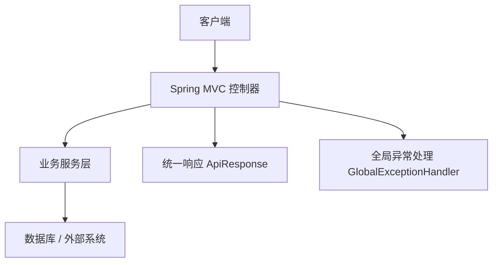
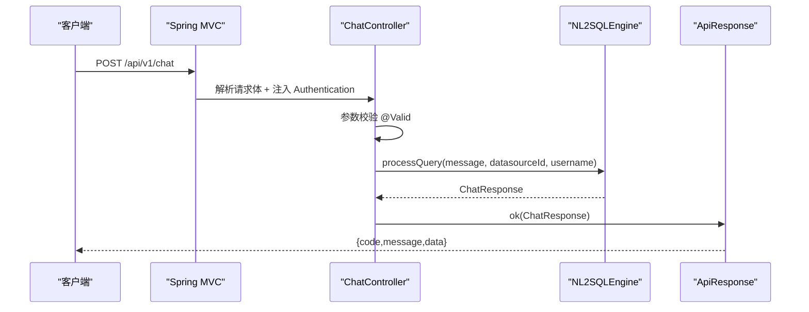
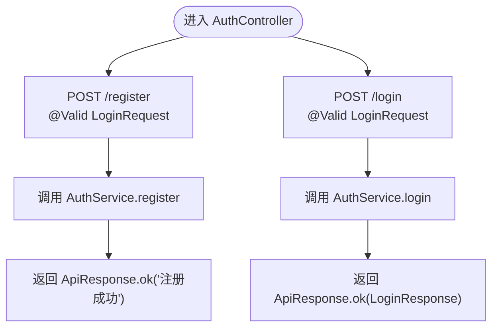
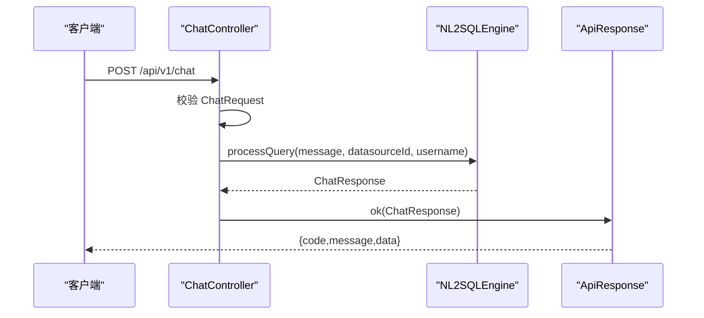
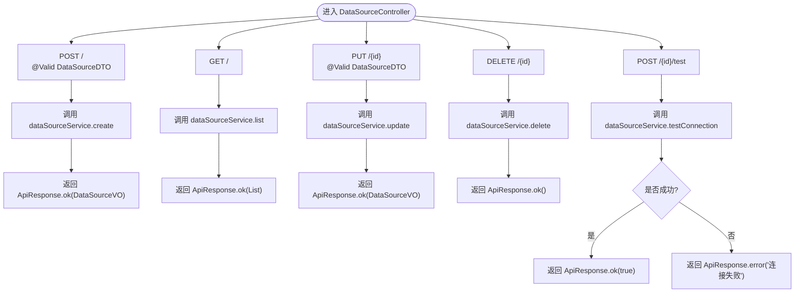
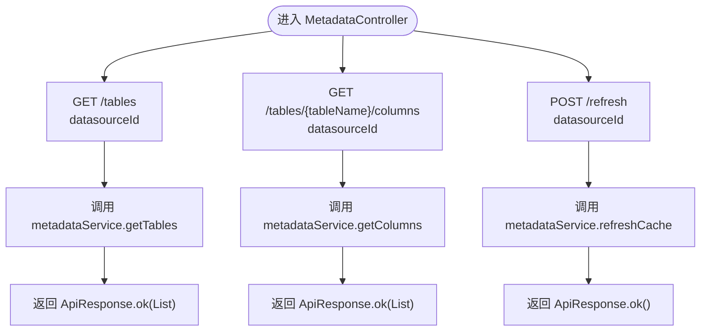
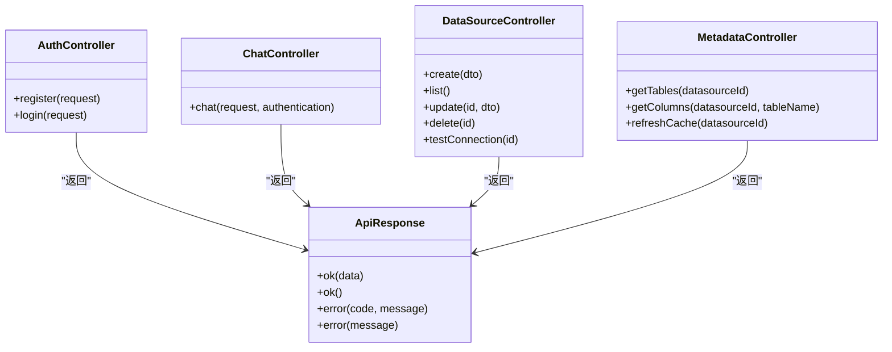
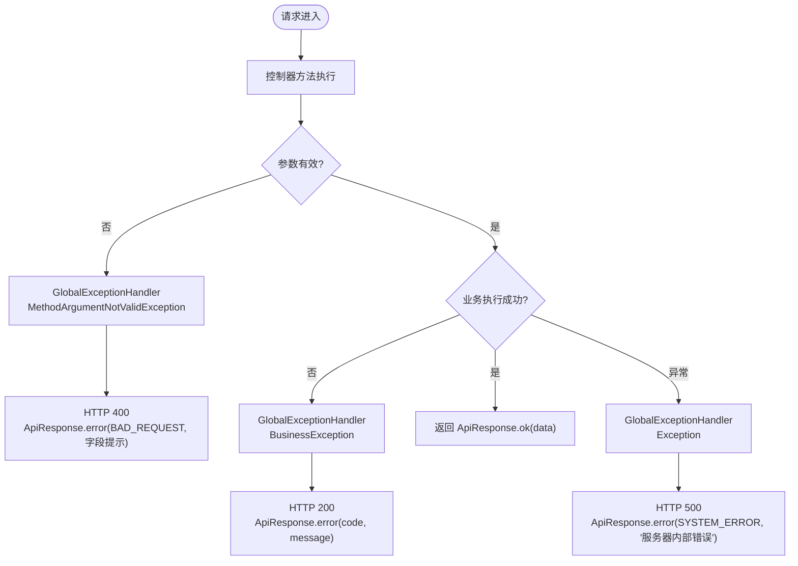

# 控制器组件

<cite>
**本文引用的文件**   
- [AuthController.java](file://backend/src/main/java/com/nlp2sql/controller/AuthController.java)
- [ChatController.java](file://backend/src/main/java/com/nlp2sql/controller/ChatController.java)
- [DataSourceController.java](file://backend/src/main/java/com/nlp2sql/controller/DataSourceController.java)
- [MetadataController.java](file://backend/src/main/java/com/nlp2sql/controller/MetadataController.java)
- [BusinessException.java](file://backend/src/main/java/com/nlp2sql/common/BusinessException.java)
- [ErrorCode.java](file://backend/src/main/java/com/nlp2sql/common/ErrorCode.java)
- [GlobalExceptionHandler.java](file://backend/src/main/java/com/nlp2sql/config/GlobalExceptionHandler.java)
- [ApiResponse.java](file://backend/src/main/java/com/nlp2sql/model/dto/ApiResponse.java)
</cite>

## 目录
1. [引言](#引言)
2. [项目结构中的控制器定位](#项目结构中的控制器定位)
3. [核心控制器职责总览](#核心控制器职责总览)
4. [架构总览与请求处理流程](#架构总览与请求处理流程)
5. [详细控制器分析](#详细控制器分析)
6. [依赖关系与交互模式](#依赖关系与交互模式)
7. [错误处理与状态码规范](#错误处理与状态码规范)
8. [性能与可观测性建议](#性能与可观测性建议)
9. [故障排查指南](#故障排查指南)
10. [结论](#结论)

## 引言
本文件聚焦 Spring MVC 控制器层的设计与实现，目标是帮助开发者快速理解四个控制器的职责边界、接口契约、参数校验、响应格式以及与业务层的协作方式。控制器负责接收 HTTP 请求、进行基础校验、委派给服务层执行、并统一封装为 ApiResponse。异常由全局异常处理器统一捕获和格式化，确保前端获得一致的错误结构。

## 项目结构中的控制器定位
后端采用分层架构：
- 控制器层：处理 HTTP 请求、参数绑定、简单校验、调用服务层。
- 服务层：封装业务逻辑，协调数据源适配器、NL2SQL 引擎、元数据缓存等。
- 模型层：包含 DTO（数据传输对象）、VO（视图对象）以及实体。
- 配置与通用层：统一响应体、异常定义、全局异常处理、安全配置等。

[本图为概念示意，不直接映射具体源码]

**章节来源**
- [AuthController.java:1-31](file://backend/src/main/java/com/nlp2sql/controller/AuthController.java#L1-L31)
- [ChatController.java:1-30](file://backend/src/main/java/com/nlp2sql/controller/ChatController.java#L1-L30)
- [DataSourceController.java:1-50](file://backend/src/main/java/com/nlp2sql/controller/DataSourceController.java#L1-L50)
- [MetadataController.java:1-38](file://backend/src/main/java/com/nlp2sql/controller/MetadataController.java#L1-L38)

## 核心控制器职责总览
- AuthController：认证相关接口，包括注册与登录。
- ChatController：NL2SQL 智能查询入口，将自然语言转换为 SQL 并返回结果。
- DataSourceController：数据源管理 CRUD 与连接测试。
- MetadataController：元数据浏览，包括表列表、列信息、缓存刷新。

所有控制器均使用统一的 ApiResponse 作为响应包装，并使用 Jakarta Validation 对请求体进行校验。

**章节来源**
- [AuthController.java:1-31](file://backend/src/main/java/com/nlp2sql/controller/AuthController.java#L1-L31)
- [ChatController.java:1-30](file://backend/src/main/java/com/nlp2sql/controller/ChatController.java#L1-L30)
- [DataSourceController.java:1-50](file://backend/src/main/java/com/nlp2sql/controller/DataSourceController.java#L1-L50)
- [MetadataController.java:1-38](file://backend/src/main/java/com/nlp2sql/controller/MetadataController.java#L1-L38)

## 架构总览与请求处理流程
以下时序图展示一次 NL2SQL 查询从浏览器到控制器的典型流程：

**图表来源**
- [ChatController.java:1-30](file://backend/src/main/java/com/nlp2sql/controller/ChatController.java#L1-L30)
- [ApiResponse.java:1-33](file://backend/src/main/java/com/nlp2sql/model/dto/ApiResponse.java#L1-L33)

**章节来源**
- [ChatController.java:1-30](file://backend/src/main/java/com/nlp2sql/controller/ChatController.java#L1-L30)
- [ApiResponse.java:1-33](file://backend/src/main/java/com/nlp2sql/model/dto/ApiResponse.java#L1-L33)

## 详细控制器分析

### 认证控制器 AuthController
- 作用：提供用户注册与登录接口，基于 AuthService 完成认证逻辑。
- 路由前缀：/api/v1/auth
- 关键接口
  - POST /register：接收 LoginRequest，调用 AuthService.register，返回成功消息。
  - POST /login：接收 LoginRequest，调用 AuthService.login，返回 LoginResponse。
- 参数验证：使用 @Valid 注解，LoginRequest 字段校验失败时触发全局校验异常处理。
- 响应格式：统一 ApiResponse，成功时 code=200。

**图表来源**
- [AuthController.java:1-31](file://backend/src/main/java/com/nlp2sql/controller/AuthController.java#L1-L31)

HTTP 示例
- 注册
  - 请求：POST /api/v1/auth/register
  - 请求体：{"username":"...","password":"..."}（以 LoginRequest 字段为准）
  - 成功响应：{ "code": 200, "message": "success", "data": "注册成功" }
  - 失败响应（校验失败）：{ "code": 400, "message": "多个字段校验提示拼接" }
- 登录
  - 请求：POST /api/v1/auth/login
  - 请求体：同注册
  - 成功响应：{ "code": 200, "message": "success", "data": LoginResponse 对象 }
  - 失败响应：业务异常或校验失败，按全局异常处理返回。

**章节来源**
- [AuthController.java:1-31](file://backend/src/main/java/com/nlp2sql/controller/AuthController.java#L1-L31)
- [ApiResponse.java:1-33](file://backend/src/main/java/com/nlp2sql/model/dto/ApiResponse.java#L1-L33)

### 聊天查询控制器 ChatController
- 作用：NL2SQL 查询入口，根据自然语言消息、数据源标识和用户身份生成并执行 SQL，返回结构化结果。
- 路由前缀：/api/v1/chat
- 关键接口
  - POST /：接收 ChatRequest，结合当前认证用户名，调用 NL2SQLEngine.processQuery，返回 ChatResponse。
- 参数验证：使用 @Valid 校验 ChatRequest；认证信息由 Spring Security 注入 Authentication。
- 响应格式：统一 ApiResponse，成功时携带 ChatResponse。

**图表来源**
- [ChatController.java:1-30](file://backend/src/main/java/com/nlp2sql/controller/ChatController.java#L1-L30)

HTTP 示例
- 请求：POST /api/v1/chat
- 请求体：{"message":"查询本月销售额","datasourceId":1}
- 成功响应：{ "code": 200, "message": "success", "data": ChatResponse 对象 }
- 失败响应：若业务抛出 BusinessException，则返回对应 code 与 message；校验失败返回 400。

**章节来源**
- [ChatController.java:1-30](file://backend/src/main/java/com/nlp2sql/controller/ChatController.java#L1-L30)

### 数据源管理控制器 DataSourceController
- 作用：数据源的增删改查及连接测试。
- 路由前缀：/api/v1/datasources
- 关键接口
  - POST /：创建数据源，返回 DataSourceVO。
  - GET /：列出所有数据源，返回 DataSourceVO 列表。
  - PUT /{id}：更新数据源，返回 DataSourceVO。
  - DELETE /{id}：删除数据源，无返回值。
  - POST /{id}/test：测试数据源连接，返回布尔值。
- 参数验证：请求体使用 @Valid；路径变量 id 由 Spring MVC 自动解析。
- 特殊逻辑：连接测试成功返回 true，失败返回 ApiResponse.error("连接失败")。

**图表来源**
- [DataSourceController.java:1-50](file://backend/src/main/java/com/nlp2sql/controller/DataSourceController.java#L1-L50)

HTTP 示例
- 创建数据源
  - 请求：POST /api/v1/datasources
  - 请求体：{"name":"...","type":"...","url":"...","username":"...","password":"..."}（以 DataSourceDTO 字段为准）
  - 成功响应：{ "code": 200, "message": "success", "data": DataSourceVO 对象 }
- 测试连接
  - 请求：POST /api/v1/datasources/{id}/test
  - 成功：{ "code": 200, "message": "success", "data": true }
  - 失败：{ "code": 500, "message": "连接失败" }（由控制器显式返回的 error 包装）

**章节来源**
- [DataSourceController.java:1-50](file://backend/src/main/java/com/nlp2sql/controller/DataSourceController.java#L1-L50)

### 元数据管理控制器 MetadataController
- 作用：提供数据源的表结构与列信息查询，以及元数据缓存刷新。
- 路由前缀：/api/v1/metadata
- 关键接口
  - GET /tables?datasourceId={id}：获取表列表。
  - GET /tables/{tableName}/columns?datasourceId={id}：获取指定表的列信息。
  - POST /refresh?datasourceId={id}：刷新元数据缓存。
- 参数验证：查询参数 datasourceId 由 Spring MVC 自动绑定；表名通过路径变量传入。
- 响应格式：统一 ApiResponse，成功时携带 TableInfo 或 ColumnInfo 列表。

**图表来源**
- [MetadataController.java:1-38](file://backend/src/main/java/com/nlp2sql/controller/MetadataController.java#L1-L38)

HTTP 示例
- 获取表列表
  - 请求：GET /api/v1/metadata/tables?datasourceId=1
  - 成功响应：{ "code": 200, "message": "success", "data": [TableInfo, ...] }
- 获取列信息
  - 请求：GET /api/v1/metadata/tables/orders/columns?datasourceId=1
  - 成功响应：{ "code": 200, "message": "success", "data": [ColumnInfo, ...] }
- 刷新缓存
  - 请求：POST /api/v1/metadata/refresh?datasourceId=1
  - 成功响应：{ "code": 200, "message": "success", "data": null }

**章节来源**
- [MetadataController.java:1-38](file://backend/src/main/java/com/nlp2sql/controller/MetadataController.java#L1-L38)

## 依赖关系与交互模式
- 控制器与服务层解耦：每个控制器仅持有对应 Service 的引用，并通过构造器注入。
- 统一响应封装：所有控制器方法返回 ApiResponse<T>，避免在各处重复封装。
- 认证上下文：ChatController 通过 Spring Security 注入 Authentication，用于审计或权限判断。
- 参数校验：使用 Jakarta Validation 注解在 DTO 上声明约束，控制器通过 @Valid 触发。

**图表来源**
- [AuthController.java:1-31](file://backend/src/main/java/com/nlp2sql/controller/AuthController.java#L1-L31)
- [ChatController.java:1-30](file://backend/src/main/java/com/nlp2sql/controller/ChatController.java#L1-L30)
- [DataSourceController.java:1-50](file://backend/src/main/java/com/nlp2sql/controller/DataSourceController.java#L1-L50)
- [MetadataController.java:1-38](file://backend/src/main/java/com/nlp2sql/controller/MetadataController.java#L1-L38)
- [ApiResponse.java:1-33](file://backend/src/main/java/com/nlp2sql/model/dto/ApiResponse.java#L1-L33)

**章节来源**
- [AuthController.java:1-31](file://backend/src/main/java/com/nlp2sql/controller/AuthController.java#L1-L31)
- [ChatController.java:1-30](file://backend/src/main/java/com/nlp2sql/controller/ChatController.java#L1-L30)
- [DataSourceController.java:1-50](file://backend/src/main/java/com/nlp2sql/controller/DataSourceController.java#L1-L50)
- [MetadataController.java:1-38](file://backend/src/main/java/com/nlp2sql/controller/MetadataController.java#L1-L38)
- [ApiResponse.java:1-33](file://backend/src/main/java/com/nlp2sql/model/dto/ApiResponse.java#L1-L33)

## 错误处理与状态码规范
- 业务异常：控制器或服务层抛出的 BusinessException 会被全局异常处理器捕获，返回 HTTP 200，并在 body.code 中体现业务错误码。
- 参数校验异常：MethodArgumentNotValidException 被捕获后返回 HTTP 400，message 为各字段校验提示的拼接。
- 非法参数：IllegalArgumentException 返回 HTTP 400，message 为原始异常消息。
- 未处理异常：兜底 Exception 返回 HTTP 500，固定业务码 SYSTEM_ERROR。
- 统一响应体：ApiResponse 包含 code、message、data 三个字段。

**图表来源**
- [GlobalExceptionHandler.java:1-50](file://backend/src/main/java/com/nlp2sql/config/GlobalExceptionHandler.java#L1-L50)
- [BusinessException.java:1-23](file://backend/src/main/java/com/nlp2sql/common/BusinessException.java#L1-L23)
- [ErrorCode.java:1-26](file://backend/src/main/java/com/nlp2sql/common/ErrorCode.java#L1-L26)
- [ApiResponse.java:1-33](file://backend/src/main/java/com/nlp2sql/model/dto/ApiResponse.java#L1-L33)

常见错误示例
- 参数校验失败
  - 响应：{ "code": 400, "message": "字段1校验失败, 字段2校验失败" }
- 业务异常（例如数据源不存在）
  - 响应：{ "code": 1001, "message": "数据源不存在" }
- 连接测试失败
  - 响应：{ "code": 500, "message": "连接失败" }
- 服务器内部错误
  - 响应：{ "code": 9999, "message": "服务器内部错误" }

**章节来源**
- [GlobalExceptionHandler.java:1-50](file://backend/src/main/java/com/nlp2sql/config/GlobalExceptionHandler.java#L1-L50)
- [BusinessException.java:1-23](file://backend/src/main/java/com/nlp2sql/common/BusinessException.java#L1-L23)
- [ErrorCode.java:1-26](file://backend/src/main/java/com/nlp2sql/common/ErrorCode.java#L1-L26)
- [ApiResponse.java:1-33](file://backend/src/main/java/com/nlp2sql/model/dto/ApiResponse.java#L1-L33)

## 性能与可观测性建议
- 减少控制器层复杂逻辑：所有业务计算下沉至服务层，控制器只做入参校验与出参封装。
- 合理使用缓存：元数据读取频繁且变更较少，可在 MetadataService 层引入缓存策略，控制器侧无需关心细节。
- 异步与超时：NL2SQL 引擎可能耗时较长，建议在服务层引入超时与重试策略，并在前端设置合理的等待时间。
- 日志与追踪：全局异常处理器已记录业务异常与未处理异常，建议在生产环境开启结构化日志并关联 traceId。

[本节为通用建议，不直接分析具体文件]

## 故障排查指南
- 校验失败
  - 现象：返回 400，message 包含多个字段校验提示。
  - 排查：检查 DTO 上的校验注解是否与前端传参匹配。
- 业务错误
  - 现象：返回 200，但 code 非 200，message 为业务描述。
  - 排查：查看服务层抛出的 BusinessException 对应的 ErrorCode。
- 连接测试失败
  - 现象：DataSourceController.testConnection 返回 code=500，message="连接失败"。
  - 排查：核对 DataSourceDTO 的连接信息与网络连通性。
- 未处理异常
  - 现象：返回 500，code=9999，message="服务器内部错误"。
  - 排查：检查服务端日志堆栈，定位具体异常位置。

**章节来源**
- [GlobalExceptionHandler.java:1-50](file://backend/src/main/java/com/nlp2sql/config/GlobalExceptionHandler.java#L1-L50)
- [DataSourceController.java:1-50](file://backend/src/main/java/com/nlp2sql/controller/DataSourceController.java#L1-L50)

## 结论
控制器层在本项目中承担清晰的职责边界：认证、NL2SQL 查询、数据源管理与元数据浏览。通过统一的 ApiResponse 与全局异常处理机制，保证了前后端交互的一致性与可维护性。建议后续继续遵循“控制器薄、服务厚”的原则，并将更多领域逻辑下沉至服务层，以提升系统的可扩展性与可测试性。