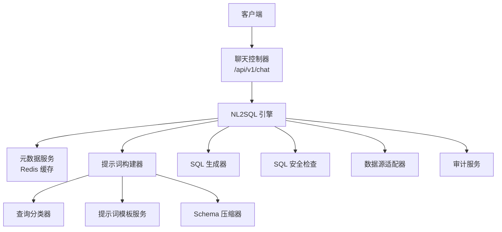
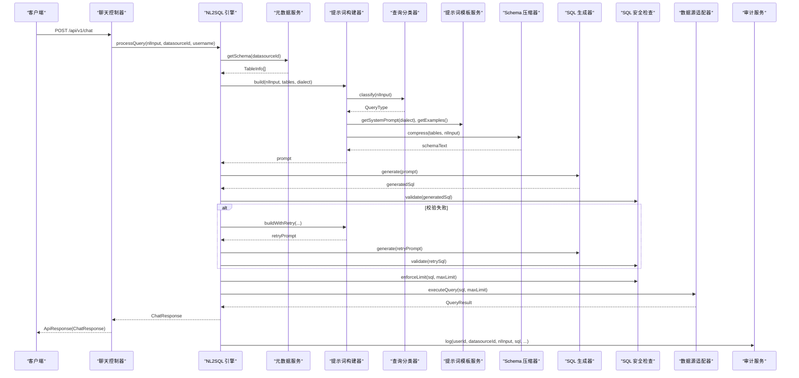
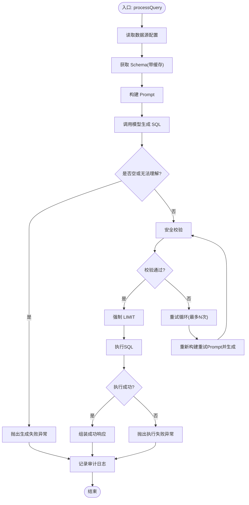
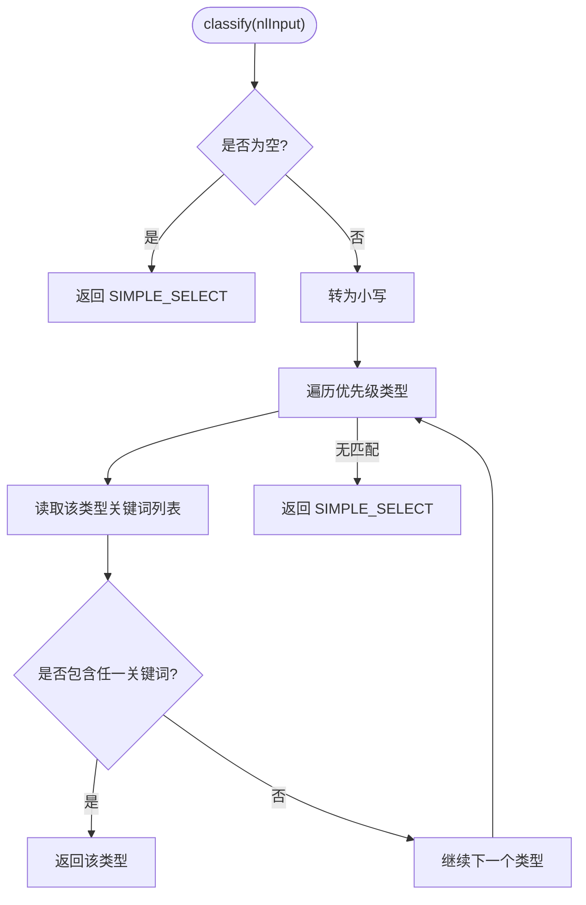
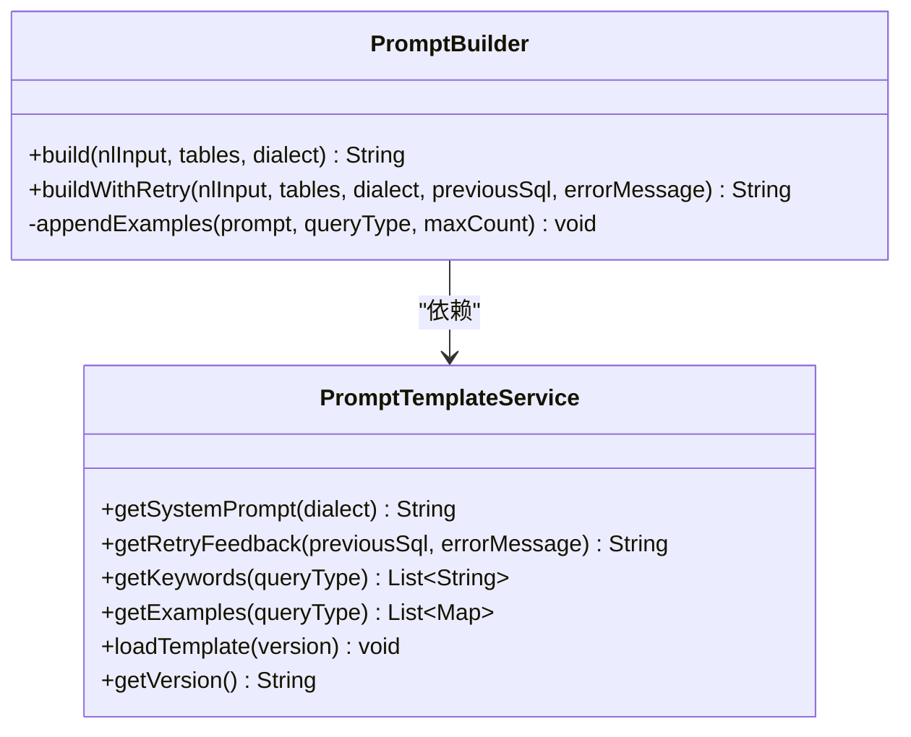
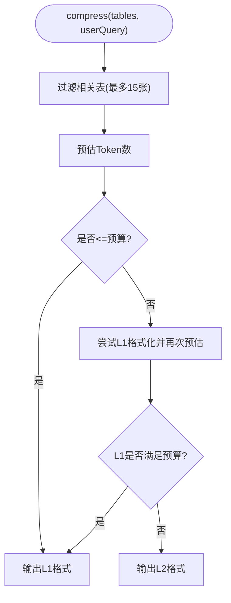
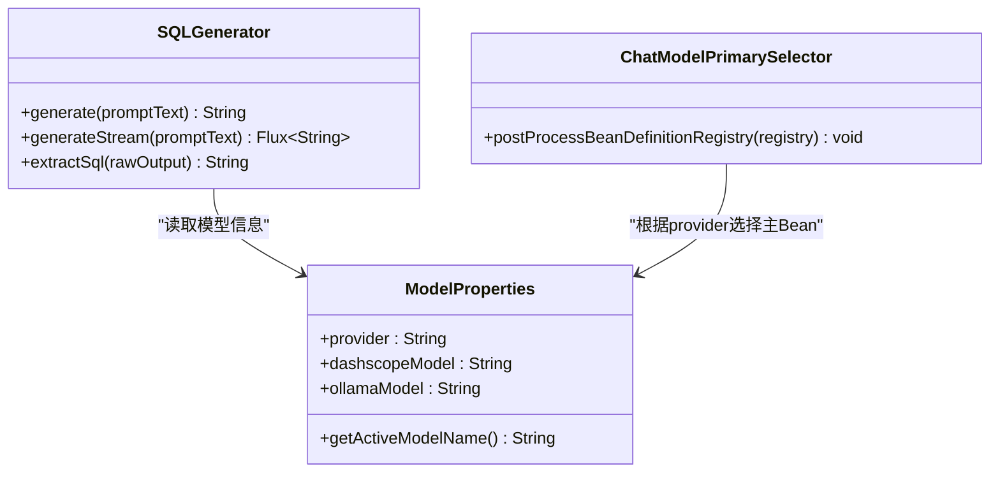
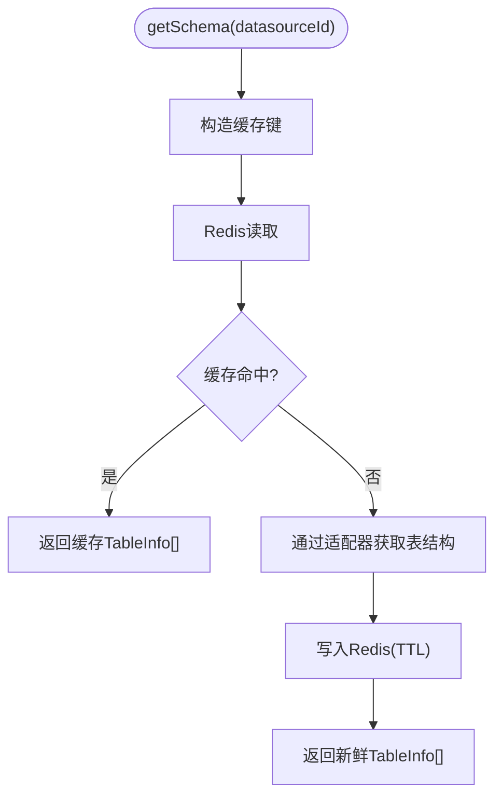
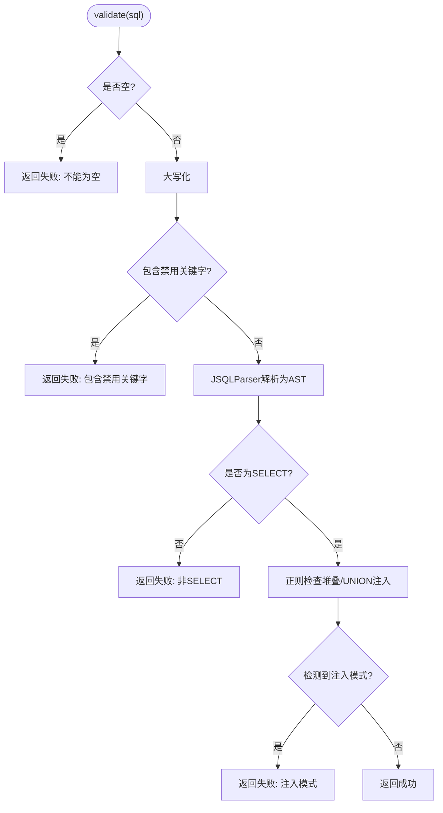
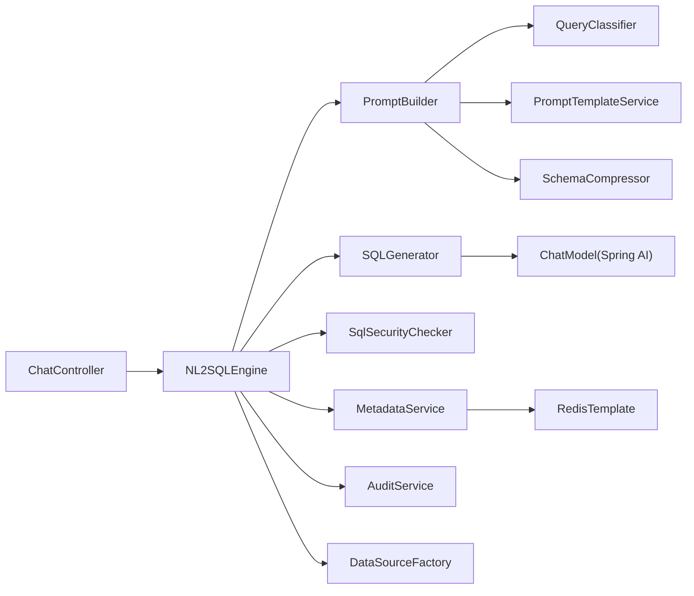

# NL2SQL 引擎

<cite>
**本文引用的文件**   
- [ChatController.java](file://backend/src/main/java/com/nlp2sql/controller/ChatController.java)
- [NL2SQLEngine.java](file://backend/src/main/java/com/nlp2sql/service/NL2SQLEngine.java)
- [QueryClassifier.java](file://backend/src/main/java/com/nlp2sql/service/QueryClassifier.java)
- [PromptBuilder.java](file://backend/src/main/java/com/nlp2sql/service/PromptBuilder.java)
- [PromptTemplateService.java](file://backend/src/main/java/com/nlp2sql/service/PromptTemplateService.java)
- [SchemaCompressor.java](file://backend/src/main/java/com/nlp2sql/service/SchemaCompressor.java)
- [SQLGenerator.java](file://backend/src/main/java/com/nlp2sql/service/SQLGenerator.java)
- [MetadataService.java](file://backend/src/main/java/com/nlp2sql/service/MetadataService.java)
- [SqlSecurityChecker.java](file://backend/src/main/java/com/nlp2sql/security/SqlSecurityChecker.java)
- [AuditService.java](file://backend/src/main/java/com/nlp2sql/service/AuditService.java)
- [ModelProperties.java](file://backend/src/main/java/com/nlp2sql/config/ModelProperties.java)
- [ChatModelPrimarySelector.java](file://backend/src/main/java/com/nlp2sql/config/ChatModelPrimarySelector.java)
- [application.yml](file://backend/src/main/resources/application.yml)
</cite>

## 目录
1. [简介](#简介)
2. [项目结构](#项目结构)
3. [核心组件](#核心组件)
4. [架构总览](#架构总览)
5. [详细组件分析](#详细组件分析)
6. [依赖关系分析](#依赖关系分析)
7. [性能与缓存](#性能与缓存)
8. [准确率提升与调优建议](#准确率提升与调优建议)
9. [故障排查指南](#故障排查指南)
10. [结论](#结论)

## 简介
本技术文档聚焦后端 NL2SQL 引擎，系统性说明自然语言到 SQL 的完整转换链路：查询分类、意图识别、上下文理解、提示词工程、模型调用、安全校验、执行与审计。重点覆盖 QueryClassifier 的分类策略、Prompt 模板机制、Schema 压缩、SQL 生成与安全控制，并给出处理流程图、优化建议与排错方法。

## 项目结构
后端采用 Spring Boot 分层结构，围绕 NL2SQL 核心能力组织为控制器、服务、安全、配置等模块。关键路径如下：
- 控制器层：对外暴露聊天接口，接收自然语言输入与数据源标识。
- 服务层：实现 NL2SQL 主流程、提示词构建、查询分类、Schema 压缩、SQL 生成、元数据获取与缓存、审计记录。
- 安全层：对生成的 SQL 进行语法、注入、堆叠查询限制和 LIMIT 强制。
- 配置层：选择 AI 模型提供者（DashScope 或 Ollama）、加载 Prompt 模板、定义 SQL 安全参数与 Schema 缓存 TTL。

**图示来源**  
- [ChatController.java:1-30](file://backend/src/main/java/com/nlp2sql/controller/ChatController.java#L1-L30)  
- [NL2SQLEngine.java:1-127](file://backend/src/main/java/com/nlp2sql/service/NL2SQLEngine.java#L1-L127)  
- [PromptBuilder.java:1-73](file://backend/src/main/java/com/nlp2sql/service/PromptBuilder.java#L1-L73)  
- [QueryClassifier.java:1-55](file://backend/src/main/java/com/nlp2sql/service/QueryClassifier.java#L1-L55)  
- [PromptTemplateService.java:1-98](file://backend/src/main/java/com/nlp2sql/service/PromptTemplateService.java#L1-L98)  
- [SchemaCompressor.java:1-162](file://backend/src/main/java/com/nlp2sql/service/SchemaCompressor.java#L1-L162)  
- [SQLGenerator.java:1-73](file://backend/src/main/java/com/nlp2sql/service/SQLGenerator.java#L1-L73)  
- [MetadataService.java:1-93](file://backend/src/main/java/com/nlp2sql/service/MetadataService.java#L1-L93)  
- [SqlSecurityChecker.java:1-88](file://backend/src/main/java/com/nlp2sql/security/SqlSecurityChecker.java#L1-L88)  
- [AuditService.java:1-31](file://backend/src/main/java/com/nlp2sql/service/AuditService.java#L1-L31)

**章节来源**  
- [ChatController.java:1-30](file://backend/src/main/java/com/nlp2sql/controller/ChatController.java#L1-L30)  
- [NL2SQLEngine.java:1-127](file://backend/src/main/java/com/nlp2sql/service/NL2SQLEngine.java#L1-L127)  
- [application.yml:1-117](file://backend/src/main/resources/application.yml#L1-L117)

## 核心组件
- NL2SQLEngine：编排从元数据获取、提示词构建、SQL 生成、安全校验、执行查询到审计记录的完整流程；内置重试逻辑与最大行数限制。
- QueryClassifier：基于关键词优先级的轻量级查询类型分类器，用于意图识别与 Few-Shot 示例选择。
- PromptBuilder：组合系统提示词、压缩后的 Schema、Few-Shot 示例与用户问题，构造最终 Prompt；支持重试分支。
- PromptTemplateService：加载外部 YAML 版本的 Prompt 模板，提供系统提示词、重试反馈、关键词与示例查询。
- SchemaCompressor：按 Token 预算过滤相关表、输出 L1/L2 两种 Schema 摘要，降低模型上下文成本。
- SQLGenerator：封装 Spring AI ChatModel 调用，支持同步与流式生成，并对原始输出提取 SQL。
- MetadataService：从数据源拉取表结构，使用 Redis 缓存 Schema，并提供刷新与列/表查询辅助方法。
- SqlSecurityChecker：通过黑名单、AST 解析、模式匹配检测非法 SQL，并强制添加 LIMIT。
- AuditService：持久化查询审计日志，包括输入、生成 SQL、校验结果、执行状态、行数和耗时。
- ModelProperties：集中管理模型提供方与模型名称，供日志与响应展示。
- ChatModelPrimarySelector：根据配置将 DashScope 或 Ollama 的 ChatModel bean 标记为主 Bean，避免冲突。

**章节来源**  
- [NL2SQLEngine.java:1-127](file://backend/src/main/java/com/nlp2sql/service/NL2SQLEngine.java#L1-L127)  
- [QueryClassifier.java:1-55](file://backend/src/main/java/com/nlp2sql/service/QueryClassifier.java#L1-L55)  
- [PromptBuilder.java:1-73](file://backend/src/main/java/com/nlp2sql/service/PromptBuilder.java#L1-L73)  
- [PromptTemplateService.java:1-98](file://backend/src/main/java/com/nlp2sql/service/PromptTemplateService.java#L1-L98)  
- [SchemaCompressor.java:1-162](file://backend/src/main/java/com/nlp2sql/service/SchemaCompressor.java#L1-L162)  
- [SQLGenerator.java:1-73](file://backend/src/main/java/com/nlp2sql/service/SQLGenerator.java#L1-L73)  
- [MetadataService.java:1-93](file://backend/src/main/java/com/nlp2sql/service/MetadataService.java#L1-L93)  
- [SqlSecurityChecker.java:1-88](file://backend/src/main/java/com/nlp2sql/security/SqlSecurityChecker.java#L1-L88)  
- [AuditService.java:1-31](file://backend/src/main/java/com/nlp2sql/service/AuditService.java#L1-L31)  
- [ModelProperties.java:1-19](file://backend/src/main/java/com/nlp2sql/config/ModelProperties.java#L1-L19)  
- [ChatModelPrimarySelector.java:1-57](file://backend/src/main/java/com/nlp2sql/config/ChatModelPrimarySelector.java#L1-L57)

## 架构总览
下图展示一次自然语言查询从进入控制器到返回结果的完整时序，涵盖分类、提示词构建、模型调用、安全检查与执行。

**图示来源**  
- [ChatController.java:1-30](file://backend/src/main/java/com/nlp2sql/controller/ChatController.java#L1-L30)  
- [NL2SQLEngine.java:1-127](file://backend/src/main/java/com/nlp2sql/service/NL2SQLEngine.java#L1-L127)  
- [PromptBuilder.java:1-73](file://backend/src/main/java/com/nlp2sql/service/PromptBuilder.java#L1-L73)  
- [QueryClassifier.java:1-55](file://backend/src/main/java/com/nlp2sql/service/QueryClassifier.java#L1-L55)  
- [PromptTemplateService.java:1-98](file://backend/src/main/java/com/nlp2sql/service/PromptTemplateService.java#L1-L98)  
- [SchemaCompressor.java:1-162](file://backend/src/main/java/com/nlp2sql/service/SchemaCompressor.java#L1-L162)  
- [SQLGenerator.java:1-78](file://backend/src/main/java/com/nlp2sql/service/SQLGenerator.java#L1-L78)  
- [MetadataService.java:1-93](file://backend/src/main/java/com/nlp2sql/service/MetadataService.java#L1-L93)  
- [SqlSecurityChecker.java:1-88](file://backend/src/main/java/com/nlp2sql/security/SqlSecurityChecker.java#L1-L88)  
- [AuditService.java:1-31](file://backend/src/main/java/com/nlp2sql/service/AuditService.java#L1-L31)

## 详细组件分析

### 查询处理主流程：NL2SQLEngine
- 职责：协调元数据、提示词、模型、安全与执行，负责重试与审计。
- 关键点：
  - 获取数据源配置与 Schema，校验是否存在表结构。
  - 调用 PromptBuilder 构建 Prompt，SQLGenerator 生成 SQL。
  - 若模型返回空或“无法理解”，抛出业务异常。
  - 通过 SqlSecurityChecker.validate 校验，失败则重试，最多 maxRetry 次。
  - 通过 enforceLimit 确保 LIMIT 存在且不超过 maxLimit。
  - 通过 DataSourceFactory 与 BaseDataSourceAdapter 执行 SQL，收集列与行。
  - 在 finally 中统一记录审计日志，包含成功标志、错误信息与耗时。

**图示来源**  
- [NL2SQLEngine.java:1-127](file://backend/src/main/java/com/nlp2sql/service/NL2SQLEngine.java#L1-L127)  
- [SqlSecurityChecker.java:1-88](file://backend/src/main/java/com/nlp2sql/security/SqlSecurityChecker.java#L1-L88)  
- [PromptBuilder.java:1-73](file://backend/src/main/java/com/nlp2sql/service/PromptBuilder.java#L1-L73)  
- [SQLGenerator.java:1-73](file://backend/src/main/java/com/nlp2sql/service/SQLGenerator.java#L1-L73)  
- [MetadataService.java:1-93](file://backend/src/main/java/com/nlp2sql/service/MetadataService.java#L1-L93)

**章节来源**  
- [NL2SQLEngine.java:1-127](file://backend/src/main/java/com/nlp2sql/service/NL2SQLEngine.java#L1-L127)

### 查询分类器：QueryClassifier
- 分类算法：
  - 优先级列表定义了子查询、Top-N、趋势、聚合、模糊、连接、过滤等类型的匹配顺序。
  - 通过 PromptTemplateService 提供的 keywords 进行字符串包含判断。
  - 若为空或空白输入，默认归类为简单 SELECT。
- Few-Shot 示例：
  - 依据分类结果从 PromptTemplateService 获取对应示例，用于增强 Prompt 引导。

**图示来源**  
- [QueryClassifier.java:1-55](file://backend/src/main/java/com/nlp2sql/service/QueryClassifier.java#L1-L55)  
- [PromptTemplateService.java:1-98](file://backend/src/main/java/com/nlp2sql/service/PromptTemplateService.java#L1-L98)

**章节来源**  
- [QueryClassifier.java:1-55](file://backend/src/main/java/com/nlp2sql/service/QueryClassifier.java#L1-L55)

### 提示词构建与模板：PromptBuilder 与 PromptTemplateService
- PromptBuilder：
  - 先分类，再拼接系统提示词、压缩 Schema、Few-Shot 示例与用户问题。
  - 重试分支会追加上一次 SQL 与错误信息，减少重复错误。
- PromptTemplateService：
  - 启动时加载指定版本的 YAML 模板，解析 system_prompt、retry_feedback、keywords、examples。
  - 支持动态替换方言占位符与重试占位符。

**图示来源**  
- [PromptBuilder.java:1-73](file://backend/src/main/java/com/nlp2sql/service/PromptBuilder.java#L1-L73)  
- [PromptTemplateService.java:1-98](file://backend/src/main/java/com/nlp2sql/service/PromptTemplateService.java#L1-L98)

**章节来源**  
- [PromptBuilder.java:1-73](file://backend/src/main/java/com/nlp2sql/service/PromptBuilder.java#L1-L73)  
- [PromptTemplateService.java:1-98](file://backend/src/main/java/com/nlp2sql/service/PromptTemplateService.java#L1-L98)

### Schema 压缩：SchemaCompressor
- 目标：在 Token 预算内尽可能保留相关表与字段，降低模型上下文成本。
- 策略：
  - 过滤相关表：对用户问题分词，匹配表名、注释与字段注释。
  - 预估 Token：按字符长度除以平均字符/token 估算。
  - L1 格式：表名+注释+字段名+类型+注释，附带外键推断提示。
  - L2 格式：仅表名+字段名，更紧凑。
- 降级：若 L1 仍超预算，则回退至 L2。

**图示来源**  
- [SchemaCompressor.java:1-162](file://backend/src/main/java/com/nlp2sql/service/SchemaCompressor.java#L1-L162)

**章节来源**  
- [SchemaCompressor.java:1-162](file://backend/src/main/java/com/nlp2sql/service/SchemaCompressor.java#L1-L162)

### SQL 生成与模型集成：SQLGenerator 与 ModelProperties
- SQLGenerator：
  - 同步生成：构造 Prompt，调用 ChatModel.call，提取纯 SQL。
  - 流式生成：ChatModel.stream，逐 token 映射并过滤空串。
  - SQL 提取：去除代码块围栏与末尾分号。
- ModelProperties：
  - provider 决定 activeModelName，用于日志与响应展示。
- ChatModelPrimarySelector：
  - 根据 nlp2sql.model.provider 将 dashscopeChatModel 或 ollamaChatModel 设置为主 Bean，解决多提供者共存时的注入歧义。

**图示来源**  
- [SQLGenerator.java:1-73](file://backend/src/main/java/com/nlp2sql/service/SQLGenerator.java#L1-L73)  
- [ModelProperties.java:1-19](file://backend/src/main/java/com/nlp2sql/config/ModelProperties.java#L1-L19)  
- [ChatModelPrimarySelector.java:1-57](file://backend/src/main/java/com/nlp2sql/config/ChatModelPrimarySelector.java#L1-L57)

**章节来源**  
- [SQLGenerator.java:1-73](file://backend/src/main/java/com/nlp2sql/service/SQLGenerator.java#L1-L73)  
- [ModelProperties.java:1-19](file://backend/src/main/java/com/nlp2sql/config/ModelProperties.java#L1-L19)  
- [ChatModelPrimarySelector.java:1-57](file://backend/src/main/java/com/nlp2sql/config/ChatModelPrimarySelector.java#L1-L57)

### 元数据与缓存：MetadataService
- 功能：
  - 优先从 Redis 读取 Schema 缓存，命中则直接返回。
  - 未命中则通过 DataSourceFactory 与 BaseDataSourceAdapter 拉取表结构，写入缓存。
  - 提供 refreshCache 以主动失效并重建缓存。
  - 提供 getTables/getColumns 辅助查询。
- 配置：TTL 由 application.yml 的 schema-cache.ttl-seconds 控制。

**图示来源**  
- [MetadataService.java:1-93](file://backend/src/main/java/com/nlp2sql/service/MetadataService.java#L1-L93)

**章节来源**  
- [MetadataService.java:1-93](file://backend/src/main/java/com/nlp2sql/service/MetadataService.java#L1-L93)

### SQL 安全与限制：SqlSecurityChecker
- 防护层次：
  - 黑名单：禁止 DML/DDL/危险命令。
  - AST 解析：仅允许 SELECT。
  - 模式匹配：禁止堆叠查询与可疑 UNION 注入。
- 限制策略：
  - enforceLimit：若无 LIMIT，自动追加 maxLimit；否则保持原样。
- 重试反馈：
  - 当校验失败时，NL2SQLEngine 会通过 PromptBuilder.buildWithRetry 把错误信息注入 Prompt，促使模型修正。

**图示来源**  
- [SqlSecurityChecker.java:1-88](file://backend/src/main/java/com/nlp2sql/security/SqlSecurityChecker.java#L1-L88)

**章节来源**  
- [SqlSecurityChecker.java:1-88](file://backend/src/main/java/com/nlp2sql/security/SqlSecurityChecker.java#L1-L88)

### 审计与日志：AuditService
- 记录内容：用户ID、数据源ID、自然语言输入、生成 SQL、校验是否通过、执行是否成功、返回行数、耗时、错误信息。
- 触发时机：每次查询处理的 finally 分支中统一记录，保证异常路径也有审计。

**章节来源**  
- [AuditService.java:1-31](file://backend/src/main/java/com/nlp2sql/service/AuditService.java#L1-L31)

## 依赖关系分析
- 控制器依赖引擎，引擎依赖提示词构建器、SQL 生成器、安全检查器、元数据服务、数据源工厂、审计服务、认证服务与模型属性。
- 提示词构建器依赖查询分类器、Schema 压缩器与模板服务。
- 元数据服务依赖 Redis、数据源工厂与数据源服务。
- SQL 生成器依赖 Spring AI ChatModel 与模型属性。
- 安全检查器依赖 JSQLParser。
- 配置类负责 Provider 切换与 Bean 主标注。

**图示来源**  
- [ChatController.java:1-30](file://backend/src/main/java/com/nlp2sql/controller/ChatController.java#L1-L30)  
- [NL2SQLEngine.java:1-127](file://backend/src/main/java/com/nlp2sql/service/NL2SQLEngine.java#L1-L127)  
- [PromptBuilder.java:1-73](file://backend/src/main/java/com/nlp2sql/service/PromptBuilder.java#L1-L73)  
- [QueryClassifier.java:1-55](file://backend/src/main/java/com/nlp2sql/service/QueryClassifier.java#L1-L55)  
- [PromptTemplateService.java:1-98](file://backend/src/main/java/com/nlp2sql/service/PromptTemplateService.java#L1-L98)  
- [SchemaCompressor.java:1-162](file://backend/src/main/java/com/nlp2sql/service/SchemaCompressor.java#L1-L162)  
- [SQLGenerator.java:1-73](file://backend/src/main/java/com/nlp2sql/service/SQLGenerator.java#L1-L73)  
- [MetadataService.java:1-93](file://backend/src/main/java/com/nlp2sql/service/MetadataService.java#L1-L93)

**章节来源**  
- [ChatController.java:1-30](file://backend/src/main/java/com/nlp2sql/controller/ChatController.java#L1-L30)  
- [NL2SQLEngine.java:1-127](file://backend/src/main/java/com/nlp2sql/service/NL2SQLEngine.java#L1-L127)

## 性能与缓存
- Schema 缓存：
  - 通过 Redis 缓存每个数据源的 Schema，TTL 可配置，显著降低频繁拉取元数据的开销。
  - 提供主动刷新接口，在数据源结构变更后及时失效缓存。
- Prompt 与 Schema 压缩：
  - SchemaCompressor 按 Token 预算选择 L1/L2 格式，避免过长上下文导致模型性能下降。
  - PromptBuilder 限制 Few-Shot 示例数量，避免提示词过大。
- SQL 安全与限制：
  - enforceLimit 防止全表扫描，结合数据库侧超时配置，降低慢查询风险。
- 模型调用：
  - SQLGenerator 提供流式生成能力，适合前端流式渲染；但当前主流程使用同步调用。
- 线程与连接池：
  - HikariCP 与 Redis Lettuce 连接池参数在 application.yml 中配置，可按负载调整。

优化建议：
- 合理设置 schema-cache.ttl-seconds，平衡一致性与时延。
- 对高频数据源增加本地二级缓存（如 Caffeine），进一步降低 Redis 压力。
- 针对复杂查询场景，适当增大 TOKEN_BUDGET 或引入字段级相关性打分。
- 在 ChatModel 层面启用请求批量化与连接复用，减少网络开销。

**章节来源**  
- [MetadataService.java:1-93](file://backend/src/main/java/com/nlp2sql/service/MetadataService.java#L1-L93)  
- [SchemaCompressor.java:1-162](file://backend/src/main/java/com/nlp2sql/service/SchemaCompressor.java#L1-L162)  
- [application.yml:1-117](file://backend/src/main/resources/application.yml#L1-L117)

## 准确率提升与调优建议
- 查询分类与意图识别：
  - 扩展 QueryClassifier 的关键词库，细化 TOP_N、TREND、FUZZY 等意图的特征词。
  - 引入更丰富的 Few-Shot 示例，覆盖边界情况与常见错误。
- Prompt 工程：
  - 在 system_prompt 中明确方言差异与字段关联约定，减少歧义。
  - 在 retry_feedback 中加入具体错误修复指引，例如“请仅使用 SELECT”“请使用 LIMIT”。
- Schema 描述质量：
  - 完善表注释与字段注释，提高 SchemaCompressor 的相关性过滤效果。
  - 对于大库，考虑按业务域拆分 Schema 摘要，按需注入。
- 模型选择与参数：
  - 对比不同 provider 与模型版本，选择稳定且指令遵循能力更强的模型。
  - temperature=0 有利于确定性输出；必要时微调 num-ctx 以适配长上下文。
- 安全与约束：
  - 严格使用 SqlSecurityChecker 校验，避免非法语句污染下游执行。
  - 对高风险操作设置最小权限账号与只读访问。

**章节来源**  
- [QueryClassifier.java:1-55](file://backend/src/main/java/com/nlp2sql/service/QueryClassifier.java#L1-L55)  
- [PromptTemplateService.java:1-98](file://backend/src/main/java/com/nlp2sql/service/PromptTemplateService.java#L1-L98)  
- [SchemaCompressor.java:1-162](file://backend/src/main/java/com/nlp2sql/service/SchemaCompressor.java#L1-L162)  
- [application.yml:1-117](file://backend/src/main/resources/application.yml#L1-L117)

## 故障排查指南
常见问题与定位思路：
- 模型无法理解查询：
  - 现象：返回空或“无法理解”。
  - 原因：Prompt 不够清晰、Few-Shot 不足、Schema 缺失或无关。
  - 处理：优化 system_prompt 与 examples；完善表/字段注释；检查 PromptTemplateService 是否加载成功。
- SQL 校验失败：
  - 现象：触发重试后仍失败。
  - 原因：模型生成了非 SELECT 语句或包含禁用关键字。
  - 处理：加强 retry_feedback 指引；扩大黑名单；检查 JSQLParser 报错信息。
- 执行失败：
  - 现象：adapter.executeQuery 返回失败。
  - 原因：SQL 语法错误或权限不足。
  - 处理：查看 AuditService 记录中的 errorMessage；核对数据源连接与权限。
- Schema 缓存不生效：
  - 现象：频繁拉取元数据或数据更新后未刷新。
  - 处理：检查 Redis 连通性与 TTL；调用 refreshCache 主动失效。

日志与监控建议：
- 开启 com.nlp2sql 的 DEBUG 日志，关注 Prompt 构建、模型调用、校验失败与执行结果。
- 结合审计日志统计成功率、平均耗时与错误分布，持续优化 Prompt 与分类策略。

**章节来源**  
- [NL2SQLEngine.java:1-127](file://backend/src/main/java/com/nlp2sql/service/NL2SQLEngine.java#L1-L127)  
- [PromptTemplateService.java:1-98](file://backend/src/main/java/com/nlp2sql/service/PromptTemplateService.java#L1-L98)  
- [SqlSecurityChecker.java:1-88](file://backend/src/main/java/com/nlp2sql/security/SqlSecurityChecker.java#L1-L88)  
- [MetadataService.java:1-93](file://backend/src/main/java/com/nlp2sql/service/MetadataService.java#L1-L93)  
- [AuditService.java:1-31](file://backend/src/main/java/com/nlp2sql/service/AuditService.java#L1-L31)

## 结论
本 NL2SQL 引擎通过“分类→提示词→Schema 压缩→模型生成→安全校验→执行→审计”的闭环设计，实现了高可用、可扩展的自然语言转 SQL 能力。QueryClassifier 提供轻量意图识别，PromptTemplateService 支撑可配置的提示词工程，SchemaCompressor 有效降低上下文成本，SqlSecurityChecker 保障 SQL 安全与可控范围。结合 Redis 缓存与连接池配置，系统在吞吐与延迟之间取得良好平衡。后续可通过扩充分类特征、优化 Prompt、改进 Schema 相关性评估与引入二级缓存进一步提升准确率与性能。