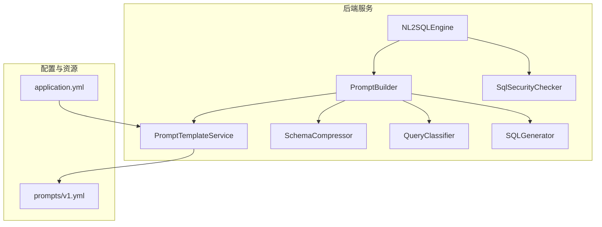
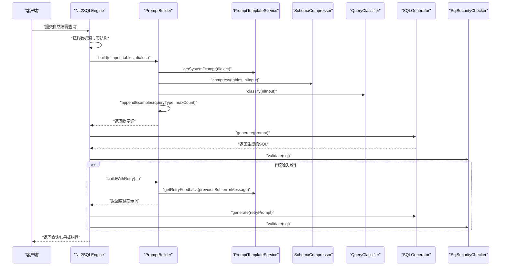
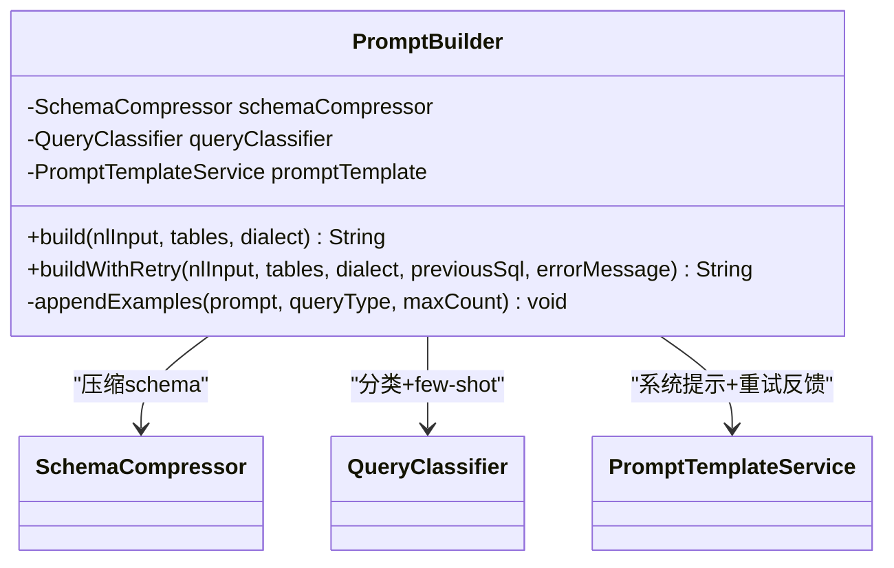
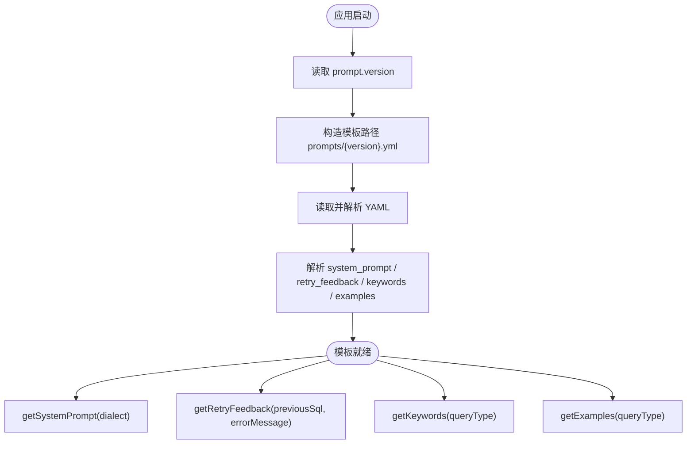
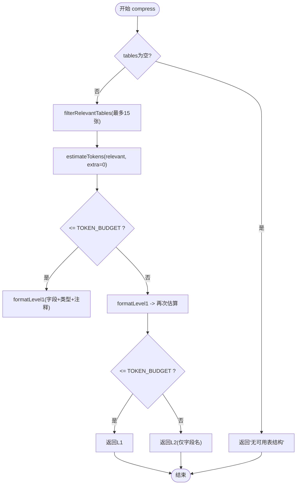
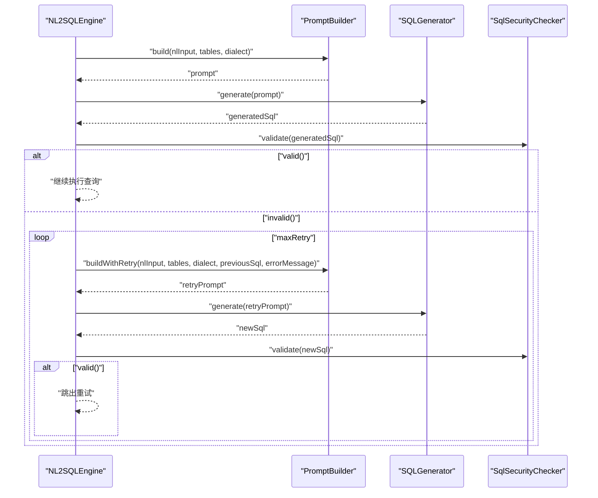
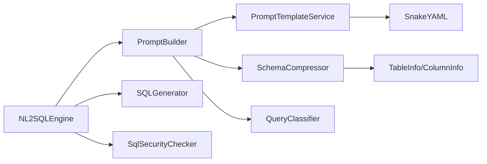

# 提示词系统

<cite>
**本文引用的文件**   
- [PromptBuilder.java](file://backend/src/main/java/com/nlp2sql/service/PromptBuilder.java)
- [PromptTemplateService.java](file://backend/src/main/java/com/nlp2sql/service/PromptTemplateService.java)
- [SchemaCompressor.java](file://backend/src/main/java/com/nlp2sql/service/SchemaCompressor.java)
- [NL2SQLEngine.java](file://backend/src/main/java/com/nlp2sql/service/NL2SQLEngine.java)
- [QueryClassifier.java](file://backend/src/main/java/com/nlp2sql/service/QueryClassifier.java)
- [SQLGenerator.java](file://backend/src/main/java/com/nlp2sql/service/SQLGenerator.java)
- [SqlSecurityChecker.java](file://backend/src/main/java/com/nlp2sql/security/SqlSecurityChecker.java)
- [application.yml](file://backend/src/main/resources/application.yml)
- [v1.yml](file://backend/src/main/resources/prompts/v1.yml)
</cite>

## 目录
1. [引言](#引言)
2. [项目结构](#项目结构)
3. [核心组件](#核心组件)
4. [架构总览](#架构总览)
5. [详细组件分析](#详细组件分析)
6. [依赖关系分析](#依赖关系分析)
7. [性能与成本优化](#性能与成本优化)
8. [效果评估与迭代策略](#效果评估与迭代策略)
9. [调试工具与方法](#调试工具与方法)
10. [版本管理与回滚机制](#版本管理与回滚机制)
11. [常见场景与最佳实践](#常见场景与最佳实践)
12. [故障排查指南](#故障排查指南)
13. [结论](#结论)

## 引言
本文件聚焦于 NL2SQL 后端的提示词系统，围绕 PromptBuilder、PromptTemplateService、SchemaCompressor 以及与之协作的查询分类器、SQL 生成与安全校验组件展开。文档解释以下关键主题：
- PromptBuilder 的动态提示词构建流程：few-shot 学习、上下文压缩、schema 注入、重试反馈。
- PromptTemplateService 的模板管理机制与版本控制。
- 提示词优化策略、效果评估方法与迭代建议。
- 不同查询场景下的提示词示例和最佳实践。
- 提示词调试、观测与回滚方法。

该体系的目标是让自然语言问题在安全约束下稳定地转换为可执行的 SQL，同时兼顾模型输入长度限制、语义准确性和生产可用性。

## 项目结构
提示词相关代码集中在后端服务的 service 层与 resources 配置中，整体组织方式如下：
- 服务层：
  - PromptBuilder：动态组装提示词，整合系统指令、压缩后的 schema、few-shot 示例与重试反馈。
  - PromptTemplateService：从 classpath 加载 YAML 模板，提供系统提示、重试反馈、关键词与示例检索接口。
  - SchemaCompressor：根据用户查询过滤相关表并压缩 schema，控制 token 预算。
  - QueryClassifier：基于关键词匹配将自然语言问题分类为 SIMPLE_SELECT、WHERE_FILTER、AGGREGATION、TOP_N、TREND、JOIN、SUBQUERY、FUZZY 等类型。
  - SQLGenerator：调用外部大模型生成 SQL。
  - SqlSecurityChecker：校验 SQL 安全性，限制 SELECT、LIMIT、超时等。
- 配置层：
  - application.yml：集中管理模型选择、提示词版本、SQL 安全参数、Schema 缓存等。
  - prompts/v1.yml：当前激活的提示词模板，包含 system_prompt、retry_feedback、keywords、examples。

**图表来源**
- [PromptBuilder.java:1-73](file://backend/src/main/java/com/nlp2sql/service/PromptBuilder.java#L1-L73)
- [PromptTemplateService.java:1-98](file://backend/src/main/java/com/nlp2sql/service/PromptTemplateService.java#L1-L98)
- [SchemaCompressor.java:1-162](file://backend/src/main/java/com/nlp2sql/service/SchemaCompressor.java#L1-L162)
- [NL2SQLEngine.java:1-127](file://backend/src/main/java/com/nlp2sql/service/NL2SQLEngine.java#L1-L127)
- [application.yml:1-117](file://backend/src/main/resources/application.yml#L1-L117)
- [v1.yml:1-149](file://backend/src/main/resources/prompts/v1.yml#L1-L149)

**章节来源**
- [PromptBuilder.java:1-73](file://backend/src/main/java/com/nlp2sql/service/PromptBuilder.java#L1-L73)
- [PromptTemplateService.java:1-98](file://backend/src/main/java/com/nlp2sql/service/PromptTemplateService.java#L1-L98)
- [SchemaCompressor.java:1-162](file://backend/src/main/java/com/nlp2sql/service/SchemaCompressor.java#L1-L162)
- [NL2SQLEngine.java:1-127](file://backend/src/main/java/com/nlp2sql/service/NL2SQLEngine.java#L1-L127)
- [application.yml:1-117](file://backend/src/main/resources/application.yml#L1-L117)
- [v1.yml:1-149](file://backend/src/main/resources/prompts/v1.yml#L1-L149)

## 核心组件
- PromptBuilder：负责把“系统指令 + 压缩 schema + few-shot 示例 + 用户问题”拼装成最终提示词；支持失败重试时追加错误反馈。
- PromptTemplateService：从 classpath 读取 prompts/{version}.yml，维护 system_prompt、retry_feedback、keywords、examples，并提供按查询类型的关键词与示例检索。
- SchemaCompressor：对数据库元数据做相关性过滤与两级格式压缩，确保提示词不超过 token 预算。
- QueryClassifier：通过 v1.yml 中的 keywords 列表进行关键词匹配，将自然语言问题归类到预定义查询类型。
- NL2SQLEngine：编排整个 NL2SQL 流程，包括 schema 获取、提示词构建、SQL 生成、安全校验、执行与审计。

**章节来源**
- [PromptBuilder.java:1-73](file://backend/src/main/java/com/nlp2sql/service/PromptBuilder.java#L1-L73)
- [PromptTemplateService.java:1-98](file://backend/src/main/java/com/nlp2sql/service/PromptTemplateService.java#L1-L98)
- [SchemaCompressor.java:1-162](file://backend/src/main/java/com/nlp2sql/service/SchemaCompressor.java#L1-L162)
- [NL2SQLEngine.java:1-127](file://backend/src/main/java/com/nlp2sql/service/NL2SQLEngine.java#L1-L127)

## 架构总览
NL2SQL 主流程由 NL2SQLEngine 编排，提示词系统在其中扮演“语义引导 + 约束注入”的关键角色。

**图表来源**
- [NL2SQLEngine.java:40-127](file://backend/src/main/java/com/nlp2sql/service/NL2SQLEngine.java#L40-L127)
- [PromptBuilder.java:21-73](file://backend/src/main/java/com/nlp2sql/service/PromptBuilder.java#L21-L73)
- [PromptTemplateService.java:30-98](file://backend/src/main/java/com/nlp2sql/service/PromptTemplateService.java#L30-L98)
- [SchemaCompressor.java:15-162](file://backend/src/main/java/com/nlp2sql/service/SchemaCompressor.java#L15-L162)

**章节来源**
- [NL2SQLEngine.java:40-127](file://backend/src/main/java/com/nlp2sql/service/NL2SQLEngine.java#L40-L127)

## 详细组件分析

### PromptBuilder：动态提示词构建器
职责与行为：
- 根据 QueryClassifier 的分类结果，决定 few-shot 示例的数量与内容。
- 通过 PromptTemplateService 获取系统提示与重试反馈模板，并将 {dialect}、{previousSql}、{errorMessage} 等占位符替换为实际值。
- 使用 SchemaCompressor 将表结构压缩为适合模型输入的文本，避免超出 token 预算。
- 提供 build 与 buildWithRetry 两种构建模式：首次构建与失败重试构建。

关键逻辑要点：
- 首次构建顺序：系统提示 → 压缩 schema → few-shot 示例（最多 3 条）→ “问题: ... SQL:”。
- 重试构建顺序：系统提示 → 压缩 schema → fewer-shot 示例（最多 2 条）→ 重试反馈 → “问题: ... SQL:”。
- appendExamples 会根据 queryType 取 examples 列表，按 min(available, maxCount) 输出。

复杂度分析：
- appendExamples 时间复杂度 O(k)，k 为示例数量。
- 总体构建过程受限于模板替换、schema 压缩与示例拼接，属于线性开销。

**图表来源**
- [PromptBuilder.java:1-73](file://backend/src/main/java/com/nlp2sql/service/PromptBuilder.java#L1-L73)

**章节来源**
- [PromptBuilder.java:1-73](file://backend/src/main/java/com/nlp2sql/service/PromptBuilder.java#L1-L73)

### PromptTemplateService：模板管理与版本控制
职责与行为：
- 启动时加载当前版本模板（默认 v1），解析 YAML 配置为内部数据结构。
- 暴露 getSystemPrompt、getRetryFeedback、getKeywords、getExamples、getVersion、getQueryTypes 等方法。
- 支持通过配置项 prompt.version 切换模板版本，并在异常时抛出运行时异常以便快速失败。

模板结构（v1.yml）：
- version/description：版本标识与说明。
- system_prompt：系统指令，包含 {dialect} 占位符。
- retry_feedback：重试反馈模板，包含 {previousSql}、{errorMessage} 占位符。
- keywords：查询类型到关键词列表的映射。
- examples：查询类型到 few-shot 示例的映射。

版本切换机制：
- 通过 application.yml 的 prompt.version 指定文件名，如 v1.yml、v2.yml。
- loadTemplate 使用 ClassPathResource 加载 classpath 下的 prompts/{version}.yml。

**图表来源**
- [PromptTemplateService.java:1-98](file://backend/src/main/java/com/nlp2sql/service/PromptTemplateService.java#L1-L98)
- [v1.yml:1-149](file://backend/src/main/resources/prompts/v1.yml#L1-L149)
- [application.yml:96-101](file://backend/src/main/resources/application.yml#L96-L101)

**章节来源**
- [PromptTemplateService.java:1-98](file://backend/src/main/java/com/nlp2sql/service/PromptTemplateService.java#L1-L98)
- [v1.yml:1-149](file://backend/src/main/resources/prompts/v1.yml#L1-L149)
- [application.yml:96-101](file://backend/src/main/resources/application.yml#L96-L101)

### SchemaCompressor：上下文压缩与 Token 预算控制
职责与行为：
- 当无可用表结构时直接返回固定提示。
- 基于用户查询进行相关性过滤，最多保留 15 张表。
- 估算 token 数并与 TOKEN_BUDGET（800）比较，优先尝试 L1 格式（含字段名、数据类型与注释），若仍超限则回退到 L2 格式（仅字段名）。
- 添加外键关联推断提示，帮助模型理解表间关系。

Token 估算策略：
- 以字符数除以 2 近似 token 数。
- estimateTokens(List<TableInfo>) 累加表名、字段名、数据类型与注释长度。
- estimateTokens(String) 对已格式化文本同样估算。

相关性判断：
- 中文按双字切分，英文按单词切分，统一去重。
- 匹配表名、表注释、字段名与字段注释。

**图表来源**
- [SchemaCompressor.java:15-162](file://backend/src/main/java/com/nlp2sql/service/SchemaCompressor.java#L15-L162)

**章节来源**
- [SchemaCompressor.java:15-162](file://backend/src/main/java/com/nlp2sql/service/SchemaCompressor.java#L15-L162)

### QueryClassifier：查询分类与 Few-Shot 示例选择
职责与行为：
- 通过 PromptTemplateService.getQueryTypes() 与 keywords 映射，对自然语言问题进行关键词匹配。
- 返回 QueryType 枚举（如 SIMPLE_SELECT、WHERE_FILTER、AGGREGATION、TOP_N、TREND、JOIN、SUBQUERY、FUZZY）。
- 配合 PromptBuilder.appendExamples 选取对应类型的 few-shot 示例，限制最大数量以避免提示词过长。

作用与影响：
- 分类准确与否直接影响 few-shot 示例的质量，从而影响模型生成 SQL 的稳定性。
- 可通过扩展 v1.yml 中的 keywords 与 examples 提升特定场景准确率。

**章节来源**
- [PromptBuilder.java:53-73](file://backend/src/main/java/com/nlp2sql/service/PromptBuilder.java#L53-L73)
- [v1.yml:31-149](file://backend/src/main/resources/prompts/v1.yml#L31-L149)

### NL2SQLEngine：流程编排与安全校验
职责与行为：
- 获取数据源配置与表结构，构造提示词并调用 SQLGenerator 生成 SQL。
- 如果生成结果为空或包含“无法理解”，抛出业务异常。
- 通过 SqlSecurityChecker.validate 校验 SQL；失败时进入重试流程，最多重试 maxRetry 次。
- 成功后调用 DataSourceAdapter 执行查询，记录审计日志。

重试机制：
- validateWithRetry 会循环构建带错误反馈的重试提示词，直到校验通过或达到最大重试次数。
- 每次重试都会记录日志信息，便于定位问题。

**图表来源**
- [NL2SQLEngine.java:40-127](file://backend/src/main/java/com/nlp2sql/service/NL2SQLEngine.java#L40-L127)
- [PromptBuilder.java:43-73](file://backend/src/main/java/com/nlp2sql/service/PromptBuilder.java#L43-L73)

**章节来源**
- [NL2SQLEngine.java:40-127](file://backend/src/main/java/com/nlp2sql/service/NL2SQLEngine.java#L40-L127)

## 依赖关系分析
- PromptBuilder 强依赖 PromptTemplateService、SchemaCompressor、QueryClassifier。
- NL2SQLEngine 依赖所有上述组件，并通过 DataSourceFactory 与 MetadataService 完成数据源与 schema 获取。
- PromptTemplateService 依赖 Spring 配置与 SnakeYAML 解析 classpath 下的 prompts/{version}.yml。
- SchemaCompressor 依赖 TableInfo/ColumnInfo 模型对象。

耦合度与内聚性：
- PromptBuilder 作为协调者，职责清晰且内聚性强。
- PromptTemplateService 独立于业务逻辑，具备良好的可扩展性。
- SchemaCompressor 专注于上下文压缩，内聚性高，但可进一步抽象出更多压缩策略。

潜在循环依赖：
- 当前未发现循环依赖。各组件单向依赖，符合分层架构原则。

**图表来源**
- [NL2SQLEngine.java:1-127](file://backend/src/main/java/com/nlp2sql/service/NL2SQLEngine.java#L1-L127)
- [PromptBuilder.java:1-73](file://backend/src/main/java/com/nlp2sql/service/PromptBuilder.java#L1-L73)
- [PromptTemplateService.java:1-98](file://backend/src/main/java/com/nlp2sql/service/PromptTemplateService.java#L1-L98)
- [SchemaCompressor.java:1-162](file://backend/src/main/java/com/nlp2sql/service/SchemaCompressor.java#L1-L162)

**章节来源**
- [NL2SQLEngine.java:1-127](file://backend/src/main/java/com/nlp2sql/service/NL2SQLEngine.java#L1-L127)
- [PromptBuilder.java:1-73](file://backend/src/main/java/com/nlp2sql/service/PromptBuilder.java#L1-L73)
- [PromptTemplateService.java:1-98](file://backend/src/main/java/com/nlp2sql/service/PromptTemplateService.java#L1-L98)
- [SchemaCompressor.java:1-162](file://backend/src/main/java/com/nlp2sql/service/SchemaCompressor.java#L1-L162)

## 性能与成本优化
- Token 预算控制：
  - TOKEN_BUDGET 设为 800，平均每个 token 约 2 个字符。
  - 优先使用 L1 格式，若超限则回退 L2，减少无效字段与注释。
- 相关性过滤：
  - 通过中英文切分与多字段匹配，仅保留最相关的表，降低噪声。
- Few-shot 示例数量：
  - 首次构建最多 3 条，重试构建最多 2 条，平衡准确性与提示词长度。
- 重试策略：
  - 通过 sql-security.max-retry 控制最大重试次数，避免无限重试导致的成本膨胀。
- 模型参数：
  - temperature 设置为 0，提高输出稳定性；num-ctx 可调整上下文窗口大小（Ollama profile）。

建议：
- 根据业务场景调优 TOKEN_BUDGET 与示例数量。
- 对高频查询类型增加高质量 few-shot 示例，提升准确率。
- 监控重试率与失败原因，持续优化模板与分类规则。

**章节来源**
- [SchemaCompressor.java:15-162](file://backend/src/main/java/com/nlp2sql/service/SchemaCompressor.java#L15-L162)
- [PromptBuilder.java:21-73](file://backend/src/main/java/com/nlp2sql/service/PromptBuilder.java#L21-L73)
- [application.yml:83-101](file://backend/src/main/resources/application.yml#L83-L101)

## 效果评估与迭代策略
评估维度：
- 准确率：SQL 生成是否符合用户意图与表结构。
- 稳定性：重试率、失败率、异常分布。
- 成本：token 消耗、模型调用次数、执行耗时。
- 可解释性：审计日志是否完整，便于回溯。

迭代策略：
- 在 v1.yml 中新增或调整 keywords 与 examples，观察对准确率的影响。
- 调整 SchemaCompressor 的 TOKEN_BUDGET 与压缩级别，观察成本与效果的权衡。
- 调整 NL2SQLEngine 的重试次数与 SQL 安全策略，观察失败率与性能变化。

度量指标建议：
- 首次通过率、重试成功率、端到端耗时、token 用量、错误码分布。
- 按查询类型拆分统计，识别薄弱环节。

**章节来源**
- [NL2SQLEngine.java:40-127](file://backend/src/main/java/com/nlp2sql/service/NL2SQLEngine.java#L40-L127)
- [v1.yml:31-149](file://backend/src/main/resources/prompts/v1.yml#L31-L149)

## 调试工具与方法
- 日志观测：
  - 通过 application.yml 的 logging.level 开启 com.nlp2sql 的 DEBUG 日志。
  - NL2SQLEngine 在重试时会打印日志，便于定位失败原因。
- 模板验证：
  - 检查 prompts/{version}.yml 是否有效，确认 system_prompt、retry_feedback、keywords、examples 齐全。
- 分类测试：
  - 针对典型查询，验证 QueryClassifier 是否能正确分类并选择合适 few-shot 示例。
- Schema 压缩测试：
  - 模拟大量表结构，验证 L1/L2 压缩效果与 token 估算准确性。
- 集成测试：
  - 使用 ChatController 或外部工具发送自然语言查询，端到端验证流程。

**章节来源**
- [application.yml:103-117](file://backend/src/main/resources/application.yml#L103-L117)
- [NL2SQLEngine.java:103-127](file://backend/src/main/java/com/nlp2sql/service/NL2SQLEngine.java#L103-L127)

## 版本管理与回滚机制
- 版本选择：
  - application.yml 的 prompt.version 指定模板文件名，如 v1.yml、v2.yml。
- 加载流程：
  - PromptTemplateService.loadTemplate 读取 classpath 下的 prompts/{version}.yml。
  - 加载失败时抛出 RuntimeException，快速失败便于运维干预。
- 回滚策略：
  - 修改 prompt.version 指向旧版本，重启服务即可回滚。
  - 建议在变更前后对比 v1.yml 的 description 与版本信息，记录变更原因。

建议：
- 建立 prompts/vX.yml 的版本命名规范，附带变更说明。
- 在 CI/CD 中校验 YAML 语法与必填字段完整性。
- 在生产环境灰度切换版本，观察关键指标后再全量发布。

**章节来源**
- [PromptTemplateService.java:17-52](file://backend/src/main/java/com/nlp2sql/service/PromptTemplateService.java#L17-L52)
- [application.yml:96-101](file://backend/src/main/resources/application.yml#L96-L101)
- [v1.yml:1-10](file://backend/src/main/resources/prompts/v1.yml#L1-L10)

## 常见场景与最佳实践

### 简单查询（SIMPLE_SELECT）
- 特征：无复杂条件、聚合、连接或子查询。
- 提示词要点：few-shot 示例应覆盖基本 SELECT 语法与字段选择。
- 最佳实践：
  - 在 v1.yml 的 examples.SIMPLE_SELECT 中添加典型业务表与字段组合。
  - 保持示例简洁，避免引入无关字段。

**章节来源**
- [v1.yml:65-72](file://backend/src/main/resources/prompts/v1.yml#L65-L72)

### 条件过滤（WHERE_FILTER）
- 特征：包含大于、小于、等于、不等于、范围、布尔等条件。
- 提示词要点：keywords 中包含“大于”“小于”“等于”等，确保分类准确。
- 最佳实践：
  - 补充常见业务条件的 few-shot 示例，如状态、日期、数值区间。
  - 注意字符串转义与日期格式一致性。

**章节来源**
- [v1.yml:74-83](file://backend/src/main/resources/prompts/v1.yml#L74-L83)
- [v1.yml:31-64](file://backend/src/main/resources/prompts/v1.yml#L31-L64)

### 聚合统计（AGGREGATION）
- 特征：COUNT、SUM、AVG、MAX、MIN、GROUP BY、HAVING。
- 提示词要点：keywords 中包含“统计”“总数”“平均”等，few-shot 示例需展示分组与排序。
- 最佳实践：
  - 示例中明确别名与排序方向，提升可读性与稳定性。
  - 对 HAVING 子句提供示例，帮助模型理解过滤聚合结果。

**章节来源**
- [v1.yml:85-96](file://backend/src/main/resources/prompts/v1.yml#L85-L96)
- [v1.yml:31-64](file://backend/src/main/resources/prompts/v1.yml#L31-L64)

### Top-N 排名（TOP_N）
- 特征：前几名、最高、最低、最大、最小、ORDER BY + LIMIT。
- 提示词要点：keywords 中包含“前几”“top”“排名”等。
- 最佳实践：
  - 示例中展示 JOIN + GROUP BY + ORDER BY + LIMIT 的组合。
  - 明确排序列与别名，避免歧义。

**章节来源**
- [v1.yml:98-107](file://backend/src/main/resources/prompts/v1.yml#L98-L107)
- [v1.yml:31-64](file://backend/src/main/resources/prompts/v1.yml#L31-L64)

### 趋势分析（TREND）
- 特征：按月、按天、按年统计，时间序列分析。
- 提示词要点：keywords 中包含“趋势”“每月”“每天”等。
- 最佳实践：
  - 示例中使用 DATE_FORMAT 或 DATE 函数进行时间分组。
  - 明确时间格式与排序顺序。

**章节来源**
- [v1.yml:109-118](file://backend/src/main/resources/prompts/v1.yml#L109-L118)
- [v1.yml:31-64](file://backend/src/main/resources/prompts/v1.yml#L31-L64)

### 多表连接（JOIN）
- 特征：涉及多个表的关联查询。
- 提示词要点：keywords 中包含“的订单”“的用户”“关联”等。
- 最佳实践：
  - 示例中明确 ON 条件与表别名。
  - SchemaCompressor 会在末尾提示根据字段名推断关联关系，辅助模型理解。

**章节来源**
- [v1.yml:120-129](file://backend/src/main/resources/prompts/v1.yml#L120-L129)
- [SchemaCompressor.java:103-118](file://backend/src/main/java/com/nlp2sql/service/SchemaCompressor.java#L103-L118)

### 子查询（SUBQUERY）
- 特征：包含嵌套查询、HAVING、标量子查询。
- 提示词要点：keywords 中包含“超过平均”“高于平均”等。
- 最佳实践：
  - 示例中展示子查询与外层查询的关系。
  - 注意别名与聚合函数的正确使用。

**章节来源**
- [v1.yml:131-140](file://backend/src/main/resources/prompts/v1.yml#L131-L140)
- [v1.yml:31-64](file://backend/src/main/resources/prompts/v1.yml#L31-L64)

### 模糊匹配（FUZZY）
- 特征：LIKE、包含、类似、大约等。
- 提示词要点：keywords 中包含“包含”“类似”“大约”等。
- 最佳实践：
  - 示例中使用通配符 % 与 _，明确匹配模式。
  - 注意性能影响，必要时建议精确查询。

**章节来源**
- [v1.yml:142-149](file://backend/src/main/resources/prompts/v1.yml#L142-L149)
- [v1.yml:31-64](file://backend/src/main/resources/prompts/v1.yml#L31-L64)

## 故障排查指南
常见问题与定位方法：
- 模板加载失败：
  - 检查 prompts/{version}.yml 是否存在且语法正确。
  - 查看 PromptTemplateService 的日志与异常堆栈。
- 分类不准确：
  - 核对 v1.yml 的 keywords 是否覆盖查询语义。
  - 在 QueryClassifier 中增加日志输出，观察匹配结果。
- Schema 过大导致截断：
  - 调整 SchemaCompressor 的 TOKEN_BUDGET 或优化表结构注释。
  - 检查 filterRelevantTables 的逻辑是否有效过滤无关表。
- SQL 生成失败或重复失败：
  - 查看 NL2SQLEngine 的重试日志，确认重试提示词是否正确附加错误信息。
  - 检查 SqlSecurityChecker 的规则是否过于严格。

操作建议：
- 启用 com.nlp2sql 的 DEBUG 日志，捕获关键步骤输入输出。
- 使用单元测试或集成测试覆盖典型查询场景。
- 在变更模板或规则后，进行回归测试与灰度发布。

**章节来源**
- [PromptTemplateService.java:30-52](file://backend/src/main/java/com/nlp2sql/service/PromptTemplateService.java#L30-L52)
- [NL2SQLEngine.java:103-127](file://backend/src/main/java/com/nlp2sql/service/NL2SQLEngine.java#L103-L127)

## 结论
本提示词系统以 PromptBuilder 为核心，结合 PromptTemplateService 的模板管理与 SchemaCompressor 的上下文压缩，实现了稳定、可控且可迭代的 NL2SQL 能力。通过关键词驱动的查询分类与 few-shot 示例注入，系统在多种查询场景中具备良好表现。配合 NL2SQLEngine 的安全校验与重试机制，系统在准确性与鲁棒性之间取得平衡。

建议在生产环境中：
- 持续优化 v1.yml 的 keywords 与 examples，提升分类与生成质量。
- 监控重试率与失败原因，针对性改进模板与规则。
- 建立版本管理与灰度发布流程，确保变更安全可控。