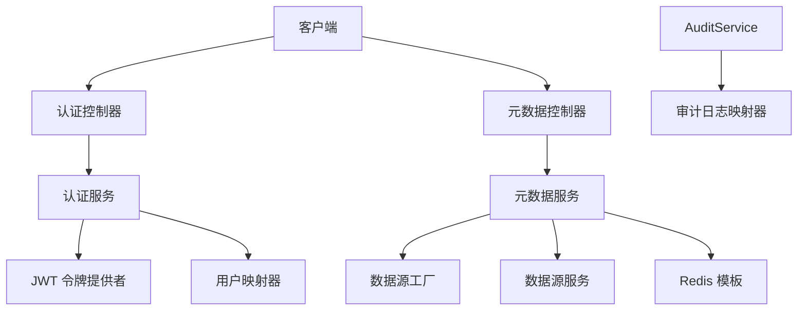
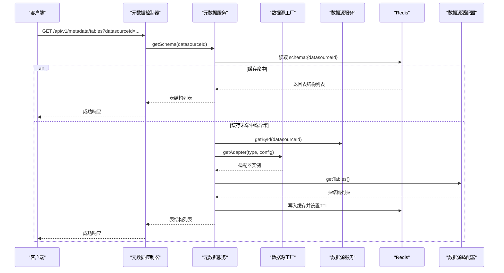
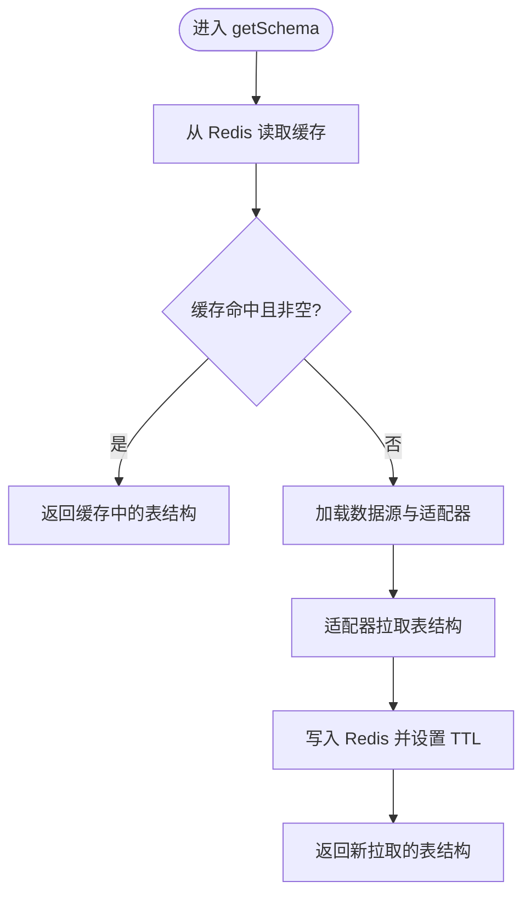
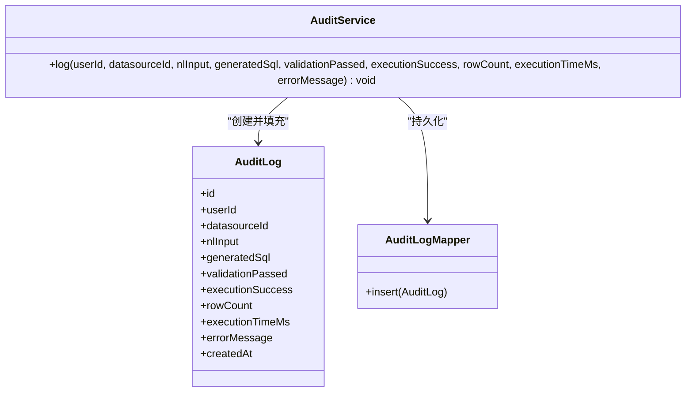
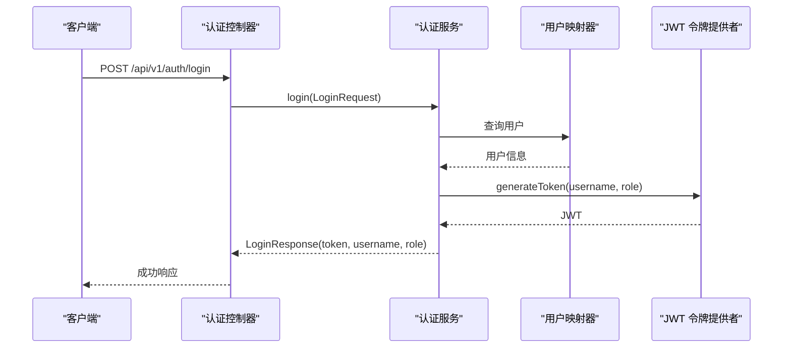
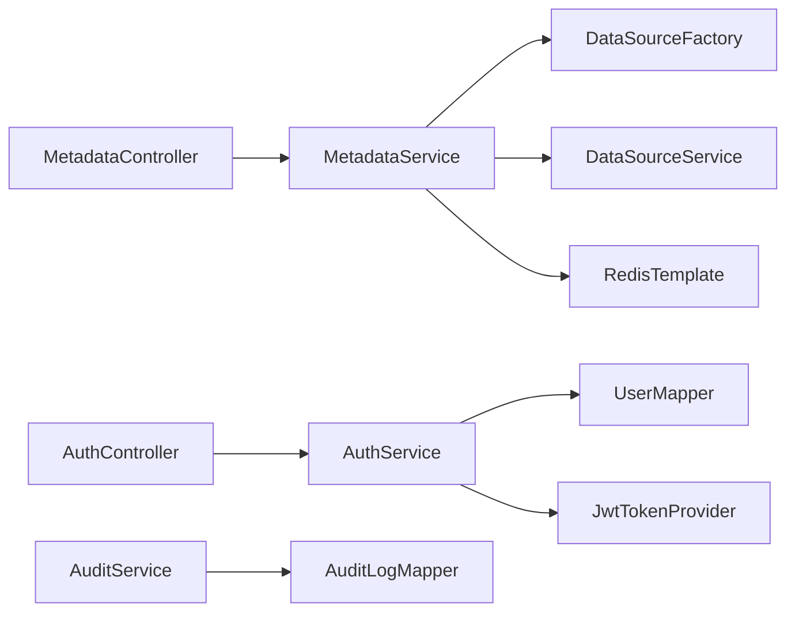

# 数据管理服务

<cite>
**本文引用的文件**   
- [MetadataService.java](file://backend/src/main/java/com/nlp2sql/service/MetadataService.java)
- [AuditService.java](file://backend/src/main/java/com/nlp2sql/service/AuditService.java)
- [AuthService.java](file://backend/src/main/java/com/nlp2sql/service/AuthService.java)
- [RedisConfig.java](file://backend/src/main/java/com/nlp2sql/config/RedisConfig.java)
- [JwtTokenProvider.java](file://backend/src/main/java/com/nlp2sql/security/JwtTokenProvider.java)
- [JwtAuthenticationFilter.java](file://backend/src/main/java/com/nlp2sql/security/JwtAuthenticationFilter.java)
- [MetadataController.java](file://backend/src/main/java/com/nlp2sql/controller/MetadataController.java)
- [AuthController.java](file://backend/src/main/java/com/nlp2sql/controller/AuthController.java)
- [AuditLogMapper.java](file://backend/src/main/java/com/nlp2sql/mapper/AuditLogMapper.java)
- [AuditLog.java](file://backend/src/main/java/com/nlp2sql/model/AuditLog.java)
- [application.yml](file://backend/src/main/resources/application.yml)
</cite>

## 目录
1. [引言](#引言)
2. [项目结构](#项目结构)
3. [核心组件](#核心组件)
4. [架构总览](#架构总览)
5. [详细组件分析](#详细组件分析)
6. [依赖关系分析](#依赖关系分析)
7. [性能与调优](#性能与调优)
8. [故障排查指南](#故障排查指南)
9. [结论](#结论)
10. [附录：API 接口说明](#附录api-接口说明)

## 引言
本文面向“数据管理服务”的读者，聚焦以下三个核心服务：
- MetadataService（元数据服务）：负责从数据源读取表结构与字段信息，并提供 Redis 缓存、缓存刷新等能力。
- AuditService（审计服务）：记录 NL2SQL 查询的关键审计日志，包括输入文本、生成 SQL、校验结果、执行状态、耗时与错误信息等。
- AuthService（认证服务）：实现用户注册、登录、密码加密、JWT 签发与解析，以及通过用户名解析内部用户 ID 的能力。

文档同时覆盖 Redis 集成、缓存策略、会话管理、API 接口、配置项、性能调优建议以及数据一致性与事务处理要点。

## 项目结构
后端采用 Spring Boot + MyBatis-Plus + Redis + JWT 的典型分层架构：
- Controller 层暴露 REST API；
- Service 层封装业务逻辑；
- Mapper 层对接数据库；
- Security 层提供 JWT 鉴权；
- Config 层集中配置 Redis、Jackson、MyBatis-Plus、JWT 等。

图示来源
- [AuthController.java:1-31](file://backend/src/main/java/com/nlp2sql/controller/AuthController.java#L1-L31)
- [MetadataController.java:1-38](file://backend/src/main/java/com/nlp2sql/controller/MetadataController.java#L1-L38)
- [AuthService.java:1-68](file://backend/src/main/java/com/nlp2sql/service/AuthService.java#L1-L68)
- [MetadataService.java:1-93](file://backend/src/main/java/com/nlp2sql/service/MetadataService.java#L1-L93)
- [JwtTokenProvider.java:1-55](file://backend/src/main/java/com/nlp2sql/security/JwtTokenProvider.java#L1-L55)
- [AuditService.java:1-31](file://backend/src/main/java/com/nlp2sql/service/AuditService.java#L1-L31)
- [AuditLogMapper.java:1-9](file://backend/src/main/java/com/nlp2sql/mapper/AuditLogMapper.java#L1-L9)

章节来源
- [AuthController.java:1-31](file://backend/src/main/java/com/nlp2sql/controller/AuthController.java#L1-L31)
- [MetadataController.java:1-38](file://backend/src/main/java/com/nlp2sql/controller/MetadataController.java#L1-L38)
- [application.yml:1-117](file://backend/src/main/resources/application.yml#L1-L117)

## 核心组件
- 元数据服务（MetadataService）
  - 职责：按数据源 ID 获取 Schema 列表、表名与列信息；基于 Redis 缓存 Schema；支持手动刷新缓存。
  - 关键特性：带 TTL 的 Redis 缓存、异常降级（缓存失败仍回退到直连数据源）、适配器模式调用数据源。
- 审计服务（AuditService）
  - 职责：持久化一次 NL2SQL 请求的全链路审计日志，包含输入、生成的 SQL、校验与执行结果、行数、耗时和错误信息。
- 认证服务（AuthService）
  - 职责：用户注册与登录、密码哈希存储、JWT 签发与验证、用户名到用户 ID 的内部解析。
- Redis 配置（RedisConfig）
  - 职责：定义 RedisTemplate 序列化策略，键为字符串，值为 JSON。
- JWT 相关
  - JwtTokenProvider：签发、解析、校验 JWT。
  - JwtAuthenticationFilter：从 Authorization 头提取 Token，构建安全上下文。

章节来源
- [MetadataService.java:1-93](file://backend/src/main/java/com/nlp2sql/service/MetadataService.java#L1-L93)
- [AuditService.java:1-31](file://backend/src/main/java/com/nlp2sql/service/AuditService.java#L1-L31)
- [AuthService.java:1-68](file://backend/src/main/java/com/nlp2sql/service/AuthService.java#L1-L68)
- [RedisConfig.java:1-24](file://backend/src/main/java/com/nlp2sql/config/RedisConfig.java#L1-L24)
- [JwtTokenProvider.java:1-55](file://backend/src/main/java/com/nlp2sql/security/JwtTokenProvider.java#L1-L55)
- [JwtAuthenticationFilter.java:1-51](file://backend/src/main/java/com/nlp2sql/security/JwtAuthenticationFilter.java#L1-L51)

## 架构总览
下图展示了一次元数据查询在缓存命中与未命中两种路径下的完整流程，以及与数据源适配器和 Redis 的交互。

图示来源
- [MetadataController.java:18-37](file://backend/src/main/java/com/nlp2sql/controller/MetadataController.java#L18-L37)
- [MetadataService.java:28-74](file://backend/src/main/java/com/nlp2sql/service/MetadataService.java#L28-L74)
- [RedisConfig.java:12-23](file://backend/src/main/java/com/nlp2sql/config/RedisConfig.java#L12-L23)

## 详细组件分析

### 元数据服务（MetadataService）
- 缓存策略
  - 缓存键：以固定前缀加数据源 ID 组成，如 “schema:{datasourceId}”。
  - 缓存值：表结构对象列表。
  - 过期时间：由配置项 schema-cache.ttl-seconds 控制，默认 3600 秒。
  - 读路径：优先从 Redis 读取；若类型不匹配或为空则继续走数据源；Redis 异常时仅记录警告并降级。
  - 写路径：在成功拉取 Schema 后写入 Redis；写入失败仅记录警告，不影响主流程。
  - 刷新策略：refreshCache 删除对应缓存键、移除适配器实例，再重新拉取并写入缓存。
- 数据结构与复杂度
  - getSchema：主要开销在数据源适配器扫描表结构，时间复杂度近似 O(T+C)，其中 T 为表数量，C 为列总数；Redis 操作为 O(1)。
  - getTables：对表列表做投影转换，O(T)。
  - getColumns：先查 Schema 再过滤匹配表名，O(T)，通常表量较小。
- 异常处理
  - Redis 读写异常均捕获并记录警告，保证服务可用性。
  - 未命中缓存时，依赖下游数据源适配器与数据源服务。

图示来源
- [MetadataService.java:28-74](file://backend/src/main/java/com/nlp2sql/service/MetadataService.java#L28-L74)

章节来源
- [MetadataService.java:1-93](file://backend/src/main/java/com/nlp2sql/service/MetadataService.java#L1-L93)

### 审计服务（AuditService）
- 日志记录机制
  - 接收参数：用户 ID、数据源 ID、自然语言输入、生成 SQL、校验是否通过、执行是否成功、影响行数、执行耗时、错误信息。
  - 将参数封装为审计实体后通过 MyBatis-Plus 插入数据库表 audit_logs。
  - 审计实体包含创建时间，由框架自动填充。
- 性能监控
  - 通过 executionTimeMs 字段记录单次执行耗时，便于后续统计与告警。
  - 可结合日志级别与 traceId 进行问题追踪。
- 数据一致性
  - 当前实现为简单 insert；若需要强一致，可在调用方使用事务包裹业务方法与审计写入。

图示来源
- [AuditService.java:10-30](file://backend/src/main/java/com/nlp2sql/service/AuditService.java#L10-L30)
- [AuditLog.java:1-34](file://backend/src/main/java/com/nlp2sql/model/AuditLog.java#L1-L34)
- [AuditLogMapper.java:1-9](file://backend/src/main/java/com/nlp2sql/mapper/AuditLogMapper.java#L1-L9)

章节来源
- [AuditService.java:1-31](file://backend/src/main/java/com/nlp2sql/service/AuditService.java#L1-L31)
- [AuditLog.java:1-34](file://backend/src/main/java/com/nlp2sql/model/AuditLog.java#L1-L34)
- [AuditLogMapper.java:1-9](file://backend/src/main/java/com/nlp2sql/mapper/AuditLogMapper.java#L1-L9)

### 认证服务（AuthService）与会话管理
- 用户管理
  - 注册：检查用户名唯一性，密码经 PasswordEncoder 加密后落库，默认角色为 USER。
  - 登录：根据用户名查询用户，校验密码，成功后签发 JWT，返回 token、用户名与角色。
  - 内部解析：提供 resolveUserId，供审计等内部场景把用户名转为用户 ID。
- 权限控制
  - 当前角色模型为简单字符串角色；鉴权过滤器统一赋予 ROLE_USER 权限，具体资源级授权可在后续扩展。
- 会话管理
  - 采用无状态的 JWT；服务端不保存会话状态，依赖客户端携带 Authorization: Bearer <token>。
  - Token 有效期由 jwt.expiration 控制，默认 24 小时。
  - 签名密钥由 jwt.secret 配置，使用 HMAC-SHA256。

图示来源
- [AuthController.java:17-30](file://backend/src/main/java/com/nlp2sql/controller/AuthController.java#L17-L30)
- [AuthService.java:33-55](file://backend/src/main/java/com/nlp2sql/service/AuthService.java#L33-L55)
- [JwtTokenProvider.java:21-40](file://backend/src/main/java/com/nlp2sql/security/JwtTokenProvider.java#L21-L40)

章节来源
- [AuthService.java:1-68](file://backend/src/main/java/com/nlp2sql/service/AuthService.java#L1-L68)
- [JwtTokenProvider.java:1-55](file://backend/src/main/java/com/nlp2sql/security/JwtTokenProvider.java#L1-L55)
- [JwtAuthenticationFilter.java:1-51](file://backend/src/main/java/com/nlp2sql/security/JwtAuthenticationFilter.java#L1-L51)

## 依赖关系分析
- 模块内耦合
  - MetadataController 依赖 MetadataService，职责单一、低耦合。
  - MetadataService 依赖 DataSourceService、DataSourceFactory、RedisTemplate，关注点集中在缓存与适配。
  - AuthService 依赖 UserMapper、PasswordEncoder、JwtTokenProvider，职责清晰。
  - AuditService 依赖 AuditLogMapper，轻量、易扩展。
- 外部依赖
  - Redis：用于 Schema 缓存。
  - MySQL：用于用户、数据源、审计日志等持久化。
  - MyBatis-Plus：简化数据访问。
  - JWT：无状态鉴权。

图示来源
- [MetadataController.java:1-38](file://backend/src/main/java/com/nlp2sql/controller/MetadataController.java#L1-L38)
- [MetadataService.java:1-93](file://backend/src/main/java/com/nlp2sql/service/MetadataService.java#L1-L93)
- [AuthController.java:1-31](file://backend/src/main/java/com/nlp2sql/controller/AuthController.java#L1-L31)
- [AuthService.java:1-68](file://backend/src/main/java/com/nlp2sql/service/AuthService.java#L1-L68)
- [AuditService.java:1-31](file://backend/src/main/java/com/nlp2sql/service/AuditService.java#L1-L31)

## 性能与调优
- Redis 连接池
  - Lettuce 连接池最大活跃数、空闲数、等待超时已在 application.yml 中配置，可按 QPS 调整 max-active 与 min-idle。
- 缓存 TTL
  - schema-cache.ttl-seconds 控制缓存过期时间，建议依据数据源变更频率设置；若频繁变更可降低 TTL，稳定环境可延长。
- 序列化
  - Redis 使用 String 键与 Jackson JSON 值，避免自定义序列化带来的兼容性问题；如需更高吞吐可评估 Kryo/Hessian，但需权衡兼容性。
- 数据库连接池
  - Hikari maximum-pool-size、minimum-idle、connection-timeout 已配置，可根据并发与慢查询情况微调。
- 日志与可观测性
  - 开启 com.nlp2sql 包的 DEBUG 日志便于定位缓存与适配器行为；生产建议调整为 INFO，结合 traceId 追踪请求。
- 鉴权开销
  - JWT 校验为 CPU 密集型但开销较低；高并发场景可考虑本地缓存公钥或使用更高效的签名算法。

[本节为通用指导，不直接分析具体文件]

## 故障排查指南
- Redis 不可用或网络抖动
  - 现象：缓存读取/写入失败日志；元数据仍可正常返回（降级）。
  - 排查：检查 Redis 主机、端口、密码与数据库号；查看连接池参数；确认防火墙与安全组。
  - 参考：[RedisConfig.java:12-23](file://backend/src/main/java/com/nlp2sql/config/RedisConfig.java#L12-L23)、[application.yml:12-26](file://backend/src/main/resources/application.yml#L12-L26)
- 元数据缓存不一致
  - 现象：修改数据源结构后前端仍显示旧结构。
  - 处理：调用刷新接口删除缓存并重建；确认 TTL 设置合理。
  - 参考：[MetadataController.java:31-37](file://backend/src/main/java/com/nlp2sql/controller/MetadataController.java#L31-L37)、[MetadataService.java:76-82](file://backend/src/main/java/com/nlp2sql/service/MetadataService.java#L76-L82)
- 登录失败或用户名冲突
  - 现象：注册时报用户名已存在；登录报用户名或密码错误。
  - 处理：检查 UserMapper 查询与 PasswordEncoder 配置；确认数据库中用户状态。
  - 参考：[AuthService.java:28-55](file://backend/src/main/java/com/nlp2sql/service/AuthService.java#L28-L55)
- JWT 无效或过期
  - 现象：受保护接口返回未授权或鉴权失败。
  - 处理：确认 Authorization 头格式正确；检查 secret 与 expiration 配置；必要时重新登录。
  - 参考：[JwtAuthenticationFilter.java:23-45](file://backend/src/main/java/com/nlp2sql/security/JwtAuthenticationFilter.java#L23-L45)、[application.yml:89-93](file://backend/src/main/resources/application.yml#L89-L93)

章节来源
- [MetadataService.java:28-82](file://backend/src/main/java/com/nlp2sql/service/MetadataService.java#L28-L82)
- [AuthService.java:28-55](file://backend/src/main/java/com/nlp2sql/service/AuthService.java#L28-L55)
- [JwtAuthenticationFilter.java:23-45](file://backend/src/main/java/com/nlp2sql/security/JwtAuthenticationFilter.java#L23-L45)
- [application.yml:12-26](file://backend/src/main/resources/application.yml#L12-L26)
- [application.yml:89-93](file://backend/src/main/resources/application.yml#L89-L93)

## 结论
- MetadataService 通过 Redis 缓存显著降低重复 Schema 扫描成本，并在异常时具备良好降级能力。
- AuditService 提供了轻量而完整的审计记录能力，便于问题回溯与性能分析。
- AuthService 实现了基础的注册、登录与 JWT 无状态会话管理，满足大多数中小型系统的安全需求。
- 在生产环境中，建议根据业务特征调优 Redis 连接池、缓存 TTL 与数据库连接池，并结合日志与监控完善可观测性。

[本节为总结性内容，不直接分析具体文件]

## 附录：API 接口说明

- 认证接口
  - 注册
    - 方法：POST
    - 路径：/api/v1/auth/register
    - 请求体：LoginRequest（用户名、密码）
    - 响应：ApiResponse<String>
    - 说明：用户名已存在将抛出业务异常。
    - 参考：[AuthController.java:20-24](file://backend/src/main/java/com/nlp2sql/controller/AuthController.java#L20-L24)、[AuthService.java:28-41](file://backend/src/main/java/com/nlp2sql/service/AuthService.java#L28-L41)
  - 登录
    - 方法：POST
    - 路径：/api/v1/auth/login
    - 请求体：LoginRequest
    - 响应：ApiResponse<LoginResponse>
    - 说明：成功返回 JWT、用户名与角色。
    - 参考：[AuthController.java:26-30](file://backend/src/main/java/com/nlp2sql/controller/AuthController.java#L26-L30)、[AuthService.java:43-55](file://backend/src/main/java/com/nlp2sql/service/AuthService.java#L43-L55)

- 元数据接口
  - 获取表列表
    - 方法：GET
    - 路径：/api/v1/metadata/tables
    - 查询参数：datasourceId（必填）
    - 响应：ApiResponse<List<TableInfo>>
    - 说明：优先返回缓存，否则拉取数据源并写入缓存。
    - 参考：[MetadataController.java:21-25](file://backend/src/main/java/com/nlp2sql/controller/MetadataController.java#L21-L25)、[MetadataService.java:28-74](file://backend/src/main/java/com/nlp2sql/service/MetadataService.java#L28-L74)
  - 获取表字段
    - 方法：GET
    - 路径：/api/v1/metadata/tables/{tableName}/columns
    - 路径参数：tableName
    - 查询参数：datasourceId（必填）
    - 响应：ApiResponse<List<ColumnInfo>>
    - 说明：从缓存或数据源获取指定表的列信息。
    - 参考：[MetadataController.java:27-30](file://backend/src/main/java/com/nlp2sql/controller/MetadataController.java#L27-L30)、[MetadataService.java:84-93](file://backend/src/main/java/com/nlp2sql/service/MetadataService.java#L84-L93)
  - 刷新缓存
    - 方法：POST
    - 路径：/api/v1/metadata/refresh
    - 查询参数：datasourceId（必填）
    - 响应：ApiResponse<Void>
    - 说明：删除缓存并重建，适合数据源结构变更后主动刷新。
    - 参考：[MetadataController.java:32-37](file://backend/src/main/java/com/nlp2sql/controller/MetadataController.java#L32-L37)、[MetadataService.java:76-82](file://backend/src/main/java/com/nlp2sql/service/MetadataService.java#L76-L82)

- 审计记录
  - 说明：审计记录通常在业务服务内部调用 AuditService.log，不直接对外暴露接口。
  - 参考：[AuditService.java:16-30](file://backend/src/main/java/com/nlp2sql/service/AuditService.java#L16-L30)

章节来源
- [AuthController.java:17-30](file://backend/src/main/java/com/nlp2sql/controller/AuthController.java#L17-L30)
- [MetadataController.java:18-37](file://backend/src/main/java/com/nlp2sql/controller/MetadataController.java#L18-L37)
- [AuditService.java:16-30](file://backend/src/main/java/com/nlp2sql/service/AuditService.java#L16-L30)