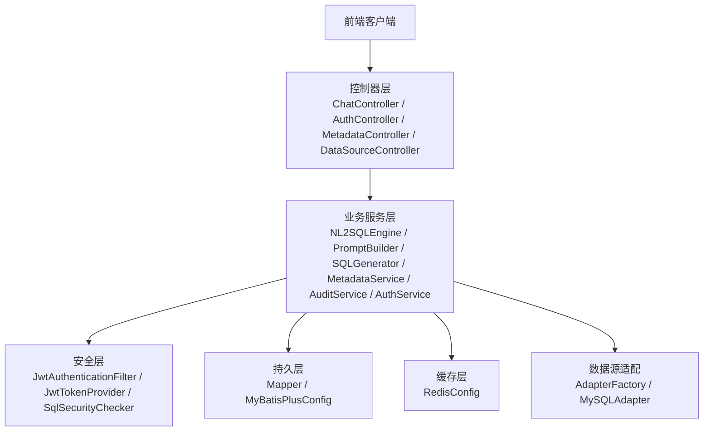
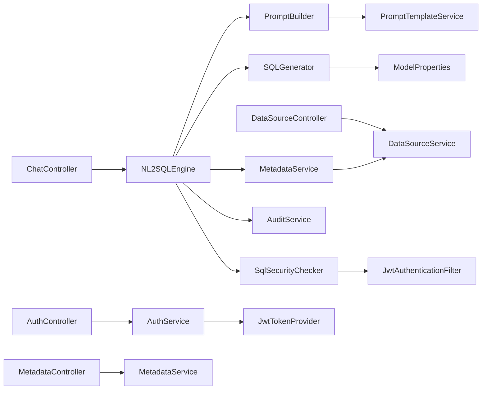
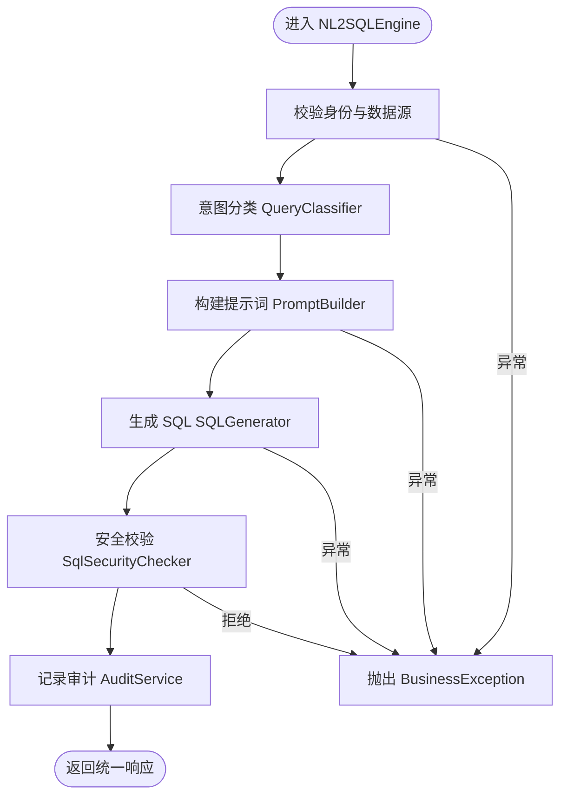
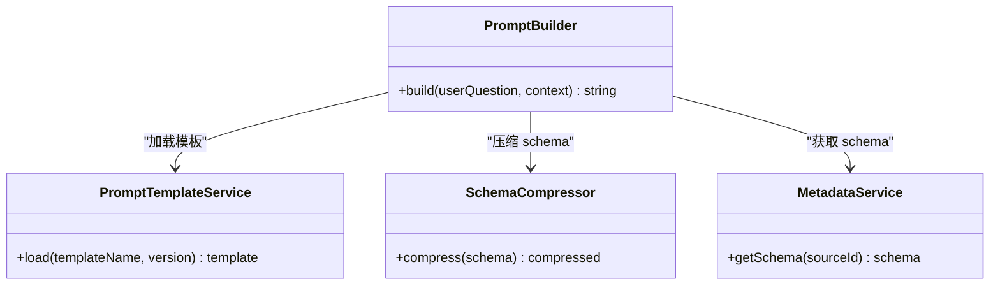
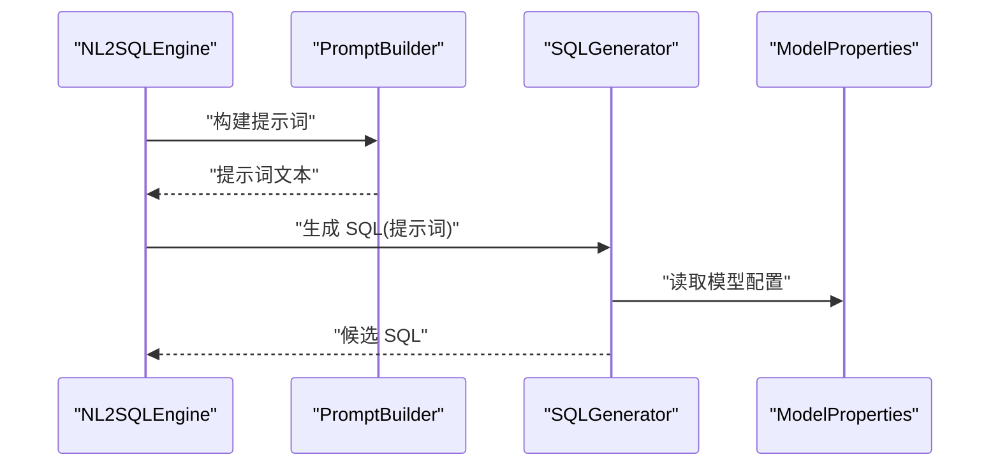
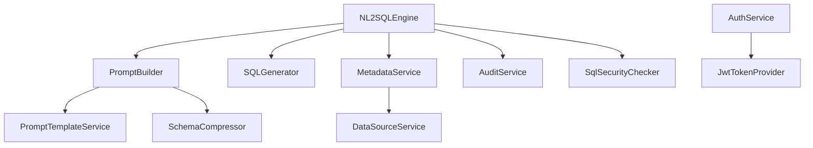
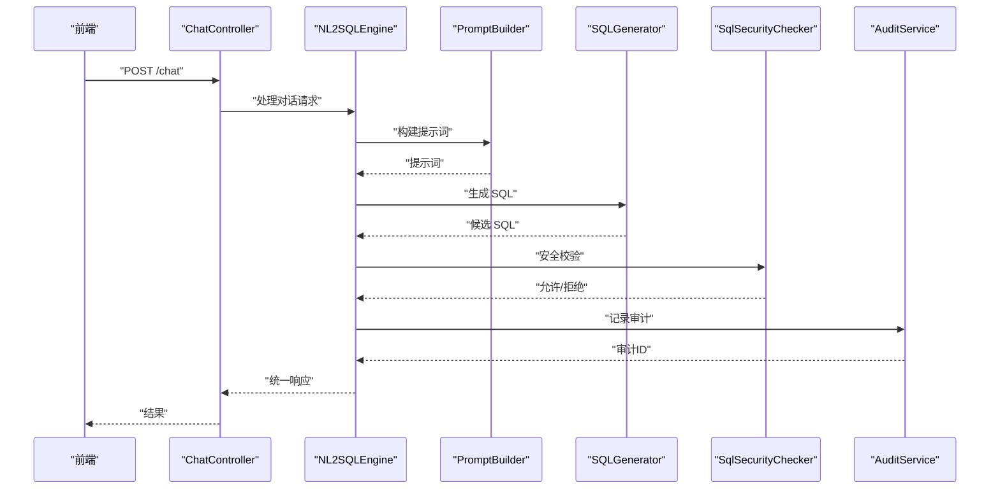
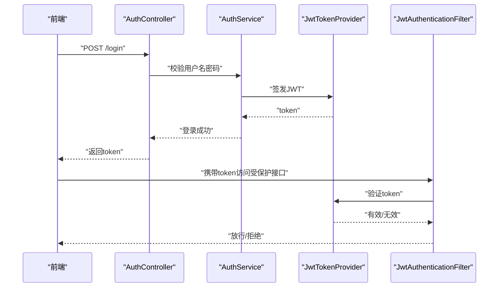

# 服务组件

<cite>
**本文引用的文件**   
- [NL2SQLEngine.java](file://backend/backend/src/main/java/com/nlp2sql/service/NL2SQLEngine.java)
- [PromptBuilder.java](file://backend/backend/src/main/java/com/nlp2sql/service/PromptBuilder.java)
- [SQLGenerator.java](file://backend/backend/src/main/java/com/nlp2sql/service/SQLGenerator.java)
- [MetadataService.java](file://backend/backend/src/main/java/com/nlp2sql/service/MetadataService.java)
- [AuditService.java](file://backend/backend/src/main/java/com/nlp2sql/service/AuditService.java)
- [AuthService.java](file://backend/backend/src/main/java/com/nlp2sql/service/AuthService.java)
- [DataSourceService.java](file://backend/backend/src/main/java/com/nlp2sql/service/DataSourceService.java)
- [PromptTemplateService.java](file://backend/backend/src/main/java/com/nlp2sql/service/PromptTemplateService.java)
- [QueryClassifier.java](file://backend/backend/src/main/java/com/nlp2sql/service/QueryClassifier.java)
- [SchemaCompressor.java](file://backend/backend/src/main/java/com/nlp2sql/service/SchemaCompressor.java)
- [ChatController.java](file://backend/backend/src/main/java/com/nlp2sql/controller/ChatController.java)
- [AuthController.java](file://backend/backend/src/main/java/com/nlp2sql/controller/AuthController.java)
- [MetadataController.java](file://backend/backend/src/main/java/com/nlp2sql/controller/MetadataController.java)
- [DataSourceController.java](file://backend/backend/src/main/java/com/nlp2sql/controller/DataSourceController.java)
- [GlobalExceptionHandler.java](file://backend/backend/src/main/java/com/nlp2sql/config/GlobalExceptionHandler.java)
- [SecurityConfig.java](file://backend/backend/src/main/java/com/nlp2sql/config/SecurityConfig.java)
- [JwtAuthenticationFilter.java](file://backend/backend/src/main/java/com/nlp2sql/security/JwtAuthenticationFilter.java)
- [JwtTokenProvider.java](file://backend/backend/src/main/java/com/nlp2sql/security/JwtTokenProvider.java)
- [SqlSecurityChecker.java](file://backend/backend/src/main/java/com/nlp2sql/security/SqlSecurityChecker.java)
- [BusinessException.java](file://backend/backend/src/main/java/com/nlp2sql/common/BusinessException.java)
- [ErrorCode.java](file://backend/backend/src/main/java/com/nlp2sql/common/ErrorCode.java)
- [TraceIdFilter.java](file://backend/backend/src/main/java/com/nlp2sql/common/TraceIdFilter.java)
- [MyBatisPlusConfig.java](file://backend/backend/src/main/java/com/nlp2sql/config/MyBatisPlusConfig.java)
- [RedisConfig.java](file://backend/backend/src/main/java/com/nlp2sql/config/RedisConfig.java)
- [ModelProperties.java](file://backend/backend/src/main/java/com/nlp2sql/config/ModelProperties.java)
- [Nlp2SqlApplication.java](file://backend/backend/src/main/java/com/nlp2sql/Nlp2SqlApplication.java)
</cite>

## 目录
1. [简介](#简介)
2. [项目结构](#项目结构)
3. [核心服务组件](#核心服务组件)
4. [架构总览](#架构总览)
5. [详细组件分析](#详细组件分析)
6. [依赖关系分析](#依赖关系分析)
7. [性能与可扩展性](#性能与可扩展性)
8. [故障排查指南](#故障排查指南)
9. [结论](#结论)
10. [附录：典型业务流程时序图](#附录典型业务流程时序图)

## 简介
本文聚焦后端业务逻辑层的服务组件，围绕自然语言到 SQL（NL2SQL）的核心流程展开。重点说明以下服务的职责、协作关系与异常处理机制：
- NL2SQLEngine：NL2SQL 引擎，负责编排“理解用户意图—构建提示词—生成并校验 SQL—执行与审计”的端到端流程。
- PromptBuilder：提示词构建器，组合系统指令、元数据摘要与用户问题，生成大模型输入。
- SQLGenerator：SQL 生成器，封装与大模型的交互或规则化生成能力，输出候选 SQL。
- MetadataService：元数据服务，提供数据库表、列等元数据的读取与压缩能力。
- AuditService：审计服务，记录查询来源、SQL、结果统计与耗时等审计日志。
- AuthService：认证服务，负责用户登录、令牌签发与鉴权上下文管理。

此外，文档还给出服务间调用时序、事务边界建议、错误码与异常策略、以及可观测性与性能优化要点。

## 项目结构
后端采用 Spring Boot 分层架构，关键目录与职责如下：
- controller：HTTP 接口入口，接收请求、绑定参数、返回统一响应。
- service：业务编排与服务实现，是本文的重点。
- security：安全相关组件，包括 JWT 过滤器、令牌提供者与 SQL 安全检查。
- config：配置类，包含安全、缓存、ORM、模型等配置。
- common：通用异常、错误码、链路追踪过滤器。
- model：领域对象、DTO、VO。
- adapter：数据源适配器工厂与实现。
- mapper：持久层映射接口。

**图示来源**
- [ChatController.java](file://backend/backend/src/main/java/com/nlp2sql/controller/ChatController.java)
- [AuthService.java](file://backend/backend/src/main/java/com/nlp2sql/service/AuthService.java)
- [NL2SQLEngine.java](file://backend/backend/src/main/java/com/nlp2sql/service/NL2SQLEngine.java)
- [JwtAuthenticationFilter.java](file://backend/backend/src/main/java/com/nlp2sql/security/JwtAuthenticationFilter.java)
- [MyBatisPlusConfig.java](file://backend/backend/src/main/java/com/nlp2sql/config/MyBatisPlusConfig.java)
- [RedisConfig.java](file://backend/backend/src/main/java/com/nlp2sql/config/RedisConfig.java)

**章节来源**
- [Nlp2SqlApplication.java](file://backend/backend/src/main/java/com/nlp2sql/Nlp2SqlApplication.java)

## 核心服务组件
本节对六个核心服务进行职责划分与接口契约说明。为避免代码泄露，不直接粘贴源码，而是以“方法签名 + 行为说明 + 依赖”的方式描述。

### NL2SQLEngine（NL2SQL 引擎）
- 职责
  - 编排完整 NL2SQL 流程：解析 ChatRequest、校验权限、调用 PromptBuilder 构建提示词、调用 SQLGenerator 生成 SQL、调用 MetadataService 获取必要上下文、通过 SqlSecurityChecker 做安全校验、触发 AuditService 审计记录，最终返回结构化结果。
  - 协调 QueryClassifier 与 SchemaCompressor，用于意图分类与元数据压缩，减少提示词体积。
  - 在适当位置加入异常捕获与转换，将底层异常转换为统一的 BusinessException 与 ErrorCode。
- 主要输入/输出
  - 输入：聊天请求（包含用户问题、会话上下文、目标数据源标识）。
  - 输出：统一响应体，包含 SQL、执行结果摘要、审计 ID 等。
- 关键依赖
  - PromptBuilder、SQLGenerator、MetadataService、AuditService、QueryClassifier、SchemaCompressor、SqlSecurityChecker、AuthService。

**章节来源**
- [NL2SQLEngine.java](file://backend/backend/src/main/java/com/nlp2sql/service/NL2SQLEngine.java)

### PromptBuilder（提示词构建器）
- 职责
  - 根据系统提示模板、用户问题、目标数据源与元数据摘要，拼装成 LLM 可用的提示词。
  - 支持 PromptTemplateService 加载外部 YAML 模板；使用 SchemaCompressor 压缩 schema 摘要，控制 Token 用量。
- 关键依赖
  - PromptTemplateService、SchemaCompressor、MetadataService。

**章节来源**
- [PromptBuilder.java](file://backend/backend/src/main/java/com/nlp2sql/service/PromptBuilder.java)
- [PromptTemplateService.java](file://backend/backend/src/main/java/com/nlp2sql/service/PromptTemplateService.java)
- [SchemaCompressor.java](file://backend/backend/src/main/java/com/nlp2sql/service/SchemaCompressor.java)

### SQLGenerator（SQL 生成器）
- 职责
  - 基于提示词调用大模型或规则引擎，生成候选 SQL。
  - 提供重试、超时与降级策略；将生成结果标准化为内部 SQL 对象。
- 关键依赖
  - ModelProperties（模型配置）、PromptBuilder（可选，若由自身拼接提示词）。

**章节来源**
- [SQLGenerator.java](file://backend/backend/src/main/java/com/nlp2sql/service/SQLGenerator.java)
- [ModelProperties.java](file://backend/backend/src/main/java/com/nlp2sql/config/ModelProperties.java)

### MetadataService（元数据服务）
- 职责
  - 从已注册的数据源中拉取表、列等元数据，供 PromptBuilder 和 SQL 生成阶段使用。
  - 与 DataSourceService 配合，按数据源标识选择合适适配器。
- 关键依赖
  - DataSourceService、adapter 包（如 MySQLAdapter）。

**章节来源**
- [MetadataService.java](file://backend/backend/src/main/java/com/nlp2sql/service/MetadataService.java)
- [DataSourceService.java](file://backend/backend/src/main/java/com/nlp2sql/service/DataSourceService.java)

### AuditService（审计服务）
- 职责
  - 记录每次查询的关键信息：用户、数据源、原始问题、生成的 SQL、是否命中缓存、执行耗时、结果行数等。
  - 通过 Mapper 写入审计日志表，便于事后分析与合规审计。
- 关键依赖
  - AuditLogMapper、TraceIdFilter（链路追踪 ID）。

**章节来源**
- [AuditService.java](file://backend/backend/src/main/java/com/nlp2sql/service/AuditService.java)
- [AuditLogMapper.java](file://backend/backend/src/main/java/com/nlp2sql/mapper/AuditLogMapper.java)
- [TraceIdFilter.java](file://backend/backend/src/main/java/com/nlp2sql/common/TraceIdFilter.java)

### AuthService（认证服务）
- 职责
  - 提供登录、登出、令牌签发与校验能力；维护当前登录用户上下文。
  - 与安全过滤器联动，完成请求级鉴权。
- 关键依赖
  - JwtTokenProvider、UserMapper、SecurityConfig。

**章节来源**
- [AuthService.java](file://backend/backend/src/main/java/com/nlp2sql/service/AuthService.java)
- [JwtTokenProvider.java](file://backend/backend/src/main/java/com/nlp2sql/security/JwtTokenProvider.java)
- [SecurityConfig.java](file://backend/backend/src/main/java/com/nlp2sql/config/SecurityConfig.java)

## 架构总览
下图展示控制器到服务、再到安全与持久层的整体调用路径。

**图示来源**
- [ChatController.java](file://backend/backend/src/main/java/com/nlp2sql/controller/ChatController.java)
- [AuthController.java](file://backend/backend/src/main/java/com/nlp2sql/controller/AuthController.java)
- [MetadataController.java](file://backend/backend/src/main/java/com/nlp2sql/controller/MetadataController.java)
- [DataSourceController.java](file://backend/backend/src/main/java/com/nlp2sql/controller/DataSourceController.java)
- [NL2SQLEngine.java](file://backend/backend/src/main/java/com/nlp2sql/service/NL2SQLEngine.java)
- [PromptBuilder.java](file://backend/backend/src/main/java/com/nlp2sql/service/PromptBuilder.java)
- [SQLGenerator.java](file://backend/backend/src/main/java/com/nlp2sql/service/SQLGenerator.java)
- [MetadataService.java](file://backend/backend/src/main/java/com/nlp2sql/service/MetadataService.java)
- [AuditService.java](file://backend/backend/src/main/java/com/nlp2sql/service/AuditService.java)
- [SqlSecurityChecker.java](file://backend/backend/src/main/java/com/nlp2sql/security/SqlSecurityChecker.java)
- [JwtAuthenticationFilter.java](file://backend/backend/src/main/java/com/nlp2sql/security/JwtAuthenticationFilter.java)
- [JwtTokenProvider.java](file://backend/backend/src/main/java/com/nlp2sql/security/JwtTokenProvider.java)
- [ModelProperties.java](file://backend/backend/src/main/java/com/nlp2sql/config/ModelProperties.java)
- [PromptTemplateService.java](file://backend/backend/src/main/java/com/nlp2sql/service/PromptTemplateService.java)

## 详细组件分析

### NL2SQLEngine：流程编排与异常边界
- 流程要点
  - 前置校验：检查用户身份与权限、目标数据源可用性。
  - 意图识别：委托 QueryClassifier 判断是否为纯查询、DDL/DML、工具调用等分支。
  - 提示词构建：通过 PromptBuilder 组装系统提示、schema 摘要与用户问题。
  - SQL 生成：调用 SQLGenerator 生成候选 SQL，并进行格式化与规范化。
  - 安全校验：通过 SqlSecurityChecker 过滤危险语句与高风险操作。
  - 审计记录：将问题、SQL、耗时、结果规模等信息写入审计日志。
  - 结果返回：封装统一 ApiResponse，包含 SQL、结果摘要、审计 ID。
- 异常处理
  - 捕获业务异常并转换为 BusinessException，附带 ErrorCode。
  - 对网络、IO、序列化等异常进行兜底保护，保证服务稳定性。
- 事务管理建议
  - 仅对需要原子性的写操作（如审计落库）开启事务；读多写少场景下避免长事务。
  - 将大模型调用、远程 IO 等耗时操作置于事务外，缩短事务持有时间。

**图示来源**
- [NL2SQLEngine.java](file://backend/backend/src/main/java/com/nlp2sql/service/NL2SQLEngine.java)
- [QueryClassifier.java](file://backend/backend/src/main/java/com/nlp2sql/service/QueryClassifier.java)
- [PromptBuilder.java](file://backend/backend/src/main/java/com/nlp2sql/service/PromptBuilder.java)
- [SQLGenerator.java](file://backend/backend/src/main/java/com/nlp2sql/service/SQLGenerator.java)
- [SqlSecurityChecker.java](file://backend/backend/src/main/java/com/nlp2sql/security/SqlSecurityChecker.java)
- [AuditService.java](file://backend/backend/src/main/java/com/nlp2sql/service/AuditService.java)
- [BusinessException.java](file://backend/backend/src/main/java/com/nlp2sql/common/BusinessException.java)

**章节来源**
- [NL2SQLEngine.java](file://backend/backend/src/main/java/com/nlp2sql/service/NL2SQLEngine.java)
- [QueryClassifier.java](file://backend/backend/src/main/java/com/nlp2sql/service/QueryClassifier.java)
- [BusinessException.java](file://backend/backend/src/main/java/com/nlp2sql/common/BusinessException.java)

### PromptBuilder：提示词装配与模板化
- 设计要点
  - 模板驱动：通过 PromptTemplateService 加载 YAML 模板，确保提示词版本化与可配置。
  - 上下文增强：注入系统角色、安全约束、数据源方言、schema 摘要等。
  - 压缩优化：借助 SchemaCompressor 裁剪冗余字段，降低 Token 成本。
- 扩展点
  - 新增提示词版本：在模板服务中增加新模板，并通过版本号或特征开关切换。
  - 动态上下文：可按租户、部门、用户角色注入差异化约束。

**图示来源**
- [PromptBuilder.java](file://backend/backend/src/main/java/com/nlp2sql/service/PromptBuilder.java)
- [PromptTemplateService.java](file://backend/backend/src/main/java/com/nlp2sql/service/PromptTemplateService.java)
- [SchemaCompressor.java](file://backend/backend/src/main/java/com/nlp2sql/service/SchemaCompressor.java)
- [MetadataService.java](file://backend/backend/src/main/java/com/nlp2sql/service/MetadataService.java)

**章节来源**
- [PromptBuilder.java](file://backend/backend/src/main/java/com/nlp2sql/service/PromptBuilder.java)
- [PromptTemplateService.java](file://backend/backend/src/main/java/com/nlp2sql/service/PromptTemplateService.java)
- [SchemaCompressor.java](file://backend/backend/src/main/java/com/nlp2sql/service/SchemaCompressor.java)

### SQLGenerator：SQL 生成与健壮性
- 功能要点
  - 基于提示词调用大模型，产出候选 SQL。
  - 提供重试、熔断、超时与降级策略，提升可用性。
  - 输出标准化 SQL 对象，便于后续安全校验与审计。
- 配置项
  - 模型地址、温度、最大长度、重试次数等通过 ModelProperties 集中管理。

**图示来源**
- [NL2SQLEngine.java](file://backend/backend/src/main/java/com/nlp2sql/service/NL2SQLEngine.java)
- [PromptBuilder.java](file://backend/backend/src/main/java/com/nlp2sql/service/PromptBuilder.java)
- [SQLGenerator.java](file://backend/backend/src/main/java/com/nlp2sql/service/SQLGenerator.java)
- [ModelProperties.java](file://backend/backend/src/main/java/com/nlp2sql/config/ModelProperties.java)

**章节来源**
- [SQLGenerator.java](file://backend/backend/src/main/java/com/nlp2sql/service/SQLGenerator.java)
- [ModelProperties.java](file://backend/backend/src/main/java/com/nlp2sql/config/ModelProperties.java)

### MetadataService：元数据访问与适配
- 功能要点
  - 依据数据源标识，从 DataSourceService 选择合适的适配器，读取表、列等元数据。
  - 与 SchemaCompressor 协同，返回精简版 schema，用于提示词构造。
- 异常处理
  - 连接失败、权限不足时抛出明确错误码，便于上层快速定位。

**章节来源**
- [MetadataService.java](file://backend/backend/src/main/java/com/nlp2sql/service/MetadataService.java)
- [DataSourceService.java](file://backend/backend/src/main/java/com/nlp2sql/service/DataSourceService.java)

### AuditService：审计日志与可观测性
- 功能要点
  - 记录请求链路 ID、用户、数据源、问题、SQL、耗时、结果规模等。
  - 与 TraceIdFilter 配合，贯穿全链路追踪。
- 存储
  - 通过 AuditLogMapper 持久化审计记录。

**章节来源**
- [AuditService.java](file://backend/backend/src/main/java/com/nlp2sql/service/AuditService.java)
- [AuditLogMapper.java](file://backend/backend/src/main/java/com/nlp2sql/mapper/AuditLogMapper.java)
- [TraceIdFilter.java](file://backend/backend/src/main/java/com/nlp2sql/common/TraceIdFilter.java)

### AuthService：认证与授权
- 功能要点
  - 登录成功后签发 JWT；过滤器层校验令牌有效性；维护当前用户上下文。
  - 与 SecurityConfig 共同定义受保护接口与放行路径。
- 集成点
  - JwtTokenProvider 负责令牌创建与解析；JwtAuthenticationFilter 在请求链路上进行校验。

**章节来源**
- [AuthService.java](file://backend/backend/src/main/java/com/nlp2sql/service/AuthService.java)
- [JwtTokenProvider.java](file://backend/backend/src/main/java/com/nlp2sql/security/JwtTokenProvider.java)
- [JwtAuthenticationFilter.java](file://backend/backend/src/main/java/com/nlp2sql/security/JwtAuthenticationFilter.java)
- [SecurityConfig.java](file://backend/backend/src/main/java/com/nlp2sql/config/SecurityConfig.java)

## 依赖关系分析
服务间的耦合关系遵循“控制器薄、服务厚”的分层原则：
- 控制器仅做参数校验与响应封装。
- 服务之间通过接口解耦，必要时引入中间服务（如 PromptTemplateService、SchemaCompressor）。
- 安全与审计作为横切关注点，被各服务复用。

**图示来源**
- [NL2SQLEngine.java](file://backend/backend/src/main/java/com/nlp2sql/service/NL2SQLEngine.java)
- [PromptBuilder.java](file://backend/backend/src/main/java/com/nlp2sql/service/PromptBuilder.java)
- [SQLGenerator.java](file://backend/backend/src/main/java/com/nlp2sql/service/SQLGenerator.java)
- [MetadataService.java](file://backend/backend/src/main/java/com/nlp2sql/service/MetadataService.java)
- [AuditService.java](file://backend/backend/src/main/java/com/nlp2sql/service/AuditService.java)
- [PromptTemplateService.java](file://backend/backend/src/main/java/com/nlp2sql/service/PromptTemplateService.java)
- [SchemaCompressor.java](file://backend/backend/src/main/java/com/nlp2sql/service/SchemaCompressor.java)
- [DataSourceService.java](file://backend/backend/src/main/java/com/nlp2sql/service/DataSourceService.java)
- [AuthService.java](file://backend/backend/src/main/java/com/nlp2sql/service/AuthService.java)
- [JwtTokenProvider.java](file://backend/backend/src/main/java/com/nlp2sql/security/JwtTokenProvider.java)

**章节来源**
- [NL2SQLEngine.java](file://backend/backend/src/main/java/com/nlp2sql/service/NL2SQLEngine.java)
- [AuthService.java](file://backend/backend/src/main/java/com/nlp2sql/service/AuthService.java)

## 性能与可扩展性
- 提示词体积控制
  - 使用 SchemaCompressor 压缩 schema，减少 Token 消耗，提高吞吐。
  - 结合 PromptTemplateService 的版本管理，渐进式迭代提示词。
- 大模型调用优化
  - 在 SQLGenerator 中设置合理的重试、退避与超时；必要时引入缓存（如 Redis）缓存高频问题的 SQL 结果。
- 事务与 I/O 分离
  - 将耗时远程调用移出事务范围，缩短数据库事务持有时间，降低锁竞争。
- 可观测性
  - 通过 TraceIdFilter 串联链路 ID，结合 AuditService 记录关键指标，支撑性能分析与问题定位。

[本节为通用指导，不直接分析具体文件]

## 故障排查指南
- 常见异常类型
  - 业务异常：BusinessException，携带 ErrorCode，便于前端统一处理。
  - 全局异常：GlobalExceptionHandler 捕获未处理异常，转为统一 ApiResponse。
- 排查步骤
  - 查看 TraceIdFilter 生成的链路 ID，定位请求全链路日志。
  - 通过 AuditService 记录的审计日志，核对问题、SQL、耗时与结果规模。
  - 校验 SecurityConfig 的放行路径与拦截路径，确认认证是否生效。
- 建议
  - 在关键服务入口处打印入参摘要与出参摘要（脱敏），结合链路 ID 快速复现问题。
  - 对远程调用增加超时与熔断，防止雪崩。

**章节来源**
- [BusinessException.java](file://backend/backend/src/main/java/com/nlp2sql/common/BusinessException.java)
- [ErrorCode.java](file://backend/backend/src/main/java/com/nlp2sql/common/ErrorCode.java)
- [GlobalExceptionHandler.java](file://backend/backend/src/main/java/com/nlp2sql/config/GlobalExceptionHandler.java)
- [TraceIdFilter.java](file://backend/backend/src/main/java/com/nlp2sql/common/TraceIdFilter.java)

## 结论
本服务层以 NL2SQLEngine 为核心编排器，围绕 PromptBuilder、SQLGenerator、MetadataService、AuditService、AuthService 形成清晰的职责边界。通过模板化提示词、压缩 schema、统一异常与审计、以及 JWT 安全机制，系统在易用性、安全性与可观测性方面具备良好基础。后续可在缓存、限流、多模型路由等方面继续演进，进一步提升稳定性与吞吐。

[本节为总结性内容，不直接分析具体文件]

## 附录：典型业务流程时序图

### 对话式 NL2SQL 查询

**图示来源**
- [ChatController.java](file://backend/backend/src/main/java/com/nlp2sql/controller/ChatController.java)
- [NL2SQLEngine.java](file://backend/backend/src/main/java/com/nlp2sql/service/NL2SQLEngine.java)
- [PromptBuilder.java](file://backend/backend/src/main/java/com/nlp2sql/service/PromptBuilder.java)
- [SQLGenerator.java](file://backend/backend/src/main/java/com/nlp2sql/service/SQLGenerator.java)
- [SqlSecurityChecker.java](file://backend/backend/src/main/java/com/nlp2sql/security/SqlSecurityChecker.java)
- [AuditService.java](file://backend/backend/src/main/java/com/nlp2sql/service/AuditService.java)

### 用户登录与鉴权

**图示来源**
- [AuthController.java](file://backend/backend/src/main/java/com/nlp2sql/controller/AuthController.java)
- [AuthService.java](file://backend/backend/src/main/java/com/nlp2sql/service/AuthService.java)
- [JwtTokenProvider.java](file://backend/backend/src/main/java/com/nlp2sql/security/JwtTokenProvider.java)
- [JwtAuthenticationFilter.java](file://backend/backend/src/main/java/com/nlp2sql/security/JwtAuthenticationFilter.java)