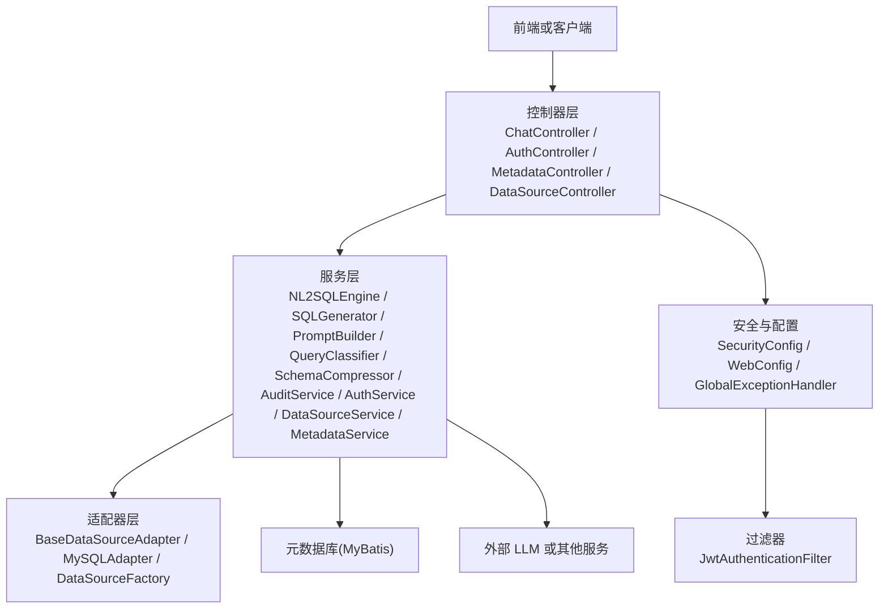
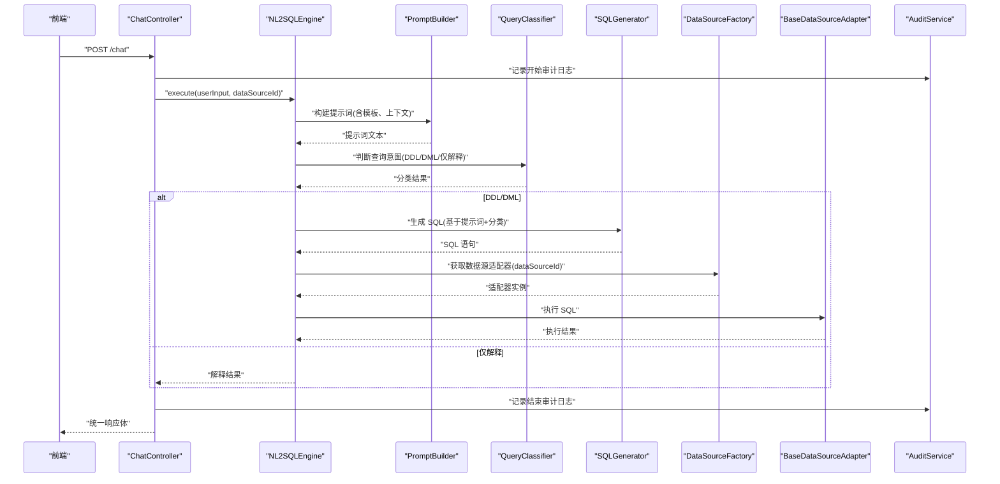
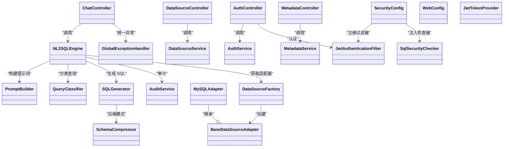

# 组件设计

<cite>
**本文引用的文件**   
- [Nlp2SqlApplication.java](file://backend/src/main/java/com/nlp2sql/Nlp2SqlApplication.java)
- [ChatController.java](file://backend/src/main/java/com/nlp2sql/controller/ChatController.java)
- [AuthController.java](file://backend/src/main/java/com/nlp2sql/controller/AuthController.java)
- [MetadataController.java](file://backend/src/main/java/com/nlp2sql/controller/MetadataController.java)
- [DataSourceController.java](file://backend/src/main/java/com/nlp2sql/controller/DataSourceController.java)
- [NL2SQLEngine.java](file://backend/src/main/java/com/nlp2sql/service/NL2SQLEngine.java)
- [SQLGenerator.java](file://backend/src/main/java/com/nlp2sql/service/SQLGenerator.java)
- [PromptBuilder.java](file://backend/src/main/java/com/nlp2sql/service/PromptBuilder.java)
- [PromptTemplateService.java](file://backend/src/main/java/com/nlp2sql/service/PromptTemplateService.java)
- [QueryClassifier.java](file://backend/src/main/java/com/nlp2sql/service/QueryClassifier.java)
- [SchemaCompressor.java](file://backend/src/main/java/com/nlp2sql/service/SchemaCompressor.java)
- [AuditService.java](file://backend/src/main/java/com/nlp2sql/service/AuditService.java)
- [AuthService.java](file://backend/src/main/java/com/nlp2sql/service/AuthService.java)
- [DataSourceService.java](file://backend/src/main/java/com/nlp2sql/service/DataSourceService.java)
- [MetadataService.java](file://backend/src/main/java/com/nlp2sql/service/MetadataService.java)
- [BaseDataSourceAdapter.java](file://backend/src/main/java/com/nlp2sql/adapter/BaseDataSourceAdapter.java)
- [MySQLAdapter.java](file://backend/src/main/java/com/nlp2sql/adapter/MySQLAdapter.java)
- [DataSourceFactory.java](file://backend/src/main/java/com/nlp2sql/adapter/DataSourceFactory.java)
- [GlobalExceptionHandler.java](file://backend/src/main/java/com/nlp2sql/config/GlobalExceptionHandler.java)
- [SecurityConfig.java](file://backend/src/main/java/com/nlp2sql/config/SecurityConfig.java)
- [WebConfig.java](file://backend/src/main/java/com/nlp2sql/config/WebConfig.java)
- [JwtAuthenticationFilter.java](file://backend/src/main/java/com/nlp2sql/security/JwtAuthenticationFilter.java)
- [JwtTokenProvider.java](file://backend/src/main/java/com/nlp2sql/security/JwtTokenProvider.java)
- [SqlSecurityChecker.java](file://backend/src/main/java/com/nlp2sql/security/SqlSecurityChecker.java)
- [BusinessException.java](file://backend/src/main/java/com/nlp2sql/common/BusinessException.java)
- [ErrorCode.java](file://backend/src/main/java/com/nlp2sql/common/ErrorCode.java)
</cite>

## 目录
1. [引言](#引言)
2. [项目结构](#项目结构)
3. [核心组件](#核心组件)
4. [架构总览](#架构总览)
5. [详细组件分析](#详细组件分析)
6. [依赖关系分析](#依赖关系分析)
7. [性能与资源管理](#性能与资源管理)
8. [可测试性与复用性](#可测试性与复用性)
9. [故障排查指南](#故障排查指南)
10. [结论](#结论)

## 引言
本设计文档聚焦于后端 NL2SQL 系统的组件设计，重点说明控制器、服务层、适配器层以及安全与配置组件的职责划分、调用关系和生命周期。目标是帮助读者快速理解系统如何把自然语言查询转换为 SQL，并在不同数据源上执行，同时保证安全、可观测与可测试。

## 项目结构
后端采用分层架构：
- 控制器层负责接收请求、参数校验与结果封装；
- 服务层封装业务逻辑，协调提示词构建、查询分类、SQL 生成、元数据压缩、审计等；
- 适配器层抽象数据源访问，支持多数据库类型扩展；
- 安全与配置提供认证、鉴权、异常处理、跨域与安全策略；
- 模型与 DTO/VO 用于请求响应与领域建模；
- MyBatis Mapper 对接元数据库。

图示来源
- [ChatController.java:1-80](file://backend/src/main/java/com/nlp2sql/controller/ChatController.java#L1-L80)
- [NL2SQLEngine.java:1-120](file://backend/src/main/java/com/nlp2sql/service/NL2SQLEngine.java#L1-L120)
- [BaseDataSourceAdapter.java:1-120](file://backend/src/main/java/com/nlp2sql/adapter/BaseDataSourceAdapter.java#L1-L120)
- [SecurityConfig.java:1-120](file://backend/src/main/java/com/nlp2sql/config/SecurityConfig.java#L1-L120)
- [GlobalExceptionHandler.java:1-120](file://backend/src/main/java/com/nlp2sql/config/GlobalExceptionHandler.java#L1-L120)

章节来源
- [Nlp2SqlApplication.java:1-40](file://backend/src/main/java/com/nlp2sql/Nlp2SqlApplication.java#L1-L40)

## 核心组件
- 控制器组件：将 HTTP 请求映射到具体业务入口，统一入参出参格式，触发审计与错误处理。
- 服务组件：封装 NL2SQL 主流程（提示词构建、查询分类、SQL 生成、执行与结果封装），并协调审计、安全校验与数据源适配。
- 适配器组件：为不同数据源提供统一接口，屏蔽底层驱动差异。
- 安全与配置组件：负责 JWT 认证、跨域、全局异常、CORS、白名单、限流等横切关注点。

章节来源
- [ChatController.java:1-120](file://backend/src/main/java/com/nlp2sql/controller/ChatController.java#L1-L120)
- [NL2SQLEngine.java:1-160](file://backend/src/main/java/com/nlp2sql/service/NL2SQLEngine.java#L1-L160)
- [BaseDataSourceAdapter.java:1-150](file://backend/src/main/java/com/nlp2sql/adapter/BaseDataSourceAdapter.java#L1-L150)
- [SecurityConfig.java:1-160](file://backend/src/main/java/com/nlp2sql/config/SecurityConfig.java#L1-L160)

## 架构总览
下图展示一次对话式 NL2SQL 的端到端调用链，从前端发起请求到返回查询结果。

图示来源
- [ChatController.java:1-120](file://backend/src/main/java/com/nlp2sql/controller/ChatController.java#L1-L120)
- [NL2SQLEngine.java:1-200](file://backend/src/main/java/com/nlp2sql/service/NL2SQLEngine.java#L1-L200)
- [PromptBuilder.java:1-120](file://backend/src/main/java/com/nlp2sql/service/PromptBuilder.java#L1-L120)
- [QueryClassifier.java:1-120](file://backend/src/main/java/com/nlp2sql/service/QueryClassifier.java#L1-L120)
- [SQLGenerator.java:1-160](file://backend/src/main/java/com/nlp2sql/service/SQLGenerator.java#L1-L160)
- [DataSourceFactory.java:1-120](file://backend/src/main/java/com/nlp2sql/adapter/DataSourceFactory.java#L1-L120)
- [BaseDataSourceAdapter.java:1-150](file://backend/src/main/java/com/nlp2sql/adapter/BaseDataSourceAdapter.java#L1-L150)
- [AuditService.java:1-120](file://backend/src/main/java/com/nlp2sql/service/AuditService.java#L1-L120)

## 详细组件分析

### 控制器组件
职责
- 暴露 REST API：聊天对话、用户登录、数据源管理、元数据浏览。
- 参数校验、响应包装、触发审计与异常处理。
- 将安全相关逻辑委托给过滤器与服务层。

关键交互
- ChatController 调用 NL2SQLEngine 完成 NL2SQL 主流程。
- AuthController 调用 AuthService 完成认证与令牌发放。
- MetadataController 调用 MetadataService 读取表/列元信息。
- DataSourceController 调用 DataSourceService 进行数据源增删改查。

生命周期
- Spring MVC 容器启动时注册所有控制器。
- 每次请求创建新的请求上下文，注入所需 Bean。
- 通过 @Async 或线程池（如使用）控制并发；默认同步处理。

可测试性
- 可通过 MockMvc 模拟请求，Mock 服务层返回固定结果。
- 对审计与异常路径编写断言。

章节来源
- [ChatController.java:1-120](file://backend/src/main/java/com/nlp2sql/controller/ChatController.java#L1-L120)
- [AuthController.java:1-120](file://backend/src/main/java/com/nlp2sql/controller/AuthController.java#L1-L120)
- [MetadataController.java:1-120](file://backend/src/main/java/com/nlp2sql/controller/MetadataController.java#L1-L120)
- [DataSourceController.java:1-120](file://backend/src/main/java/com/nlp2sql/controller/DataSourceController.java#L1-L120)

### 服务组件
NL2SQLEngine（NL2SQL 引擎）
- 编排提示词构建、查询分类、SQL 生成、数据源适配与结果封装。
- 与审计服务协作，记录关键步骤。

PromptBuilder（提示词构建）
- 根据用户输入、历史上下文、目标数据源与模板构建提示词。
- 可与 PromptTemplateService 协作加载外部模板。

QueryClassifier（查询分类器）
- 识别意图：DDL、DML、解释类查询等，决定后续分支。

SQLGenerator（SQL 生成器）
- 根据提示词与分类结果生成 SQL，并可结合 SchemaCompressor 压缩元数据以优化提示词长度。

SchemaCompressor（模式压缩器）
- 抽取必要元信息，压缩 schema 描述，降低 LLM 输入成本。

AuditService（审计服务）
- 记录操作日志，包括成功/失败、耗时、用户信息等。

AuthService（认证服务）
- 校验用户名密码、签发与刷新令牌。

DataSourceService（数据源服务）
- 管理数据源配置，与适配器工厂协作获取对应适配器。

MetadataService（元数据服务）
- 读取数据库表/列信息，供提示词构建与前端展示。

生命周期
- 均为 Spring Bean，默认单例；若持有连接池等资源，应在构造中初始化，在 @PreDestroy 或 Closeable 中释放。

可测试性
- 每个服务可独立单元测试；对外部依赖使用 Mockito 或 Testcontainers。
- NL2SQLEngine 适合集成测试，验证端到端流程。

章节来源
- [NL2SQLEngine.java:1-200](file://backend/src/main/java/com/nlp2sql/service/NL2SQLEngine.java#L1-L200)
- [PromptBuilder.java:1-120](file://backend/src/main/java/com/nlp2sql/service/PromptBuilder.java#L1-L120)
- [PromptTemplateService.java:1-120](file://backend/src/main/java/com/nlp2sql/service/PromptTemplateService.java#L1-L120)
- [QueryClassifier.java:1-120](file://backend/src/main/java/com/nlp2sql/service/QueryClassifier.java#L1-L120)
- [SQLGenerator.java:1-160](file://backend/src/main/java/com/nlp2sql/service/SQLGenerator.java#L1-L160)
- [SchemaCompressor.java:1-120](file://backend/src/main/java/com/nlp2sql/service/SchemaCompressor.java#L1-L120)
- [AuditService.java:1-120](file://backend/src/main/java/com/nlp2sql/service/AuditService.java#L1-L120)
- [AuthService.java:1-120](file://backend/src/main/java/com/nlp2sql/service/AuthService.java#L1-L120)
- [DataSourceService.java:1-120](file://backend/src/main/java/com/nlp2sql/service/DataSourceService.java#L1-L120)
- [MetadataService.java:1-120](file://backend/src/main/java/com/nlp2sql/service/MetadataService.java#L1-L120)

### 适配器组件
职责
- 定义统一的数据源访问抽象，屏蔽不同数据库驱动差异。
- 提供建表、执行 SQL、读取元数据等能力。

BaseDataSourceAdapter（基类）
- 定义通用方法：连接、事务、执行、关闭等。

MySQLAdapter（MySQL 实现）
- 实现 MySQL 特定逻辑，如方言、分页、批处理等。

DataSourceFactory（工厂）
- 根据数据源类型或 ID 创建对应的适配器实例。

生命周期
- 工厂在应用启动时注册可用的适配器。
- 适配器实例通常随会话或请求复用连接池；需在销毁时关闭连接。

可复用性
- 新增数据库只需实现 BaseDataSourceAdapter 并注册到工厂。

章节来源
- [BaseDataSourceAdapter.java:1-150](file://backend/src/main/java/com/nlp2sql/adapter/BaseDataSourceAdapter.java#L1-L150)
- [MySQLAdapter.java:1-120](file://backend/src/main/java/com/nlp2sql/adapter/MySQLAdapter.java#L1-L120)
- [DataSourceFactory.java:1-120](file://backend/src/main/java/com/nlp2sql/adapter/DataSourceFactory.java#L1-L120)

### 安全与配置组件
SecurityConfig
- 配置 Spring Security 规则、白名单、拦截路径、JWT 过滤器链。

WebConfig
- 配置跨域、静态资源、序列化策略等。

GlobalExceptionHandler
- 统一捕获业务异常与系统异常，返回标准错误码与消息。

JwtAuthenticationFilter
- 解析请求头中的 Token，填充认证上下文。

JwtTokenProvider
- 生成、校验与解析 JWT。

SqlSecurityChecker
- 对生成的 SQL 进行安全检查，防止危险操作（如 DROP/DELETE 未授权）。

章节来源
- [SecurityConfig.java:1-160](file://backend/src/main/java/com/nlp2sql/config/SecurityConfig.java#L1-L160)
- [WebConfig.java:1-120](file://backend/src/main/java/com/nlp2sql/config/WebConfig.java#L1-L120)
- [GlobalExceptionHandler.java:1-120](file://backend/src/main/java/com/nlp2sql/config/GlobalExceptionHandler.java#L1-L120)
- [JwtAuthenticationFilter.java:1-120](file://backend/src/main/java/com/nlp2sql/security/JwtAuthenticationFilter.java#L1-L120)
- [JwtTokenProvider.java:1-120](file://backend/src/main/java/com/nlp2sql/security/JwtTokenProvider.java#L1-L120)
- [SqlSecurityChecker.java:1-120](file://backend/src/main/java/com/nlp2sql/security/SqlSecurityChecker.java#L1-L120)

## 依赖关系分析
- 控制器依赖服务层，不直接访问数据库或适配器。
- 服务层依赖适配器工厂、审计、安全校验与外部服务（如 LLM）。
- 适配器由工厂按数据源类型装配。
- 安全过滤器位于控制器之前，先做认证与鉴权。

图示来源
- [ChatController.java:1-120](file://backend/src/main/java/com/nlp2sql/controller/ChatController.java#L1-L120)
- [NL2SQLEngine.java:1-200](file://backend/src/main/java/com/nlp2sql/service/NL2SQLEngine.java#L1-L200)
- [BaseDataSourceAdapter.java:1-150](file://backend/src/main/java/com/nlp2sql/adapter/BaseDataSourceAdapter.java#L1-L150)
- [SecurityConfig.java:1-160](file://backend/src/main/java/com/nlp2sql/config/SecurityConfig.java#L1-L160)

## 性能与资源管理
- 提示词构建与压缩：通过 SchemaCompressor 限制 schema 规模，减少 LLM 输入体积，提高响应速度。
- 连接与资源：数据源适配器应复用连接池，避免频繁创建连接；在异常路径确保连接关闭。
- 缓存：可对元数据、提示词模板进行缓存，减少重复计算与 IO。
- 异步与限流：对长耗时任务（如大模型调用）考虑异步化；结合网关或本地限流保护后端。
- 监控：通过审计服务与链路追踪记录耗时与失败率，便于定位瓶颈。

[本节为通用指导，不涉及具体代码]

## 可测试性与复用性
- 控制器层：使用 MockMvc 与 Mock 服务层，覆盖成功/失败、参数校验、异常分支。
- 服务层：单元测试覆盖提示词构建、分类、SQL 生成；集成测试使用 Testcontainers 验证真实数据库行为。
- 适配器层：对 BaseDataSourceAdapter 定义稳定接口，MySQLAdapter 可单独测试；工厂可注入多种实现以切换环境。
- 安全层：对 JWT 过滤与 Token 提供用例，验证非法请求被拒绝。
- 复用性：适配器抽象使新增数据库成本低；提示词模板与服务解耦，便于版本化管理与 A/B 测试。

章节来源
- [GlobalExceptionHandler.java:1-120](file://backend/src/main/java/com/nlp2sql/config/GlobalExceptionHandler.java#L1-L120)
- [BusinessException.java:1-120](file://backend/src/main/java/com/nlp2sql/common/BusinessException.java#L1-L120)
- [ErrorCode.java:1-120](file://backend/src/main/java/com/nlp2sql/common/ErrorCode.java#L1-L120)

## 故障排查指南
常见问题
- 认证失败：检查 JWT 是否过期、签名是否正确、过滤器链是否生效。
- SQL 被拦截：确认 SqlSecurityChecker 规则是否符合预期，必要时调整白名单。
- 数据源连接失败：检查 DataSourceFactory 选择是否正确、适配器实现是否完整。
- 提示词过长：启用 SchemaCompressor 压缩元数据，或精简 PromptBuilder 上下文。
- 超时或 OOM：评估 LLM 调用时长与返回大小，增加超时与熔断机制。

定位手段
- 查看审计日志，确认各阶段耗时与失败原因。
- 开启调试日志，观察请求进入过滤器、控制器、服务层的轨迹。
- 使用统一异常处理器返回的错误码与消息进行快速定位。

章节来源
- [AuditService.java:1-120](file://backend/src/main/java/com/nlp2sql/service/AuditService.java#L1-L120)
- [GlobalExceptionHandler.java:1-120](file://backend/src/main/java/com/nlp2sql/config/GlobalExceptionHandler.java#L1-L120)
- [JwtAuthenticationFilter.java:1-120](file://backend/src/main/java/com/nlp2sql/security/JwtAuthenticationFilter.java#L1-L120)
- [SqlSecurityChecker.java:1-120](file://backend/src/main/java/com/nlp2sql/security/SqlSecurityChecker.java#L1-L120)

## 结论
该组件设计通过清晰的层次拆分与稳定的接口抽象，实现了 NL2SQL 的可扩展、可测试与可维护。控制器专注请求编排，服务层封装核心算法与流程，适配器层屏蔽数据源差异，安全与配置保障系统健壮性。建议在生产环境中加强监控、限流与缓存，持续优化提示词与 SQL 生成质量。