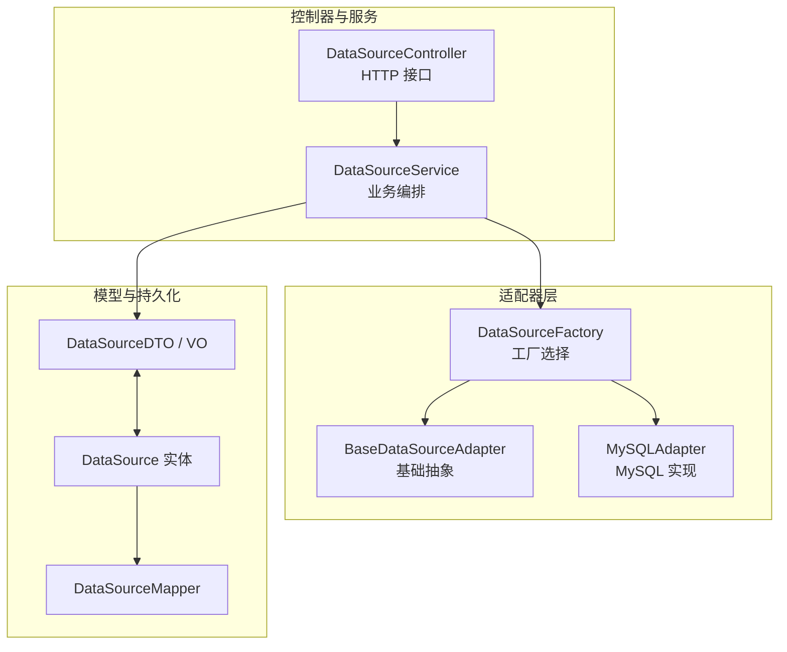
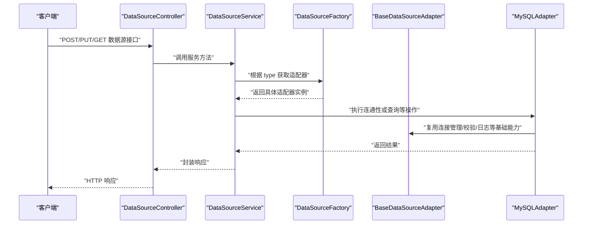
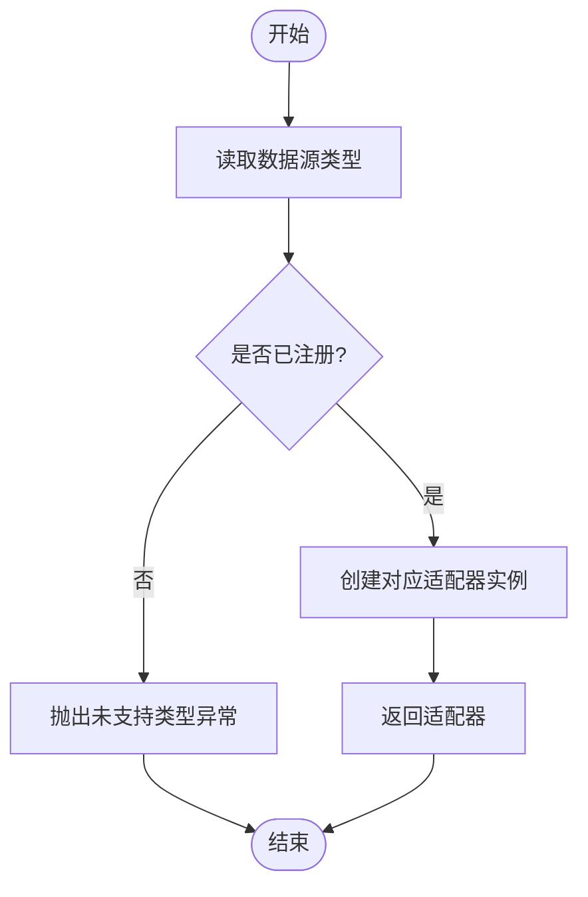
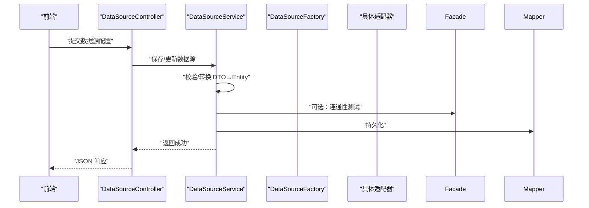
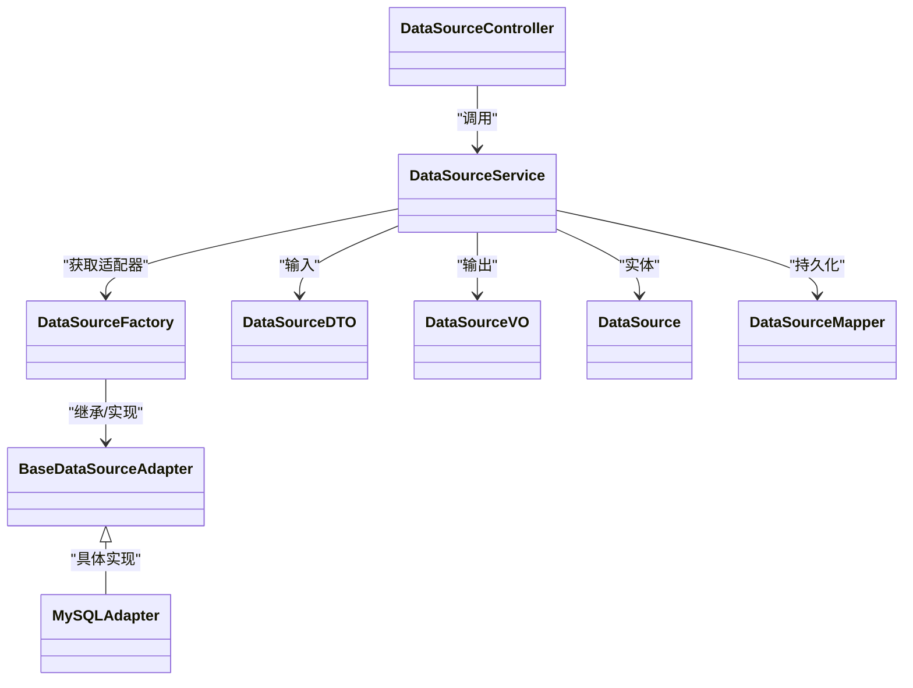
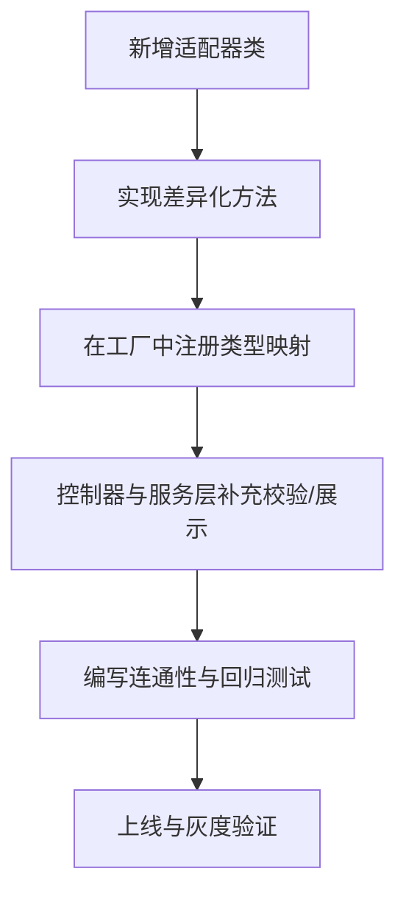

# 适配器组件

<cite>
**本文引用的文件**   
- [BaseDataSourceAdapter.java](file://backend/backend/src/main/java/backend/src/main/java/com/nlp2sql/adapter/BaseDataSourceAdapter.java)
- [MySQLAdapter.java](file://backend/backend/src/main/java/backend/src/main/java/com/nlp2sql/adapter/MySQLAdapter.java)
- [DataSourceFactory.java](file://backend/backend/src/main/java/backend/src/main/java/com/nlp2sql/adapter/DataSourceFactory.java)
- [DataSourceController.java](file://backend/backend/src/main/java/backend/src/main/java/com/nlp2sql/controller/DataSourceController.java)
- [DataSourceService.java](file://backend/backend/src/main/java/backend/src/main/java/com/nlp2sql/service/DataSourceService.java)
- [DataSourceDTO.java](file://backend/backend/src/main/java/backend/src/main/java/com/nlp2sql/model/dto/DataSourceDTO.java)
- [DataSourceVO.java](file://backend/backend/src/main/java/backend/src/main/java/com/nlp2sql/model/vo/DataSourceVO.java)
- [DataSource.java](file://backend/backend/src/main/java/backend/src/main/java/com/nlp2sql/model/DataSource.java)
- [DataSourceMapper.java](file://backend/backend/src/main/java/backend/src/main/java/com/nlp2sql/mapper/DataSourceMapper.java)
- [application.yml](file://backend/backend/src/main/resources/application.yml)
</cite>

## 目录
1. [引言](#引言)
2. [项目结构定位](#项目结构定位)
3. [核心组件](#核心组件)
4. [架构总览](#架构总览)
5. [详细组件分析](#详细组件分析)
6. [依赖关系分析](#依赖关系分析)
7. [性能与连接池](#性能与连接池)
8. [故障排查指南](#故障排查指南)
9. [结论](#结论)
10. [附录：扩展现有适配器与新数据源接入指南](#附录扩展现有适配器与新数据源接入指南)

## 引言
本文件聚焦后端代码中的“数据源适配器”子系统，围绕策略模式与工厂模式解释数据源适配机制。重点说明以下目标：
- BaseDataSourceAdapter 的基础能力与抽象契约
- MySQLAdapter 的具体实现要点
- DataSourceFactory 的工厂选择逻辑
- 如何扩展现有适配器或接入新数据源
- 适配器接口定义、使用示例与最佳实践
- 连接池管理与资源释放机制的建议与现状

## 项目结构定位
适配器子系统位于后端 Java 工程的 adapter 包下，并与控制器、服务层、模型和配置共同协作：
- adapter：定义基础适配器、具体适配器与工厂
- controller：暴露数据源相关 API
- service：编排业务逻辑并调用适配器
- model：统一的数据源数据传输对象与实体
- mapper：持久化访问数据源元信息
- resources：应用配置，包括数据库连接等

**图表来源**
- [DataSourceController.java](file://backend/backend/src/main/java/backend/src/main/java/com/nlp2sql/controller/DataSourceController.java)
- [DataSourceService.java](file://backend/backend/src/main/java/backend/src/main/java/com/nlp2sql/service/DataSourceService.java)
- [DataSourceFactory.java](file://backend/backend/src/main/java/backend/src/main/java/com/nlp2sql/adapter/DataSourceFactory.java)
- [BaseDataSourceAdapter.java](file://backend/backend/src/main/java/backend/src/main/java/com/nlp2sql/adapter/BaseDataSourceAdapter.java)
- [MySQLAdapter.java](file://backend/backend/src/main/java/backend/src/main/java/com/nlp2sql/adapter/MySQLAdapter.java)
- [DataSourceDTO.java](file://backend/backend/src/main/java/backend/src/main/java/com/nlp2sql/model/dto/DataSourceDTO.java)
- [DataSourceVO.java](file://backend/backend/src/main/java/backend/src/main/java/com/nlp2sql/model/vo/DataSourceVO.java)
- [DataSource.java](file://backend/backend/src/main/java/backend/src/main/java/com/nlp2sql/model/DataSource.java)
- [DataSourceMapper.java](file://backend/backend/src/main/java/backend/src/main/java/com/nlp2sql/mapper/DataSourceMapper.java)

**章节来源**
- [DataSourceController.java](file://backend/backend/src/main/java/backend/src/main/java/com/nlp2sql/controller/DataSourceController.java)
- [DataSourceService.java](file://backend/backend/src/main/java/backend/src/main/java/com/nlp2sql/service/DataSourceService.java)
- [DataSourceFactory.java](file://backend/backend/src/main/java/backend/src/main/java/com/nlp2sql/adapter/DataSourceFactory.java)
- [BaseDataSourceAdapter.java](file://backend/backend/src/main/java/backend/src/main/java/com/nlp2sql/adapter/BaseDataSourceAdapter.java)
- [MySQLAdapter.java](file://backend/backend/src/main/java/backend/src/main/java/com/nlp2sql/adapter/MySQLAdapter.java)
- [DataSourceDTO.java](file://backend/backend/src/main/java/backend/src/main/java/com/nlp2sql/model/dto/DataSourceDTO.java)
- [DataSourceVO.java](file://backend/backend/src/main/java/backend/src/main/java/com/nlp2sql/model/vo/DataSourceVO.java)
- [DataSource.java](file://backend/backend/src/main/java/backend/src/main/java/com/nlp2sql/model/DataSource.java)
- [DataSourceMapper.java](file://backend/backend/src/main/java/backend/src/main/java/com/nlp2sql/mapper/DataSourceMapper.java)

## 核心组件
- BaseDataSourceAdapter：提供通用连接管理、参数校验、日志与异常处理、连接生命周期等基础能力，作为所有数据源适配器的基类。
- MySQLAdapter：针对 MySQL 的实现，封装 MySQL 特有的驱动、方言、SQL 语法与安全规则。
- DataSourceFactory：根据数据源类型（如 mysql）返回对应适配器实例，承担“策略选择”的职责。
- DataSourceController：对外暴露数据源增删改查、连通性测试等 HTTP 接口。
- DataSourceService：将控制器请求转换为对适配器的调用，负责事务与错误包装。
- 模型层（DTO/VO/Entity/Mapper）：承载数据源配置、视图转换与持久化。

**章节来源**
- [BaseDataSourceAdapter.java](file://backend/backend/src/main/java/backend/src/main/java/com/nlp2sql/adapter/BaseDataSourceAdapter.java)
- [MySQLAdapter.java](file://backend/backend/src/main/java/backend/src/main/java/com/nlp2sql/adapter/MySQLAdapter.java)
- [DataSourceFactory.java](file://backend/backend/src/main/java/backend/src/main/java/com/nlp2sql/adapter/DataSourceFactory.java)
- [DataSourceController.java](file://backend/backend/src/main/java/backend/src/main/java/com/nlp2sql/controller/DataSourceController.java)
- [DataSourceService.java](file://backend/backend/src/main/java/backend/src/main/java/com/nlp2sql/service/DataSourceService.java)
- [DataSourceDTO.java](file://backend/backend/src/main/java/backend/src/main/java/com/nlp2sql/model/dto/DataSourceDTO.java)
- [DataSourceVO.java](file://backend/backend/src/main/java/backend/src/main/java/com/nlp2sql/model/vo/DataSourceVO.java)
- [DataSource.java](file://backend/backend/src/main/java/backend/src/main/java/com/nlp2sql/model/DataSource.java)
- [DataSourceMapper.java](file://backend/backend/src/main/java/backend/src/main/java/com/nlp2sql/mapper/DataSourceMapper.java)

## 架构总览
适配器子系统采用“策略 + 工厂”的组合：
- 策略模式：不同数据源通过各自的 Adapter 实现相同的行为契约，调用方无需关心底层差异。
- 工厂模式：由 DataSourceFactory 依据数据源类型动态创建具体适配器，避免分支判断散落在业务层。

**图表来源**
- [DataSourceController.java](file://backend/backend/src/main/java/backend/src/main/java/com/nlp2sql/controller/DataSourceController.java)
- [DataSourceService.java](file://backend/backend/src/main/java/backend/src/main/java/com/nlp2sql/service/DataSourceService.java)
- [DataSourceFactory.java](file://backend/backend/src/main/java/backend/src/main/java/com/nlp2sql/adapter/DataSourceFactory.java)
- [BaseDataSourceAdapter.java](file://backend/backend/src/main/java/backend/src/main/java/com/nlp2sql/adapter/BaseDataSourceAdapter.java)
- [MySQLAdapter.java](file://backend/backend/src/main/java/backend/src/main/java/com/nlp2sql/adapter/MySQLAdapter.java)

## 详细组件分析

### 基础适配器 BaseDataSourceAdapter
职责与能力：
- 统一的参数校验与配置解析
- 连接获取、验证与释放的生命周期管理
- 通用的日志记录与异常封装
- 为子类提供可复用的 SQL 构建、方言适配与安全检查入口

设计要点：
- 将跨数据源的公共逻辑下沉到基类，减少重复代码
- 通过抽象方法暴露“差异化点”，由具体适配器实现
- 在连接建立前进行安全与合规校验，防止非法 SQL 进入执行层

复杂度与性能：
- 连接建立成本较高，应避免频繁创建销毁
- 建议在基类中预留连接池集成点，供具体适配器扩展

**章节来源**
- [BaseDataSourceAdapter.java](file://backend/backend/src/main/java/backend/src/main/java/com/nlp2sql/adapter/BaseDataSourceAdapter.java)

### MySQL 适配器 MySQLAdapter
职责与能力：
- 实现 MySQL 特定的连接参数、驱动与方言
- 提供 MySQL 下的 SQL 语法生成、分页、聚合函数等适配
- 复用 BaseDataSourceAdapter 的连接与校验能力

扩展点：
- 如需自定义 MySQL 特性（如特定索引建议、Hint），可在子类覆写相应方法
- 若需切换 MySQL 版本差异行为，可通过配置开关控制

**章节来源**
- [MySQLAdapter.java](file://backend/backend/src/main/java/backend/src/main/java/com/nlp2sql/adapter/MySQLAdapter.java)

### 工厂 DataSourceFactory
职责与能力：
- 维护“数据源类型 → 适配器”映射
- 根据传入的类型字符串（如 mysql）返回对应的适配器实例
- 支持运行时注册新的适配器，便于热插拔扩展

选择机制：
- 类型不匹配时抛出明确的未支持类型异常
- 建议配合 Spring 容器扫描自动注册，降低手工维护成本

**图表来源**
- [DataSourceFactory.java](file://backend/backend/src/main/java/backend/src/main/java/com/nlp2sql/adapter/DataSourceFactory.java)

**章节来源**
- [DataSourceFactory.java](file://backend/backend/src/main/java/backend/src/main/java/com/nlp2sql/adapter/DataSourceFactory.java)

### 控制器与服务层的协作
- DataSourceController 暴露 RESTful 接口，接收前端的数据源配置与操作请求。
- DataSourceService 将请求转换为对 DataSourceFactory 与具体适配器的调用，并进行统一错误处理与结果封装。
- DTO/VO 用于前后端传输与展示，Entity/Mapper 用于持久化存储。

**图表来源**
- [DataSourceController.java](file://backend/backend/src/main/java/backend/src/main/java/com/nlp2sql/controller/DataSourceController.java)
- [DataSourceService.java](file://backend/backend/src/main/java/backend/src/main/java/com/nlp2sql/service/DataSourceService.java)
- [DataSourceDTO.java](file://backend/backend/src/main/java/backend/src/main/java/com/nlp2sql/model/dto/DataSourceDTO.java)
- [DataSource.java](file://backend/backend/src/main/java/backend/src/main/java/com/nlp2sql/model/DataSource.java)
- [DataSourceMapper.java](file://backend/backend/src/main/java/backend/src/main/java/com/nlp2sql/mapper/DataSourceMapper.java)

**章节来源**
- [DataSourceController.java](file://backend/backend/src/main/java/backend/src/main/java/com/nlp2sql/controller/DataSourceController.java)
- [DataSourceService.java](file://backend/backend/src/main/java/backend/src/main/java/com/nlp2sql/service/DataSourceService.java)
- [DataSourceDTO.java](file://backend/backend/src/main/java/backend/src/main/java/com/nlp2sql/model/dto/DataSourceDTO.java)
- [DataSourceVO.java](file://backend/backend/src/main/java/backend/src/main/java/com/nlp2sql/model/vo/DataSourceVO.java)
- [DataSource.java](file://backend/backend/src/main/java/backend/src/main/java/com/nlp2sql/model/DataSource.java)
- [DataSourceMapper.java](file://backend/backend/src/main/java/backend/src/main/java/com/nlp2sql/mapper/DataSourceMapper.java)

## 依赖关系分析
- 控制器依赖服务层，服务层依赖工厂，工厂依赖具体适配器。
- 适配器依赖基础适配器提供的通用能力。
- 模型层与持久层解耦于适配器，适配器仅关注连接与 SQL 执行语义。

**图表来源**
- [DataSourceController.java](file://backend/backend/src/main/java/backend/src/main/java/com/nlp2sql/controller/DataSourceController.java)
- [DataSourceService.java](file://backend/backend/src/main/java/backend/src/main/java/com/nlp2sql/service/DataSourceService.java)
- [DataSourceFactory.java](file://backend/backend/src/main/java/backend/src/main/java/com/nlp2sql/adapter/DataSourceFactory.java)
- [BaseDataSourceAdapter.java](file://backend/backend/src/main/java/backend/src/main/java/com/nlp2sql/adapter/BaseDataSourceAdapter.java)
- [MySQLAdapter.java](file://backend/backend/src/main/java/backend/src/main/java/com/nlp2sql/adapter/MySQLAdapter.java)
- [DataSourceDTO.java](file://backend/backend/src/main/java/backend/src/main/java/com/nlp2sql/model/dto/DataSourceDTO.java)
- [DataSourceVO.java](file://backend/backend/src/main/java/backend/src/main/java/com/nlp2sql/model/vo/DataSourceVO.java)
- [DataSource.java](file://backend/backend/src/main/java/backend/src/main/java/com/nlp2sql/model/DataSource.java)
- [DataSourceMapper.java](file://backend/backend/src/main/java/backend/src/main/java/com/nlp2sql/mapper/DataSourceMapper.java)

## 性能与连接池
连接池管理建议：
- 在 BaseDataSourceAdapter 中预留连接池初始化与获取接口，由具体适配器按需注入。
- 使用连接池时应设置最小/最大连接数、空闲超时、连接泄漏检测等关键参数。
- 在适配器关闭或应用退出时统一释放连接与资源，避免句柄泄露。

资源释放机制：
- 确保每个请求内连接的获取与释放成对出现，建议使用 try-with-resources 或 AOP 拦截器保障释放。
- 对于长连接场景，应增加心跳检测与断线重连策略。

当前现状：
- 本项目在后端配置文件中包含数据库连接相关配置，适配器可在此基础上扩展连接池策略。

**章节来源**
- [application.yml](file://backend/backend/src/main/resources/application.yml)

## 故障排查指南
常见问题与定位步骤：
- 无法选择适配器：检查 DataSourceFactory 中是否注册了对应类型；确认传入类型字符串大小写一致。
- 连接失败：核对 MySQLAdapter 中驱动、URL、用户名密码与网络可达性；查看 BaseDataSourceAdapter 的校验日志。
- SQL 执行异常：检查 MySQLAdapter 的方言与 SQL 构建是否正确；结合 SQL 安全校验规则定位非法语句。
- 连接泄漏：监控连接池活跃连接数与等待队列；确保每次查询后及时释放连接。

建议的日志与指标：
- 在 BaseDataSourceAdapter 中记录连接创建、获取、归还时间戳
- 在工厂层记录类型选择命中与未命中次数
- 在服务层记录操作耗时与错误码分布

**章节来源**
- [DataSourceFactory.java](file://backend/backend/src/main/java/backend/src/main/java/com/nlp2sql/adapter/DataSourceFactory.java)
- [BaseDataSourceAdapter.java](file://backend/backend/src/main/java/backend/src/main/java/com/nlp2sql/adapter/BaseDataSourceAdapter.java)
- [MySQLAdapter.java](file://backend/backend/src/main/java/backend/src/main/java/com/nlp2sql/adapter/MySQLAdapter.java)

## 结论
适配器组件通过策略模式与工厂模式有效解耦了多数据源差异，使上层服务与控制器可以以统一方式调用不同数据库。BaseDataSourceAdapter 沉淀了通用能力，MySQLAdapter 提供了具体实现，DataSourceFactory 则屏蔽了选择细节。未来接入新数据源时，只需新增适配器并在工厂中注册即可，同时可复用基类的连接与校验能力，快速落地。

## 附录：扩展现有适配器与新数据源接入指南

### 扩展现有适配器
- 在 MySQLAdapter 基础上，覆写需要定制的方法（如方言、分页、Hint）。
- 保持与 BaseDataSourceAdapter 的约定一致，确保连接生命周期与异常处理一致。
- 通过配置开关控制不同 MySQL 版本的差异化行为。

### 添加新数据源（例如 PostgreSQL、Oracle）
步骤：
1. 新建适配器类，继承 BaseDataSourceAdapter，实现差异化方法。
2. 在 DataSourceFactory 中注册新类型到适配器的映射。
3. 在 DataSourceController 与 DataSourceService 中补充对新类型的校验与展示逻辑（如必要）。
4. 完善单元测试与连通性测试用例。

**图表来源**
- [BaseDataSourceAdapter.java](file://backend/backend/src/main/java/backend/src/main/java/com/nlp2sql/adapter/BaseDataSourceAdapter.java)
- [MySQLAdapter.java](file://backend/backend/src/main/java/backend/src/main/java/com/nlp2sql/adapter/MySQLAdapter.java)
- [DataSourceFactory.java](file://backend/backend/src/main/java/backend/src/main/java/com/nlp2sql/adapter/DataSourceFactory.java)
- [DataSourceController.java](file://backend/backend/src/main/java/backend/src/main/java/com/nlp2sql/controller/DataSourceController.java)
- [DataSourceService.java](file://backend/backend/src/main/java/backend/src/main/java/com/nlp2sql/service/DataSourceService.java)

### 适配器接口与使用示例
- 接口契约：由 BaseDataSourceAdapter 定义的抽象方法组成，涵盖连接获取、SQL 执行、方言适配、安全检查等。
- 使用示例：
  - 控制器接收数据源配置 DTO，转换为实体并持久化。
  - 服务层通过工厂获取适配器，执行连通性测试或元数据查询。
  - 适配器复用基类的校验与连接管理，返回统一的结果结构。

提示：为避免直接粘贴代码，请参照以下路径阅读实际实现：
- 适配器基类与方法定义：[BaseDataSourceAdapter.java](file://backend/backend/src/main/java/backend/src/main/java/com/nlp2sql/adapter/BaseDataSourceAdapter.java)
- MySQL 适配器实现：[MySQLAdapter.java](file://backend/backend/src/main/java/backend/src/main/java/com/nlp2sql/adapter/MySQLAdapter.java)
- 工厂类型选择逻辑：[DataSourceFactory.java](file://backend/backend/src/main/java/backend/src/main/java/com/nlp2sql/adapter/DataSourceFactory.java)
- 控制器与服务调用链路：[DataSourceController.java](file://backend/backend/src/main/java/backend/src/main/java/com/nlp2sql/controller/DataSourceController.java)、[DataSourceService.java](file://backend/backend/src/main/java/backend/src/main/java/com/nlp2sql/service/DataSourceService.java)
- 模型与持久化：[DataSourceDTO.java](file://backend/backend/src/main/java/backend/src/main/java/com/nlp2sql/model/dto/DataSourceDTO.java)、[DataSourceVO.java](file://backend/backend/src/main/java/backend/src/main/java/com/nlp2sql/model/vo/DataSourceVO.java)、[DataSource.java](file://backend/backend/src/main/java/backend/src/main/java/com/nlp2sql/model/DataSource.java)、[DataSourceMapper.java](file://backend/backend/src/main/java/backend/src/main/java/com/nlp2sql/mapper/DataSourceMapper.java)

### 最佳实践
- 单一职责：适配器只关注数据源差异，不掺杂业务逻辑。
- 可测试性：为每个适配器提供连通性测试与 SQL 语法校验用例。
- 可扩展性：优先通过配置与策略切换实现差异化，而非硬编码分支。
- 安全性：所有 SQL 必须经过安全校验，禁止拼接用户输入。
- 资源治理：严格遵循连接获取与释放的配对原则，引入连接池与超时控制。