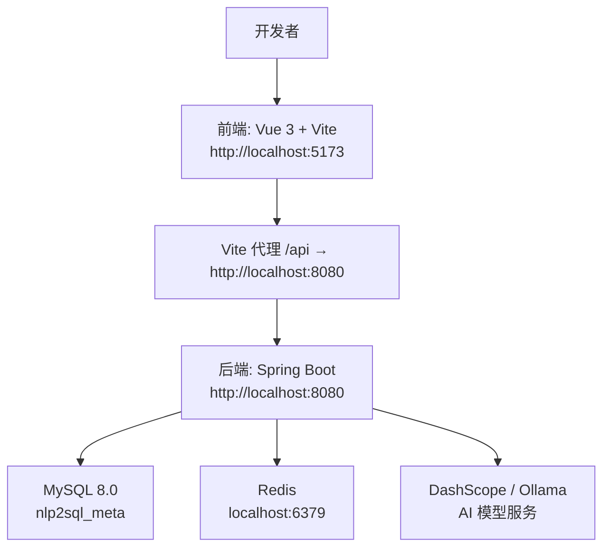
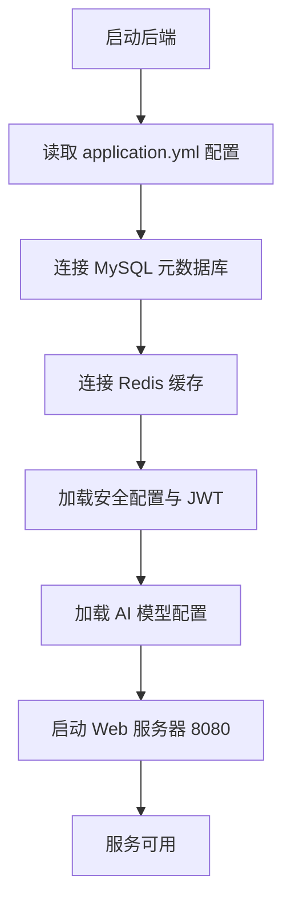
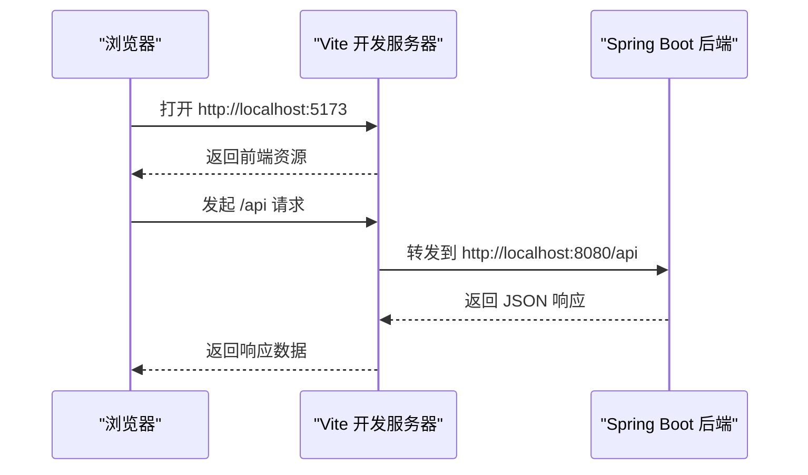
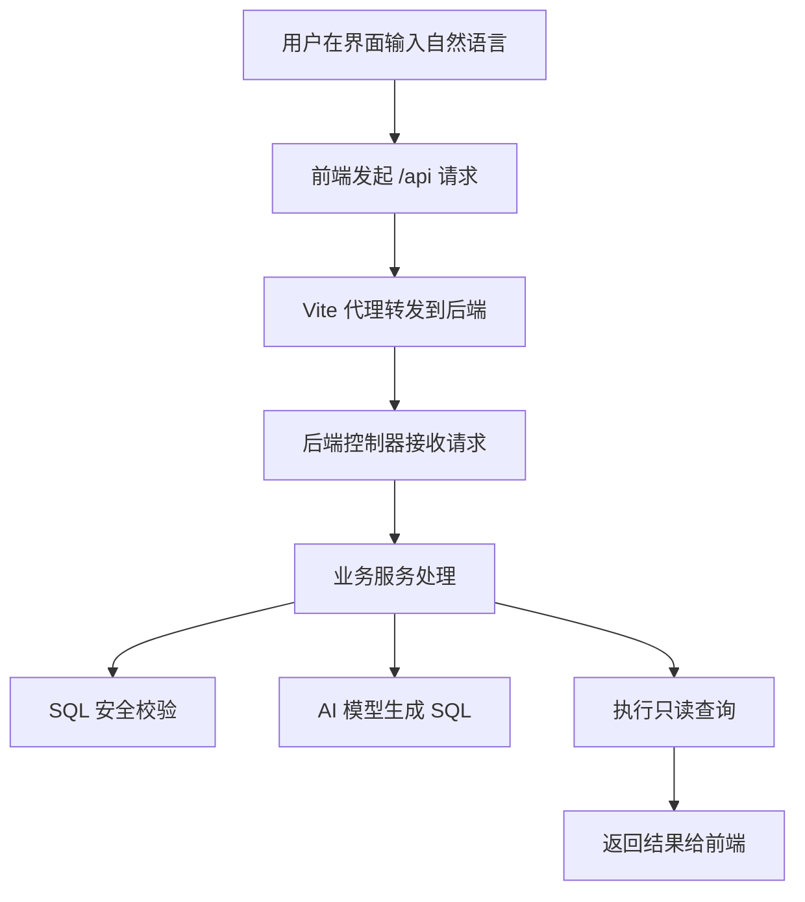
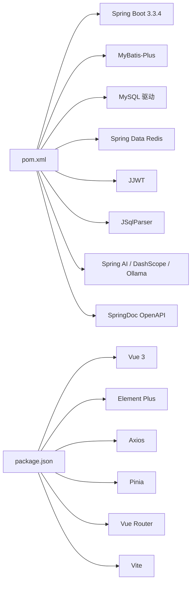

# 本地部署

<cite>
**本文引用的文件**
- [backend/pom.xml](file://backend/pom.xml)
- [backend/src/main/resources/application.yml](file://backend/src/main/resources/application.yml)
- [sql/init_backend.sql](file://sql/init_backend.sql)
- [sql/sample_data/mysql_sample.sql](file://sql/sample_data/mysql_sample.sql)
- [frontend/package.json](file://frontend/package.json)
- [frontend/vite.config.js](file://frontend/vite.config.js)
- [docs/user_manual.md](file://docs/user_manual.md)
</cite>

## 目录
1. [简介](#简介)
2. [项目结构](#项目结构)
3. [环境依赖与安装](#环境依赖与安装)
4. [数据库初始化](#数据库初始化)
5. [后端构建与启动](#后端构建与启动)
6. [前端构建与启动](#前端构建与启动)
7. [IDE 与调试配置](#ide-与调试配置)
8. [开发工具链与代码规范](#开发工具链与代码规范)
9. [热重载与断点调试](#热重载与断点调试)
10. [依赖关系分析](#依赖关系分析)
11. [常见问题排查](#常见问题排查)
12. [结论](#结论)

## 简介
本项目的本地部署文档面向开发者，目标是帮助你在本机快速搭建 NL2SQL 智能查询系统的完整开发环境。系统由 Spring Boot 后端、MySQL 元数据与示例业务库、Redis 缓存、Vue 3 + Vite 前端组成；默认使用阿里云 DashScope（通义千问）作为 AI 模型服务，也支持通过 Ollama 运行本地大模型。

后端提供自然语言转 SQL、SQL 安全校验、用户认证、数据源管理、元数据与审计日志等能力；前端提供对话式查询界面、数据源选择、结果表格展示和表结构浏览等功能。

## 项目结构
仓库采用前后端分离结构：
- backend：Spring Boot 3 后端工程，包含控制器、服务、安全、MyBatis-Plus、Redis、OpenAPI 等模块。
- frontend：Vue 3 + Vite 前端工程，包含页面、组件、状态管理和 API 客户端。
- sql：后端元数据库建库脚本和业务示例数据库脚本。
- docs：产品文档，包括用户手册。

**图示来源**
- [frontend/vite.config.js:1-15](file://frontend/vite.config.js#L1-L15)
- [backend/src/main/resources/application.yml:1-20](file://backend/src/main/resources/application.yml#L1-L20)

**章节来源**
- [docs/user_manual.md:1-10](file://docs/user_manual.md#L1-L10)

## 环境依赖与安装
### 必需依赖版本建议
| 依赖 | 推荐版本 | 说明 |
| --- | --- | --- |
| JDK | 17 | 后端编译与运行要求 |
| Maven | 3.8+ | 后端构建工具 |
| Node.js | 18 LTS 或 20 LTS | 前端构建与开发服务器 |
| npm | 随 Node.js 安装 | 包管理器 |
| MySQL | 8.0 | 后端元数据库与示例业务库 |
| Redis | 6.x 或 7.x | 会话与缓存 |
| 浏览器 | Chrome 90+ / Edge 90+ / Firefox 90+ | 前端运行环境 |
| AI 模型服务 | DashScope 或 Ollama | 生成 SQL 的大模型接口 |

JDK 17 是后端工程的强制要求，Maven 会按照后端工程的 Java 版本属性进行编译。Node.js 用于安装前端依赖并运行 Vite 开发服务器。MySQL 需要同时准备后端元数据库和业务示例数据库。Redis 用于后端缓存与会话增强。AI 模型服务可选择云端 DashScope 或本地 Ollama。

**章节来源**
- [backend/pom.xml:1-30](file://backend/pom.xml#L1-L30)
- [docs/user_manual.md:8-16](file://docs/user_manual.md#L8-L16)

## 数据库初始化
本项目涉及两个 MySQL 数据库：
- nlp2sql_meta：后端元数据库，保存数据源配置、用户信息和审计日志。
- nlp2sql_sample：示例业务数据库，包含部门、用户、商品、订单等测试表和数据。

### 创建元数据库
在 MySQL 中执行后端元数据库初始化脚本，该脚本会创建数据库及三张核心表：
- datasources：数据源配置表。
- users：用户信息表。
- audit_logs：审计日志表。

执行方式示例：
- 使用命令行客户端连接 MySQL 后执行初始化脚本。
- 使用图形化工具打开脚本文件并执行。

### 创建示例业务数据库
示例脚本会创建 nlp2sql_sample 数据库以及部门、用户、商品、订单、订单明细等表，并插入常用测试数据。这样可以在前端添加数据源后直接体验自然语言查询。

执行方式示例：
- 使用命令行客户端连接 MySQL 后执行示例脚本。
- 使用图形化工具打开脚本文件并执行。

### 注意事项
- 确保 MySQL 已启动且端口为 3306，或根据实际端口调整连接参数。
- 建议使用 utf8mb4 字符集，避免中文乱码。
- 如果后端配置文件中的数据库用户名和密码与本机不一致，请先修改配置再启动后端。

**章节来源**
- [sql/init_backend.sql:1-47](file://sql/init_backend.sql#L1-L47)
- [sql/sample_data/mysql_sample.sql:1-149](file://sql/sample_data/mysql_sample.sql#L1-L149)

## 后端构建与启动
### 构建命令
进入后端工程根目录，使用 Maven 构建项目：
- 清理并打包：`mvn clean package`
- 仅编译不打包：`mvn compile`
- 跳过测试构建：`mvn clean package -DskipTests`

后端工程继承 Spring Boot Starter Parent，并使用 Spring Boot Maven Plugin。Java 编译目标设置为 17，Lombok 注解处理器已启用。

### 运行命令
构建完成后，可直接运行 Spring Boot 应用：
- 使用 Maven 插件运行：`mvn spring-boot:run`
- 运行打包后的 JAR：`java -jar target/nlp2sql-backend-1.0.0-SNAPSHOT.jar`

后端默认监听 8080 端口，上下文路径为根路径。

### 关键配置说明
后端主要配置文件定义了以下运行时依赖：
- 服务端端口：8080。
- MySQL 元数据库连接地址、用户名、密码、连接池参数。
- Redis 主机、端口、密码、数据库编号、连接池参数。
- Jackson 时间格式与时区。
- MyBatis-Plus 映射位置、驼峰命名、逻辑删除字段。
- JWT 密钥和过期时间。
- AI 模型提供商、模型名称、温度参数。
- SQL 安全策略：最大返回行数、查询超时、重试次数。
- 提示词模板版本、Schema 缓存 TTL。
- OpenAPI 文档路径。
- 日志级别与输出格式。

**图示来源**
- [backend/src/main/resources/application.yml:1-20](file://backend/src/main/resources/application.yml#L1-L20)
- [backend/src/main/resources/application.yml:21-60](file://backend/src/main/resources/application.yml#L21-L60)
- [backend/src/main/resources/application.yml:61-117](file://backend/src/main/resources/application.yml#L61-L117)

**章节来源**
- [backend/pom.xml:1-30](file://backend/pom.xml#L1-L30)
- [backend/pom.xml:160-194](file://backend/pom.xml#L160-L194)
- [backend/src/main/resources/application.yml:1-20](file://backend/src/main/resources/application.yml#L1-L20)
- [backend/src/main/resources/application.yml:21-117](file://backend/src/main/resources/application.yml#L21-L117)

## 前端构建与启动
### 安装依赖
进入前端工程根目录，使用 npm 安装依赖：
- `npm install`

前端工程声明了 Vue 3、Element Plus、Axios、Pinia、Vue Router、Vite 等依赖。package.json 中定义了 dev、build、preview 三个脚本。

### 启动开发服务器
安装依赖后，启动 Vite 开发服务器：
- `npm run dev`

Vite 默认监听 5173 端口，并将 `/api` 请求代理到后端 `http://localhost:8080`。因此前端访问 `http://localhost:5173`，后端应已在 8080 端口运行。

**图示来源**
- [frontend/vite.config.js:1-15](file://frontend/vite.config.js#L1-L15)

**章节来源**
- [frontend/package.json:1-23](file://frontend/package.json#L1-L23)
- [frontend/vite.config.js:1-15](file://frontend/vite.config.js#L1-L15)

## IDE 与调试配置
### IntelliJ IDEA
建议按以下步骤配置后端调试：
1. 使用 IDEA 打开后端工程根目录，让 IDEA 识别 Maven 项目。
2. 确认 Project SDK 为 JDK 17。
3. 找到 Spring Boot 主类并运行，或通过 Maven 运行 `spring-boot:run`。
4. 添加 JVM 调试参数，例如 `-agentlib:jdwp=transport=dt_socket,server=y,suspend=n,address=5005`。
5. 在需要检查的位置设置断点，然后触发对应接口。
6. 如需连接远程调试，可在 IDEA 中配置 Remote JVM Debug，Host 填本机 IP，Port 填 5005。

建议开启 Lombok 注解处理，避免编译时报找不到 getter、setter 等问题。

### VS Code
前端开发推荐使用 VS Code：
1. 安装 Vue Language Features、ESLint、Prettier、Volar 等扩展。
2. 打开前端工程根目录。
3. 在终端中执行 `npm install` 和 `npm run dev`。
4. 如需调试前端 JavaScript，可使用内置的 Chrome/Edge 调试器或 VS Code 的 Node Debug 扩展。

后端也可在 VS Code 中通过 Java Extension Pack 打开后端工程，但本仓库未提供 `.vscode` 调试配置，建议优先使用 IDEA 进行后端调试。

**章节来源**
- [backend/pom.xml:160-194](file://backend/pom.xml#L160-L194)
- [frontend/package.json:1-23](file://frontend/package.json#L1-L23)

## 开发工具链与代码规范
### 后端工具链
- Maven：负责依赖解析、编译、打包和 Spring Boot 运行。
- Lombok：简化实体类和 DTO 的样板代码。
- SpringDoc OpenAPI：提供 `/api-docs` 和 `/swagger-ui.html` 接口文档入口。
- Slf4j：统一日志输出，当前日志级别对后端包启用了 DEBUG。

建议在 IDE 中启用自动格式化，并在提交前运行 `mvn compile` 或 `mvn package` 验证构建是否通过。

### 前端工具链
- Vite：提供快速开发与生产构建。
- Element Plus：UI 组件库。
- Axios：HTTP 客户端。
- Pinia：状态管理。
- Vue Router：路由管理。

可结合 Prettier 与 ESLint 统一代码风格。若团队有 Git Hook 需求，可在前端或后端根目录添加 pre-commit 钩子，调用对应格式化或检查命令。

**章节来源**
- [backend/pom.xml:1-159](file://backend/pom.xml#L1-L159)
- [backend/src/main/resources/application.yml:95-117](file://backend/src/main/resources/application.yml#L95-L117)
- [frontend/package.json:1-23](file://frontend/package.json#L1-L23)

## 热重载与断点调试
### 前端热重载
Vite 开发服务器默认支持热模块替换。修改前端源码后，浏览器会自动刷新或局部更新组件，无需手动重启开发服务器。

### 后端热重载
Spring Boot 开发场景下，如果使用 `mvn spring-boot:run` 或 IDEA 直接运行主类，IDE 的 Rebuild 或 Spring Boot DevTools 可以缩短重新加载时间。不过本仓库未显式引入 DevTools 依赖，因此更稳妥的方式是停止后端进程后重新启动。

### 断点调试
推荐在后端主类设置断点，然后从前端发送请求：
1. 启动后端并进入调试模式。
2. 在前端登录、添加数据源或发送自然语言查询。
3. 观察控制器、服务层、安全过滤器、AI 模型调用等关键路径。
4. 查看变量值、调用栈和日志输出。

**图示来源**
- [frontend/vite.config.js:1-15](file://frontend/vite.config.js#L1-L15)
- [backend/src/main/resources/application.yml:84-94](file://backend/src/main/resources/application.yml#L84-L94)

**章节来源**
- [frontend/vite.config.js:1-15](file://frontend/vite.config.js#L1-L15)
- [backend/src/main/resources/application.yml:84-117](file://backend/src/main/resources/application.yml#L84-L117)

## 依赖关系分析
### 后端依赖
后端基于 Spring Boot 3.3.4，核心依赖包括：
- Spring Web、Spring Security、Validation。
- MyBatis-Plus。
- MySQL Connector/J。
- Spring Data Redis 与 Commons Pool2。
- JJWT。
- JSqlParser。
- Spring AI Alibaba DashScope 与 Ollama。
- SpringDoc OpenAPI。
- Lombok。

这些依赖决定了后端需要 MySQL、Redis、AI 模型服务以及 JDK 17 才能正常运行。

### 前端依赖
前端依赖以 Vue 3 生态为主，包括 Element Plus、Axios、Pinia、Vue Router 和 Vite。Vite 负责开发服务器与生产构建。

**图示来源**
- [backend/pom.xml:1-159](file://backend/pom.xml#L1-L159)
- [frontend/package.json:1-23](file://frontend/package.json#L1-L23)

**章节来源**
- [backend/pom.xml:1-159](file://backend/pom.xml#L1-L159)
- [frontend/package.json:1-23](file://frontend/package.json#L1-L23)

## 常见问题排查
### 端口冲突
- 现象：后端启动失败，提示 8080 端口被占用。
- 处理：关闭占用 8080 的进程，或修改后端配置的 server.port。
- 相关配置：后端默认端口 8080。

- 现象：前端启动失败，提示 5173 端口被占用。
- 处理：关闭占用 5173 的进程，或修改 Vite 配置的 server.port。
- 相关配置：Vite 默认端口 5173。

**章节来源**
- [backend/src/main/resources/application.yml:1-5](file://backend/src/main/resources/application.yml#L1-L5)
- [frontend/vite.config.js:1-15](file://frontend/vite.config.js#L1-L15)

### 依赖安装失败
- Maven 下载慢或失败：检查 Maven 镜像配置和网络连通性，必要时配置国内镜像源。
- Node 依赖安装失败：检查 Node.js 版本是否符合要求，清理 node_modules 后重试 `npm install`。
- JDK 版本不匹配：确保 JDK 17，否则 Maven 编译可能失败。

**章节来源**
- [backend/pom.xml:1-30](file://backend/pom.xml#L1-L30)
- [frontend/package.json:1-23](file://frontend/package.json#L1-L23)

### 数据库连接失败
- 现象：后端启动时报 MySQL 连接错误。
- 排查：
  - 确认 MySQL 已启动。
  - 确认数据库 nlp2sql_meta 已创建。
  - 检查用户名、密码、URL、时区、SSL 等参数是否与本机一致。
  - 确认数据库用户具备读写权限。
- 相关配置：MySQL URL、用户名、密码、驱动类、Hikari 连接池。

**章节来源**
- [backend/src/main/resources/application.yml:9-20](file://backend/src/main/resources/application.yml#L9-L20)
- [sql/init_backend.sql:1-10](file://sql/init_backend.sql#L1-L10)

### Redis 连接失败
- 现象：后端启动时报 Redis 连接错误。
- 排查：
  - 确认 Redis 已启动且端口为 6379。
  - 检查 Redis 密码、数据库编号、Lettuce 连接池配置。
- 相关配置：Redis host、port、password、database、pool 参数。

**章节来源**
- [backend/src/main/resources/application.yml:21-35](file://backend/src/main/resources/application.yml#L21-L35)

### AI 模型不可用
- 现象：自然语言查询无法生成 SQL，或调用 AI 接口报错。
- 排查：
  - 如使用 DashScope，确认环境变量 DASHSCOPE_API_KEY 已设置。
  - 如使用 Ollama，确认 Ollama 服务运行在默认地址，并拉取了对应模型。
  - 检查 nlp2sql.model.provider、dashscope-model、ollama-model 配置。
- 相关配置：AI profiles、DashScope、Ollama、模型名称与温度。

**章节来源**
- [backend/src/main/resources/application.yml:36-83](file://backend/src/main/resources/application.yml#L36-L83)

### 前端无法访问后端接口
- 现象：前端能打开页面，但 `/api` 请求失败。
- 排查：
  - 确认后端运行在 8080 端口。
  - 确认 Vite 代理将 `/api` 转发到 `http://localhost:8080`。
  - 检查浏览器控制台网络面板中的请求地址和响应。
- 相关配置：Vite server.proxy。

**章节来源**
- [frontend/vite.config.js:1-15](file://frontend/vite.config.js#L1-L15)

### 登录后无法正常使用功能
- 现象：登录后页面行为异常或接口返回未认证。
- 排查：
  - 确认后端 JWT 密钥和过期时间配置正确。
  - 确认前端是否正确携带令牌。
  - 检查后端安全过滤器和全局异常处理。

**章节来源**
- [backend/src/main/resources/application.yml:73-83](file://backend/src/main/resources/application.yml#L73-L83)

## 结论
完成上述步骤后，你应该能够在本机运行完整的 NL2SQL 智能查询系统：
- 安装 JDK 17、Maven、Node.js、MySQL 8.0、Redis。
- 执行 init_backend.sql 和 mysql_sample.sql 初始化数据库。
- 使用 Maven 构建并启动后端。
- 使用 npm 安装依赖并启动 Vite 前端。
- 在浏览器访问前端，配置数据源后进行自然语言查询。
- 使用 IDE 调试后端，结合日志和 OpenAPI 文档定位问题。

如果遇到依赖、端口、数据库或 AI 模型相关问题，可参考常见问题排查部分逐项核对配置与服务状态。