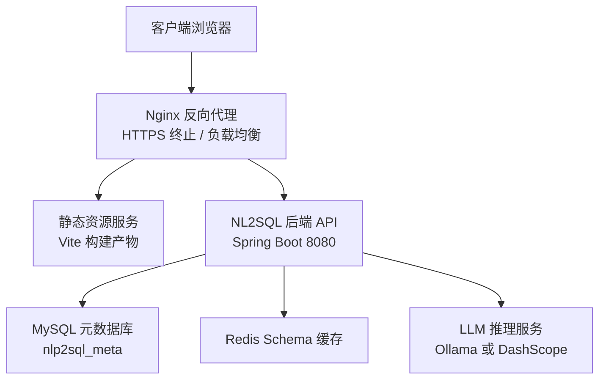
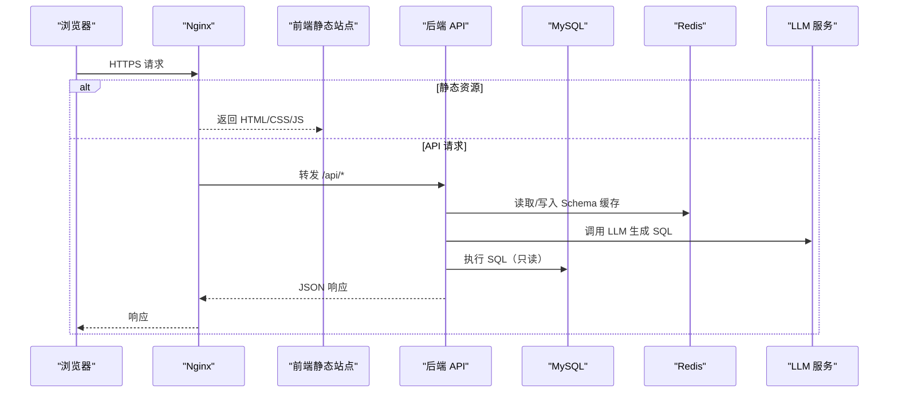
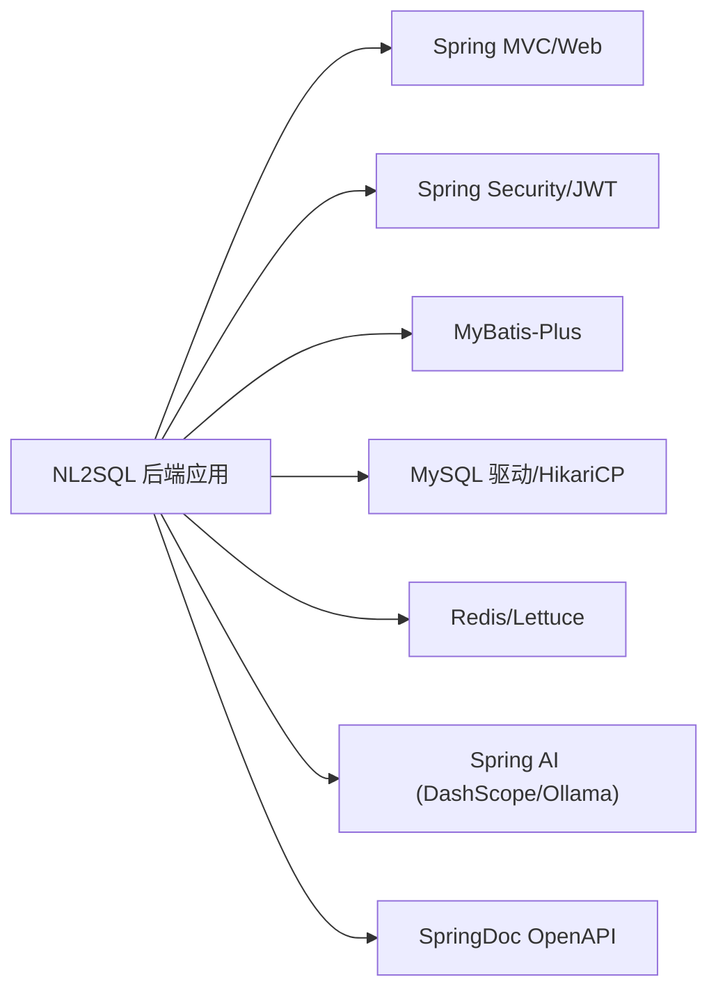

# 生产部署

<cite>
**本文引用的文件**   
- [pom.xml](file://backend/pom.xml)
- [application.yml](file://backend/src/main/resources/application.yml)
- [application-ollama.yml](file://backend/src/main/resources/application-ollama.yml)
- [init_backend.sql](file://sql/init_backend.sql)
- [technical_proposal.md](file://docs/technical_proposal.md)
- [package.json](file://frontend/package.json)
- [vite.config.js](file://frontend/vite.config.js)
</cite>

## 目录
1. [简介](#简介)
2. [项目结构](#项目结构)
3. [核心组件](#核心组件)
4. [架构总览](#架构总览)
5. [详细组件分析](#详细组件分析)
6. [依赖分析](#依赖分析)
7. [性能考虑](#性能考虑)
8. [故障排查指南](#故障排查指南)
9. [结论](#结论)
10. [附录](#附录)

## 简介
本文面向生产环境，提供 NL2SQL 智能查询系统的完整部署文档。内容覆盖：
- Docker 镜像构建与多阶段优化
- Kubernetes Deployment、Service、ConfigMap、Secret 清单编写建议
- Nginx 反向代理与负载均衡策略
- 环境变量与配置中心使用方式
- Prometheus/Grafana 监控与告警集成思路
- ELK/EFK 日志采集与集中化方案
- JVM 参数、连接池、缓存等性能优化
- 安全加固（SSL/TLS、网络安全策略、访问控制）
- 滚动更新、蓝绿与灰度发布策略

本仓库当前未包含 Dockerfile、Kubernetes YAML 和 Nginx 配置文件，本文基于现有后端、前端与 SQL 脚本给出可落地的生产部署方案与最佳实践。

**章节来源**
- [technical_proposal.md:1-128](file://docs/technical_proposal.md#L1-L128)

## 项目结构
系统由三部分组成：
- 后端：Spring Boot 3.3.4 + Java 17，使用 MyBatis-Plus、Redis、JWT、Spring AI（DashScope/Ollama）、OpenAPI
- 前端：Vue 3 + Vite + Element Plus，开发模式通过 Vite proxy 转发到后端
- 数据层：MySQL 元数据库初始化脚本，定义数据源、用户、审计日志表

**图表来源**
- [application.yml:1-117](file://backend/src/main/resources/application.yml#L1-L117)
- [technical_proposal.md:18-46](file://docs/technical_proposal.md#L18-L46)

**章节来源**
- [technical_proposal.md:72-128](file://docs/technical_proposal.md#L72-L128)
- [package.json:1-23](file://frontend/package.json#L1-L23)
- [vite.config.js:1-15](file://frontend/vite.config.js#L1-L15)
- [init_backend.sql:1-47](file://sql/init_backend.sql#L1-L47)

## 核心组件
- Spring Boot 后端应用：REST API、JWT 认证、NL2SQL 引擎、多数据源适配器、审计日志
- 前端静态站点：对话式交互界面
- 外部依赖：MySQL、Redis、LLM 服务（Ollama/DashScope）

关键运行时配置位于 application.yml，包括：
- Web 端口 8080、上下文路径
- MySQL 连接池（HikariCP）
- Redis（Lettuce 连接池）
- Jackson 序列化
- Spring AI（DashScope/Ollama）模型选项
- MyBatis-Plus 全局配置
- JWT 密钥与过期时间
- SQL 安全限制（最大行数、超时、重试）
- 提示词模板版本与 Schema 缓存 TTL
- OpenAPI 文档路径
- 日志级别与控制台输出格式

**章节来源**
- [application.yml:1-117](file://backend/src/main/resources/application.yml#L1-L117)

## 架构总览
下图展示生产环境的请求链路：浏览器经 Nginx 进入前端静态资源或后端 API；后端读取元数据库与 Redis 缓存，调用 LLM 生成 SQL，执行并返回结果，同时记录审计日志。

**图表来源**
- [application.yml:1-117](file://backend/src/main/resources/application.yml#L1-L117)
- [technical_proposal.md:29-46](file://docs/technical_proposal.md#L29-L46)

## 详细组件分析

### 后端容器化与多阶段构建
由于仓库未提供 Dockerfile，建议采用多阶段构建：
- 构建阶段：使用 Maven 镜像编译打包，生成可执行的 Fat Jar
- 运行阶段：使用精简的 JRE 基础镜像运行应用
- 安全基线：以非 root 用户运行，最小化暴露端口 8080

参考要点：
- 使用 spring-boot-maven-plugin 生成可执行包
- 通过环境变量注入敏感配置（如数据库密码、Redis 密码、JWT secret、LLM API Key）
- 健康检查端点可由 Spring Boot Actuator 提供（若启用）

**章节来源**
- [pom.xml:1-194](file://backend/pom.xml#L1-L194)

### Kubernetes 清单设计
建议资源对象：
- Deployment：管理后端 Pod 副本数、滚动更新策略、资源限制与探针
- Service：ClusterIP 暴露给 Ingress/Nginx，可选 NodePort/LoadBalancer 用于测试
- ConfigMap：非敏感配置（如 nlp2sql.model.provider、prompt.version、schema-cache.ttl-seconds、springdoc.api-docs.path 等）
- Secret：敏感信息（数据库账号密码、Redis 密码、JWT secret、DashScope API Key）

挂载方式：
- ConfigMap 作为环境变量或 Volume 挂载配置文件片段
- Secret 以环境变量形式注入，避免明文出现在 YAML

**章节来源**
- [application.yml:1-117](file://backend/src/main/resources/application.yml#L1-L117)

### Nginx 反向代理与负载均衡
建议：
- 在 Nginx 中终止 TLS，将 /api 转发至后端 Service
- 静态资源直接指向前端 Pod/Deployment 提供的静态文件
- 使用 upstream 与 keepalive 提升连接复用
- 对 LLM 调用与数据库访问做超时与重试控制

示例职责划分：
- 前端域名：静态资源与 SPA 路由
- API 域名：/api 反向代理到后端
- 管理接口：/swagger-ui.html 与 /api-docs 可按需开放或关闭

**章节来源**
- [application.yml:103-117](file://backend/src/main/resources/application.yml#L103-L117)

### 环境变量管理与配置中心
- 敏感项通过 Kubernetes Secret 注入为环境变量
- 非敏感项通过 ConfigMap 注入
- application.yml 支持占位符与环境变量替换（例如 DASHSCOPE_API_KEY）
- 如需统一配置中心，可在集群内部署 Apollo/Nacos/Vault，并通过 Sidecar 或 Agent 注入

环境变量映射建议：
- DATABASE_URL、DATABASE_USERNAME、DATABASE_PASSWORD
- REDIS_HOST、REDIS_PORT、REDIS_PASSWORD
- JWT_SECRET、JWT_EXPIRATION
- DASHSCOPE_API_KEY、NLP2SQL_MODEL_DASHSCOPE_MODEL
- OLLAMA_BASE_URL、NLP2SQL_MODEL_OLLAMA_MODEL

**章节来源**
- [application.yml:15-56](file://backend/src/main/resources/application.yml#L15-L56)
- [application.yml:89-102](file://backend/src/main/resources/application.yml#L89-L102)

### 监控与告警（Prometheus + Grafana）
- 在后端引入 Spring Boot Actuator 暴露 /actuator/metrics 与 /actuator/prometheus
- 使用 Prometheus 抓取后端指标
- Grafana 导入 JVM、Web、数据库连接池、Redis 等仪表盘
- 告警规则建议：
  - 后端错误率超过阈值
  - P95/P99 延迟升高
  - 数据库连接池耗尽或等待时间增加
  - Redis 内存或连接异常
  - LLM 调用失败率升高或延迟异常

**章节来源**
- [application.yml:1-117](file://backend/src/main/resources/application.yml#L1-L117)

### 日志收集（ELK/EFK）
- 应用输出结构化 JSON 日志，便于 EFK 解析
- 使用 Filebeat/Fluent Bit 采集 Pod 日志目录
- Elasticsearch 存储，Kibana 可视化，Logstash 进行字段清洗
- 建议按 traceId 关联一次会话的跨组件日志

**章节来源**
- [application.yml:108-117](file://backend/src/main/resources/application.yml#L108-L117)

### 性能优化
JVM 调优：
- 根据 Pod CPU/Memory 限制设置堆大小与 GC 参数
- 开启 ZGC 或 G1GC，合理设置 MaxGCPauseMillis
- 调整 Metaspace 与线程栈大小

连接池与缓存：
- HikariCP：maximum-pool-size 依据并发与数据库负载调整
- Lettuce：max-active/max-idle/min-idle 与 max-wait 匹配业务峰值
- Redis Schema 缓存 TTL 结合数据变更频率设置

其他：
- 开启 GZIP 压缩
- 合理使用 HTTP/2 与连接复用
- 限制单次查询最大行数与超时

**章节来源**
- [application.yml:18-37](file://backend/src/main/resources/application.yml#L18-L37)
- [application.yml:38-56](file://backend/src/main/resources/application.yml#L38-L56)
- [application.yml:80-91](file://backend/src/main/resources/application.yml#L80-L91)

### 安全加固
- 证书与加密：Nginx 终止 TLS，使用 ACME 自动续期
- 网络安全策略：仅允许必要端口入站，隔离命名空间
- 访问控制：JWT 鉴权，角色控制，SQL 安全检查（白名单、AST 校验、只读用户）
- 最小权限：数据库与 Redis 使用独立账号，禁止写权限
- 密钥管理：所有敏感信息通过 Secret 注入，不在镜像或代码中硬编码

**章节来源**
- [application.yml:72-88](file://backend/src/main/resources/application.yml#L72-L88)
- [technical_proposal.md:48-70](file://docs/technical_proposal.md#L48-L70)

### 发布策略：滚动更新、蓝绿与灰度
- 滚动更新：默认策略，逐步替换 Pod，配合 readiness/liveness 探针
- 蓝绿部署：两套 Deployment，切换 Service 选择器实现快速回滚
- 灰度发布：按 Header/Query 分流，小比例流量进入新版本，验证后全量

**章节来源**
- [technical_proposal.md:112-128](file://docs/technical_proposal.md#L112-L128)

## 依赖分析
后端构建与运行时依赖关系如下：

**图表来源**
- [pom.xml:1-194](file://backend/pom.xml#L1-L194)

**章节来源**
- [pom.xml:1-194](file://backend/pom.xml#L1-L194)

## 性能考虑
- 水平扩展：根据 QPS 与延迟目标扩副本数，注意数据库连接总数与连接池上限
- 缓存优先：Schema 缓存命中率高可降低 LLM 与数据库压力
- 限流与降级：对 LLM 调用增加熔断与超时保护
- 数据库索引：为审计日志与高频查询字段建立索引
- 前端优化：静态资源 CDN 加速，开启 HTTP/2 与缓存头

[本节为通用指导，不直接分析具体文件]

## 故障排查指南
常见问题与定位方法：
- 启动失败：检查数据库、Redis、LLM 连通性与凭据是否正确注入
- 认证失败：核对 JWT secret 与 token 有效期
- SQL 被拦截：查看 SQL 安全检查规则与白名单
- 性能抖动：观察连接池、GC、LLM 延迟与数据库慢查询
- 前端无法联调：确认 Vite proxy 与 Nginx 转发路径一致

可关注配置项：
- server.port/context-path
- datasource URL/用户名/密码/连接池
- redis host/port/password
- jwt.secret/expiration
- ai.dashscope/api-key, ai.ollama/base-url
- sql-security.max-limit/query-timeout-seconds/max-retry
- logging.level/pattern

**章节来源**
- [application.yml:1-117](file://backend/src/main/resources/application.yml#L1-L117)

## 结论
本文提供了从容器化、编排、反向代理、配置管理到监控、日志、性能与安全的全链路生产部署方案。结合现有后端与前端工程，建议在 CI/CD 流水线中完成镜像构建、Kubernetes 清单渲染与发布，配合滚动更新与灰度策略保障上线质量。

[本节为总结性内容，不直接分析具体文件]

## 附录

### 数据准备
- 执行 MySQL 初始化脚本创建元数据库与表结构
- 按需导入示例数据

**章节来源**
- [init_backend.sql:1-47](file://sql/init_backend.sql#L1-L47)

### 前端开发与构建
- 开发：Vite 本地服务与代理后端 API
- 构建：Vite 构建静态资源，部署至 Nginx 或对象存储

**章节来源**
- [package.json:1-23](file://frontend/package.json#L1-L23)
- [vite.config.js:1-15](file://frontend/vite.config.js#L1-L15)