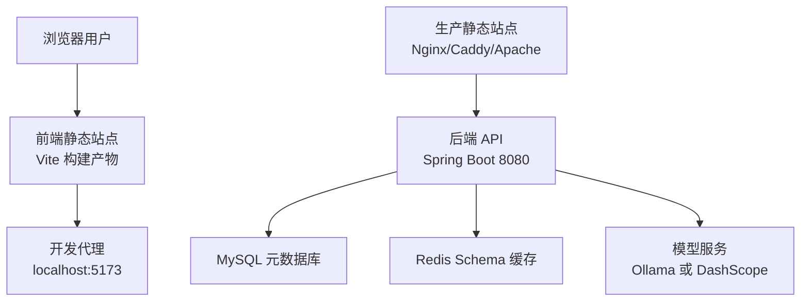
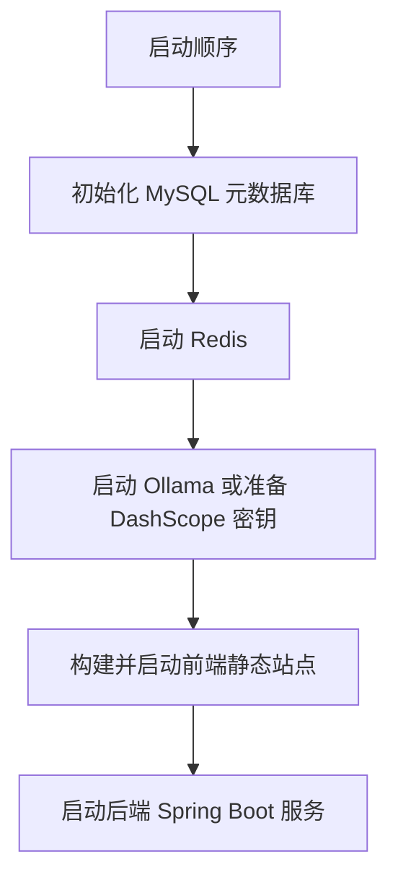
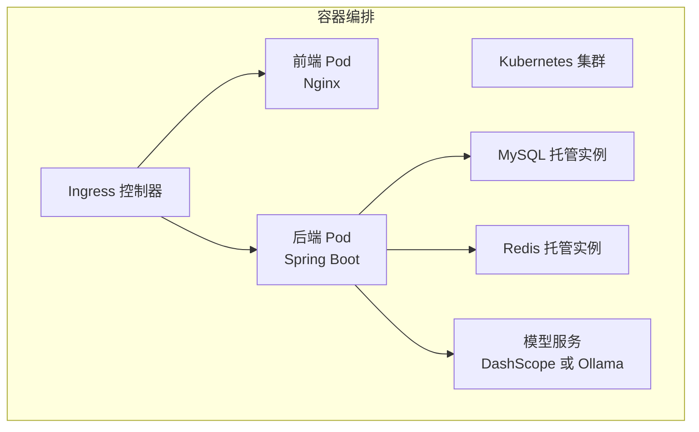
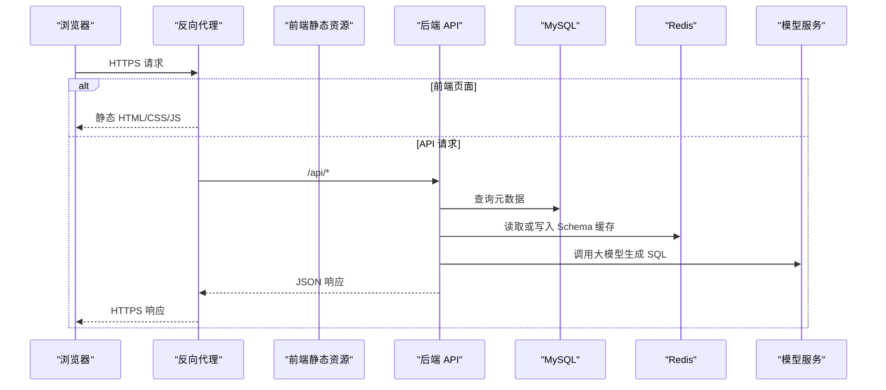
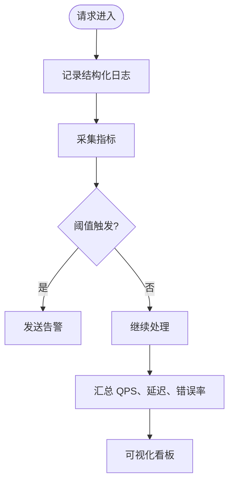
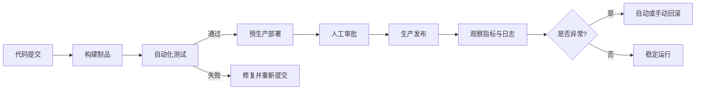
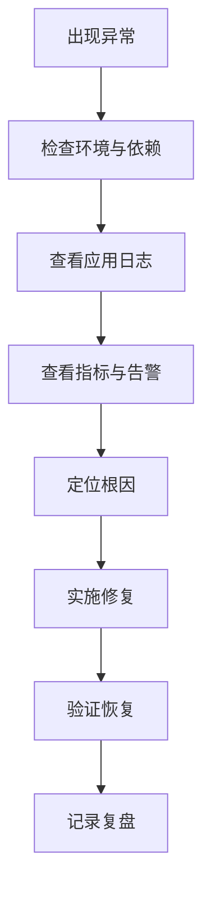

# 部署指南

<cite>
**本文引用的文件**
- [pom.xml](file://backend/pom.xml)
- [application.yml](file://backend/src/main/resources/application.yml)
- [application-ollama.yml](file://backend/src/main/resources/application-ollama.yml)
- [init_backend.sql](file://sql/init_backend.sql)
- [technical_proposal.md](file://docs/technical_proposal.md)
- [test_report.md](file://docs/test_report.md)
- [package.json](file://frontend/package.json)
- [vite.config.js](file://frontend/vite.config.js)
</cite>

## 目录
1. [简介](#简介)
2. [项目结构与运行边界](#项目结构与运行边界)
3. [环境差异与部署策略](#环境差异与部署策略)
4. [容器化与编排方案](#容器化与编排方案)
5. [负载均衡、反向代理与证书](#负载均衡反向代理与证书)
6. [监控告警、日志收集与性能分析](#监控告警日志收集与性能分析)
7. [CI/CD 流水线与自动化部署](#cicd-流水线与自动化部署)
8. [高可用架构与灾难恢复](#高可用架构与灾难恢复)
9. [容量规划与性能调优](#容量规划与性能调优)
10. [故障排查手册](#故障排查手册)
11. [结论](#结论)

## 简介
本部署指南面向 NL2SQL 智能查询系统的开发、测试和生产环境，覆盖后端 Java Spring Boot 服务、前端 Vue 静态资源、MySQL 元数据库、Redis 缓存、Ollama 或 DashScope 模型服务的部署差异、容器化、编排、安全接入、可观测性、CI/CD、高可用与容灾、容量规划及运维排错。

系统当前技术栈包括：
- 后端：Java 17 + Spring Boot 3.3.4 + MyBatis-Plus + Redis + JWT + JSqlParser + Spring AI（DashScope / Ollama）。
- 前端：Vue 3 + Vite + Element Plus。
- 数据层：MySQL 8.0 作为元数据库，Redis 7.x 用于 Schema 缓存。
- 模型层：本地 Ollama 或云端 DashScope（通义千问）两种模式。

**图示来源**
- [technical_proposal.md:22-48](file://docs/technical_proposal.md#L22-L48)
- [technical_proposal.md:78-128](file://docs/technical_proposal.md#L78-L128)
- [vite.config.js:1-15](file://frontend/vite.config.js#L1-L15)
- [application.yml:1-117](file://backend/src/main/resources/application.yml#L1-L117)

## 项目结构与运行边界
NL2SQL 系统由前后端分离的 Web 应用组成，后端暴露 REST API，前端通过 HTTP 调用后端接口完成自然语言到 SQL 的转换和结果展示。

- 后端服务
  - 进程：Spring Boot 内嵌 Tomcat，默认监听 8080 端口。
  - 依赖：MySQL 元数据库、Redis 缓存、模型服务（Ollama 或 DashScope）。
  - 配置：`application.yml` 集中管理数据源、Redis、AI 模型、JWT、MyBatis-Plus、日志等。
- 前端应用
  - 开发：Vite 开发服务器在 5173 端口，并将 `/api` 请求代理到 `http://localhost:8080`。
  - 生产：Vite 构建生成静态资源，通常由 Nginx/Caddy/Apache 提供。
- 数据与缓存
  - MySQL 初始化脚本位于 `sql/init_backend.sql`，创建元数据库与核心表。
  - Redis 用于 Schema 缓存，提升元数据读取性能。
- 模型服务
  - Ollama：本地推理，默认地址 `http://localhost:11434`。
  - DashScope：云端大模型，需要环境变量 `DASHSCOPE_API_KEY`。

**图示来源**
- [technical_proposal.md:78-128](file://docs/technical_proposal.md#L78-L128)
- [application.yml:1-117](file://backend/src/main/resources/application.yml#L1-L117)

**章节来源**
- [technical_proposal.md:22-48](file://docs/technical_proposal.md#L22-L48)
- [technical_proposal.md:78-128](file://docs/technical_proposal.md#L78-L128)
- [application.yml:1-117](file://backend/src/main/resources/application.yml#L1-L117)
- [vite.config.js:1-15](file://frontend/vite.config.js#L1-L15)
- [init_backend.sql:1-47](file://sql/init_backend.sql#L1-L47)

## 环境差异与部署策略
### 环境角色
| 环境 | 用途 | 典型访问方式 | 安全等级 | 数据要求 |
|---|---|---|---|---|
| 开发环境 | 本地功能联调、快速迭代 | `localhost:5173` 前端 + `localhost:8080` 后端 | 低 | 本地 MySQL、Redis、Ollama |
| 测试环境 | 集成测试、回归验证 | 内部域名或 IP 访问 | 中 | 独立 MySQL、Redis、隔离模型服务 |
| 生产环境 | 对外提供服务 | HTTPS 域名访问 | 高 | 高可用 MySQL、Redis、受控模型服务 |

### 关键差异点
- 模型服务
  - 开发：优先使用本地 Ollama，便于调试 Prompt 与模型输出。
  - 测试：可继续使用 Ollama，也可切换 DashScope 验证网络与密钥。
  - 生产：推荐 DashScope 云模型；若必须本地模型，需专用 GPU 节点与资源隔离。
- 数据库与缓存
  - 所有环境都应使用独立实例或命名空间隔离。
  - 生产建议启用主从复制、备份与只读副本。
- 安全配置
  - 开发：JWT secret 可使用默认值，但禁止提交到仓库。
  - 测试：应替换为测试密钥，关闭不必要的调试接口。
  - 生产：JWT secret、数据库密码、Redis 密码、API Key 全部通过外部密钥管理注入。
- 日志级别
  - 开发：DEBUG。
  - 测试：INFO。
  - 生产：WARN 或 INFO，避免过细日志影响性能。

**章节来源**
- [technical_proposal.md:78-128](file://docs/technical_proposal.md#L78-L128)
- [test_report.md:1-20](file://docs/test_report.md#L1-L20)
- [application.yml:1-117](file://backend/src/main/resources/application.yml#L1-L117)

## 容器化与编排方案
### 后端容器化建议
- 基础镜像：使用官方 OpenJDK 17 精简镜像。
- 构建阶段：基于 Maven 构建 Spring Boot 可执行包。
- 运行阶段：仅运行 Jar，不安装额外工具。
- 健康检查：实现 Spring Boot Actuator 或自定义健康检查端点，供容器编排探测。
- 资源限制：设置 CPU 和内存 Limit，防止单实例耗尽宿主资源。
- 配置外置：将 `application.yml` 中的敏感信息改为环境变量注入，例如：
  - `spring.datasource.url`
  - `spring.datasource.username`
  - `spring.datasource.password`
  - `spring.data.redis.host`
  - `spring.data.redis.port`
  - `spring.data.redis.password`
  - `DASHSCOPE_API_KEY`
  - `nlp2sql.model.dashscope-model`
  - `nlp2sql.model.ollama-model`

### 前端容器化建议
- 构建阶段：Node 镜像执行 `npm install && npm run build`，产出静态资源。
- 运行阶段：使用 Nginx/Caddy/Apache 镜像托管静态文件。
- 多阶段构建：减少最终镜像体积，避免保留源码和依赖缓存。

### 编排建议
- 推荐使用 Kubernetes Deployment + Service + Ingress。
- 使用 ConfigMap 存放非敏感配置，Secret 存放密钥。
- 使用 HorizontalPodAutoscaler 根据 CPU、内存或自定义指标扩容。
- 使用 PodDisruptionBudget 保障滚动更新时可用性。
- 使用 PersistentVolume 挂载 MySQL、Redis 持久化存储（生产级建议直接使用托管数据库与托管缓存）。

**图示来源**
- [technical_proposal.md:22-48](file://docs/technical_proposal.md#L22-L48)
- [application.yml:1-117](file://backend/src/main/resources/application.yml#L1-L117)

## 负载均衡、反向代理与证书
### 反向代理职责
- 终止 HTTPS 证书。
- 统一入口路径，如 `/api` 转发到后端，根路径或 `/chat` 指向前端静态资源。
- 限流、访问控制、IP 白名单、请求大小限制。
- 压缩、缓存静态资源、Gzip/Brotli。
- 健康检查与优雅退出。

### 代理路由建议
- `/api/**` → 后端 Spring Boot。
- `/swagger-ui.html`、`/api-docs` → 仅在开发和测试环境开放。
- 其他路径 → 前端静态页面。

### SSL 证书
- 建议使用 Let’s Encrypt 自动续期，或使用企业证书管理方案。
- 证书私钥通过 Secret 或密钥管理服务注入，不放入镜像。
- 强制 HTTPS，HTTP 自动跳转到 HTTPS。
- 前端静态资源也通过 HTTPS 加载，避免混合内容问题。

**图示来源**
- [technical_proposal.md:22-48](file://docs/technical_proposal.md#L22-L48)
- [application.yml:1-117](file://backend/src/main/resources/application.yml#L1-L117)

## 监控告警、日志收集与性能分析
### 可观测性分层
- 基础设施监控：CPU、内存、磁盘、网络、容器状态。
- 应用监控：QPS、延迟、错误率、线程池、连接池、GC。
- 业务监控：NL2SQL 成功率、SQL 拦截率、模型调用耗时、Schema 缓存命中率。
- 日志：结构化日志，包含 traceId、用户、数据源、输入、生成 SQL、校验结果、执行耗时。
- 链路追踪：结合 Spring Cloud Sleuth 或自研 TraceIdFilter 贯穿请求链路。

### 日志采集
- 后端日志输出到标准输出或文件，由容器运行时或日志代理统一采集。
- 建议按模块拆分日志级别，生产关闭 DEBUG。
- 审计日志写入 MySQL `audit_logs` 表，支持按用户、时间、数据源检索。

### 性能分析
- JVM 参数：开启 G1GC，合理设置堆大小、Metaspace。
- 连接池：HikariCP 最大连接数、最小空闲连接需根据并发调整。
- Redis：连接池大小、超时、重试策略。
- 模型调用：超时、重试、熔断降级、缓存热点 Schema。

## CI/CD 流水线与自动化部署
### 开发阶段
- 代码提交后触发单元测试、静态检查、代码格式校验。
- 构建前端与后端制品。
- 推送至开发环境镜像仓库。

### 测试阶段
- 拉取开发镜像，部署到测试环境。
- 执行接口自动化测试、SQL 安全测试、性能基准测试。
- 生成测试报告并归档。

### 预生产与生产阶段
- 手动或审批后发布。
- 灰度发布或多版本共存。
- 滚动更新，失败自动回滚。
- 发布后自动验证健康检查与冒烟用例。

## 高可用架构与灾难恢复
### 高可用设计
- 后端无状态，多实例横向扩展。
- MySQL 采用主从或高可用版托管数据库，读写分离可选。
- Redis 使用集群或哨兵模式，保证缓存高可用。
- 模型服务：云端 DashScope 自带高可用；本地 Ollama 需多实例+负载均衡。
- 反向代理多实例，避免单点故障。

### 灾难恢复
- 数据库每日全量备份，增量日志实时同步。
- 备份数据异地存储，定期演练恢复。
- 缓存可重建，以数据库元数据为准。
- 模型服务不可用时，返回降级提示或队列异步重试。
- 制定 RTO/RPO 目标，明确恢复流程与责任人。

## 容量规划与性能调优
### 容量规划维度
- 并发用户数、峰值 QPS。
- NL2SQL 平均响应时间、模型推理耗时。
- 数据库连接数、慢查询数量。
- Redis 内存使用、命中率。
- 模型服务吞吐、GPU 利用率。

### 调优建议
- 后端
  - 调整 HikariCP 连接池大小，避免数据库连接耗尽。
  - 调整 Redis Lettuce 连接池，避免缓存连接阻塞。
  - 调整 Spring AI 调用超时与重试次数。
  - 调整日志级别，生产关闭 DEBUG。
- 前端
  - 启用静态资源缓存与压缩。
  - 按需加载组件，减少首屏体积。
- 模型
  - 缓存热点 Schema，降低重复请求。
  - 对长上下文请求进行分批或摘要压缩。

**章节来源**
- [application.yml:1-117](file://backend/src/main/resources/application.yml#L1-L117)
- [technical_proposal.md:22-48](file://docs/technical_proposal.md#L22-L48)
- [test_report.md:80-108](file://docs/test_report.md#L80-L108)

## 故障排查手册
### 常见问题定位
- 后端无法启动
  - 检查 MySQL、Redis、模型服务连通性。
  - 检查 JWT secret、数据库密码、Redis 密码、API Key 是否正确注入。
  - 查看 Spring Boot 启动日志，确认配置文件是否加载正确 profile。
- 认证失败
  - 检查 JWT 过期时间、密钥一致性。
  - 检查前端是否正确携带 Authorization 头。
- SQL 被拒绝
  - 检查 SQL 安全策略，是否命中黑名单或 AST 校验。
  - 查看审计日志表，确认拦截原因。
- 模型调用失败
  - Ollama：检查本地服务是否运行、端口、模型名称。
  - DashScope：检查 `DASHSCOPE_API_KEY` 和网络连通性。
- 性能退化
  - 检查数据库慢查询、连接池耗尽。
  - 检查 Redis 内存与命中率。
  - 检查模型调用超时与重试风暴。

**章节来源**
- [application.yml:1-117](file://backend/src/main/resources/application.yml#L1-L117)
- [init_backend.sql:1-47](file://sql/init_backend.sql#L1-L47)
- [technical_proposal.md:22-48](file://docs/technical_proposal.md#L22-L48)

## 结论
NL2SQL 系统的部署应以“配置外置、密钥隔离、容器化、编排化、可观测化”为核心原则。开发、测试、生产环境应在模型服务、数据安全、日志级别、访问控制等方面严格区分。生产环境推荐采用反向代理+HTTPS、无状态后端多实例、托管数据库与缓存、云端模型服务，并结合监控告警、日志采集、链路追踪形成闭环运维能力。CI/CD 应覆盖构建、测试、灰度、发布与回滚，确保变更可控、风险可降、故障可恢复。