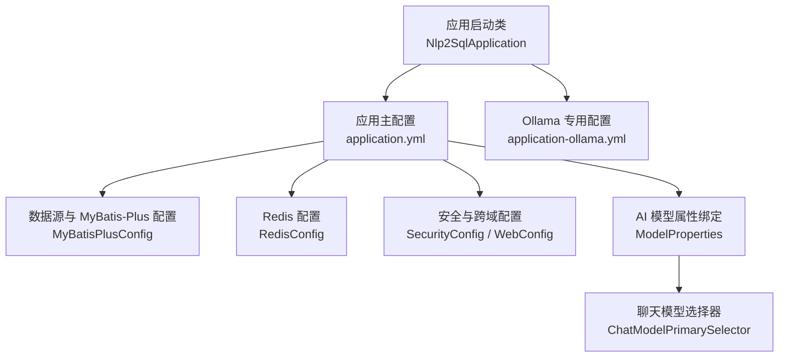
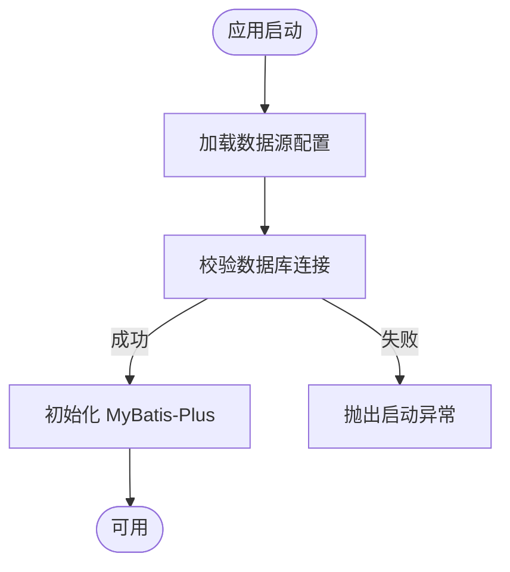
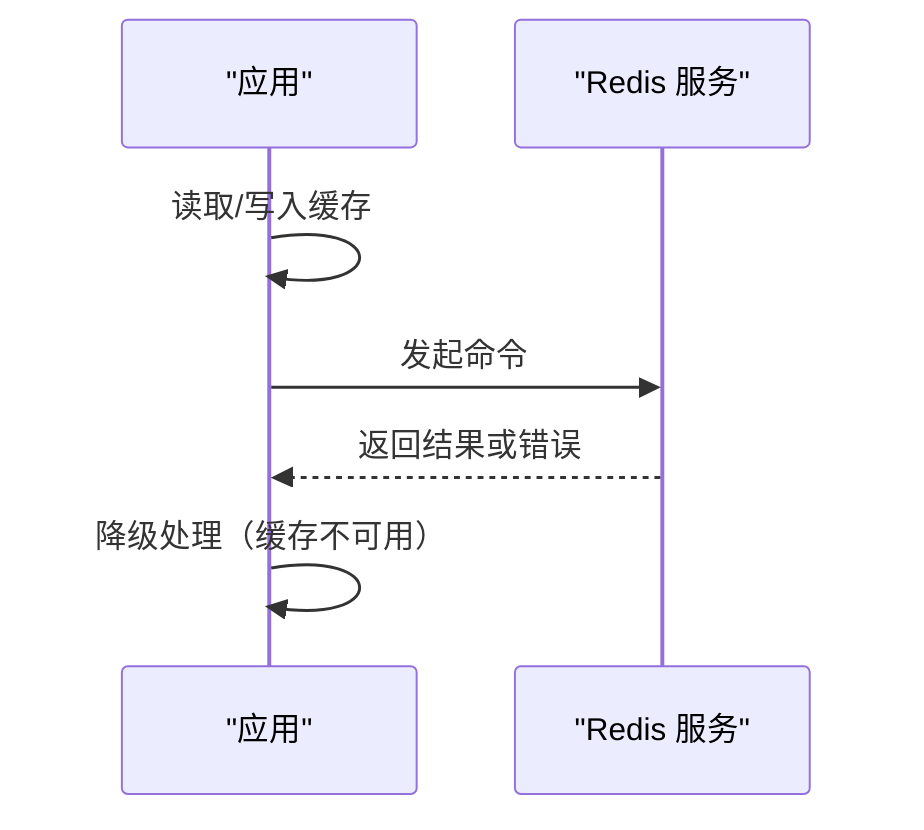
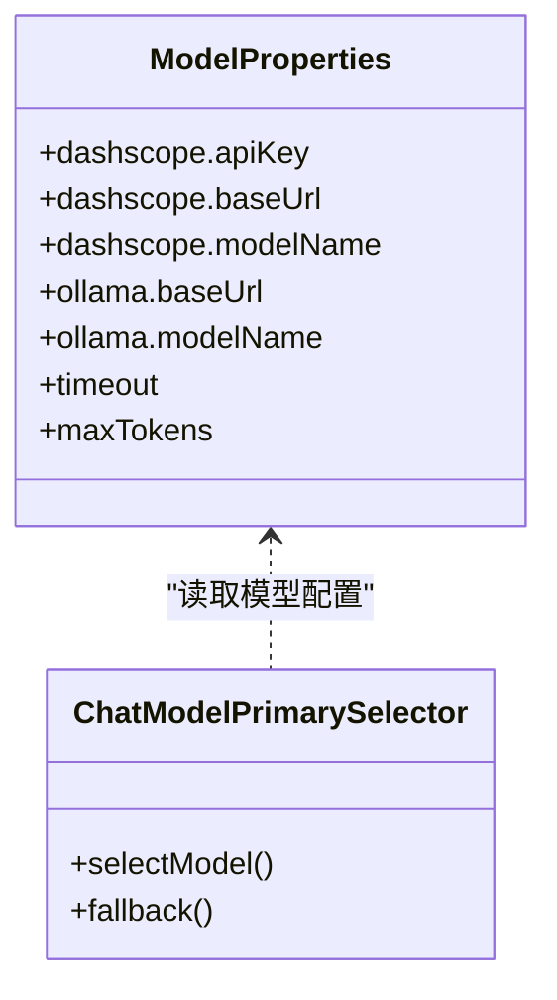
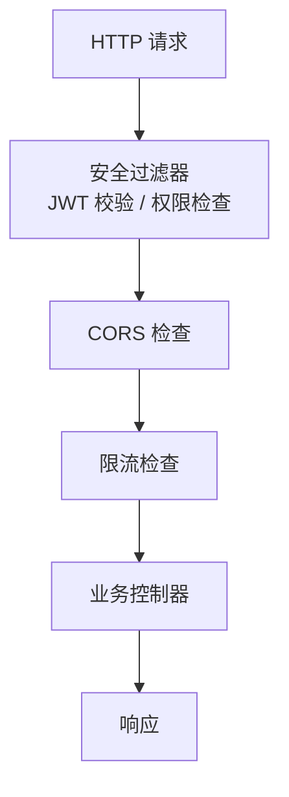
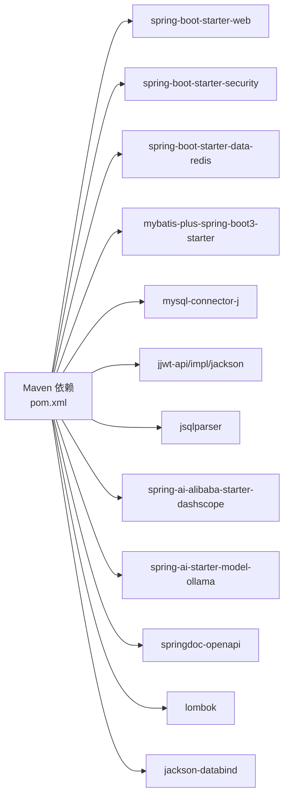

# 配置指南

<cite>
**本文引用的文件**   
- [pom.xml](file://backend/pom.xml)
- [application.yml](file://backend/backend/src/main/resources/backend/src/main/resources/application.yml)
- [application-ollama.yml](file://backend/backend/src/main/resources/backend/src/main/resources/application-ollama.yml)
- [ModelProperties.java](file://backend/backend/src/main/java/com/nlp2sql/config/ModelProperties.java)
- [RedisConfig.java](file://backend/backend/src/main/java/com/nlp2sql/config/RedisConfig.java)
- [SecurityConfig.java](file://backend/backend/src/main/java/com/nlp2sql/config/SecurityConfig.java)
- [WebConfig.java](file://backend/backend/src/main/java/com/nlp2sql/config/WebConfig.java)
- [MyBatisPlusConfig.java](file://backend/backend/src/main/java/com/nlp2sql/config/MyBatisPlusConfig.java)
- [ChatModelPrimarySelector.java](file://backend/backend/src/main/java/com/nlp2sql/config/ChatModelPrimarySelector.java)
- [Nlp2SqlApplication.java](file://backend/backend/src/main/java/com/nlp2sql/Nlp2SqlApplication.java)
</cite>

## 目录
1. [引言](#引言)
2. [项目结构与配置文件位置](#项目结构与配置文件位置)
3. [应用配置总览与加载策略](#应用配置总览与加载策略)
4. [外部服务配置](#外部服务配置)
5. [安全、跨域与访问控制配置](#安全跨域与访问控制配置)
6. [环境差异化配置](#环境差异化配置)
7. [配置验证、默认值与最佳实践](#配置验证默认值与最佳实践)
8. [热更新与灰度发布策略](#热更新与灰度发布策略)
9. [依赖关系分析](#依赖关系分析)
10. [故障排查清单](#故障排查清单)
11. [结论](#结论)

## 引言
本指南聚焦 NL2SQL 后端应用的配置管理，覆盖以下主题：
- 配置文件结构、参数含义与优先级
- 环境变量与配置文件的管理策略
- 数据库连接、Redis 缓存、AI 模型等外部服务的配置方法
- 开发、测试、生产环境的差异化配置建议
- 安全配置、CORS、限流等安全相关设置
- 配置验证与默认值管理
- 热更新与灰度发布策略

该指南面向运维、后端开发与平台工程人员，帮助快速定位并正确调整系统行为。

## 项目结构与配置文件位置
本项目基于 Spring Boot 3 构建，核心依赖包括 Web、Security、Data Redis、MyBatis-Plus、Spring AI（DashScope 与 Ollama）、JWT、JSqlParser 等。配置文件位于 resources 目录下，采用 YAML 格式，并通过 Spring Profile 实现环境隔离。

图表来源
- [Nlp2SqlApplication.java](file://backend/backend/src/main/java/com/nlp2sql/Nlp2SqlApplication.java)
- [application.yml](file://backend/backend/src/main/resources/backend/src/main/resources/application.yml)
- [application-ollama.yml](file://backend/backend/src/main/resources/backend/src/main/resources/application-ollama.yml)
- [MyBatisPlusConfig.java](file://backend/backend/src/main/java/com/nlp2sql/config/MyBatisPlusConfig.java)
- [RedisConfig.java](file://backend/backend/src/main/java/com/nlp2sql/config/RedisConfig.java)
- [SecurityConfig.java](file://backend/backend/src/main/java/com/nlp2sql/config/SecurityConfig.java)
- [WebConfig.java](file://backend/backend/src/main/java/com/nlp2sql/config/WebConfig.java)
- [ModelProperties.java](file://backend/backend/src/main/java/com/nlp2sql/config/ModelProperties.java)
- [ChatModelPrimarySelector.java](file://backend/backend/src/main/java/com/nlp2sql/config/ChatModelPrimarySelector.java)

章节来源
- [pom.xml:1-194](file://backend/pom.xml#L1-L194)

## 应用配置总览与加载策略
- 配置文件类型
  - application.yml：主配置，承载通用运行参数、外部服务地址、日志与安全基础设置。
  - application-ollama.yml：针对本地 Ollama 模型的额外或覆盖配置，通过 Spring Profile 激活。
- 加载优先级（由低到高）
  - 包内默认配置
  - 共享配置 application.yml
  - Profile 专属配置 application-{profile}.yml
  - 命令行参数
  - 环境变量
  - 外部化配置中心（若引入）
- Profile 使用建议
  - development：本地调试、宽松安全策略、详细日志
  - testing：单元测试与集成测试数据源、Mock 外部服务
  - production：严格安全策略、性能调优、最小日志输出
- 环境变量注入
  - 推荐将敏感信息（数据库密码、密钥、Token、Redis 密码）以环境变量形式注入
  - 在 YAML 中通过占位符引用环境变量，避免明文落盘

章节来源
- [application.yml](file://backend/backend/src/main/resources/backend/src/main/resources/application.yml)
- [application-ollama.yml](file://backend/backend/src/main/resources/backend/src/main/resources/application-ollama.yml)

## 外部服务配置

### 数据库连接与 MyBatis-Plus
- 配置要点
  - 数据源 URL、用户名、密码、驱动类
  - 连接池大小、超时、重试等连接参数
  - MyBatis-Plus 的 Mapper 扫描路径、分页插件、逻辑删除等开关
- 典型参数说明
  - spring.datasource.*：JDBC 连接、连接池参数
  - mybatis-plus.*：Mapper 扫描、全局配置、分页、审计等
- 建议
  - 生产环境启用连接池监控
  - 使用只读账号暴露给查询场景
  - SQL 日志仅在开发环境开启

图表来源
- [MyBatisPlusConfig.java](file://backend/backend/src/main/java/com/nlp2sql/config/MyBatisPlusConfig.java)
- [application.yml](file://backend/backend/src/main/resources/backend/src/main/resources/application.yml)

章节来源
- [MyBatisPlusConfig.java](file://backend/backend/src/main/java/com/nlp2sql/config/MyBatisPlusConfig.java)
- [application.yml](file://backend/backend/src/main/resources/backend/src/main/resources/application.yml)

### Redis 缓存
- 配置要点
  - 主机、端口、密码、数据库索引、SSL/TLS（如需要）
  - 连接池大小、超时、重连策略
- 典型参数说明
  - spring.data.redis.*：连接、序列化、超时、连接池
- 建议
  - 为不同业务命名空间划分 DB 或 Key 前缀
  - 生产环境启用集群或哨兵模式（根据部署架构）
  - 对热点 Key 设置过期时间，避免内存泄漏

图表来源
- [RedisConfig.java](file://backend/backend/src/main/java/com/nlp2sql/config/RedisConfig.java)
- [application.yml](file://backend/backend/src/main/resources/backend/src/main/resources/application.yml)

章节来源
- [RedisConfig.java](file://backend/backend/src/main/java/com/nlp2sql/config/RedisConfig.java)
- [application.yml](file://backend/backend/src/main/resources/backend/src/main/resources/application.yml)

### AI 模型与提示词
- 支持的后端
  - DashScope（通义千问）：通过 Spring AI Alibaba Starter 接入
  - Ollama：本地模型推理，适合离线或私有部署
- 配置要点
  - API Key、Base URL、模型名称、温度、最大 Token、超时
  - 多模型时通过 ModelProperties 与 ChatModelPrimarySelector 进行切换与选择
- 建议
  - 生产环境配置请求重试与熔断
  - 对敏感输入进行脱敏后再发送给模型
  - 通过 Profile 区分在线与本地模型

图表来源
- [ModelProperties.java](file://backend/backend/src/main/java/com/nlp2sql/config/ModelProperties.java)
- [ChatModelPrimarySelector.java](file://backend/backend/src/main/java/com/nlp2sql/config/ChatModelPrimarySelector.java)
- [application.yml](file://backend/backend/src/main/resources/backend/src/main/resources/application.yml)
- [application-ollama.yml](file://backend/backend/src/main/resources/backend/src/main/resources/application-ollama.yml)

章节来源
- [ModelProperties.java](file://backend/backend/src/main/java/com/nlp2sql/config/ModelProperties.java)
- [ChatModelPrimarySelector.java](file://backend/backend/src/main/java/com/nlp2sql/config/ChatModelPrimarySelector.java)
- [application.yml](file://backend/backend/src/main/resources/backend/src/main/resources/application.yml)
- [application-ollama.yml](file://backend/backend/src/main/resources/backend/src/main/resources/application-ollama.yml)

## 安全、跨域与访问控制配置
- JWT 认证
  - 令牌签发、校验、刷新、黑名单（可选）
  - 建议结合 Redis 做会话管理与注销
- 接口权限
  - 基于角色的访问控制（RBAC），按控制器或方法粒度授权
- CORS 跨域
  - 明确允许的 Origin、方法、头、凭证
  - 生产环境仅放行前端域名
- 限流
  - 建议基于网关或 Redis + 注解实现接口级限流
  - 对登录、验证码等接口实施更严格的限制
- 其他安全
  - SQL 注入防护：JSqlParser 校验生成的 SQL
  - 输入校验：统一使用 Bean Validation
  - 日志脱敏：隐藏密码、Token、手机号等敏感字段

图表来源
- [SecurityConfig.java](file://backend/backend/src/main/java/com/nlp2sql/config/SecurityConfig.java)
- [WebConfig.java](file://backend/backend/src/main/java/com/nlp2sql/config/WebConfig.java)

章节来源
- [SecurityConfig.java](file://backend/backend/src/main/java/com/nlp2sql/config/SecurityConfig.java)
- [WebConfig.java](file://backend/backend/src/main/java/com/nlp2sql/config/WebConfig.java)

## 环境差异化配置
- 推荐 Profile
  - development：详细日志、宽松跨域、本地模型或 Mock
  - testing：测试数据源、禁用部分外部调用
  - production：严格安全策略、生产数据源、性能优化
- 差异项示例
  - 数据库连接串、用户、密码
  - Redis 地址、密码、集群模式
  - AI 模型 Provider、API Key、Base URL
  - 日志级别、采样率、审计开关
- 管理策略
  - 将敏感配置放入环境变量或密钥管理系统
  - 使用 CI/CD 注入不同环境的配置
  - 通过 Docker 环境变量或 Kubernetes ConfigMap/Secret 下发

章节来源
- [application.yml](file://backend/backend/src/main/resources/backend/src/main/resources/application.yml)
- [application-ollama.yml](file://backend/backend/src/main/resources/backend/src/main/resources/application-ollama.yml)

## 配置验证、默认值与最佳实践
- 配置验证
  - 使用 Bean Validation 对关键配置进行校验
  - 启动阶段校验必填项（如数据库、Redis、AI Key）
- 默认值管理
  - 为可空参数提供合理默认值，提升可用性
  - 默认值应与安全基线一致（例如默认关闭不必要的跨域）
- 最佳实践
  - 将配置分类：基础设施、安全、业务、外部服务
  - 为每个模块维护独立配置段，便于扩展与维护
  - 禁止在代码中硬编码密钥与地址
  - 对外部服务增加超时、重试、熔断、降级

章节来源
- [application.yml](file://backend/backend/src/main/resources/backend/src/main/resources/application.yml)
- [application-ollama.yml](file://backend/backend/src/main/resources/backend/src/main/resources/application-ollama.yml)

## 热更新与灰度发布策略
- 热更新
  - 可使用 Spring Cloud Config 或 Nacos/Apollo 等配置中心
  - 对于非敏感配置，可通过监听配置变更事件刷新局部组件（如 Redis 连接池、跨域白名单）
  - 敏感配置（如密钥）不建议热更新，应重启受影响的进程或滚动更新
- 灰度发布
  - 通过 Feature Flag 控制新配置生效范围（按用户、租户、地域）
  - 逐步放量观察指标（错误率、延迟、模型调用成功率）
  - 回滚策略：一键切换旧配置或旧模型版本

章节来源
- [application.yml](file://backend/backend/src/main/resources/backend/src/main/resources/application.yml)
- [application-ollama.yml](file://backend/backend/src/main/resources/backend/src/main/resources/application-ollama.yml)

## 依赖关系分析
后端依赖包含 Spring Boot Web、Security、Data Redis、MyBatis-Plus、Spring AI（DashScope/Ollama）、JWT、JSqlParser、SpringDoc、Lombok、Jackson 等。这些依赖决定了运行时可用的配置项与能力边界。

图表来源
- [pom.xml:1-194](file://backend/pom.xml#L1-L194)

章节来源
- [pom.xml:1-194](file://backend/pom.xml#L1-L194)

## 故障排查清单
- 无法连接数据库
  - 检查数据源 URL、用户名、密码、网络连通性、防火墙规则
  - 查看连接池状态与最大连接数是否耗尽
- Redis 连接失败
  - 核对主机、端口、密码、DB 索引
  - 检查 Redis 服务状态、集群/哨兵配置
- AI 模型调用失败
  - 校验 API Key、Base URL、模型名称、网络可达性
  - 查看超时、重试、配额与速率限制
- 安全拦截或跨域报错
  - 确认 JWT 配置、角色权限、CORS 白名单
  - 检查请求头与 Cookie 携带情况
- 日志过多或过少
  - 调整日志级别与采样率
  - 区分开发、测试、生产日志策略

章节来源
- [application.yml](file://backend/backend/src/main/resources/backend/src/main/resources/application.yml)
- [application-ollama.yml](file://backend/backend/src/main/resources/backend/src/main/resources/application-ollama.yml)

## 结论
通过将应用配置结构化、敏感信息外部化、Profile 隔离环境与关键外部服务集中管理，NL2SQL 后端能够在不同环境下稳定运行，并在安全、性能与可维护性之间取得平衡。建议在持续集成中自动化配置校验与冒烟测试，配合配置中心与灰度发布流程，降低上线风险。