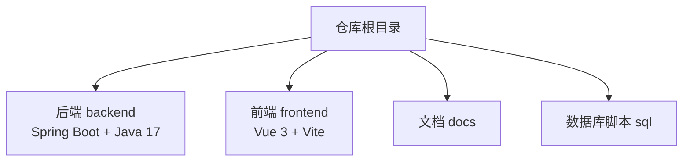
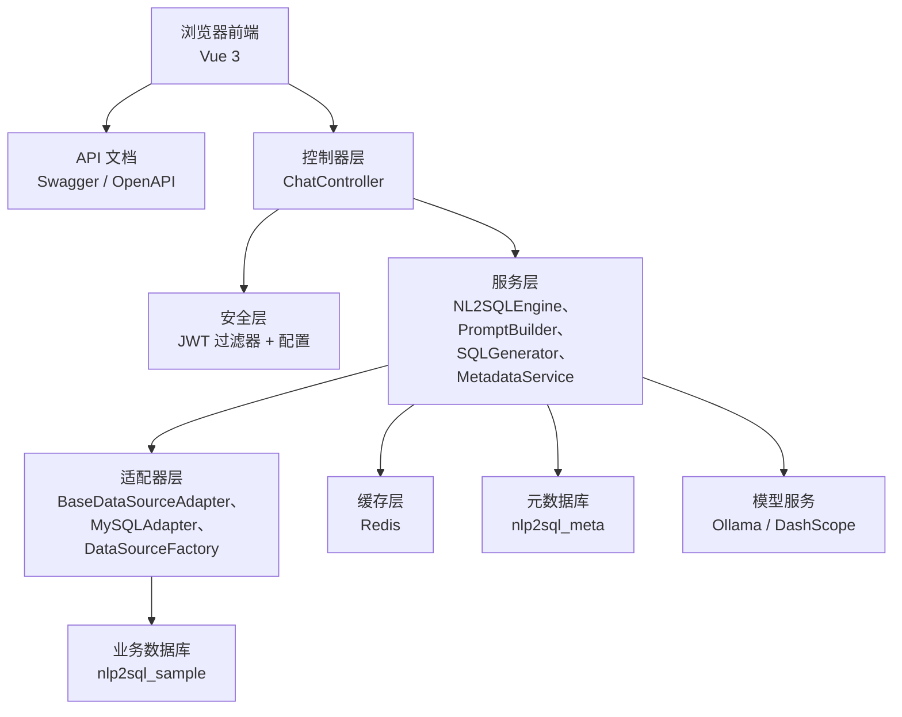
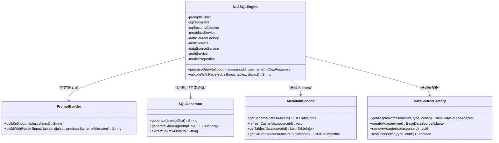
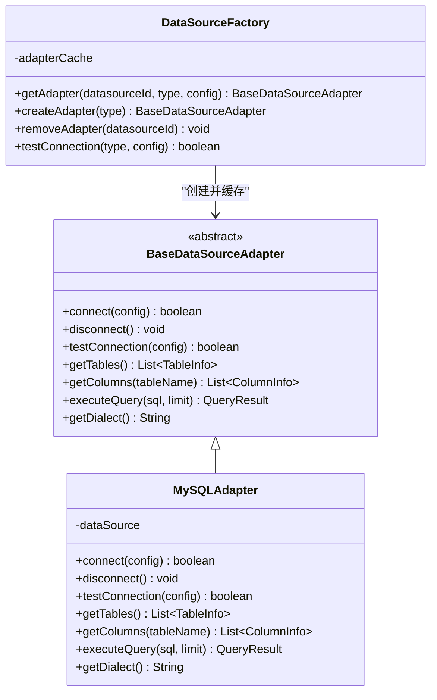
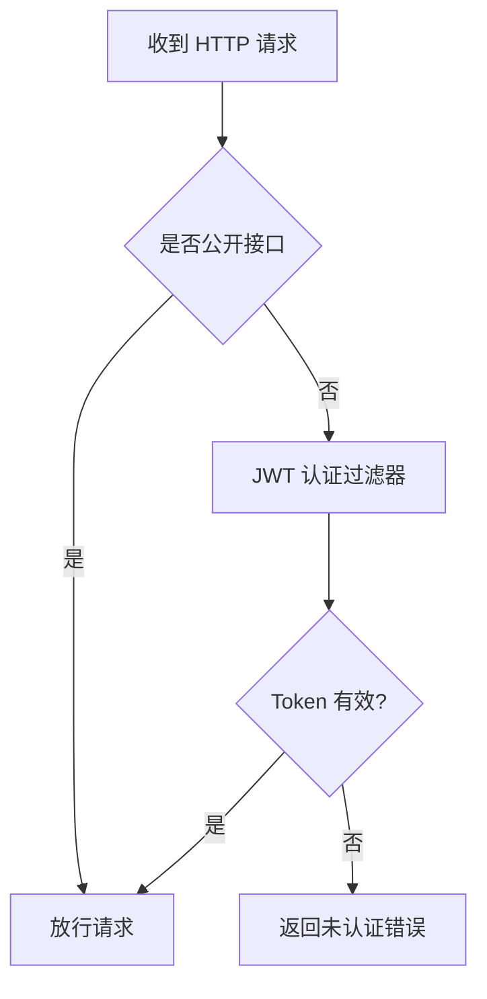
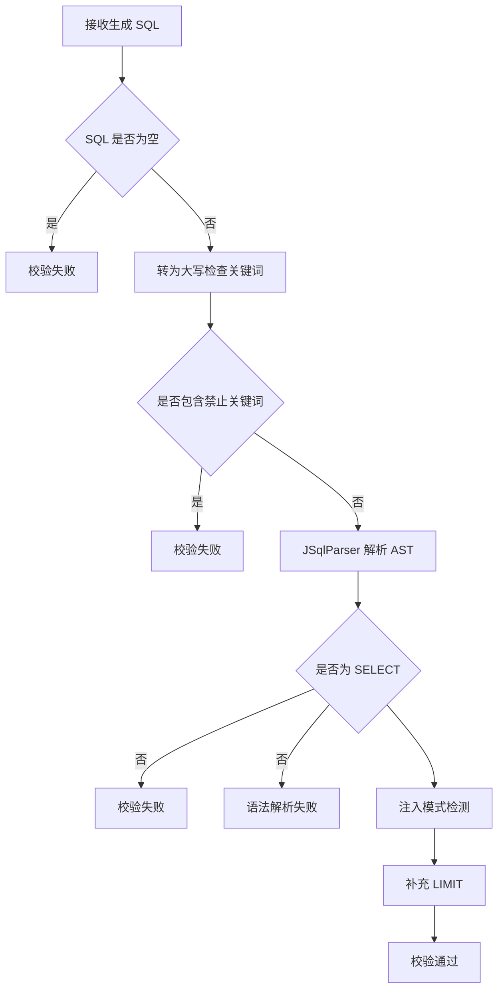
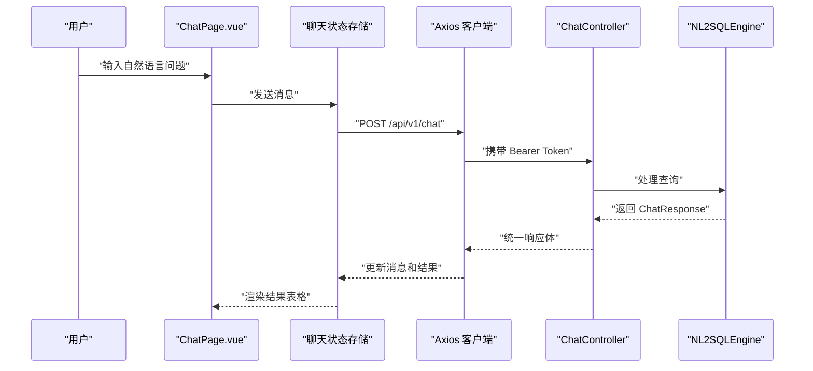
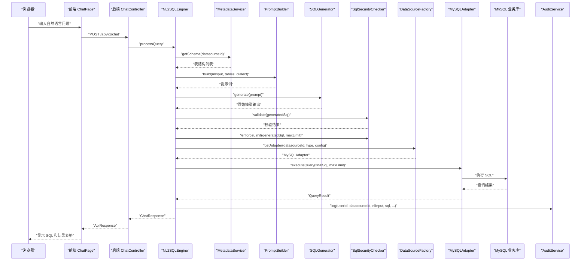
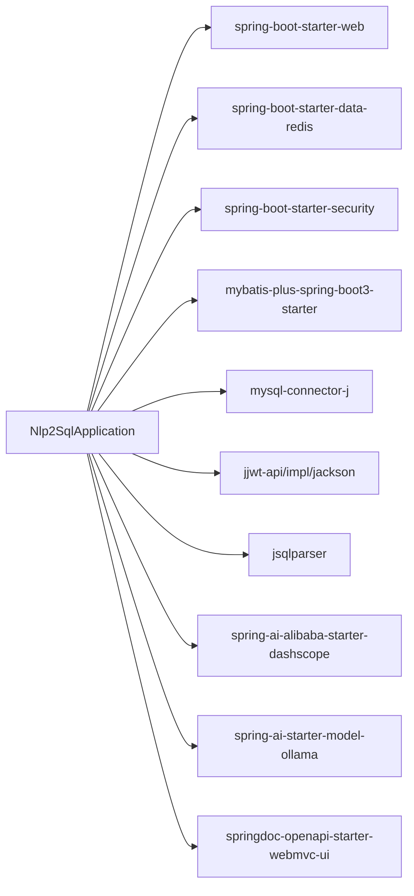

# 项目概览

<cite>
**本文引用的文件**   
- [Nlp2SqlApplication.java](file://backend/src/main/java/com/nlp2sql/Nlp2SqlApplication.java)
- [pom.xml](file://backend/pom.xml)
- [technical_proposal.md](file://docs/technical_proposal.md)
- [user_manual.md](file://docs/user_manual.md)
- [test_report.md](file://docs/test_report.md)
- [init_backend.sql](file://sql/init_backend.sql)
- [mysql_sample.sql](file://sql/sample_data/mysql_sample.sql)
- [ChatController.java](file://backend/src/main/java/com/nlp2sql/controller/ChatController.java)
- [NL2SQLEngine.java](file://backend/src/main/java/com/nlp2sql/service/NL2SQLEngine.java)
- [PromptBuilder.java](file://backend/src/main/java/com/nlp2sql/service/PromptBuilder.java)
- [SQLGenerator.java](file://backend/src/main/java/com/nlp2sql/service/SQLGenerator.java)
- [MetadataService.java](file://backend/src/main/java/com/nlp2sql/service/MetadataService.java)
- [DataSourceFactory.java](file://backend/src/main/java/com/nlp2sql/adapter/DataSourceFactory.java)
- [BaseDataSourceAdapter.java](file://backend/src/main/java/com/nlp2sql/adapter/BaseDataSourceAdapter.java)
- [MySQLAdapter.java](file://backend/src/main/java/com/nlp2sql/adapter/MySQLAdapter.java)
- [SecurityConfig.java](file://backend/src/main/java/com/nlp2sql/config/SecurityConfig.java)
- [client.js](file://frontend/src/api/client.js)
- [ChatPage.vue](file://frontend/src/views/ChatPage.vue)
</cite>

## 目录
1. [简介](#简介)
2. [项目结构](#项目结构)
3. [核心功能与目标](#核心功能与目标)
4. [技术栈选型](#技术栈选型)
5. [系统架构总览](#系统架构总览)
6. [关键组件分析](#关键组件分析)
7. [数据流与交互流程](#数据流与交互流程)
8. [依赖关系分析](#依赖关系分析)
9. [性能与可扩展性](#性能与可扩展性)
10. [使用场景与用例](#使用场景与用例)
11. [故障排查指南](#故障排查指南)
12. [结论](#结论)

## 简介
NL2SQL 智能查询系统的目标是让非技术人员通过自然语言直接查询数据库。用户只需用中文描述问题，系统自动将自然语言转换为 SQL，执行查询并返回结构化结果。系统同时提供对话式前端界面、多数据源适配、JWT 认证、SQL 安全校验和元数据缓存能力，适合业务人员、运营人员和数据分析初学者快速自助取数。

该项目的核心定位不是替代专业数据库开发，而是降低查询门槛：把“写 SQL”的复杂任务交给模型生成，同时用安全策略和适配器机制保证执行可控、可审计、可维护。

**章节来源**
- [technical_proposal.md:1-128](file://docs/technical_proposal.md#L1-L128)
- [user_manual.md:1-136](file://docs/user_manual.md#L1-L136)

## 项目结构
仓库采用前后端分离结构，后端基于 Spring Boot，前端基于 Vue 3；数据库脚本集中在 sql 目录；文档集中在 docs 目录。

**图表来源**
- [pom.xml:1-194](file://backend/pom.xml#L1-L194)
- [technical_proposal.md:85-128](file://docs/technical_proposal.md#L85-L128)

**章节来源**
- [technical_proposal.md:85-128](file://docs/technical_proposal.md#L85-L128)

## 核心功能与目标
- 自然语言转 SQL：用户输入自然语言问题，系统调用大模型生成 SQL。
- 多数据源适配：通过适配器抽象不同数据库实现，当前已支持 MySQL，后续可扩展 PostgreSQL、Hive、HDFS、REST API、GraphQL 等。
- JWT 认证：登录注册后签发无状态令牌，受保护接口需携带 token。
- SQL 安全校验：黑名单、AST 解析、注入模式检测、LIMIT 强制限制。
- 元数据缓存：表结构和字段信息优先从 Redis 缓存读取，减少频繁访问真实数据库。
- 审计日志：记录用户、输入、生成 SQL、校验结果、执行结果和执行耗时。
- 对话式前端：聊天界面展示用户问题、生成的 SQL、查询结果和示例提示。

**章节来源**
- [technical_proposal.md:1-84](file://docs/technical_proposal.md#L1-L84)
- [user_manual.md:1-136](file://docs/user_manual.md#L1-L136)

## 技术栈选型
后端采用 Spring Boot 3.3.4、Java 17、MyBatis-Plus、Redis、JWT、JSqlParser、Spring AI Alibaba 和 Spring AI Ollama 启动器；前端采用 Vue 3、Element Plus、Vite、Pinia、Axios；模型服务使用 qwen2.5-coder:7b，可通过本地 Ollama 或云端 DashScope 接入。

| 层次 | 技术 | 作用 |
|---|---|---|
| 后端框架 | Spring Boot 3.3.4、Java 17 | Web 应用容器、依赖管理、配置中心 |
| ORM | MyBatis-Plus 3.5.7 | 元数据库表操作 |
| 缓存 | Redis 7.x | Schema 元数据缓存 |
| 认证 | JJWT 0.12.6 | 无状态 JWT 认证 |
| SQL 校验 | JSqlParser 4.9 | AST 解析与安全检测 |
| 模型推理 | Spring AI Alibaba、Spring AI Ollama | 对接通义千问 DashScope 和本地 Ollama |
| 前端框架 | Vue 3、Vite、Element Plus、Pinia、Axios | 对话界面、状态管理、HTTP 请求 |
| 数据库 | MySQL 8.0 | 示例业务数据和元数据存储 |

**章节来源**
- [pom.xml:1-194](file://backend/pom.xml#L1-L194)
- [technical_proposal.md:10-33](file://docs/technical_proposal.md#L10-L33)

## 系统架构总览
系统按控制器层、服务层、适配器层分层组织，并通过安全组件、缓存和审计组件形成完整链路。

**图表来源**
- [ChatController.java:1-30](file://backend/src/main/java/com/nlp2sql/controller/ChatController.java#L1-L30)
- [SecurityConfig.java:1-44](file://backend/src/main/java/com/nlp2sql/config/SecurityConfig.java#L1-L44)
- [NL2SQLEngine.java:1-127](file://backend/src/main/java/com/nlp2sql/service/NL2SQLEngine.java#L1-L127)
- [MetadataService.java:1-93](file://backend/src/main/java/com/nlp2sql/service/MetadataService.java#L1-L93)
- [DataSourceFactory.java:1-49](file://backend/src/main/java/com/nlp2sql/adapter/DataSourceFactory.java#L1-L49)
- [MySQLAdapter.java:1-203](file://backend/src/main/java/com/nlp2sql/adapter/MySQLAdapter.java#L1-L203)
- [technical_proposal.md:24-44](file://docs/technical_proposal.md#L24-L44)

## 关键组件分析

### NL2SQL 引擎与服务层
NL2SQLEngine 是核心编排组件，负责获取 Schema、构建提示词、生成 SQL、安全校验、执行查询、记录审计。它协调 PromptBuilder、SQLGenerator、MetadataService、DataSourceFactory、AuthService、AuditService 等组件。

**图表来源**
- [NL2SQLEngine.java:1-127](file://backend/src/main/java/com/nlp2sql/service/NL2SQLEngine.java#L1-L127)
- [PromptBuilder.java:1-73](file://backend/src/main/java/com/nlp2sql/service/PromptBuilder.java#L1-L73)
- [SQLGenerator.java:1-73](file://backend/src/main/java/com/nlp2sql/service/SQLGenerator.java#L1-L73)
- [MetadataService.java:1-93](file://backend/src/main/java/com/nlp2sql/service/MetadataService.java#L1-L93)
- [DataSourceFactory.java:1-49](file://backend/src/main/java/com/nlp2sql/adapter/DataSourceFactory.java#L1-L49)

**章节来源**
- [NL2SQLEngine.java:1-127](file://backend/src/main/java/com/nlp2sql/service/NL2SQLEngine.java#L1-L127)
- [PromptBuilder.java:1-73](file://backend/src/main/java/com/nlp2sql/service/PromptBuilder.java#L1-L73)
- [SQLGenerator.java:1-73](file://backend/src/main/java/com/nlp2sql/service/SQLGenerator.java#L1-L73)

### 多数据源适配器
适配器层定义统一接口，当前实现 MySQL 适配器，使用 Hikari 连接池执行查询、获取表结构和字段信息。DataSourceFactory 根据数据源类型创建适配器，并对适配器实例进行缓存。

**图表来源**
- [BaseDataSourceAdapter.java:1-25](file://backend/src/main/java/com/nlp2sql/adapter/BaseDataSourceAdapter.java#L1-L25)
- [MySQLAdapter.java:1-203](file://backend/src/main/java/com/nlp2sql/adapter/MySQLAdapter.java#L1-L203)
- [DataSourceFactory.java:1-49](file://backend/src/main/java/com/nlp2sql/adapter/DataSourceFactory.java#L1-L49)

**章节来源**
- [BaseDataSourceAdapter.java:1-25](file://backend/src/main/java/com/nlp2sql/adapter/BaseDataSourceAdapter.java#L1-L25)
- [MySQLAdapter.java:1-203](file://backend/src/main/java/com/nlp2sql/adapter/MySQLAdapter.java#L1-L203)
- [DataSourceFactory.java:1-49](file://backend/src/main/java/com/nlp2sql/adapter/DataSourceFactory.java#L1-L49)

### 安全与认证
安全配置启用无状态会话，允许认证接口和 API 文档公开访问，其他接口需要认证。JWT 过滤器在请求进入控制器前完成身份验证。

**图表来源**
- [SecurityConfig.java:1-44](file://backend/src/main/java/com/nlp2sql/config/SecurityConfig.java#L1-L44)

**章节来源**
- [SecurityConfig.java:1-44](file://backend/src/main/java/com/nlp2sql/config/SecurityConfig.java#L1-L44)

### SQL 安全校验
SQL 安全校验包含关键词黑名单、AST 解析、堆叠查询检测、UNION 注入检测，并在最终执行前对缺少 LIMIT 的查询强制追加上限。

**图表来源**
- [SQLGenerator.java:1-73](file://backend/src/main/java/com/nlp2sql/service/SQLGenerator.java#L1-L73)

**章节来源**
- [SQLGenerator.java:1-73](file://backend/src/main/java/com/nlp2sql/service/SQLGenerator.java#L1-L73)

### 前端对话界面
前端通过 Axios 客户端统一封装请求，自动添加 Authorization 头，处理 401 跳转登录。聊天页面选择数据源、发送消息、滚动到底部、展示示例问题，并与后端聊天接口交互。

**图表来源**
- [ChatPage.vue:1-179](file://frontend/src/views/ChatPage.vue#L1-L179)
- [client.js:1-48](file://frontend/src/api/client.js#L1-L48)
- [ChatController.java:1-30](file://backend/src/main/java/com/nlp2sql/controller/ChatController.java#L1-L30)
- [NL2SQLEngine.java:1-127](file://backend/src/main/java/com/nlp2sql/service/NL2SQLEngine.java#L1-L127)

**章节来源**
- [client.js:1-48](file://frontend/src/api/client.js#L1-L48)
- [ChatPage.vue:1-179](file://frontend/src/views/ChatPage.vue#L1-L179)

## 数据流与交互流程
一次完整的 NL2SQL 查询流程如下：

**图表来源**
- [ChatController.java:1-30](file://backend/src/main/java/com/nlp2sql/controller/ChatController.java#L1-L30)
- [NL2SQLEngine.java:1-127](file://backend/src/main/java/com/nlp2sql/service/NL2SQLEngine.java#L1-L127)
- [MetadataService.java:1-93](file://backend/src/main/java/com/nlp2sql/service/MetadataService.java#L1-L93)
- [PromptBuilder.java:1-73](file://backend/src/main/java/com/nlp2sql/service/PromptBuilder.java#L1-L73)
- [SQLGenerator.java:1-73](file://backend/src/main/java/com/nlp2sql/service/SQLGenerator.java#L1-L73)
- [DataSourceFactory.java:1-49](file://backend/src/main/java/com/nlp2sql/adapter/DataSourceFactory.java#L1-L49)
- [MySQLAdapter.java:1-203](file://backend/src/main/java/com/nlp2sql/adapter/MySQLAdapter.java#L1-L203)

## 依赖关系分析
后端依赖包括 Spring Boot Starter Web、Redis、Security、Validation、MyBatis-Plus、MySQL 驱动、JJWT、JSqlParser、Spring AI Alibaba、Spring AI Ollama、SpringDoc、Lombok、Jackson 和测试依赖。

**图表来源**
- [pom.xml:1-194](file://backend/pom.xml#L1-L194)

**章节来源**
- [pom.xml:1-194](file://backend/pom.xml#L1-L194)

## 性能与可扩展性
- 元数据缓存：MetadataService 优先从 Redis 读取 Schema，降低频繁访问业务数据库的开销。
- 适配器缓存：DataSourceFactory 对每个数据源的适配器实例进行缓存，避免重复创建连接池。
- SQL 重试：当 SQL 校验失败时，NL2SQLEngine 会根据错误信息重新构建提示词并调用模型重试。
- 模型流式输出：SQLGenerator 支持流式输出，便于未来扩展前端逐步显示模型生成内容。
- 可扩展数据源：新增数据源只需继承 BaseDataSourceAdapter 并在 DataSourceFactory 中注册。
- 限流与超时：MySQLAdapter 设置查询超时，NL2SQLEngine 支持最大行数限制。

**章节来源**
- [MetadataService.java:1-93](file://backend/src/main/java/com/nlp2sql/service/MetadataService.java#L1-L93)
- [DataSourceFactory.java:1-49](file://backend/src/main/java/com/nlp2sql/adapter/DataSourceFactory.java#L1-L49)
- [NL2SQLEngine.java:1-127](file://backend/src/main/java/com/nlp2sql/service/NL2SQLEngine.java#L1-L127)
- [MySQLAdapter.java:1-203](file://backend/src/main/java/com/nlp2sql/adapter/MySQLAdapter.java#L1-L203)

## 使用场景与用例
- 简单查询：例如“查询所有用户”“显示所有产品信息”。
- 条件过滤：例如“查询年龄大于 25 岁的用户”“查找状态为已完成的订单”。
- 聚合统计：例如“统计每个部门的用户数量”“计算每个月的订单总金额”。
- TOP-N 排序：例如“查询消费金额最高的 10 个用户”“显示最近的 5 笔订单”。
- 关联查询：例如“查询每个订单对应的用户姓名”“显示每个用户购买的产品列表”。
- 模糊匹配：例如“查询姓张的用户”“查找包含手机的產品”。

这些用例可在对话页面直接输入，或通过示例标签快速填充。

**章节来源**
- [user_manual.md:56-103](file://docs/user_manual.md#L56-L103)

## 故障排查指南
- 登录过期：前端拦截到 401 会清除本地 token 并跳转登录页。
- 数据源连接失败：检查数据库服务地址、端口、用户名、密码、防火墙和数据库权限。
- 查询结果不正确：尝试更具体地描述问题，明确表名和字段名。
- 系统无法理解查询：模型可能无法识别复杂语义，建议简化问题或拆分查询。
- 查询很慢：首次查询需要调用模型生成 SQL，可能耗时较长；后续相同类型查询更快。
- 只读限制：系统仅允许 SELECT，禁止 INSERT、UPDATE、DELETE、DROP 等修改操作。
- 元数据缓存异常：Redis 读取失败时会降级访问数据库并重新写入缓存。

**章节来源**
- [client.js:1-48](file://frontend/src/api/client.js#L1-L48)
- [user_manual.md:104-136](file://docs/user_manual.md#L104-L136)
- [MetadataService.java:1-93](file://backend/src/main/java/com/nlp2sql/service/MetadataService.java#L1-L93)

## 结论
NL2SQL 智能查询系统通过控制器层、服务层、适配器层清晰分层，结合 JWT 认证、SQL 安全校验、元数据缓存和多数据源适配，为业务用户提供安全的自然语言查询体验。对于初学者，系统降低了 SQL 编写门槛；对于有经验的开发者，项目提供了可扩展的数据源适配、提示词工程、模型调用和安全校验实现，便于继续扩展更多数据源、优化模型效果和增强系统稳定性。